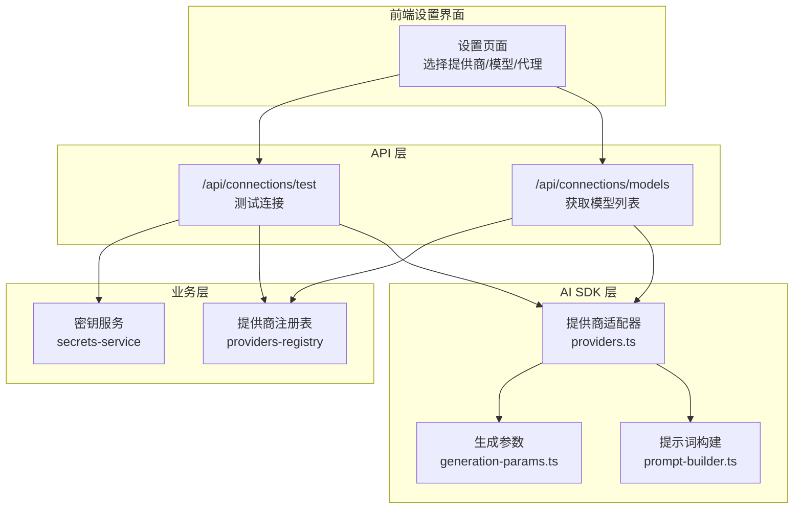
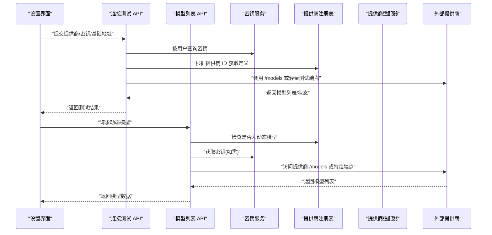
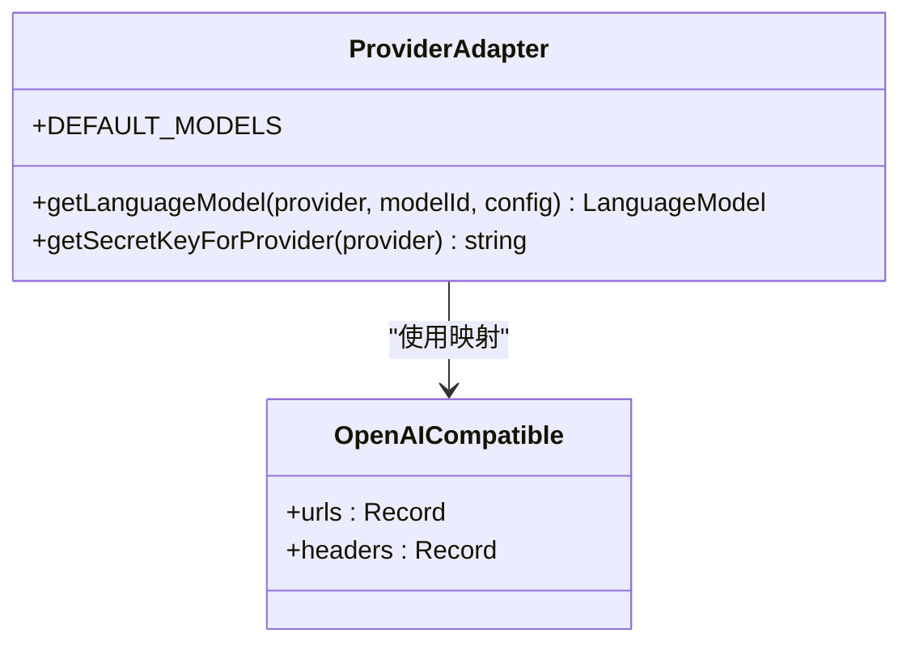
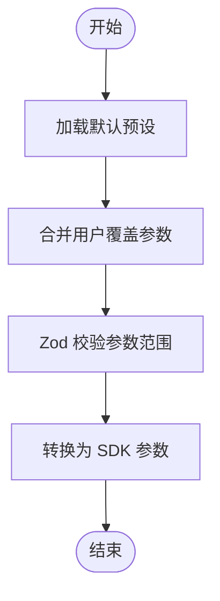
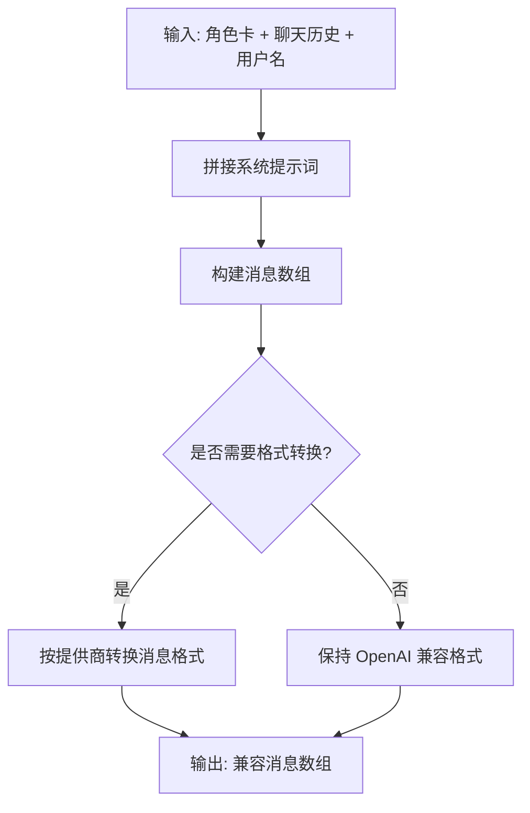
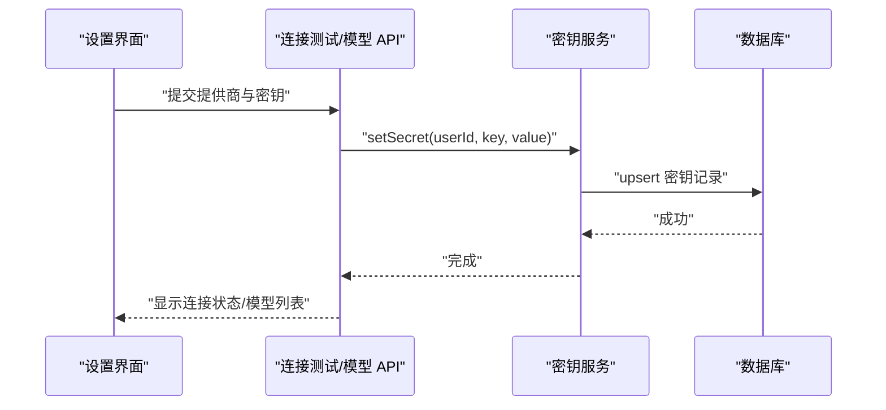
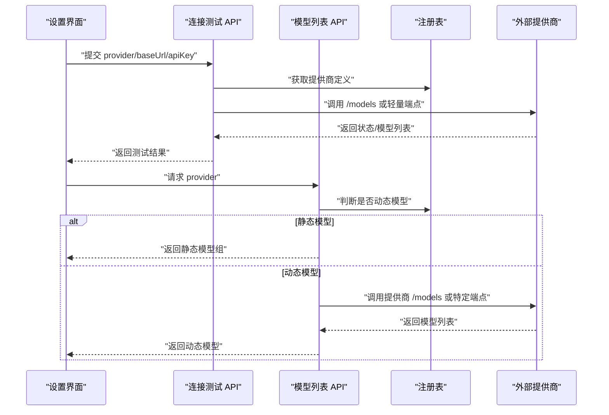
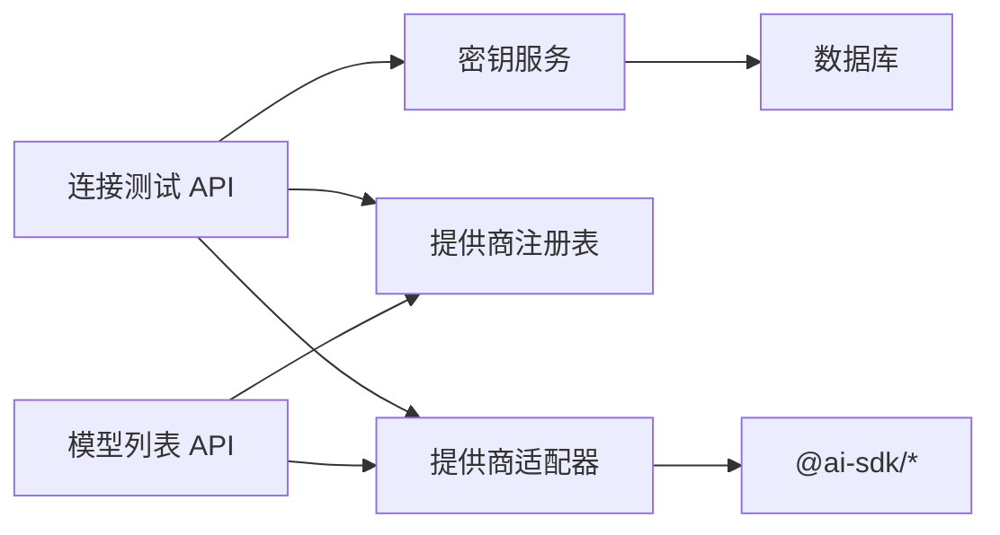

# AI 提供商集成

<cite>
**本文引用的文件**
- [src/lib/ai/providers.ts](file://src/lib/ai/providers.ts)
- [src/lib/ai/generation-params.ts](file://src/lib/ai/generation-params.ts)
- [src/lib/ai/prompt-builder.ts](file://src/lib/ai/prompt-builder.ts)
- [src/lib/constants/providers-registry.ts](file://src/lib/constants/providers-registry.ts)
- [src/lib/services/secrets-service.ts](file://src/lib/services/secrets-service.ts)
- [src/app/api/connections/test/route.ts](file://src/app/api/connections/test/route.ts)
- [src/app/api/connections/models/route.ts](file://src/app/api/connections/models/route.ts)
- [src/types/api-connections.ts](file://src/types/api-connections.ts)
- [src/lib/config.ts](file://src/lib/config.ts)
</cite>

## 目录
1. [简介](#简介)
2. [项目结构](#项目结构)
3. [核心组件](#核心组件)
4. [架构总览](#架构总览)
5. [详细组件分析](#详细组件分析)
6. [依赖关系分析](#依赖关系分析)
7. [性能考量](#性能考量)
8. [故障排除指南](#故障排除指南)
9. [结论](#结论)
10. [附录](#附录)

## 简介
本文件面向 SillyTavern Next 的 AI 提供商集成，系统性说明以下内容：
- 支持的 35+ AI 服务提供商与统一 Provider 适配器设计
- 认证密钥管理与安全策略
- 流式响应处理、请求参数映射与错误处理机制
- 本地模型支持（如 Ollama）
- 新 Provider 添加流程、配置管理与性能监控建议
- 最佳实践与故障排除指南

## 项目结构
围绕 AI 提供商集成的关键目录与文件如下：
- 提示词与参数：src/lib/ai/prompt-builder.ts、src/lib/ai/generation-params.ts
- 提供商适配器：src/lib/ai/providers.ts、src/lib/constants/providers-registry.ts
- 密钥管理：src/lib/services/secrets-service.ts
- 连接测试与模型拉取：src/app/api/connections/test/route.ts、src/app/api/connections/models/route.ts
- 类型与配置：src/types/api-connections.ts、src/lib/config.ts

图表来源
- [src/app/api/connections/test/route.ts:1-149](file://src/app/api/connections/test/route.ts#L1-L149)
- [src/app/api/connections/models/route.ts:1-132](file://src/app/api/connections/models/route.ts#L1-L132)
- [src/lib/services/secrets-service.ts:1-116](file://src/lib/services/secrets-service.ts#L1-L116)
- [src/lib/constants/providers-registry.ts](file://src/lib/constants/providers-registry.ts)
- [src/lib/ai/providers.ts:1-174](file://src/lib/ai/providers.ts#L1-L174)
- [src/lib/ai/generation-params.ts:1-165](file://src/lib/ai/generation-params.ts#L1-L165)
- [src/lib/ai/prompt-builder.ts:1-326](file://src/lib/ai/prompt-builder.ts#L1-L326)

章节来源
- [src/app/api/connections/test/route.ts:1-149](file://src/app/api/connections/test/route.ts#L1-L149)
- [src/app/api/connections/models/route.ts:1-132](file://src/app/api/connections/models/route.ts#L1-L132)
- [src/lib/services/secrets-service.ts:1-116](file://src/lib/services/secrets-service.ts#L1-L116)
- [src/lib/ai/providers.ts:1-174](file://src/lib/ai/providers.ts#L1-L174)
- [src/lib/ai/generation-params.ts:1-165](file://src/lib/ai/generation-params.ts#L1-L165)
- [src/lib/ai/prompt-builder.ts:1-326](file://src/lib/ai/prompt-builder.ts#L1-L326)
- [src/lib/constants/providers-registry.ts](file://src/lib/constants/providers-registry.ts)
- [src/types/api-connections.ts:1-136](file://src/types/api-connections.ts#L1-L136)
- [src/lib/config.ts:1-184](file://src/lib/config.ts#L1-L184)

## 核心组件
- 提供商适配器与 URL 映射：统一通过适配器创建语言模型实例，并对 OpenAI 兼容提供商进行 Base URL 与额外请求头的映射。
- 生成参数与预设：集中管理温度、topP、最大输出等参数，支持默认预设与用户覆盖合并。
- 提示词构建：将角色卡与聊天历史转换为 AI SDK 兼容的消息数组，并针对不同提供商做消息格式转换。
- 密钥管理：基于 Drizzle ORM 的用户密钥存储，支持按用户维度的密钥增删改查。
- 连接测试与模型拉取：提供统一的连接测试与动态模型列表获取能力，支持静态与动态模型两种模式。

章节来源
- [src/lib/ai/providers.ts:1-174](file://src/lib/ai/providers.ts#L1-L174)
- [src/lib/ai/generation-params.ts:1-165](file://src/lib/ai/generation-params.ts#L1-L165)
- [src/lib/ai/prompt-builder.ts:1-326](file://src/lib/ai/prompt-builder.ts#L1-L326)
- [src/lib/services/secrets-service.ts:1-116](file://src/lib/services/secrets-service.ts#L1-L116)
- [src/app/api/connections/test/route.ts:1-149](file://src/app/api/connections/test/route.ts#L1-L149)
- [src/app/api/connections/models/route.ts:1-132](file://src/app/api/connections/models/route.ts#L1-L132)

## 架构总览
下图展示从设置界面到 API、再到提供商适配器与外部服务的整体调用链路。

图表来源
- [src/app/api/connections/test/route.ts:1-149](file://src/app/api/connections/test/route.ts#L1-L149)
- [src/app/api/connections/models/route.ts:1-132](file://src/app/api/connections/models/route.ts#L1-L132)
- [src/lib/services/secrets-service.ts:1-116](file://src/lib/services/secrets-service.ts#L1-L116)
- [src/lib/constants/providers-registry.ts](file://src/lib/constants/providers-registry.ts)
- [src/lib/ai/providers.ts:1-174](file://src/lib/ai/providers.ts#L1-L174)

## 详细组件分析

### 提供商适配器与统一接口
- 设计要点
  - 通过适配器工厂方法创建不同提供商的语言模型实例。
  - 对 OpenAI 兼容提供商进行 Base URL 与请求头映射，减少重复实现。
  - 提供默认模型映射，便于快速初始化。
- 关键行为
  - 适配器根据提供商类型选择对应 SDK 创建器（如 OpenAI、Anthropic、Google）。
  - 对 OpenAI 兼容类型，自动应用已知的 Base URL 与必要请求头。
  - 提供密钥名称映射，确保密钥存储键一致。

图表来源
- [src/lib/ai/providers.ts:1-174](file://src/lib/ai/providers.ts#L1-L174)

章节来源
- [src/lib/ai/providers.ts:1-174](file://src/lib/ai/providers.ts#L1-L174)

### 生成参数与预设系统
- 设计要点
  - 使用 Zod Schema 校验与约束参数范围。
  - 内置多套默认预设（创意、均衡、精确、确定性），覆盖常见场景。
  - 支持按提供商定制默认参数，OpenAI 兼容类型采用通用默认值。
  - 提供参数合并逻辑，允许用户覆盖默认预设。
- 关键行为
  - 将生成参数转换为 Vercel AI SDK 的 streamText 参数。
  - 合并预设与用户覆盖，形成最终调用参数。

图表来源
- [src/lib/ai/generation-params.ts:1-165](file://src/lib/ai/generation-params.ts#L1-L165)

章节来源
- [src/lib/ai/generation-params.ts:1-165](file://src/lib/ai/generation-params.ts#L1-L165)

### 提示词构建与消息格式转换
- 设计要点
  - 将角色卡数据与聊天历史组装为系统提示词与消息数组。
  - 支持示例对话解析、历史合并与名称嵌入。
  - 针对不同提供商（如 Claude、Gemini）进行消息格式转换，保证兼容性。
- 关键行为
  - 构建系统提示词（角色描述、人格、场景、示例、post-history 指令等）。
  - 将消息数组转换为 AI SDK 兼容格式，或按提供商要求转换为 Claude/Gemini 格式。
  - 合并连续相同角色消息以优化 token 使用。

图表来源
- [src/lib/ai/prompt-builder.ts:1-326](file://src/lib/ai/prompt-builder.ts#L1-L326)

章节来源
- [src/lib/ai/prompt-builder.ts:1-326](file://src/lib/ai/prompt-builder.ts#L1-L326)

### 密钥管理与安全策略
- 设计要点
  - 基于 Drizzle ORM 的密钥表，按用户维度存储敏感信息。
  - 提供密钥的增删改查与批量获取能力。
  - 通过标准密钥名称常量统一密钥键名，避免分散硬编码。
- 关键行为
  - 设置密钥时执行 upsert，确保幂等。
  - 获取密钥时仅返回值，不暴露到前端。
  - 连接测试与模型拉取时按需从数据库读取密钥。

图表来源
- [src/lib/services/secrets-service.ts:1-116](file://src/lib/services/secrets-service.ts#L1-L116)
- [src/app/api/connections/test/route.ts:1-149](file://src/app/api/connections/test/route.ts#L1-L149)
- [src/app/api/connections/models/route.ts:1-132](file://src/app/api/connections/models/route.ts#L1-L132)

章节来源
- [src/lib/services/secrets-service.ts:1-116](file://src/lib/services/secrets-service.ts#L1-L116)
- [src/app/api/connections/test/route.ts:1-149](file://src/app/api/connections/test/route.ts#L1-L149)
- [src/app/api/connections/models/route.ts:1-132](file://src/app/api/connections/models/route.ts#L1-L132)

### 连接测试与动态模型拉取
- 设计要点
  - 连接测试：根据提供商类型构造不同端点与头部，尝试最小化请求验证密钥有效性与可用性。
  - 动态模型拉取：对静态模型提供商直接返回注册表中的模型组；对动态模型提供商，按提供商差异调用不同端点（如 /models、/api/tags、OpenRouter API）。
- 关键行为
  - 测试阶段捕获 HTTP 错误码并返回可读错误信息。
  - 拉取模型时对返回数据进行清洗与映射，确保 id/name 一致性。

图表来源
- [src/app/api/connections/test/route.ts:1-149](file://src/app/api/connections/test/route.ts#L1-L149)
- [src/app/api/connections/models/route.ts:1-132](file://src/app/api/connections/models/route.ts#L1-L132)
- [src/lib/constants/providers-registry.ts](file://src/lib/constants/providers-registry.ts)

章节来源
- [src/app/api/connections/test/route.ts:1-149](file://src/app/api/connections/test/route.ts#L1-L149)
- [src/app/api/connections/models/route.ts:1-132](file://src/app/api/connections/models/route.ts#L1-L132)

### 类型与配置体系
- 类型定义
  - API 大类与提供商注册条目，包含是否需要 API Key、Base URL、模型组、额外字段等。
  - 连接状态、用户连接配置（含反向代理预设与活动代理）。
- 配置加载
  - 通过 YAML 配置文件与环境变量覆盖，Zod 校验并提供默认值。
  - 支持点分路径读取配置值，便于扩展。

章节来源
- [src/types/api-connections.ts:1-136](file://src/types/api-connections.ts#L1-L136)
- [src/lib/config.ts:1-184](file://src/lib/config.ts#L1-L184)

## 依赖关系分析
- 组件耦合
  - API 层依赖密钥服务与提供商注册表，确保连接测试与模型拉取的正确性。
  - 适配器层与提示词/参数层解耦，通过统一的 LanguageModel 接口与消息格式交互。
- 外部依赖
  - Vercel AI SDK（@ai-sdk/*）用于具体提供商的客户端封装。
  - Drizzle ORM 用于密钥存储。
  - Next.js App Router 路由作为 API 入口。

图表来源
- [src/app/api/connections/test/route.ts:1-149](file://src/app/api/connections/test/route.ts#L1-L149)
- [src/app/api/connections/models/route.ts:1-132](file://src/app/api/connections/models/route.ts#L1-L132)
- [src/lib/services/secrets-service.ts:1-116](file://src/lib/services/secrets-service.ts#L1-L116)
- [src/lib/ai/providers.ts:1-174](file://src/lib/ai/providers.ts#L1-L174)

章节来源
- [src/app/api/connections/test/route.ts:1-149](file://src/app/api/connections/test/route.ts#L1-L149)
- [src/app/api/connections/models/route.ts:1-132](file://src/app/api/connections/models/route.ts#L1-L132)
- [src/lib/services/secrets-service.ts:1-116](file://src/lib/services/secrets-service.ts#L1-L116)
- [src/lib/ai/providers.ts:1-174](file://src/lib/ai/providers.ts#L1-L174)

## 性能考量
- 模型列表缓存
  - 对动态模型提供商建议在用户侧缓存最近一次获取的模型列表，减少频繁请求。
- 超时与重试
  - API 层已设置超时，建议在调用方增加指数退避重试策略，避免瞬时网络波动影响体验。
- 参数优化
  - 合理设置 maxOutputTokens 与 temperature，避免过长响应导致内存压力。
  - 合并连续消息减少 token 占用。
- 本地模型
  - Ollama 等本地服务建议固定端口与健康检查，避免阻塞主线程。

## 故障排除指南
- 常见问题
  - 401/403：检查密钥是否正确、是否被提供商禁用或额度耗尽。
  - 无法获取模型：确认 Base URL 正确、网络可达、是否需要额外请求头。
  - 动态模型为空：确认提供商支持 /models 端点或特殊端点（如 Ollama 的 /api/tags）。
- 排查步骤
  - 使用连接测试 API 验证密钥与基础地址。
  - 查看模型列表 API 返回的错误信息与来源（静态/动态）。
  - 在密钥服务中核对用户密钥是否存在且未被删除。
- 日志与可观测性
  - API 层已记录错误堆栈，可在日志中定位具体异常。
  - 建议在网关或反向代理层添加请求追踪 ID，便于跨服务排查。

章节来源
- [src/app/api/connections/test/route.ts:1-149](file://src/app/api/connections/test/route.ts#L1-L149)
- [src/app/api/connections/models/route.ts:1-132](file://src/app/api/connections/models/route.ts#L1-L132)
- [src/lib/services/secrets-service.ts:1-116](file://src/lib/services/secrets-service.ts#L1-L116)

## 结论
本集成方案通过统一的提供商适配器、标准化的生成参数与提示词构建、以及完善的密钥管理与 API 测试/模型拉取能力，实现了对 35+ 提供商的高效支持。配合本地模型（如 Ollama）与可扩展的注册表，既满足多生态兼容，又兼顾安全性与可维护性。建议在生产环境中结合缓存、超时与重试策略，持续优化性能与稳定性。

## 附录

### 新提供商添加流程
- 注册表扩展
  - 在提供商注册表中新增条目，定义提供商 ID、名称、分类、是否需要 API Key、默认 Base URL、模型组或标记为动态、额外字段等。
- 适配器与密钥映射
  - 如为 OpenAI 兼容类型，补充 Base URL 映射与必要请求头。
  - 在密钥映射函数中添加对应密钥键名。
- API 行为
  - 若为动态模型，完善模型拉取 API 的分支逻辑（如特殊端点）。
  - 在连接测试 API 中补充该提供商的最小化验证逻辑。
- 类型与配置
  - 更新类型定义以反映新增字段或行为变化。
  - 如需，扩展用户连接配置以支持该提供商的特有设置。

章节来源
- [src/lib/constants/providers-registry.ts](file://src/lib/constants/providers-registry.ts)
- [src/lib/ai/providers.ts:1-174](file://src/lib/ai/providers.ts#L1-L174)
- [src/app/api/connections/models/route.ts:1-132](file://src/app/api/connections/models/route.ts#L1-L132)
- [src/app/api/connections/test/route.ts:1-149](file://src/app/api/connections/test/route.ts#L1-L149)
- [src/types/api-connections.ts:1-136](file://src/types/api-connections.ts#L1-L136)