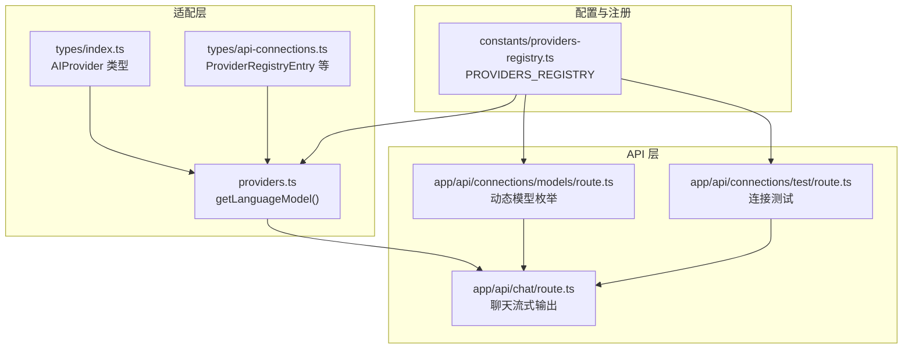
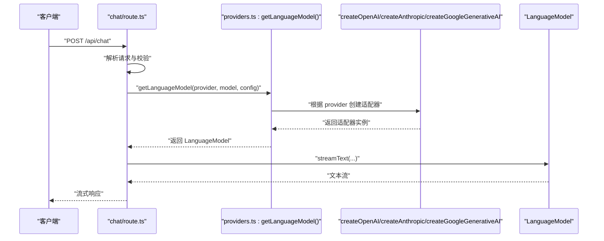
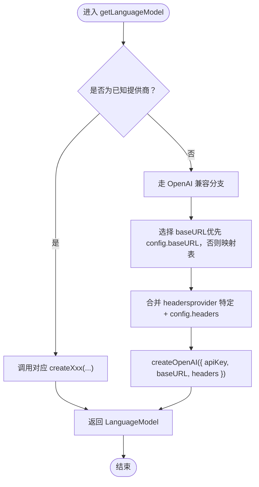
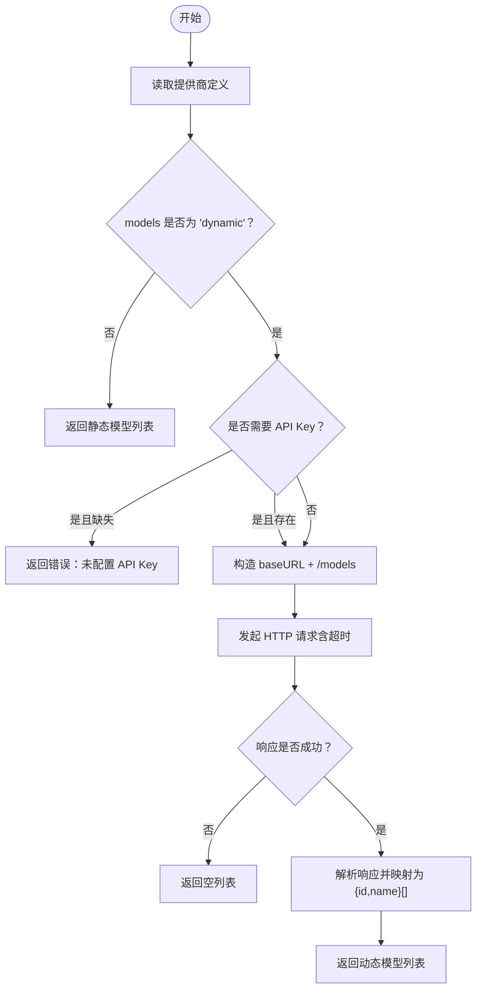
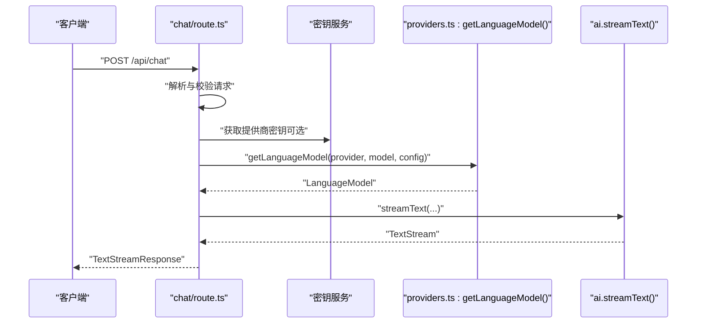
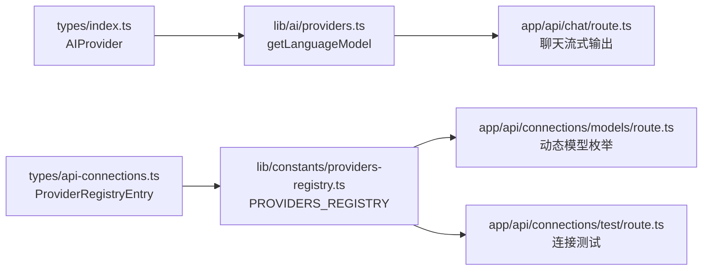

# Provider 适配器设计

<cite>
**本文引用的文件**
- [src/lib/ai/providers.ts](file://src/lib/ai/providers.ts)
- [src/types/index.ts](file://src/types/index.ts)
- [src/types/api-connections.ts](file://src/types/api-connections.ts)
- [src/lib/constants/providers-registry.ts](file://src/lib/constants/providers-registry.ts)
- [src/app/api/chat/route.ts](file://src/app/api/chat/route.ts)
- [src/app/api/connections/models/route.ts](file://src/app/api/connections/models/route.ts)
- [src/app/api/connections/test/route.ts](file://src/app/api/connections/test/route.ts)
</cite>

## 目录
1. [简介](#简介)
2. [项目结构](#项目结构)
3. [核心组件](#核心组件)
4. [架构总览](#架构总览)
5. [详细组件分析](#详细组件分析)
6. [依赖关系分析](#依赖关系分析)
7. [性能考量](#性能考量)
8. [故障排查指南](#故障排查指南)
9. [结论](#结论)
10. [附录：扩展指南与新增提供商流程](#附录扩展指南与新增提供商流程)

## 简介
本文件系统性阐述 AI Provider 适配器的设计与实现，覆盖统一接口设计原理、工厂模式、OpenAI 兼容性处理机制，以及 getLanguageModel 的工作流程。文档还详细说明 Base URL 映射表、额外请求头配置、不同提供商的 API 差异处理、模型 ID 映射与参数标准化，并提供适配器扩展指南与新增提供商的完整流程。

## 项目结构
该适配器系统围绕“统一接口 + 工厂函数 + 配置映射”组织，关键模块如下：
- 适配器工厂与配置：src/lib/ai/providers.ts
- 类型定义：src/types/index.ts、src/types/api-connections.ts
- 提供商注册表：src/lib/constants/providers-registry.ts
- API 使用入口：src/app/api/chat/route.ts
- 模型枚举与动态拉取：src/app/api/connections/models/route.ts
- 连接测试：src/app/api/connections/test/route.ts

**图表来源**
- [src/lib/ai/providers.ts:58-97](file://src/lib/ai/providers.ts#L58-L97)
- [src/types/index.ts:4-50](file://src/types/index.ts#L4-L50)
- [src/types/api-connections.ts:41-58](file://src/types/api-connections.ts#L41-L58)
- [src/lib/constants/providers-registry.ts:722-749](file://src/lib/constants/providers-registry.ts#L722-L749)
- [src/app/api/chat/route.ts:50-176](file://src/app/api/chat/route.ts#L50-L176)
- [src/app/api/connections/models/route.ts:11-132](file://src/app/api/connections/models/route.ts#L11-L132)
- [src/app/api/connections/test/route.ts:10-41](file://src/app/api/connections/test/route.ts#L10-L41)

**章节来源**
- [src/lib/ai/providers.ts:1-174](file://src/lib/ai/providers.ts#L1-L174)
- [src/types/index.ts:4-50](file://src/types/index.ts#L4-L50)
- [src/types/api-connections.ts:41-58](file://src/types/api-connections.ts#L41-L58)
- [src/lib/constants/providers-registry.ts:722-749](file://src/lib/constants/providers-registry.ts#L722-L749)
- [src/app/api/chat/route.ts:50-176](file://src/app/api/chat/route.ts#L50-L176)
- [src/app/api/connections/models/route.ts:11-132](file://src/app/api/connections/models/route.ts#L11-L132)
- [src/app/api/connections/test/route.ts:10-41](file://src/app/api/connections/test/route.ts#L10-L41)

## 核心组件
- 统一接口与工厂函数：getLanguageModel
- OpenAI 兼容映射表：OPENAI_COMPATIBLE_URLS
- 额外请求头：PROVIDER_HEADERS
- 提供商密钥映射：getSecretKeyForProvider
- 默认模型映射：DEFAULT_MODELS
- 提供商注册表：PROVIDERS_REGISTRY
- 动态模型枚举：fetchRemoteModels

**章节来源**
- [src/lib/ai/providers.ts:58-97](file://src/lib/ai/providers.ts#L58-L97)
- [src/lib/ai/providers.ts:18-45](file://src/lib/ai/providers.ts#L18-L45)
- [src/lib/ai/providers.ts:102-150](file://src/lib/ai/providers.ts#L102-L150)
- [src/lib/ai/providers.ts:153-174](file://src/lib/ai/providers.ts#L153-L174)
- [src/lib/constants/providers-registry.ts:722-749](file://src/lib/constants/providers-registry.ts#L722-L749)
- [src/app/api/connections/models/route.ts:65-131](file://src/app/api/connections/models/route.ts#L65-L131)

## 架构总览
适配器系统通过工厂函数将“提供商类型 + 模型 ID + 配置”转换为统一的 LanguageModel 实例，从而屏蔽各提供商差异。OpenAI 兼容提供商通过统一的 OpenAI 适配器包装，结合 Base URL 映射与额外请求头实现兼容。

**图表来源**
- [src/app/api/chat/route.ts:153-168](file://src/app/api/chat/route.ts#L153-L168)
- [src/lib/ai/providers.ts:58-97](file://src/lib/ai/providers.ts#L58-L97)

## 详细组件分析

### 组件 A：统一接口与工厂模式（getLanguageModel）
- 设计原则
  - 单一职责：将提供商类型映射为具体适配器实例
  - 开闭原则：新增提供商只需在映射表或默认分支中扩展
  - 参数标准化：统一接收 apiKey、baseURL、headers
- 关键实现
  - 明确分支：anthropic、google、openai
  - 默认分支：OpenAI 兼容提供商，自动选择 Base URL 与合并 headers
  - 返回值：LanguageModel，供上层统一调用

**图表来源**
- [src/lib/ai/providers.ts:58-97](file://src/lib/ai/providers.ts#L58-L97)
- [src/lib/ai/providers.ts:18-45](file://src/lib/ai/providers.ts#L18-L45)
- [src/lib/ai/providers.ts:47-53](file://src/lib/ai/providers.ts#L47-L53)

**章节来源**
- [src/lib/ai/providers.ts:58-97](file://src/lib/ai/providers.ts#L58-L97)

### 组件 B：Base URL 映射表与额外请求头
- Base URL 映射表（OPENAI_COMPATIBLE_URLS）
  - 覆盖 openrouter、groq、deepseek、xai、perplexity、fireworks、moonshot、siliconflow、minimax、mistral、cohere、zai、nanogpt、electronhub、chutes、pollinations、aimlapi、cometapi、ai21、togetherai、infermaticai、mancer、dreamgen、featherless 等
  - 作用：当提供商未显式提供 baseURL 时，自动选择对应平台的 OpenAI 兼容端点
- 额外请求头（PROVIDER_HEADERS）
  - openrouter：包含 HTTP-Referer 与 X-Title，用于标识来源与应用名
  - 合并策略：config.headers 会覆盖同名键，实现灵活定制

**章节来源**
- [src/lib/ai/providers.ts:18-45](file://src/lib/ai/providers.ts#L18-L45)
- [src/lib/ai/providers.ts:47-53](file://src/lib/ai/providers.ts#L47-L53)

### 组件 C：动态模型枚举与差异处理
- 动态模型枚举（/api/connections/models）
  - 静态模型：直接返回注册表中的 models 列表
  - 动态模型：按提供商差异调用不同端点
    - Google/VertexAI：/models，VertexAI 需 Authorization 头
    - Ollama：/api/tags
    - OpenRouter：固定端点 https://openrouter.ai/api/v1/models
    - 其他 OpenAI 兼容：/models，带 Authorization 头
- 差异处理要点
  - URL 构造与超时控制
  - 响应结构适配（如 Google 的 models[].name 前缀处理）
  - 错误降级（非 2xx 返回空数组）

**图表来源**
- [src/app/api/connections/models/route.ts:11-132](file://src/app/api/connections/models/route.ts#L11-L132)

**章节来源**
- [src/app/api/connections/models/route.ts:65-131](file://src/app/api/connections/models/route.ts#L65-L131)

### 组件 D：API 使用入口与参数标准化
- 入口：/api/chat
- 参数标准化
  - 温度、最大输出、topP、频率/出现惩罚、停止序列、系统提示
  - 支持自定义 baseURL 与 API Key（优先使用传入值）
  - 本地提供商（如 ollama、koboldcpp 等）可无需 API Key
- 错误处理
  - 未授权、参数校验失败、内部错误均有明确响应

**图表来源**
- [src/app/api/chat/route.ts:50-176](file://src/app/api/chat/route.ts#L50-L176)
- [src/lib/ai/providers.ts:58-97](file://src/lib/ai/providers.ts#L58-L97)

**章节来源**
- [src/app/api/chat/route.ts:50-176](file://src/app/api/chat/route.ts#L50-L176)

### 组件 E：提供商注册表与模型分组
- 注册表（PROVIDERS_REGISTRY）
  - 按类别划分：chat_completion、text_completion、novelai、ai_horde、kobold_classic
  - 每个提供商包含：id、name、category、requiresApiKey、requiresBaseUrl、secretKey、models（静态或 dynamic）、默认 Base URL、文档链接、额外字段等
- 模型分组
  - 静态模型以分组形式呈现（如 GPT-4o、Gemini 2.5 等）
  - 动态模型通过 /models 接口拉取

**章节来源**
- [src/lib/constants/providers-registry.ts:722-749](file://src/lib/constants/providers-registry.ts#L722-L749)
- [src/types/api-connections.ts:27-36](file://src/types/api-connections.ts#L27-L36)

## 依赖关系分析
- 类型依赖
  - AIProvider 来源于 types/index.ts，覆盖所有提供商
  - ProviderRegistryEntry 来源于 types/api-connections.ts，描述提供商配置
- 工厂依赖
  - getLanguageModel 依赖 @ai-sdk 的 createOpenAI、createAnthropic、createGoogleGenerativeAI
  - OPENAI_COMPATIBLE_URLS 与 PROVIDER_HEADERS 作为外部配置
- API 依赖
  - /api/chat 依赖 getLanguageModel 与密钥服务
  - /api/connections/models 依赖 providers-registry 与远端提供商 API
  - /api/connections/test 依赖 providers-registry 与远端提供商 API

**图表来源**
- [src/types/index.ts:4-50](file://src/types/index.ts#L4-L50)
- [src/types/api-connections.ts:41-58](file://src/types/api-connections.ts#L41-L58)
- [src/lib/constants/providers-registry.ts:722-749](file://src/lib/constants/providers-registry.ts#L722-L749)
- [src/lib/ai/providers.ts:58-97](file://src/lib/ai/providers.ts#L58-L97)
- [src/app/api/chat/route.ts:50-176](file://src/app/api/chat/route.ts#L50-L176)
- [src/app/api/connections/models/route.ts:11-132](file://src/app/api/connections/models/route.ts#L11-L132)
- [src/app/api/connections/test/route.ts:10-41](file://src/app/api/connections/test/route.ts#L10-L41)

**章节来源**
- [src/types/index.ts:4-50](file://src/types/index.ts#L4-L50)
- [src/types/api-connections.ts:41-58](file://src/types/api-connections.ts#L41-L58)
- [src/lib/constants/providers-registry.ts:722-749](file://src/lib/constants/providers-registry.ts#L722-L749)
- [src/lib/ai/providers.ts:58-97](file://src/lib/ai/providers.ts#L58-L97)
- [src/app/api/chat/route.ts:50-176](file://src/app/api/chat/route.ts#L50-L176)
- [src/app/api/connections/models/route.ts:11-132](file://src/app/api/connections/models/route.ts#L11-L132)
- [src/app/api/connections/test/route.ts:10-41](file://src/app/api/connections/test/route.ts#L10-L41)

## 性能考量
- 超时控制
  - 动态模型枚举对不同提供商设置了合理的超时（如 15s、10s），避免阻塞
- 连接复用
  - 适配器实例由工厂按需创建，避免重复初始化开销
- 响应降级
  - 非 2xx 响应直接返回空列表或错误，减少异常传播成本
- 参数标准化
  - 统一温度、topP、惩罚等参数，减少上层适配成本

[本节为通用指导，无需特定文件来源]

## 故障排查指南
- 常见错误与定位
  - 未配置 API Key：检查 getSecretKeyForProvider 映射与密钥服务
  - Base URL 缺失：确认提供商定义的 defaultBaseUrl 或用户自定义 baseURL
  - 连接失败：查看 /api/connections/test 的响应与状态码
  - 动态模型为空：检查远端提供商 /models 端点可用性与鉴权头
- 日志与调试
  - API 层捕获异常并记录错误信息，便于定位问题

**章节来源**
- [src/app/api/chat/route.ts:144-151](file://src/app/api/chat/route.ts#L144-L151)
- [src/app/api/connections/test/route.ts:128-148](file://src/app/api/connections/test/route.ts#L128-L148)
- [src/app/api/connections/models/route.ts:58-62](file://src/app/api/connections/models/route.ts#L58-L62)

## 结论
该适配器系统通过统一接口与工厂模式，有效屏蔽了多家提供商的差异，实现了 OpenAI 兼容生态的无缝接入。Base URL 映射与额外请求头配置进一步增强了兼容性与可扩展性。动态模型枚举与完善的注册表使系统能够快速适配新提供商并提供一致的用户体验。

[本节为总结，无需特定文件来源]

## 附录：扩展指南与新增提供商流程

### 新增 OpenAI 兼容提供商步骤
1. 在映射表中添加 Base URL
   - 文件：src/lib/ai/providers.ts
   - 位置：OPENAI_COMPATIBLE_URLS
2. 如需额外请求头，添加到 PROVIDER_HEADERS
3. 在注册表中新增提供商条目
   - 文件：src/lib/constants/providers-registry.ts
   - 设置：id、name、category、requiresApiKey、requiresBaseUrl、secretKey、models（静态或 dynamic）、默认 Base URL、文档链接等
4. 若模型为动态，确认 /models 端点与鉴权方式
5. 在类型定义中补充 AIProvider
   - 文件：src/types/index.ts
   - 位置：AIProvider 联合类型
6. 如需默认模型，更新 DEFAULT_MODELS
7. 如需密钥映射，更新 getSecretKeyForProvider
8. 在 /api/chat 中无需修改即可使用（通过默认分支）
9. 如需特殊模型枚举逻辑，可在 /api/connections/models/route.ts 中扩展分支

**章节来源**
- [src/lib/ai/providers.ts:18-45](file://src/lib/ai/providers.ts#L18-L45)
- [src/lib/ai/providers.ts:47-53](file://src/lib/ai/providers.ts#L47-L53)
- [src/lib/constants/providers-registry.ts:722-749](file://src/lib/constants/providers-registry.ts#L722-L749)
- [src/types/index.ts:4-50](file://src/types/index.ts#L4-L50)
- [src/lib/ai/providers.ts:153-174](file://src/lib/ai/providers.ts#L153-L174)
- [src/lib/ai/providers.ts:102-150](file://src/lib/ai/providers.ts#L102-L150)
- [src/app/api/connections/models/route.ts:65-131](file://src/app/api/connections/models/route.ts#L65-L131)

### 示例：如何正确使用与扩展适配器系统
- 正确使用
  - 在 /api/chat 中调用 getLanguageModel(provider, model, { apiKey, baseURL, headers })
  - 通过 /api/connections/models 获取动态模型列表
  - 通过 /api/connections/test 测试连接
- 扩展适配器
  - 在 OPENAI_COMPATIBLE_URLS 添加新提供商 Base URL
  - 在 PROVIDER_HEADERS 添加必要头（如适用）
  - 在 PROVIDERS_REGISTRY 中完善提供商定义
  - 在 AIProvider 类型中追加新提供商

**章节来源**
- [src/app/api/chat/route.ts:153-168](file://src/app/api/chat/route.ts#L153-L168)
- [src/app/api/connections/models/route.ts:56-57](file://src/app/api/connections/models/route.ts#L56-L57)
- [src/app/api/connections/test/route.ts:30-38](file://src/app/api/connections/test/route.ts#L30-L38)