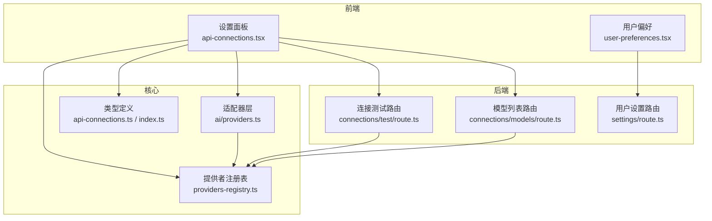
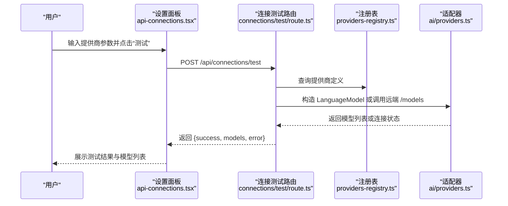

# 支持的 AI 提供商

<cite>
**本文引用的文件**
- [README.md](file://README.md)
- [package.json](file://package.json)
- [src/lib/constants/providers-registry.ts](file://src/lib/constants/providers-registry.ts)
- [src/types/api-connections.ts](file://src/types/api-connections.ts)
- [src/types/index.ts](file://src/types/index.ts)
- [src/lib/ai/providers.ts](file://src/lib/ai/providers.ts)
- [src/app/api/connections/test/route.ts](file://src/app/api/connections/test/route.ts)
- [src/app/api/connections/models/route.ts](file://src/app/api/connections/models/route.ts)
- [src/components/settings/api-connections.tsx](file://src/components/settings/api-connections.tsx)
- [src/components/settings/user-preferences.tsx](file://src/components/settings/user-preferences.tsx)
- [src/app/api/settings/route.ts](file://src/app/api/settings/route.ts)
</cite>

## 目录
1. [简介](#简介)
2. [项目结构](#项目结构)
3. [核心组件](#核心组件)
4. [架构总览](#架构总览)
5. [详细组件分析](#详细组件分析)
6. [依赖关系分析](#依赖关系分析)
7. [性能考量](#性能考量)
8. [故障排除指南](#故障排除指南)
9. [结论](#结论)
10. [附录](#附录)

## 简介
本技术文档面向 SillyTavern Next 项目，系统梳理其支持的 35+ AI 提供商，覆盖云服务、本地模型与开源服务三大类别，并提供各提供商的特性、模型支持范围、配置要点与最佳实践。文档依据仓库中的提供者注册表、类型定义、适配器与 API 路由实现进行整理，确保信息与代码一致。

## 项目结构
围绕“AI 提供商”主题，项目的关键目录与文件如下：
- 提供者注册表：集中定义所有提供商的元信息、模型分组、是否需要 API Key、Base URL、文档链接、额外配置字段等
- 类型定义：统一描述提供商 ID、API 类别、模型选项、连接状态与用户配置结构
- 适配器层：将不同提供商抽象为统一的 LanguageModel 接口，支持 OpenAI 兼容链路与特定 SDK
- API 路由：提供连接测试、模型列表获取等后端能力
- 前端设置面板：提供“API 连接”配置界面，支持按类别筛选、动态加载模型、测试连接等

图表来源
- [src/components/settings/api-connections.tsx:18-116](file://src/components/settings/api-connections.tsx#L18-L116)
- [src/app/api/connections/test/route.ts:10-52](file://src/app/api/connections/test/route.ts#L10-L52)
- [src/app/api/connections/models/route.ts:11-63](file://src/app/api/connections/models/route.ts#L11-L63)
- [src/lib/constants/providers-registry.ts:722-748](file://src/lib/constants/providers-registry.ts#L722-L748)
- [src/lib/ai/providers.ts:58-97](file://src/lib/ai/providers.ts#L58-L97)

章节来源
- [README.md:16](file://README.md#L16)
- [package.json:18-46](file://package.json#L18-L46)

## 核心组件
- 提供者注册表：集中声明所有提供商的元信息与模型分组，支持静态与动态两类模型列表
- 类型系统：统一 AIProvider ID、API 类别、模型选项、连接状态与用户配置
- 适配器层：根据提供商 ID 选择对应 SDK 或 OpenAI 兼容路径，支持自定义 Base URL 与请求头
- API 路由：提供连接测试与模型列表获取，针对 Google/VertexAI/Ollama/OpenRouter 等做差异化处理
- 前端设置面板：按类别展示提供商，支持测试连接、动态拉取模型、保存配置

章节来源
- [src/lib/constants/providers-registry.ts:722-748](file://src/lib/constants/providers-registry.ts#L722-L748)
- [src/types/api-connections.ts:9-105](file://src/types/api-connections.ts#L9-L105)
- [src/lib/ai/providers.ts:58-174](file://src/lib/ai/providers.ts#L58-L174)
- [src/app/api/connections/test/route.ts:54-148](file://src/app/api/connections/test/route.ts#L54-L148)
- [src/app/api/connections/models/route.ts:65-131](file://src/app/api/connections/models/route.ts#L65-L131)

## 架构总览
SillyTavern Next 通过“注册表 + 适配器 + API 路由 + 前端设置”的分层设计，实现对多家 AI 提供商的统一接入。前端设置面板负责用户交互与配置持久化；后端路由负责连接验证与模型发现；适配器层屏蔽差异，统一对外暴露 LanguageModel；注册表集中管理提供商元数据与模型清单。

图表来源
- [src/components/settings/api-connections.tsx:121-134](file://src/components/settings/api-connections.tsx#L121-L134)
- [src/app/api/connections/test/route.ts:10-52](file://src/app/api/connections/test/route.ts#L10-L52)
- [src/lib/constants/providers-registry.ts:740-748](file://src/lib/constants/providers-registry.ts#L740-L748)
- [src/lib/ai/providers.ts:58-97](file://src/lib/ai/providers.ts#L58-L97)

## 详细组件分析

### 提供者注册表与模型分组
提供者注册表集中定义了所有提供商的元信息，包括：
- 基本属性：ID、名称、所属 API 类别、是否需要 API Key、是否需要 Base URL、默认 Base URL、占位符、密钥存储键、文档链接
- 模型列表：支持静态分组（如 GPT-4o、Claude 4 等）与动态列表（如 OpenRouter、Mistral、Ollama 等）
- 额外配置：如 Vertex AI 的 region/project、Azure OpenAI 的 deployment 与 API 版本、Cloudflare Workers 的 account id 等
- 反向代理支持：部分提供商支持反向代理配置

章节来源
- [src/lib/constants/providers-registry.ts:11-81](file://src/lib/constants/providers-registry.ts#L11-L81)
- [src/lib/constants/providers-registry.ts:83-118](file://src/lib/constants/providers-registry.ts#L83-L118)
- [src/lib/constants/providers-registry.ts:120-151](file://src/lib/constants/providers-registry.ts#L120-L151)
- [src/lib/constants/providers-registry.ts:153-179](file://src/lib/constants/providers-registry.ts#L153-L179)
- [src/lib/constants/providers-registry.ts:181-190](file://src/lib/constants/providers-registry.ts#L181-L190)
- [src/lib/constants/providers-registry.ts:192-201](file://src/lib/constants/providers-registry.ts#L192-L201)
- [src/lib/constants/providers-registry.ts:203-214](file://src/lib/constants/providers-registry.ts#L203-L214)
- [src/lib/constants/providers-registry.ts:216-225](file://src/lib/constants/providers-registry.ts#L216-L225)
- [src/lib/constants/providers-registry.ts:227-246](file://src/lib/constants/providers-registry.ts#L227-L246)
- [src/lib/constants/providers-registry.ts:248-258](file://src/lib/constants/providers-registry.ts#L248-L258)
- [src/lib/constants/providers-registry.ts:260-279](file://src/lib/constants/providers-registry.ts#L260-L279)
- [src/lib/constants/providers-registry.ts:281-296](file://src/lib/constants/providers-registry.ts#L281-L296)
- [src/lib/constants/providers-registry.ts:298-313](file://src/lib/constants/providers-registry.ts#L298-L313)
- [src/lib/constants/providers-registry.ts:315-323](file://src/lib/constants/providers-registry.ts#L315-L323)
- [src/lib/constants/providers-registry.ts:325-341](file://src/lib/constants/providers-registry.ts#L325-L341)
- [src/lib/constants/providers-registry.ts:343-362](file://src/lib/constants/providers-registry.ts#L343-L362)
- [src/lib/constants/providers-registry.ts:364-385](file://src/lib/constants/providers-registry.ts#L364-L385)
- [src/lib/constants/providers-registry.ts:397-413](file://src/lib/constants/providers-registry.ts#L397-L413)
- [src/lib/constants/providers-registry.ts:415-423](file://src/lib/constants/providers-registry.ts#L415-L423)
- [src/lib/constants/providers-registry.ts:425-436](file://src/lib/constants/providers-registry.ts#L425-L436)
- [src/lib/constants/providers-registry.ts:438-446](file://src/lib/constants/providers-registry.ts#L438-L446)
- [src/lib/constants/providers-registry.ts:448-456](file://src/lib/constants/providers-registry.ts#L448-L456)
- [src/lib/constants/providers-registry.ts:458-466](file://src/lib/constants/providers-registry.ts#L458-L466)
- [src/lib/constants/providers-registry.ts:468-476](file://src/lib/constants/providers-registry.ts#L468-L476)
- [src/lib/constants/providers-registry.ts:478-486](file://src/lib/constants/providers-registry.ts#L478-L486)
- [src/lib/constants/providers-registry.ts:492-502](file://src/lib/constants/providers-registry.ts#L492-L502)
- [src/lib/constants/providers-registry.ts:504-514](file://src/lib/constants/providers-registry.ts#L504-L514)
- [src/lib/constants/providers-registry.ts:516-526](file://src/lib/constants/providers-registry.ts#L516-L526)
- [src/lib/constants/providers-registry.ts:528-538](file://src/lib/constants/providers-registry.ts#L528-L538)
- [src/lib/constants/providers-registry.ts:540-551](file://src/lib/constants/providers-registry.ts#L540-L551)
- [src/lib/constants/providers-registry.ts:553-562](file://src/lib/constants/providers-registry.ts#L553-L562)
- [src/lib/constants/providers-registry.ts:564-574](file://src/lib/constants/providers-registry.ts#L564-L574)
- [src/lib/constants/providers-registry.ts:576-585](file://src/lib/constants/providers-registry.ts#L576-L585)
- [src/lib/constants/providers-registry.ts:587-596](file://src/lib/constants/providers-registry.ts#L587-L596)
- [src/lib/constants/providers-registry.ts:598-607](file://src/lib/constants/providers-registry.ts#L598-L607)
- [src/lib/constants/providers-registry.ts:609-617](file://src/lib/constants/providers-registry.ts#L609-L617)
- [src/lib/constants/providers-registry.ts:619-627](file://src/lib/constants/providers-registry.ts#L619-L627)
- [src/lib/constants/providers-registry.ts:629-638](file://src/lib/constants/providers-registry.ts#L629-L638)
- [src/lib/constants/providers-registry.ts:640-648](file://src/lib/constants/providers-registry.ts#L640-L648)
- [src/lib/constants/providers-registry.ts:650-660](file://src/lib/constants/providers-registry.ts#L650-L660)
- [src/lib/constants/providers-registry.ts:666-681](file://src/lib/constants/providers-registry.ts#L666-L681)
- [src/lib/constants/providers-registry.ts:687-701](file://src/lib/constants/providers-registry.ts#L687-L701)
- [src/lib/constants/providers-registry.ts:707-716](file://src/lib/constants/providers-registry.ts#L707-L716)

### 类型系统与配置结构
- AIProvider：涵盖所有提供商 ID，含云服务、本地模型与开源服务
- API 类别：对话补全、文本补全、NovelAI、AI Horde、KoboldAI Classic
- ProviderRegistryEntry：描述提供商的元信息、模型分组、是否需要 API Key/Base URL、默认 Base URL、占位符、密钥存储键、文档链接、反向代理支持、额外配置字段
- UserConnectionConfig：用户连接配置，包含活动类别、活动提供商、选中模型、Base URL 覆盖、自动连接、反向代理预设与已获取模型列表等

章节来源
- [src/types/index.ts:4-50](file://src/types/index.ts#L4-L50)
- [src/types/api-connections.ts:9-105](file://src/types/api-connections.ts#L9-L105)

### 适配器层与 OpenAI 兼容链路
适配器层将不同提供商抽象为统一的 LanguageModel 实例：
- Anthropic、Google、OpenAI 使用对应 SDK
- 其他 OpenAI 兼容提供商通过 createOpenAI 与 Base URL 映射实现
- 部分提供商支持自定义请求头（如 OpenRouter 的 HTTP-Referer 与 X-Title）

章节来源
- [src/lib/ai/providers.ts:5-9](file://src/lib/ai/providers.ts#L5-L9)
- [src/lib/ai/providers.ts:18-45](file://src/lib/ai/providers.ts#L18-L45)
- [src/lib/ai/providers.ts:58-97](file://src/lib/ai/providers.ts#L58-L97)
- [src/lib/ai/providers.ts:102-150](file://src/lib/ai/providers.ts#L102-L150)
- [src/lib/ai/providers.ts:153-174](file://src/lib/ai/providers.ts#L153-L174)

### API 路由：连接测试与模型列表
- 连接测试路由：支持标准 OpenAI 兼容、Anthropic、Google/VertexAI 等差异化路径，超时控制与错误处理
- 模型列表路由：针对 Google/VertexAI、Ollama、OpenRouter 等做差异化处理，其余走 /models 端点

章节来源
- [src/app/api/connections/test/route.ts:54-148](file://src/app/api/connections/test/route.ts#L54-L148)
- [src/app/api/connections/models/route.ts:65-131](file://src/app/api/connections/models/route.ts#L65-L131)

### 前端设置面板：提供商配置与模型选择
- 按 API 类别筛选提供商
- 动态加载模型列表（静态或远程）
- 测试连接并显示结果
- 保存配置至用户设置

章节来源
- [src/components/settings/api-connections.tsx:18-116](file://src/components/settings/api-connections.tsx#L18-L116)
- [src/components/settings/user-preferences.tsx:51-82](file://src/components/settings/user-preferences.tsx#L51-L82)
- [src/app/api/settings/route.ts:9-17](file://src/app/api/settings/route.ts#L9-L17)

## 依赖关系分析
- 依赖的 AI SDK：@ai-sdk/openai、@ai-sdk/anthropic、@ai-sdk/google
- 通用 AI 库：ai
- 前端与工具：next、react、zustand、drizzle-orm、better-sqlite3、zod 等

章节来源
- [package.json:18-46](file://package.json#L18-L46)

## 性能考量
- 动态模型列表获取：首次拉取可能较慢，建议缓存已获取模型列表
- 超时控制：连接测试与模型列表路由均设置了合理的超时时间
- 反向代理：部分提供商支持反向代理，可优化网络延迟与合规性

## 故障排除指南
- API Key 未配置：当提供商要求 API Key 且未提供时，连接测试会返回相应错误
- Base URL 错误：若 Base URL 为空或不可达，模型列表获取会失败
- 超时问题：网络不稳定或远端服务繁忙可能导致超时，建议重试或检查网络
- Google/VertexAI 差异化端点：确保使用正确的端点与鉴权方式

章节来源
- [src/app/api/connections/test/route.ts:30-52](file://src/app/api/connections/test/route.ts#L30-L52)
- [src/app/api/connections/models/route.ts:34-63](file://src/app/api/connections/models/route.ts#L34-L63)

## 结论
SillyTavern Next 通过完善的提供者注册表与适配器层，实现了对 35+ AI 提供商的统一接入。前端设置面板与后端 API 路由协同工作，支持动态模型发现、连接测试与配置持久化。该架构既覆盖主流云服务（OpenAI、Anthropic、Google 等），也兼容本地模型（Ollama、llama.cpp、vLLM 等）与开源服务（OpenRouter、AI Horde 等），满足多样化的部署与使用需求。

## 附录

### 提供商分类与清单
- 对话补全（Chat Completion）
  - OpenAI、Claude（Anthropic）、Google AI Studio、Google Vertex AI、OpenRouter、DeepSeek、Custom（OpenAI 兼容）、MistralAI、Groq、xAI（Grok）、Perplexity、Cohere、AI21、Fireworks AI、MiniMax、Moonshot AI、Z.AI（GLM）、SiliconFlow、Azure OpenAI、NanoGPT、Cloudflare Workers AI、Electron Hub、Chutes、Pollinations、AI/ML API、CometAPI
- 文本补全（Text Completion）
  - KoboldCpp、Ollama、llama.cpp、vLLM、Aphrodite、TabbyAPI、Text Generation WebUI（oobabooga）、Mancer、DreamGen、Featherless、InfermaticAI、TogetherAI、HuggingFace（推理端点）、OpenRouter（Text）、Generic（OpenAI 兼容）
- 其他
  - NovelAI、AI Horde、KoboldAI Classic

章节来源
- [src/lib/constants/providers-registry.ts:722-738](file://src/lib/constants/providers-registry.ts#L722-L738)

### 各提供商特点与配置要点
- OpenAI
  - 特点：支持多版本 GPT 模型，模型分组丰富
  - 配置：需要 API Key，Base URL 可留空
  - 文档：见注册表中的 docsUrl
- Claude（Anthropic）
  - 特点：Claude 3/3.5/4 系列模型
  - 配置：需要 API Key，Base URL 可留空
- Google AI Studio / Vertex AI
  - 特点：Gemini 2.5/3.0/3.1 系列；Vertex AI 支持区域与项目配置
  - 配置：需要 API Key；Vertex AI 需要 Authorization 头
- OpenRouter
  - 特点：动态模型列表，支持多种模型聚合
  - 配置：需要 API Key，Base URL 可留空
- Azure OpenAI
  - 特点：支持部署名与 API 版本配置
  - 配置：需要 Base URL、部署名与 API 版本
- Ollama
  - 特点：本地模型，通过 /api/tags 获取模型
  - 配置：Base URL 为本地地址，无需 API Key
- HuggingFace（推理端点）
  - 特点：通过云端推理端点访问模型
  - 配置：需要 Base URL 与 API Key
- AI Horde
  - 特点：分布式工作者网络，支持上下文与响应长度自动调整
  - 配置：无需 API Key，支持额外字段

章节来源
- [src/lib/constants/providers-registry.ts:11-81](file://src/lib/constants/providers-registry.ts#L11-L81)
- [src/lib/constants/providers-registry.ts:83-118](file://src/lib/constants/providers-registry.ts#L83-L118)
- [src/lib/constants/providers-registry.ts:120-179](file://src/lib/constants/providers-registry.ts#L120-L179)
- [src/lib/constants/providers-registry.ts:181-190](file://src/lib/constants/providers-registry.ts#L181-L190)
- [src/lib/constants/providers-registry.ts:397-413](file://src/lib/constants/providers-registry.ts#L397-L413)
- [src/lib/constants/providers-registry.ts:504-514](file://src/lib/constants/providers-registry.ts#L504-L514)
- [src/lib/constants/providers-registry.ts:629-638](file://src/lib/constants/providers-registry.ts#L629-L638)
- [src/lib/constants/providers-registry.ts:687-701](file://src/lib/constants/providers-registry.ts#L687-L701)

### 官方文档链接与最佳实践
- 官方文档链接：各提供商在注册表中提供了 docsUrl，可在设置面板中直接访问
- 最佳实践
  - 优先使用用户个人配置而非环境变量存储 API Key
  - 首次连接后会自动拉取模型列表，建议在网络稳定时进行
  - 测试消息会消耗少量额度，建议在确认配置正确后再进行大量生成
  - 多个提供商可同时保存配置，便于在聊天页面顶部切换使用

章节来源
- [src/components/settings/user-preferences.tsx:71-82](file://src/components/settings/user-preferences.tsx#L71-L82)
- [src/lib/constants/providers-registry.ts:18-19](file://src/lib/constants/providers-registry.ts#L18-L19)