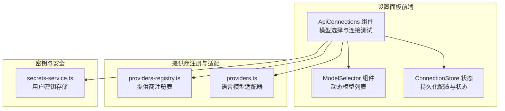
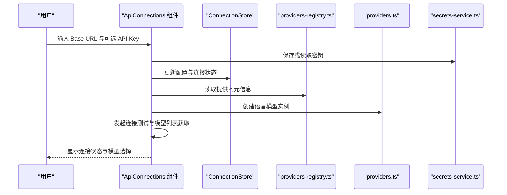
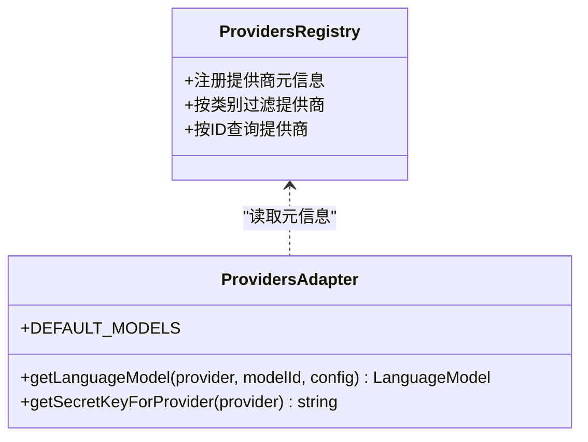
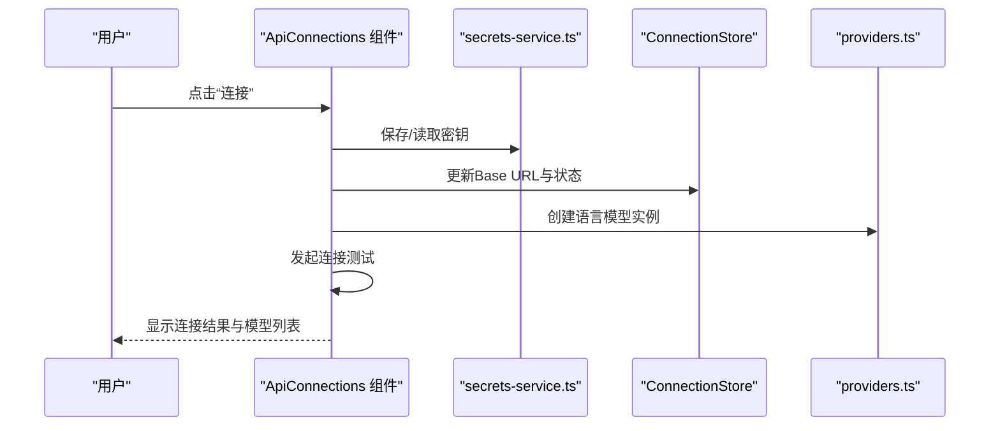
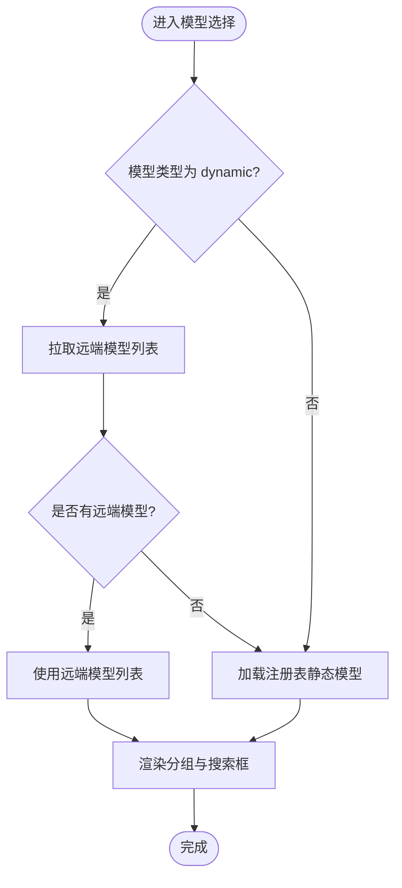
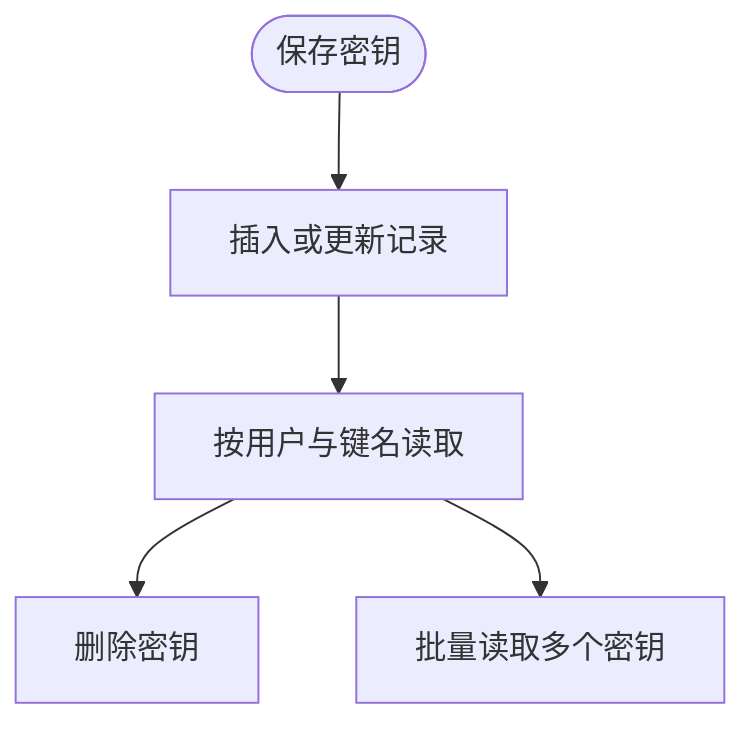
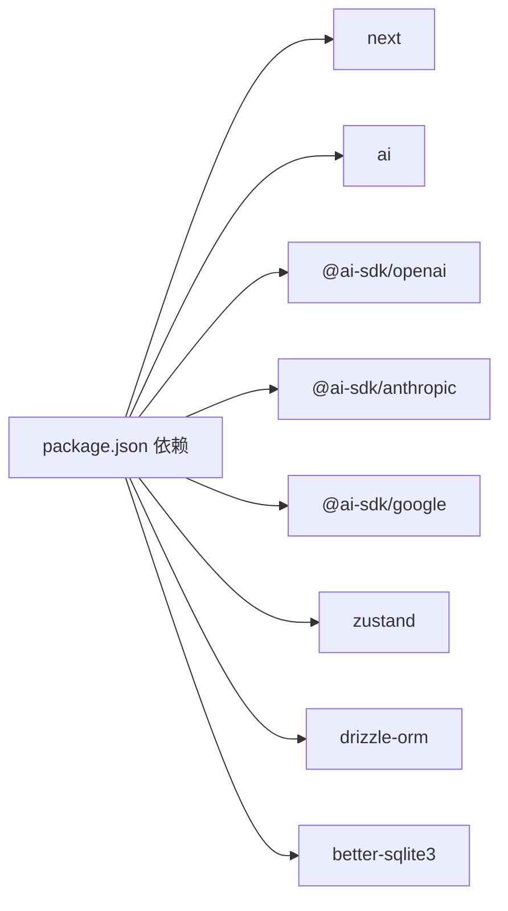

# 本地模型支持

<cite>
**本文引用的文件**
- [README.md](file://README.md)
- [package.json](file://package.json)
- [src/lib/ai/providers.ts](file://src/lib/ai/providers.ts)
- [src/lib/constants/providers-registry.ts](file://src/lib/constants/providers-registry.ts)
- [src/lib/services/secrets-service.ts](file://src/lib/services/secrets-service.ts)
- [src/components/settings/api-connections.tsx](file://src/components/settings/api-connections.tsx)
- [src/components/settings/model-selector.tsx](file://src/components/settings/model-selector.tsx)
- [src/lib/stores/connection-store.ts](file://src/lib/stores/connection-store.ts)
- [src/types/api-connections.ts](file://src/types/api-connections.ts)
</cite>

## 目录
1. [简介](#简介)
2. [项目结构](#项目结构)
3. [核心组件](#核心组件)
4. [架构总览](#架构总览)
5. [详细组件分析](#详细组件分析)
6. [依赖关系分析](#依赖关系分析)
7. [性能考量](#性能考量)
8. [故障排除指南](#故障排除指南)
9. [结论](#结论)
10. [附录](#附录)

## 简介
本技术文档聚焦于本地 AI 模型支持，涵盖 Ollama、KoboldCPP、Llama.cpp 等本地模型服务的集成方式与使用流程。文档解释本地模型的启动配置、模型加载与推理过程，并对比本地模型与云端服务在能力、性能与资源上的差异。同时提供部署指南、配置优化与故障排除建议，以及最佳实践与性能调优要点，帮助用户在本地环境中稳定、高效地运行与使用各类本地推理服务。

## 项目结构
本项目采用 Next.js App Router 架构，前端通过设置面板统一管理各类 AI 提供商（含本地与云端）。本地模型服务（如 Ollama、KoboldCPP、Llama.cpp 等）以“文本补全”类提供商接入，通过统一的提供商注册表与适配器进行配置与调用。

图表来源
- [src/components/settings/api-connections.tsx:18-116](file://src/components/settings/api-connections.tsx#L18-L116)
- [src/components/settings/model-selector.tsx:7-113](file://src/components/settings/model-selector.tsx#L7-L113)
- [src/lib/stores/connection-store.ts:32-185](file://src/lib/stores/connection-store.ts#L32-L185)
- [src/lib/constants/providers-registry.ts:492-526](file://src/lib/constants/providers-registry.ts#L492-L526)
- [src/lib/ai/providers.ts:58-97](file://src/lib/ai/providers.ts#L58-L97)
- [src/lib/services/secrets-service.ts:10-65](file://src/lib/services/secrets-service.ts#L10-L65)

章节来源
- [README.md: 10-122:10-122](file://README.md#L10-L122)
- [package.json: 18-46:18-46](file://package.json#L18-L46)

## 核心组件
- 提供商注册表：集中定义各提供商的类别、是否需要 API Key、默认 Base URL、模型列表来源等元信息，支撑 UI 动态渲染与配置校验。
- 语言模型适配器：根据提供商类型与配置，统一创建语言模型实例，支持 OpenAI 兼容风格的本地服务（如 Ollama、KoboldCPP、Llama.cpp 等）。
- 设置面板组件：负责连接测试、模型列表拉取、密钥保存与删除、反向代理配置等交互。
- 状态与持久化：使用 Zustand 管理连接状态、已连接模型列表与用户配置，支持刷新后恢复。
- 密钥服务：基于 SQLite 的密钥存储，按用户隔离，支持增删改查与批量读取。

章节来源
- [src/lib/constants/providers-registry.ts: 492-526:492-526](file://src/lib/constants/providers-registry.ts#L492-L526)
- [src/lib/ai/providers.ts: 58-97:58-97](file://src/lib/ai/providers.ts#L58-L97)
- [src/components/settings/api-connections.tsx: 18-L443:18-443](file://src/components/settings/api-connections.tsx#L18-L443)
- [src/lib/stores/connection-store.ts: 32-185:32-185](file://src/lib/stores/connection-store.ts#L32-185)
- [src/lib/services/secrets-service.ts: 10-65:10-65](file://src/lib/services/secrets-service.ts#L10-L65)

## 架构总览
本地模型服务通过“文本补全”类提供商接入，前端设置面板发起连接测试与模型列表获取，后端根据提供商类型与用户配置构造语言模型实例，最终用于生成请求。

图表来源
- [src/components/settings/api-connections.tsx: 149-212:149-212](file://src/components/settings/api-connections.tsx#L149-L212)
- [src/lib/stores/connection-store.ts: 173-184:173-184](file://src/lib/stores/connection-store.ts#L173-L184)
- [src/lib/constants/providers-registry.ts: 492-526:492-526](file://src/lib/constants/providers-registry.ts#L492-L526)
- [src/lib/ai/providers.ts: 58-97:58-97](file://src/lib/ai/providers.ts#L58-L97)
- [src/lib/services/secrets-service.ts: 19-64:19-64](file://src/lib/services/secrets-service.ts#L19-L64)

## 详细组件分析

### 提供商注册与适配（本地模型）
- 本地模型提供商（如 Ollama、KoboldCPP、Llama.cpp）被归类为“文本补全”类，具备“需要 Base URL”“可选 API Key”等特性。
- 适配器根据提供商 ID 与配置创建语言模型实例，支持 OpenAI 兼容风格的本地服务端点。
- 默认模型 ID 为本地服务常用模型标识，便于快速开始。

图表来源
- [src/lib/constants/providers-registry.ts: 492-526:492-526](file://src/lib/constants/providers-registry.ts#L492-L526)
- [src/lib/ai/providers.ts: 58-174:58-174](file://src/lib/ai/providers.ts#L58-L174)

章节来源
- [src/lib/constants/providers-registry.ts: 492-526:492-526](file://src/lib/constants/providers-registry.ts#L492-L526)
- [src/lib/ai/providers.ts: 58-174:58-174](file://src/lib/ai/providers.ts#L58-L174)

### 设置面板与连接流程（本地模型）
- 用户在设置面板中填写本地服务的 Base URL（例如 Ollama 的默认端口），可选输入 API Key。
- 点击“连接”后，前端保存密钥（若提供）、更新 Base URL，并发起连接测试。
- 若提供商无需状态检查，则直接标记为“已连接”；否则等待后端返回模型列表并展示。
- “测试消息”按钮用于验证服务连通性与基础推理能力。

图表来源
- [src/components/settings/api-connections.tsx: 149-253:149-253](file://src/components/settings/api-connections.tsx#L149-L253)
- [src/lib/services/secrets-service.ts: 19-64:19-64](file://src/lib/services/secrets-service.ts#L19-L64)
- [src/lib/stores/connection-store.ts: 173-184:173-184](file://src/lib/stores/connection-store.ts#L173-L184)
- [src/lib/ai/providers.ts: 58-97:58-97](file://src/lib/ai/providers.ts#L58-L97)

章节来源
- [src/components/settings/api-connections.tsx: 18-L443:18-443](file://src/components/settings/api-connections.tsx#L18-L443)

### 模型选择与动态加载
- 当提供商声明模型为“dynamic”时，前端会在连接成功后拉取可用模型列表，并支持搜索与分组展示。
- 若已存在远端模型列表，优先使用；否则回退到本地注册表中的静态模型分组。

图表来源
- [src/components/settings/model-selector.tsx: 14-48:14-48](file://src/components/settings/model-selector.tsx#L14-L48)
- [src/lib/constants/providers-registry.ts: 492-526:492-526](file://src/lib/constants/providers-registry.ts#L492-L526)

章节来源
- [src/components/settings/model-selector.tsx: 7-L113:7-113](file://src/components/settings/model-selector.tsx#L7-L113)

### 密钥存储与安全
- 密钥按用户隔离存储于 SQLite 数据库，支持新增、更新、删除与批量读取。
- 前端在设置面板中保存密钥后，后续连接测试与推理均通过后端读取密钥，避免明文泄露。

图表来源
- [src/lib/services/secrets-service.ts: 19-64:19-64](file://src/lib/services/secrets-service.ts#L19-L64)

章节来源
- [src/lib/services/secrets-service.ts: 10-116:10-116](file://src/lib/services/secrets-service.ts#L10-L116)

## 依赖关系分析
- 前端依赖 Next.js 16 与 React 19，使用 Zustand 管理状态，Tailwind CSS 4 进行样式组织。
- AI SDK 采用 Vercel AI SDK，统一 OpenAI 兼容风格的模型调用接口。
- 提供商适配器基于 @ai-sdk/openai、@ai-sdk/anthropic、@ai-sdk/google 等包，支持本地服务通过 OpenAI 兼容端点接入。

图表来源
- [package.json: 18-46:18-46](file://package.json#L18-L46)

章节来源
- [package.json: 18-46:18-46](file://package.json#L18-L46)

## 性能考量
- 本地模型推理性能受硬件资源与模型规模影响显著，建议优先选择与设备内存匹配的模型尺寸。
- 对于大模型，适当降低上下文长度与采样参数可提升响应速度；对于小模型，可适度提高采样温度以增强创造性。
- 使用反向代理或本地缓存可减少网络往返时间，但需确保本地服务端点稳定与低延迟。
- 在高并发场景下，建议限制并发请求数与批处理大小，避免 GPU/CPU 过载。

## 故障排除指南
- 连接失败
  - 检查本地服务端口与防火墙设置，确保 Base URL 正确且可达。
  - 若提供商要求 API Key，确认已在设置面板保存并正确传递。
  - 对于 OpenAI 兼容端点，确认服务端点路径与版本号正确（如末尾追加 /v1）。
- 模型列表为空
  - 确认本地服务已加载目标模型，或尝试重启服务后再次连接。
  - 若为动态模型，检查连接测试是否成功返回模型列表。
- 推理异常
  - 降低采样参数（如温度、最大令牌数）以缓解资源压力。
  - 检查本地服务日志，定位具体错误原因（如显存不足、模型未加载）。
- 密钥问题
  - 在设置面板中删除并重新保存密钥，避免历史错误配置干扰。
  - 确保密钥按用户隔离存储，避免跨用户误用。

章节来源
- [src/components/settings/api-connections.tsx: 149-253:149-253](file://src/components/settings/api-connections.tsx#L149-L253)
- [src/lib/services/secrets-service.ts: 19-64:19-64](file://src/lib/services/secrets-service.ts#L19-L64)

## 结论
本项目通过统一的提供商注册表与适配器，将 Ollama、KoboldCPP、Llama.cpp 等本地模型服务无缝接入到设置面板中，实现了与云端提供商一致的配置体验。结合密钥安全存储、动态模型加载与连接测试机制，用户可在本地环境中便捷地启动、加载与推理模型，并通过合理的参数与资源规划获得稳定、高效的使用体验。

## 附录
- 本地模型部署建议
  - Ollama：使用官方安装包，确保端口开放；通过命令行或 Web UI 加载所需模型。
  - KoboldCPP：按官方说明编译并启动服务，配置监听地址与端口。
  - Llama.cpp：使用官方二进制或自行编译，设置监听地址与端口。
- 配置优化清单
  - 选择合适模型尺寸与上下文长度。
  - 调整采样参数以平衡质量与速度。
  - 启用必要的缓存与反向代理以降低延迟。
- 最佳实践
  - 将密钥存储在后端数据库，避免前端暴露。
  - 定期检查本地服务日志与资源占用。
  - 在多人使用场景下，为不同用户提供独立的密钥与配置。