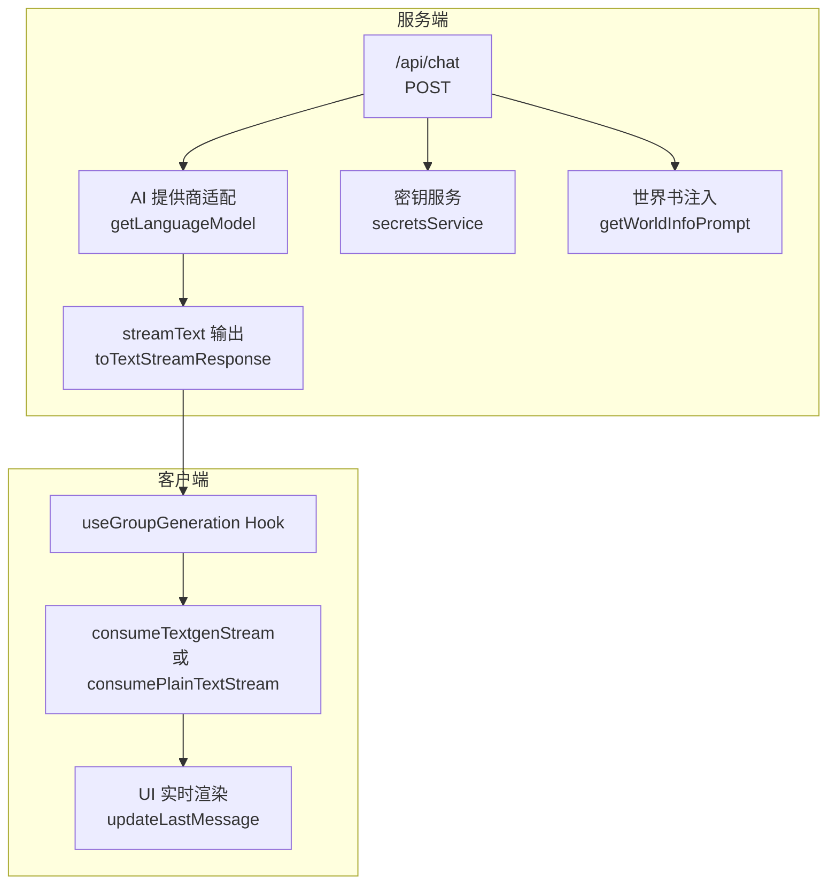
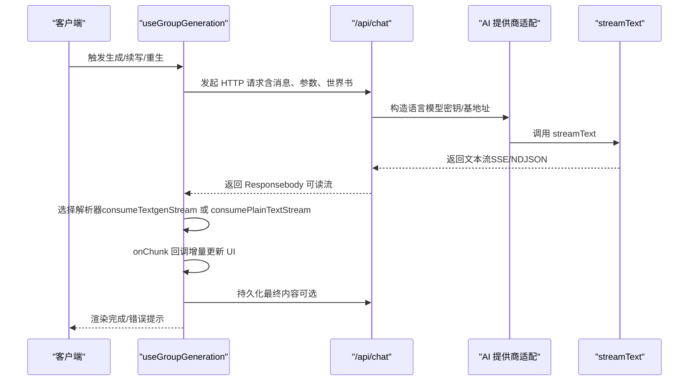
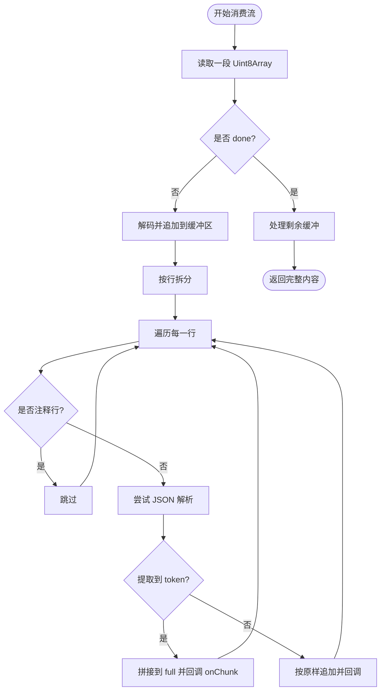
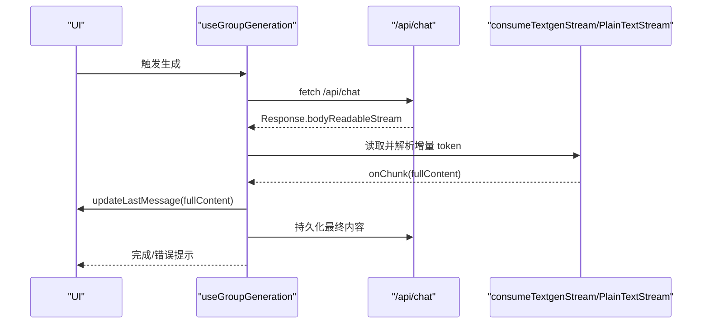
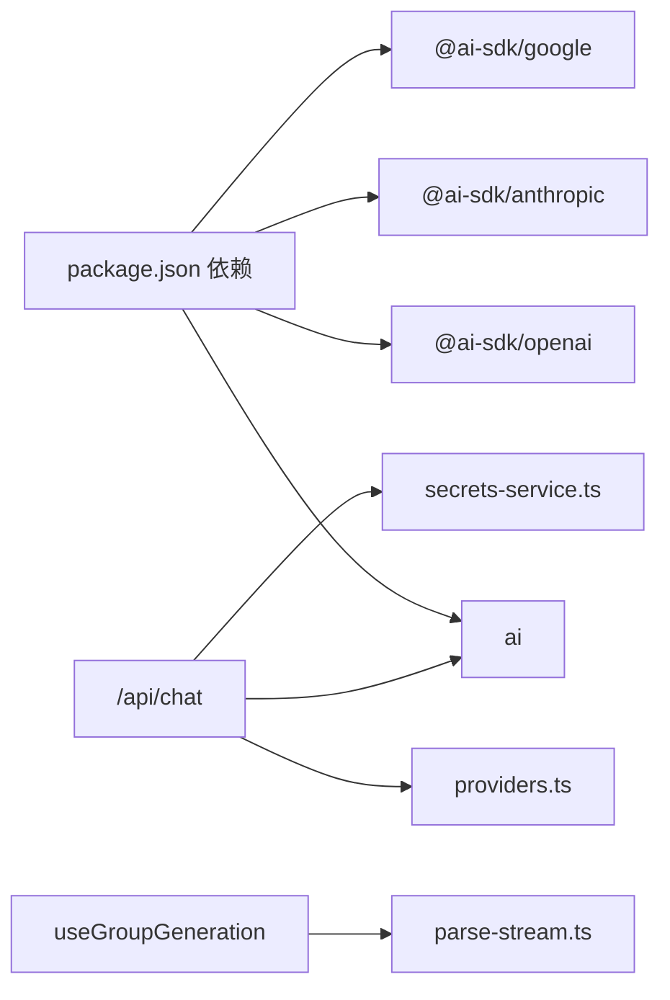

# 流式响应处理

<cite>
**本文引用的文件**
- [src/app/api/chat/route.ts](file://src/app/api/chat/route.ts)
- [src/lib/ai/providers.ts](file://src/lib/ai/providers.ts)
- [src/lib/textgen/parse-stream.ts](file://src/lib/textgen/parse-stream.ts)
- [src/hooks/useGroupGeneration.ts](file://src/hooks/useGroupGeneration.ts)
- [src/lib/services/secrets-service.ts](file://src/lib/services/secrets-service.ts)
- [src/app/api/text-completions/generate/route.ts](file://src/app/api/text-completions/generate/route.ts)
- [package.json](file://package.json)
</cite>

## 目录
1. [简介](#简介)
2. [项目结构](#项目结构)
3. [核心组件](#核心组件)
4. [架构总览](#架构总览)
5. [详细组件分析](#详细组件分析)
6. [依赖关系分析](#依赖关系分析)
7. [性能考量](#性能考量)
8. [故障排查指南](#故障排查指南)
9. [结论](#结论)
10. [附录](#附录)

## 简介
本技术文档聚焦于本项目的流式响应处理能力，涵盖以下方面：
- 流式传输协议与实时数据处理：基于 Vercel AI SDK 的 streamText 与 SSE/NDJSON 的统一消费。
- 缓冲与解析机制：多后端兼容的增量 token 提取与行缓冲处理。
- 错误恢复策略：请求失败、上游异常、网络中断的降级与提示。
- 与 Vercel AI SDK 的集成：服务端通过 streamText 输出文本流，客户端通过 consumeStream/自定义解析器增量渲染。
- WebSocket 连接管理与客户端同步：本项目以 HTTP SSE/NDJSON 为主，未使用 WebSocket；但提供了与客户端状态同步的机制。
- 性能优化与并发控制：内存缓冲、解码流、中止信号、批量持久化与截断控制。
- 调试技巧与常见问题：日志定位、错误响应格式、上游兼容性与超时处理。

## 项目结构
与流式处理直接相关的模块分布如下：
- 服务端 API：负责认证、参数校验、世界书注入、密钥获取、模型选择与流式输出。
- AI 提供商适配：统一封装 OpenAI/Anthropic/Google 等提供商与 OpenAI 兼容链路。
- 流解析工具：消费 SSE/NDJSON 文本生成流，提取增量 token 并回调。
- 客户端 Hook：封装群组生成流程，读取服务端流并进行截断、拼接与持久化。
- 密钥服务：安全存储与检索用户密钥，支持回退至环境变量。
- 文本补全直连：对 text_completion 场景直接透传上游流。

**图表来源**
- [src/app/api/chat/route.ts:50-176](file://src/app/api/chat/route.ts#L50-L176)
- [src/lib/ai/providers.ts:58-97](file://src/lib/ai/providers.ts#L58-L97)
- [src/lib/textgen/parse-stream.ts:38-115](file://src/lib/textgen/parse-stream.ts#L38-L115)
- [src/hooks/useGroupGeneration.ts:340-447](file://src/hooks/useGroupGeneration.ts#L340-L447)

**章节来源**
- [src/app/api/chat/route.ts:50-176](file://src/app/api/chat/route.ts#L50-L176)
- [src/lib/ai/providers.ts:58-97](file://src/lib/ai/providers.ts#L58-L97)
- [src/lib/textgen/parse-stream.ts:38-115](file://src/lib/textgen/parse-stream.ts#L38-L115)
- [src/hooks/useGroupGeneration.ts:340-447](file://src/hooks/useGroupGeneration.ts#L340-L447)

## 核心组件
- 服务端聊天 API：接收请求、校验参数、注入世界书、获取密钥、构造语言模型、调用 streamText 并输出文本流。
- AI 提供商适配：根据提供商类型创建对应 SDK 模型实例，并处理 OpenAI 兼容链路与特殊头部。
- 流解析工具：支持 SSE/NDJSON 的增量 token 解析，兼容多种后端输出结构。
- 客户端生成 Hook：封装群组生成流程，按需选择 textgen 或纯文本流解析器，进行截断与持久化。
- 密钥服务：数据库存储用户密钥，支持回退到环境变量。
- 文本补全直连：对 text_completion 场景直接透传上游 SSE/NDJSON。

**章节来源**
- [src/app/api/chat/route.ts:50-176](file://src/app/api/chat/route.ts#L50-L176)
- [src/lib/ai/providers.ts:58-97](file://src/lib/ai/providers.ts#L58-L97)
- [src/lib/textgen/parse-stream.ts:38-115](file://src/lib/textgen/parse-stream.ts#L38-L115)
- [src/hooks/useGroupGeneration.ts:340-447](file://src/hooks/useGroupGeneration.ts#L340-L447)
- [src/lib/services/secrets-service.ts:19-64](file://src/lib/services/secrets-service.ts#L19-L64)
- [src/app/api/text-completions/generate/route.ts:83-110](file://src/app/api/text-completions/generate/route.ts#L83-L110)

## 架构总览
下图展示从客户端到服务端再到第三方模型的端到端流式生成路径，以及客户端的增量渲染与持久化流程。

**图表来源**
- [src/hooks/useGroupGeneration.ts:340-447](file://src/hooks/useGroupGeneration.ts#L340-L447)
- [src/app/api/chat/route.ts:158-170](file://src/app/api/chat/route.ts#L158-L170)
- [src/lib/ai/providers.ts:58-97](file://src/lib/ai/providers.ts#L58-L97)

## 详细组件分析

### 服务端聊天 API（/api/chat）
职责与流程：
- 认证与参数校验：使用会话鉴权与 Zod Schema 校验请求体。
- 世界书注入：收集全局/角色/聊天上下文词条，拼接 system prompt 并按深度插入消息。
- 密钥与基地址：优先从用户密钥服务获取，其次回退环境变量；本地提供商无需密钥。
- 模型选择：通过提供商映射与 OpenAI 兼容 URL/Headers 构造语言模型。
- 流式输出：调用 streamText 并通过 toTextStreamResponse 输出文本流。

关键点：
- 参数校验覆盖消息、提供商、模型、采样参数、停止序列、系统提示与世界书配置。
- 世界书注入支持多源合并与深度插入，保证上下文一致性。
- toTextStreamResponse 将 streamText 的结果转换为标准文本流响应。

**章节来源**
- [src/app/api/chat/route.ts:50-176](file://src/app/api/chat/route.ts#L50-L176)

### AI 提供商适配（getLanguageModel）
职责与流程：
- 统一接口：支持 OpenAI、Anthropic、Google 与 20+ OpenAI 兼容提供商。
- 兼容映射：内置 OPENAI_COMPATIBLE_URLS 与 PROVIDER_HEADERS。
- 本地提供商：如 Ollama/KoboldCpp 等无需密钥。

关键点：
- 默认分支自动选择兼容 URL 与必要头部。
- 返回 LanguageModel 供 streamText 使用。

**章节来源**
- [src/lib/ai/providers.ts:58-97](file://src/lib/ai/providers.ts#L58-L97)
- [src/lib/ai/providers.ts:19-53](file://src/lib/ai/providers.ts#L19-L53)

### 流解析工具（consumeTextgenStream / consumePlainTextStream）
职责与流程：
- consumeTextgenStream：按行解析 SSE/NDJSON，过滤注释与 [DONE]，尝试 JSON 解析并提取 token，支持非 JSON 直接追加。
- consumePlainTextStream：对 Vercel AI SDK 文本流进行增量拼接与回调。
- 缓冲处理：行缓冲避免跨帧 token 拆分，末尾未换行单独处理。

关键点：
- extractToken 兼容 choices[].text、choices[].delta.content、content、token.text、response 等字段。
- 支持 AbortSignal 中止，避免无意义的后续处理。
- onChunk 回调用于 UI 实时渲染，减少一次性渲染压力。

**图表来源**
- [src/lib/textgen/parse-stream.ts:38-99](file://src/lib/textgen/parse-stream.ts#L38-L99)

**章节来源**
- [src/lib/textgen/parse-stream.ts:38-115](file://src/lib/textgen/parse-stream.ts#L38-L115)

### 客户端生成 Hook（useGroupGeneration）
职责与流程：
- 生成入口：支持 normal/swipe/continue/impersonate/auto 多种模式。
- 世界书与角色卡：构建群组角色字段合并、历史消息构造与 OOC 约束。
- 流式消费：根据 activeCategory 判断使用 textgen 或纯文本解析器。
- 截断控制：检测其他角色名前缀并截断，避免越角输出。
- 持久化：将最终内容写回服务端或本地占位消息，保持客户端与服务端一致。

关键点：
- 续写模式保留原内容并追加新 token，再统一持久化。
- 重生/再生：删除同批次消息后重新生成，保证一致性。
- 中止信号：AbortSignal 用于取消生成，避免 UI 与服务端状态不一致。

**图表来源**
- [src/hooks/useGroupGeneration.ts:340-447](file://src/hooks/useGroupGeneration.ts#L340-L447)
- [src/lib/textgen/parse-stream.ts:38-115](file://src/lib/textgen/parse-stream.ts#L38-L115)

**章节来源**
- [src/hooks/useGroupGeneration.ts:340-447](file://src/hooks/useGroupGeneration.ts#L340-L447)
- [src/hooks/useGroupGeneration.ts:391-413](file://src/hooks/useGroupGeneration.ts#L391-L413)

### 密钥服务（secretsService）
职责与流程：
- 列表、获取、设置、删除与批量获取密钥。
- 与提供商密钥名称映射配合，支持回退到环境变量。

关键点：
- 数据库存储用户密钥，避免硬编码在前端。
- 未配置密钥时返回明确错误，便于前端引导。

**章节来源**
- [src/lib/services/secrets-service.ts:19-64](file://src/lib/services/secrets-service.ts#L19-L64)
- [src/app/api/chat/route.ts:132-151](file://src/app/api/chat/route.ts#L132-L151)

### 文本补全直连（/api/text-completions/generate）
职责与流程：
- 对 text_completion 场景，直接透传上游 SSE/NDJSON，保持流式体验。
- 根据 settings.streaming 控制是否开启流式。

关键点：
- 直接返回上游 body，保留 Content-Type 与缓存头。
- 错误时返回上游状态与简要 body 片段。

**章节来源**
- [src/app/api/text-completions/generate/route.ts:83-110](file://src/app/api/text-completions/generate/route.ts#L83-L110)

## 依赖关系分析
- 服务端依赖：
  - Vercel AI SDK：streamText、toTextStreamResponse。
  - @ai-sdk/*：提供商 SDK 包装。
  - Zod：请求体校验。
- 客户端依赖：
  - 自定义流解析器：consumeTextgenStream/consumePlainTextStream。
  - Zustand 状态管理：聊天、格式化、文本生成预设等。
- 第三方提供商：
  - OpenAI 兼容链路与特殊头部（如 OpenRouter）。

**图表来源**
- [package.json:18-46](file://package.json#L18-L46)
- [src/app/api/chat/route.ts:1-7](file://src/app/api/chat/route.ts#L1-L7)
- [src/lib/ai/providers.ts:5-9](file://src/lib/ai/providers.ts#L5-L9)
- [src/lib/services/secrets-service.ts:1-5](file://src/lib/services/secrets-service.ts#L1-L5)
- [src/hooks/useGroupGeneration.ts:15](file://src/hooks/useGroupGeneration.ts#L15)
- [src/lib/textgen/parse-stream.ts:10-15](file://src/lib/textgen/parse-stream.ts#L10-L15)

**章节来源**
- [package.json:18-46](file://package.json#L18-L46)
- [src/app/api/chat/route.ts:1-7](file://src/app/api/chat/route.ts#L1-L7)
- [src/lib/ai/providers.ts:5-9](file://src/lib/ai/providers.ts#L5-L9)
- [src/lib/services/secrets-service.ts:1-5](file://src/lib/services/secrets-service.ts#L1-L5)
- [src/hooks/useGroupGeneration.ts:15](file://src/hooks/useGroupGeneration.ts#L15)
- [src/lib/textgen/parse-stream.ts:10-15](file://src/lib/textgen/parse-stream.ts#L10-L15)

## 性能考量
- 内存与缓冲
  - 行缓冲避免跨帧 token 拆分，减少 UI 重绘次数。
  - 解码流（TextDecoder + stream:true）降低大块数据的内存峰值。
- 增量渲染
  - onChunk 回调逐块更新 UI，避免一次性渲染长文本。
- 中止与并发
  - AbortSignal 在客户端与服务端均支持中止，避免无效计算。
  - 群组生成按角色顺序串行，避免并发冲突；可结合队列优化。
- 持久化批处理
  - 续写模式先拼接再统一持久化，减少多次 PATCH 请求。
- 上游兼容
  - 多后端 token 字段差异通过 extractToken 统一，减少解析成本。

[本节为通用性能建议，不直接分析具体文件]

## 故障排查指南
- 401 未授权
  - 确认登录态与会话有效性。
  - 参考：[src/app/api/chat/route.ts:52-55](file://src/app/api/chat/route.ts#L52-L55)
- 400 参数错误
  - 检查 messages、provider、model、采样参数与世界书配置。
  - 参考：[src/app/api/chat/route.ts:58-65](file://src/app/api/chat/route.ts#L58-L65)
- 400 缺少密钥
  - 用户密钥服务未配置或环境变量缺失。
  - 参考：[src/app/api/chat/route.ts:132-151](file://src/app/api/chat/route.ts#L132-L151)，[src/lib/services/secrets-service.ts:19-25](file://src/lib/services/secrets-service.ts#L19-L25)
- 500 服务器内部错误
  - 查看服务端日志与错误堆栈。
  - 参考：[src/app/api/chat/route.ts:171-175](file://src/app/api/chat/route.ts#L171-L175)
- 上游错误
  - 直连文本补全场景返回上游状态与 body 片段，便于定位。
  - 参考：[src/app/api/text-completions/generate/route.ts:92-98](file://src/app/api/text-completions/generate/route.ts#L92-L98)
- 流解析异常
  - 非 JSON 行按原样追加，若出现乱码，检查上游 Content-Type 与编码。
  - 参考：[src/lib/textgen/parse-stream.ts:72-76](file://src/lib/textgen/parse-stream.ts#L72-L76)
- 截断与越角
  - 若出现其他角色对话，检查截断正则与角色名列表。
  - 参考：[src/hooks/useGroupGeneration.ts:373-389](file://src/hooks/useGroupGeneration.ts#L373-L389)

**章节来源**
- [src/app/api/chat/route.ts:52-55](file://src/app/api/chat/route.ts#L52-L55)
- [src/app/api/chat/route.ts:58-65](file://src/app/api/chat/route.ts#L58-L65)
- [src/app/api/chat/route.ts:132-151](file://src/app/api/chat/route.ts#L132-L151)
- [src/lib/services/secrets-service.ts:19-25](file://src/lib/services/secrets-service.ts#L19-L25)
- [src/app/api/chat/route.ts:171-175](file://src/app/api/chat/route.ts#L171-L175)
- [src/app/api/text-completions/generate/route.ts:92-98](file://src/app/api/text-completions/generate/route.ts#L92-L98)
- [src/lib/textgen/parse-stream.ts:72-76](file://src/lib/textgen/parse-stream.ts#L72-L76)
- [src/hooks/useGroupGeneration.ts:373-389](file://src/hooks/useGroupGeneration.ts#L373-L389)

## 结论
本项目通过 Vercel AI SDK 的 streamText 与统一的流解析器，实现了对多提供商、多后端的稳定流式响应处理。服务端负责参数校验、世界书注入与密钥管理，客户端通过 Hook 实现增量渲染、截断控制与持久化同步。整体架构具备良好的扩展性与兼容性，适合在复杂聊天场景中持续演进。

[本节为总结性内容，不直接分析具体文件]

## 附录
- 关键实现路径参考
  - 服务端聊天 API：[src/app/api/chat/route.ts:50-176](file://src/app/api/chat/route.ts#L50-L176)
  - 提供商适配：[src/lib/ai/providers.ts:58-97](file://src/lib/ai/providers.ts#L58-L97)
  - 流解析工具：[src/lib/textgen/parse-stream.ts:38-115](file://src/lib/textgen/parse-stream.ts#L38-L115)
  - 客户端生成 Hook：[src/hooks/useGroupGeneration.ts:340-447](file://src/hooks/useGroupGeneration.ts#L340-L447)
  - 密钥服务：[src/lib/services/secrets-service.ts:19-64](file://src/lib/services/secrets-service.ts#L19-L64)
  - 文本补全直连：[src/app/api/text-completions/generate/route.ts:83-110](file://src/app/api/text-completions/generate/route.ts#L83-L110)
  - 依赖声明：[package.json:18-46](file://package.json#L18-L46)