# 认证密钥管理系统

<cite>
**本文档引用的文件**
- [src/app/api/secrets/route.ts](file://src/app/api/secrets/route.ts)
- [src/lib/services/secrets-service.ts](file://src/lib/services/secrets-service.ts)
- [src/lib/db/schema.ts](file://src/lib/db/schema.ts)
- [src/components/settings/api-connections.tsx](file://src/components/settings/api-connections.tsx)
- [src/lib/ai/providers.ts](file://src/lib/ai/providers.ts)
- [src/app/api/connections/test/route.ts](file://src/app/api/connections/test/route.ts)
- [src/lib/constants/providers-registry.ts](file://src/lib/constants/providers-registry.ts)
- [src/lib/stores/connection-store.ts](file://src/lib/stores/connection-store.ts)
- [src/lib/auth.ts](file://src/lib/auth.ts)
- [src/types/api-connections.ts](file://src/types/api-connections.ts)
</cite>

## 目录
1. [简介](#简介)
2. [项目结构](#项目结构)
3. [核心组件](#核心组件)
4. [架构概览](#架构概览)
5. [详细组件分析](#详细组件分析)
6. [依赖关系分析](#依赖关系分析)
7. [性能考虑](#性能考虑)
8. [故障排除指南](#故障排除指南)
9. [结论](#结论)
10. [附录](#附录)

## 简介

认证密钥管理系统是 SillyTavern Next 项目中的核心安全组件，负责管理用户与各种 AI 提供商之间的认证密钥。该系统提供了完整的密钥存储、加密、访问控制和验证机制，确保用户敏感信息的安全性和可用性。

系统支持超过 30 种 AI 提供商，包括 OpenAI、Anthropic、Google AI Studio、Azure OpenAI 等主流平台，以及本地部署的 LLM 服务如 Ollama、KoboldCPP 等。

## 项目结构

认证密钥管理系统在项目中的组织结构如下：

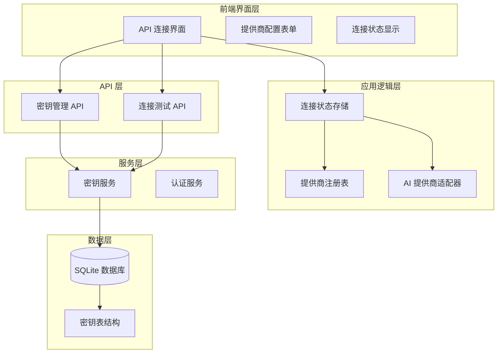

**图表来源**
- [src/components/settings/api-connections.tsx:18-116](file://src/components/settings/api-connections.tsx#L18-L116)
- [src/lib/services/secrets-service.ts:10-65](file://src/lib/services/secrets-service.ts#L10-L65)
- [src/lib/db/schema.ts:201-207](file://src/lib/db/schema.ts#L201-L207)

**章节来源**
- [src/components/settings/api-connections.tsx:1-499](file://src/components/settings/api-connections.tsx#L1-L499)
- [src/lib/services/secrets-service.ts:1-116](file://src/lib/services/secrets-service.ts#L1-L116)
- [src/lib/db/schema.ts:1-240](file://src/lib/db/schema.ts#L1-L240)

## 核心组件

### 密钥存储服务

密钥存储服务是整个系统的核心组件，负责密钥的增删改查操作：

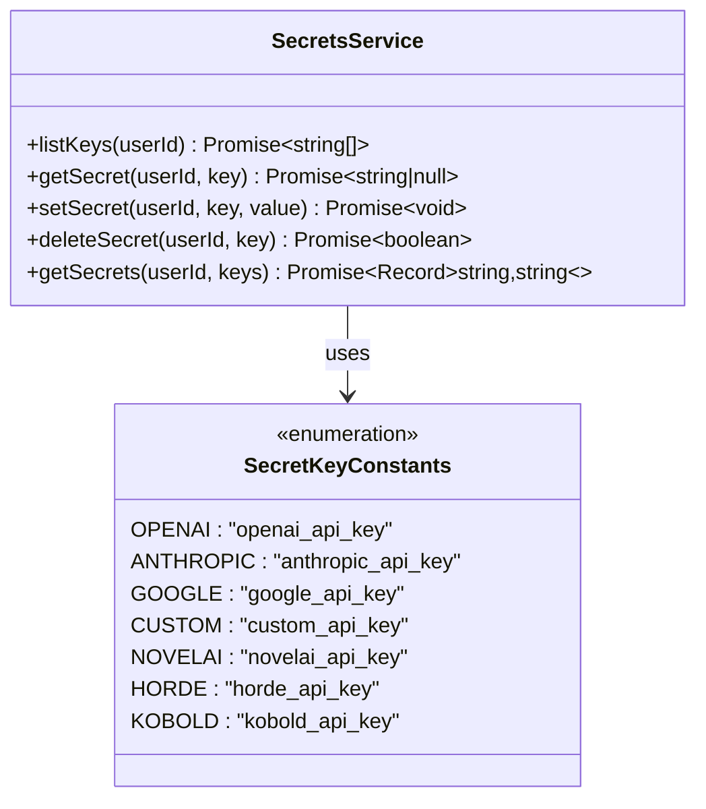

**图表来源**
- [src/lib/services/secrets-service.ts:10-65](file://src/lib/services/secrets-service.ts#L10-L65)
- [src/lib/services/secrets-service.ts:67-115](file://src/lib/services/secrets-service.ts#L67-L115)

### API 连接配置界面

API 连接配置界面提供了用户友好的密钥管理体验：

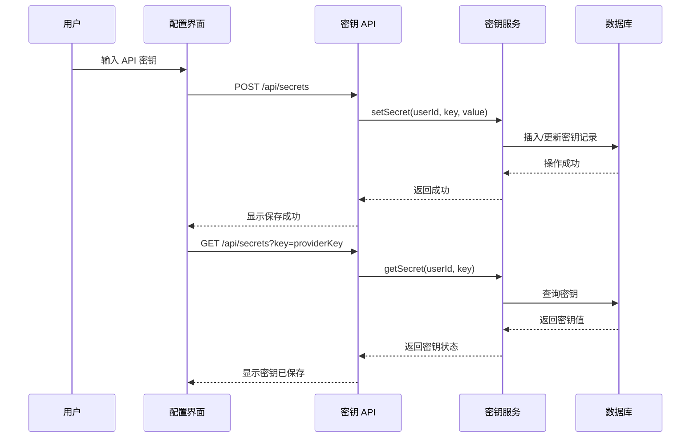

**图表来源**
- [src/components/settings/api-connections.tsx:136-212](file://src/components/settings/api-connections.tsx#L136-L212)
- [src/app/api/secrets/route.ts:32-54](file://src/app/api/secrets/route.ts#L32-L54)

**章节来源**
- [src/lib/services/secrets-service.ts:10-116](file://src/lib/services/secrets-service.ts#L10-L116)
- [src/components/settings/api-connections.tsx:121-212](file://src/components/settings/api-connections.tsx#L121-L212)

## 架构概览

认证密钥管理系统的整体架构采用分层设计，确保了安全性、可扩展性和易维护性：

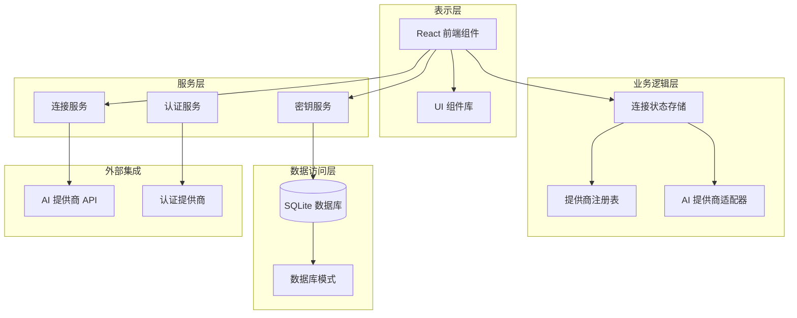

**图表来源**
- [src/lib/stores/connection-store.ts:32-185](file://src/lib/stores/connection-store.ts#L32-L185)
- [src/lib/constants/providers-registry.ts:722-749](file://src/lib/constants/providers-registry.ts#L722-L749)
- [src/lib/services/secrets-service.ts:10-65](file://src/lib/services/secrets-service.ts#L10-L65)

## 详细组件分析

### 密钥映射规则和命名约定

getSecretKeyForProvider 函数实现了 AI 提供商到密钥名称的标准化映射：

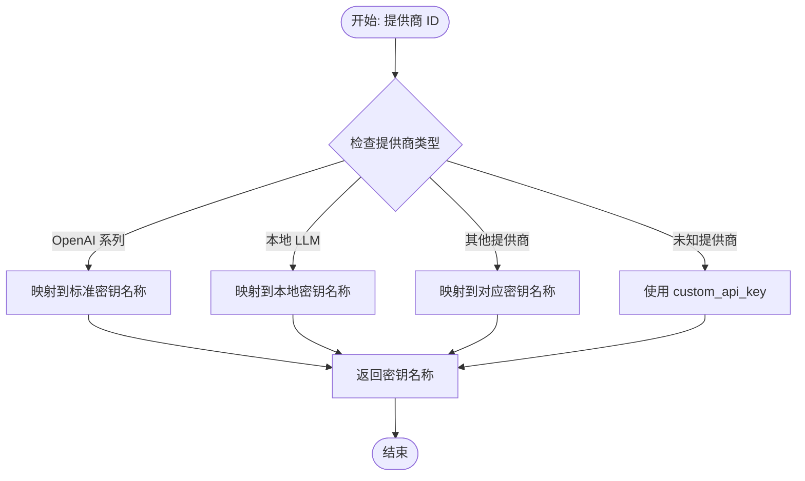

**图表来源**
- [src/lib/ai/providers.ts:102-150](file://src/lib/ai/providers.ts#L102-L150)

密钥命名约定遵循以下规则：
- 标准提供商：`{provider}_api_key`（如 `openai_api_key`）
- Azure OpenAI：`azure_openai_api_key`
- 本地 LLM：`{local_provider}_api_key`（如 `ollama_api_key`）
- 自定义：`custom_api_key`

**章节来源**
- [src/lib/ai/providers.ts:102-150](file://src/lib/ai/providers.ts#L102-L150)
- [src/lib/constants/providers-registry.ts:11-749](file://src/lib/constants/providers-registry.ts#L11-L749)

### API 连接配置界面

API 连接配置界面提供了完整的密钥管理功能：

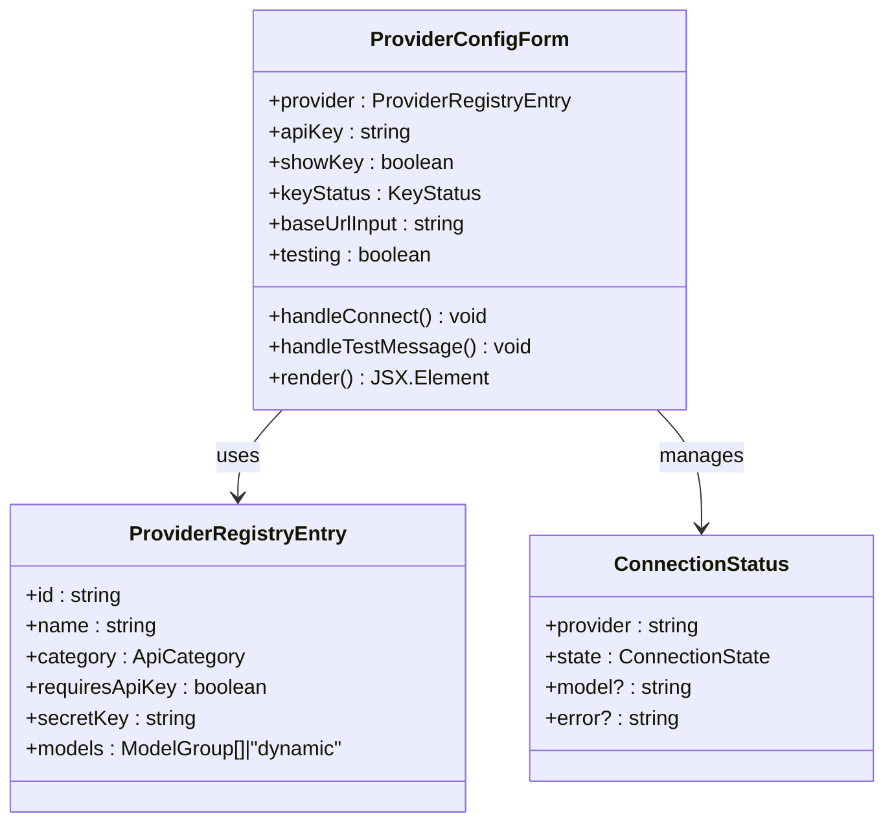

**图表来源**
- [src/components/settings/api-connections.tsx:121-443](file://src/components/settings/api-connections.tsx#L121-L443)
- [src/types/api-connections.ts:41-58](file://src/types/api-connections.ts#L41-L58)

界面功能包括：
- **密钥输入和显示切换**：支持密码模式和明文显示
- **密钥状态管理**：显示密钥是否已保存
- **连接测试**：验证 API 密钥的有效性
- **模型选择**：根据提供商动态加载可用模型
- **高级配置**：支持 Base URL 和反向代理配置

**章节来源**
- [src/components/settings/api-connections.tsx:121-443](file://src/components/settings/api-connections.tsx#L121-L443)
- [src/types/api-connections.ts:86-136](file://src/types/api-connections.ts#L86-L136)

### 密钥验证流程

密钥验证流程确保了 API 连接的可靠性和安全性：

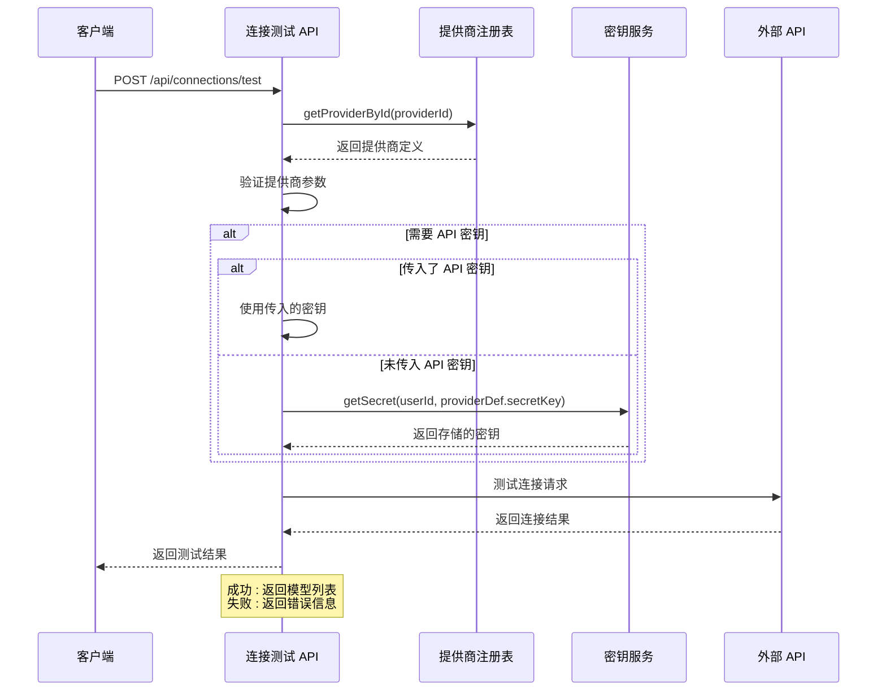

**图表来源**
- [src/app/api/connections/test/route.ts:10-52](file://src/app/api/connections/test/route.ts#L10-L52)
- [src/app/api/connections/test/route.ts:54-148](file://src/app/api/connections/test/route.ts#L54-L148)

**章节来源**
- [src/app/api/connections/test/route.ts:10-149](file://src/app/api/connections/test/route.ts#L10-L149)

### 错误处理机制

系统实现了多层次的错误处理机制：

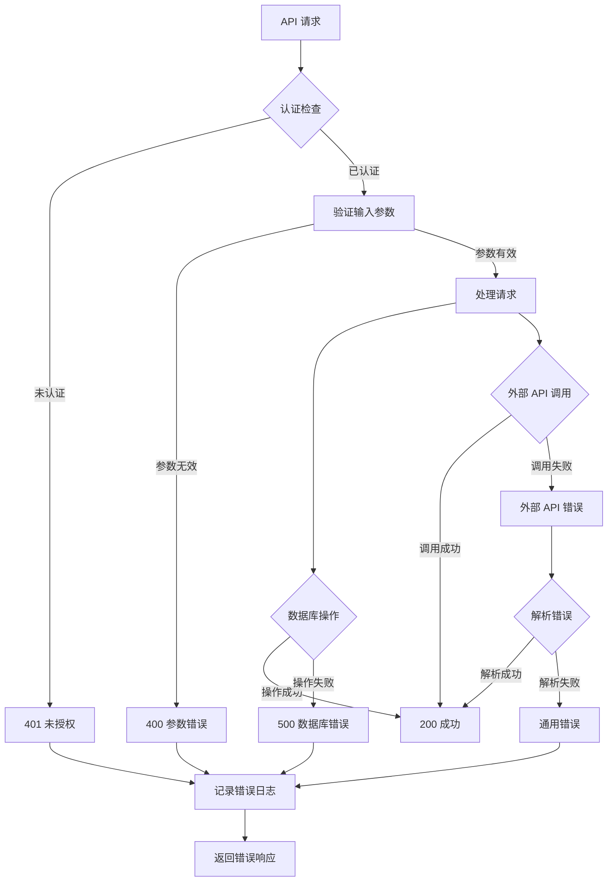

**图表来源**
- [src/app/api/secrets/route.ts:8-82](file://src/app/api/secrets/route.ts#L8-L82)
- [src/app/api/connections/test/route.ts:47-51](file://src/app/api/connections/test/route.ts#L47-L51)

**章节来源**
- [src/app/api/secrets/route.ts:8-82](file://src/app/api/secrets/route.ts#L8-L82)
- [src/app/api/connections/test/route.ts:47-51](file://src/app/api/connections/test/route.ts#L47-L51)

## 依赖关系分析

认证密钥管理系统的依赖关系体现了清晰的分层架构：

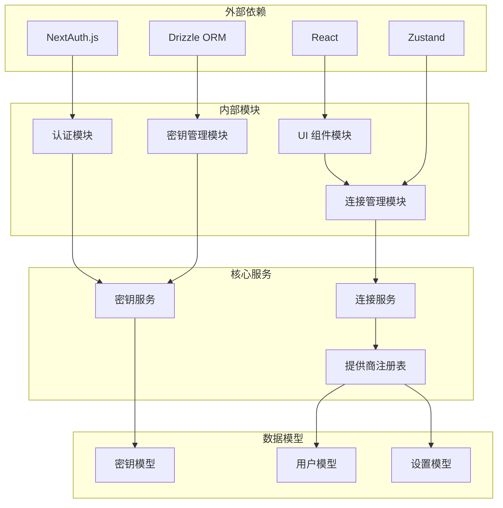

**图表来源**
- [src/lib/auth.ts:1-59](file://src/lib/auth.ts#L1-L59)
- [src/lib/services/secrets-service.ts:1-5](file://src/lib/services/secrets-service.ts#L1-L5)
- [src/lib/stores/connection-store.ts:1-30](file://src/lib/stores/connection-store.ts#L1-L30)

**章节来源**
- [src/lib/auth.ts:1-59](file://src/lib/auth.ts#L1-L59)
- [src/lib/services/secrets-service.ts:1-116](file://src/lib/services/secrets-service.ts#L1-L116)
- [src/lib/stores/connection-store.ts:1-186](file://src/lib/stores/connection-store.ts#L1-L186)

## 性能考虑

### 数据库优化

系统采用了多种数据库优化策略：

1. **索引设计**：密钥表基于 `userId` 和 `key` 字段建立复合索引
2. **查询优化**：使用条件查询减少不必要的数据传输
3. **批量操作**：支持批量获取多个密钥值

### 缓存策略

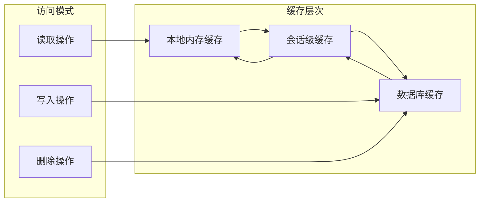

### 并发控制

系统通过以下机制确保并发安全性：
- **事务处理**：数据库操作使用事务确保一致性
- **锁机制**：防止并发修改导致的数据不一致
- **重试策略**：网络异常时的自动重试机制

## 故障排除指南

### 常见问题及解决方案

#### 1. 密钥保存失败

**症状**：API 密钥无法保存到数据库

**可能原因**：
- 用户未登录或会话过期
- 数据库连接异常
- 密钥格式不符合要求

**解决步骤**：
1. 检查用户认证状态
2. 验证数据库连接
3. 确认密钥格式正确
4. 查看服务器日志

#### 2. 连接测试失败

**症状**：连接测试返回错误

**可能原因**：
- API 密钥无效或过期
- 网络连接问题
- 提供商 API 限制

**解决步骤**：
1. 重新输入有效的 API 密钥
2. 检查网络连接状态
3. 验证提供商 API 的可用性
4. 查看详细的错误信息

#### 3. 密钥显示问题

**症状**：已保存的密钥在界面中不显示

**可能原因**：
- 隐私保护机制（出于安全考虑，保存后不显示密钥）
- 前端状态同步问题

**解决步骤**：
1. 输入新密钥进行替换
2. 刷新页面重新加载状态
3. 检查浏览器控制台是否有错误

### 调试工具和技巧

#### 日志分析

系统提供了详细的日志记录机制：

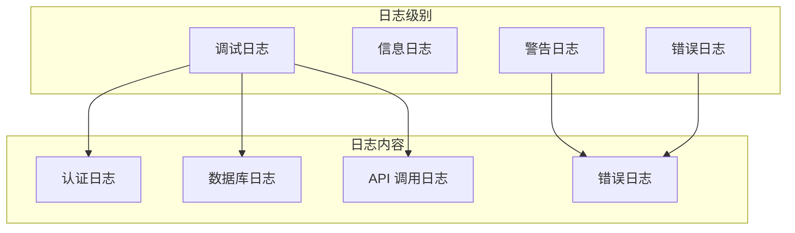

#### 性能监控

建议监控的关键指标：
- API 响应时间
- 数据库查询性能
- 内存使用情况
- 并发连接数

**章节来源**
- [src/app/api/secrets/route.ts:26-28](file://src/app/api/secrets/route.ts#L26-L28)
- [src/app/api/connections/test/route.ts:47-51](file://src/app/api/connections/test/route.ts#L47-L51)

## 结论

认证密钥管理系统通过其精心设计的架构和实现，为 SillyTavern Next 提供了安全可靠的密钥管理能力。系统的主要优势包括：

1. **安全性**：采用多层认证和访问控制机制
2. **可扩展性**：支持 30+ AI 提供商的统一管理
3. **用户体验**：提供直观的配置界面和状态反馈
4. **可靠性**：完善的错误处理和故障恢复机制

该系统为 AI 应用开发提供了一个优秀的密钥管理范例，既满足了功能需求，又确保了系统的安全性和稳定性。

## 附录

### 密钥管理最佳实践

#### 安全配置示例

1. **密钥轮换策略**：
   - 定期更换 API 密钥
   - 使用临时密钥进行测试
   - 实施密钥生命周期管理

2. **访问控制**：
   - 最小权限原则
   - 多因素认证
   - 审计日志记录

3. **数据保护**：
   - 加密存储敏感信息
   - 定期备份和恢复测试
   - 网络传输加密

#### 常见问题解决方案

1. **密钥泄露**：立即撤销并重新生成密钥
2. **系统故障**：检查数据库连接和权限
3. **性能问题**：优化查询和添加索引
4. **兼容性问题**：检查提供商 API 版本