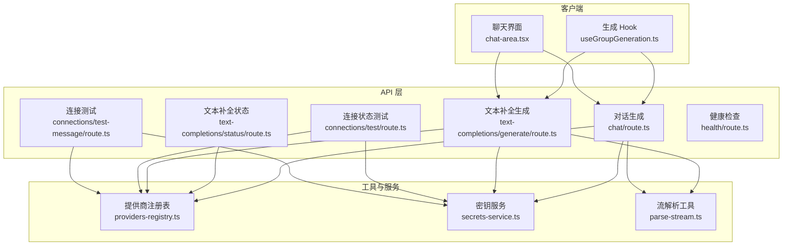
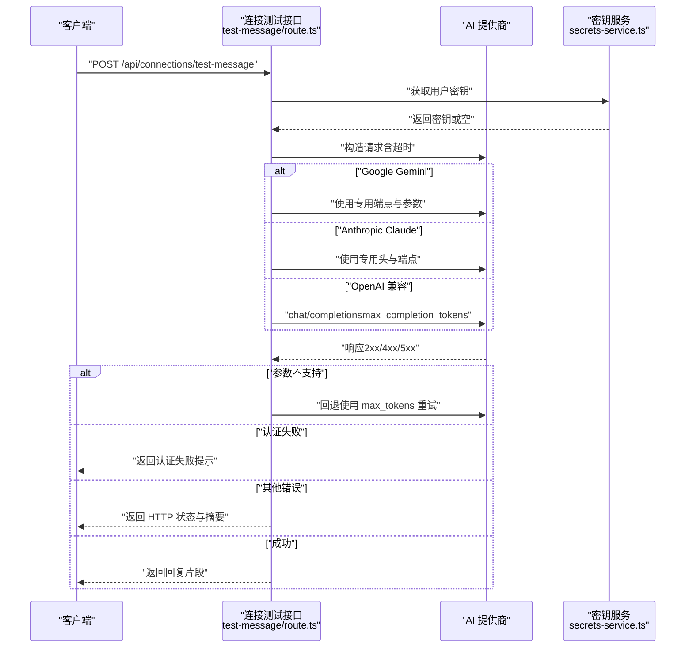
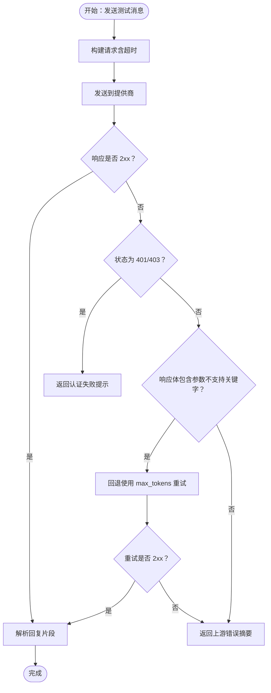
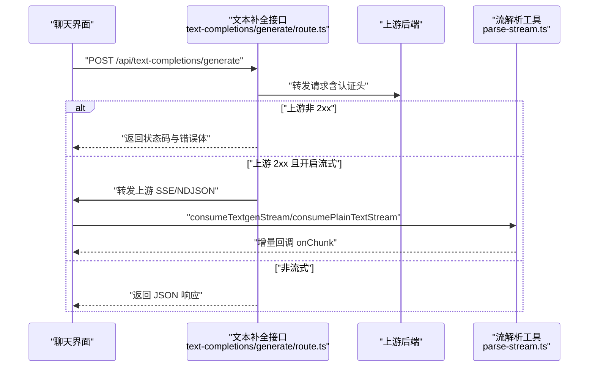
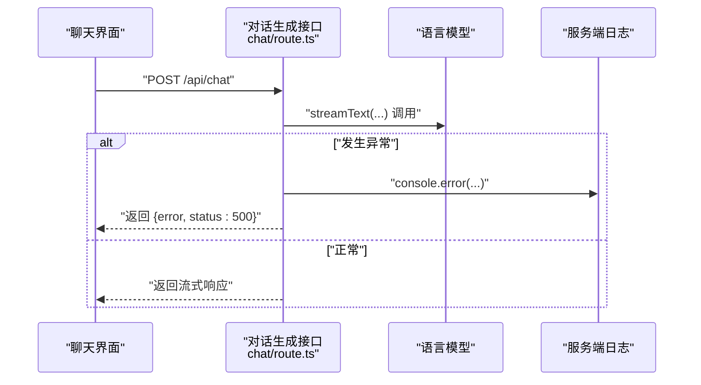
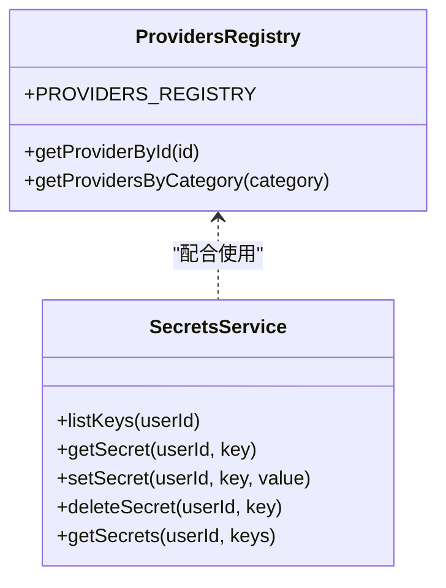
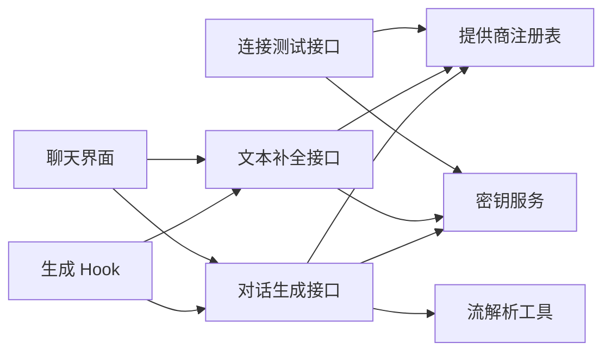

# 错误处理与重试机制

<cite>
**本文引用的文件**
- [src/app/api/connections/test-message/route.ts](file://src/app/api/connections/test-message/route.ts)
- [src/app/api/connections/test/route.ts](file://src/app/api/connections/test/route.ts)
- [src/app/api/text-completions/generate/route.ts](file://src/app/api/text-completions/generate/route.ts)
- [src/app/api/text-completions/status/route.ts](file://src/app/api/text-completions/status/route.ts)
- [src/app/api/chat/route.ts](file://src/app/api/chat/route.ts)
- [src/lib/constants/providers-registry.ts](file://src/lib/constants/providers-registry.ts)
- [src/lib/services/secrets-service.ts](file://src/lib/services/secrets-service.ts)
- [src/lib/textgen/parse-stream.ts](file://src/lib/textgen/parse-stream.ts)
- [src/components/chat/chat-area.tsx](file://src/components/chat/chat-area.tsx)
- [src/hooks/useGroupGeneration.ts](file://src/hooks/useGroupGeneration.ts)
- [src/app/api/health/route.ts](file://src/app/api/health/route.ts)
</cite>

## 目录
1. [简介](#简介)
2. [项目结构](#项目结构)
3. [核心组件](#核心组件)
4. [架构总览](#架构总览)
5. [详细组件分析](#详细组件分析)
6. [依赖关系分析](#依赖关系分析)
7. [性能考量](#性能考量)
8. [故障排除指南](#故障排除指南)
9. [结论](#结论)
10. [附录](#附录)

## 简介
本技术文档聚焦于 AI 提供商错误处理与重试机制，系统梳理项目中的错误识别、分类与处理策略，覆盖网络错误、API 限额、认证失败、模型不可用等异常场景，并结合现有实现说明指数退避重试、超时配置与熔断思路。同时给出日志记录、监控指标与告警建议，以及最佳实践与故障排除清单。

## 项目结构
围绕“错误处理与重试”的关键模块分布如下：
- API 层：连接测试、文本补全、健康检查等接口负责对外部调用进行错误捕获与响应。
- 客户端层：聊天界面与 Hook 在发起请求时设置超时与中断信号，处理非 2xx 响应与流式解析异常。
- 工具与服务：提供商注册表、密钥服务、流解析工具等支撑错误分类与恢复策略。

**图表来源**
- [src/components/chat/chat-area.tsx](file://src/components/chat/chat-area.tsx)
- [src/hooks/useGroupGeneration.ts](file://src/hooks/useGroupGeneration.ts)
- [src/app/api/connections/test-message/route.ts](file://src/app/api/connections/test-message/route.ts)
- [src/app/api/connections/test/route.ts](file://src/app/api/connections/test/route.ts)
- [src/app/api/text-completions/generate/route.ts](file://src/app/api/text-completions/generate/route.ts)
- [src/app/api/text-completions/status/route.ts](file://src/app/api/text-completions/status/route.ts)
- [src/app/api/chat/route.ts](file://src/app/api/chat/route.ts)
- [src/lib/constants/providers-registry.ts](file://src/lib/constants/providers-registry.ts)
- [src/lib/services/secrets-service.ts](file://src/lib/services/secrets-service.ts)
- [src/lib/textgen/parse-stream.ts](file://src/lib/textgen/parse-stream.ts)

**章节来源**
- [src/app/api/connections/test-message/route.ts](file://src/app/api/connections/test-message/route.ts)
- [src/app/api/connections/test/route.ts](file://src/app/api/connections/test/route.ts)
- [src/app/api/text-completions/generate/route.ts](file://src/app/api/text-completions/generate/route.ts)
- [src/app/api/text-completions/status/route.ts](file://src/app/api/text-completions/status/route.ts)
- [src/app/api/chat/route.ts](file://src/app/api/chat/route.ts)
- [src/lib/constants/providers-registry.ts](file://src/lib/constants/providers-registry.ts)
- [src/lib/services/secrets-service.ts](file://src/lib/services/secrets-service.ts)
- [src/lib/textgen/parse-stream.ts](file://src/lib/textgen/parse-stream.ts)
- [src/components/chat/chat-area.tsx](file://src/components/chat/chat-area.tsx)
- [src/hooks/useGroupGeneration.ts](file://src/hooks/useGroupGeneration.ts)

## 核心组件
- 连接测试与参数回退
  - 对 OpenAI 兼容接口，优先使用 max_completion_tokens；若提示不支持则回退到 max_tokens 并重试。
  - 对 Google Gemini 与 Anthropic 使用各自专用端点与头部，统一设置超时。
- 文本补全与流式解析
  - 文本补全接口对上游非 2xx 响应直接透传状态码与错误体；流式场景直接转发上游 SSE/NDJSON。
  - 客户端侧消费流时兼容多种后端输出格式，异常时记录并提示。
- 错误分类与响应
  - 认证失败（401/403）：明确提示需配置 API Key 或无效 Key。
  - 参数不支持：针对 max_completion_tokens 回退处理。
  - 其他 HTTP 错误：返回 HTTP 状态码与简短错误摘要。
- 超时与中断
  - 大多数外部请求设置 AbortSignal.timeout，确保不会无限等待。
  - 客户端在 UI 交互中通过 AbortController 控制生成中断。
- 健康检查与状态探测
  - 健康检查端点用于容器编排与监控系统探活。
  - 文本补全状态端点探测后端可达性与模型列表。

**章节来源**
- [src/app/api/connections/test-message/route.ts](file://src/app/api/connections/test-message/route.ts)
- [src/app/api/text-completions/generate/route.ts](file://src/app/api/text-completions/generate/route.ts)
- [src/lib/textgen/parse-stream.ts](file://src/lib/textgen/parse-stream.ts)
- [src/components/chat/chat-area.tsx](file://src/components/chat/chat-area.tsx)
- [src/app/api/health/route.ts](file://src/app/api/health/route.ts)
- [src/app/api/text-completions/status/route.ts](file://src/app/api/text-completions/status/route.ts)

## 架构总览
以下序列图展示典型“发送测试消息”流程，体现错误识别、回退与响应路径。

**图表来源**
- [src/app/api/connections/test-message/route.ts](file://src/app/api/connections/test-message/route.ts)
- [src/lib/services/secrets-service.ts](file://src/lib/services/secrets-service.ts)

## 详细组件分析

### 组件 A：连接测试与参数回退（OpenAI 兼容）
- 错误识别
  - 当上游返回 401/403 时，判定为认证失败。
  - 当响应体包含“max_completion_tokens”或“unsupported_parameter”时，判定为参数不支持。
- 处理策略
  - 认证失败：根据是否已提供密钥返回不同提示。
  - 参数不支持：自动回退到 max_tokens 并重试一次。
- 超时配置
  - Google/Anthropic/通用接口均设置 AbortSignal.timeout，避免长时间阻塞。
- 可观测性
  - 返回体包含 HTTP 状态码与响应摘要，便于前端提示与日志定位。

**图表来源**
- [src/app/api/connections/test-message/route.ts](file://src/app/api/connections/test-message/route.ts)

**章节来源**
- [src/app/api/connections/test-message/route.ts](file://src/app/api/connections/test-message/route.ts)

### 组件 B：文本补全生成与流式解析
- 错误处理
  - 上游非 2xx：直接将状态码与响应体（截断）返回给客户端。
  - 流式场景：直接转发上游 SSE/NDJSON，保持 Content-Type 与缓存控制。
  - 解析异常：流解析器对非 JSON 行做容错处理，避免中断。
- 客户端消费
  - 支持 textgen 与纯文本两种流式消费方式，分别调用对应的解析函数。
  - 对续写、继续生成等操作，基于上一条消息内容追加新生成片段。

**图表来源**
- [src/app/api/text-completions/generate/route.ts](file://src/app/api/text-completions/generate/route.ts)
- [src/lib/textgen/parse-stream.ts](file://src/lib/textgen/parse-stream.ts)
- [src/components/chat/chat-area.tsx](file://src/components/chat/chat-area.tsx)

**章节来源**
- [src/app/api/text-completions/generate/route.ts](file://src/app/api/text-completions/generate/route.ts)
- [src/lib/textgen/parse-stream.ts](file://src/lib/textgen/parse-stream.ts)
- [src/components/chat/chat-area.tsx](file://src/components/chat/chat-area.tsx)

### 组件 C：对话生成与错误兜底
- 错误兜底
  - 服务端捕获未知异常，统一返回 500 与错误信息，同时在服务端打印日志。
- 客户端兜底
  - 对 /api/chat 的非 2xx 响应，解析错误并抛出，由 UI 捕获并弹窗提示。
  - 对续写/继续生成等操作，基于 AbortController 支持中断。

**图表来源**
- [src/app/api/chat/route.ts](file://src/app/api/chat/route.ts)
- [src/components/chat/chat-area.tsx](file://src/components/chat/chat-area.tsx)

**章节来源**
- [src/app/api/chat/route.ts](file://src/app/api/chat/route.ts)
- [src/components/chat/chat-area.tsx](file://src/components/chat/chat-area.tsx)

### 组件 D：提供商注册与密钥管理
- 提供商注册
  - 统一维护各提供商的 ID、名称、是否需要 API Key、默认 Base URL、模型列表等元数据。
- 密钥管理
  - 用户密钥存储在数据库中，按用户维度查询、插入、更新与删除。
  - 连接测试与文本补全接口通过密钥服务获取密钥，用于构造请求头。

**图表来源**
- [src/lib/constants/providers-registry.ts](file://src/lib/constants/providers-registry.ts)
- [src/lib/services/secrets-service.ts](file://src/lib/services/secrets-service.ts)

**章节来源**
- [src/lib/constants/providers-registry.ts](file://src/lib/constants/providers-registry.ts)
- [src/lib/services/secrets-service.ts](file://src/lib/services/secrets-service.ts)

## 依赖关系分析
- 组件耦合
  - 连接测试与文本补全接口依赖提供商注册表与密钥服务，形成“配置—鉴权—调用”的清晰链路。
  - 客户端 UI 与 Hook 通过 AbortController 控制请求生命周期，减少资源占用。
- 外部依赖
  - 外部 HTTP 请求使用 AbortSignal.timeout，避免阻塞。
  - 流式解析工具对多后端格式做兼容，降低上游差异带来的风险。

**图表来源**
- [src/app/api/connections/test-message/route.ts](file://src/app/api/connections/test-message/route.ts)
- [src/app/api/text-completions/generate/route.ts](file://src/app/api/text-completions/generate/route.ts)
- [src/app/api/chat/route.ts](file://src/app/api/chat/route.ts)
- [src/lib/constants/providers-registry.ts](file://src/lib/constants/providers-registry.ts)
- [src/lib/services/secrets-service.ts](file://src/lib/services/secrets-service.ts)
- [src/lib/textgen/parse-stream.ts](file://src/lib/textgen/parse-stream.ts)
- [src/components/chat/chat-area.tsx](file://src/components/chat/chat-area.tsx)
- [src/hooks/useGroupGeneration.ts](file://src/hooks/useGroupGeneration.ts)

**章节来源**
- [src/app/api/connections/test-message/route.ts](file://src/app/api/connections/test-message/route.ts)
- [src/app/api/text-completions/generate/route.ts](file://src/app/api/text-completions/generate/route.ts)
- [src/app/api/chat/route.ts](file://src/app/api/chat/route.ts)
- [src/lib/constants/providers-registry.ts](file://src/lib/constants/providers-registry.ts)
- [src/lib/services/secrets-service.ts](file://src/lib/services/secrets-service.ts)
- [src/lib/textgen/parse-stream.ts](file://src/lib/textgen/parse-stream.ts)
- [src/components/chat/chat-area.tsx](file://src/components/chat/chat-area.tsx)
- [src/hooks/useGroupGeneration.ts](file://src/hooks/useGroupGeneration.ts)

## 性能考量
- 超时与中断
  - 外部请求普遍设置 AbortSignal.timeout，避免长时间等待导致资源积压。
  - 客户端通过 AbortController 支持主动中断，提升交互体验。
- 流式传输
  - 文本补全与对话生成采用流式传输，降低首字节延迟，改善感知性能。
- 日志与可观测性
  - 服务端对异常进行日志记录，便于定位问题；接口返回错误摘要，辅助前端提示。

[本节为通用指导，不直接分析具体文件]

## 故障排除指南
- 认证失败（401/403）
  - 现象：连接测试返回“认证失败”或“请先输入 API Key 并点击连接”。
  - 排查：确认密钥服务中已保存对应提供商的密钥；检查请求头是否正确注入。
- 参数不支持（max_completion_tokens）
  - 现象：首次请求失败，随后自动回退并重试成功。
  - 排查：确认上游是否支持 max_completion_tokens；如不支持，回退逻辑会自动生效。
- 网络超时或上游不稳定
  - 现象：请求长时间无响应或报错。
  - 排查：检查 AbortSignal.timeout 是否触发；确认网络连通性与代理设置。
- 流式解析异常
  - 现象：生成过程中出现解析错误或中断。
  - 排查：确认上游输出格式（SSE/NDJSON/纯文本）与解析器匹配；查看日志中错误堆栈。
- 健康检查失败
  - 现象：健康检查端点无法访问或返回异常。
  - 排查：确认容器编排与探针配置；检查防火墙与端口映射。

**章节来源**
- [src/app/api/connections/test-message/route.ts](file://src/app/api/connections/test-message/route.ts)
- [src/app/api/text-completions/generate/route.ts](file://src/app/api/text-completions/generate/route.ts)
- [src/lib/textgen/parse-stream.ts](file://src/lib/textgen/parse-stream.ts)
- [src/app/api/health/route.ts](file://src/app/api/health/route.ts)

## 结论
本项目在错误处理方面具备以下特点：
- 明确的错误分类：认证失败、参数不支持、其他 HTTP 错误。
- 自动化的参数回退：针对 max_completion_tokens 的不支持场景自动切换至 max_tokens。
- 完善的超时与中断：统一使用 AbortSignal.timeout 与 AbortController，保障稳定性。
- 流式兼容与容错：对多后端输出格式进行兼容解析，增强鲁棒性。
建议后续可引入指数退避与熔断策略，进一步提升在高波动环境下的可靠性。

[本节为总结性内容，不直接分析具体文件]

## 附录

### A. 错误类型与处理策略对照
- 认证失败（401/403）
  - 处理：提示用户配置密钥或检查密钥有效性。
  - 来源：连接测试与文本补全接口。
- 参数不支持（max_completion_tokens）
  - 处理：自动回退到 max_tokens 并重试一次。
  - 来源：连接测试接口。
- 网络错误/上游异常
  - 处理：透传状态码与错误摘要；流式场景直接转发上游响应。
  - 来源：文本补全与对话生成接口。
- 客户端中断
  - 处理：通过 AbortController 主动中断请求，释放资源。
  - 来源：聊天界面与生成 Hook。

**章节来源**
- [src/app/api/connections/test-message/route.ts](file://src/app/api/connections/test-message/route.ts)
- [src/app/api/text-completions/generate/route.ts](file://src/app/api/text-completions/generate/route.ts)
- [src/components/chat/chat-area.tsx](file://src/components/chat/chat-area.tsx)
- [src/hooks/useGroupGeneration.ts](file://src/hooks/useGroupGeneration.ts)

### B. 指数退避与熔断建议
- 指数退避
  - 场景：对 5xx、超时、限流等可重试错误采用指数退避。
  - 实现要点：设置最大重试次数与最大退避时间；区分幂等与非幂等请求。
- 熔断
  - 场景：连续失败达到阈值后短时间熔断，避免雪崩。
  - 实现要点：统计窗口内的错误率与成功率；熔断后快速失败并周期性半开探测。

[本节为概念性建议，不直接分析具体文件]