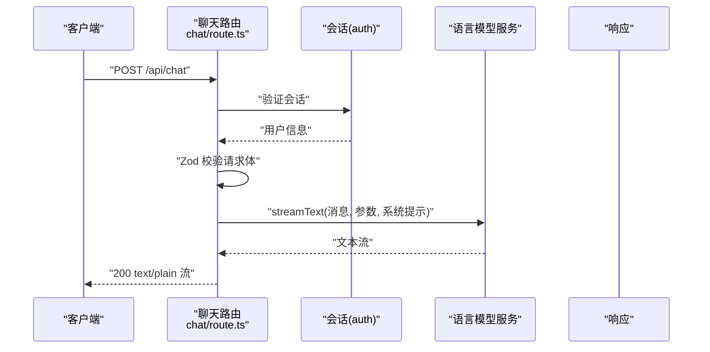
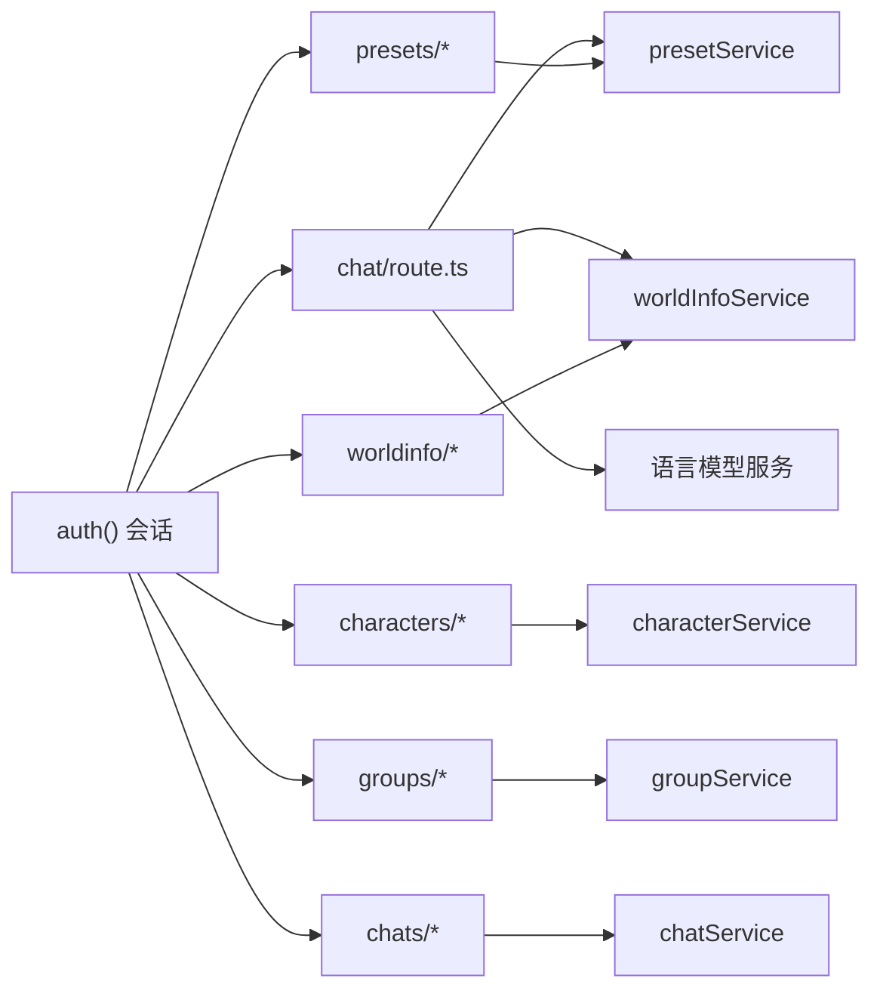

# API 接口文档

<cite>
**本文引用的文件**
- [src/app/api/chat/route.ts](file://src/app/api/chat/route.ts)
- [src/app/api/characters/route.ts](file://src/app/api/characters/route.ts)
- [src/app/api/characters/[id]/route.ts](file://src/app/api/characters/[id]/route.ts)
- [src/app/api/characters/import/route.ts](file://src/app/api/characters/import/route.ts)
- [src/app/api/worldinfo/route.ts](file://src/app/api/worldinfo/route.ts)
- [src/app/api/worldinfo/[id]/route.ts](file://src/app/api/worldinfo/[id]/route.ts)
- [src/app/api/worldinfo/import/route.ts](file://src/app/api/worldinfo/import/route.ts)
- [src/app/api/groups/route.ts](file://src/app/api/groups/route.ts)
- [src/app/api/groups/[id]/route.ts](file://src/app/api/groups/[id]/route.ts)
- [src/app/api/chats/route.ts](file://src/app/api/chats/route.ts)
- [src/app/api/chats/[id]/route.ts](file://src/app/api/chats/[id]/route.ts)
- [src/app/api/presets/route.ts](file://src/app/api/presets/route.ts)
- [src/app/api/presets/[id]/route.ts](file://src/app/api/presets/[id]/route.ts)
- [src/app/api/presets/import/route.ts](file://src/app/api/presets/import/route.ts)
- [src/app/api/presets/master/export/route.ts](file://src/app/api/presets/master/export/route.ts)
</cite>

## 目录
1. [简介](#简介)
2. [项目结构](#项目结构)
3. [核心组件](#核心组件)
4. [架构总览](#架构总览)
5. [详细组件分析](#详细组件分析)
6. [依赖分析](#依赖分析)
7. [性能考虑](#性能考虑)
8. [故障排除指南](#故障排除指南)
9. [结论](#结论)
10. [附录](#附录)

## 简介
本文件为 SillyTavern Next 的 RESTful API 接口文档，覆盖聊天、角色、世界设定、群组与预设五大模块。文档说明各端点的 HTTP 方法、URL 模式、请求与响应格式、认证方式、错误码与状态码，并给出使用示例、客户端集成要点与性能优化建议。API 采用 Next.js App Router 的路由约定，统一通过 NextResponse/Response 返回 JSON，并在路由层进行会话校验。

## 项目结构
- 所有 API 路由位于 src/app/api 下，按资源划分目录，如 chat、characters、worldinfo、groups、chats、presets 等。
- 路由文件遵循 Next.js App Router 约定，GET/POST/PATCH/DELETE 等方法直接暴露为 REST 端点。
- 认证统一通过 auth() 获取会话，未登录用户返回 401 Unauthorized。
- 大多数路由对请求体使用 Zod 校验，确保输入合法性并返回 400 Bad Request。

```mermaid
graph TB
subgraph "API 路由"
CHAT["chat/route.ts"]
CHAR["characters/route.ts"]
CHAR_ID["characters/[id]/route.ts"]
CHAR_IMP["characters/import/route.ts"]
WI["worldinfo/route.ts"]
WI_ID["worldinfo/[id]/route.ts"]
WI_IMP["worldinfo/import/route.ts"]
GR["groups/route.ts"]
GR_ID["groups/[id]/route.ts"]
CHATS["chats/route.ts"]
CHATS_ID["chats/[id]/route.ts"]
PRES["presets/route.ts"]
PRES_ID["presets/[id]/route.ts"]
PRES_IMP["presets/import/route.ts"]
PRES_EXP["presets/master/export/route.ts"]
end
CHAT --> |"调用模型服务"| MODEL["语言模型服务"]
CHAR --> |"角色 CRUD"| SVC_CHAR["角色服务"]
WI --> |"世界设定 CRUD"| SVC_WI["世界设定服务"]
GR --> |"群组 CRUD"| SVC_GR["群组服务"]
CHATS --> |"对话 CRUD"| SVC_CHAT["对话服务"]
PRES --> |"预设 CRUD"| SVC_PRESET["预设服务"]
PRES_IMP --> |"解析/导入"| SVC_PRESET
PRES_EXP --> |"聚合导出"| SVC_PRESET
```

图表来源
- [src/app/api/chat/route.ts:1-177](file://src/app/api/chat/route.ts#L1-L177)
- [src/app/api/characters/route.ts:1-42](file://src/app/api/characters/route.ts#L1-L42)
- [src/app/api/worldinfo/route.ts:1-23](file://src/app/api/worldinfo/route.ts#L1-L23)
- [src/app/api/groups/route.ts:1-34](file://src/app/api/groups/route.ts#L1-L34)
- [src/app/api/chats/route.ts:1-45](file://src/app/api/chats/route.ts#L1-L45)
- [src/app/api/presets/route.ts:1-37](file://src/app/api/presets/route.ts#L1-L37)

章节来源
- [src/app/api/chat/route.ts:1-177](file://src/app/api/chat/route.ts#L1-L177)
- [src/app/api/characters/route.ts:1-42](file://src/app/api/characters/route.ts#L1-L42)
- [src/app/api/worldinfo/route.ts:1-23](file://src/app/api/worldinfo/route.ts#L1-L23)
- [src/app/api/groups/route.ts:1-34](file://src/app/api/groups/route.ts#L1-L34)
- [src/app/api/chats/route.ts:1-45](file://src/app/api/chats/route.ts#L1-L45)
- [src/app/api/presets/route.ts:1-37](file://src/app/api/presets/route.ts#L1-L37)

## 核心组件
- 认证中间件：所有受保护路由均通过 auth() 获取会话，缺失或无效会话返回 401。
- 请求校验：使用 Zod Schema 对请求体进行严格校验，非法输入返回 400。
- 流式响应：聊天接口使用 streamText 并返回 toTextStreamResponse，便于实时输出。
- 数据服务：各资源通过对应 service 层执行 CRUD，如 characterService、worldInfoService、groupService、chatService、presetService。
- 错误处理：捕获异常并返回 500；对业务错误（如 Not found）返回 404；对输入错误返回 400。

章节来源
- [src/app/api/chat/route.ts:50-177](file://src/app/api/chat/route.ts#L50-L177)
- [src/app/api/characters/route.ts:1-42](file://src/app/api/characters/route.ts#L1-L42)
- [src/app/api/worldinfo/route.ts:1-23](file://src/app/api/worldinfo/route.ts#L1-L23)
- [src/app/api/groups/route.ts:1-34](file://src/app/api/groups/route.ts#L1-L34)
- [src/app/api/chats/route.ts:1-45](file://src/app/api/chats/route.ts#L1-L45)
- [src/app/api/presets/route.ts:1-37](file://src/app/api/presets/route.ts#L1-L37)

## 架构总览
下图展示客户端与各 API 路由之间的交互关系，以及聊天流式生成的关键路径。

图表来源
- [src/app/api/chat/route.ts:50-177](file://src/app/api/chat/route.ts#L50-L177)

## 详细组件分析

### 聊天 API
- 端点：POST /api/chat
- 认证：必需
- 请求体字段
  - messages: 数组，元素含 role、content
  - provider: 字符串，枚举值（见下方）
  - model: 字符串，默认模型名
  - temperature、maxTokens、topP、frequencyPenalty、presencePenalty、stopSequences: 数值/数组，可选
  - systemPrompt: 字符串，可选
  - worldInfo: 对象，可选
    - globalBookIds: 字符串数组
    - characterBookId: 字符串
    - chatBookIds: 字符串数组
    - settings: 记录，可选
  - customBaseURL、customApiKey: 字符串，可选
- 成功响应：200 text/plain，SSE 风格的文本流
- 错误码：400（请求体非法）、401（未授权）、400/500（模型配置或内部错误）

支持的 provider 列表（节选）
- openai、anthropic、google、openrouter、mistral、cohere、groq、deepseek、xai、perplexity、fireworks、moonshot、siliconflow、minimax、custom、zai、ollama、koboldcpp、llamacpp、vllm、aphrodite、ooba、generic、togetherai、infermaticai、mancer、dreamgen、featherless、nanogpt、electronhub、chutes、pollinations、aimlapi、cometapi、ai21

章节来源
- [src/app/api/chat/route.ts:10-48](file://src/app/api/chat/route.ts#L10-L48)
- [src/app/api/chat/route.ts:50-177](file://src/app/api/chat/route.ts#L50-L177)

### 角色 API
- 列表与创建
  - GET /api/characters
    - 查询参数：q（字符串，搜索关键词）
    - 成功响应：200 JSON 数组
  - POST /api/characters
    - 请求体：角色数据（经 Zod 校验）
    - 成功响应：201 JSON（新角色）
- 单个角色
  - GET /api/characters/[id]
    - 成功响应：200 JSON；不存在返回 404
  - PATCH /api/characters/[id]
    - 请求体：部分更新字段（经 Zod 校验）
    - 成功响应：200 JSON；不存在返回 404
  - DELETE /api/characters/[id]
    - 成功响应：200 { success: true }；不存在返回 404
- 导入
  - POST /api/characters/import
    - 支持上传 .png（角色卡 PNG）或 .json（角色卡 JSON）
    - 成功响应：201 JSON（创建的角色）

章节来源
- [src/app/api/characters/route.ts:1-42](file://src/app/api/characters/route.ts#L1-L42)
- [src/app/api/characters/[id]/route.ts](file://src/app/api/characters/[id]/route.ts#L1-L47)
- [src/app/api/characters/import/route.ts:1-90](file://src/app/api/characters/import/route.ts#L1-L90)

### 世界设定 API
- 列表与创建
  - GET /api/worldinfo
    - 成功响应：200 JSON 数组
  - POST /api/worldinfo
    - 请求体：世界设定数据（经 Zod 校验）
    - 成功响应：201 JSON（新建项）
- 单个世界设定
  - GET /api/worldinfo/[id]
    - 成功响应：200 JSON；不存在返回 404
  - PATCH /api/worldinfo/[id]
    - 请求体：部分更新字段（经 Zod 校验）
    - 成功响应：200 JSON；不存在返回 404
  - DELETE /api/worldinfo/[id]
    - 成功响应：200 { success: true }；不存在返回 404
- 导入
  - POST /api/worldinfo/import
    - 支持 multipart/form-data（file）或 JSON body（{ name?, json }）
    - 成功响应：201 JSON

章节来源
- [src/app/api/worldinfo/route.ts:1-23](file://src/app/api/worldinfo/route.ts#L1-L23)
- [src/app/api/worldinfo/[id]/route.ts](file://src/app/api/worldinfo/[id]/route.ts#L1-L39)
- [src/app/api/worldinfo/import/route.ts:1-41](file://src/app/api/worldinfo/import/route.ts#L1-L41)

### 群组 API
- 列表与创建
  - GET /api/groups
    - 成功响应：200 JSON 数组
  - POST /api/groups
    - 请求体：群组数据（经 Zod 校验）
    - 成功响应：201 JSON（新建群组）
- 单个群组
  - GET /api/groups/[id]
    - 成功响应：200 JSON；不存在返回 404
  - PATCH /api/groups/[id]
    - 请求体：部分更新字段（经 Zod 校验）
    - 成功响应：200 JSON；不存在返回 404
  - DELETE /api/groups/[id]
    - 成功响应：200 { success: true }；不存在返回 404

章节来源
- [src/app/api/groups/route.ts:1-34](file://src/app/api/groups/route.ts#L1-L34)
- [src/app/api/groups/[id]/route.ts](file://src/app/api/groups/[id]/route.ts#L1-L55)

### 对话与聊天记录 API
- 列表与创建
  - GET /api/chats?characterId=&groupId=
    - 成功响应：200 JSON 数组
  - POST /api/chats
    - 请求体：{ characterId?, groupId?, title?, metadata? }
    - 成功响应：201 JSON（新建对话）
- 单个对话
  - GET /api/chats/[id]
    - 成功响应：200 JSON；不存在返回 404
  - PATCH /api/chats/[id]
    - 成功响应：200 JSON；不存在返回 404
  - DELETE /api/chats/[id]
    - 成功响应：204；不存在返回 404

章节来源
- [src/app/api/chats/route.ts:1-45](file://src/app/api/chats/route.ts#L1-L45)
- [src/app/api/chats/[id]/route.ts](file://src/app/api/chats/[id]/route.ts#L1-L74)

### 预设 API
- 列表与创建
  - GET /api/presets?apiType=&provider=&seed=
    - seed=0 时跳过自动播种内置默认预设
    - 成功响应：200 JSON 数组
  - POST /api/presets
    - 请求体：预设数据（经 Zod 校验）
    - 成功响应：201 JSON（新建预设）
- 单个预设
  - GET /api/presets/[id]
    - 成功响应：200 JSON；不存在返回 404
  - PATCH /api/presets/[id]
    - 请求体：部分更新字段（经 Zod 校验）
    - 成功响应：200 JSON；不存在返回 404
  - PUT /api/presets/[id]
    - 语义等同 PATCH
  - DELETE /api/presets/[id]
    - 成功响应：200 { success: true }；不存在返回 404
- 导入
  - POST /api/presets/import
    - 支持单段或多段 Master JSON，自动识别类型（textgenerationwebui/instruct/context/sysprompt/reasoning/srw）
    - 成功响应：200 JSON（导入结果数组），srw 会写入用户格式化设置
- 导出
  - GET /api/presets/master/export?apiTypes=&download=
    - 可选查询参数：apiTypes=逗号分隔的类型集合；download=1 时以附件形式下载
    - 成功响应：200 JSON 或 200 application/json 附件

章节来源
- [src/app/api/presets/route.ts:1-37](file://src/app/api/presets/route.ts#L1-L37)
- [src/app/api/presets/[id]/route.ts](file://src/app/api/presets/[id]/route.ts#L1-L44)
- [src/app/api/presets/import/route.ts:1-191](file://src/app/api/presets/import/route.ts#L1-L191)
- [src/app/api/presets/master/export/route.ts:1-146](file://src/app/api/presets/master/export/route.ts#L1-L146)

## 依赖分析
- 认证依赖：auth() 提供 NextAuth 会话，所有受保护路由均依赖此机制。
- 输入校验：Zod Schema 在路由层集中校验，降低服务层负担。
- 服务层：各资源路由依赖对应 service 层（如 characterService、worldInfoService、groupService、chatService、presetService）。
- 模型与密钥：聊天路由根据 provider 选择模型与密钥来源（服务端密钥或环境变量），本地模型无需密钥。
- 流式输出：聊天路由使用 streamText 并转换为文本流响应。

图表来源
- [src/app/api/chat/route.ts:1-177](file://src/app/api/chat/route.ts#L1-L177)
- [src/app/api/characters/route.ts:1-42](file://src/app/api/characters/route.ts#L1-L42)
- [src/app/api/worldinfo/route.ts:1-23](file://src/app/api/worldinfo/route.ts#L1-L23)
- [src/app/api/groups/route.ts:1-34](file://src/app/api/groups/route.ts#L1-L34)
- [src/app/api/chats/route.ts:1-45](file://src/app/api/chats/route.ts#L1-L45)
- [src/app/api/presets/route.ts:1-37](file://src/app/api/presets/route.ts#L1-L37)

## 性能考虑
- 流式响应：聊天接口返回文本流，减少首字节延迟，提升用户体验。
- 本地模型：ollama/koboldcpp/llamacpp/vllm/aphrodite/ooba 等本地模型无需网络密钥，适合低延迟场景。
- 预设自动播种：首次访问预设列表时自动播种内置默认预设，避免空列表带来的等待。
- 导出聚合：Master 导出优先取当前激活预设，否则取该类型首个预设，减少查询成本。
- 缓存策略：世界设定注入系统提示时，先拼接再插入指定深度，避免重复计算。

## 故障排除指南
- 401 未授权
  - 确保携带正确的会话凭据（Cookie 或 Authorization 头，取决于 NextAuth 配置）。
- 400 请求非法
  - 检查请求体是否符合 Zod Schema；查看响应中的 details 字段定位具体字段。
- 404 未找到
  - 资源 ID 不存在或不属于当前用户。
- 500 内部错误
  - 查看服务器日志，确认模型配置、密钥或数据库连接是否正常。
- 聊天无输出
  - 检查 provider 与 model 是否正确；确认密钥已配置或使用本地模型；检查网络连通性。

章节来源
- [src/app/api/chat/route.ts:50-177](file://src/app/api/chat/route.ts#L50-L177)
- [src/app/api/characters/[id]/route.ts](file://src/app/api/characters/[id]/route.ts#L1-L47)
- [src/app/api/worldinfo/[id]/route.ts](file://src/app/api/worldinfo/[id]/route.ts#L1-L39)
- [src/app/api/groups/[id]/route.ts](file://src/app/api/groups/[id]/route.ts#L1-L55)
- [src/app/api/presets/[id]/route.ts](file://src/app/api/presets/[id]/route.ts#L1-L44)

## 结论
本 API 文档覆盖了 SillyTavern Next 的核心资源管理与对话生成能力。通过严格的输入校验、统一的认证与错误处理、以及流式响应设计，系统在易用性与性能之间取得平衡。建议客户端在集成时遵循本文档的请求格式与错误码约定，并结合本地模型与预设管理优化整体体验。

## 附录

### 认证与安全
- 认证方式：NextAuth 会话（基于 Cookie 或 Bearer Token，取决于部署配置）。
- 安全建议：生产环境启用 HTTPS；限制请求体大小；对敏感字段（如密钥）仅在服务端存储；定期轮换密钥。

### API 版本控制
- 当前版本：未发现显式的 API 版本头或路径版本号；建议客户端固定使用当前路径版本，避免未来变更导致的兼容问题。

### 速率限制
- 未发现内置速率限制逻辑；建议在网关或反向代理层实现限流策略，防止滥用。

### 使用示例（概念性）
- 获取角色列表（带搜索）
  - GET /api/characters?q=example
- 创建角色
  - POST /api/characters
  - Body: { name, description, ... }
- 导入角色卡（PNG 或 JSON）
  - POST /api/characters/import
  - Body: multipart/form-data(file)
- 发送聊天消息（流式）
  - POST /api/chat
  - Body: { messages:[{role,content}], provider, model, temperature, ... }
- 导入预设（Master 或单段）
  - POST /api/presets/import
  - Body: { data: {...}, fileName? }
- 导出预设（Master）
  - GET /api/presets/master/export?download=1