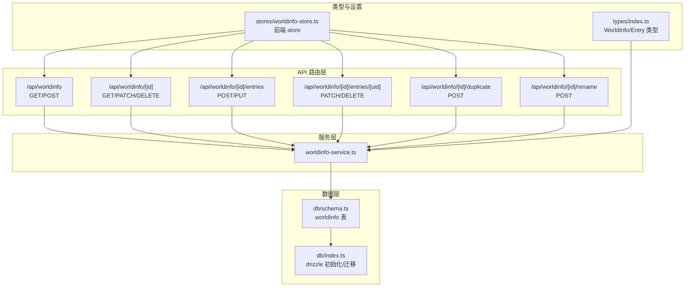
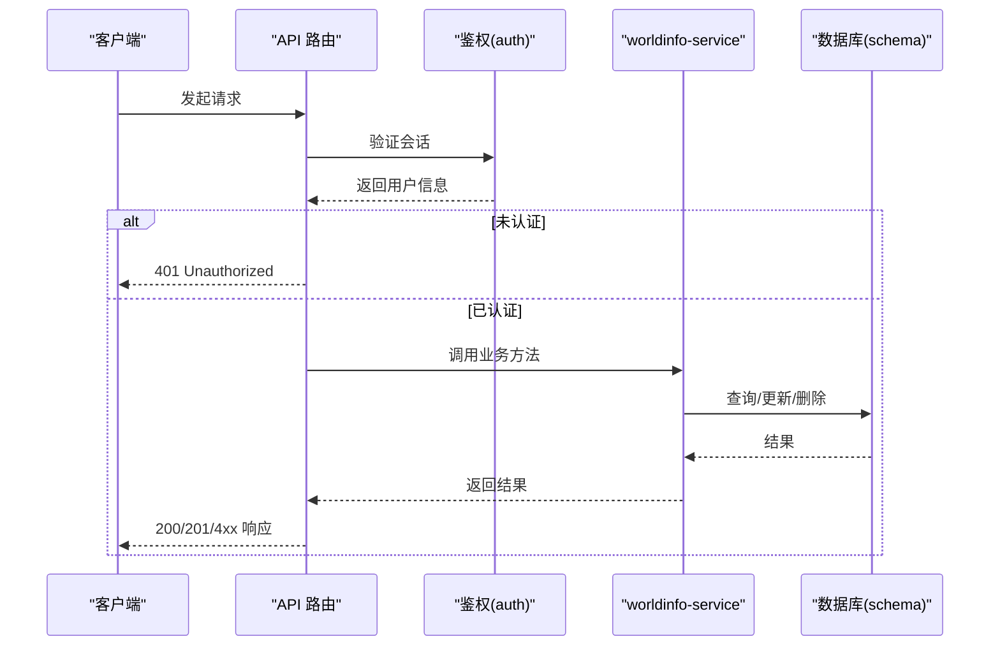
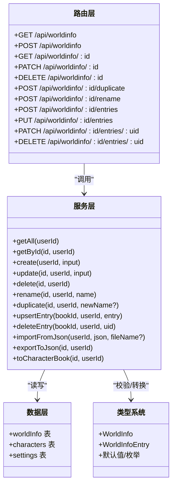

# 世界设定 API

<cite>
**本文引用的文件**
- [src/app/api/worldinfo/route.ts](file://src/app/api/worldinfo/route.ts)
- [src/app/api/worldinfo/[id]/route.ts](file://src/app/api/worldinfo/[id]/route.ts)
- [src/app/api/worldinfo/[id]/entries/route.ts](file://src/app/api/worldinfo/[id]/entries/route.ts)
- [src/app/api/worldinfo/[id]/entries/[uid]/route.ts](file://src/app/api/worldinfo/[id]/entries/[uid]/route.ts)
- [src/app/api/worldinfo/[id]/duplicate/route.ts](file://src/app/api/worldinfo/[id]/duplicate/route.ts)
- [src/app/api/worldinfo/[id]/rename/route.ts](file://src/app/api/worldinfo/[id]/rename/route.ts)
- [src/lib/services/worldinfo-service.ts](file://src/lib/services/worldinfo-service.ts)
- [src/lib/db/schema.ts](file://src/lib/db/schema.ts)
- [src/lib/db/index.ts](file://src/lib/db/index.ts)
- [src/types/index.ts](file://src/types/index.ts)
- [src/stores/worldinfo-store.ts](file://src/stores/worldinfo-store.ts)
</cite>

## 目录
1. [简介](#简介)
2. [项目结构](#项目结构)
3. [核心组件](#核心组件)
4. [架构总览](#架构总览)
5. [详细组件分析](#详细组件分析)
6. [依赖关系分析](#依赖关系分析)
7. [性能考量](#性能考量)
8. [故障排查指南](#故障排查指南)
9. [结论](#结论)
10. [附录](#附录)

## 简介
本文件为“世界设定 API”提供完整的技术文档，覆盖世界书（Lorebook/World Info）的增删改查、词条管理、导入导出、复制与重命名等接口规范，并结合服务层实现说明数据模型、校验规则、权限控制与深度扫描算法等关键机制。文档同时给出调用示例与最佳实践，帮助开发者快速集成与优化。

## 项目结构
世界设定 API 的路由位于 Next.js App Router 的约定式路由目录中，服务层封装在独立的服务模块内，数据模型与数据库表结构在类型与 schema 中定义，前端通过 Zustand store 与 API 交互。

图表来源
- [src/app/api/worldinfo/route.ts:1-23](file://src/app/api/worldinfo/route.ts#L1-L23)
- [src/app/api/worldinfo/[id]/route.ts](file://src/app/api/worldinfo/[id]/route.ts#L1-L39)
- [src/app/api/worldinfo/[id]/entries/route.ts](file://src/app/api/worldinfo/[id]/entries/route.ts#L1-L41)
- [src/app/api/worldinfo/[id]/entries/[uid]/route.ts](file://src/app/api/worldinfo/[id]/entries/[uid]/route.ts#L1-L27)
- [src/app/api/worldinfo/[id]/duplicate/route.ts](file://src/app/api/worldinfo/[id]/duplicate/route.ts#L1-L27)
- [src/app/api/worldinfo/[id]/rename/route.ts](file://src/app/api/worldinfo/[id]/rename/route.ts#L1-L22)
- [src/lib/services/worldinfo-service.ts:1-428](file://src/lib/services/worldinfo-service.ts#L1-L428)
- [src/lib/db/schema.ts:170-180](file://src/lib/db/schema.ts#L170-L180)
- [src/lib/db/index.ts:1-134](file://src/lib/db/index.ts#L1-L134)
- [src/types/index.ts:320-533](file://src/types/index.ts#L320-L533)
- [src/stores/worldinfo-store.ts:1-257](file://src/stores/worldinfo-store.ts#L1-L257)

章节来源
- [src/app/api/worldinfo/route.ts:1-23](file://src/app/api/worldinfo/route.ts#L1-L23)
- [src/app/api/worldinfo/[id]/route.ts](file://src/app/api/worldinfo/[id]/route.ts#L1-L39)
- [src/app/api/worldinfo/[id]/entries/route.ts](file://src/app/api/worldinfo/[id]/entries/route.ts#L1-L41)
- [src/app/api/worldinfo/[id]/entries/[uid]/route.ts](file://src/app/api/worldinfo/[id]/entries/[uid]/route.ts#L1-L27)
- [src/app/api/worldinfo/[id]/duplicate/route.ts](file://src/app/api/worldinfo/[id]/duplicate/route.ts#L1-L27)
- [src/app/api/worldinfo/[id]/rename/route.ts](file://src/app/api/worldinfo/[id]/rename/route.ts#L1-L22)
- [src/lib/services/worldinfo-service.ts:1-428](file://src/lib/services/worldinfo-service.ts#L1-L428)
- [src/lib/db/schema.ts:170-180](file://src/lib/db/schema.ts#L170-L180)
- [src/lib/db/index.ts:1-134](file://src/lib/db/index.ts#L1-L134)
- [src/types/index.ts:320-533](file://src/types/index.ts#L320-L533)
- [src/stores/worldinfo-store.ts:1-257](file://src/stores/worldinfo-store.ts#L1-L257)

## 核心组件
- API 路由层：负责鉴权、请求解析、参数提取与响应返回。
- 服务层：封装业务逻辑，包括 CRUD、导入导出、复制重命名、词条增删改、UID 分配与合并策略。
- 数据层：基于 Drizzle ORM 的 SQLite schema，持久化世界书与词条。
- 类型系统：定义世界书与词条的数据结构、默认值、枚举与约束。
- 前端 store：封装常用操作，简化前端调用。

章节来源
- [src/lib/services/worldinfo-service.ts:97-300](file://src/lib/services/worldinfo-service.ts#L97-L300)
- [src/lib/db/schema.ts:170-180](file://src/lib/db/schema.ts#L170-L180)
- [src/types/index.ts:320-533](file://src/types/index.ts#L320-L533)
- [src/stores/worldinfo-store.ts:43-256](file://src/stores/worldinfo-store.ts#L43-L256)

## 架构总览
世界设定 API 的调用链路遵循“路由 → 服务 → 数据库”的分层设计，所有接口均通过鉴权中间件保护，确保仅登录用户可访问；服务层负责输入校验、默认值合并、数据转换与一致性维护。

图表来源
- [src/app/api/worldinfo/route.ts:5-22](file://src/app/api/worldinfo/route.ts#L5-L22)
- [src/app/api/worldinfo/[id]/route.ts](file://src/app/api/worldinfo/[id]/route.ts#L7-L38)
- [src/lib/services/worldinfo-service.ts:97-192](file://src/lib/services/worldinfo-service.ts#L97-L192)
- [src/lib/db/schema.ts:170-180](file://src/lib/db/schema.ts#L170-L180)

## 详细组件分析

### 世界书管理接口
- GET /api/worldinfo
  - 功能：获取当前用户的世界书列表，按更新时间倒序。
  - 鉴权：需要登录。
  - 成功响应：数组，元素为世界书对象（含 id、name、entries、时间戳）。
  - 失败响应：401 未授权。
  - 章节来源
    - [src/app/api/worldinfo/route.ts:5-11](file://src/app/api/worldinfo/route.ts#L5-L11)

- POST /api/worldinfo
  - 功能：创建新的世界书。
  - 请求体：{ name: string, entries?: Record<string, Entry> }。
  - 校验：使用创建 Schema，name 长度 1~200。
  - 成功响应：创建后的世界书对象，状态码 201。
  - 失败响应：400 输入无效，401 未授权。
  - 章节来源
    - [src/app/api/worldinfo/route.ts:13-22](file://src/app/api/worldinfo/route.ts#L13-L22)
    - [src/lib/services/worldinfo-service.ts:126-140](file://src/lib/services/worldinfo-service.ts#L126-L140)

- GET /api/worldinfo/[id]
  - 功能：获取指定世界书详情。
  - 参数：路径参数 id。
  - 成功响应：世界书对象；若不存在返回 404。
  - 失败响应：401 未授权。
  - 章节来源
    - [src/app/api/worldinfo/[id]/route.ts](file://src/app/api/worldinfo/[id]/route.ts#L7-L15)

- PATCH /api/worldinfo/[id]
  - 功能：更新世界书名称或词条集合。
  - 请求体：{ name?: string, entries?: Record<string, Entry> }。
  - 校验：使用更新 Schema，name 可选且长度限制。
  - 成功响应：更新后的世界书对象；若不存在返回 404。
  - 失败响应：400 输入无效，401 未授权。
  - 章节来源
    - [src/app/api/worldinfo/[id]/route.ts](file://src/app/api/worldinfo/[id]/route.ts#L17-L28)
    - [src/lib/services/worldinfo-service.ts:142-159](file://src/lib/services/worldinfo-service.ts#L142-L159)

- DELETE /api/worldinfo/[id]
  - 功能：删除世界书，并进行级联清理（角色卡关联清空、全局选择列表移除）。
  - 成功响应：{ success: true }。
  - 失败响应：401 未授权，404 不存在。
  - 章节来源
    - [src/app/api/worldinfo/[id]/route.ts](file://src/app/api/worldinfo/[id]/route.ts#L30-L38)
    - [src/lib/services/worldinfo-service.ts:161-192](file://src/lib/services/worldinfo-service.ts#L161-L192)

- POST /api/worldinfo/[id]/duplicate
  - 功能：复制世界书，默认命名为“原名 - Copy”，可选传入新名称。
  - 请求体：{ name?: string }（可选）。
  - 成功响应：复制后的世界书对象，状态码 201。
  - 失败响应：400 输入无效，401 未授权，404 不存在。
  - 章节来源
    - [src/app/api/worldinfo/[id]/duplicate/route.ts](file://src/app/api/worldinfo/[id]/duplicate/route.ts#L10-L26)
    - [src/lib/services/worldinfo-service.ts:198-203](file://src/lib/services/worldinfo-service.ts#L198-L203)

- POST /api/worldinfo/[id]/rename
  - 功能：重命名世界书。
  - 请求体：{ name: string }（1~200）。
  - 成功响应：重命名后的世界书对象。
  - 失败响应：400 输入无效，401 未授权，404 不存在。
  - 章节来源
    - [src/app/api/worldinfo/[id]/rename/route.ts](file://src/app/api/worldinfo/[id]/rename/route.ts#L10-L21)
    - [src/lib/services/worldinfo-service.ts:194-196](file://src/lib/services/worldinfo-service.ts#L194-L196)

### 词条管理接口
- POST /api/worldinfo/[id]/entries
  - 功能：新增或更新词条（支持部分字段，服务层合并默认值）。
  - 请求体：词条对象（可包含 uid；若缺失则自动生成）。
  - 成功响应：合并后的词条对象。
  - 失败响应：401 未授权，404 不存在。
  - 章节来源
    - [src/app/api/worldinfo/[id]/entries/route.ts](file://src/app/api/worldinfo/[id]/entries/route.ts#L8-L18)
    - [src/lib/services/worldinfo-service.ts:205-218](file://src/lib/services/worldinfo-service.ts#L205-L218)

- PUT /api/worldinfo/[id]/entries
  - 功能：批量替换全部词条（entries: Record<uid, Entry>）。
  - 请求体：{ entries: Record<string, Entry> } 或直接传 entries 对象。
  - 成功响应：更新后的世界书对象。
  - 失败响应：400 缺少 entries，401 未授权，404 不存在。
  - 章节来源
    - [src/app/api/worldinfo/[id]/entries/route.ts](file://src/app/api/worldinfo/[id]/entries/route.ts#L21-L40)
    - [src/lib/services/worldinfo-service.ts:142-159](file://src/lib/services/worldinfo-service.ts#L142-L159)

- PATCH /api/worldinfo/[id]/entries/[uid]
  - 功能：更新指定 uid 的词条。
  - 请求体：词条对象（可省略 uid，服务层从路径参数注入）。
  - 成功响应：更新后的词条对象。
  - 失败响应：401 未授权，404 不存在。
  - 章节来源
    - [src/app/api/worldinfo/[id]/entries/[uid]/route.ts](file://src/app/api/worldinfo/[id]/entries/[uid]/route.ts#L7-L16)

- DELETE /api/worldinfo/[id]/entries/[uid]
  - 功能：删除指定 uid 的词条。
  - 成功响应：{ success: true }。
  - 失败响应：401 未授权，404 不存在。
  - 章节来源
    - [src/app/api/worldinfo/[id]/entries/[uid]/route.ts](file://src/app/api/worldinfo/[id]/entries/[uid]/route.ts#L18-L26)
    - [src/lib/services/worldinfo-service.ts:220-228](file://src/lib/services/worldinfo-service.ts#L220-L228)

### 数据模型与类型
- 世界书（WorldInfo）
  - 字段：id、userId、name、entries（JSON 字符串）、createdAt、updatedAt。
  - 章节来源
    - [src/lib/db/schema.ts:173-180](file://src/lib/db/schema.ts#L173-L180)
    - [src/types/index.ts:418-426](file://src/types/index.ts#L418-L426)

- 词条（WorldInfoEntry）
  - 字段：uid、key、keysecondary、comment、content、constant、vectorized、selective、selectiveLogic、addMemo、order、position、disable、ignoreBudget、excludeRecursion、preventRecursion、match* 系列、delayUntilRecursion、probability、useProbability、depth、outletName、group、groupOverride、groupWeight、scanDepth、caseSensitive、matchWholeWords、useGroupScoring、automationId、role、sticky、cooldown、delay、characterFilter*、triggers、displayIndex、extensions。
  - 默认值与枚举：类型文件中定义了默认值、枚举常量与工厂函数。
  - 章节来源
    - [src/types/index.ts:368-507](file://src/types/index.ts#L368-L507)

- 导入/导出兼容
  - 支持 V2 character_book entries 数组与 lorebook entries 记录两种格式互转。
  - 导出时补齐 characterFilter 字段，保持与原项目格式一致。
  - 章节来源
    - [src/lib/services/worldinfo-service.ts:230-299](file://src/lib/services/worldinfo-service.ts#L230-L299)
    - [src/lib/services/worldinfo-service.ts:354-427](file://src/lib/services/worldinfo-service.ts#L354-L427)

### 权限控制与鉴权
- 所有接口均通过鉴权中间件保护，要求用户提供有效会话；未登录用户统一返回 401。
- 服务层在查询/更新/删除时，均以 userId 作为条件，确保用户只能访问自己的世界书。
- 章节来源
  - [src/app/api/worldinfo/route.ts:6-7](file://src/app/api/worldinfo/route.ts#L6-L7)
  - [src/app/api/worldinfo/[id]/route.ts](file://src/app/api/worldinfo/[id]/route.ts#L8-L9)
  - [src/lib/services/worldinfo-service.ts:108-114](file://src/lib/services/worldinfo-service.ts#L108-L114)

### 深度扫描算法与匹配机制
- 词条包含 depth、scanDepth、caseSensitive、matchWholeWords、useGroupScoring、probability、useProbability、selective、selectiveLogic、delayUntilRecursion、preventRecursion、excludeRecursion、matchPersonaDescription、matchCharacter*、matchScenario、matchCreatorNotes、role、sticky、cooldown、delay 等字段，用于控制匹配与插入行为。
- 服务层在导出为 character_book 时，将扩展字段映射到目标结构，保证兼容性。
- 章节来源
  - [src/types/index.ts:368-507](file://src/types/index.ts#L368-L507)
  - [src/lib/services/worldinfo-service.ts:302-352](file://src/lib/services/worldinfo-service.ts#L302-L352)

### 使用示例与最佳实践
- 获取列表
  - 方法：GET /api/worldinfo
  - 建议：首次加载时缓存，更新后刷新。
  - 章节来源
    - [src/stores/worldinfo-store.ts:49-61](file://src/stores/worldinfo-store.ts#L49-L61)

- 创建世界书
  - 方法：POST /api/worldinfo
  - 请求体：{ name: "我的世界书", entries: {} }
  - 建议：先创建空 entries，再批量导入词条。
  - 章节来源
    - [src/stores/worldinfo-store.ts:63-78](file://src/stores/worldinfo-store.ts#L63-L78)

- 批量导入词条
  - 方法：PUT /api/worldinfo/{id}/entries
  - 请求体：{ entries: { "uid": { ... } } }
  - 建议：先解析 JSON，逐条校验，失败时回滚。
  - 章节来源
    - [src/app/api/worldinfo/[id]/entries/route.ts](file://src/app/api/worldinfo/[id]/entries/route.ts#L21-L40)

- 新增/更新词条
  - 方法：POST /api/worldinfo/{id}/entries
  - 请求体：{ uid?, key?, content?, ... }
  - 建议：若未提供 uid，让服务层分配下一个可用 UID。
  - 章节来源
    - [src/stores/worldinfo-store.ts:177-195](file://src/stores/worldinfo-store.ts#L177-L195)

- 删除词条
  - 方法：DELETE /api/worldinfo/{id}/entries/{uid}
  - 建议：删除前确认是否仍被角色卡引用。
  - 章节来源
    - [src/stores/worldinfo-store.ts:197-209](file://src/stores/worldinfo-store.ts#L197-L209)

- 复制与重命名
  - 方法：POST /api/worldinfo/{id}/duplicate、POST /api/worldinfo/{id}/rename
  - 建议：复制时可传入新名称，重命名需满足长度限制。
  - 章节来源
    - [src/stores/worldinfo-store.ts:111-126](file://src/stores/worldinfo-store.ts#L111-L126)
    - [src/stores/worldinfo-store.ts:92-109](file://src/stores/worldinfo-store.ts#L92-L109)

## 依赖关系分析

图表来源
- [src/app/api/worldinfo/route.ts:1-23](file://src/app/api/worldinfo/route.ts#L1-L23)
- [src/app/api/worldinfo/[id]/route.ts](file://src/app/api/worldinfo/[id]/route.ts#L1-L39)
- [src/app/api/worldinfo/[id]/entries/route.ts](file://src/app/api/worldinfo/[id]/entries/route.ts#L1-L41)
- [src/app/api/worldinfo/[id]/entries/[uid]/route.ts](file://src/app/api/worldinfo/[id]/entries/[uid]/route.ts#L1-L27)
- [src/app/api/worldinfo/[id]/duplicate/route.ts](file://src/app/api/worldinfo/[id]/duplicate/route.ts#L1-L27)
- [src/app/api/worldinfo/[id]/rename/route.ts](file://src/app/api/worldinfo/[id]/rename/route.ts#L1-L22)
- [src/lib/services/worldinfo-service.ts:97-300](file://src/lib/services/worldinfo-service.ts#L97-L300)
- [src/lib/db/schema.ts:170-180](file://src/lib/db/schema.ts#L170-L180)
- [src/types/index.ts:320-533](file://src/types/index.ts#L320-L533)

章节来源
- [src/lib/services/worldinfo-service.ts:97-300](file://src/lib/services/worldinfo-service.ts#L97-L300)
- [src/lib/db/schema.ts:170-180](file://src/lib/db/schema.ts#L170-L180)
- [src/types/index.ts:320-533](file://src/types/index.ts#L320-L533)

## 性能考量
- 数据库迁移与初始化：启动时自动迁移，确保 schema 与迁移脚本一致，避免运行期错误。
- 查询排序：列表按 updatedAt 倒序，便于前端展示最新变更。
- 批量更新：PUT /entries 接口接受 entries 记录，服务层逐条校验并一次性更新，减少多次往返。
- 导入兼容：解析复杂 JSON 时建议分步处理，避免大对象一次性解析导致内存峰值过高。
- 前端缓存：store 层集中管理加载状态与缓存，减少重复请求。

章节来源
- [src/lib/db/index.ts:16-30](file://src/lib/db/index.ts#L16-L30)
- [src/lib/services/worldinfo-service.ts:98-106](file://src/lib/services/worldinfo-service.ts#L98-L106)
- [src/app/api/worldinfo/[id]/entries/route.ts](file://src/app/api/worldinfo/[id]/entries/route.ts#L21-L40)
- [src/stores/worldinfo-store.ts:43-61](file://src/stores/worldinfo-store.ts#L43-L61)

## 故障排查指南
- 401 未授权
  - 现象：所有接口返回未授权。
  - 排查：确认会话是否有效，是否携带正确 Cookie/Token。
  - 章节来源
    - [src/app/api/worldinfo/route.ts:6-7](file://src/app/api/worldinfo/route.ts#L6-L7)

- 400 输入无效
  - 现象：创建/更新/重命名接口返回输入校验错误。
  - 排查：检查 name 长度、entries 结构、字段类型与范围。
  - 章节来源
    - [src/app/api/worldinfo/route.ts:17-18](file://src/app/api/worldinfo/route.ts#L17-L18)
    - [src/app/api/worldinfo/[id]/rename/route.ts](file://src/app/api/worldinfo/[id]/rename/route.ts#L15-L16)

- 404 不存在
  - 现象：查询/更新/删除指定 id 的世界书或词条返回不存在。
  - 排查：确认 id 是否正确，是否属于当前用户。
  - 章节来源
    - [src/app/api/worldinfo/[id]/route.ts](file://src/app/api/worldinfo/[id]/route.ts#L13-L14)
    - [src/app/api/worldinfo/[id]/entries/[uid]/route.ts](file://src/app/api/worldinfo/[id]/entries/[uid]/route.ts#L13-L14)

- 级联清理问题
  - 现象：删除世界书后角色卡仍显示引用。
  - 排查：确认服务层删除逻辑是否执行（清空 characters.worldInfoBookId、settings.globalSelect）。
  - 章节来源
    - [src/lib/services/worldinfo-service.ts:161-192](file://src/lib/services/worldinfo-service.ts#L161-L192)

## 结论
本 API 以清晰的分层设计实现了世界书与词条的全生命周期管理，配合严格的输入校验、默认值合并与兼容性导入导出，满足多场景使用需求。通过鉴权与用户隔离保障数据安全，前端 store 将常用操作抽象为易用接口，便于快速集成。

## 附录
- 导入/导出格式
  - 支持 lorebook（entries: Record<uid, Entry>）与 V2 character_book（entries: Array）互转。
  - 导出时补齐 characterFilter 字段，保持与原项目一致。
  - 章节来源
    - [src/lib/services/worldinfo-service.ts:230-299](file://src/lib/services/worldinfo-service.ts#L230-L299)
    - [src/lib/services/worldinfo-service.ts:354-427](file://src/lib/services/worldinfo-service.ts#L354-L427)

- 默认值与枚举
  - 词条默认值与枚举常量集中在类型文件，便于统一维护。
  - 章节来源
    - [src/types/index.ts:368-507](file://src/types/index.ts#L368-L507)