# 系统管理 API

<cite>
**本文档引用的文件**
- [health/route.ts](file://src/app/api/health/route.ts)
- [settings/route.ts](file://src/app/api/settings/route.ts)
- [secrets/route.ts](file://src/app/api/secrets/route.ts)
- [connections/test/route.ts](file://src/app/api/connections/test/route.ts)
- [connections/test-message/route.ts](file://src/app/api/connections/test-message/route.ts)
- [connections/models/route.ts](file://src/app/api/connections/models/route.ts)
- [api-connections.ts](file://src/types/api-connections.ts)
- [secrets-service.ts](file://src/lib/services/secrets-service.ts)
- [providers-registry.ts](file://src/lib/constants/providers-registry.ts)
- [schema.ts](file://src/lib/db/schema.ts)
- [auth.ts](file://src/lib/auth.ts)
- [db/index.ts](file://src/lib/db/index.ts)
</cite>

## 目录
1. [简介](#简介)
2. [项目结构](#项目结构)
3. [核心组件](#核心组件)
4. [架构概览](#架构概览)
5. [详细组件分析](#详细组件分析)
6. [依赖关系分析](#依赖关系分析)
7. [性能考虑](#性能考虑)
8. [故障排除指南](#故障排除指南)
9. [结论](#结论)

## 简介

系统管理 API 是 SillyTavern Next 项目的核心管理接口集合，负责系统的健康监控、配置管理、API 密钥安全存储和连接验证等功能。该 API 提供了完整的系统维护和配置相关接口，包括：

- **健康检查接口**：用于容器编排和监控系统
- **设置管理接口**：用户连接配置的获取和保存
- **密钥管理接口**：安全存储和管理 API 密钥
- **AI 连接测试接口**：验证各种 AI 提供商的连接状态
- **模型列表接口**：获取可用模型列表

这些接口采用 Next.js App Router 的路由约定，提供了 RESTful 的 API 设计，并集成了身份认证和数据库访问功能。

## 项目结构

系统管理 API 的文件组织遵循 Next.js App Router 的目录结构规范，每个 API 端点都位于 `src/app/api/` 目录下的独立子目录中：

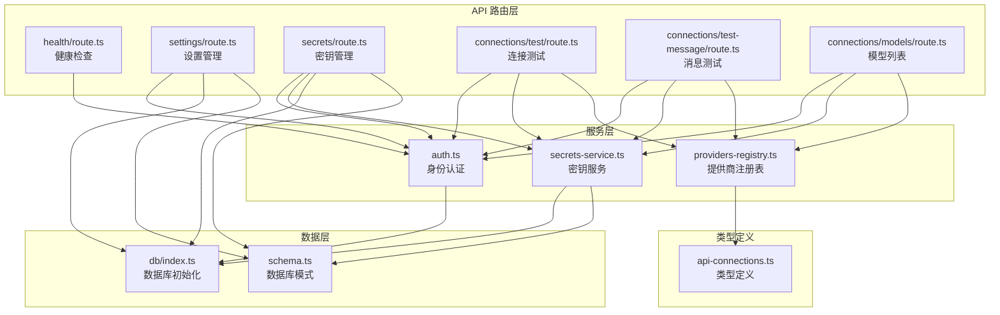

**图表来源**
- [health/route.ts:1-10](file://src/app/api/health/route.ts#L1-L10)
- [settings/route.ts:1-109](file://src/app/api/settings/route.ts#L1-L109)
- [secrets/route.ts:1-83](file://src/app/api/secrets/route.ts#L1-L83)
- [connections/test/route.ts:1-149](file://src/app/api/connections/test/route.ts#L1-L149)
- [connections/test-message/route.ts:1-236](file://src/app/api/connections/test-message/route.ts#L1-L236)
- [connections/models/route.ts:1-132](file://src/app/api/connections/models/route.ts#L1-L132)

**章节来源**
- [health/route.ts:1-10](file://src/app/api/health/route.ts#L1-L10)
- [settings/route.ts:1-109](file://src/app/api/settings/route.ts#L1-L109)
- [secrets/route.ts:1-83](file://src/app/api/secrets/route.ts#L1-L83)

## 核心组件

系统管理 API 由以下核心组件构成：

### 认证组件
- **NextAuth 集成**：提供基于凭据的身份认证
- **JWT 回调**：处理用户令牌的生成和验证
- **会话管理**：维护用户会话状态

### 数据库组件
- **Drizzle ORM**：SQLite 数据库访问层
- **Schema 定义**：用户设置和密钥的数据结构
- **自动迁移**：数据库模式的自动更新

### 服务组件
- **密钥服务**：安全存储和检索 API 密钥
- **提供商注册表**：管理所有支持的 AI 提供商配置

**章节来源**
- [auth.ts:1-59](file://src/lib/auth.ts#L1-L59)
- [db/index.ts:1-134](file://src/lib/db/index.ts#L1-L134)
- [schema.ts:199-217](file://src/lib/db/schema.ts#L199-L217)
- [secrets-service.ts:1-116](file://src/lib/services/secrets-service.ts#L1-L116)
- [providers-registry.ts:1-749](file://src/lib/constants/providers-registry.ts#L1-L749)

## 架构概览

系统管理 API 采用分层架构设计，确保关注点分离和代码的可维护性：

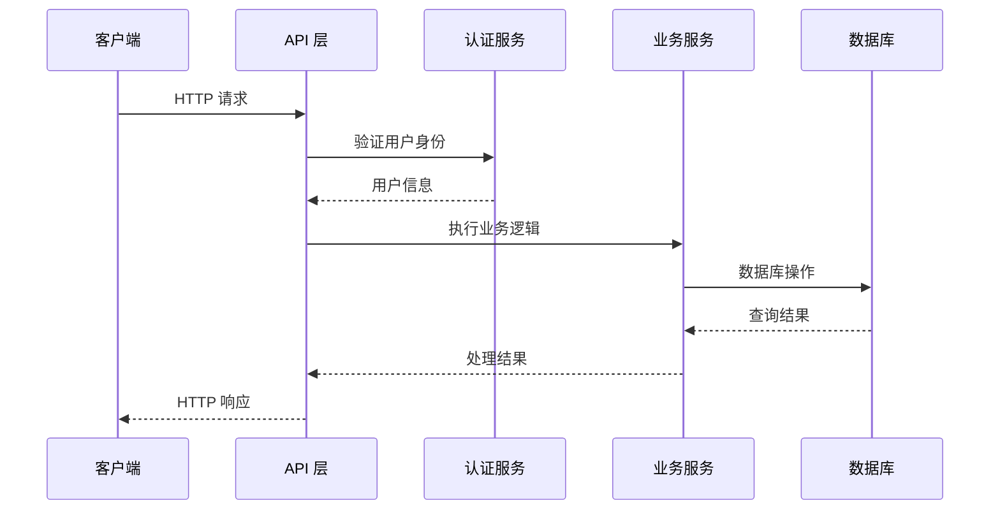

**图表来源**
- [settings/route.ts:22-50](file://src/app/api/settings/route.ts#L22-L50)
- [secrets/route.ts:8-30](file://src/app/api/secrets/route.ts#L8-L30)
- [connections/test/route.ts:10-52](file://src/app/api/connections/test/route.ts#L10-L52)

### 数据流架构

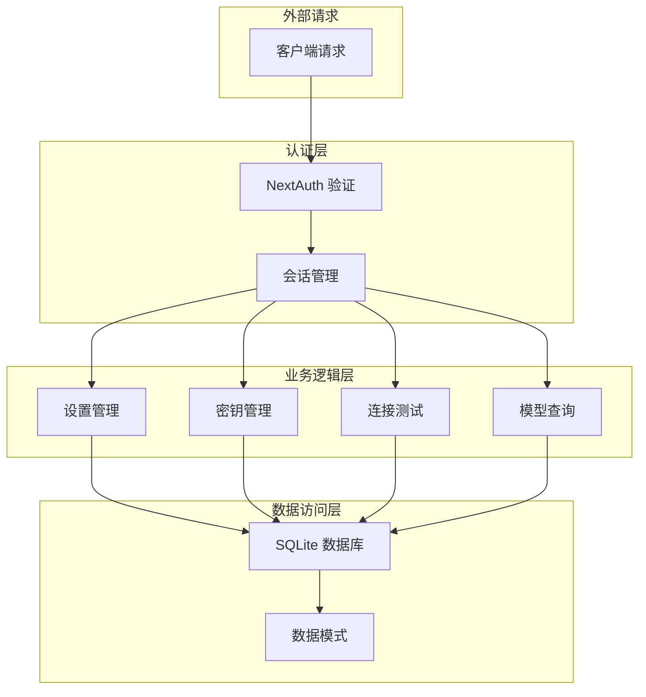

**图表来源**
- [auth.ts:12-58](file://src/lib/auth.ts#L12-L58)
- [db/index.ts:16-30](file://src/lib/db/index.ts#L16-L30)
- [schema.ts:201-217](file://src/lib/db/schema.ts#L201-L217)

## 详细组件分析

### 健康检查接口

#### 接口规范
- **URL**: `GET /api/health`
- **认证**: 无需认证
- **用途**: 容器编排和监控系统健康检查

#### 实现特点
- **动态路由**: 强制动态渲染，避免缓存
- **简单响应**: 返回基本的健康状态信息
- **时间戳**: 包含检查时间，便于监控

#### 响应格式
```json
{
  "status": "ok",
  "ts": 1700000000000
}
```

**章节来源**
- [health/route.ts:1-10](file://src/app/api/health/route.ts#L1-L10)

### 设置管理接口

#### 接口规范
- **GET /api/settings**: 获取用户连接配置
- **PUT /api/settings**: 保存用户连接配置

#### 数据结构

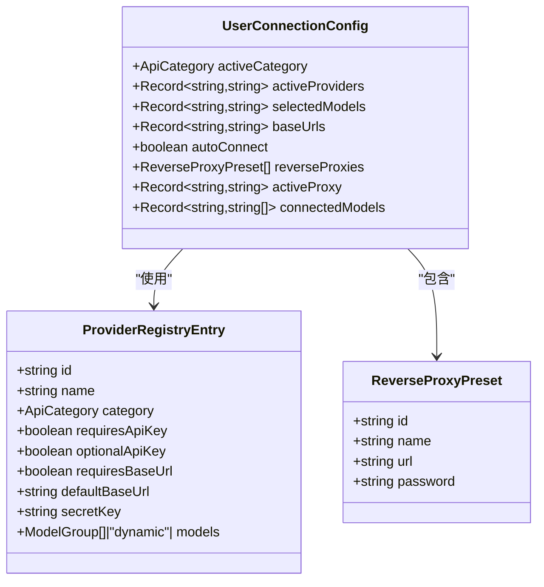

**图表来源**
- [api-connections.ts:86-112](file://src/types/api-connections.ts#L86-L112)
- [api-connections.ts:41-58](file://src/types/api-connections.ts#L41-L58)
- [api-connections.ts:107-112](file://src/types/api-connections.ts#L107-L112)

#### 默认配置
系统提供完整的默认配置，确保新用户能够正常开始使用：

| 配置项 | 默认值 | 说明 |
|--------|--------|------|
| activeCategory | "chat_completion" | 当前选择的 API 类别 |
| activeProviders | {"chat_completion": "openai"} | 各类别当前提供商 |
| selectedModels | {} | 各提供商选中的模型 |
| baseUrls | {} | 各提供商的自定义 Base URL |
| autoConnect | false | 是否自动连接 |
| reverseProxies | [] | 反向代理预设列表 |

#### 数据持久化
设置数据通过 Drizzle ORM 持久化到 SQLite 数据库：

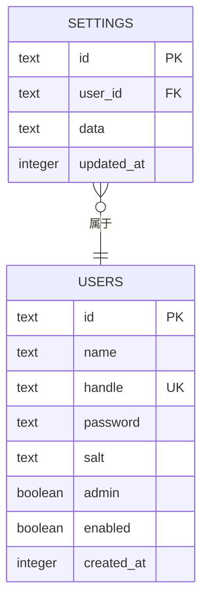

**图表来源**
- [schema.ts:212-217](file://src/lib/db/schema.ts#L212-L217)
- [schema.ts:6-16](file://src/lib/db/schema.ts#L6-L16)

**章节来源**
- [settings/route.ts:1-109](file://src/app/api/settings/route.ts#L1-L109)
- [api-connections.ts:86-112](file://src/types/api-connections.ts#L86-L112)
- [schema.ts:212-217](file://src/lib/db/schema.ts#L212-L217)

### 密钥管理接口

#### 接口规范
- **GET /api/secrets**: 获取密钥列表或检查特定密钥存在性
- **POST /api/secrets**: 保存新的 API 密钥
- **DELETE /api/secrets**: 删除指定的 API 密钥

#### 密钥存储策略

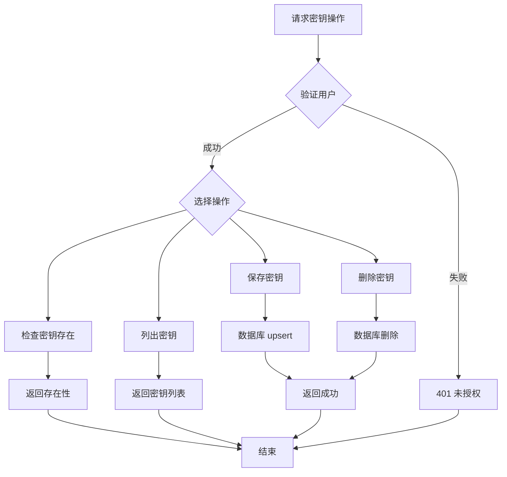

**图表来源**
- [secrets/route.ts:8-30](file://src/app/api/secrets/route.ts#L8-L30)
- [secrets-service.ts:10-65](file://src/lib/services/secrets-service.ts#L10-L65)

#### 支持的密钥类型

系统支持 30+ 种 AI 提供商的 API 密钥，包括主流云服务和开源模型：

| 提供商类别 | 支持的密钥 |
|------------|------------|
| **对话完成** | openai_api_key, anthropic_api_key, google_api_key, vertexai_api_key, openrouter_api_key, mistral_api_key, cohere_api_key, groq_api_key, deepseek_api_key, xai_api_key, perplexity_api_key, fireworks_api_key, moonshot_api_key, siliconflow_api_key, minimax_api_key, zai_api_key, azure_openai_api_key, nanogpt_api_key, workers_ai_api_key, electronhub_api_key, chutes_api_key, pollinations_api_key, aimlapi_api_key, cometapi_api_key, custom_api_key |
| **文本完成** | koboldcpp_api_key, ollama_api_key, llamacpp_api_key, vllm_api_key, aphrodite_api_key, tabby_api_key, ooba_api_key, mancer_api_key, dreamgen_api_key, featherless_api_key, infermaticai_api_key, togetherai_api_key, huggingface_api_key, generic_api_key |
| **其他** | novelai_api_key, horde_api_key, kobold_api_key |

#### 数据库结构
密钥存储在专用的 secrets 表中，采用用户隔离的设计：

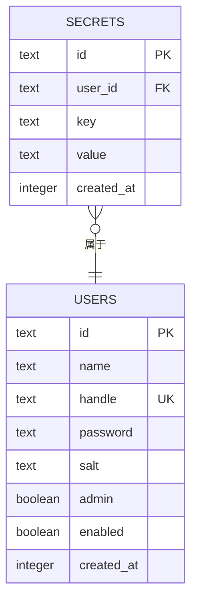

**图表来源**
- [schema.ts:201-207](file://src/lib/db/schema.ts#L201-L207)
- [schema.ts:6-16](file://src/lib/db/schema.ts#L6-L16)

**章节来源**
- [secrets/route.ts:1-83](file://src/app/api/secrets/route.ts#L1-L83)
- [secrets-service.ts:1-116](file://src/lib/services/secrets-service.ts#L1-L116)
- [schema.ts:201-207](file://src/lib/db/schema.ts#L201-L207)

### AI 连接测试接口

#### 接口规范
- **POST /api/connections/test**: 测试 API 连接（轻量级）
- **POST /api/connections/test-message**: 发送真实测试消息（可能产生费用）

#### 连接测试流程

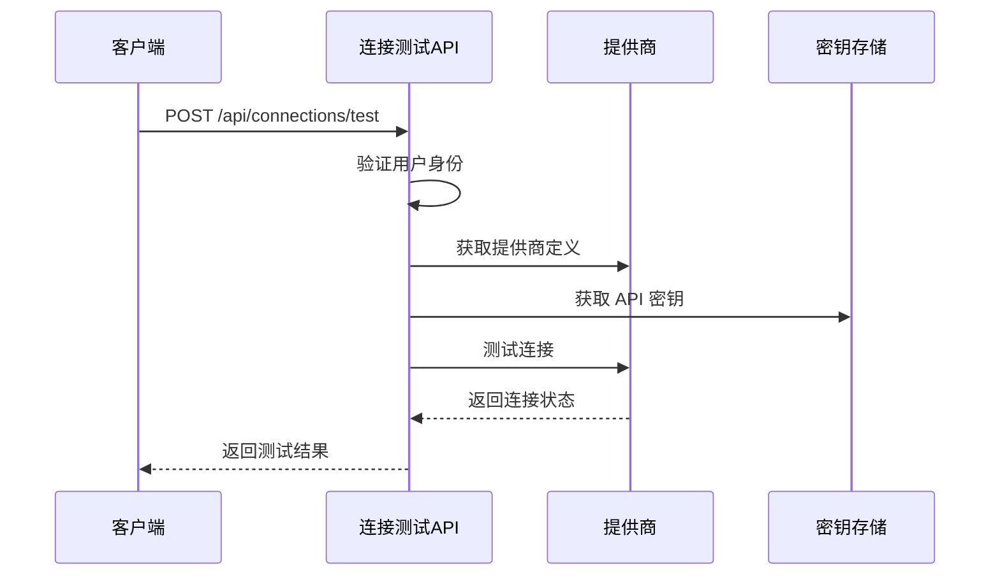

**图表来源**
- [connections/test/route.ts:10-52](file://src/app/api/connections/test/route.ts#L10-L52)

#### 支持的提供商

系统支持 30+ 种 AI 提供商，每种提供商都有特定的认证方式和 API 端点：

| 提供商 | 认证方式 | API 端点 | 特殊要求 |
|--------|----------|----------|----------|
| **OpenAI** | Bearer Token | https://api.openai.com/v1 | 需要 API Key |
| **Anthropic** | x-api-key | https://api.anthropic.com/v1 | 需要 API Key |
| **Google AI Studio** | Bearer Token | https://generativelanguage.googleapis.com/v1beta | 需要 API Key |
| **Vertex AI** | Bearer Token | https://generativelanguage.googleapis.com/v1beta | 需要 API Key |
| **OpenRouter** | Bearer Token | https://openrouter.ai/api/v1 | 需要 API Key |
| **本地模型** | 无 | http://127.0.0.1:11434/v1 | 本地部署 |
| **自定义** | 可选 | 用户指定 | 可选 API Key |

#### 测试策略对比

| 测试类型 | 方法 | 优点 | 缺点 | 费用影响 |
|----------|------|------|------|----------|
| **连接测试** | `/models` 端点 | 快速、无费用 | 无法验证实际生成能力 | 无 |
| **消息测试** | `/chat/completions` 端点 | 验证完整功能 | 消耗 API 额度 | 有（按 token 计费） |

**章节来源**
- [connections/test/route.ts:1-149](file://src/app/api/connections/test/route.ts#L1-L149)
- [connections/test-message/route.ts:1-236](file://src/app/api/connections/test-message/route.ts#L1-L236)
- [providers-registry.ts:11-749](file://src/lib/constants/providers-registry.ts#L11-L749)

### 模型列表接口

#### 接口规范
- **GET /api/connections/models**: 获取指定提供商的可用模型列表

#### 模型获取策略

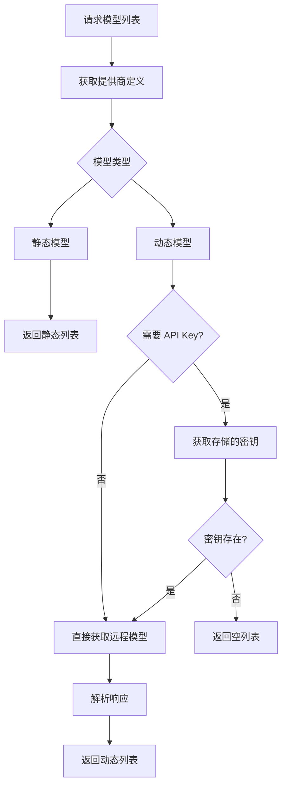

**图表来源**
- [connections/models/route.ts:11-63](file://src/app/api/connections/models/route.ts#L11-L63)

#### 模型类型

系统支持两种模型列表类型：

1. **静态模型**：提供商内置的固定模型列表
2. **动态模型**：实时从提供商 API 获取的模型列表

#### 特殊提供商处理

不同提供商有不同的 API 结构，系统针对特殊情况进行适配：

| 提供商 | API 端点 | 特殊处理 |
|--------|----------|----------|
| **Google AI Studio** | `/models?key={API_KEY}` | 使用查询参数 |
| **Vertex AI** | `/models` | 需要 Bearer Token |
| **Ollama** | `/api/tags` | 使用不同端点 |
| **OpenRouter** | `https://openrouter.ai/api/v1/models` | 外部 API |
| **本地模型** | 本地端点 | 无 API Key |

**章节来源**
- [connections/models/route.ts:1-132](file://src/app/api/connections/models/route.ts#L1-L132)

## 依赖关系分析

系统管理 API 的依赖关系体现了清晰的关注点分离：

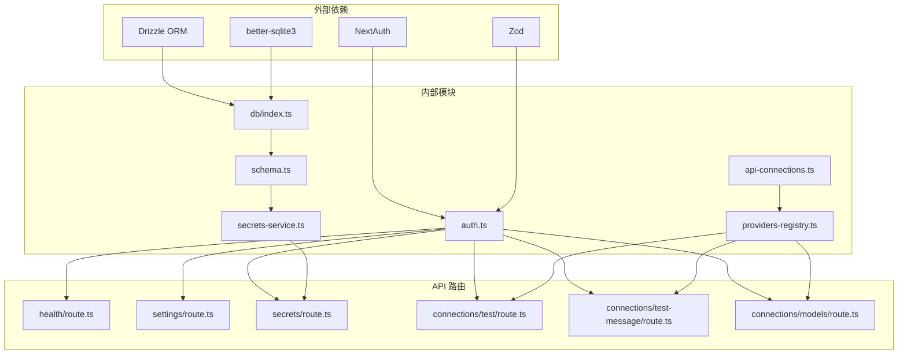

**图表来源**
- [auth.ts:1-59](file://src/lib/auth.ts#L1-L59)
- [db/index.ts:1-134](file://src/lib/db/index.ts#L1-L134)
- [schema.ts:1-240](file://src/lib/db/schema.ts#L1-L240)
- [secrets-service.ts:1-116](file://src/lib/services/secrets-service.ts#L1-L116)
- [providers-registry.ts:1-749](file://src/lib/constants/providers-registry.ts#L1-L749)

### 循环依赖检测

经过分析，系统管理 API 不存在循环依赖：
- API 路由仅依赖认证和业务服务
- 业务服务依赖数据访问层
- 数据访问层依赖数据库初始化
- 类型定义独立于实现

**章节来源**
- [auth.ts:1-59](file://src/lib/auth.ts#L1-L59)
- [db/index.ts:1-134](file://src/lib/db/index.ts#L1-L134)
- [secrets-service.ts:1-116](file://src/lib/services/secrets-service.ts#L1-L116)

## 性能考虑

### 缓存策略
- **健康检查**: 使用强制动态渲染避免缓存问题
- **模型列表**: 动态模型需要实时获取，不适合缓存
- **设置数据**: 用户设置相对稳定，可在前端进行适当的缓存

### 数据库优化
- **WAL 模式**: 使用 Write-Ahead Logging 提高并发性能
- **外键约束**: 确保数据完整性的同时增加约束检查开销
- **索引策略**: 在高频查询字段上建立适当索引

### 网络请求优化
- **超时控制**: 所有外部 API 调用都有合理的超时设置
- **错误重试**: 对于临时性错误提供重试机制
- **连接池**: 数据库连接使用连接池管理

## 故障排除指南

### 常见问题及解决方案

#### 认证问题
**症状**: 401 未授权错误
**原因**: 会话无效或用户未登录
**解决**: 
1. 检查用户是否正确登录
2. 验证 JWT 令牌有效性
3. 确认 NextAuth 配置正确

#### 数据库连接问题
**症状**: 500 服务器错误，数据库相关
**原因**: 数据库文件损坏或权限问题
**解决**:
1. 检查数据库文件路径配置
2. 验证文件权限设置
3. 运行数据库迁移脚本

#### API 密钥问题
**症状**: 连接测试失败，提示密钥无效
**原因**: 密钥存储错误或格式不正确
**解决**:
1. 验证密钥格式和长度
2. 检查密钥是否正确存储
3. 确认提供商 API Key 权限

#### 外部 API 超时
**症状**: 连接测试超时
**原因**: 网络连接问题或外部服务不可用
**解决**:
1. 检查网络连接状态
2. 验证提供商 API 端点可达性
3. 调整超时参数

### 调试工具

#### 日志记录
系统在关键位置添加了详细的日志记录，便于问题排查：

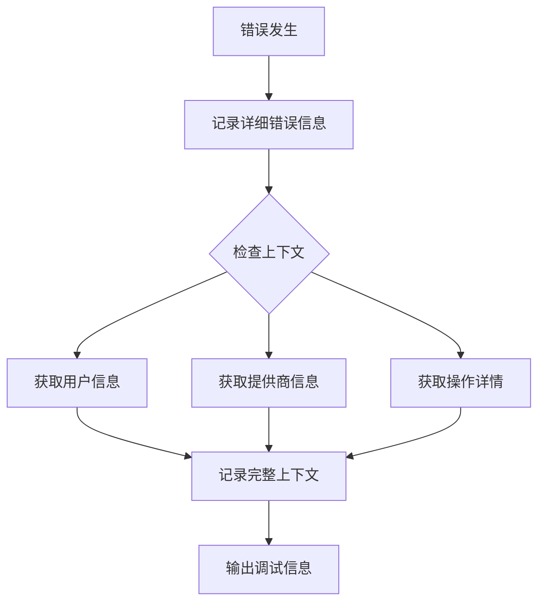

#### 监控指标
- **响应时间**: 记录各 API 端点的响应时间
- **错误率**: 统计各类错误的发生频率
- **资源使用**: 监控内存和 CPU 使用情况

**章节来源**
- [settings/route.ts:46-49](file://src/app/api/settings/route.ts#L46-L49)
- [secrets/route.ts:26-29](file://src/app/api/secrets/route.ts#L26-L29)
- [connections/test/route.ts:47-51](file://src/app/api/connections/test/route.ts#L47-L51)

## 结论

系统管理 API 提供了完整的系统维护和配置管理功能，具有以下特点：

### 技术优势
- **模块化设计**: 清晰的分层架构，便于维护和扩展
- **安全性**: 完善的认证机制和密钥安全管理
- **可靠性**: 详细的错误处理和日志记录
- **可扩展性**: 支持 30+ 种 AI 提供商，易于添加新提供商

### 功能完整性
- **健康监控**: 支持容器编排和监控系统集成
- **配置管理**: 用户连接配置的完整生命周期管理
- **密钥安全**: 加密存储和访问控制
- **连接验证**: 多层次的连接状态验证机制
- **模型管理**: 动态模型列表获取和管理

### 最佳实践建议
1. **定期备份**: 定期备份数据库和配置文件
2. **监控告警**: 设置适当的监控和告警机制
3. **安全审计**: 定期审查 API 密钥和访问权限
4. **性能优化**: 根据使用情况调整超时和缓存策略

该 API 为 SillyTavern Next 项目提供了坚实的基础设施支持，确保了系统的稳定性、安全性和可维护性。