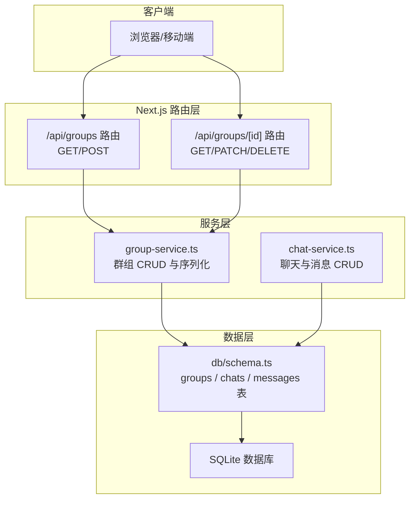
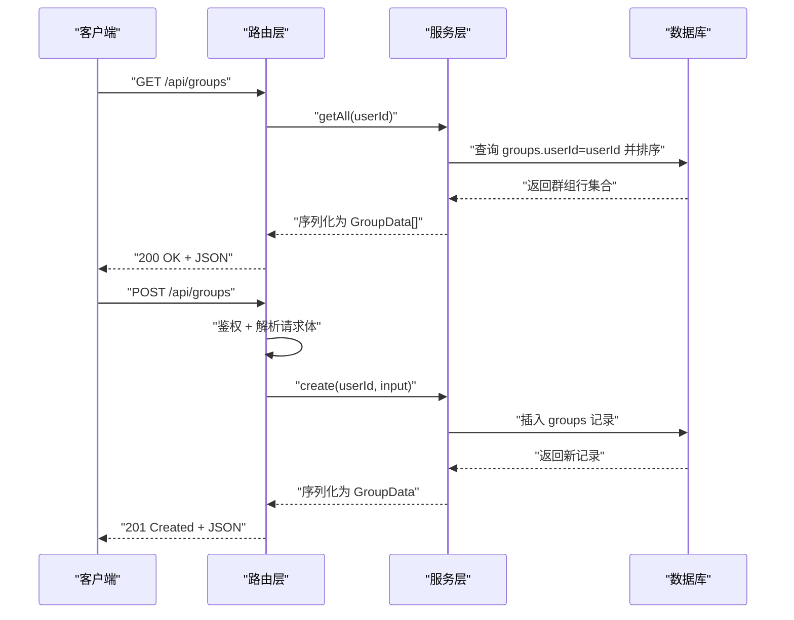
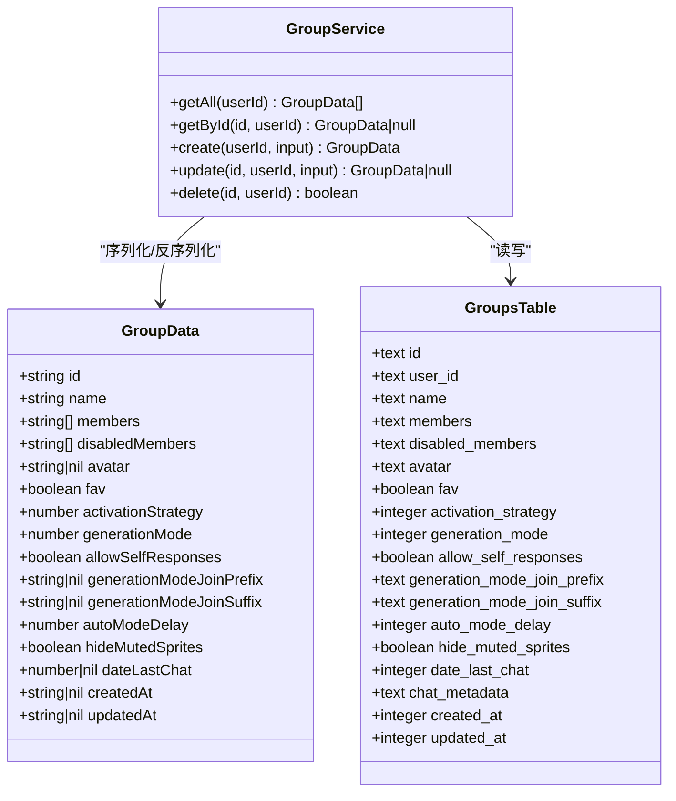
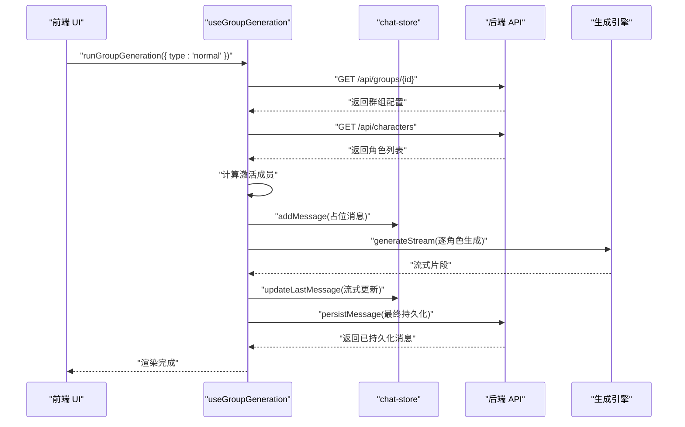
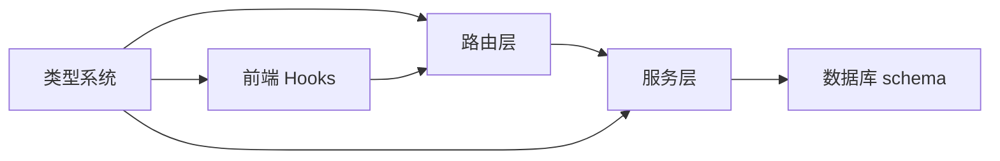
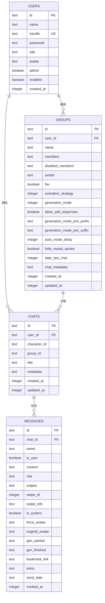

# 群组聊天 API

<cite>
**本文引用的文件**
- [src/app/api/groups/route.ts](file://src/app/api/groups/route.ts)
- [src/app/api/groups/[id]/route.ts](file://src/app/api/groups/[id]/route.ts)
- [src/lib/services/group-service.ts](file://src/lib/services/group-service.ts)
- [src/lib/db/schema.ts](file://src/lib/db/schema.ts)
- [src/lib/services/chat-service.ts](file://src/lib/services/chat-service.ts)
- [src/types/index.ts](file://src/types/index.ts)
- [src/hooks/useGroupAutoMode.ts](file://src/hooks/useGroupAutoMode.ts)
- [src/hooks/useGroupGeneration.ts](file://src/hooks/useGroupGeneration.ts)
</cite>

## 目录
1. [简介](#简介)
2. [项目结构](#项目结构)
3. [核心组件](#核心组件)
4. [架构总览](#架构总览)
5. [详细组件分析](#详细组件分析)
6. [依赖关系分析](#依赖关系分析)
7. [性能考量](#性能考量)
8. [故障排除指南](#故障排除指南)
9. [结论](#结论)
10. [附录](#附录)

## 简介
本文件为群组聊天 API 的全面技术文档，覆盖以下接口规范与实现细节：
- 获取群组列表：GET /api/groups
- 创建群组：POST /api/groups
- 获取群组详情：GET /api/groups/[id]
- 更新群组：PATCH /api/groups/[id]
- 删除群组：DELETE /api/groups/[id]
- 获取群组消息：GET /api/groups/[id]/chat/messages（说明：当前仓库未提供该路由，但消息读取能力由聊天服务提供）

同时，文档深入解析群组架构设计、成员管理机制、消息同步策略与权限控制，并补充群组聊天的特殊处理逻辑、消息聚合与状态管理的实现要点，以及集成示例与故障排除建议。

## 项目结构
群组聊天 API 的后端路由位于 Next.js App Router 的 api 目录中，业务逻辑封装在服务层，数据模型定义于数据库 schema 中，类型系统统一在 types 中声明。前端侧通过 React Hooks 实现群组自动模式与生成流程。

图表来源
- [src/app/api/groups/route.ts:1-34](file://src/app/api/groups/route.ts#L1-L34)
- [src/app/api/groups/[id]/route.ts](file://src/app/api/groups/[id]/route.ts#L1-L55)
- [src/lib/services/group-service.ts:1-174](file://src/lib/services/group-service.ts#L1-L174)
- [src/lib/services/chat-service.ts:1-301](file://src/lib/services/chat-service.ts#L1-L301)
- [src/lib/db/schema.ts:103-168](file://src/lib/db/schema.ts#L103-L168)

章节来源
- [src/app/api/groups/route.ts:1-34](file://src/app/api/groups/route.ts#L1-L34)
- [src/app/api/groups/[id]/route.ts](file://src/app/api/groups/[id]/route.ts#L1-L55)
- [src/lib/db/schema.ts:103-168](file://src/lib/db/schema.ts#L103-L168)

## 核心组件
- 路由层
  - GET /api/groups：返回当前用户的所有群组，按更新时间倒序排列。
  - POST /api/groups：校验输入后创建群组，返回新群组。
  - GET /api/groups/[id]：返回指定群组详情，若不存在返回 404。
  - PATCH /api/groups/[id]：部分更新群组，支持名称、成员、禁用成员、头像、收藏、激活策略、生成模式、自响应、前后缀、自动模式延迟、静音成员显示等字段。
  - DELETE /api/groups/[id]：删除群组及其关联聊天（级联删除消息）。
- 服务层
  - group-service：负责群组的增删改查、输入校验（Zod）、JSON 字段序列化与反序列化、默认值填充。
  - chat-service：负责聊天与消息的增删改查、消息聚合、分支复制、时间戳维护。
- 数据层
  - groups：存储群组元信息（成员、禁用成员、生成策略、头像、收藏、时间戳等）。
  - chats：存储聊天会话，包含群组外链（groupId）。
  - messages：存储消息明细，包含角色、内容、滑动版本、生成时间、头像等。
- 类型系统
  - Group、Chat、ChatMessage、MessageExtra 等类型定义，确保前后端一致性。

章节来源
- [src/app/api/groups/route.ts:1-34](file://src/app/api/groups/route.ts#L1-L34)
- [src/app/api/groups/[id]/route.ts](file://src/app/api/groups/[id]/route.ts#L1-L55)
- [src/lib/services/group-service.ts:11-85](file://src/lib/services/group-service.ts#L11-L85)
- [src/lib/services/chat-service.ts:60-301](file://src/lib/services/chat-service.ts#L60-L301)
- [src/lib/db/schema.ts:103-168](file://src/lib/db/schema.ts#L103-L168)
- [src/types/index.ts:272-286](file://src/types/index.ts#L272-L286)

## 架构总览
群组聊天 API 的调用链路如下：

图表来源
- [src/app/api/groups/route.ts:5-12](file://src/app/api/groups/route.ts#L5-L12)
- [src/app/api/groups/route.ts:14-33](file://src/app/api/groups/route.ts#L14-L33)
- [src/lib/services/group-service.ts:93-131](file://src/lib/services/group-service.ts#L93-L131)

## 详细组件分析

### 群组路由与鉴权
- 鉴权：所有路由均通过 auth() 获取会话，未登录返回 401。
- GET /api/groups：按用户维度查询群组并按更新时间倒序。
- POST /api/groups：解析并校验输入（Zod），创建群组并返回 201。
- GET /api/groups/[id]：按 id 与 userId 查询，不存在返回 404。
- PATCH /api/groups/[id]：解析并校验更新输入，逐字段更新，返回更新后的群组。
- DELETE /api/groups/[id]：先删除关联聊天，再删除群组，返回成功或 404。

章节来源
- [src/app/api/groups/route.ts:5-12](file://src/app/api/groups/route.ts#L5-L12)
- [src/app/api/groups/route.ts:14-33](file://src/app/api/groups/route.ts#L14-L33)
- [src/app/api/groups/[id]/route.ts](file://src/app/api/groups/[id]/route.ts#L7-L16)
- [src/app/api/groups/[id]/route.ts](file://src/app/api/groups/[id]/route.ts#L18-L38)
- [src/app/api/groups/[id]/route.ts](file://src/app/api/groups/[id]/route.ts#L40-L54)

### 群组服务与数据模型
- 输入校验
  - 创建：名称必填且长度限制，成员至少 1 个，其他字段可选。
  - 更新：名称/成员/禁用成员/头像/收藏/激活策略/生成模式/自响应/前后缀/自动模式延迟/静音成员显示等可选。
- 序列化
  - JSON 字段（成员、禁用成员）解析为数组；时间戳转为 ISO 字符串；默认值填充。
- CRUD 行为
  - getAll：按用户 id 查询并排序。
  - getById：按 id 与用户 id 查询。
  - create：生成随机 id，写入基础字段与默认值。
  - update：仅更新传入字段，其余保持不变。
  - delete：先删关联聊天，再删群组。

图表来源
- [src/lib/services/group-service.ts:91-173](file://src/lib/services/group-service.ts#L91-L173)
- [src/lib/db/schema.ts:103-126](file://src/lib/db/schema.ts#L103-L126)

章节来源
- [src/lib/services/group-service.ts:11-85](file://src/lib/services/group-service.ts#L11-L85)
- [src/lib/services/group-service.ts:91-173](file://src/lib/services/group-service.ts#L91-L173)
- [src/lib/db/schema.ts:103-126](file://src/lib/db/schema.ts#L103-L126)

### 聊天与消息服务
- 聊天服务
  - getAll：按用户维度查询聊天（可按 characterId 或 groupId 过滤），不含消息。
  - getById：查询聊天并加载全部消息，按创建时间升序。
  - create/update/delete：创建/更新/删除聊天。
  - addMessage/updateMessage/deleteMessage：消息增删改。
  - branch：从某条消息开始复制分支聊天。
- 消息聚合
  - 聊天详情接口返回 Chat 结构，其中包含消息数组，前端据此渲染群组消息流。
- 时间戳与一致性
  - 新增消息后更新所属聊天的 updatedAt，保证时间线正确。

章节来源
- [src/lib/services/chat-service.ts:60-301](file://src/lib/services/chat-service.ts#L60-L301)
- [src/types/index.ts:248-286](file://src/types/index.ts#L248-L286)

### 群组聊天前端集成与状态管理
- 自动模式
  - useGroupAutoMode：在启用且为群组聊天时，按 group.autoModeDelay 秒间隔触发生成，避免与进行中的生成冲突，支持 AbortController 中断。
- 生成流程
  - useGroupGeneration：封装群组生成主流程，支持 normal/swipe/continue/impersonate/auto 五种类型；根据激活策略选择成员；APPEND 模式下对角色卡字段进行合并与包裹；为每个成员生成消息并持久化；支持续写与重生（重跑）。
- 激活策略与成员过滤
  - 依据激活策略、最近说话者、自响应允许、近期消息等计算激活成员；禁用成员在 APPEND_DISABLED 模式下可被保留。

图表来源
- [src/hooks/useGroupGeneration.ts:111-132](file://src/hooks/useGroupGeneration.ts#L111-L132)
- [src/hooks/useGroupGeneration.ts:450-691](file://src/hooks/useGroupGeneration.ts#L450-L691)
- [src/hooks/useGroupAutoMode.ts:24-60](file://src/hooks/useGroupAutoMode.ts#L24-L60)

章节来源
- [src/hooks/useGroupAutoMode.ts:17-61](file://src/hooks/useGroupAutoMode.ts#L17-L61)
- [src/hooks/useGroupGeneration.ts:59-737](file://src/hooks/useGroupGeneration.ts#L59-L737)

## 依赖关系分析
- 路由依赖服务层：所有路由仅做鉴权与参数传递，具体业务逻辑在服务层实现。
- 服务层依赖数据库 schema：通过 Drizzle ORM 读写 SQLite 表。
- 类型系统贯穿：前端与后端共享类型定义，确保接口契约一致。
- 前端依赖服务层与 store：Hooks 通过 fetch 与 store 协作，完成群组与消息的读写。

图表来源
- [src/app/api/groups/route.ts:1-3](file://src/app/api/groups/route.ts#L1-L3)
- [src/lib/services/group-service.ts:1-5](file://src/lib/services/group-service.ts#L1-L5)
- [src/lib/db/schema.ts:1-2](file://src/lib/db/schema.ts#L1-L2)
- [src/types/index.ts:1-533](file://src/types/index.ts#L1-L533)
- [src/hooks/useGroupGeneration.ts:1-20](file://src/hooks/useGroupGeneration.ts#L1-L20)

章节来源
- [src/app/api/groups/route.ts:1-3](file://src/app/api/groups/route.ts#L1-L3)
- [src/lib/services/group-service.ts:1-5](file://src/lib/services/group-service.ts#L1-L5)
- [src/lib/db/schema.ts:1-2](file://src/lib/db/schema.ts#L1-L2)
- [src/types/index.ts:1-533](file://src/types/index.ts#L1-L533)
- [src/hooks/useGroupGeneration.ts:1-20](file://src/hooks/useGroupGeneration.ts#L1-L20)

## 性能考量
- 查询优化
  - 群组列表按用户 id 与更新时间排序，建议在 user_id 与 updated_at 上建立索引以提升查询效率。
  - 聊天详情按 chatId 加载消息，建议在 messages.chat_id 上建立索引。
- 写入优化
  - 批量操作（如分支复制）建议在服务层合并 SQL 事务，减少往返次数。
- 前端渲染
  - 大消息流采用流式更新，避免一次性渲染大量 DOM。
- 自动模式
  - 使用 AbortController 控制并发生成，避免重复触发导致资源浪费。

## 故障排除指南
- 401 未授权
  - 确认已登录并通过鉴权中间件，会话有效。
- 400 输入校验失败
  - 检查请求体是否符合 Zod 校验规则（名称长度、成员数量、数值范围等）。
- 404 未找到
  - 群组 id 不存在或不属于当前用户。
- 500 服务器错误
  - 查看服务层异常日志，确认数据库连接与事务执行情况。
- 消息未显示或顺序异常
  - 确认聊天详情接口按创建时间升序返回消息；检查前端 store 的消息追加与持久化流程。
- 自动模式不触发
  - 检查前端开关与 isGroupChat 状态；确认 autoModeDelay 设置合理；查看 AbortController 是否提前中断。

章节来源
- [src/app/api/groups/route.ts:14-33](file://src/app/api/groups/route.ts#L14-L33)
- [src/app/api/groups/[id]/route.ts](file://src/app/api/groups/[id]/route.ts#L18-L38)
- [src/lib/services/group-service.ts:134-159](file://src/lib/services/group-service.ts#L134-L159)
- [src/lib/services/chat-service.ts:80-92](file://src/lib/services/chat-service.ts#L80-L92)
- [src/hooks/useGroupAutoMode.ts:24-60](file://src/hooks/useGroupAutoMode.ts#L24-L60)

## 结论
本群组聊天 API 以清晰的分层架构实现：路由层负责鉴权与参数传递，服务层承担业务逻辑与数据转换，数据库层提供稳定的数据模型。配合前端 Hooks，实现了群组成员管理、消息聚合与自动模式等复杂功能。后续可在索引优化、事务合并与流式渲染等方面进一步提升性能与用户体验。

## 附录

### 接口规范与示例

- 获取群组列表
  - 方法：GET
  - 路径：/api/groups
  - 鉴权：必需
  - 响应：200，返回群组数组（按更新时间倒序）
  - 示例：[示例路径:5-12](file://src/app/api/groups/route.ts#L5-L12)

- 创建群组
  - 方法：POST
  - 路径：/api/groups
  - 鉴权：必需
  - 请求体：符合 groupInputSchema
  - 响应：201，返回新群组；400，返回错误详情
  - 示例：[示例路径:14-33](file://src/app/api/groups/route.ts#L14-L33)

- 获取群组详情
  - 方法：GET
  - 路径：/api/groups/[id]
  - 鉴权：必需
  - 响应：200，返回群组；404，未找到
  - 示例：[示例路径:7-16](file://src/app/api/groups/[id]/route.ts#L7-L16)

- 更新群组
  - 方法：PATCH
  - 路径：/api/groups/[id]
  - 鉴权：必需
  - 请求体：符合 groupUpdateSchema（字段可选）
  - 响应：200，返回更新后的群组；404，未找到
  - 示例：[示例路径:18-38](file://src/app/api/groups/[id]/route.ts#L18-L38)

- 删除群组
  - 方法：DELETE
  - 路径：/api/groups/[id]
  - 鉴权：必需
  - 响应：200，返回 { success: true }；404，未找到
  - 示例：[示例路径:40-54](file://src/app/api/groups/[id]/route.ts#L40-L54)

- 获取群组消息
  - 方法：GET
  - 路径：/api/groups/[id]/chat/messages
  - 说明：当前仓库未提供该路由。可通过聊天服务按群组 id 获取聊天列表，再按聊天 id 获取消息列表。
  - 参考：聊天服务的 getAll 与 getById
  - 示例：[示例路径:62-92](file://src/lib/services/chat-service.ts#L62-L92)

### 数据模型与字段说明

图表来源
- [src/lib/db/schema.ts:6-168](file://src/lib/db/schema.ts#L6-L168)

章节来源
- [src/lib/db/schema.ts:103-168](file://src/lib/db/schema.ts#L103-L168)
- [src/types/index.ts:248-286](file://src/types/index.ts#L248-L286)