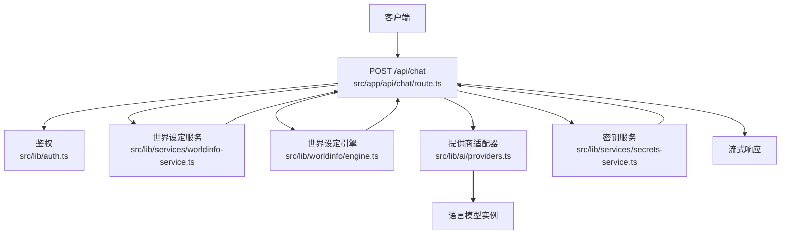
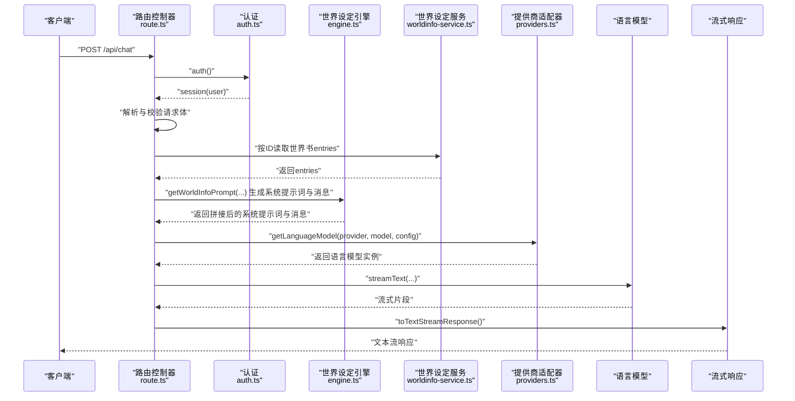
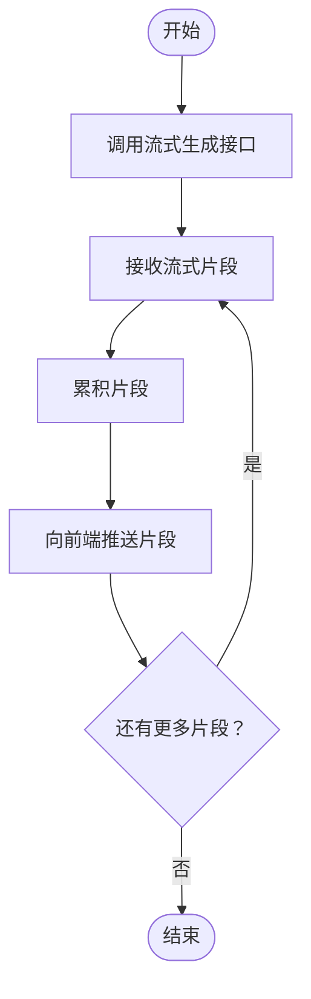
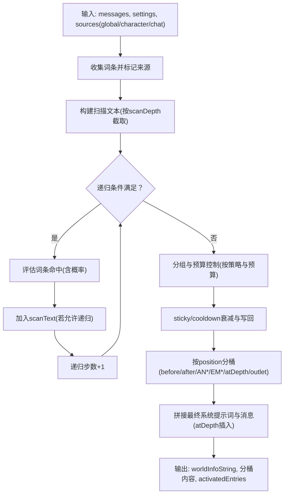
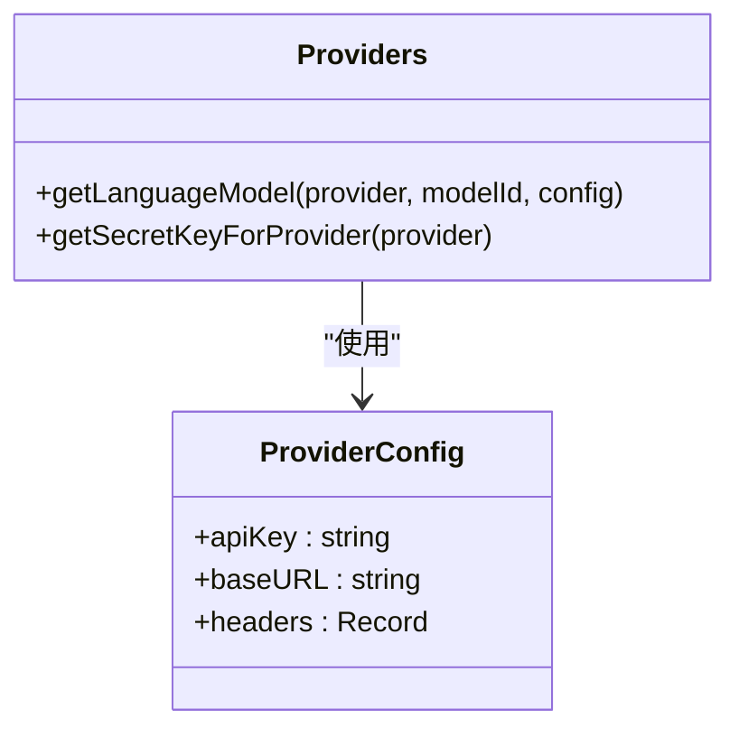
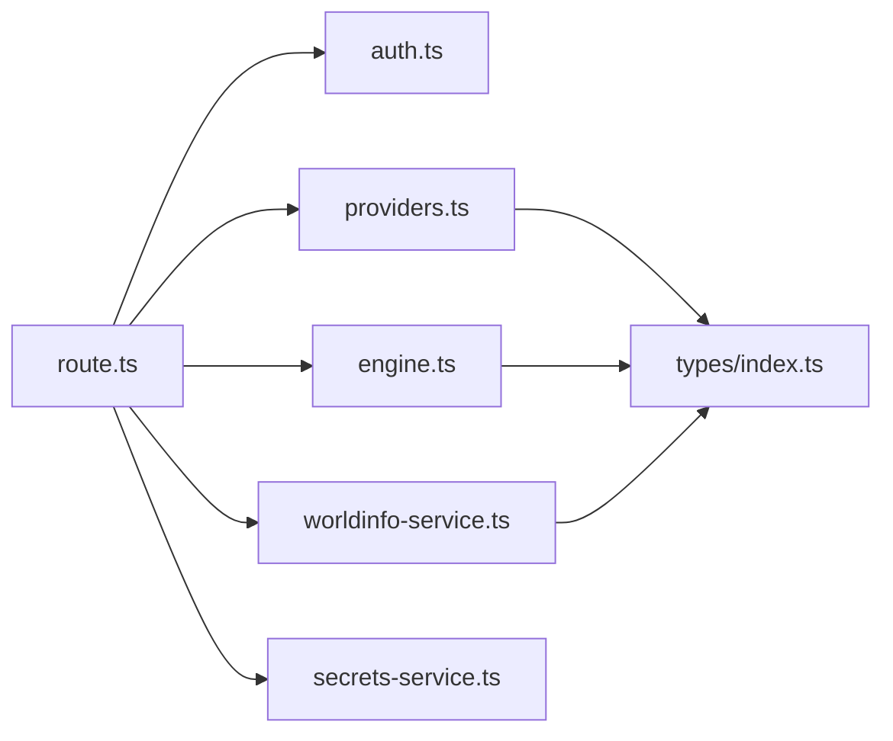

# 聊天 API

<cite>
**本文引用的文件**
- [src/app/api/chat/route.ts](file://src/app/api/chat/route.ts)
- [src/lib/ai/providers.ts](file://src/lib/ai/providers.ts)
- [src/lib/services/worldinfo-service.ts](file://src/lib/services/worldinfo-service.ts)
- [src/lib/worldinfo/engine.ts](file://src/lib/worldinfo/engine.ts)
- [src/types/index.ts](file://src/types/index.ts)
- [src/lib/auth.ts](file://src/lib/auth.ts)
- [src/lib/auth.config.ts](file://src/lib/auth.config.ts)
- [src/lib/services/secrets-service.ts](file://src/lib/services/secrets-service.ts)
- [README.md](file://README.md)
</cite>

## 目录
1. [简介](#简介)
2. [项目结构](#项目结构)
3. [核心组件](#核心组件)
4. [架构概览](#架构概览)
5. [详细组件分析](#详细组件分析)
6. [依赖关系分析](#依赖关系分析)
7. [性能考量](#性能考量)
8. [故障排查指南](#故障排查指南)
9. [结论](#结论)
10. [附录](#附录)

## 简介
本文件为聊天 API 的完整技术文档，聚焦 POST /api/chat 接口的请求与响应规范、流式响应处理机制、世界设定（World Info）集成方式、AI 提供商适配器使用方法，并提供认证、速率限制与安全注意事项。文档面向开发者与运维人员，兼顾非技术读者的理解需求。

## 项目结构
聊天 API 位于 Next.js App Router 的 API 路由目录中，围绕认证、提供商适配、世界设定与流式输出展开。核心文件与职责如下：
- 路由与控制器：负责请求解析、鉴权、世界设定拼接、提供商选择与流式响应
- 提供商适配器：统一 OpenAI/Anthropic/Google 等多家提供商的接入
- 世界设定服务与引擎：收集词条、规则匹配、预算控制与插入位置分桶
- 类型定义：统一消息、提供商、世界设定等类型
- 认证与密钥管理：基于 NextAuth 的凭据认证与用户级密钥存储

图表来源
- [src/app/api/chat/route.ts:50-176](file://src/app/api/chat/route.ts#L50-L176)
- [src/lib/ai/providers.ts:58-96](file://src/lib/ai/providers.ts#L58-L96)
- [src/lib/services/worldinfo-service.ts:97-300](file://src/lib/services/worldinfo-service.ts#L97-L300)
- [src/lib/worldinfo/engine.ts:174-290](file://src/lib/worldinfo/engine.ts#L174-L290)
- [src/lib/services/secrets-service.ts:10-65](file://src/lib/services/secrets-service.ts#L10-L65)

章节来源
- [src/app/api/chat/route.ts:1-177](file://src/app/api/chat/route.ts#L1-177)
- [src/lib/ai/providers.ts:1-174](file://src/lib/ai/providers.ts#L1-L174)
- [src/lib/services/worldinfo-service.ts:1-428](file://src/lib/services/worldinfo-service.ts#L1-L428)
- [src/lib/worldinfo/engine.ts:1-424](file://src/lib/worldinfo/engine.ts#L1-L424)
- [src/types/index.ts:1-533](file://src/types/index.ts#L1-L533)
- [src/lib/auth.ts:1-59](file://src/lib/auth.ts#L1-L59)
- [src/lib/auth.config.ts:1-53](file://src/lib/auth.config.ts#L1-L53)
- [src/lib/services/secrets-service.ts:1-116](file://src/lib/services/secrets-service.ts#L1-L116)
- [README.md:62-75](file://README.md#L62-L75)

## 核心组件
- 路由控制器：解析请求体、校验参数、组装最终系统提示词与消息、选择提供商模型、发起流式生成并返回流式响应
- 提供商适配器：根据 provider 选择对应 SDK 创建语言模型实例，支持 OpenAI 兼容与特定提供商的特殊头部
- 世界设定服务：按用户维度读取世界书（全局/角色/聊天），并提供导入导出能力
- 世界设定引擎：词条匹配、递归扫描、概率抽样、预算控制、插入位置分桶与 atDepth 插入
- 认证与密钥：基于 NextAuth 的凭据认证；用户级密钥存储于数据库，环境变量作为回退
- 类型系统：统一消息角色、提供商枚举、世界设定字段与默认值

章节来源
- [src/app/api/chat/route.ts:20-48](file://src/app/api/chat/route.ts#L20-L48)
- [src/lib/ai/providers.ts:58-174](file://src/lib/ai/providers.ts#L58-L174)
- [src/lib/services/worldinfo-service.ts:97-300](file://src/lib/services/worldinfo-service.ts#L97-L300)
- [src/lib/worldinfo/engine.ts:174-424](file://src/lib/worldinfo/engine.ts#L174-L424)
- [src/lib/auth.ts:12-58](file://src/lib/auth.ts#L12-L58)
- [src/lib/services/secrets-service.ts:10-65](file://src/lib/services/secrets-service.ts#L10-L65)
- [src/types/index.ts:4-50](file://src/types/index.ts#L4-L50)

## 架构概览
POST /api/chat 的调用链如下：
- 客户端发送 JSON 请求至 /api/chat
- 服务端进行 NextAuth 鉴权，确保已登录
- 解析并校验请求体参数
- 世界设定集成：收集全局/角色/聊天词条，按规则匹配与预算控制生成最终系统提示词与消息
- 选择提供商模型：从用户密钥或环境变量获取 API Key，构造语言模型实例
- 调用流式生成接口，将结果转换为文本流响应返回给客户端

图表来源
- [src/app/api/chat/route.ts:50-176](file://src/app/api/chat/route.ts#L50-L176)
- [src/lib/worldinfo/engine.ts:174-290](file://src/lib/worldinfo/engine.ts#L174-L290)
- [src/lib/services/worldinfo-service.ts:108-115](file://src/lib/services/worldinfo-service.ts#L108-L115)
- [src/lib/ai/providers.ts:58-96](file://src/lib/ai/providers.ts#L58-L96)

## 详细组件分析

### 请求参数规范
- messages：数组，元素包含 role（user/assistant/system）与 content（字符串）
- provider：字符串，支持多种提供商枚举（如 openai、anthropic、google、openrouter、mistral、cohere、groq、deepseek、xai、perplexity、fireworks、moonshot、siliconflow、minimax、custom、zai、ollama、koboldcpp、llamacpp、vllm、aphrodite、ooba、generic、togetherai、infermaticai、mancer、dreamgen、featherless、nanogpt、electronhub、chutes、pollinations、aimlapi、cometapi、ai21）
- model：字符串，模型标识符（默认值见提供商默认模型映射）
- temperature：数值，范围 0~2（默认 0.7）
- maxTokens：数值，范围 1~200000（可选）
- topP：数值，范围 0~1（可选）
- frequencyPenalty：数值，范围 -2~2（可选）
- presencePenalty：数值，范围 -2~2（可选）
- stopSequences：字符串数组（可选）
- systemPrompt：字符串（可选）
- worldInfo：对象，包含 globalBookIds、characterBookId、chatBookIds、settings（可选）
- customBaseURL：字符串（可选）
- customApiKey：字符串（可选）

章节来源
- [src/app/api/chat/route.ts:20-48](file://src/app/api/chat/route.ts#L20-L48)
- [src/lib/ai/providers.ts:152-174](file://src/lib/ai/providers.ts#L152-L174)
- [src/types/index.ts:4-50](file://src/types/index.ts#L4-L50)

### 响应格式
- 流式响应：服务端使用流式生成并将结果转换为文本流响应，客户端以流式方式接收增量内容
- 错误响应：当鉴权失败、请求体校验失败、缺少 API Key 或内部异常时，返回 JSON 错误对象与相应 HTTP 状态码

章节来源
- [src/app/api/chat/route.ts:158-170](file://src/app/api/chat/route.ts#L158-L170)
- [src/app/api/chat/route.ts:52-55](file://src/app/api/chat/route.ts#L52-L55)
- [src/app/api/chat/route.ts:60-65](file://src/app/api/chat/route.ts#L60-L65)
- [src/app/api/chat/route.ts:146-151](file://src/app/api/chat/route.ts#L146-L151)
- [src/app/api/chat/route.ts:171-175](file://src/app/api/chat/route.ts#L171-L175)

### 流式响应处理机制
- 使用统一的流式生成接口，将模型输出转换为文本流响应
- 客户端以流式方式接收响应，逐步渲染生成内容
- 该机制适用于长文本生成与实时交互场景

图表来源
- [src/app/api/chat/route.ts:158-170](file://src/app/api/chat/route.ts#L158-L170)

章节来源
- [src/app/api/chat/route.ts:158-170](file://src/app/api/chat/route.ts#L158-L170)

### 世界设定集成方式
- 收集来源：全局世界书、角色关联世界书、当前聊天专属世界书
- 规则匹配：按词条关键词、大小写/全词匹配、选择性逻辑（AND_ANY/NOT_ALL/NOT_ANY/AND_ALL）、概率抽样
- 递归扫描：支持递归步数限制、防止递归、排除递归、延迟递归
- 预算控制：按字符估算 token，应用预算百分比与上限，按策略（角色优先/全局优先/均匀）排序保留
- 插入位置：before/after、ANTop/ANBottom、EMTop/EMBottom、atDepth（按 depth 插入到历史消息中）、outlet（按出口名分组）
- 状态缓冲：sticky/cooldown 跨轮次保留与衰减

图表来源
- [src/lib/worldinfo/engine.ts:174-290](file://src/lib/worldinfo/engine.ts#L174-L290)
- [src/lib/worldinfo/engine.ts:292-342](file://src/lib/worldinfo/engine.ts#L292-L342)
- [src/lib/worldinfo/engine.ts:344-423](file://src/lib/worldinfo/engine.ts#L344-L423)

章节来源
- [src/lib/services/worldinfo-service.ts:97-300](file://src/lib/services/worldinfo-service.ts#L97-L300)
- [src/lib/worldinfo/engine.ts:174-424](file://src/lib/worldinfo/engine.ts#L174-L424)

### AI 提供商适配器使用方法
- 适配器统一：通过提供商枚举选择对应 SDK 创建语言模型实例
- OpenAI 兼容：自动映射多家 OpenAI 兼容提供商的 Base URL 与必要请求头
- 本地提供商：无需 API Key（如 ollama、koboldcpp、llamacpp、vllm、aphrodite、ooba）
- 默认模型：不同提供商的默认模型可在映射表中查询

图表来源
- [src/lib/ai/providers.ts:58-150](file://src/lib/ai/providers.ts#L58-L150)

章节来源
- [src/lib/ai/providers.ts:58-174](file://src/lib/ai/providers.ts#L58-L174)

### 认证要求
- 登录方式：基于 NextAuth 的凭据认证（用户名/密码）
- 会话策略：JWT，最大有效期 30 天
- 鉴权流程：路由在处理请求前调用 auth() 获取 session，未登录返回 401

章节来源
- [src/lib/auth.ts:12-58](file://src/lib/auth.ts#L12-L58)
- [src/lib/auth.config.ts:38-51](file://src/lib/auth.config.ts#L38-L51)
- [src/app/api/chat/route.ts:52-55](file://src/app/api/chat/route.ts#L52-L55)

### 速率限制与安全考虑
- 速率限制：代码中未发现内置速率限制实现，建议在网关或反向代理层实施
- 安全要点：
  - API Key 存储：优先存储于用户级密钥表，环境变量仅作回退
  - 认证：使用强随机 AUTH_SECRET，生产环境禁止明文传输
  - 输入校验：Zod Schema 严格校验请求体，避免非法参数进入下游
  - 世界设定：仅按用户维度读取，避免越权访问

章节来源
- [README.md:62-75](file://README.md#L62-L75)
- [src/app/api/chat/route.ts:132-151](file://src/app/api/chat/route.ts#L132-L151)
- [src/lib/services/secrets-service.ts:10-65](file://src/lib/services/secrets-service.ts#L10-L65)

## 依赖关系分析
- 路由控制器依赖认证模块、世界设定服务与引擎、提供商适配器、密钥服务
- 提供商适配器依赖类型系统中的提供商枚举与默认模型映射
- 世界设定引擎依赖类型系统中的世界设定字段与默认值

图表来源
- [src/app/api/chat/route.ts:1-8](file://src/app/api/chat/route.ts#L1-L8)
- [src/lib/ai/providers.ts:8-9](file://src/lib/ai/providers.ts#L8-L9)
- [src/lib/worldinfo/engine.ts:13-21](file://src/lib/worldinfo/engine.ts#L13-L21)
- [src/lib/services/worldinfo-service.ts:1-6](file://src/lib/services/worldinfo-service.ts#L1-L6)

章节来源
- [src/app/api/chat/route.ts:1-8](file://src/app/api/chat/route.ts#L1-L8)
- [src/lib/ai/providers.ts:8-9](file://src/lib/ai/providers.ts#L8-L9)
- [src/lib/worldinfo/engine.ts:13-21](file://src/lib/worldinfo/engine.ts#L13-L21)
- [src/lib/services/worldinfo-service.ts:1-6](file://src/lib/services/worldinfo-service.ts#L1-L6)

## 性能考量
- 流式响应：降低首 token 延迟，提升用户体验
- 世界设定预算：通过估算 token 与预算上限控制上下文长度，避免超限
- 递归步数限制：防止过度递归导致上下文膨胀
- 本地模型：无需网络往返，适合低延迟场景（需注意本地硬件资源）
- 建议：在网关层实施速率限制与熔断；对高频调用场景考虑缓存与预热

## 故障排查指南
- 401 未授权：确认已登录且会话有效
- 400 请求无效：检查 messages、provider、model、temperature、maxTokens、topP、frequencyPenalty、presencePenalty、stopSequences、systemPrompt、worldInfo、customBaseURL、customApiKey 是否符合 Schema
- 400 缺少 API Key：确认用户密钥已配置，或环境变量中存在对应提供商的 API Key
- 500 内部错误：查看服务端日志定位具体异常

章节来源
- [src/app/api/chat/route.ts:52-55](file://src/app/api/chat/route.ts#L52-L55)
- [src/app/api/chat/route.ts:60-65](file://src/app/api/chat/route.ts#L60-L65)
- [src/app/api/chat/route.ts:146-151](file://src/app/api/chat/route.ts#L146-L151)
- [src/app/api/chat/route.ts:171-175](file://src/app/api/chat/route.ts#L171-L175)

## 结论
POST /api/chat 接口通过严格的请求校验、灵活的世界设定集成与统一的提供商适配器，实现了跨多家 AI 提供商的流式对话能力。结合用户级密钥管理与 NextAuth 认证，既保证了安全性，又提供了良好的可扩展性。建议在生产环境中配合网关层的速率限制与监控体系，以获得更稳定的体验。

## 附录
- 示例请求（路径参考）
  - 请求体字段与取值范围：[请求参数规范:20-48](file://src/app/api/chat/route.ts#L20-L48)
  - 默认模型映射：[默认模型:152-174](file://src/lib/ai/providers.ts#L152-L174)
  - 世界设定字段与默认值：[类型定义:324-462](file://src/types/index.ts#L324-L462)
- 错误处理与返回
  - 鉴权失败：[鉴权逻辑:52-55](file://src/app/api/chat/route.ts#L52-L55)
  - 参数校验失败：[校验与错误响应:60-65](file://src/app/api/chat/route.ts#L60-L65)
  - 缺少 API Key：[密钥获取与回退:132-151](file://src/app/api/chat/route.ts#L132-L151)
  - 内部异常：[异常捕获:171-175](file://src/app/api/chat/route.ts#L171-L175)