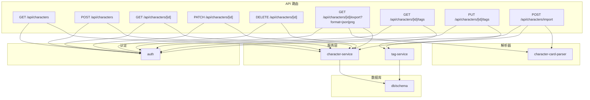
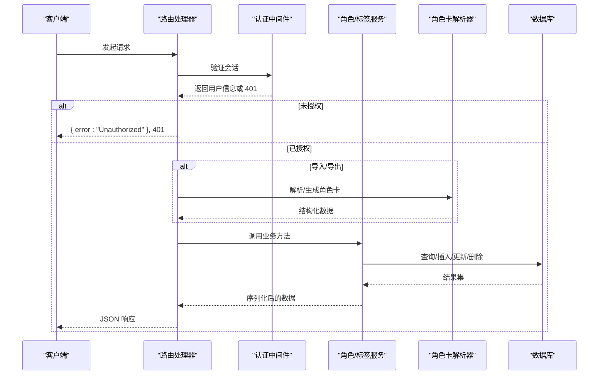
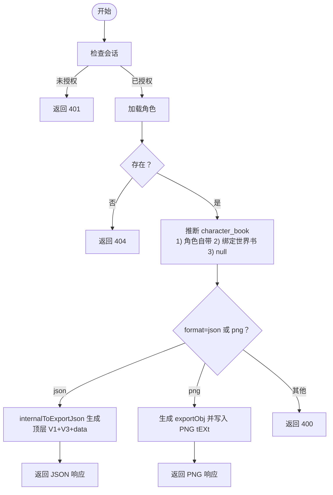
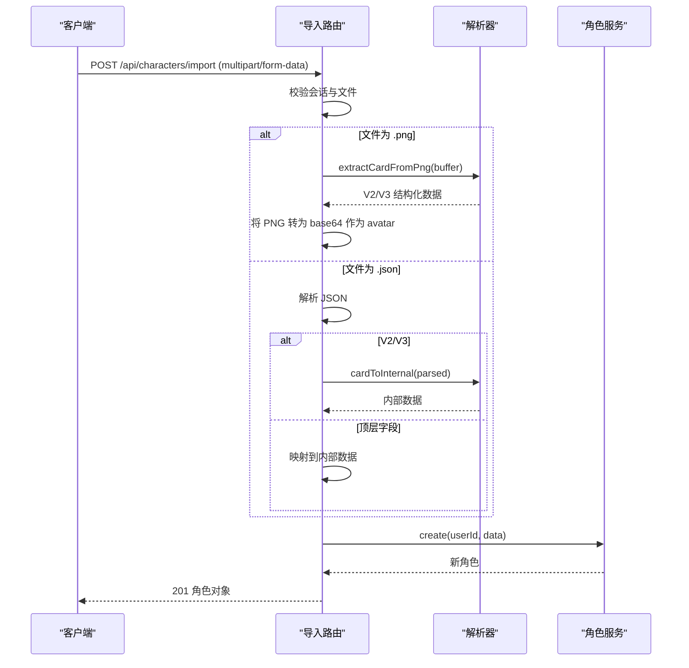
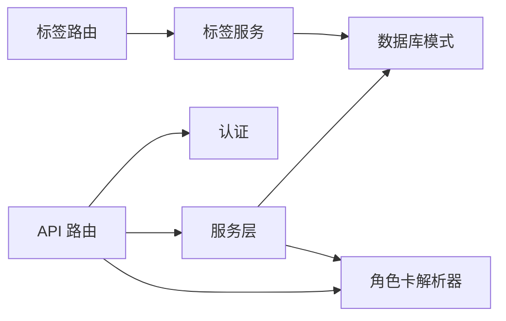

# 角色 API

<cite>
**本文引用的文件**
- [src/app/api/characters/route.ts](file://src/app/api/characters/route.ts)
- [src/app/api/characters/[id]/route.ts](file://src/app/api/characters/[id]/route.ts)
- [src/app/api/characters/[id]/export/route.ts](file://src/app/api/characters/[id]/export/route.ts)
- [src/app/api/characters/[id]/tags/route.ts](file://src/app/api/characters/[id]/tags/route.ts)
- [src/app/api/characters/import/route.ts](file://src/app/api/characters/import/route.ts)
- [src/lib/services/character-service.ts](file://src/lib/services/character-service.ts)
- [src/lib/services/tag-service.ts](file://src/lib/services/tag-service.ts)
- [src/lib/parsers/character-card-parser.ts](file://src/lib/parsers/character-card-parser.ts)
- [src/types/index.ts](file://src/types/index.ts)
- [src/lib/auth.ts](file://src/lib/auth.ts)
- [src/lib/db/schema.ts](file://src/lib/db/schema.ts)
</cite>

## 目录
1. [简介](#简介)
2. [项目结构](#项目结构)
3. [核心组件](#核心组件)
4. [架构总览](#架构总览)
5. [详细组件分析](#详细组件分析)
6. [依赖关系分析](#依赖关系分析)
7. [性能考量](#性能考量)
8. [故障排除指南](#故障排除指南)
9. [结论](#结论)
10. [附录](#附录)

## 简介
本文件为“角色 API”的完整技术文档，覆盖角色管理相关接口的规范与实现细节，包括：
- 获取角色列表
- 创建角色
- 获取单个角色
- 更新角色
- 删除角色
- 导出角色（支持 JSON 与 PNG）
- 标签管理（获取与设置角色标签）

文档还涵盖角色数据结构、TavernCard V2/V3 格式支持、导入导出流程、标签系统以及权限控制机制，并提供请求/响应示例与错误处理说明。

## 项目结构
角色 API 的路由位于 Next.js App Router 的 API 层，按资源分组组织：
- 角色集合：GET/POST /api/characters
- 单个角色：GET/PATCH/DELETE /api/characters/[id]
- 导出：GET /api/characters/[id]/export?format=json|png
- 标签：GET/PUT /api/characters/[id]/tags
- 导入：POST /api/characters/import

图表来源
- [src/app/api/characters/route.ts:1-42](file://src/app/api/characters/route.ts#L1-L42)
- [src/app/api/characters/[id]/route.ts](file://src/app/api/characters/[id]/route.ts#L1-L47)
- [src/app/api/characters/[id]/export/route.ts](file://src/app/api/characters/[id]/export/route.ts#L1-L162)
- [src/app/api/characters/[id]/tags/route.ts](file://src/app/api/characters/[id]/tags/route.ts#L1-L42)
- [src/app/api/characters/import/route.ts:1-90](file://src/app/api/characters/import/route.ts#L1-L90)
- [src/lib/services/character-service.ts:1-252](file://src/lib/services/character-service.ts#L1-L252)
- [src/lib/services/tag-service.ts:1-209](file://src/lib/services/tag-service.ts#L1-L209)
- [src/lib/parsers/character-card-parser.ts:1-354](file://src/lib/parsers/character-card-parser.ts#L1-L354)
- [src/lib/db/schema.ts](file://src/lib/db/schema.ts)

章节来源
- [src/app/api/characters/route.ts:1-42](file://src/app/api/characters/route.ts#L1-L42)
- [src/app/api/characters/[id]/route.ts](file://src/app/api/characters/[id]/route.ts#L1-L47)
- [src/app/api/characters/[id]/export/route.ts](file://src/app/api/characters/[id]/export/route.ts#L1-L162)
- [src/app/api/characters/[id]/tags/route.ts](file://src/app/api/characters/[id]/tags/route.ts#L1-L42)
- [src/app/api/characters/import/route.ts:1-90](file://src/app/api/characters/import/route.ts#L1-L90)

## 核心组件
- 认证中间件：所有受保护接口均依赖会话认证，未登录用户返回 401。
- 角色服务：封装 CRUD、搜索、去重、删除关联聊天等业务逻辑。
- 标签服务：提供标签 CRUD、角色-标签关联设置与查询。
- 角色卡解析器：支持 V1/V2/V3、JSON/PNG 互转与 PNG tEXt chunk 读写。
- 类型定义：统一角色、标签、世界书等数据模型与 API 响应结构。

章节来源
- [src/lib/auth.ts](file://src/lib/auth.ts)
- [src/lib/services/character-service.ts:1-252](file://src/lib/services/character-service.ts#L1-L252)
- [src/lib/services/tag-service.ts:1-209](file://src/lib/services/tag-service.ts#L1-L209)
- [src/lib/parsers/character-card-parser.ts:1-354](file://src/lib/parsers/character-card-parser.ts#L1-L354)
- [src/types/index.ts:154-184](file://src/types/index.ts#L154-L184)

## 架构总览
角色 API 的调用链路如下：
- 客户端请求 → Next.js 路由处理器 → 认证校验 → 业务服务 → 数据库操作 → 返回响应
- 导出/导入涉及角色卡解析器，负责格式转换与 PNG 元数据读写

图表来源
- [src/app/api/characters/import/route.ts:1-90](file://src/app/api/characters/import/route.ts#L1-L90)
- [src/app/api/characters/[id]/export/route.ts](file://src/app/api/characters/[id]/export/route.ts#L1-L162)
- [src/lib/services/character-service.ts:115-251](file://src/lib/services/character-service.ts#L115-L251)
- [src/lib/services/tag-service.ts:57-208](file://src/lib/services/tag-service.ts#L57-L208)
- [src/lib/parsers/character-card-parser.ts:132-258](file://src/lib/parsers/character-card-parser.ts#L132-L258)

## 详细组件分析

### 角色集合接口
- GET /api/characters
  - 功能：获取当前用户的全部角色，支持关键词搜索。
  - 查询参数：q（可选，按名称模糊匹配）。
  - 成功响应：角色数组（按更新时间倒序）。
  - 权限：需登录。
- POST /api/characters
  - 功能：创建新角色。
  - 请求体：符合角色输入模式的数据。
  - 成功响应：新创建的角色对象（201）。
  - 错误：输入校验失败返回 400；未授权返回 401；服务器异常返回 500。

章节来源
- [src/app/api/characters/route.ts:5-41](file://src/app/api/characters/route.ts#L5-L41)
- [src/lib/services/character-service.ts:11-53](file://src/lib/services/character-service.ts#L11-L53)

### 单个角色接口
- GET /api/characters/[id]
  - 功能：获取指定角色详情。
  - 成功响应：角色对象。
  - 错误：未找到返回 404；未授权返回 401。
- PATCH /api/characters/[id]
  - 功能：部分更新角色（仅提供字段生效）。
  - 请求体：符合角色更新模式的数据。
  - 成功响应：更新后的角色对象。
  - 错误：未找到返回 404；输入校验失败返回 400；未授权返回 401。
- DELETE /api/characters/[id]
  - 功能：删除角色，同时清理其关联聊天。
  - 成功响应：{ success: true }。
  - 错误：未找到返回 404；未授权返回 401。

章节来源
- [src/app/api/characters/[id]/route.ts](file://src/app/api/characters/[id]/route.ts#L7-L46)
- [src/lib/services/character-service.ts:176-225](file://src/lib/services/character-service.ts#L176-L225)

### 导出接口
- GET /api/characters/[id]/export?format=json|png
  - 功能：导出角色卡为 JSON 或 PNG。
  - 输出：
    - JSON：顶层保留 V1 兼容字段，同时输出 V3 spec 与 data，data 中可包含 character_book。
    - PNG：将 JSON 内容写入 PNG 的 tEXt chunk（同时写入 chara 与 ccv3 以兼容）。
  - 世界书绑定：优先使用角色自带的 characterBook，否则根据 worldInfoBookId 实时转换。
  - 成功响应：JSON 文本或 PNG 图像流（带合适的 Content-Type 与 Content-Disposition）。
  - 错误：未授权返回 401；角色不存在返回 404；格式无效返回 400；导出失败返回 500。

图表来源
- [src/app/api/characters/[id]/export/route.ts](file://src/app/api/characters/[id]/export/route.ts#L15-L144)
- [src/lib/parsers/character-card-parser.ts:209-258](file://src/lib/parsers/character-card-parser.ts#L209-L258)

章节来源
- [src/app/api/characters/[id]/export/route.ts](file://src/app/api/characters/[id]/export/route.ts#L10-L144)
- [src/lib/parsers/character-card-parser.ts:209-258](file://src/lib/parsers/character-card-parser.ts#L209-L258)

### 标签管理接口
- GET /api/characters/[id]/tags
  - 功能：获取角色关联的标签 ID 列表。
  - 成功响应：{ tagIds: string[] }。
- PUT /api/characters/[id]/tags
  - 功能：设置角色的标签（覆盖式：先清空旧关联，再建立新关联）。
  - 请求体：{ tagIds: string[] }。
  - 成功响应：{ success: true }。
  - 错误：输入校验失败返回 400；未授权返回 401；服务器异常返回 500。

章节来源
- [src/app/api/characters/[id]/tags/route.ts](file://src/app/api/characters/[id]/tags/route.ts#L12-L41)
- [src/lib/services/tag-service.ts:140-166](file://src/lib/services/tag-service.ts#L140-L166)

### 导入接口
- POST /api/characters/import
  - 功能：从 JSON 或 PNG 导入角色卡。
  - 支持格式：
    - JSON：支持 V2/V3、旧版 V1 裸数据、兼容旧版 ST 的顶层字段。
    - PNG：从 tEXt chunk 读取角色卡，同时将 PNG 作为头像（base64 data URL）。
  - 成功响应：创建后的角色对象（201）。
  - 错误：未授权返回 401；缺少文件返回 400；不支持的格式返回 400；无效格式返回 400；导入失败返回 500。

图表来源
- [src/app/api/characters/import/route.ts:12-89](file://src/app/api/characters/import/route.ts#L12-L89)
- [src/lib/parsers/character-card-parser.ts:132-154](file://src/lib/parsers/character-card-parser.ts#L132-L154)

章节来源
- [src/app/api/characters/import/route.ts:9-89](file://src/app/api/characters/import/route.ts#L9-L89)
- [src/lib/parsers/character-card-parser.ts:104-129](file://src/lib/parsers/character-card-parser.ts#L104-L129)

## 依赖关系分析
- 路由层依赖认证模块与服务层。
- 服务层依赖数据库模式与 Drizzle ORM。
- 导出/导入依赖角色卡解析器进行格式转换与 PNG 元数据读写。
- 标签服务独立维护角色-标签关联表。

图表来源
- [src/app/api/characters/route.ts:1-42](file://src/app/api/characters/route.ts#L1-L42)
- [src/app/api/characters/[id]/route.ts](file://src/app/api/characters/[id]/route.ts#L1-L47)
- [src/app/api/characters/[id]/export/route.ts](file://src/app/api/characters/[id]/export/route.ts#L1-L162)
- [src/app/api/characters/[id]/tags/route.ts](file://src/app/api/characters/[id]/tags/route.ts#L1-L42)
- [src/app/api/characters/import/route.ts:1-90](file://src/app/api/characters/import/route.ts#L1-L90)
- [src/lib/services/character-service.ts:1-252](file://src/lib/services/character-service.ts#L1-L252)
- [src/lib/services/tag-service.ts:1-209](file://src/lib/services/tag-service.ts#L1-L209)
- [src/lib/parsers/character-card-parser.ts:1-354](file://src/lib/parsers/character-card-parser.ts#L1-L354)
- [src/lib/db/schema.ts](file://src/lib/db/schema.ts)

章节来源
- [src/lib/db/schema.ts](file://src/lib/db/schema.ts)

## 性能考量
- 查询排序：按 updatedAt 倒序，便于前端展示最近修改的角色。
- 搜索索引：建议在 name 字段建立索引以提升模糊查询性能。
- 导出优化：PNG 导出时尽量复用已生成的 exportObj，避免重复计算。
- 批量操作：标签设置采用先删后增的方式，适合中小规模标签集；大规模场景可考虑更高效的差异合并策略。
- 缓存：对于频繁访问的角色详情，可在应用层引入缓存以降低数据库压力。

## 故障排除指南
- 401 未授权
  - 检查认证会话是否有效，确保携带正确的 Cookie 或认证头。
- 400 输入校验失败
  - 检查请求体是否符合角色输入/更新模式或标签设置模式。
- 404 角色不存在
  - 确认角色 ID 是否正确且属于当前用户。
- 导出失败
  - 确认角色存在且 format 参数为 json 或 png。
  - PNG 导出时检查头像字段与 PNG 元数据写入逻辑。
- 导入失败
  - 确认上传文件为 .json 或 .png，且格式符合预期。
  - 若为 PNG，请确认 tEXt chunk 中包含有效的角色卡数据。

章节来源
- [src/app/api/characters/route.ts:24-28](file://src/app/api/characters/route.ts#L24-L28)
- [src/app/api/characters/[id]/route.ts](file://src/app/api/characters/[id]/route.ts#L26-L29)
- [src/app/api/characters/[id]/export/route.ts](file://src/app/api/characters/[id]/export/route.ts#L136-L144)
- [src/app/api/characters/import/route.ts:26-28](file://src/app/api/characters/import/route.ts#L26-L28)

## 结论
本角色 API 提供了完善的角色生命周期管理能力，支持多格式导入导出、标签体系与严格的权限控制。通过清晰的路由分层、强类型的输入校验与可扩展的服务层设计，能够满足从个人到团队协作的多样化需求。建议在生产环境中结合缓存与索引策略进一步优化性能，并持续关注格式兼容性与安全加固。

## 附录

### 角色数据结构（内部模型）
- 字段概览：基础信息（name/description/personality/scenario/firstMessage/exampleDialogue）、高级字段（creatorNotes/systemPrompt/postHistoryInstructions/alternateGreetings/tags/creator/characterVersion）、扩展字段（talkativeness/fav/avatar/extensions）、世界书绑定（worldInfoBookId/characterBook）与元数据（createDate/createdAt/updatedAt）。
- 类型定义参考：[角色类型定义:154-184](file://src/types/index.ts#L154-L184)

章节来源
- [src/types/index.ts:154-184](file://src/types/index.ts#L154-L184)

### TavernCard V2/V3 格式支持
- V1/V2/V3 解析与转换：统一为 V2 结构，再生成 V3 spec 的顶层 JSON。
- JSON 导出：顶层保留 V1 兼容字段，data 中包含 character_book。
- PNG 导出：同时写入 chara 与 ccv3 tEXt chunk，保证兼容性。
- 参考实现：[角色卡解析器:104-129](file://src/lib/parsers/character-card-parser.ts#L104-L129), [导出 JSON:209-258](file://src/lib/parsers/character-card-parser.ts#L209-L258), [PNG 读写:266-334](file://src/lib/parsers/character-card-parser.ts#L266-L334)

章节来源
- [src/lib/parsers/character-card-parser.ts:104-129](file://src/lib/parsers/character-card-parser.ts#L104-L129)
- [src/lib/parsers/character-card-parser.ts:209-258](file://src/lib/parsers/character-card-parser.ts#L209-L258)
- [src/lib/parsers/character-card-parser.ts:266-334](file://src/lib/parsers/character-card-parser.ts#L266-L334)

### 权限控制
- 所有接口均要求登录态，且操作的角色必须属于当前用户。
- 删除角色会级联清理其关联聊天，防止孤儿数据。
- 参考实现：[角色服务删除逻辑:214-225](file://src/lib/services/character-service.ts#L214-L225), [认证中间件](file://src/lib/auth.ts)

章节来源
- [src/lib/services/character-service.ts:214-225](file://src/lib/services/character-service.ts#L214-L225)
- [src/lib/auth.ts](file://src/lib/auth.ts)

### 请求/响应示例（路径指引）
- 获取角色列表
  - 请求：GET /api/characters?q=xxx
  - 响应：数组，元素为角色对象
  - 参考：[路由实现:5-17](file://src/app/api/characters/route.ts#L5-L17)
- 创建角色
  - 请求：POST /api/characters
  - 请求体：角色输入模式数据
  - 响应：创建后的角色对象（201）
  - 参考：[路由实现:19-41](file://src/app/api/characters/route.ts#L19-L41)
- 获取单个角色
  - 请求：GET /api/characters/[id]
  - 响应：角色对象
  - 参考：[路由实现:7-17](file://src/app/api/characters/[id]/route.ts#L7-L17)
- 更新角色
  - 请求：PATCH /api/characters/[id]
  - 请求体：角色更新模式数据
  - 响应：更新后的角色对象
  - 参考：[路由实现:19-34](file://src/app/api/characters/[id]/route.ts#L19-L34)
- 删除角色
  - 请求：DELETE /api/characters/[id]
  - 响应：{ success: true }
  - 参考：[路由实现:36-46](file://src/app/api/characters/[id]/route.ts#L36-L46)
- 导出角色（JSON）
  - 请求：GET /api/characters/[id]/export?format=json
  - 响应：application/json（带附件头）
  - 参考：[路由实现:80-88](file://src/app/api/characters/[id]/export/route.ts#L80-L88)
- 导出角色（PNG）
  - 请求：GET /api/characters/[id]/export?format=png
  - 响应：image/png（带附件头）
  - 参考：[路由实现:90-134](file://src/app/api/characters/[id]/export/route.ts#L90-L134)
- 获取角色标签
  - 请求：GET /api/characters/[id]/tags
  - 响应：{ tagIds: string[] }
  - 参考：[路由实现:12-20](file://src/app/api/characters/[id]/tags/route.ts#L12-L20)
- 设置角色标签
  - 请求：PUT /api/characters/[id]/tags
  - 请求体：{ tagIds: string[] }
  - 响应：{ success: true }
  - 参考：[路由实现:22-41](file://src/app/api/characters/[id]/tags/route.ts#L22-L41)
- 导入角色
  - 请求：POST /api/characters/import (multipart/form-data, file)
  - 响应：创建后的角色对象（201）
  - 参考：[路由实现:12-89](file://src/app/api/characters/import/route.ts#L12-L89)