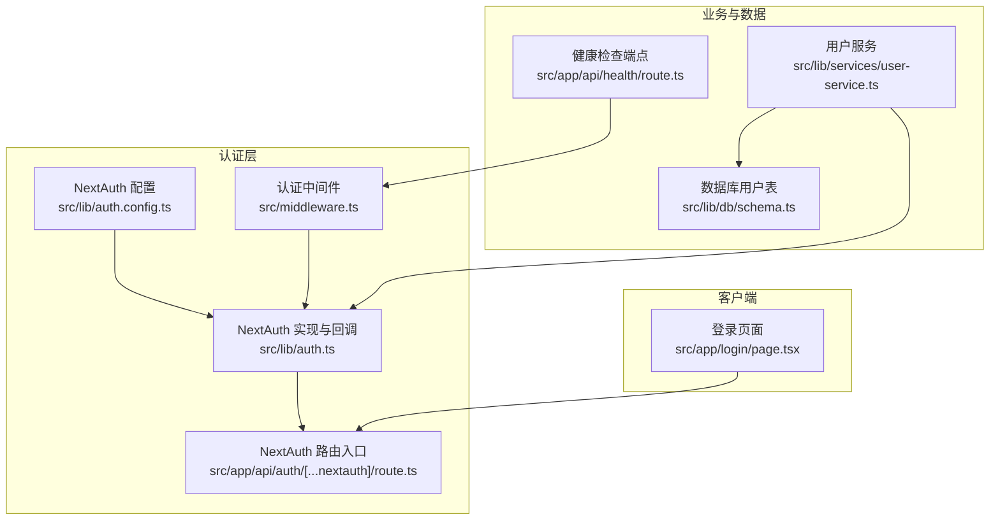
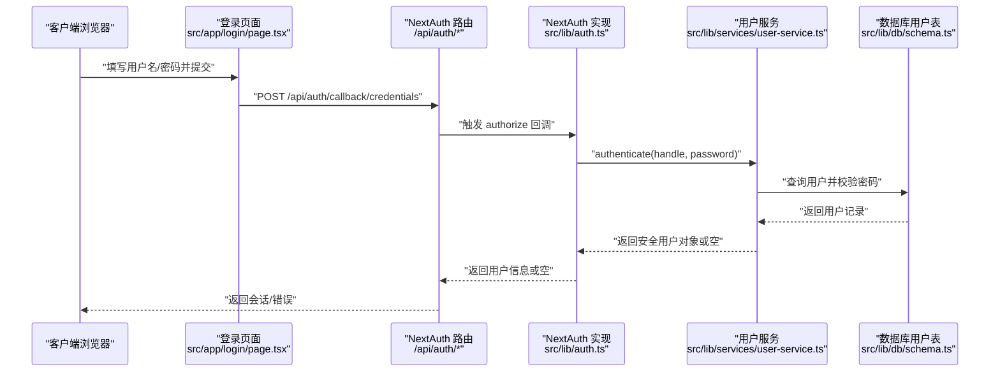
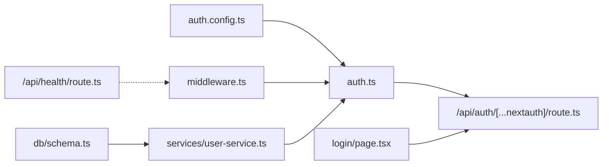

# 认证 API

<cite>
**本文引用的文件**
- [src/lib/auth.ts](file://src/lib/auth.ts)
- [src/lib/auth.config.ts](file://src/lib/auth.config.ts)
- [src/app/api/auth/[...nextauth]/route.ts](file://src/app/api/auth/[...nextauth]/route.ts)
- [src/middleware.ts](file://src/middleware.ts)
- [src/app/login/page.tsx](file://src/app/login/page.tsx)
- [src/lib/services/user-service.ts](file://src/lib/services/user-service.ts)
- [src/lib/db/schema.ts](file://src/lib/db/schema.ts)
- [src/app/api/health/route.ts](file://src/app/api/health/route.ts)
</cite>

## 目录
1. [简介](#简介)
2. [项目结构](#项目结构)
3. [核心组件](#核心组件)
4. [架构总览](#架构总览)
5. [详细组件分析](#详细组件分析)
6. [依赖关系分析](#依赖关系分析)
7. [性能考量](#性能考量)
8. [故障排查指南](#故障排查指南)
9. [结论](#结论)
10. [附录](#附录)

## 简介
本文件为本项目的认证 API 提供全面的规范文档，覆盖 NextAuth v5 集成的认证流程、用户注册/登录/登出与会话管理、认证中间件配置、会话令牌处理、权限验证机制与安全策略，并包含用户管理接口的使用方法、密码重置流程与账户安全措施。文档还提供客户端集成示例、错误处理机制与安全最佳实践指南，并解释认证状态同步与跨域处理的实现细节。

## 项目结构
认证相关的核心文件组织如下：
- NextAuth 配置与处理器：src/lib/auth.config.ts、src/lib/auth.ts
- NextAuth 路由入口：src/app/api/auth/[...nextauth]/route.ts
- 认证中间件：src/middleware.ts
- 登录页面与客户端集成：src/app/login/page.tsx
- 用户服务与密码校验：src/lib/services/user-service.ts
- 数据库用户表结构：src/lib/db/schema.ts
- 健康检查端点（无需鉴权）：src/app/api/health/route.ts

图表来源
- [src/lib/auth.config.ts:1-53](file://src/lib/auth.config.ts#L1-L53)
- [src/lib/auth.ts:1-59](file://src/lib/auth.ts#L1-L59)
- [src/app/api/auth/[...nextauth]/route.ts:1-3](file://src/app/api/auth/[...nextauth]/route.ts#L1-L3)
- [src/middleware.ts:1-35](file://src/middleware.ts#L1-L35)
- [src/app/login/page.tsx:1-85](file://src/app/login/page.tsx#L1-L85)
- [src/lib/services/user-service.ts:1-170](file://src/lib/services/user-service.ts#L1-L170)
- [src/lib/db/schema.ts:1-240](file://src/lib/db/schema.ts#L1-L240)
- [src/app/api/health/route.ts:1-10](file://src/app/api/health/route.ts#L1-L10)

章节来源
- [src/lib/auth.config.ts:1-53](file://src/lib/auth.config.ts#L1-L53)
- [src/lib/auth.ts:1-59](file://src/lib/auth.ts#L1-L59)
- [src/app/api/auth/[...nextauth]/route.ts:1-3](file://src/app/api/auth/[...nextauth]/route.ts#L1-L3)
- [src/middleware.ts:1-35](file://src/middleware.ts#L1-L35)
- [src/app/login/page.tsx:1-85](file://src/app/login/page.tsx#L1-L85)
- [src/lib/services/user-service.ts:1-170](file://src/lib/services/user-service.ts#L1-L170)
- [src/lib/db/schema.ts:1-240](file://src/lib/db/schema.ts#L1-L240)
- [src/app/api/health/route.ts:1-10](file://src/app/api/health/route.ts#L1-L10)

## 核心组件
- NextAuth 配置与回调：定义凭据提供者、JWT 回调、会话回调、授权回调与登录页映射。
- NextAuth 实现：整合 Zod 参数校验、用户服务认证、JWT/Session 数据透传。
- NextAuth 路由入口：导出 GET/POST 处理器，统一接入 /api/auth/*。
- 认证中间件：基于 NextAuth auth() 包装，拦截非公开路径进行鉴权。
- 登录页面：前端使用 next-auth/react 的 signIn 方法提交凭据。
- 用户服务：负责用户查询、密码哈希/校验、用户更新与删除等。
- 数据库用户表：包含 id、handle、password、salt、admin、enabled 等字段。
- 健康检查端点：无需鉴权，供容器/编排平台监控使用。

章节来源
- [src/lib/auth.config.ts:1-53](file://src/lib/auth.config.ts#L1-L53)
- [src/lib/auth.ts:1-59](file://src/lib/auth.ts#L1-L59)
- [src/app/api/auth/[...nextauth]/route.ts:1-3](file://src/app/api/auth/[...nextauth]/route.ts#L1-L3)
- [src/middleware.ts:1-35](file://src/middleware.ts#L1-L35)
- [src/app/login/page.tsx:1-85](file://src/app/login/page.tsx#L1-L85)
- [src/lib/services/user-service.ts:1-170](file://src/lib/services/user-service.ts#L1-L170)
- [src/lib/db/schema.ts:1-240](file://src/lib/db/schema.ts#L1-L240)
- [src/app/api/health/route.ts:1-10](file://src/app/api/health/route.ts#L1-L10)

## 架构总览
认证系统采用 NextAuth v5 的凭据认证模式，结合 JWT 会话策略与自定义回调，完成从登录到会话透传的全流程。

图表来源
- [src/app/login/page.tsx:13-30](file://src/app/login/page.tsx#L13-L30)
- [src/app/api/auth/[...nextauth]/route.ts:1-3](file://src/app/api/auth/[...nextauth]/route.ts#L1-L3)
- [src/lib/auth.ts:21-35](file://src/lib/auth.ts#L21-L35)
- [src/lib/services/user-service.ts:64-69](file://src/lib/services/user-service.ts#L64-L69)
- [src/lib/db/schema.ts:6-16](file://src/lib/db/schema.ts#L6-L16)

## 详细组件分析

### NextAuth 配置与回调
- 凭据提供者：定义 handle 与 password 字段，authorize 逻辑在完整实现中处理。
- JWT 回调：首次登录时将用户 id、handle、admin 写入 token。
- Session 回调：将 token 中的 id、handle、admin 注入 session.user。
- 授权回调：允许 /login、/api/auth 与 /api/health 公开访问；其余路由需登录。
- 会话策略：JWT，maxAge 为 30 天。

章节来源
- [src/lib/auth.config.ts:5-52](file://src/lib/auth.config.ts#L5-L52)

### NextAuth 实现与回调
- 参数校验：使用 Zod 对登录请求体进行校验。
- 授权流程：调用用户服务 authenticate，返回安全用户对象或空。
- JWT/Session 注入：在回调中将用户信息写入 token 并透传到 session。

章节来源
- [src/lib/auth.ts:7-10](file://src/lib/auth.ts#L7-L10)
- [src/lib/auth.ts:21-35](file://src/lib/auth.ts#L21-L35)
- [src/lib/auth.ts:37-57](file://src/lib/auth.ts#L37-L57)

### NextAuth 路由入口
- 统一导出 GET/POST 处理器，对接 NextAuth 的 [...nextauth] 路由。

章节来源
- [src/app/api/auth/[...nextauth]/route.ts:1-3](file://src/app/api/auth/[...nextauth]/route.ts#L1-L3)

### 认证中间件
- 使用 NextAuth 的 auth 包装，对受保护路径进行拦截。
- 放行 /login、/api/auth、/_next、favicon.ico。
- 未登录访问受保护路径时，重定向至 /login 并携带 callbackUrl。

章节来源
- [src/middleware.ts:8-30](file://src/middleware.ts#L8-L30)

### 登录页面与客户端集成
- 前端使用 next-auth/react 的 signIn 方法，提交 credentials provider 的凭据。
- callbackUrl 设置为根路径，登录成功后跳转。

章节来源
- [src/app/login/page.tsx:13-30](file://src/app/login/page.tsx#L13-L30)

### 用户服务与密码安全
- 用户认证：按 handle 查询用户，校验 enabled 状态与密码哈希。
- 密码哈希：使用 scrypt，盐值随机生成，存储于用户记录。
- 安全返回：toSafeUser 移除敏感字段，避免泄露。
- 用户管理：支持创建、更新（含密码更新）、删除、按 id/handle 查询。

章节来源
- [src/lib/services/user-service.ts:40-50](file://src/lib/services/user-service.ts#L40-L50)
- [src/lib/services/user-service.ts:64-69](file://src/lib/services/user-service.ts#L64-L69)
- [src/lib/services/user-service.ts:98-119](file://src/lib/services/user-service.ts#L98-L119)
- [src/lib/services/user-service.ts:124-146](file://src/lib/services/user-service.ts#L124-L146)
- [src/lib/services/user-service.ts:151-154](file://src/lib/services/user-service.ts#L151-L154)
- [src/lib/services/user-service.ts:159-168](file://src/lib/services/user-service.ts#L159-L168)

### 数据库用户表结构
- 字段：id、name、handle（唯一）、password、salt、avatar、admin、enabled、createdAt。
- 与用户服务配合，支撑认证与用户管理。

章节来源
- [src/lib/db/schema.ts:6-16](file://src/lib/db/schema.ts#L6-L16)

### 健康检查端点
- 无需鉴权，返回 { status: "ok", ts }。
- 供容器/编排平台监控使用。

章节来源
- [src/app/api/health/route.ts:1-10](file://src/app/api/health/route.ts#L1-L10)

## 依赖关系分析
- NextAuth 配置与实现：auth.config.ts 作为基础配置，auth.ts 在其基础上扩展凭据提供者与回调。
- NextAuth 路由入口：route.ts 直接导出 handlers，统一接入 /api/auth/*。
- 中间件：依赖 auth.config.ts，对受保护路由进行拦截。
- 登录页面：依赖 next-auth/react 的 signIn，向 /api/auth/callback/credentials 提交。
- 用户服务：依赖数据库 schema 与 drizzle-orm，提供认证与用户管理能力。
- 健康检查：独立于认证链路，仅用于运行时健康探测。

图表来源
- [src/lib/auth.config.ts:1-53](file://src/lib/auth.config.ts#L1-L53)
- [src/lib/auth.ts:1-59](file://src/lib/auth.ts#L1-L59)
- [src/app/api/auth/[...nextauth]/route.ts:1-3](file://src/app/api/auth/[...nextauth]/route.ts#L1-L3)
- [src/middleware.ts:1-35](file://src/middleware.ts#L1-L35)
- [src/app/login/page.tsx:1-85](file://src/app/login/page.tsx#L1-L85)
- [src/lib/services/user-service.ts:1-170](file://src/lib/services/user-service.ts#L1-L170)
- [src/lib/db/schema.ts:1-240](file://src/lib/db/schema.ts#L1-L240)
- [src/app/api/health/route.ts:1-10](file://src/app/api/health/route.ts#L1-L10)

章节来源
- [src/lib/auth.config.ts:1-53](file://src/lib/auth.config.ts#L1-L53)
- [src/lib/auth.ts:1-59](file://src/lib/auth.ts#L1-L59)
- [src/app/api/auth/[...nextauth]/route.ts:1-3](file://src/app/api/auth/[...nextauth]/route.ts#L1-L3)
- [src/middleware.ts:1-35](file://src/middleware.ts#L1-L35)
- [src/app/login/page.tsx:1-85](file://src/app/login/page.tsx#L1-L85)
- [src/lib/services/user-service.ts:1-170](file://src/lib/services/user-service.ts#L1-L170)
- [src/lib/db/schema.ts:1-240](file://src/lib/db/schema.ts#L1-L240)
- [src/app/api/health/route.ts:1-10](file://src/app/api/health/route.ts#L1-L10)

## 性能考量
- 会话策略：JWT 会话、30 天有效期，减少服务器端会话存储压力。
- 中间件拦截：仅对非公开路径生效，降低对静态资源与公开端点的影响。
- 密码校验：使用定时常量时间比较，避免时序攻击。
- 数据库访问：用户认证与查询走单条记录检索，索引 handle（唯一）提升命中效率。

## 故障排查指南
- 登录失败
  - 检查 handle/password 是否为空，确认前端已正确提交。
  - 查看用户是否启用（enabled），以及密码哈希是否匹配。
  - 参考路径：[src/lib/auth.ts:21-35](file://src/lib/auth.ts#L21-L35)、[src/lib/services/user-service.ts:64-69](file://src/lib/services/user-service.ts#L64-L69)
- 未登录被重定向
  - 确认中间件是否正确识别 /login、/api/auth、/api/health。
  - 参考路径：[src/middleware.ts:13-20](file://src/middleware.ts#L13-L20)
- 会话信息缺失
  - 确认 JWT/Session 回调是否正确注入 id、handle、admin。
  - 参考路径：[src/lib/auth.ts:37-57](file://src/lib/auth.ts#L37-L57)
- 健康检查异常
  - 确认 /api/health 返回正常响应且无需鉴权。
  - 参考路径：[src/app/api/health/route.ts:7-9](file://src/app/api/health/route.ts#L7-L9)

章节来源
- [src/lib/auth.ts:21-35](file://src/lib/auth.ts#L21-L35)
- [src/lib/services/user-service.ts:64-69](file://src/lib/services/user-service.ts#L64-L69)
- [src/middleware.ts:13-20](file://src/middleware.ts#L13-L20)
- [src/lib/auth.ts:37-57](file://src/lib/auth.ts#L37-L57)
- [src/app/api/health/route.ts:7-9](file://src/app/api/health/route.ts#L7-L9)

## 结论
本认证体系基于 NextAuth v5 的凭据认证与 JWT 会话策略，结合自定义回调与用户服务，实现了从登录到会话透传的完整闭环。通过中间件与公开端点策略，确保了安全性与可用性。建议在生产环境中进一步完善密码重置流程、二次验证与审计日志，以满足更严格的安全要求。

## 附录

### API 规范概览
- 登录
  - 方法：POST
  - 路径：/api/auth/callback/credentials
  - 身份提供者：credentials（handle、password）
  - 成功响应：返回会话信息
  - 失败响应：返回错误
  - 参考路径：[src/app/api/auth/[...nextauth]/route.ts:1-3](file://src/app/api/auth/[...nextauth]/route.ts#L1-L3)、[src/lib/auth.ts:21-35](file://src/lib/auth.ts#L21-L35)
- 登出
  - 方法：POST
  - 路径：/api/auth/signout
  - 说明：通过 NextAuth 提供的 signOut 使用
  - 参考路径：[src/app/api/auth/[...nextauth]/route.ts:1-3](file://src/app/api/auth/[...nextauth]/route.ts#L1-L3)
- 会话
  - 方法：GET
  - 路径：/api/auth/session
  - 说明：返回当前会话，包含 id、handle、admin
  - 参考路径：[src/app/api/auth/[...nextauth]/route.ts:1-3](file://src/app/api/auth/[...nextauth]/route.ts#L1-L3)、[src/lib/auth.ts:47-57](file://src/lib/auth.ts#L47-L57)
- 授权状态
  - 方法：GET
  - 路径：/api/auth/authorized
  - 说明：内部使用，判断是否已登录
  - 参考路径：[src/lib/auth.config.ts:38-46](file://src/lib/auth.config.ts#L38-L46)
- 健康检查
  - 方法：GET
  - 路径：/api/health
  - 说明：无需鉴权，返回服务健康状态
  - 参考路径：[src/app/api/health/route.ts:7-9](file://src/app/api/health/route.ts#L7-L9)

### 客户端集成步骤
- 登录
  - 使用 next-auth/react 的 signIn，选择 credentials provider，传入 handle、password 与 callbackUrl。
  - 参考路径：[src/app/login/page.tsx:13-30](file://src/app/login/page.tsx#L13-L30)
- 会话获取
  - 使用 next-auth/react 的 useSession 或直接调用 /api/auth/session。
  - 参考路径：[src/lib/auth.ts:47-57](file://src/lib/auth.ts#L47-L57)
- 登出
  - 使用 next-auth/react 的 signOut。
  - 参考路径：[src/app/api/auth/[...nextauth]/route.ts:1-3](file://src/app/api/auth/[...nextauth]/route.ts#L1-L3)

### 安全最佳实践
- 会话策略：保持 JWT 会话与合理 maxAge。
- 密码安全：使用 scrypt 与随机盐，禁止明文存储。
- 输入校验：Zod 校验登录参数，拒绝空值。
- 中间件放行：明确公开端点，避免误放敏感路径。
- 错误处理：捕获并记录登录异常，不暴露敏感信息。