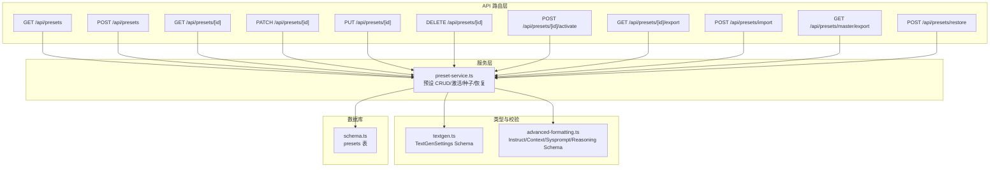
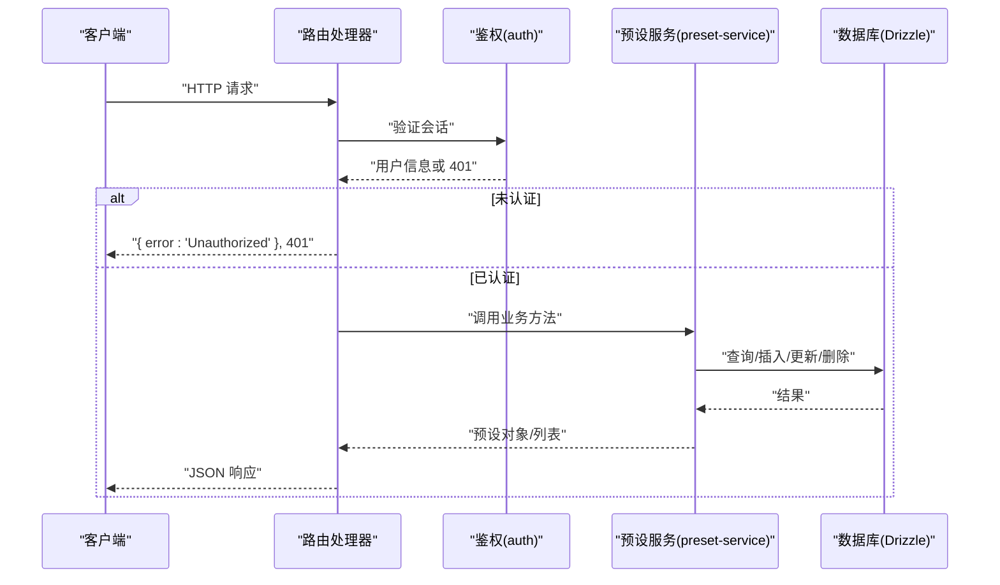
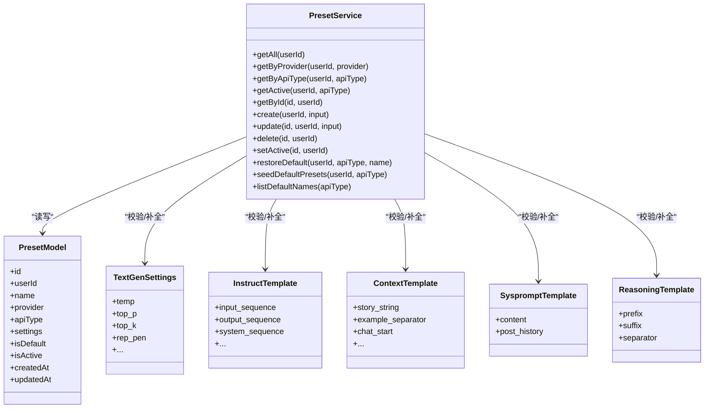

# 预设 API

<cite>
**本文引用的文件**
- [src/app/api/presets/route.ts](file://src/app/api/presets/route.ts)
- [src/app/api/presets/[id]/route.ts](file://src/app/api/presets/[id]/route.ts)
- [src/app/api/presets/[id]/activate/route.ts](file://src/app/api/presets/[id]/activate/route.ts)
- [src/app/api/presets/[id]/export/route.ts](file://src/app/api/presets/[id]/export/route.ts)
- [src/app/api/presets/import/route.ts](file://src/app/api/presets/import/route.ts)
- [src/app/api/presets/master/export/route.ts](file://src/app/api/presets/master/export/route.ts)
- [src/app/api/presets/restore/route.ts](file://src/app/api/presets/restore/route.ts)
- [src/lib/services/preset-service.ts](file://src/lib/services/preset-service.ts)
- [src/lib/db/schema.ts](file://src/lib/db/schema.ts)
- [src/types/textgen.ts](file://src/types/textgen.ts)
- [src/types/advanced-formatting.ts](file://src/types/advanced-formatting.ts)
- [default/presets/textgen/Default.json](file://default/presets/textgen/Default.json)
- [default/presets/context/Default.json](file://default/presets/context/Default.json)
</cite>

## 目录
1. [简介](#简介)
2. [项目结构](#项目结构)
3. [核心组件](#核心组件)
4. [架构总览](#架构总览)
5. [详细组件分析](#详细组件分析)
6. [依赖关系分析](#依赖关系分析)
7. [性能考量](#性能考量)
8. [故障排查指南](#故障排查指南)
9. [结论](#结论)
10. [附录](#附录)

## 简介
本文件为“预设 API”的完整技术文档，覆盖文本生成预设管理相关接口的规范与实现细节，包括：
- 获取预设列表
- 创建预设
- 获取单个预设
- 更新预设
- 删除预设
- 激活预设
- 导出单个预设
- 导入预设（单段或多段 Master）
- 导出主配置（Master 多段）
- 恢复内置默认预设

同时，文档详细说明了预设数据结构、参数配置选项、模板化提示词设计以及预设继承机制，并提供预设优化策略与批量操作的最佳实践。

## 项目结构
预设 API 的路由层位于 Next.js App Router 的 API 路径中，服务层通过 Drizzle ORM 访问 SQLite 数据库，类型与校验使用 Zod schema 定义，确保与原项目 SillyTavern 的兼容性。

图表来源
- [src/app/api/presets/route.ts:1-37](file://src/app/api/presets/route.ts#L1-L37)
- [src/app/api/presets/[id]/route.ts](file://src/app/api/presets/[id]/route.ts#L1-L44)
- [src/app/api/presets/[id]/activate/route.ts](file://src/app/api/presets/[id]/activate/route.ts#L1-L17)
- [src/app/api/presets/[id]/export/route.ts](file://src/app/api/presets/[id]/export/route.ts#L1-L37)
- [src/app/api/presets/import/route.ts:1-191](file://src/app/api/presets/import/route.ts#L1-L191)
- [src/app/api/presets/master/export/route.ts:1-146](file://src/app/api/presets/master/export/route.ts#L1-L146)
- [src/app/api/presets/restore/route.ts:1-32](file://src/app/api/presets/restore/route.ts#L1-L32)
- [src/lib/services/preset-service.ts:1-323](file://src/lib/services/preset-service.ts#L1-L323)
- [src/lib/db/schema.ts:182-196](file://src/lib/db/schema.ts#L182-L196)
- [src/types/textgen.ts:113-233](file://src/types/textgen.ts#L113-L233)
- [src/types/advanced-formatting.ts:33-115](file://src/types/advanced-formatting.ts#L33-L115)

章节来源
- [src/app/api/presets/route.ts:1-37](file://src/app/api/presets/route.ts#L1-L37)
- [src/app/api/presets/[id]/route.ts](file://src/app/api/presets/[id]/route.ts#L1-L44)
- [src/app/api/presets/[id]/activate/route.ts](file://src/app/api/presets/[id]/activate/route.ts#L1-L17)
- [src/app/api/presets/[id]/export/route.ts](file://src/app/api/presets/[id]/export/route.ts#L1-L37)
- [src/app/api/presets/import/route.ts:1-191](file://src/app/api/presets/import/route.ts#L1-L191)
- [src/app/api/presets/master/export/route.ts:1-146](file://src/app/api/presets/master/export/route.ts#L1-L146)
- [src/app/api/presets/restore/route.ts:1-32](file://src/app/api/presets/restore/route.ts#L1-L32)

## 核心组件
- 预设服务（preset-service.ts）
  - 提供 CRUD、激活、种子填充、恢复默认、按 apiType/provider 查询等能力
  - 统一处理 settings 的 JSON 序列化/反序列化
  - 支持内置默认预设目录扫描与恢复
- 类型与校验（textgen.ts、advanced-formatting.ts）
  - TextGenSettings：74+ 项采样与控制参数，含默认值与 passthrough 扩展字段
  - Instruct/Context/Sysprompt/Reasoning 模板 Schema：与原项目互通的字段命名与默认值
- 数据库模式（schema.ts）
  - presets 表：id、userId、name、provider、apiType、settings、isDefault、isActive 等

章节来源
- [src/lib/services/preset-service.ts:140-323](file://src/lib/services/preset-service.ts#L140-L323)
- [src/types/textgen.ts:113-233](file://src/types/textgen.ts#L113-L233)
- [src/types/advanced-formatting.ts:33-115](file://src/types/advanced-formatting.ts#L33-L115)
- [src/lib/db/schema.ts:182-196](file://src/lib/db/schema.ts#L182-L196)

## 架构总览
预设 API 的调用链路如下：客户端请求 → Next.js 路由 handler → 鉴权 → 预设服务 → 数据库（Drizzle ORM）→ 返回响应。

图表来源
- [src/app/api/presets/route.ts:5-25](file://src/app/api/presets/route.ts#L5-L25)
- [src/app/api/presets/[id]/route.ts](file://src/app/api/presets/[id]/route.ts#L7-L28)
- [src/lib/services/preset-service.ts:140-231](file://src/lib/services/preset-service.ts#L140-L231)
- [src/lib/db/schema.ts:182-196](file://src/lib/db/schema.ts#L182-L196)

## 详细组件分析

### GET /api/presets（获取预设列表）
- 功能
  - 支持按 apiType 或 provider 过滤
  - 首次访问时可自动种子化内置默认预设（当 seed!=0 且 apiType 属于可种子集合）
- 查询参数
  - apiType：按预设类型过滤
  - provider：按提供方过滤
  - seed：是否种子化（0 表示不种子）
- 返回
  - 预设数组（按创建时间倒序）

章节来源
- [src/app/api/presets/route.ts:5-25](file://src/app/api/presets/route.ts#L5-L25)
- [src/lib/services/preset-service.ts:140-168](file://src/lib/services/preset-service.ts#L140-L168)

### POST /api/presets（创建预设）
- 请求体
  - name、provider、apiType（可选）、settings（任意 JSON）、isDefault、isActive（可选）
- 校验
  - 使用通用 record 校验，保留任意字段，避免 instruct/context/sysprompt/reasoning/master 等丢失
- 响应
  - 创建后的预设对象（201）

章节来源
- [src/app/api/presets/route.ts:27-36](file://src/app/api/presets/route.ts#L27-L36)
- [src/lib/services/preset-service.ts:34-50](file://src/lib/services/preset-service.ts#L34-L50)

### GET /api/presets/[id]（获取单个预设）
- 路径参数
  - id：预设 ID
- 返回
  - 预设对象；不存在返回 404

章节来源
- [src/app/api/presets/[id]/route.ts](file://src/app/api/presets/[id]/route.ts#L7-L15)
- [src/lib/services/preset-service.ts:179-186](file://src/lib/services/preset-service.ts#L179-L186)

### PUT/PATCH /api/presets/[id]（更新预设）
- 路径参数
  - id：预设 ID
- 请求体（可选字段）
  - name、provider、apiType、settings、isDefault、isActive
- 行为
  - PATCH 与 PUT 等价，均为部分更新
- 返回
  - 更新后的预设对象；不存在返回 404

章节来源
- [src/app/api/presets/[id]/route.ts](file://src/app/api/presets/[id]/route.ts#L17-L33)
- [src/lib/services/preset-service.ts:205-223](file://src/lib/services/preset-service.ts#L205-L223)

### DELETE /api/presets/[id]（删除预设）
- 路径参数
  - id：预设 ID
- 返回
  - { success: true }；不存在返回 404

章节来源
- [src/app/api/presets/[id]/route.ts](file://src/app/api/presets/[id]/route.ts#L35-L43)
- [src/lib/services/preset-service.ts:225-231](file://src/lib/services/preset-service.ts#L225-L231)

### POST /api/presets/[id]/activate（激活预设）
- 语义
  - 将指定预设设为同 apiType 下唯一 active，其余同类型预设取消 active
- 返回
  - 激活后的预设对象；不存在返回 404

章节来源
- [src/app/api/presets/[id]/activate/route.ts](file://src/app/api/presets/[id]/activate/route.ts#L7-L16)
- [src/lib/services/preset-service.ts:233-250](file://src/lib/services/preset-service.ts#L233-L250)

### GET /api/presets/[id]/export（导出单个预设）
- 功能
  - 将预设 settings 通过对应 Schema 解析补齐默认字段，再附加 name 输出为 JSON 文件
  - 与原项目体积 1:1 对齐
- 返回
  - application/json 响应，Content-Disposition 指定文件名

章节来源
- [src/app/api/presets/[id]/export/route.ts](file://src/app/api/presets/[id]/export/route.ts#L8-L36)
- [src/types/textgen.ts:113-233](file://src/types/textgen.ts#L113-L233)
- [src/types/advanced-formatting.ts:33-115](file://src/types/advanced-formatting.ts#L33-L115)

### POST /api/presets/import（导入预设）
- 输入
  - { data: object, fileName?: string } 或直接 JSON
- 自动识别类型
  - textgen/instruct/context/sysprompt/reasoning/srw/master 多段
- 特殊处理
  - srw 段写入用户设置 formatting.start_reply_with / show_reply_prefix
  - master 多段：遍历 instruct/context/sysprompt/preset(reasoning/textgen)/srw
- 成功返回
  - { imported: [{ apiType, name, ok }] }

章节来源
- [src/app/api/presets/import/route.ts:10-191](file://src/app/api/presets/import/route.ts#L10-L191)
- [src/lib/services/preset-service.ts:140-168](file://src/lib/services/preset-service.ts#L140-L168)

### GET /api/presets/master/export（导出主配置）
- 功能
  - 输出兼容原项目的多段结构：{ instruct?, context?, sysprompt?, preset?, reasoning?, srw? }
  - 优先取当前激活预设，否则取该 apiType 下第一个
  - srw 段来自用户 formatting
- 查询参数
  - apiTypes：逗号分隔的 apiType 过滤
  - download：1 时以附件形式下载
- 返回
  - { data, meta } 或下载 JSON

章节来源
- [src/app/api/presets/master/export/route.ts:16-146](file://src/app/api/presets/master/export/route.ts#L16-L146)
- [src/lib/services/preset-service.ts:170-177](file://src/lib/services/preset-service.ts#L170-L177)

### POST /api/presets/restore（恢复内置默认预设）
- 请求体
  - { name: string; apiType?: string }（默认 textgenerationwebui）
- 行为
  - 若用户库中存在同名同 apiType 预设则覆盖 settings，否则新建
- 返回
  - 恢复后的预设对象；找不到默认预设返回 404

章节来源
- [src/app/api/presets/restore/route.ts:5-23](file://src/app/api/presets/restore/route.ts#L5-L23)
- [src/lib/services/preset-service.ts:257-287](file://src/lib/services/preset-service.ts#L257-L287)

### GET /api/presets/restore（列出内置默认预设名）
- 查询参数
  - apiType：默认 textgenerationwebui
- 返回
  - { names: string[] }

章节来源
- [src/app/api/presets/restore/route.ts:25-31](file://src/app/api/presets/restore/route.ts#L25-L31)
- [src/lib/services/preset-service.ts:122-130](file://src/lib/services/preset-service.ts#L122-L130)

## 依赖关系分析

图表来源
- [src/lib/services/preset-service.ts:140-323](file://src/lib/services/preset-service.ts#L140-L323)
- [src/lib/db/schema.ts:182-196](file://src/lib/db/schema.ts#L182-L196)
- [src/types/textgen.ts:113-233](file://src/types/textgen.ts#L113-L233)
- [src/types/advanced-formatting.ts:33-115](file://src/types/advanced-formatting.ts#L33-L115)

## 性能考量
- 批量种子化
  - 首次访问时按 apiType 种子化内置默认预设，避免重复写入（若已存在则跳过）
- 查询优化
  - 按 userId 过滤，按 apiType/provider 精确筛选，必要时按创建时间排序
- 导出一致性
  - 导出前通过对应 Schema 解析补齐默认字段，减少前端差异处理成本
- 并发与事务
  - 更新激活状态时先清空同 apiType 的 active，再设置目标为 active，建议在服务层保证原子性

章节来源
- [src/lib/services/preset-service.ts:289-311](file://src/lib/services/preset-service.ts#L289-L311)
- [src/app/api/presets/[id]/activate/route.ts](file://src/app/api/presets/[id]/activate/route.ts#L7-L16)

## 故障排查指南
- 401 未授权
  - 确认已登录并通过鉴权中间件
- 400 参数错误
  - 检查请求体字段类型与长度限制；导入时确认 JSON 结构正确
- 404 未找到
  - 检查 id 是否存在且属于当前用户；确认 apiType/provider 是否匹配
- 导入失败
  - 确认 JSON 字段与类型；srw 段需包含 value/show；master 多段需包含合法键
- 激活无效
  - 确认 apiType 是否一致；同一 apiType 下仅允许一个 active 预设

章节来源
- [src/app/api/presets/route.ts:5-25](file://src/app/api/presets/route.ts#L5-L25)
- [src/app/api/presets/[id]/route.ts](file://src/app/api/presets/[id]/route.ts#L7-L43)
- [src/app/api/presets/import/route.ts:107-191](file://src/app/api/presets/import/route.ts#L107-L191)

## 结论
本预设 API 体系以服务层为核心，结合 Zod Schema 与 Drizzle ORM，实现了与原项目 SillyTavern 的高兼容性与良好的扩展性。通过内置默认预设的种子化、多段 Master 导出导入、以及按 apiType 的激活机制，满足了多样化的文本生成场景需求。建议在生产环境中配合缓存与批量操作策略，进一步提升用户体验与系统稳定性。

## 附录

### 预设数据结构与字段说明
- 预设对象（数据库层）
  - id、userId、name、provider、apiType、settings（JSON）、isDefault、isActive、createdAt、updatedAt
- settings 支持的 Schema
  - TextGenSettings（74+ 项采样与控制参数）
  - Instruct/Context/Sysprompt/Reasoning 模板
- 示例文件
  - 默认文本生成预设：[default/presets/textgen/Default.json](file://default/presets/textgen/Default.json)
  - 默认上下文模板：[default/presets/context/Default.json](file://default/presets/context/Default.json)

章节来源
- [src/lib/db/schema.ts:182-196](file://src/lib/db/schema.ts#L182-L196)
- [src/types/textgen.ts:113-233](file://src/types/textgen.ts#L113-L233)
- [src/types/advanced-formatting.ts:33-115](file://src/types/advanced-formatting.ts#L33-L115)
- [default/presets/textgen/Default.json:1-122](file://default/presets/textgen/Default.json#L1-L122)
- [default/presets/context/Default.json:1-15](file://default/presets/context/Default.json#L1-L15)