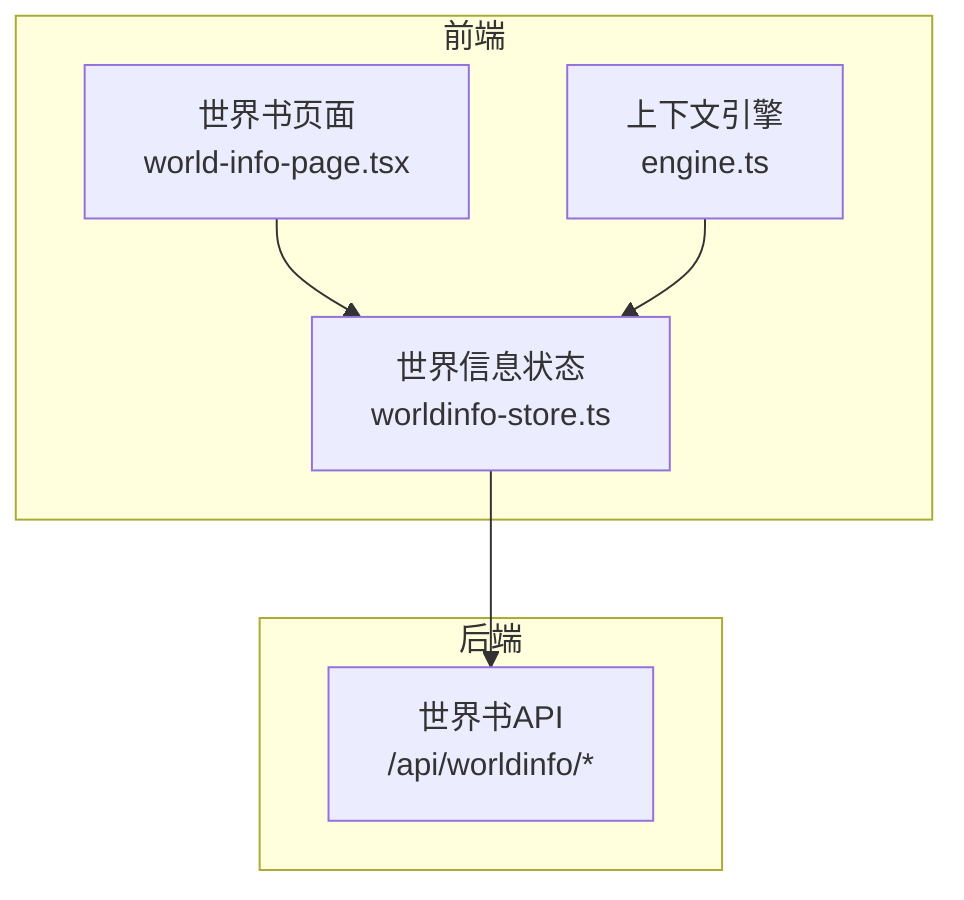
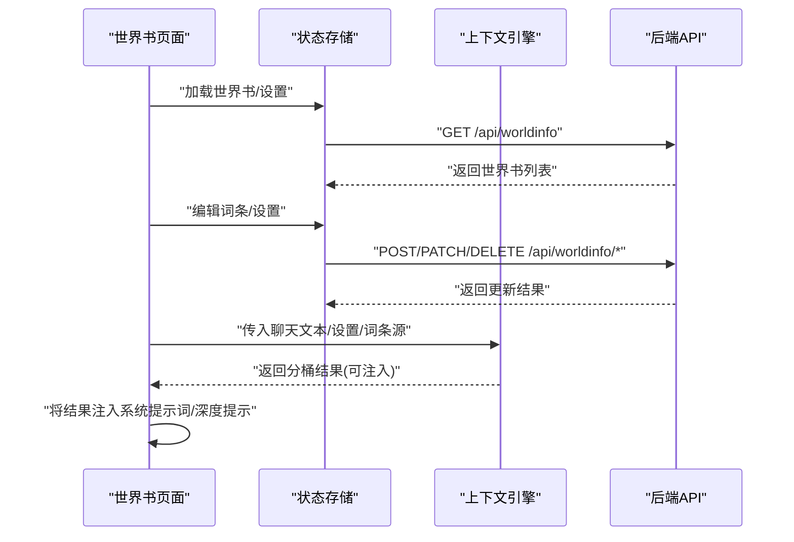
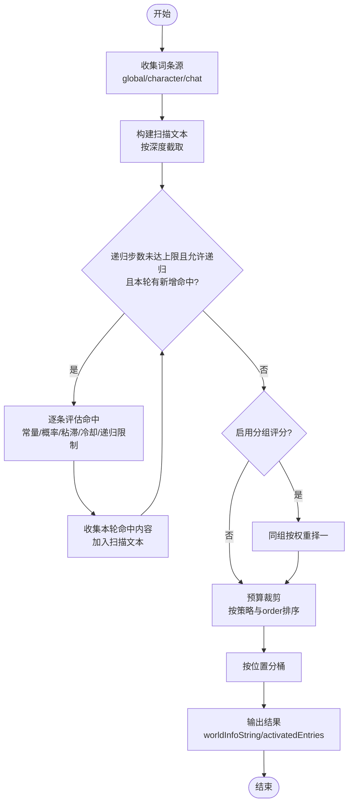
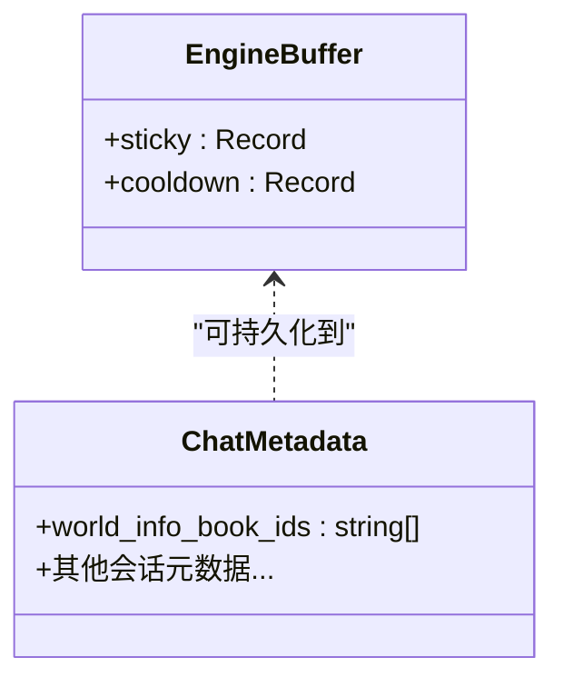
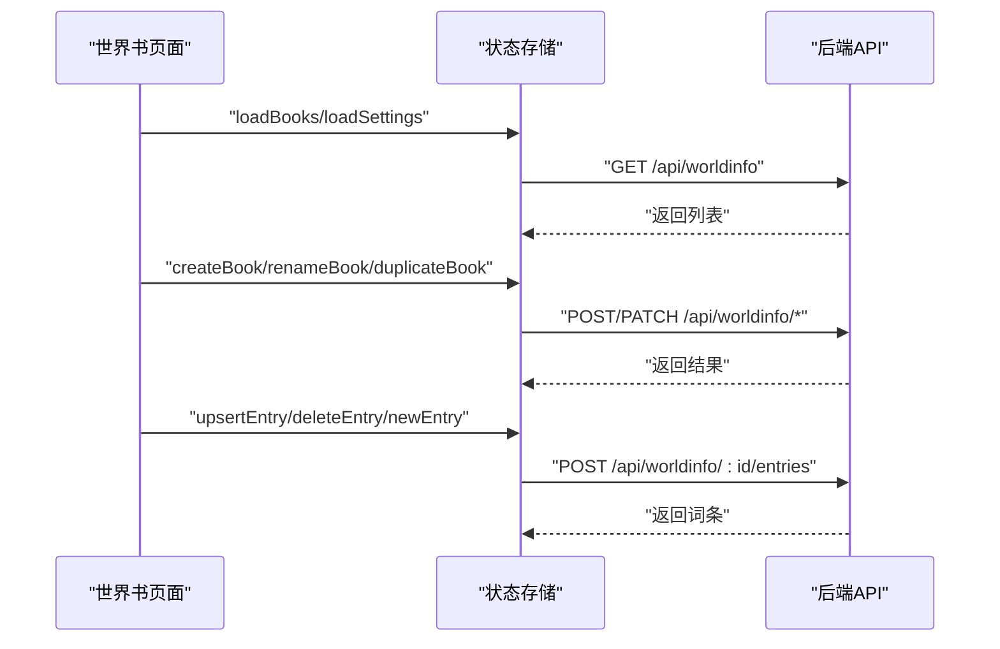
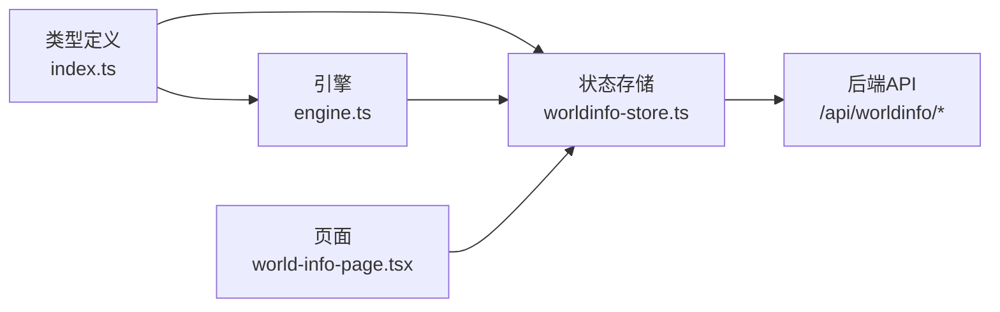

# 上下文感知机制

<cite>
**本文引用的文件**
- [src/lib/worldinfo/engine.ts](file://src/lib/worldinfo/engine.ts)
- [src/stores/worldinfo-store.ts](file://src/stores/worldinfo-store.ts)
- [src/types/index.ts](file://src/types/index.ts)
- [src/app/api/worldinfo/route.ts](file://src/app/api/worldinfo/route.ts)
- [src/app/api/worldinfo/[id]/route.ts](file://src/app/api/worldinfo/[id]/route.ts)
- [src/app/api/worldinfo/[id]/entries/route.ts](file://src/app/api/worldinfo/[id]/entries/route.ts)
- [src/components/world-info/world-info-page.tsx](file://src/components/world-info/world-info-page.tsx)
- [src/app/api/worldinfo/[id]/duplicate/route.ts](file://src/app/api/worldinfo/[id]/duplicate/route.ts)
- [src/app/api/worldinfo/[id]/rename/route.ts](file://src/app/api/worldinfo/[id]/rename/route.ts)
- [src/app/api/worldinfo/import/route.ts](file://src/app/api/worldinfo/import/route.ts)
- [src/app/api/worldinfo/[id]/export/route.ts](file://src/app/api/worldinfo/[id]/export/route.ts)
</cite>

## 目录
1. [引言](#引言)
2. [项目结构](#项目结构)
3. [核心组件](#核心组件)
4. [架构总览](#架构总览)
5. [详细组件分析](#详细组件分析)
6. [依赖关系分析](#依赖关系分析)
7. [性能考量](#性能考量)
8. [故障排查指南](#故障排查指南)
9. [结论](#结论)
10. [附录](#附录)

## 引言
本文件围绕“世界设定”的上下文感知机制进行系统化技术文档编写，重点解释以下方面：
- 上下文识别：如何从聊天历史、角色信息与场景环境中提取触发条件
- 状态跟踪：如何维护词条的粘滞(sticky)与冷却(cooldown)状态，实现跨轮对话的记忆
- 动态适应：如何通过递归扫描、分组评分与预算控制实现智能筛选与拼接
- 权重与相关性：词条命中后的分桶、排序与预算裁剪策略
- 词条选择影响因素：角色状态、情感状态、场景环境如何共同作用于词条权重与选择
- 缓存与历史：基于会话元数据的跨轮状态持久化
- 调试与评估：可视化命中快照、分桶结果与预算使用情况

## 项目结构
世界设定功能由“前端状态与页面”、“运行时引擎”、“后端API与服务”三部分协同构成：
- 前端：世界书页面负责增删改查与设置；Zustand状态管理负责与后端交互与本地缓存
- 引擎：根据聊天上下文与设置，对词条进行匹配、递归、分组与预算裁剪，并输出分桶结果
- 后端：提供世界书与词条的 CRUD、导入导出、复制与重命名等接口

**图表来源**
- [src/components/world-info/world-info-page.tsx:1-202](file://src/components/world-info/world-info-page.tsx#L1-L202)
- [src/stores/worldinfo-store.ts:1-257](file://src/stores/worldinfo-store.ts#L1-L257)
- [src/lib/worldinfo/engine.ts:1-424](file://src/lib/worldinfo/engine.ts#L1-L424)
- [src/app/api/worldinfo/route.ts:1-23](file://src/app/api/worldinfo/route.ts#L1-L23)

**章节来源**
- [src/components/world-info/world-info-page.tsx:1-202](file://src/components/world-info/world-info-page.tsx#L1-L202)
- [src/stores/worldinfo-store.ts:1-257](file://src/stores/worldinfo-store.ts#L1-L257)
- [src/lib/worldinfo/engine.ts:1-424](file://src/lib/worldinfo/engine.ts#L1-L424)
- [src/app/api/worldinfo/route.ts:1-23](file://src/app/api/worldinfo/route.ts#L1-L23)

## 核心组件
- 世界信息类型与设置
  - 定义了词条结构、位置(position)、逻辑(selectiveLogic)、角色(role)、深度(depth)、概率(probability)、粘滞(sticky)、冷却(cooldown)、出口(outletName)等字段
  - 定义了全局设置项，如扫描深度、最小激活数、预算、递归步数、大小写/全词匹配、分组评分开关、插入策略等
- 世界信息状态存储
  - 提供加载/创建/删除/重命名/复制/导入/导出世界书与词条的接口
  - 维护当前世界书与全局设置，并与后端API同步
- 上下文引擎
  - 输入：聊天文本数组、设置、词条源(全局/角色/聊天)
  - 输出：按位置分桶的结果、命中快照、以及可用于注入提示词的字符串
  - 支持递归扫描、概率判定、粘滞/冷却、分组评分、预算裁剪与插入策略排序

**章节来源**
- [src/types/index.ts:320-533](file://src/types/index.ts#L320-L533)
- [src/stores/worldinfo-store.ts:1-257](file://src/stores/worldinfo-store.ts#L1-L257)
- [src/lib/worldinfo/engine.ts:174-290](file://src/lib/worldinfo/engine.ts#L174-L290)

## 架构总览
世界设定的上下文感知流程如下：
- 前端页面加载世界书与设置，用户编辑词条
- 生成阶段，引擎接收聊天文本、设置与词条源，执行匹配与递归扫描
- 引擎输出分桶结果，前端将其注入到系统提示词或深度提示中
- 会话元数据保存粘滞/冷却状态，实现跨轮对话的记忆

**图表来源**
- [src/components/world-info/world-info-page.tsx:1-202](file://src/components/world-info/world-info-page.tsx#L1-L202)
- [src/stores/worldinfo-store.ts:1-257](file://src/stores/worldinfo-store.ts#L1-L257)
- [src/lib/worldinfo/engine.ts:174-290](file://src/lib/worldinfo/engine.ts#L174-L290)
- [src/app/api/worldinfo/route.ts:1-23](file://src/app/api/worldinfo/route.ts#L1-L23)

## 详细组件分析

### 上下文引擎：匹配、递归与分桶
- 匹配规则
  - 常量词条(constant)直接按概率命中
  - 主关键词(key)任意命中；若存在次级关键词(keysecondary)，按逻辑(AND_ANY/NOT_ALL/NOT_ANY/AND_ALL)进一步判定
  - 支持正则与全词匹配，大小写可配置
- 递归扫描
  - 在允许递归的前提下，将本轮命中的词条内容加入扫描文本，再次扫描，直至达到最大步数或无新增命中
  - 递归阶段可排除特定词条，或延迟至指定递归层才生效
- 粘滞与冷却
  - 命中词条若声明粘滞(sticky)或冷却(cooldown)，将在缓冲区中记录剩余轮次
  - 下轮扫描时，粘滞词条即使关键词不在也会继续命中；冷却词条则跳过
- 分组评分与互斥
  - 若启用分组评分(useGroupScoring)，同组(group)的词条按权重随机择一，groupOverride优先
- 预算裁剪与插入策略
  - 按字符估算token，结合预算上限与预算容量(cap)进行保留
  - 按插入策略(character_first/global_first/envenly)与order字段排序，优先保留高优先级词条
- 分桶输出
  - 将词条按位置(position)分为 before/after/anTop/anBottom/atDepth/emTop/emBottom/outlet
  - 输出可直接注入的字符串(worldInfoString)与命中快照(activatedEntries)

**图表来源**
- [src/lib/worldinfo/engine.ts:174-290](file://src/lib/worldinfo/engine.ts#L174-L290)
- [src/lib/worldinfo/engine.ts:292-342](file://src/lib/worldinfo/engine.ts#L292-L342)
- [src/lib/worldinfo/engine.ts:344-423](file://src/lib/worldinfo/engine.ts#L344-L423)

**章节来源**
- [src/lib/worldinfo/engine.ts:90-139](file://src/lib/worldinfo/engine.ts#L90-L139)
- [src/lib/worldinfo/engine.ts:196-238](file://src/lib/worldinfo/engine.ts#L196-L238)
- [src/lib/worldinfo/engine.ts:240-269](file://src/lib/worldinfo/engine.ts#L240-L269)
- [src/lib/worldinfo/engine.ts:292-342](file://src/lib/worldinfo/engine.ts#L292-L342)
- [src/lib/worldinfo/engine.ts:344-423](file://src/lib/worldinfo/engine.ts#L344-L423)

### 词条选择的影响因素
- 角色状态
  - 词条可绑定角色过滤器(名称/标签)，仅在匹配角色时生效
  - 角色层面的系统提示词、场景描述、个性等可通过扫描文本间接影响词条命中
- 情感状态
  - 引擎未直接定义情感状态字段；可通过词条内容与触发条件表达情感倾向，并由下游模型解释
- 场景环境
  - 词条可设置场景匹配标志位，或通过关键词与正则表达式覆盖不同环境
  - 出口(outletName)机制可按场景分流输出，便于模块化组织

**章节来源**
- [src/types/index.ts:368-416](file://src/types/index.ts#L368-L416)
- [src/lib/worldinfo/engine.ts:174-290](file://src/lib/worldinfo/engine.ts#L174-L290)

### 权重计算、相关性评分与智能推荐
- 权重与分组
  - 同组词条按groupWeight加权随机择一，groupOverride可强制保留
- 相关性评分
  - 引擎未内置显式的“相关性分数”字段；相关性主要体现在命中概率、关键词匹配与递归扩展
- 智能推荐
  - 通过概率(useProbability/probability)、粘滞(sticky)/冷却(cooldown)、递归(preventRecursion/excludeRecursion/delayUntilRecursion)与预算(cap/budget)实现“智能”筛选
  - 插入策略(character_first/global_first/envenly)与order字段实现“优先级”控制

**章节来源**
- [src/lib/worldinfo/engine.ts:240-269](file://src/lib/worldinfo/engine.ts#L240-L269)
- [src/lib/worldinfo/engine.ts:303-342](file://src/lib/worldinfo/engine.ts#L303-L342)
- [src/types/index.ts:368-416](file://src/types/index.ts#L368-L416)

### 缓存、历史与会话管理
- 会话级状态
  - 引擎缓冲区(buffer)保存粘滞(sticky)与冷却(cooldown)计数，随每轮扫描衰减
  - 状态以键值形式存储，键为“来源:uid”，便于跨轮追踪
- 会话元数据持久化
  - 引擎注释指出缓冲区可持久化到会话元数据，从而实现跨轮对话的记忆
- 前端缓存
  - Zustand状态存储负责与后端同步，避免重复请求
  - 词条编辑后会重新加载当前世界书，确保一致性

**图表来源**
- [src/lib/worldinfo/engine.ts:162-172](file://src/lib/worldinfo/engine.ts#L162-L172)
- [src/types/index.ts:260-267](file://src/types/index.ts#L260-L267)

**章节来源**
- [src/lib/worldinfo/engine.ts:162-172](file://src/lib/worldinfo/engine.ts#L162-L172)
- [src/stores/worldinfo-store.ts:177-218](file://src/stores/worldinfo-store.ts#L177-L218)

### API与前端集成
- 世界书API
  - 列表/创建/更新/删除/重命名/复制/导入/导出/词条增删改
- 前端页面
  - 提供世界书列表、编辑、导入导出、设置切换(全局生效)等功能
- 状态存储
  - 通过fetch与后端交互，封装常用操作并处理错误

**图表来源**
- [src/components/world-info/world-info-page.tsx:1-202](file://src/components/world-info/world-info-page.tsx#L1-L202)
- [src/stores/worldinfo-store.ts:1-257](file://src/stores/worldinfo-store.ts#L1-L257)
- [src/app/api/worldinfo/route.ts:1-23](file://src/app/api/worldinfo/route.ts#L1-L23)
- [src/app/api/worldinfo/[id]/route.ts:1-39](file://src/app/api/worldinfo/[id]/route.ts#L1-L39)
- [src/app/api/worldinfo/[id]/entries/route.ts:1-41](file://src/app/api/worldinfo/[id]/entries/route.ts#L1-L41)
- [src/app/api/worldinfo/[id]/duplicate/route.ts](file://src/app/api/worldinfo/[id]/duplicate/route.ts)
- [src/app/api/worldinfo/[id]/rename/route.ts](file://src/app/api/worldinfo/[id]/rename/route.ts)
- [src/app/api/worldinfo/import/route.ts](file://src/app/api/worldinfo/import/route.ts)
- [src/app/api/worldinfo/[id]/export/route.ts](file://src/app/api/worldinfo/[id]/export/route.ts)

**章节来源**
- [src/app/api/worldinfo/route.ts:1-23](file://src/app/api/worldinfo/route.ts#L1-L23)
- [src/app/api/worldinfo/[id]/route.ts:1-39](file://src/app/api/worldinfo/[id]/route.ts#L1-L39)
- [src/app/api/worldinfo/[id]/entries/route.ts:1-41](file://src/app/api/worldinfo/[id]/entries/route.ts#L1-L41)
- [src/components/world-info/world-info-page.tsx:1-202](file://src/components/world-info/world-info-page.tsx#L1-L202)
- [src/stores/worldinfo-store.ts:1-257](file://src/stores/worldinfo-store.ts#L1-L257)

## 依赖关系分析
- 类型与设置
  - 引擎依赖类型定义的词条结构、位置枚举、逻辑枚举、角色枚举与默认设置
- 状态存储
  - 依赖类型定义的设置与词条结构，封装API交互
- 引擎
  - 依赖设置与词条源，输出分桶结果
- 页面
  - 依赖状态存储与设置面板，驱动词条编辑与世界书管理

**图表来源**
- [src/types/index.ts:320-533](file://src/types/index.ts#L320-L533)
- [src/lib/worldinfo/engine.ts:1-424](file://src/lib/worldinfo/engine.ts#L1-L424)
- [src/stores/worldinfo-store.ts:1-257](file://src/stores/worldinfo-store.ts#L1-L257)
- [src/components/world-info/world-info-page.tsx:1-202](file://src/components/world-info/world-info-page.tsx#L1-L202)

**章节来源**
- [src/types/index.ts:320-533](file://src/types/index.ts#L320-L533)
- [src/lib/worldinfo/engine.ts:1-424](file://src/lib/worldinfo/engine.ts#L1-L424)
- [src/stores/worldinfo-store.ts:1-257](file://src/stores/worldinfo-store.ts#L1-L257)
- [src/components/world-info/world-info-page.tsx:1-202](file://src/components/world-info/world-info-page.tsx#L1-L202)

## 性能考量
- Token估算
  - 引擎采用字符级估算，中文按1字符计，英文/数字按约0.25字符计，用于预算裁剪
- 预算与容量
  - 预算(cap)作为硬上限，避免超长注入；策略排序优先保留高优先级词条
- 递归成本
  - 递归扫描可能显著增加计算量，建议合理设置最大递归步数与扫描深度
- 正则与匹配
  - 正则解析失败会回退为字面量匹配；全词匹配会增加开销，按需开启

**章节来源**
- [src/lib/worldinfo/engine.ts:141-149](file://src/lib/worldinfo/engine.ts#L141-L149)
- [src/lib/worldinfo/engine.ts:292-342](file://src/lib/worldinfo/engine.ts#L292-L342)
- [src/lib/worldinfo/engine.ts:51-88](file://src/lib/worldinfo/engine.ts#L51-L88)

## 故障排查指南
- 常见问题
  - 词条未命中：检查主/次关键词、大小写/全词匹配设置、概率(useProbability/probability)、递归限制与delayUntilRecursion
  - 递归无效：确认已启用递归(world_info_recursive)，并检查preventRecursion/excludeRecursion/delayUntilRecursion
  - 预算不足：提高预算(cap)或降低词条数量；调整插入策略与order优先级
  - 粘滞/冷却异常：检查buffer键值格式“来源:uid”，确认每轮衰减逻辑正常
- 调试建议
  - 查看命中快照(activatedEntries)与分桶结果，定位具体位置
  - 逐步缩小扫描深度(world_info_depth)验证匹配范围
  - 使用简单关键词与全字匹配快速定位问题

**章节来源**
- [src/lib/worldinfo/engine.ts:174-290](file://src/lib/worldinfo/engine.ts#L174-L290)
- [src/lib/worldinfo/engine.ts:344-423](file://src/lib/worldinfo/engine.ts#L344-L423)

## 结论
该上下文感知机制通过“匹配-递归-分组-预算-分桶”的流水线，实现了对角色状态、场景环境与历史对话的综合感知。其核心优势在于：
- 可配置的匹配与递归策略，支持复杂场景下的动态扩展
- 基于预算与优先级的智能裁剪，保障注入内容的可控性
- 粘滞/冷却与会话元数据的组合，提供跨轮对话的记忆能力
建议在实际应用中结合角色与场景特征，合理设置词条权重、递归步数与预算，以获得更稳定的上下文效果。

## 附录
- 关键术语
  - 词条：世界设定的基本单元，包含关键词、内容、位置、权重、概率等属性
  - 位置(position)：词条在提示词中的插入位置，包括before/after/anTop/anBottom/atDepth/emTop/emBottom/outlet
  - 分组评分：同组词条按权重择一，支持覆盖优先级
  - 预算裁剪：按token估算与预算上限保留高优先级词条
  - 粘滞/冷却：跨轮保持或抑制词条命中的状态机制