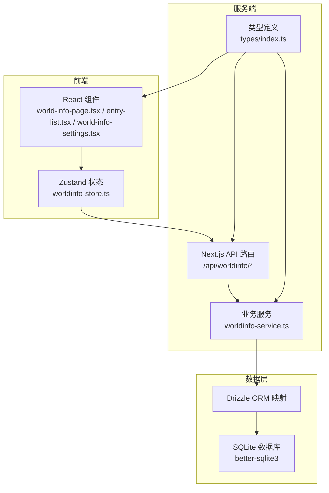
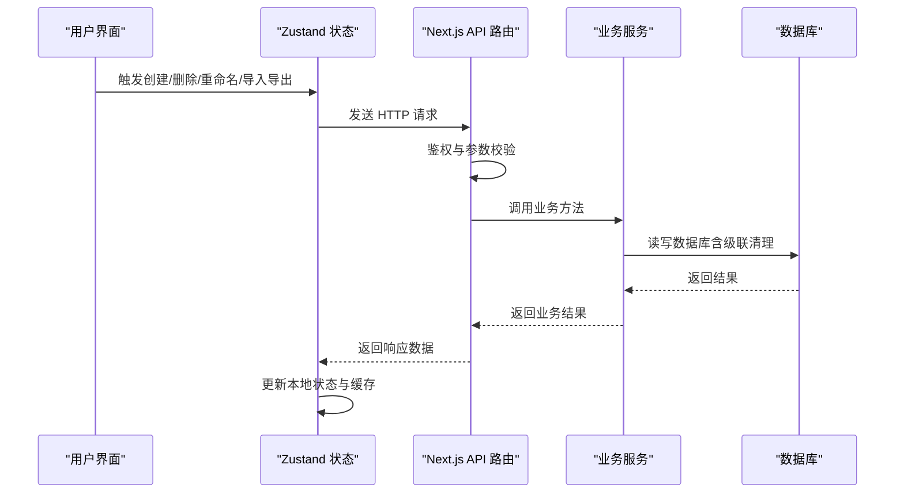
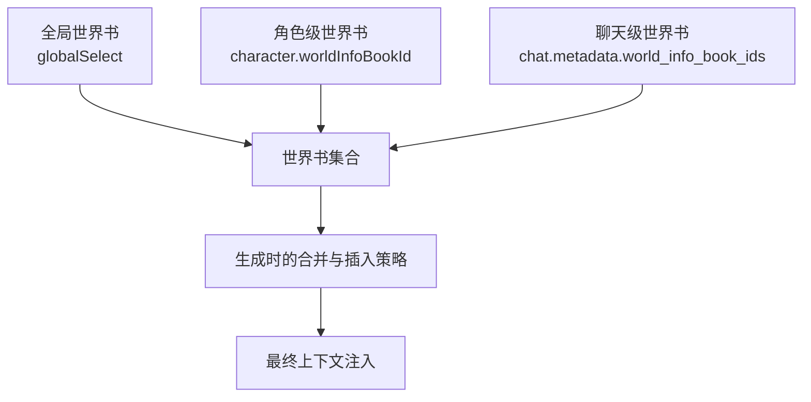
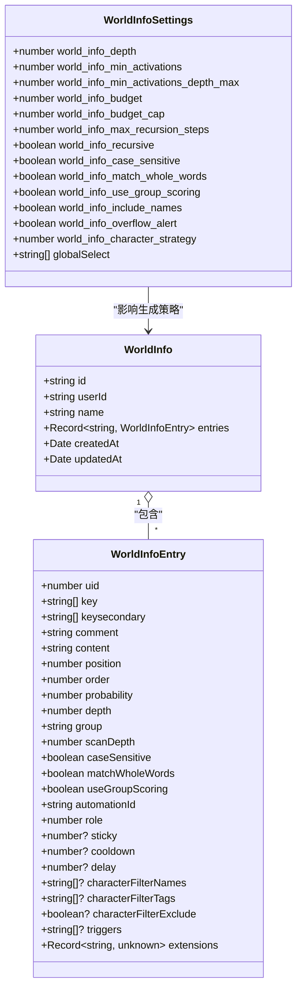
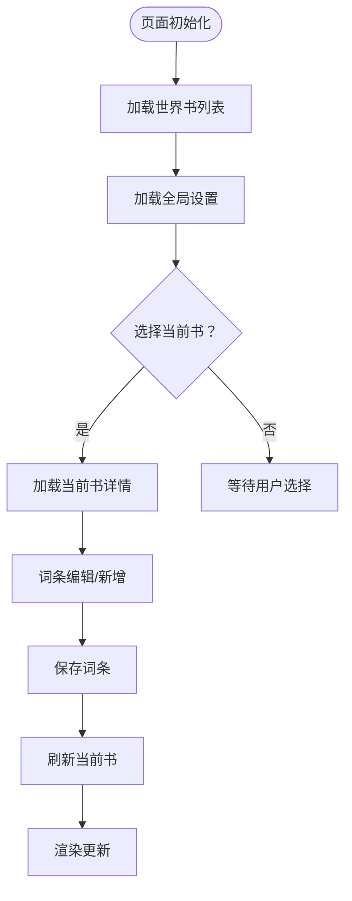
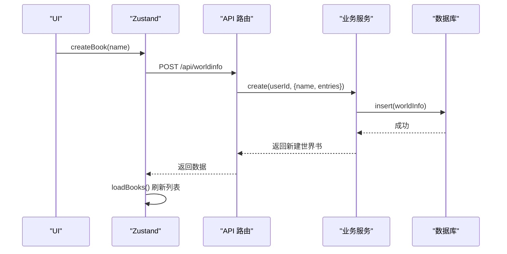
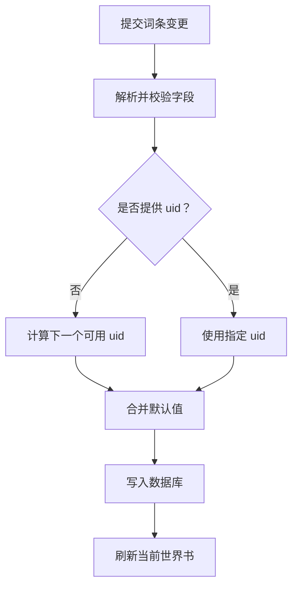
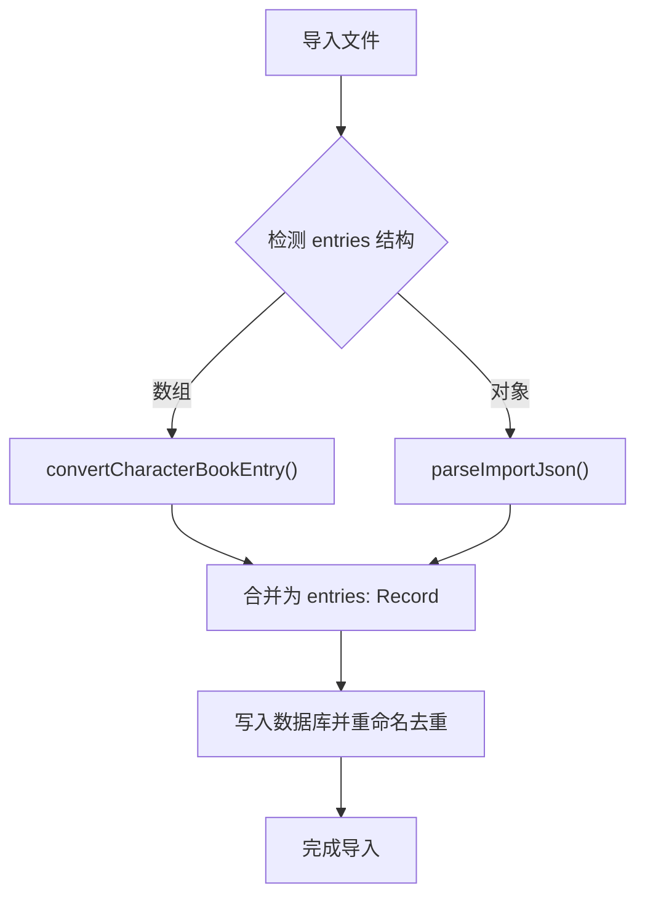
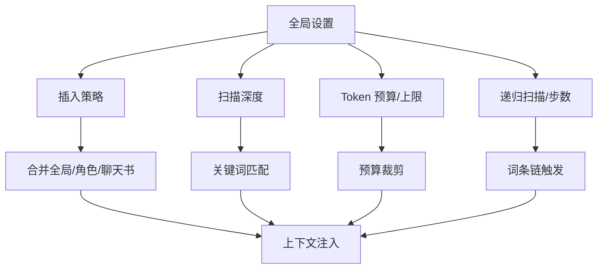
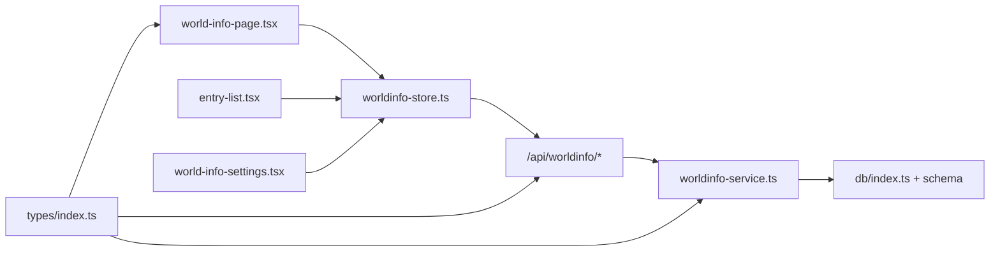

# 世界书架构设计

<cite>
**本文档引用的文件**
- [src/stores/worldinfo-store.ts](file://src/stores/worldinfo-store.ts)
- [src/lib/services/worldinfo-service.ts](file://src/lib/services/worldinfo-service.ts)
- [src/lib/db/index.ts](file://src/lib/db/index.ts)
- [src/types/index.ts](file://src/types/index.ts)
- [src/app/api/worldinfo/route.ts](file://src/app/api/worldinfo/route.ts)
- [src/app/api/worldinfo/[id]/route.ts](file://src/app/api/worldinfo/[id]/route.ts)
- [src/app/api/worldinfo/[id]/entries/route.ts](file://src/app/api/worldinfo/[id]/entries/route.ts)
- [src/app/api/worldinfo/[id]/entries/[uid]/route.ts](file://src/app/api/worldinfo/[id]/entries/[uid]/route.ts)
- [src/components/world-info/world-info-page.tsx](file://src/components/world-info/world-info-page.tsx)
- [src/components/world-info/entry-list.tsx](file://src/components/world-info/entry-list.tsx)
- [src/components/world-info/world-info-settings.tsx](file://src/components/world-info/world-info-settings.tsx)
- [src/app/world-info/page.tsx](file://src/app/world-info/page.tsx)
</cite>

## 目录
1. [简介](#简介)
2. [项目结构](#项目结构)
3. [核心组件](#核心组件)
4. [架构总览](#架构总览)
5. [详细组件分析](#详细组件分析)
6. [依赖关系分析](#依赖关系分析)
7. [性能考虑](#性能考虑)
8. [故障排除指南](#故障排除指南)
9. [结论](#结论)
10. [附录](#附录)

## 简介
本文件面向“世界设定系统”（World Info / Lorebook）的架构设计，围绕三层架构模型（全局世界书、角色级世界书、聊天级世界书）进行深入解析。文档涵盖世界书的数据模型、层次结构、作用域范围与继承关系，以及加载策略、缓存机制、性能优化、生命周期管理（创建、删除、重命名、导入导出）与最佳实践。

## 项目结构
世界书系统采用前后端分离的三层架构：
- 前端层：React 组件与 Zustand 状态管理，负责用户交互与本地缓存。
- 服务层：Next.js API 路由与业务服务，负责鉴权、输入校验、数据持久化与跨表级联处理。
- 数据层：SQLite（better-sqlite3）+ Drizzle ORM，负责结构化存储与迁移。

图表来源
- [src/components/world-info/world-info-page.tsx:1-202](file://src/components/world-info/world-info-page.tsx#L1-L202)
- [src/stores/worldinfo-store.ts:1-257](file://src/stores/worldinfo-store.ts#L1-L257)
- [src/app/api/worldinfo/route.ts:1-23](file://src/app/api/worldinfo/route.ts#L1-L23)
- [src/lib/services/worldinfo-service.ts:1-428](file://src/lib/services/worldinfo-service.ts#L1-L428)
- [src/lib/db/index.ts:1-134](file://src/lib/db/index.ts#L1-L134)
- [src/types/index.ts:321-533](file://src/types/index.ts#L321-L533)

章节来源
- [src/components/world-info/world-info-page.tsx:1-202](file://src/components/world-info/world-info-page.tsx#L1-L202)
- [src/stores/worldinfo-store.ts:1-257](file://src/stores/worldinfo-store.ts#L1-L257)
- [src/app/api/worldinfo/route.ts:1-23](file://src/app/api/worldinfo/route.ts#L1-L23)
- [src/lib/services/worldinfo-service.ts:1-428](file://src/lib/services/worldinfo-service.ts#L1-L428)
- [src/lib/db/index.ts:1-134](file://src/lib/db/index.ts#L1-L134)
- [src/types/index.ts:321-533](file://src/types/index.ts#L321-L533)

## 核心组件
- 类型与常量定义：定义世界书词条、世界书、全局设置及枚举（位置、逻辑、插入策略、角色），并提供默认值工厂。
- 状态管理：Zustand 存储世界书列表、当前编辑书、全局设置与加载状态，并封装 CRUD 与导入导出操作。
- API 路由：提供世界书与词条的增删改查、重命名、复制、导入导出等接口，统一鉴权与输入校验。
- 业务服务：实现数据持久化、级联清理（角色绑定、全局设置）、词条合并与 UID 分配、导入导出格式转换。
- 数据库：SQLite + Drizzle ORM，支持迁移与字段幂等补齐。

章节来源
- [src/types/index.ts:321-533](file://src/types/index.ts#L321-L533)
- [src/stores/worldinfo-store.ts:1-257](file://src/stores/worldinfo-store.ts#L1-L257)
- [src/app/api/worldinfo/[id]/entries/[uid]/route.ts](file://src/app/api/worldinfo/[id]/entries/[uid]/route.ts#L1-L27)
- [src/lib/services/worldinfo-service.ts:1-428](file://src/lib/services/worldinfo-service.ts#L1-L428)
- [src/lib/db/index.ts:1-134](file://src/lib/db/index.ts#L1-L134)

## 架构总览
世界书系统遵循“前端状态 + 服务端路由 + 业务服务 + 数据库”的分层设计。前端通过 Zustand 管理 UI 状态与本地缓存，调用 Next.js API 路由；路由层进行鉴权与参数校验，委托给业务服务完成数据持久化与复杂逻辑；业务服务通过 Drizzle ORM 访问 SQLite 数据库。

图表来源
- [src/stores/worldinfo-store.ts:43-256](file://src/stores/worldinfo-store.ts#L43-L256)
- [src/app/api/worldinfo/route.ts:1-23](file://src/app/api/worldinfo/route.ts#L1-L23)
- [src/app/api/worldinfo/[id]/route.ts](file://src/app/api/worldinfo/[id]/route.ts#L1-L39)
- [src/app/api/worldinfo/[id]/entries/route.ts](file://src/app/api/worldinfo/[id]/entries/route.ts#L1-L41)
- [src/app/api/worldinfo/[id]/entries/[uid]/route.ts](file://src/app/api/worldinfo/[id]/entries/[uid]/route.ts#L1-L27)
- [src/lib/services/worldinfo-service.ts:97-300](file://src/lib/services/worldinfo-service.ts#L97-L300)
- [src/lib/db/index.ts:1-134](file://src/lib/db/index.ts#L1-L134)

## 详细组件分析

### 1) 三层架构模型与作用域
- 全局世界书（Global World Info）
  - 定义：用户级别的世界书集合，可在全局范围内生效。
  - 作用域：通过设置项中的“全局生效”勾选，影响所有聊天与角色。
  - 生命周期：支持创建、重命名、复制、删除、导入、导出。
- 角色级世界书（Character-Level World Info）
  - 定义：与角色卡绑定的世界书，仅对该角色生效。
  - 作用域：通过角色表的绑定字段生效，独立于全局设置。
- 聊天级世界书（Chat-Level World Info）
  - 定义：与具体会话绑定的世界书，优先级最高。
  - 作用域：通过聊天元数据中的世界书 ID 列表生效，覆盖全局与角色级。

图表来源
- [src/types/index.ts:260-267](file://src/types/index.ts#L260-L267)
- [src/types/index.ts:418-426](file://src/types/index.ts#L418-L426)
- [src/types/index.ts:428-462](file://src/types/index.ts#L428-L462)

章节来源
- [src/types/index.ts:260-267](file://src/types/index.ts#L260-L267)
- [src/types/index.ts:418-426](file://src/types/index.ts#L418-L426)
- [src/types/index.ts:428-462](file://src/types/index.ts#L428-L462)

### 2) 数据模型与层次结构
- 世界书（WorldInfo）
  - 字段：id、userId、name、entries（Record<uid, Entry>）、时间戳。
  - 用途：承载一组词条，作为世界书的基本容器。
- 词条（WorldInfoEntry）
  - 字段：uid、key/keysecondary、content、comment、position、order、probability、depth、group、scanDepth、caseSensitive、matchWholeWords、useGroupScoring、automationId、role、cooldown/delay/sticky、characterFilter*、triggers、extensions 等。
  - 用途：定义触发条件与插入行为，决定何时、如何注入到生成上下文中。
- 全局设置（WorldInfoSettings）
  - 字段：扫描深度、最少激活、Token 预算、预算上限、递归步数、递归扫描、大小写敏感、全词匹配、分组评分、包含角色名、溢出告警、插入策略、globalSelect。
  - 用途：控制世界书在生成过程中的匹配与注入策略。

图表来源
- [src/types/index.ts:368-426](file://src/types/index.ts#L368-L426)
- [src/types/index.ts:428-462](file://src/types/index.ts#L428-L462)

章节来源
- [src/types/index.ts:368-426](file://src/types/index.ts#L368-L426)
- [src/types/index.ts:428-462](file://src/types/index.ts#L428-L462)

### 3) 加载策略与缓存机制
- 前端缓存
  - Zustand 状态：维护 books、currentBook、settings、loading 等，减少重复请求。
  - 词条列表：EntryList 支持搜索与排序，基于 useMemo 优化渲染。
- 服务端缓存
  - 无显式服务端缓存层，但通过 Drizzle ORM 查询与数据库 WAL 模式提升并发读取性能。
- 生命周期同步
  - 每次写操作后，前端主动刷新当前书或列表，确保 UI 与后端一致。

图表来源
- [src/stores/worldinfo-store.ts:49-173](file://src/stores/worldinfo-store.ts#L49-L173)
- [src/components/world-info/entry-list.tsx:20-38](file://src/components/world-info/entry-list.tsx#L20-L38)

章节来源
- [src/stores/worldinfo-store.ts:49-173](file://src/stores/worldinfo-store.ts#L49-L173)
- [src/components/world-info/entry-list.tsx:20-38](file://src/components/world-info/entry-list.tsx#L20-L38)

### 4) 生命周期管理（创建/删除/重命名/导入/导出）
- 创建世界书
  - 前端：调用 POST /api/worldinfo，携带 name 与可选 entries。
  - 服务端：鉴权 + 参数校验 + 生成唯一 id + 写入数据库。
- 删除世界书
  - 前端：DELETE /api/worldinfo/:id。
  - 服务端：级联清理角色绑定、settings 中的 globalSelect，再删除世界书。
- 重命名/复制
  - 重命名：POST /api/worldinfo/:id/rename。
  - 复制：POST /api/worldinfo/:id/duplicate。
- 导入/导出
  - 导入：POST /api/worldinfo/import（支持 lorebook 与 V2 character_book 格式）。
  - 导出：GET /api/worldinfo/:id/export（返回 Blob，前端触发下载）。

图表来源
- [src/stores/worldinfo-store.ts:63-78](file://src/stores/worldinfo-store.ts#L63-L78)
- [src/app/api/worldinfo/route.ts:13-22](file://src/app/api/worldinfo/route.ts#L13-L22)
- [src/lib/services/worldinfo-service.ts:126-140](file://src/lib/services/worldinfo-service.ts#L126-L140)

章节来源
- [src/stores/worldinfo-store.ts:63-126](file://src/stores/worldinfo-store.ts#L63-L126)
- [src/app/api/worldinfo/route.ts:1-23](file://src/app/api/worldinfo/route.ts#L1-L23)
- [src/lib/services/worldinfo-service.ts:126-203](file://src/lib/services/worldinfo-service.ts#L126-L203)

### 5) 词条管理与合并策略
- 新增/更新词条
  - 前端：POST /api/worldinfo/:id/entries，支持部分字段，服务端合并默认值。
  - 服务端：根据 uid 合并现有词条，分配下一个可用 uid。
- 删除词条
  - DELETE /api/worldinfo/:id/entries/:uid。
- 批量替换
  - PUT /api/worldinfo/:id/entries，替换整本世界书的 entries。

图表来源
- [src/app/api/worldinfo/[id]/entries/route.ts](file://src/app/api/worldinfo/[id]/entries/route.ts#L7-L18)
- [src/lib/services/worldinfo-service.ts:205-228](file://src/lib/services/worldinfo-service.ts#L205-L228)
- [src/types/index.ts:464-507](file://src/types/index.ts#L464-L507)

章节来源
- [src/app/api/worldinfo/[id]/entries/route.ts](file://src/app/api/worldinfo/[id]/entries/route.ts#L1-L41)
- [src/lib/services/worldinfo-service.ts:205-228](file://src/lib/services/worldinfo-service.ts#L205-L228)
- [src/types/index.ts:464-507](file://src/types/index.ts#L464-L507)

### 6) 导入/导出与格式兼容
- 导入兼容
  - 支持 lorebook（entries: Record）与 V2 character_book（entries: Array）两种格式，自动转换字段映射。
  - 重名处理：导入时检测同名并自动加后缀。
- 导出格式
  - 导出为 lorebook JSON，包含 originalData 以便回源。
  - 另提供 toCharacterBook 方法，将词条转为角色卡可用的数组结构。

图表来源
- [src/lib/services/worldinfo-service.ts:230-247](file://src/lib/services/worldinfo-service.ts#L230-L247)
- [src/lib/services/worldinfo-service.ts:357-387](file://src/lib/services/worldinfo-service.ts#L357-L387)
- [src/lib/services/worldinfo-service.ts:389-427](file://src/lib/services/worldinfo-service.ts#L389-L427)

章节来源
- [src/lib/services/worldinfo-service.ts:230-247](file://src/lib/services/worldinfo-service.ts#L230-L247)
- [src/lib/services/worldinfo-service.ts:357-427](file://src/lib/services/worldinfo-service.ts#L357-L427)

### 7) 全局设置与插入策略
- 全局设置面板
  - 控制扫描深度、最少激活、Token 预算、预算上限、递归步数、递归扫描、大小写敏感、全词匹配、分组评分、包含角色名、溢出告警、插入策略等。
- 插入策略
  - 均匀交错、角色优先、全局优先，决定全局书与角色书同时生效时的排列顺序。
- 作用范围
  - globalSelect：勾选后参与全局注入；聊天级优先级最高；角色级次之；全局最低。

图表来源
- [src/components/world-info/world-info-settings.tsx:11-143](file://src/components/world-info/world-info-settings.tsx#L11-L143)
- [src/types/index.ts:428-462](file://src/types/index.ts#L428-L462)

章节来源
- [src/components/world-info/world-info-settings.tsx:11-143](file://src/components/world-info/world-info-settings.tsx#L11-L143)
- [src/types/index.ts:428-462](file://src/types/index.ts#L428-L462)

## 依赖关系分析
- 组件依赖
  - world-info-page.tsx 依赖 Zustand 状态与 UI 组件，负责列表、工具栏与设置面板。
  - entry-list.tsx 依赖 Zustand 状态与 EntryEditor，负责词条列表与搜索排序。
  - world-info-settings.tsx 依赖 Zustand 状态与 HintTip，负责全局设置面板。
- 状态依赖
  - worldinfo-store.ts 将 UI 事件转化为 API 调用，并维护本地缓存。
- 服务依赖
  - worldinfo-service.ts 依赖数据库 schema 与 Drizzle ORM，实现 CRUD、级联清理与格式转换。
- 类型依赖
  - types/index.ts 提供统一的数据模型与默认值，贯穿前端、服务端与数据库层。

图表来源
- [src/components/world-info/world-info-page.tsx:1-202](file://src/components/world-info/world-info-page.tsx#L1-L202)
- [src/components/world-info/entry-list.tsx:1-105](file://src/components/world-info/entry-list.tsx#L1-L105)
- [src/components/world-info/world-info-settings.tsx:1-208](file://src/components/world-info/world-info-settings.tsx#L1-L208)
- [src/stores/worldinfo-store.ts:1-257](file://src/stores/worldinfo-store.ts#L1-L257)
- [src/app/api/worldinfo/route.ts:1-23](file://src/app/api/worldinfo/route.ts#L1-L23)
- [src/app/api/worldinfo/[id]/route.ts](file://src/app/api/worldinfo/[id]/route.ts#L1-L39)
- [src/app/api/worldinfo/[id]/entries/route.ts](file://src/app/api/worldinfo/[id]/entries/route.ts#L1-L41)
- [src/app/api/worldinfo/[id]/entries/[uid]/route.ts](file://src/app/api/worldinfo/[id]/entries/[uid]/route.ts#L1-L27)
- [src/lib/services/worldinfo-service.ts:1-428](file://src/lib/services/worldinfo-service.ts#L1-L428)
- [src/lib/db/index.ts:1-134](file://src/lib/db/index.ts#L1-L134)
- [src/types/index.ts:321-533](file://src/types/index.ts#L321-L533)

章节来源
- [src/components/world-info/world-info-page.tsx:1-202](file://src/components/world-info/world-info-page.tsx#L1-L202)
- [src/stores/worldinfo-store.ts:1-257](file://src/stores/worldinfo-store.ts#L1-L257)
- [src/lib/services/worldinfo-service.ts:1-428](file://src/lib/services/worldinfo-service.ts#L1-L428)
- [src/lib/db/index.ts:1-134](file://src/lib/db/index.ts#L1-L134)
- [src/types/index.ts:321-533](file://src/types/index.ts#L321-L533)

## 性能考虑
- 数据库层面
  - WAL 模式提升并发读写性能；外键约束保障一致性。
  - 启动时自动迁移与字段幂等补齐，降低部署风险。
- 前端层面
  - Zustand 状态缓存减少网络请求；EntryList 使用 useMemo 优化渲染。
  - 导出为 Blob 并前端触发下载，避免大文件阻塞服务端。
- 生成时策略
  - 通过扫描深度、最少激活、Token 预算与预算上限控制上下文规模。
  - 分组评分与递归步数限制防止过度消耗与无限环。

章节来源
- [src/lib/db/index.ts:10-13](file://src/lib/db/index.ts#L10-L13)
- [src/stores/worldinfo-store.ts:164-173](file://src/stores/worldinfo-store.ts#L164-L173)
- [src/components/world-info/entry-list.tsx:20-38](file://src/components/world-info/entry-list.tsx#L20-L38)
- [src/components/world-info/world-info-settings.tsx:29-76](file://src/components/world-info/world-info-settings.tsx#L29-L76)

## 故障排除指南
- 未授权访问
  - API 路由均进行鉴权，若返回 401，请确认登录状态。
- 输入校验失败
  - create/update/schema 校验失败会返回 400，检查请求体字段类型与范围。
- 资源不存在
  - GET/PATCH/DELETE 未找到返回 404，确认 id 是否正确。
- 删除级联问题
  - 删除世界书会清理角色绑定与 settings 中的 globalSelect，如出现异常请检查 settings 表数据结构。
- 导入失败
  - 导入文件格式不符合要求或 JSON 解析异常，检查 entries 结构与字段映射。

章节来源
- [src/app/api/worldinfo/route.ts:5-11](file://src/app/api/worldinfo/route.ts#L5-L11)
- [src/app/api/worldinfo/[id]/route.ts](file://src/app/api/worldinfo/[id]/route.ts#L7-L14)
- [src/app/api/worldinfo/[id]/entries/route.ts](file://src/app/api/worldinfo/[id]/entries/route.ts#L21-L31)
- [src/lib/services/worldinfo-service.ts:161-192](file://src/lib/services/worldinfo-service.ts#L161-L192)

## 结论
世界书系统通过清晰的三层架构实现了灵活的设定管理与高效的内容注入。全局、角色与聊天三级作用域满足不同场景需求；Zustand 状态与 Drizzle ORM 提供良好的开发体验与性能基础；完善的导入导出与格式兼容性确保了生态互通。建议在实际使用中结合全局设置策略与生成时预算控制，平衡效果与性能。

## 附录
- 最佳实践
  - 合理设置扫描深度与 Token 预算，避免上下文溢出。
  - 使用分组评分与选择性逻辑提升词条命中质量。
  - 定期导出备份，利用导入功能在多环境间迁移。
- 扩展指南
  - 新增字段：在类型定义与 Drizzle schema 中同步扩展，并在服务端进行兼容转换。
  - 新增策略：在设置面板增加开关或数值控件，并在生成流程中接入策略逻辑。
  - 性能优化：对高频查询建立索引，缓存热点数据，拆分大世界书以降低更新成本。