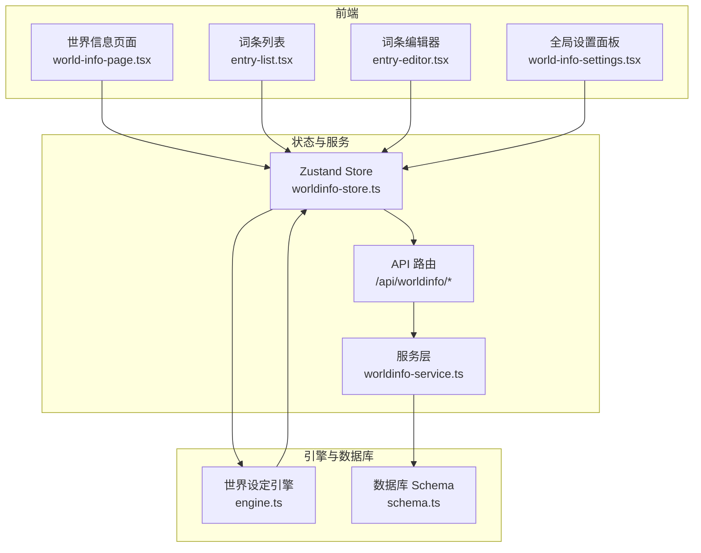
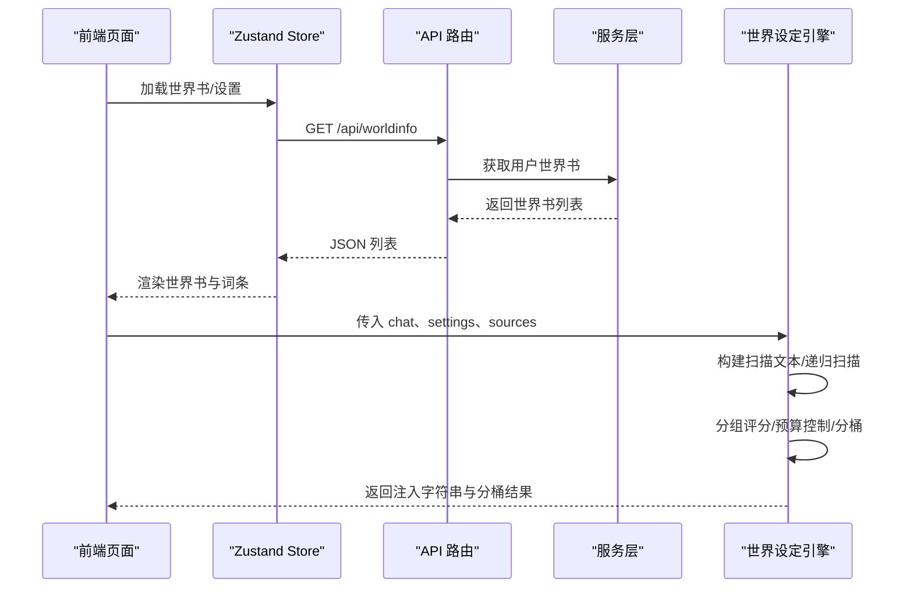
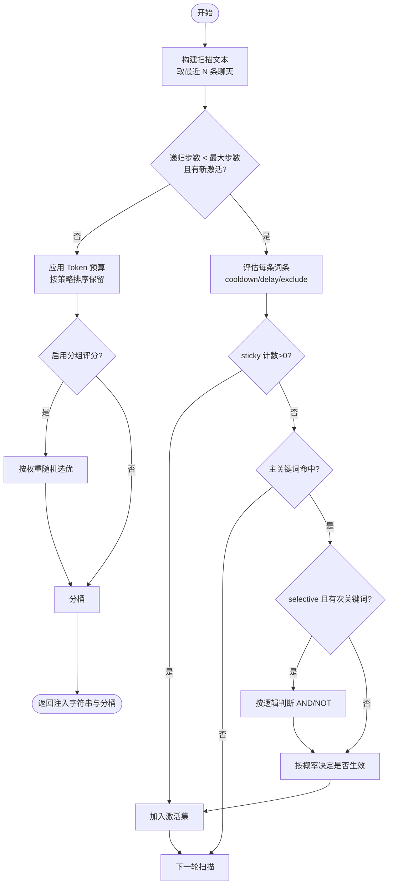
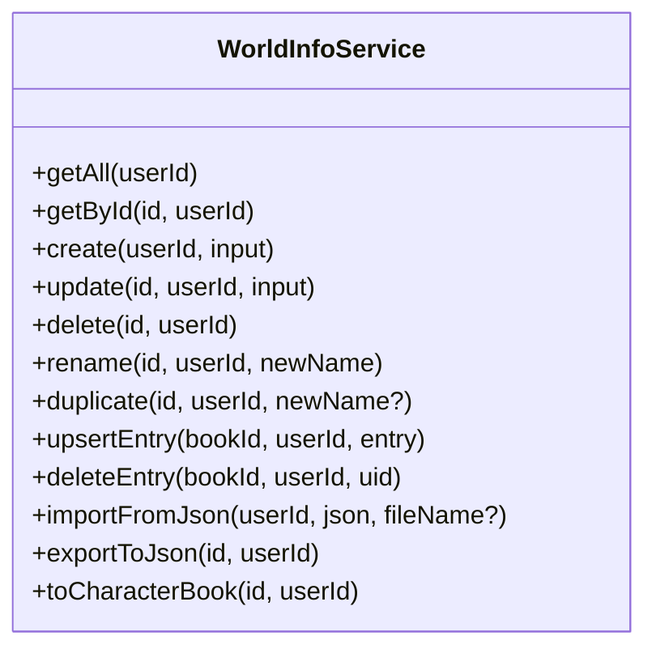
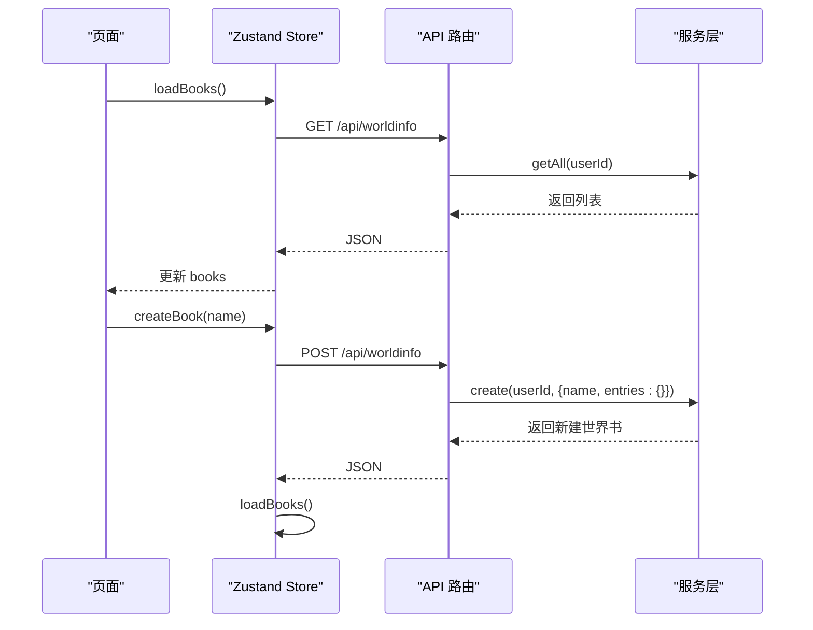
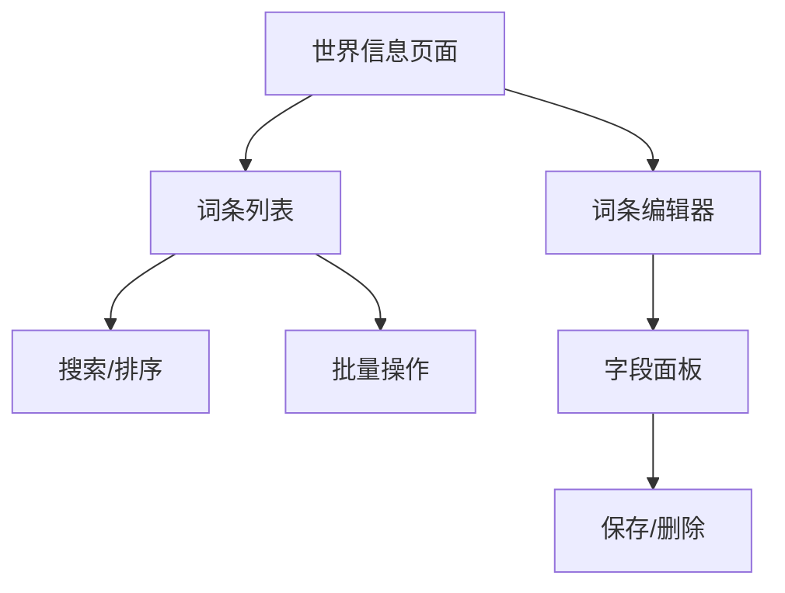
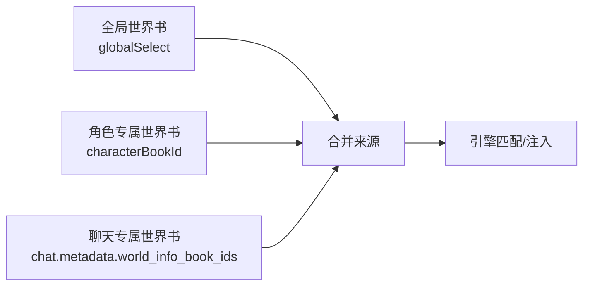
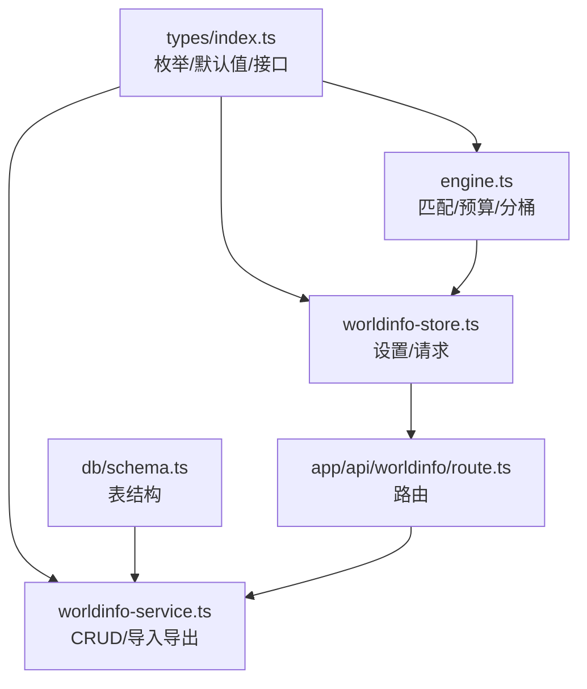

# 世界设定系统

<cite>
**本文档引用的文件**
- [src/lib/worldinfo/engine.ts](file://src/lib/worldinfo/engine.ts)
- [src/lib/services/worldinfo-service.ts](file://src/lib/services/worldinfo-service.ts)
- [src/stores/worldinfo-store.ts](file://src/stores/worldinfo-store.ts)
- [src/components/world-info/world-info-page.tsx](file://src/components/world-info/world-info-page.tsx)
- [src/components/world-info/entry-list.tsx](file://src/components/world-info/entry-list.tsx)
- [src/components/world-info/entry-editor.tsx](file://src/components/world-info/entry-editor.tsx)
- [src/components/world-info/world-info-settings.tsx](file://src/components/world-info/world-info-settings.tsx)
- [src/app/api/worldinfo/route.ts](file://src/app/api/worldinfo/route.ts)
- [src/lib/db/schema.ts](file://src/lib/db/schema.ts)
- [src/types/index.ts](file://src/types/index.ts)
- [src/components/chat/chat-area.tsx](file://src/components/chat/chat-area.tsx)
</cite>

## 目录
1. [简介](#简介)
2. [项目结构](#项目结构)
3. [核心组件](#核心组件)
4. [架构总览](#架构总览)
5. [详细组件分析](#详细组件分析)
6. [依赖分析](#依赖分析)
7. [性能考量](#性能考量)
8. [故障排查指南](#故障排查指南)
9. [结论](#结论)
10. [附录](#附录)

## 简介
本文件面向 SillyTavern Next 的“世界设定系统”，系统性阐述三层架构（全局/角色级/聊天级）与词条管理机制，详解深度扫描算法、词条匹配策略、插入预算控制、动态注入与上下文感知、智能匹配与分组评分、搜索过滤与分类管理、以及批量操作与最佳实践。目标是帮助开发者与运营者高效构建、维护与优化世界设定，提升提示词质量与生成稳定性。

## 项目结构
世界设定系统围绕“前端页面 + 状态存储 + 服务层 + 数据库 + 引擎计算”五层协作：
- 前端页面：世界书列表、词条编辑、全局设置面板
- 状态存储：Zustand Store 封装 CRUD、设置加载与保存
- 服务层：API 路由与业务服务，负责校验、导入导出、级联清理
- 数据库：Drizzle ORM Schema 定义世界书与角色/聊天元数据
- 引擎：核心匹配与注入逻辑，含递归扫描、预算控制、分桶输出

图表来源
- [src/components/world-info/world-info-page.tsx:18-201](file://src/components/world-info/world-info-page.tsx#L18-L201)
- [src/components/world-info/entry-list.tsx:10-104](file://src/components/world-info/entry-list.tsx#L10-L104)
- [src/components/world-info/entry-editor.tsx:16-323](file://src/components/world-info/entry-editor.tsx#L16-L323)
- [src/components/world-info/world-info-settings.tsx:11-115](file://src/components/world-info/world-info-settings.tsx#L11-L115)
- [src/stores/worldinfo-store.ts:43-256](file://src/stores/worldinfo-store.ts#L43-L256)
- [src/app/api/worldinfo/route.ts:1-23](file://src/app/api/worldinfo/route.ts#L1-L23)
- [src/lib/services/worldinfo-service.ts:97-300](file://src/lib/services/worldinfo-service.ts#L97-L300)
- [src/lib/db/schema.ts:170-180](file://src/lib/db/schema.ts#L170-L180)
- [src/lib/worldinfo/engine.ts:151-290](file://src/lib/worldinfo/engine.ts#L151-L290)

章节来源
- [src/components/world-info/world-info-page.tsx:18-201](file://src/components/world-info/world-info-page.tsx#L18-L201)
- [src/stores/worldinfo-store.ts:43-256](file://src/stores/worldinfo-store.ts#L43-L256)
- [src/app/api/worldinfo/route.ts:1-23](file://src/app/api/worldinfo/route.ts#L1-L23)
- [src/lib/services/worldinfo-service.ts:97-300](file://src/lib/services/worldinfo-service.ts#L97-L300)
- [src/lib/db/schema.ts:170-180](file://src/lib/db/schema.ts#L170-L180)
- [src/lib/worldinfo/engine.ts:151-290](file://src/lib/worldinfo/engine.ts#L151-L290)

## 核心组件
- 世界设定引擎：负责扫描、匹配、递归、预算与分桶输出
- 服务层：提供 CRUD、导入导出、级联清理、词条增删改查
- 状态存储：封装 API 请求、设置读写、全局选择切换
- 前端页面：世界书管理、词条列表与编辑、全局设置
- 数据库 Schema：定义世界书、角色、聊天元数据与设置表

章节来源
- [src/lib/worldinfo/engine.ts:1-424](file://src/lib/worldinfo/engine.ts#L1-L424)
- [src/lib/services/worldinfo-service.ts:97-300](file://src/lib/services/worldinfo-service.ts#L97-L300)
- [src/stores/worldinfo-store.ts:43-256](file://src/stores/worldinfo-store.ts#L43-L256)
- [src/components/world-info/world-info-page.tsx:18-201](file://src/components/world-info/world-info-page.tsx#L18-L201)
- [src/lib/db/schema.ts:170-180](file://src/lib/db/schema.ts#L170-L180)

## 架构总览
世界设定系统采用“三层注入 + 动态引擎”的架构：
- 三层来源：全局世界书（global）、角色专属（character）、聊天专属（chat）
- 注入位置：角色描述前/后、作者注前后、按深度插入、示例消息前后、Outlet 出口占位符
- 引擎处理：关键词匹配（支持正则/全词/大小写）、选择逻辑（AND/NOT）、概率触发、递归扫描、分组评分、Token 预算、粘性/冷却/延迟控制

图表来源
- [src/stores/worldinfo-store.ts:49-173](file://src/stores/worldinfo-store.ts#L49-L173)
- [src/app/api/worldinfo/route.ts:5-11](file://src/app/api/worldinfo/route.ts#L5-L11)
- [src/lib/services/worldinfo-service.ts:97-106](file://src/lib/services/worldinfo-service.ts#L97-L106)
- [src/lib/worldinfo/engine.ts:174-290](file://src/lib/worldinfo/engine.ts#L174-L290)

## 详细组件分析

### 世界设定引擎（匹配与注入）
- 关键词匹配：支持正则/全词/大小写开关；主关键词任意命中，次关键词按逻辑组合
- 递归扫描：可开启递归，防止递归爆炸与相互触发；支持 delayUntilRecursion、excludeRecursion、preventRecursion
- 分组评分：同组互斥，按权重随机选优；groupOverride 可强制优先
- 预算控制：按百分比预算与硬上限计算，支持三种插入策略（均摊/角色优先/全局优先）
- 分桶输出：按位置分桶（前/后/作者注/按深度/示例/出口），最终拼接为注入字符串

图表来源
- [src/lib/worldinfo/engine.ts:174-290](file://src/lib/worldinfo/engine.ts#L174-L290)
- [src/lib/worldinfo/engine.ts:292-342](file://src/lib/worldinfo/engine.ts#L292-L342)
- [src/lib/worldinfo/engine.ts:344-423](file://src/lib/worldinfo/engine.ts#L344-L423)

章节来源
- [src/lib/worldinfo/engine.ts:90-139](file://src/lib/worldinfo/engine.ts#L90-L139)
- [src/lib/worldinfo/engine.ts:174-290](file://src/lib/worldinfo/engine.ts#L174-L290)
- [src/lib/worldinfo/engine.ts:292-342](file://src/lib/worldinfo/engine.ts#L292-L342)
- [src/lib/worldinfo/engine.ts:344-423](file://src/lib/worldinfo/engine.ts#L344-L423)

### 服务层（CRUD、导入导出、级联清理）
- CRUD：创建/更新/删除/重命名/复制世界书；词条增删改查
- 导入导出：支持 lorebook JSON 与 V2 character_book 格式互转；导出时补齐 characterFilter 字段
- 级联清理：删除世界书时清空角色卡关联并从全局设置中剔除 ID

图表来源
- [src/lib/services/worldinfo-service.ts:97-300](file://src/lib/services/worldinfo-service.ts#L97-L300)

章节来源
- [src/lib/services/worldinfo-service.ts:97-300](file://src/lib/services/worldinfo-service.ts#L97-L300)

### 状态存储（Store）
- 世界书列表与当前编辑：加载、创建、删除、重命名、复制、导入导出
- 词条管理：新增/更新/删除，自动重新加载当前世界书
- 全局设置：加载/更新，写回 settings 表；支持全局选择（globalSelect）

图表来源
- [src/stores/worldinfo-store.ts:49-126](file://src/stores/worldinfo-store.ts#L49-L126)
- [src/app/api/worldinfo/route.ts:5-22](file://src/app/api/worldinfo/route.ts#L5-L22)
- [src/lib/services/worldinfo-service.ts:126-140](file://src/lib/services/worldinfo-service.ts#L126-L140)

章节来源
- [src/stores/worldinfo-store.ts:43-256](file://src/stores/worldinfo-store.ts#L43-L256)

### 前端页面与交互
- 世界信息页面：左侧世界书列表与全局设置，右侧词条编辑区
- 词条列表：搜索（标题/内容/关键词）、排序（Order/UID/Comment）、批量展开/折叠、刷新
- 词条编辑器：主/次关键词、选择逻辑、插入位置、顺序、概率、深度、角色、分组、扫描深度、粘性/冷却/延迟、大小写/全词/分组评分、递归控制、向量化、预算忽略、自动化 ID 等

图表来源
- [src/components/world-info/world-info-page.tsx:77-199](file://src/components/world-info/world-info-page.tsx#L77-L199)
- [src/components/world-info/entry-list.tsx:20-38](file://src/components/world-info/entry-list.tsx#L20-L38)
- [src/components/world-info/entry-editor.tsx:66-250](file://src/components/world-info/entry-editor.tsx#L66-L250)

章节来源
- [src/components/world-info/world-info-page.tsx:18-201](file://src/components/world-info/world-info-page.tsx#L18-L201)
- [src/components/world-info/entry-list.tsx:10-104](file://src/components/world-info/entry-list.tsx#L10-L104)
- [src/components/world-info/entry-editor.tsx:16-323](file://src/components/world-info/entry-editor.tsx#L16-L323)

### 三层架构与动态注入
- 全局：通过设置中的 globalSelect 选择生效的世界书
- 角色级：角色卡绑定 worldInfoBookId，注入角色专属词条
- 聊对话级：聊天元数据中 world_info_book_ids，优先级最高

图表来源
- [src/components/chat/chat-area.tsx:1203-1214](file://src/components/chat/chat-area.tsx#L1203-L1214)
- [src/lib/db/schema.ts:48-48](file://src/lib/db/schema.ts#L48-L48)
- [src/types/index.ts:265-267](file://src/types/index.ts#L265-L267)

章节来源
- [src/components/chat/chat-area.tsx:1203-1214](file://src/components/chat/chat-area.tsx#L1203-L1214)
- [src/lib/db/schema.ts:48-48](file://src/lib/db/schema.ts#L48-L48)
- [src/types/index.ts:265-267](file://src/types/index.ts#L265-L267)

### 搜索过滤、分类管理与批量操作
- 搜索：标题/内容/主关键词三路过滤
- 排序：按 Order/UID/Comment
- 分类：按插入位置分桶（前/后/作者注/按深度/示例/出口）
- 批量：全部展开/折叠、刷新、复制/导出/删除

章节来源
- [src/components/world-info/entry-list.tsx:20-38](file://src/components/world-info/entry-list.tsx#L20-L38)
- [src/components/world-info/entry-editor.tsx:56-61](file://src/components/world-info/entry-editor.tsx#L56-L61)
- [src/components/world-info/world-info-page.tsx:132-182](file://src/components/world-info/world-info-page.tsx#L132-L182)

## 依赖分析
- 类型与默认值：统一定义在 types/index.ts，包括位置枚举、逻辑枚举、插入策略、默认设置、词条默认值工厂
- 数据模型：Drizzle ORM Schema 定义 world_info、characters、chats、settings 等表
- 引擎依赖：使用 types 中的枚举与默认值，结合 settings 进行行为控制

图表来源
- [src/types/index.ts:325-507](file://src/types/index.ts#L325-L507)
- [src/lib/db/schema.ts:170-180](file://src/lib/db/schema.ts#L170-L180)
- [src/lib/worldinfo/engine.ts:151-290](file://src/lib/worldinfo/engine.ts#L151-L290)
- [src/stores/worldinfo-store.ts:43-256](file://src/stores/worldinfo-store.ts#L43-L256)
- [src/lib/services/worldinfo-service.ts:97-300](file://src/lib/services/worldinfo-service.ts#L97-L300)
- [src/app/api/worldinfo/route.ts:1-23](file://src/app/api/worldinfo/route.ts#L1-L23)

章节来源
- [src/types/index.ts:325-507](file://src/types/index.ts#L325-L507)
- [src/lib/db/schema.ts:170-180](file://src/lib/db/schema.ts#L170-L180)
- [src/lib/worldinfo/engine.ts:151-290](file://src/lib/worldinfo/engine.ts#L151-L290)
- [src/stores/worldinfo-store.ts:43-256](file://src/stores/worldinfo-store.ts#L43-L256)
- [src/lib/services/worldinfo-service.ts:97-300](file://src/lib/services/worldinfo-service.ts#L97-L300)
- [src/app/api/worldinfo/route.ts:1-23](file://src/app/api/worldinfo/route.ts#L1-L23)

## 性能考量
- 扫描深度（scanDepth）：越大召回越广但越耗 Token，建议 4-10
- 递归扫描：默认关闭，开启会显著增加计算与 Token 成本，建议谨慎使用
- 分组评分：启用后按权重随机选优，避免同组重复，提高多样性
- 预算控制：按百分比预算与硬上限双重限制，优先保留 Order 更高的词条
- 正则与全词匹配：正则较昂贵，全词匹配减少误命中，建议根据场景选择
- 粘性/冷却/延迟：合理设置可降低频繁触发与抖动

## 故障排查指南
- 无法加载世界书/词条：检查 Store 的 fetch 错误日志与 API 返回状态
- 词条未生效：确认是否被 cooldown/delayUntilRecursion/excludeRecursion 限制
- 预算超支：查看 budget 与 budget_cap 设置，调整 Order 或启用 ignoreBudget
- 递归异常：检查 max_recursion_steps 与 preventRecursion/excludeRecursion 配置
- 导入失败：确保 JSON 格式正确，支持 lorebook 与 V2 character_book 两种格式

章节来源
- [src/stores/worldinfo-store.ts:49-173](file://src/stores/worldinfo-store.ts#L49-L173)
- [src/lib/worldinfo/engine.ts:196-238](file://src/lib/worldinfo/engine.ts#L196-L238)
- [src/lib/worldinfo/engine.ts:292-342](file://src/lib/worldinfo/engine.ts#L292-L342)
- [src/lib/services/worldinfo-service.ts:230-282](file://src/lib/services/worldinfo-service.ts#L230-L282)

## 结论
SillyTavern Next 的世界设定系统通过三层来源与动态引擎实现高灵活性与强可控性的提示词注入。引擎在匹配、递归、分组评分与预算控制方面提供了完备能力，前端以直观的编辑器与设置面板支撑日常维护。遵循本文的最佳实践与性能建议，可在保证生成质量的同时，有效控制成本与复杂度。

## 附录

### 词条字段与策略速览
- 匹配策略：主关键词任意命中；次关键词按 AND/NOT 逻辑组合
- 插入位置：角色描述前/后、作者注前后、按深度插入、示例消息前后、Outlet 出口
- 预算与优先级：按策略排序，优先保留 Order 更高与全局/角色优先
- 递归与安全：delayUntilRecursion/excludeRecursion/preventRecursion 控制递归链
- 概率与随机：useProbability 控制概率生效，probability 设定触发概率

章节来源
- [src/lib/worldinfo/engine.ts:90-139](file://src/lib/worldinfo/engine.ts#L90-L139)
- [src/lib/worldinfo/engine.ts:292-342](file://src/lib/worldinfo/engine.ts#L292-L342)
- [src/components/world-info/entry-editor.tsx:104-250](file://src/components/world-info/entry-editor.tsx#L104-L250)