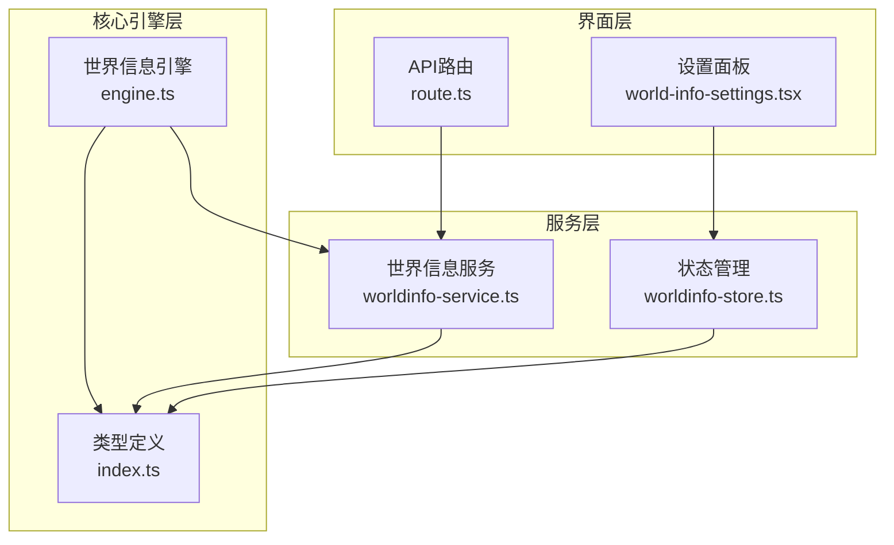
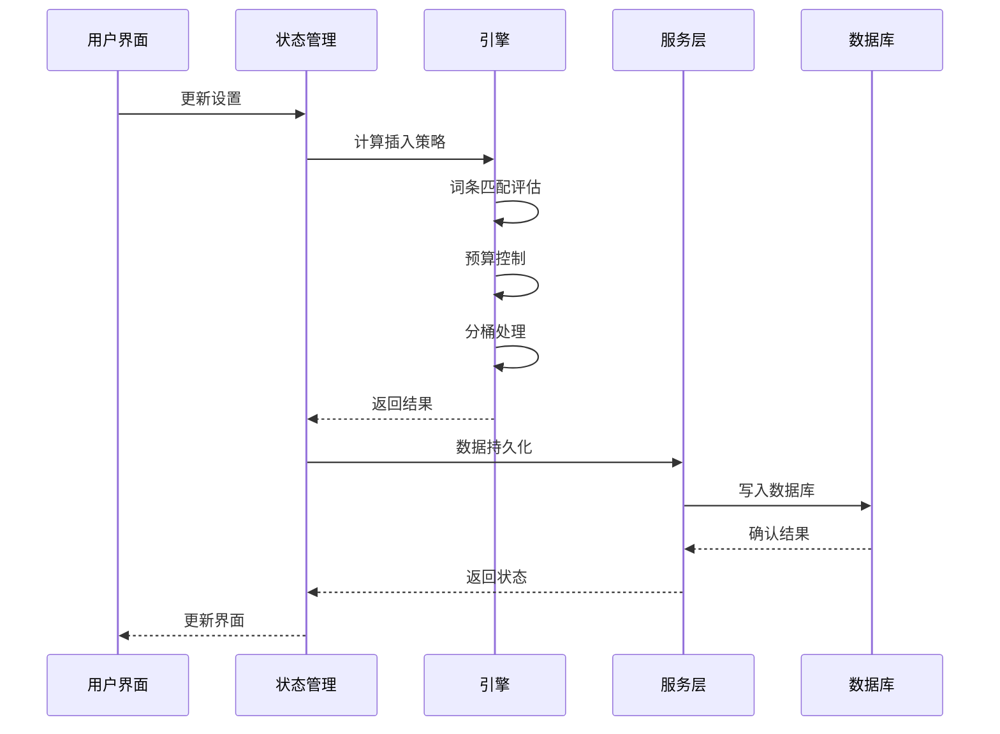
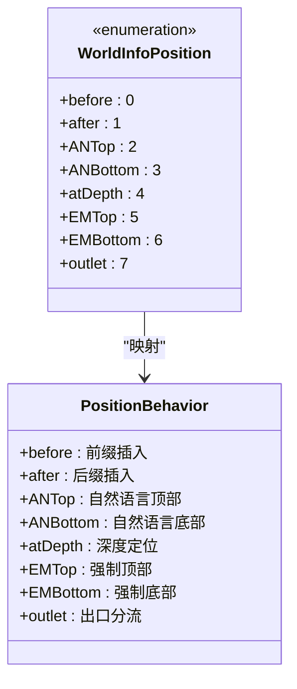
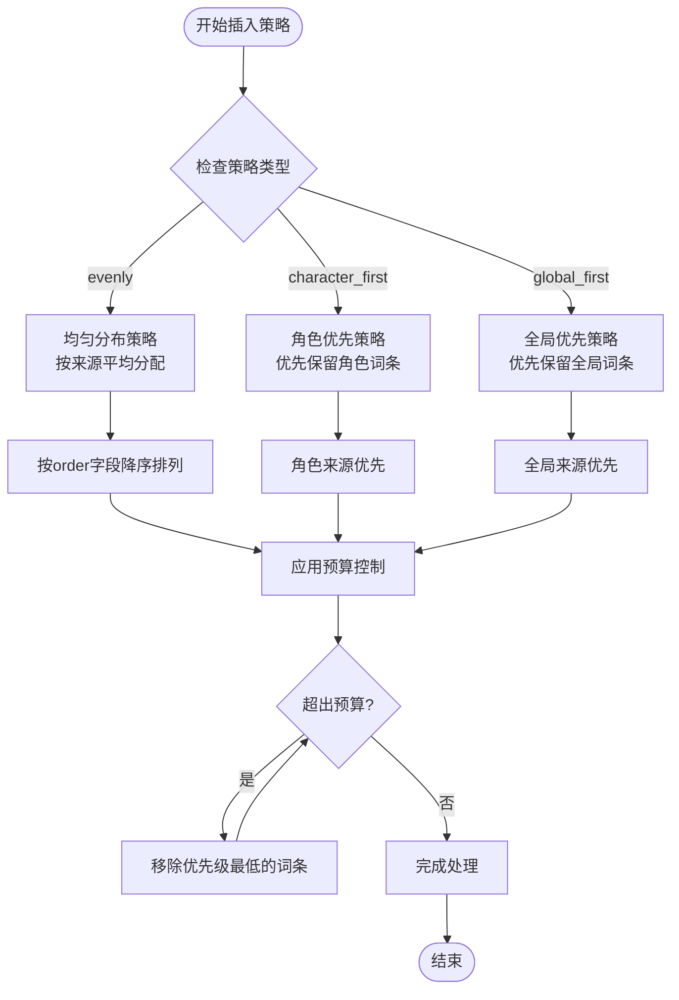
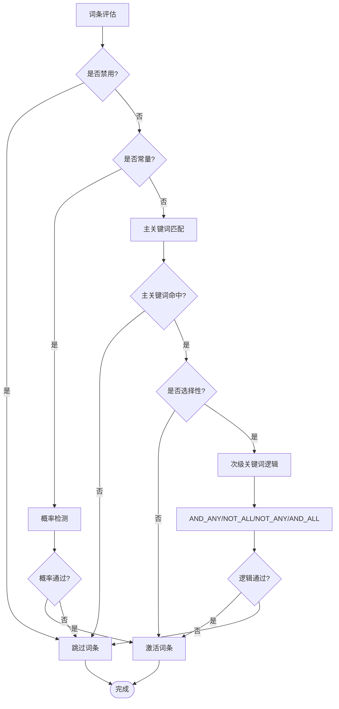
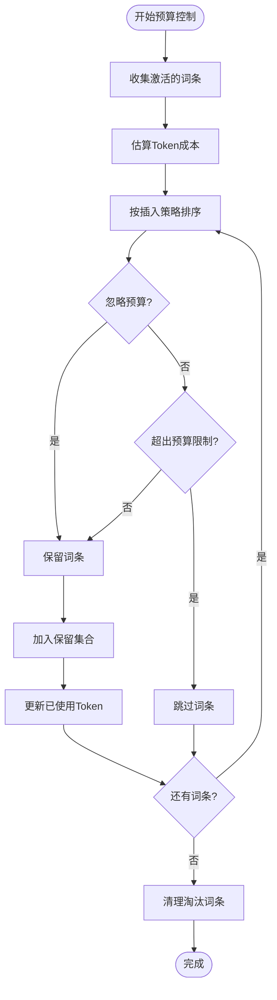
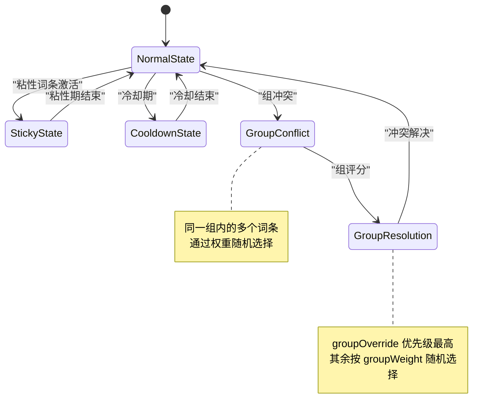
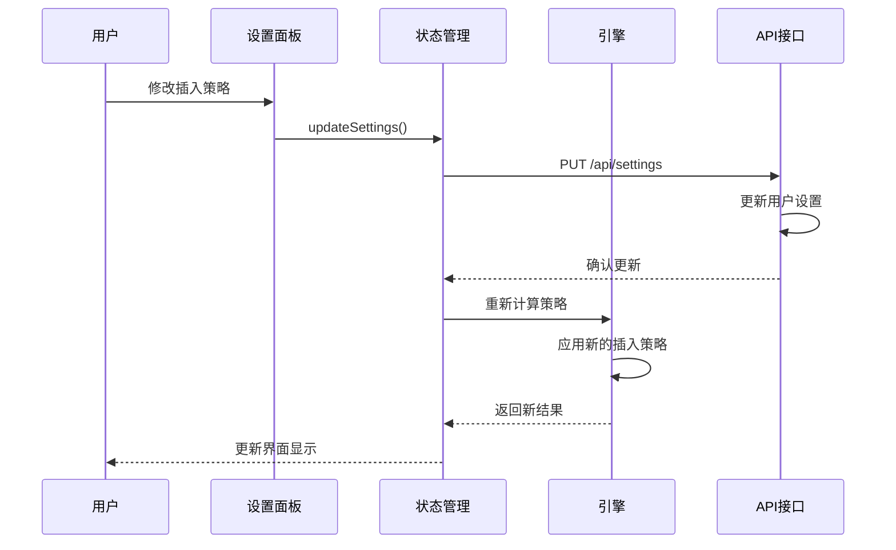
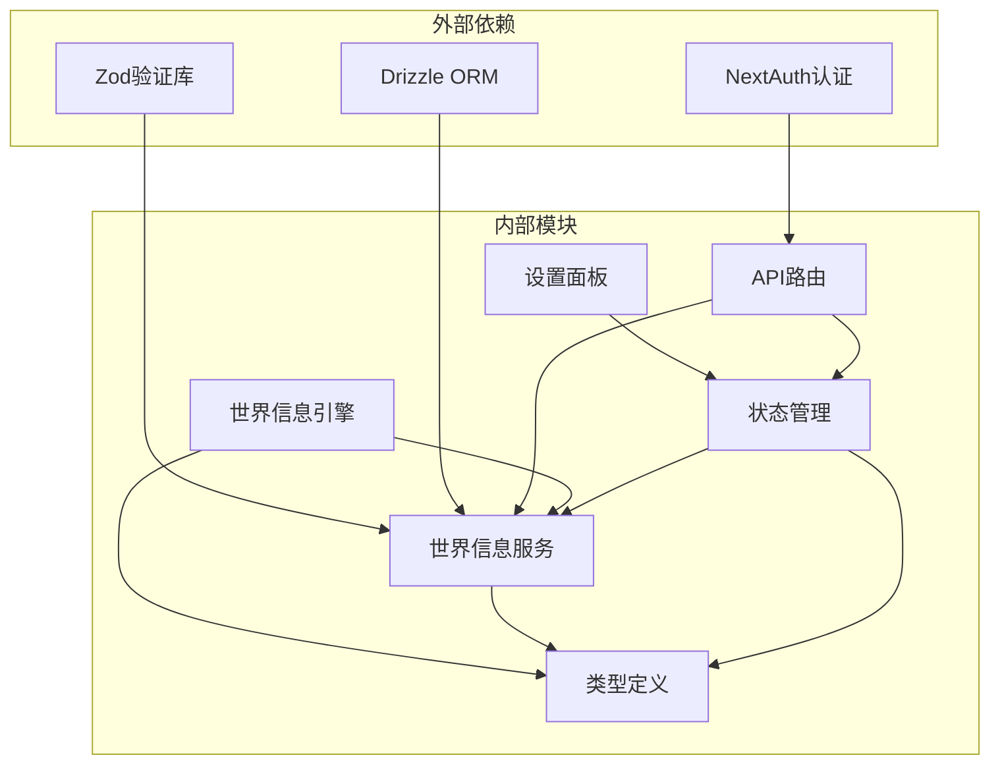

# 插入策略配置

<cite>
**本文档引用的文件**
- [engine.ts](file://src/lib/worldinfo/engine.ts)
- [worldinfo-service.ts](file://src/lib/services/worldinfo-service.ts)
- [index.ts](file://src/types/index.ts)
- [world-info-settings.tsx](file://src/components/world-info/world-info-settings.tsx)
- [worldinfo-store.ts](file://src/stores/worldinfo-store.ts)
- [route.ts](file://src/app/api/worldinfo/[id]/entries/route.ts)
- [route.ts](file://src/app/api/worldinfo/[id]/entries/[uid]/route.ts)
</cite>

## 目录
1. [简介](#简介)
2. [项目结构](#项目结构)
3. [核心组件](#核心组件)
4. [架构概览](#架构概览)
5. [详细组件分析](#详细组件分析)
6. [依赖关系分析](#依赖关系分析)
7. [性能考虑](#性能考虑)
8. [故障排除指南](#故障排除指南)
9. [结论](#结论)

## 简介

本文档详细介绍了世界设定（World Info/Lorebook）的插入策略配置系统。该系统提供了多种插入策略，包括前缀插入、后缀插入、条件插入和替换机制，支持复杂的上下文注入场景。系统通过智能的预算管理和冲突处理机制，确保在有限的上下文窗口内实现最优的信息注入效果。

## 项目结构

世界设定插入策略系统主要分布在以下模块中：

**图表来源**
- [engine.ts:1-424](file://src/lib/worldinfo/engine.ts#L1-L424)
- [worldinfo-service.ts:1-428](file://src/lib/services/worldinfo-service.ts#L1-L428)
- [index.ts:325-507](file://src/types/index.ts#L325-L507)

**章节来源**
- [engine.ts:1-424](file://src/lib/worldinfo/engine.ts#L1-L424)
- [worldinfo-service.ts:1-428](file://src/lib/services/worldinfo-service.ts#L1-L428)
- [index.ts:325-507](file://src/types/index.ts#L325-L507)

## 核心组件

### 世界信息引擎

世界信息引擎是整个系统的核心，负责处理词条匹配、递归扫描、预算控制和最终的插入策略执行。

**关键特性：**
- 多层递归扫描机制
- 智能预算管理系统
- 多种插入位置支持
- 条件概率触发机制

**章节来源**
- [engine.ts:174-290](file://src/lib/worldinfo/engine.ts#L174-L290)

### 类型定义系统

系统通过严格的类型定义确保数据的一致性和完整性：

**主要类型：**
- `WorldInfoEntry`: 词条数据结构
- `WorldInfoSettings`: 全局设置
- `WorldInfoPosition`: 插入位置枚举
- `WorldInfoLogic`: 关键词逻辑枚举
- `WorldInfoInsertionStrategy`: 插入策略枚举

**章节来源**
- [index.ts:325-462](file://src/types/index.ts#L325-L462)

### 服务层架构

服务层提供数据持久化和业务逻辑处理：

**核心功能：**
- 词条的增删改查操作
- 数据导入导出功能
- 角色卡格式转换
- 全局设置管理

**章节来源**
- [worldinfo-service.ts:97-300](file://src/lib/services/worldinfo-service.ts#L97-L300)

## 架构概览

世界设定插入策略系统采用分层架构设计，确保各层职责清晰分离：

**图表来源**
- [engine.ts:174-290](file://src/lib/worldinfo/engine.ts#L174-L290)
- [worldinfo-store.ts:232-247](file://src/stores/worldinfo-store.ts#L232-L247)

## 详细组件分析

### 插入位置控制系统

系统支持8种不同的插入位置，每种位置都有特定的用途和行为：

**图表来源**
- [index.ts:326-335](file://src/types/index.ts#L326-L335)

#### 前缀插入 (before)
- **用途**: 在角色对话之前插入背景信息
- **特点**: 优先级最高，适合重要的上下文设定
- **应用场景**: 世界规则、角色背景、重要事件

#### 后缀插入 (after)
- **用途**: 在角色对话之后插入补充信息
- **特点**: 适合补充性信息，不影响主要对话
- **应用场景**: 场景描述、环境变化、后续事件

#### 深度定位 (atDepth)
- **用途**: 按消息历史深度定位插入点
- **特点**: 结合角色类型进行精确控制
- **应用场景**: 特定历史时刻的重要信息

**章节来源**
- [engine.ts:344-392](file://src/lib/worldinfo/engine.ts#L344-L392)
- [index.ts:326-335](file://src/types/index.ts#L326-L335)

### 插入策略执行机制

系统提供三种主要的插入策略，用于控制词条的优先级和分布：

**图表来源**
- [engine.ts:292-342](file://src/lib/worldinfo/engine.ts#L292-L342)

#### 均匀分布策略 (evenly)
- **特点**: 不区分词条来源，按order字段统一排序
- **适用场景**: 平衡各种来源信息的重要性
- **优势**: 简单直观，避免偏袒任何单一来源

#### 角色优先策略 (character_first)
- **特点**: 优先保留角色相关的词条
- **适用场景**: 强调角色个性和背景信息
- **优势**: 确保角色相关信息的突出显示

#### 全局优先策略 (global_first)
- **特点**: 优先保留全局设定信息
- **适用场景**: 强调世界整体规则和背景
- **优势**: 保持世界设定的权威性

**章节来源**
- [engine.ts:292-319](file://src/lib/worldinfo/engine.ts#L292-L319)

### 条件插入机制

系统支持复杂的条件插入逻辑，通过关键词匹配和概率控制实现智能化的信息触发：

**图表来源**
- [engine.ts:91-131](file://src/lib/worldinfo/engine.ts#L91-L131)

#### 关键词逻辑类型

| 逻辑类型 | 描述 | 示例 |
|---------|------|------|
| AND_ANY | 主关键词命中且至少一个次级关键词命中 | "魔法 + (森林或城堡)" |
| NOT_ALL | 主关键词命中但不是所有次级关键词都命中 | "魔法 + 非(森林且城堡)" |
| NOT_ANY | 主关键词命中但没有次级关键词命中 | "魔法 + 非(森林或城堡)" |
| AND_ALL | 主关键词命中且所有次级关键词都命中 | "魔法 + (森林且城堡)" |

#### 概率控制机制

- **概率范围**: 0-100%
- **默认值**: 100%
- **作用机制**: 随机数检测，提高信息的随机性
- **适用场景**: 随机事件、概率性触发、多样化体验

**章节来源**
- [engine.ts:91-131](file://src/lib/worldinfo/engine.ts#L91-L131)
- [index.ts:339-344](file://src/types/index.ts#L339-L344)

### 预算管理与成本控制

系统实现了智能的预算管理机制，确保在有限的上下文窗口内实现最优的信息注入：

**图表来源**
- [engine.ts:292-342](file://src/lib/worldinfo/engine.ts#L292-L342)

#### 预算参数配置

| 参数名称 | 默认值 | 范围 | 描述 |
|---------|--------|------|------|
| world_info_budget | 25 | 0-100 | 预算百分比（占总上下文） |
| world_info_budget_cap | 0 | 0-∞ | 预算硬上限（Token） |
| world_info_max_recursion_steps | 0 | 0-100 | 最大递归步数 |

#### 成本估算算法

系统采用智能的成本估算算法：
- **中文字符**: 1字符 ≈ 1 Token
- **英文字符**: 1字符 ≈ 0.25 Token
- **整数/浮点数**: 1数字 ≈ 0.25 Token

**章节来源**
- [engine.ts:141-149](file://src/lib/worldinfo/engine.ts#L141-L149)
- [engine.ts:292-342](file://src/lib/worldinfo/engine.ts#L292-L342)

### 冲突处理与优先级机制

系统实现了多层次的冲突处理机制，确保词条之间的协调共存：

**图表来源**
- [engine.ts:240-269](file://src/lib/worldinfo/engine.ts#L240-L269)

#### 粘性机制 (Sticky)
- **作用**: 使词条在多轮对话中持续生效
- **配置**: `sticky` 字段，数值表示持续轮数
- **应用场景**: 重要但不频繁出现的信息

#### 冷却机制 (Cooldown)
- **作用**: 防止词条过于频繁地重复出现
- **配置**: `cooldown` 字段，数值表示冷却轮数
- **应用场景**: 需要间隔触发的事件

#### 组冲突解决
- **同组互斥**: 同一组内的词条只能保留一个
- **权重选择**: 按 `groupWeight` 比例随机选择
- **覆盖机制**: `groupOverride` 可强制保留特定词条

**章节来源**
- [engine.ts:240-269](file://src/lib/worldinfo/engine.ts#L240-L269)

### 自定义配置与模板化

系统提供了灵活的自定义配置选项和模板化功能：

#### 默认词条工厂函数

系统提供 `createDefaultWorldInfoEntry` 工厂函数，用于创建标准化的词条配置：

**默认配置示例：**
- **位置**: `before` (前缀插入)
- **优先级**: `100` (中等优先级)
- **概率**: `100` (总是触发)
- **选择性**: `true` (启用关键词逻辑)
- **递归**: `false` (不阻止递归)

#### 模板化设置

系统支持通过预设模板快速配置常见的插入策略：

**常见模板类型：**
- **角色专用模板**: 强调角色个性和背景
- **世界通用模板**: 保持世界设定的权威性
- **平衡模板**: 均衡各种信息的重要性

**章节来源**
- [index.ts:464-507](file://src/types/index.ts#L464-L507)

### 动态调整机制

系统支持运行时的动态调整，无需重启即可修改插入策略：

**图表来源**
- [worldinfo-store.ts:232-247](file://src/stores/worldinfo-store.ts#L232-L247)

## 依赖关系分析

系统各组件之间的依赖关系如下：

**图表来源**
- [worldinfo-service.ts:1-6](file://src/lib/services/worldinfo-service.ts#L1-L6)
- [engine.ts:13-21](file://src/lib/worldinfo/engine.ts#L13-L21)

**章节来源**
- [worldinfo-service.ts:1-6](file://src/lib/services/worldinfo-service.ts#L1-L6)
- [engine.ts:13-21](file://src/lib/worldinfo/engine.ts#L13-L21)

## 性能考虑

### 时间复杂度分析

- **词条匹配**: O(N × M)，其中 N 是词条数量，M 是关键词数量
- **递归扫描**: O(K × N)，其中 K 是递归深度，N 是词条数量
- **预算控制**: O(N log N)，主要由排序操作决定
- **分桶处理**: O(N)，线性时间复杂度

### 空间复杂度分析

- **激活词条存储**: O(A)，其中 A 是激活的词条数量
- **递归栈空间**: O(K)，其中 K 是递归深度
- **预算列表**: O(A)，存储激活词条的估算成本

### 优化建议

1. **索引优化**: 为常用查询字段建立数据库索引
2. **缓存策略**: 缓存热点词条的匹配结果
3. **批量处理**: 支持批量词条导入导出
4. **异步处理**: 将耗时操作异步化，避免阻塞主线程

## 故障排除指南

### 常见问题及解决方案

#### 问题1: 词条不触发
**可能原因：**
- 关键词匹配失败
- 概率检测未通过
- 处于冷却期
- 递归限制

**解决方案：**
- 检查关键词配置和大小写设置
- 调整概率值或禁用概率检测
- 检查冷却配置
- 调整递归深度限制

#### 问题2: 预算超限
**可能原因：**
- 预算百分比设置过低
- 词条内容过长
- 递归层数过多

**解决方案：**
- 增加 `world_info_budget` 或 `world_info_budget_cap`
- 优化词条内容长度
- 调整递归深度限制

#### 问题3: 插入顺序不符合预期
**可能原因：**
- `order` 字段配置错误
- 插入策略选择不当
- 组冲突导致的选择

**解决方案：**
- 调整 `order` 字段值
- 更换插入策略
- 检查组配置和权重

**章节来源**
- [engine.ts:292-342](file://src/lib/worldinfo/engine.ts#L292-L342)
- [worldinfo-service.ts:205-228](file://src/lib/services/worldinfo-service.ts#L205-L228)

## 结论

世界设定插入策略配置系统提供了强大而灵活的信息注入能力。通过多层次的插入位置、智能的预算管理和冲突处理机制，系统能够在有限的上下文窗口内实现最优的信息展示效果。

**核心优势：**
- **灵活性**: 支持多种插入策略和位置配置
- **智能性**: 自动化的预算控制和冲突处理
- **可扩展性**: 模块化设计便于功能扩展
- **易用性**: 直观的配置界面和丰富的模板

**最佳实践建议：**
1. 根据应用场景选择合适的插入策略
2. 合理设置预算参数，避免上下文溢出
3. 利用组机制管理相关词条
4. 定期优化词条内容，提高信息质量
5. 监控系统性能，及时调整配置参数

通过合理配置和使用，该系统能够显著提升AI对话的质量和一致性，为用户提供更好的交互体验。