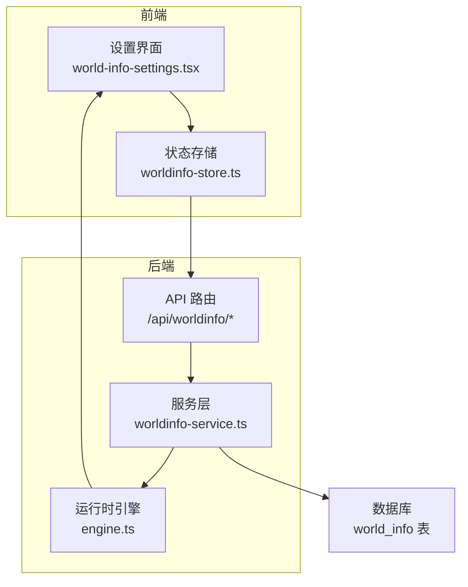
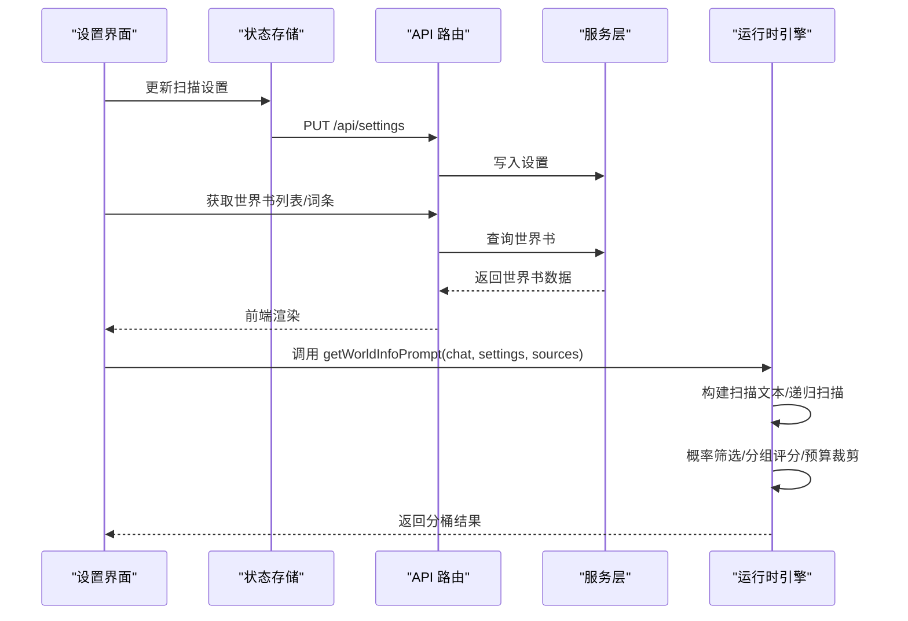
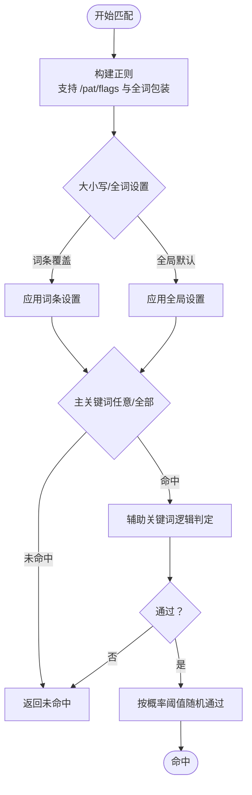
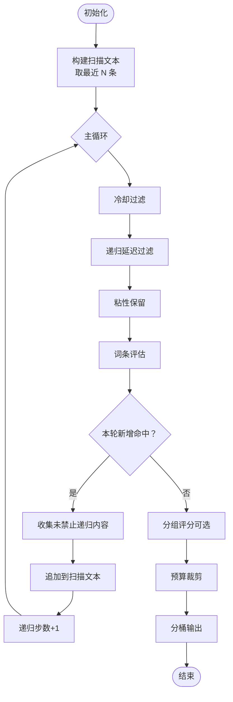
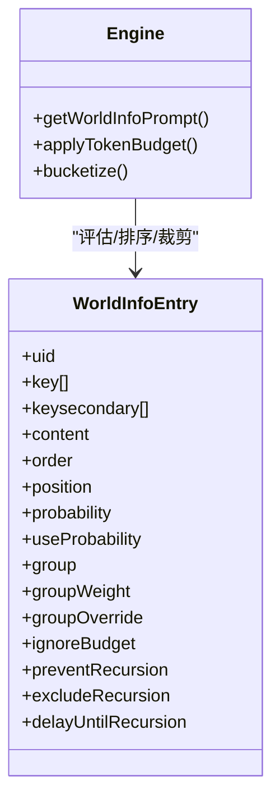
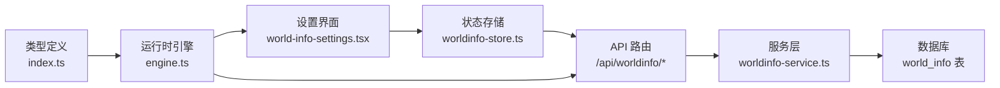

# 深度扫描算法

<cite>
**本文引用的文件**
- [src/lib/worldinfo/engine.ts](file://src/lib/worldinfo/engine.ts)
- [src/types/index.ts](file://src/types/index.ts)
- [src/components/world-info/world-info-settings.tsx](file://src/components/world-info/world-info-settings.tsx)
- [src/stores/worldinfo-store.ts](file://src/stores/worldinfo-store.ts)
- [src/app/api/worldinfo/route.ts](file://src/app/api/worldinfo/route.ts)
- [src/app/api/worldinfo/[id]/entries/route.ts](file://src/app/api/worldinfo/[id]/entries/route.ts)
- [src/lib/services/worldinfo-service.ts](file://src/lib/services/worldinfo-service.ts)
</cite>

## 目录
1. [简介](#简介)
2. [项目结构](#项目结构)
3. [核心组件](#核心组件)
4. [架构总览](#架构总览)
5. [详细组件分析](#详细组件分析)
6. [依赖关系分析](#依赖关系分析)
7. [性能考量](#性能考量)
8. [故障排查指南](#故障排查指南)
9. [结论](#结论)
10. [附录](#附录)

## 简介
本文件系统性阐述“世界设定”的深度扫描算法，覆盖词条匹配核心算法、扫描策略、预算与超时控制、内存管理、结果排序与冲突解决、去重策略，以及调优与监控方法。目标是帮助开发者与运营人员理解并高效配置世界书扫描行为，确保在有限上下文预算内稳定产出高质量提示。

## 项目结构
世界信息扫描算法位于运行时引擎模块，配合类型定义、设置界面、状态存储与API服务共同构成完整闭环。关键文件与职责如下：
- 运行时引擎：负责扫描、匹配、递归、预算与分桶输出
- 类型定义：统一词条、设置、枚举与默认值
- 设置界面：可视化配置扫描参数
- 状态存储：持久化用户设置与全局选择
- API服务：提供世界书的增删改查与词条操作
- 数据模型：数据库表结构支撑词条持久化

图表来源
- [src/components/world-info/world-info-settings.tsx:12-143](file://src/components/world-info/world-info-settings.tsx#L12-L143)
- [src/stores/worldinfo-store.ts:43-256](file://src/stores/worldinfo-store.ts#L43-L256)
- [src/app/api/worldinfo/route.ts:1-23](file://src/app/api/worldinfo/route.ts#L1-L23)
- [src/app/api/worldinfo/[id]/entries/route.ts](file://src/app/api/worldinfo/[id]/entries/route.ts#L1-L18)
- [src/lib/services/worldinfo-service.ts:97-152](file://src/lib/services/worldinfo-service.ts#L97-L152)
- [src/lib/worldinfo/engine.ts:174-290](file://src/lib/worldinfo/engine.ts#L174-L290)

章节来源
- [src/lib/worldinfo/engine.ts:13-462](file://src/lib/worldinfo/engine.ts#L13-L462)
- [src/types/index.ts:325-462](file://src/types/index.ts#L325-L462)
- [src/components/world-info/world-info-settings.tsx:12-143](file://src/components/world-info/world-info-settings.tsx#L12-L143)
- [src/stores/worldinfo-store.ts:43-256](file://src/stores/worldinfo-store.ts#L43-L256)
- [src/app/api/worldinfo/route.ts:1-23](file://src/app/api/worldinfo/route.ts#L1-L23)
- [src/app/api/worldinfo/[id]/entries/route.ts](file://src/app/api/worldinfo/[id]/entries/route.ts#L1-L18)
- [src/lib/services/worldinfo-service.ts:97-152](file://src/lib/services/worldinfo-service.ts#L97-L152)

## 核心组件
- 词条与设置类型：定义词条字段、位置、逻辑、默认值与全局设置项
- 运行时引擎：主流程包括收集词条、构建扫描文本、逐轮扫描与递归、概率筛选、分组评分、预算裁剪、状态衰减与分桶输出
- 设置界面与状态存储：提供扫描深度、预算、递归步数、大小写/全词匹配、分组评分、插入策略等参数的可视化与持久化
- API与服务：提供世界书与词条的增删改查接口，支撑前端交互

章节来源
- [src/lib/worldinfo/engine.ts:174-290](file://src/lib/worldinfo/engine.ts#L174-L290)
- [src/types/index.ts:325-462](file://src/types/index.ts#L325-L462)
- [src/components/world-info/world-info-settings.tsx:28-143](file://src/components/world-info/world-info-settings.tsx#L28-L143)
- [src/stores/worldinfo-store.ts:220-247](file://src/stores/worldinfo-store.ts#L220-L247)
- [src/lib/services/worldinfo-service.ts:97-152](file://src/lib/services/worldinfo-service.ts#L97-L152)

## 架构总览
从输入到输出的关键流程：
- 输入：聊天历史片段、全局/角色/聊天级世界书词条、运行时设置
- 处理：逐轮扫描、递归扩展、概率筛选、分组评分、预算裁剪
- 输出：按位置分桶的提示文本与命中快照

图表来源
- [src/components/world-info/world-info-settings.tsx:28-143](file://src/components/world-info/world-info-settings.tsx#L28-L143)
- [src/stores/worldinfo-store.ts:220-247](file://src/stores/worldinfo-store.ts#L220-L247)
- [src/app/api/worldinfo/route.ts:1-23](file://src/app/api/worldinfo/route.ts#L1-L23)
- [src/lib/services/worldinfo-service.ts:97-152](file://src/lib/services/worldinfo-service.ts#L97-L152)
- [src/lib/worldinfo/engine.ts:174-290](file://src/lib/worldinfo/engine.ts#L174-L290)

## 详细组件分析

### 词条匹配核心算法
- 关键词匹配
  - 支持普通字符串与正则两种形式，正则采用包裹语法以识别标志位
  - 可按词条或全局设置控制大小写与全词匹配
  - 主关键词任意命中即触发，辅助关键词按逻辑组合判定
- 正则表达式匹配
  - 支持 /pattern/flags 包裹语法，异常模式返回空
  - 全词匹配通过词边界包装实现
- 语义相似度匹配
  - 本仓库未实现基于向量的语义相似度匹配，词条字段包含向量化标记位，供未来扩展预留

图表来源
- [src/lib/worldinfo/engine.ts:53-88](file://src/lib/worldinfo/engine.ts#L53-L88)
- [src/lib/worldinfo/engine.ts:91-131](file://src/lib/worldinfo/engine.ts#L91-L131)

章节来源
- [src/lib/worldinfo/engine.ts:53-131](file://src/lib/worldinfo/engine.ts#L53-L131)

### 扫描策略与递归
- 初始扫描文本：按扫描深度截取最新N条聊天记录拼接
- 递归扫描：当词条内容未禁止递归时，将其加入扫描文本继续触发其他词条
- 递归控制：最大步数限制、延迟递归层数、排除递归标记
- 状态持久化：跨轮次保留粘性与冷却状态，支持跨对话延续

图表来源
- [src/lib/worldinfo/engine.ts:174-290](file://src/lib/worldinfo/engine.ts#L174-L290)
- [src/lib/worldinfo/engine.ts:240-269](file://src/lib/worldinfo/engine.ts#L240-L269)
- [src/lib/worldinfo/engine.ts:292-342](file://src/lib/worldinfo/engine.ts#L292-L342)

章节来源
- [src/lib/worldinfo/engine.ts:174-290](file://src/lib/worldinfo/engine.ts#L174-L290)

### 预算控制、超时与内存管理
- 预算控制
  - 百分比预算：占上下文比例上限，近似按固定换算估算
  - 硬上限：token 硬上限，二者取更严格者
  - 插入策略：角色优先/全局优先/均匀交错，再按 order 降序
  - 忽略预算：特殊词条可无条件保留
- 超时处理
  - 递归步数上限防止无限环
  - 未新增命中时提前终止
- 内存管理
  - 使用 Map 存储已激活词条，便于快速去重与删除
  - 估算 token 时按字符类型分摊，避免复杂分词开销

章节来源
- [src/lib/worldinfo/engine.ts:292-342](file://src/lib/worldinfo/engine.ts#L292-L342)
- [src/lib/worldinfo/engine.ts:141-149](file://src/lib/worldinfo/engine.ts#L141-L149)
- [src/components/world-info/world-info-settings.tsx:69-76](file://src/components/world-info/world-info-settings.tsx#L69-L76)

### 结果排序、冲突解决与去重
- 分组评分：同组内按权重随机择优，groupOverride 优先
- 插入顺序：按来源策略与 order 字段排序
- 去重策略：Map 键为 source:uid，避免重复激活
- 分桶输出：按位置枚举将词条分发至不同桶，并按 order 降序

图表来源
- [src/lib/worldinfo/engine.ts:240-269](file://src/lib/worldinfo/engine.ts#L240-L269)
- [src/lib/worldinfo/engine.ts:292-342](file://src/lib/worldinfo/engine.ts#L292-L342)
- [src/lib/worldinfo/engine.ts:344-423](file://src/lib/worldinfo/engine.ts#L344-L423)
- [src/types/index.ts:368-416](file://src/types/index.ts#L368-L416)

章节来源
- [src/lib/worldinfo/engine.ts:240-269](file://src/lib/worldinfo/engine.ts#L240-L269)
- [src/lib/worldinfo/engine.ts:344-423](file://src/lib/worldinfo/engine.ts#L344-L423)

### 设置与集成点
- 全局设置项：扫描深度、最少激活、Token 预算、预算硬限、最大递归步数、递归开关、大小写/全词匹配、分组评分、插入策略、包含角色名、溢出告警
- 前端设置面板与状态存储联动，通过 API 写回设置
- 世界书与词条的 CRUD 由服务层与路由提供

章节来源
- [src/components/world-info/world-info-settings.tsx:28-143](file://src/components/world-info/world-info-settings.tsx#L28-L143)
- [src/stores/worldinfo-store.ts:220-247](file://src/stores/worldinfo-store.ts#L220-L247)
- [src/app/api/worldinfo/route.ts:1-23](file://src/app/api/worldinfo/route.ts#L1-L23)
- [src/app/api/worldinfo/[id]/entries/route.ts](file://src/app/api/worldinfo/[id]/entries/route.ts#L1-L18)
- [src/lib/services/worldinfo-service.ts:97-152](file://src/lib/services/worldinfo-service.ts#L97-L152)

## 依赖关系分析
- 引擎依赖类型定义与默认设置
- 设置界面依赖类型枚举与状态存储
- API 路由依赖认证与服务层
- 服务层依赖数据库访问与校验器

图表来源
- [src/types/index.ts:325-462](file://src/types/index.ts#L325-L462)
- [src/lib/worldinfo/engine.ts:174-290](file://src/lib/worldinfo/engine.ts#L174-L290)
- [src/components/world-info/world-info-settings.tsx:12-143](file://src/components/world-info/world-info-settings.tsx#L12-L143)
- [src/stores/worldinfo-store.ts:43-256](file://src/stores/worldinfo-store.ts#L43-L256)
- [src/app/api/worldinfo/route.ts:1-23](file://src/app/api/worldinfo/route.ts#L1-L23)
- [src/lib/services/worldinfo-service.ts:97-152](file://src/lib/services/worldinfo-service.ts#L97-L152)

章节来源
- [src/types/index.ts:325-462](file://src/types/index.ts#L325-L462)
- [src/lib/worldinfo/engine.ts:174-290](file://src/lib/worldinfo/engine.ts#L174-L290)
- [src/components/world-info/world-info-settings.tsx:12-143](file://src/components/world-info/world-info-settings.tsx#L12-L143)
- [src/stores/worldinfo-store.ts:43-256](file://src/stores/worldinfo-store.ts#L43-L256)
- [src/app/api/worldinfo/route.ts:1-23](file://src/app/api/worldinfo/route.ts#L1-L23)
- [src/lib/services/worldinfo-service.ts:97-152](file://src/lib/services/worldinfo-service.ts#L97-L152)

## 性能考量
- 时间复杂度
  - 逐词条匹配：O(T × K)，T 为词条数，K 为关键词数
  - 递归扫描：每轮新增命中可能扩大扫描文本，最坏 O(T² × K)
  - 预算裁剪：排序 O(T log T)，线性遍历保留 O(T)
- 空间复杂度
  - Map 存储激活词条，空间 O(T)
  - 估算 token 开销与字符串拼接，整体 O(T + C)，C 为上下文长度
- 优化建议
  - 合理设置扫描深度与预算，避免过度扫描
  - 使用“最少激活”与“忽略预算”精准控制关键长内容
  - 关闭不必要的递归或限制最大递归步数
  - 将高频命中词条置高 order 并合理分组，减少冲突

## 故障排查指南
- 命中过少
  - 检查扫描深度与“最少激活”设置
  - 确认大小写/全词匹配是否过于严格
  - 调整概率阈值或关闭概率筛选
- 预算溢出
  - 降低预算百分比或设置预算硬上限
  - 对长内容词条勾选“忽略预算”
  - 启用“溢出告警”观察被丢弃的词条
- 递归异常
  - 检查最大递归步数与“排除递归/禁止递归”标记
  - 确认是否存在相互触发导致的环路
- 状态异常
  - 检查粘性与冷却轮次是否正确衰减
  - 确认跨轮次状态是否持久化到会话元数据

章节来源
- [src/components/world-info/world-info-settings.tsx:38-76](file://src/components/world-info/world-info-settings.tsx#L38-L76)
- [src/lib/worldinfo/engine.ts:274-286](file://src/lib/worldinfo/engine.ts#L274-L286)

## 结论
本深度扫描算法以“关键词匹配 + 概率筛选 + 递归扩展 + 预算裁剪 + 分组评分 + 分桶输出”为核心闭环，兼顾灵活性与可控性。通过合理的参数配置与监控手段，可在有限上下文预算内稳定产出高质量提示，满足多场景下的世界书注入需求。

## 附录
- 关键词逻辑枚举与位置枚举定义见类型文件
- 默认设置与词条工厂函数见类型文件
- API 路由与服务层提供完整的 CRUD 能力

章节来源
- [src/types/index.ts:325-507](file://src/types/index.ts#L325-L507)
- [src/app/api/worldinfo/route.ts:1-23](file://src/app/api/worldinfo/route.ts#L1-L23)
- [src/app/api/worldinfo/[id]/entries/route.ts](file://src/app/api/worldinfo/[id]/entries/route.ts#L1-L18)
- [src/lib/services/worldinfo-service.ts:97-152](file://src/lib/services/worldinfo-service.ts#L97-L152)