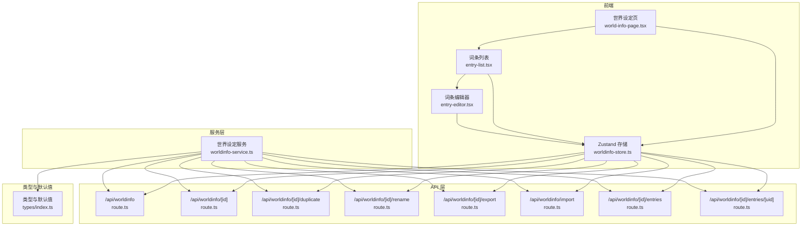
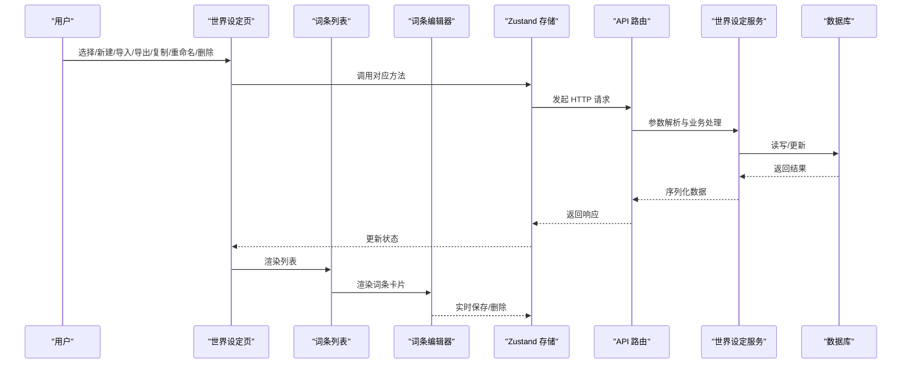
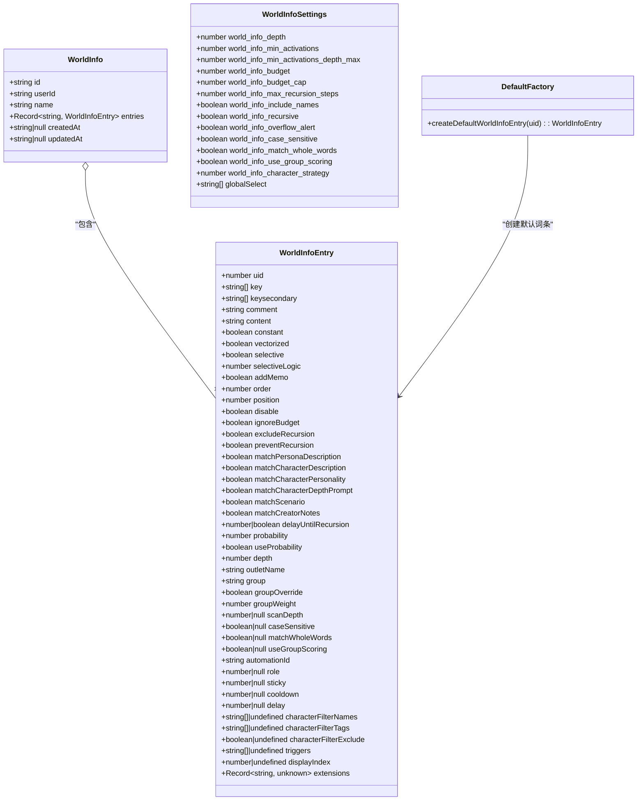
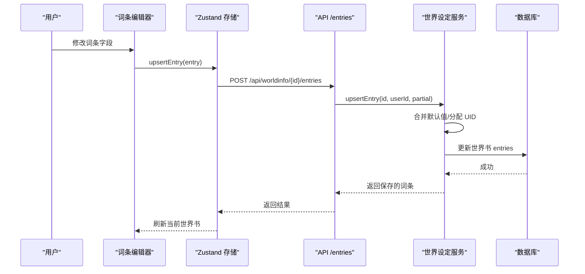
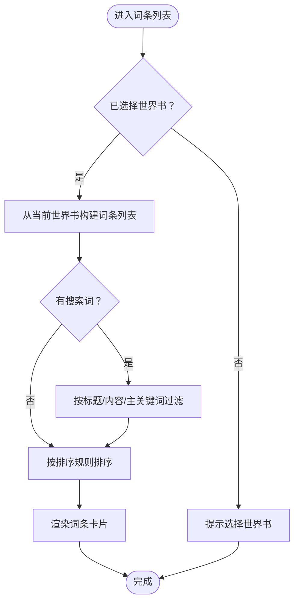
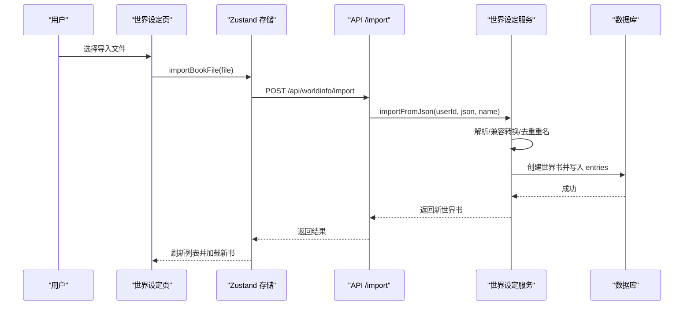
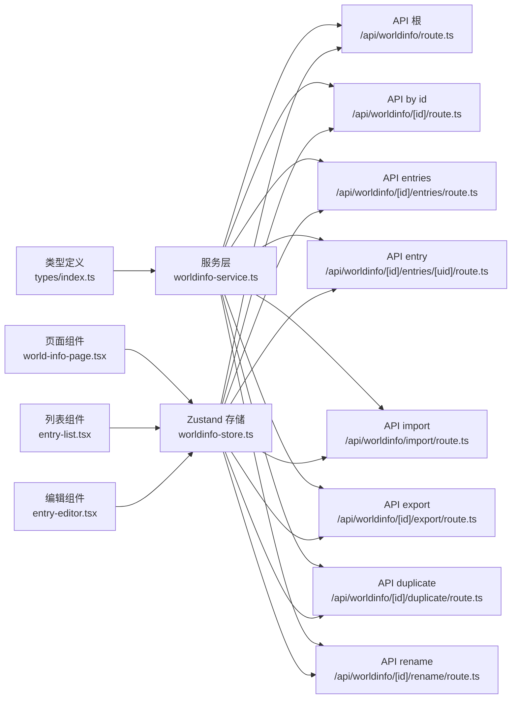

# 词条管理机制

<cite>
**本文档引用的文件**
- [src/stores/worldinfo-store.ts](file://src/stores/worldinfo-store.ts)
- [src/components/world-info/entry-editor.tsx](file://src/components/world-info/entry-editor.tsx)
- [src/components/world-info/entry-list.tsx](file://src/components/world-info/entry-list.tsx)
- [src/components/world-info/world-info-page.tsx](file://src/components/world-info/world-info-page.tsx)
- [src/lib/services/worldinfo-service.ts](file://src/lib/services/worldinfo-service.ts)
- [src/types/index.ts](file://src/types/index.ts)
- [src/app/api/worldinfo/route.ts](file://src/app/api/worldinfo/route.ts)
- [src/app/api/worldinfo/[id]/route.ts](file://src/app/api/worldinfo/[id]/route.ts)
- [src/app/api/worldinfo/import/route.ts](file://src/app/api/worldinfo/import/route.ts)
- [src/app/api/worldinfo/[id]/entries/route.ts](file://src/app/api/worldinfo/[id]/entries/route.ts)
- [src/app/api/worldinfo/[id]/duplicate/route.ts](file://src/app/api/worldinfo/[id]/duplicate/route.ts)
- [src/app/api/worldinfo/[id]/export/route.ts](file://src/app/api/worldinfo/[id]/export/route.ts)
- [src/app/api/worldinfo/[id]/rename/route.ts](file://src/app/api/worldinfo/[id]/rename/route.ts)
- [src/app/api/worldinfo/[id]/entries/[uid]/route.ts](file://src/app/api/worldinfo/[id]/entries/[uid]/route.ts)
</cite>

## 目录
1. [简介](#简介)
2. [项目结构](#项目结构)
3. [核心组件](#核心组件)
4. [架构总览](#架构总览)
5. [详细组件分析](#详细组件分析)
6. [依赖分析](#依赖分析)
7. [性能考量](#性能考量)
8. [故障排查指南](#故障排查指南)
9. [结论](#结论)
10. [附录](#附录)

## 简介
本文件系统性阐述“世界设定”的词条管理机制，涵盖词条数据结构、字段定义与验证规则，词条的创建、编辑、删除与复制操作，词条分类与标签管理、搜索与过滤，以及导入导出、批量操作与数据迁移。同时提供用户体验设计建议与最佳实践，帮助开发者与运营者高效构建与维护高质量的世界设定体系。

## 项目结构
世界设定相关模块采用“页面组件 + 状态存储 + 服务层 + API 路由 + 类型定义”的分层组织方式：
- 页面与交互：世界设定页、词条列表、词条编辑器
- 状态管理：Zustand 存储，封装 CRUD 与设置同步
- 业务服务：世界设定服务，负责校验、持久化、导入导出与兼容转换
- API 层：REST 风格路由，统一鉴权与输入校验
- 类型与默认值：集中定义词条与世界书结构、枚举、默认值与工厂函数

图表来源
- [src/components/world-info/world-info-page.tsx:1-202](file://src/components/world-info/world-info-page.tsx#L1-L202)
- [src/components/world-info/entry-list.tsx:1-105](file://src/components/world-info/entry-list.tsx#L1-L105)
- [src/components/world-info/entry-editor.tsx:1-323](file://src/components/world-info/entry-editor.tsx#L1-L323)
- [src/stores/worldinfo-store.ts:1-257](file://src/stores/worldinfo-store.ts#L1-L257)
- [src/lib/services/worldinfo-service.ts:1-428](file://src/lib/services/worldinfo-service.ts#L1-L428)
- [src/app/api/worldinfo/route.ts:1-23](file://src/app/api/worldinfo/route.ts#L1-L23)
- [src/app/api/worldinfo/[id]/route.ts:1-39](file://src/app/api/worldinfo/[id]/route.ts#L1-L39)
- [src/app/api/worldinfo/import/route.ts:1-41](file://src/app/api/worldinfo/import/route.ts#L1-L41)
- [src/app/api/worldinfo/[id]/entries/route.ts:1-41](file://src/app/api/worldinfo/[id]/entries/route.ts#L1-L41)
- [src/app/api/worldinfo/[id]/duplicate/route.ts:1-27](file://src/app/api/worldinfo/[id]/duplicate/route.ts#L1-L27)
- [src/app/api/worldinfo/[id]/export/route.ts:1-24](file://src/app/api/worldinfo/[id]/export/route.ts#L1-L24)
- [src/app/api/worldinfo/[id]/rename/route.ts:1-22](file://src/app/api/worldinfo/[id]/rename/route.ts#L1-L22)
- [src/app/api/worldinfo/[id]/entries/[uid]/route.ts:1-27](file://src/app/api/worldinfo/[id]/entries/[uid]/route.ts#L1-L27)
- [src/types/index.ts:320-533](file://src/types/index.ts#L320-L533)

章节来源
- [src/components/world-info/world-info-page.tsx:1-202](file://src/components/world-info/world-info-page.tsx#L1-L202)
- [src/stores/worldinfo-store.ts:1-257](file://src/stores/worldinfo-store.ts#L1-L257)
- [src/lib/services/worldinfo-service.ts:1-428](file://src/lib/services/worldinfo-service.ts#L1-L428)
- [src/types/index.ts:320-533](file://src/types/index.ts#L320-L533)

## 核心组件
- 世界设定页：提供世界书列表、全局生效开关、编辑选择、工具栏（新建/导入/导出/重命名/复制/删除），并承载右侧词条编辑区域。
- 词条列表：支持搜索、排序、展开/折叠、刷新与计数展示，并驱动每个词条的编辑卡片。
- 词条编辑器：提供完整的词条字段面板，包括关键词、内容、插入位置、概率、分组、扫描深度、黏性、冷却、延迟等高级选项。
- Zustand 存储：封装世界书与词条的增删改查、导入导出、设置加载与更新、全局生效切换。
- 世界设定服务：负责输入校验、UID 分配、词条合并、导入导出、兼容转换（V2/V3 character_book 与 lorebook）。
- API 路由：统一鉴权、参数解析、错误响应与数据返回。

章节来源
- [src/components/world-info/world-info-page.tsx:18-202](file://src/components/world-info/world-info-page.tsx#L18-L202)
- [src/components/world-info/entry-list.tsx:11-105](file://src/components/world-info/entry-list.tsx#L11-L105)
- [src/components/world-info/entry-editor.tsx:17-323](file://src/components/world-info/entry-editor.tsx#L17-L323)
- [src/stores/worldinfo-store.ts:9-257](file://src/stores/worldinfo-store.ts#L9-L257)
- [src/lib/services/worldinfo-service.ts:97-300](file://src/lib/services/worldinfo-service.ts#L97-L300)
- [src/app/api/worldinfo/route.ts:5-23](file://src/app/api/worldinfo/route.ts#L5-L23)

## 架构总览
世界设定的前后端交互遵循“UI -> Store -> Service -> DB/文件”的链路，API 层统一进行鉴权与输入校验，服务层完成数据转换与持久化，类型定义确保字段一致性与默认值完备。

图表来源
- [src/components/world-info/world-info-page.tsx:35-75](file://src/components/world-info/world-info-page.tsx#L35-L75)
- [src/stores/worldinfo-store.ts:49-162](file://src/stores/worldinfo-store.ts#L49-L162)
- [src/lib/services/worldinfo-service.ts:98-140](file://src/lib/services/worldinfo-service.ts#L98-L140)
- [src/app/api/worldinfo/route.ts:5-23](file://src/app/api/worldinfo/route.ts#L5-L23)

## 详细组件分析

### 数据模型与字段定义
词条与世界书的核心数据模型由类型文件集中定义，包含枚举、默认值与工厂函数，确保前后端一致性和易用性。

图表来源
- [src/types/index.ts:368-462](file://src/types/index.ts#L368-L462)
- [src/types/index.ts:464-507](file://src/types/index.ts#L464-L507)

章节来源
- [src/types/index.ts:320-533](file://src/types/index.ts#L320-L533)

### 词条字段与验证规则
- 关键词与匹配：主关键词与次关键词支持逗号分隔与正则；可配置区分大小写、全词匹配；选择逻辑支持 AND ANY/AND ALL/NOT ALL/NOT ANY。
- 内容与插入：词条内容为文本，支持宏变量；插入位置支持“之前/之后/作者注/示例消息/按深度”等；按深度插入可指定角色与深度。
- 概率与分组：触发概率百分比，启用概率开关；分组字段用于同组互斥与去重，分组权重影响评分；可启用分组评分与分组优先。
- 生命周期：黏性（sticky）控制触发后额外保留轮数；冷却（cooldown）控制再次触发间隔；延迟（delay）控制最少对话轮数阈值。
- 过滤与扩展：支持角色过滤（名称/标签/排除模式）、触发器、显示索引、扩展字段等。
- 输入校验：服务层使用 Zod Schema 对词条与世界书进行严格校验，确保范围、类型与默认值正确。

章节来源
- [src/lib/services/worldinfo-service.ts:12-58](file://src/lib/services/worldinfo-service.ts#L12-L58)
- [src/types/index.ts:368-462](file://src/types/index.ts#L368-L462)

### 词条创建、编辑、删除与复制
- 创建：通过存储层发起 POST /api/worldinfo，传入名称与可选 entries，服务层生成 UUID 并持久化。
- 编辑：词条编辑器实时更新字段，存储层调用 POST /api/worldinfo/[id]/entries 或 PATCH /api/worldinfo/[id]/entries/[uid] 完成保存。
- 删除：调用 DELETE /api/worldinfo/[id]/entries/[uid]，服务层从世界书中移除对应词条并持久化。
- 复制：调用 POST /api/worldinfo/[id]/duplicate，服务层克隆世界书并重命名，保留所有词条。

图表来源
- [src/components/world-info/entry-editor.tsx:22-24](file://src/components/world-info/entry-editor.tsx#L22-L24)
- [src/stores/worldinfo-store.ts:177-195](file://src/stores/worldinfo-store.ts#L177-L195)
- [src/app/api/worldinfo/[id]/entries/route.ts:8-18](file://src/app/api/worldinfo/[id]/entries/route.ts#L8-L18)
- [src/lib/services/worldinfo-service.ts:206-218](file://src/lib/services/worldinfo-service.ts#L206-L218)

章节来源
- [src/stores/worldinfo-store.ts:177-218](file://src/stores/worldinfo-store.ts#L177-L218)
- [src/app/api/worldinfo/[id]/entries/route.ts:1-41](file://src/app/api/worldinfo/[id]/entries/route.ts#L1-L41)
- [src/lib/services/worldinfo-service.ts:206-228](file://src/lib/services/worldinfo-service.ts#L206-L228)

### 词条分类系统与标签管理
- 分类：词条通过“分组（group）”实现分类，同组内仅选中一条，避免重复；可通过“分组权重（groupWeight）”与“分组评分（useGroupScoring）”控制选择策略。
- 标签：词条未内置标签字段，但可通过“角色过滤（characterFilterNames/tags）”与“触发器（triggers）”实现类似标签的效果，便于按角色或条件筛选。
- 分组优先：勾选“分组优先（groupOverride）”可在被触发时移除同组其他词条，确保唯一性。

章节来源
- [src/types/index.ts:397-411](file://src/types/index.ts#L397-L411)
- [src/components/world-info/entry-editor.tsx:157-166](file://src/components/world-info/entry-editor.tsx#L157-L166)

### 搜索与过滤
- 搜索：词条列表支持按标题（comment）、内容（content）、主关键词（key）进行模糊搜索，不区分大小写。
- 过滤：通过“扫描深度（scanDepth）”限制匹配范围；通过“启用（disable）”快速禁用词条；通过“常驻（constant）”使词条始终生效。
- 排序：支持按 Order、UID、标题排序，便于管理与定位。

图表来源
- [src/components/world-info/entry-list.tsx:20-38](file://src/components/world-info/entry-list.tsx#L20-L38)

章节来源
- [src/components/world-info/entry-list.tsx:11-105](file://src/components/world-info/entry-list.tsx#L11-L105)

### 导入导出、批量操作与数据迁移
- 导入：支持上传 JSON 文件或直接传入 JSON；自动识别 lorebook（entries: Record）与 V2 character_book（entries: Array）两种格式，进行兼容转换。
- 导出：导出为 lorebook JSON，包含原始 V2 character_book 结构以便回源；同时为每个词条补齐 characterFilter 字段。
- 批量操作：PUT /api/worldinfo/[id]/entries 支持整本世界书的词条批量替换，仅接受符合 Schema 的条目。
- 数据迁移：服务层提供 toCharacterBook 方法，将世界书词条转换为 V2/V3 character_book 格式，便于嵌入角色卡使用。

图表来源
- [src/components/world-info/world-info-page.tsx:67-75](file://src/components/world-info/world-info-page.tsx#L67-L75)
- [src/stores/worldinfo-store.ts:128-144](file://src/stores/worldinfo-store.ts#L128-L144)
- [src/app/api/worldinfo/import/route.ts:15-40](file://src/app/api/worldinfo/import/route.ts#L15-L40)
- [src/lib/services/worldinfo-service.ts:231-247](file://src/lib/services/worldinfo-service.ts#L231-L247)

章节来源
- [src/app/api/worldinfo/import/route.ts:1-41](file://src/app/api/worldinfo/import/route.ts#L1-L41)
- [src/lib/services/worldinfo-service.ts:231-300](file://src/lib/services/worldinfo-service.ts#L231-L300)

### 用户体验设计与最佳实践
- 交互设计：提供“全部展开/折叠”“排序”“搜索”“刷新”等常用工具，降低认知负担；确认对话框用于危险操作（删除）。
- 字段提示：每个字段均配有帮助提示，解释用途与取值范围，减少误配。
- 默认值：使用工厂函数与类型默认值，确保新词条具备合理初始状态。
- 性能优化：列表搜索与排序在客户端完成，避免频繁网络请求；词条保存采用实时合并与局部刷新。
- 可靠性：API 层统一鉴权与错误码；服务层严格校验与兼容转换；删除时进行级联清理与全局设置同步。

章节来源
- [src/components/world-info/world-info-page.tsx:77-202](file://src/components/world-info/world-info-page.tsx#L77-L202)
- [src/components/world-info/entry-list.tsx:50-105](file://src/components/world-info/entry-list.tsx#L50-L105)
- [src/components/world-info/entry-editor.tsx:256-323](file://src/components/world-info/entry-editor.tsx#L256-L323)
- [src/types/index.ts:464-507](file://src/types/index.ts#L464-L507)

## 依赖分析
- 组件耦合：页面组件依赖存储，存储依赖 API 路由，服务层依赖类型定义与数据库；API 路由依赖服务层与鉴权。
- 外部依赖：Drizzle ORM 进行数据库访问；Next.js 路由系统；Zod 进行输入校验；Lucide 图标库。
- 循环依赖：未发现循环依赖迹象，分层清晰。

图表来源
- [src/types/index.ts:320-533](file://src/types/index.ts#L320-L533)
- [src/lib/services/worldinfo-service.ts:1-428](file://src/lib/services/worldinfo-service.ts#L1-L428)
- [src/stores/worldinfo-store.ts:1-257](file://src/stores/worldinfo-store.ts#L1-L257)
- [src/app/api/worldinfo/route.ts:1-23](file://src/app/api/worldinfo/route.ts#L1-L23)
- [src/app/api/worldinfo/[id]/route.ts:1-39](file://src/app/api/worldinfo/[id]/route.ts#L1-L39)
- [src/app/api/worldinfo/import/route.ts:1-41](file://src/app/api/worldinfo/import/route.ts#L1-L41)
- [src/app/api/worldinfo/[id]/entries/route.ts:1-41](file://src/app/api/worldinfo/[id]/entries/route.ts#L1-L41)
- [src/app/api/worldinfo/[id]/entries/[uid]/route.ts:1-27](file://src/app/api/worldinfo/[id]/entries/[uid]/route.ts#L1-L27)
- [src/app/api/worldinfo/[id]/export/route.ts:1-24](file://src/app/api/worldinfo/[id]/export/route.ts#L1-L24)
- [src/app/api/worldinfo/[id]/duplicate/route.ts:1-27](file://src/app/api/worldinfo/[id]/duplicate/route.ts#L1-L27)
- [src/app/api/worldinfo/[id]/rename/route.ts:1-22](file://src/app/api/worldinfo/[id]/rename/route.ts#L1-L22)
- [src/components/world-info/world-info-page.tsx:1-202](file://src/components/world-info/world-info-page.tsx#L1-L202)
- [src/components/world-info/entry-list.tsx:1-105](file://src/components/world-info/entry-list.tsx#L1-L105)
- [src/components/world-info/entry-editor.tsx:1-323](file://src/components/world-info/entry-editor.tsx#L1-L323)

章节来源
- [src/stores/worldinfo-store.ts:1-257](file://src/stores/worldinfo-store.ts#L1-L257)
- [src/lib/services/worldinfo-service.ts:1-428](file://src/lib/services/worldinfo-service.ts#L1-L428)

## 性能考量
- 客户端渲染：词条列表的搜索与排序在前端完成，减少服务器压力；建议在词条数量较大时增加虚拟滚动以提升渲染性能。
- 实时保存：编辑器采用实时保存策略，避免大量未提交变更；建议在高频编辑场景下引入节流/防抖。
- 导入导出：导入时进行兼容转换与去重重名处理，建议对大文件导入增加进度反馈与取消能力。
- 数据库访问：批量更新采用单次写入，避免多次往返；查询按用户维度过滤，确保数据隔离。

## 故障排查指南
- 未授权访问：API 层统一鉴权失败时返回 401，请检查登录状态与会话。
- 输入校验失败：Zod 校验失败返回 400，检查字段类型、范围与必填项。
- 未找到资源：GET/PATCH/DELETE 未找到世界书或词条时返回 404，检查 ID 与用户归属。
- 导入失败：JSON 格式错误或缺少 entries 字段时返回 400，检查文件格式与字段完整性。
- 删除副作用：删除世界书会清理角色卡绑定与全局设置中的 ID，如需恢复请从备份导入。

章节来源
- [src/app/api/worldinfo/route.ts:5-23](file://src/app/api/worldinfo/route.ts#L5-L23)
- [src/app/api/worldinfo/[id]/route.ts:7-38](file://src/app/api/worldinfo/[id]/route.ts#L7-L38)
- [src/app/api/worldinfo/import/route.ts:34-40](file://src/app/api/worldinfo/import/route.ts#L34-L40)
- [src/lib/services/worldinfo-service.ts:161-192](file://src/lib/services/worldinfo-service.ts#L161-L192)

## 结论
该词条管理机制以类型安全为核心，结合严格的输入校验、完善的导入导出与兼容转换、灵活的搜索与排序、以及直观的 UI 设计，实现了从创建到运维的全生命周期管理。通过合理的分层与 API 设计，既保证了易用性，也兼顾了可扩展性与可靠性。

## 附录
- 术语
  - 世界书：包含多条词条的集合，可全局生效或按角色绑定。
  - 词条：世界设定的基本单元，包含关键词、内容与多种行为参数。
  - 分组：用于同组互斥与评分选择的分类机制。
- 建议
  - 使用“常驻（constant）+ 选择性（selective）”组合实现稳定规则与灵活触发。
  - 合理设置“扫描深度（scanDepth）”与“黏性（sticky）”，平衡上下文长度与稳定性。
  - 导出前先进行“分组评分（useGroupScoring）”与“分组权重（groupWeight）”的统一规划，确保一致性。