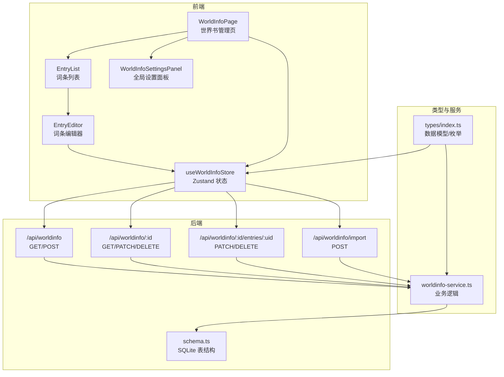
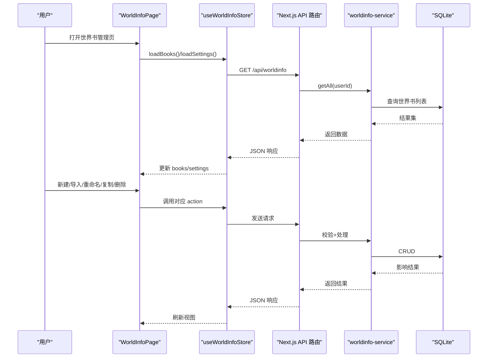
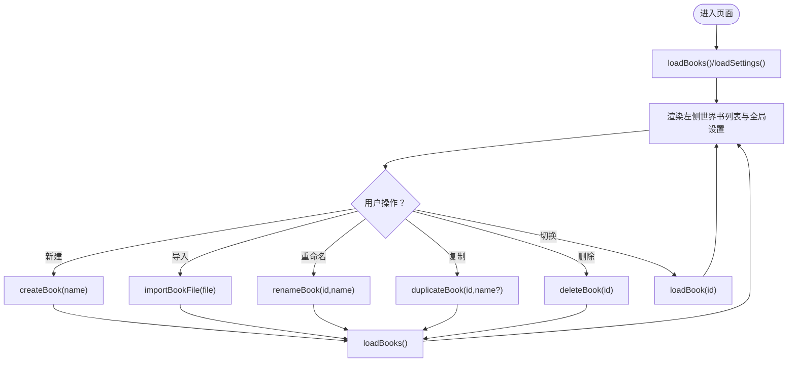
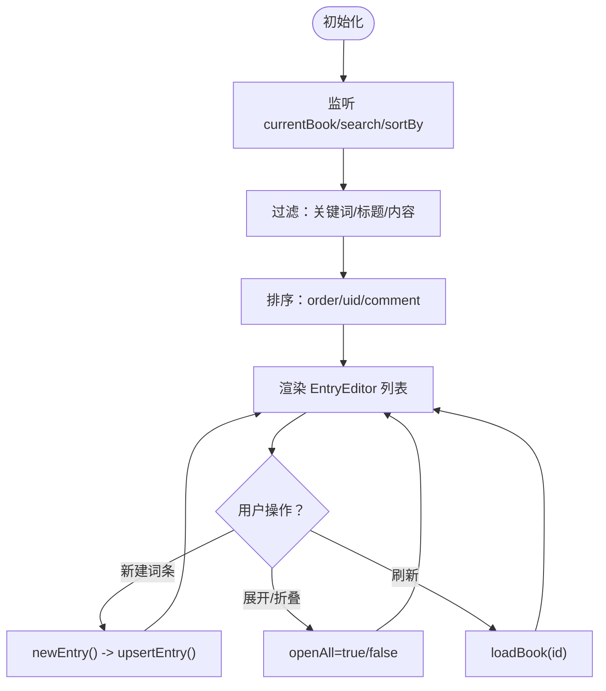
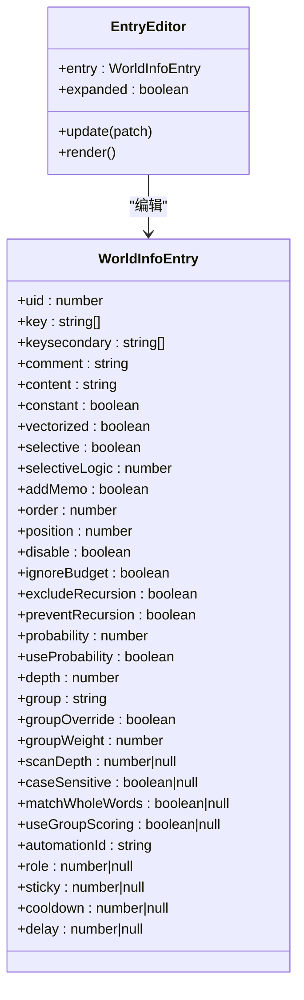
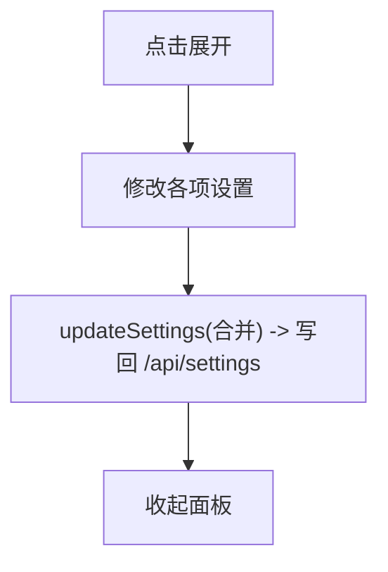
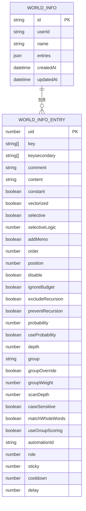
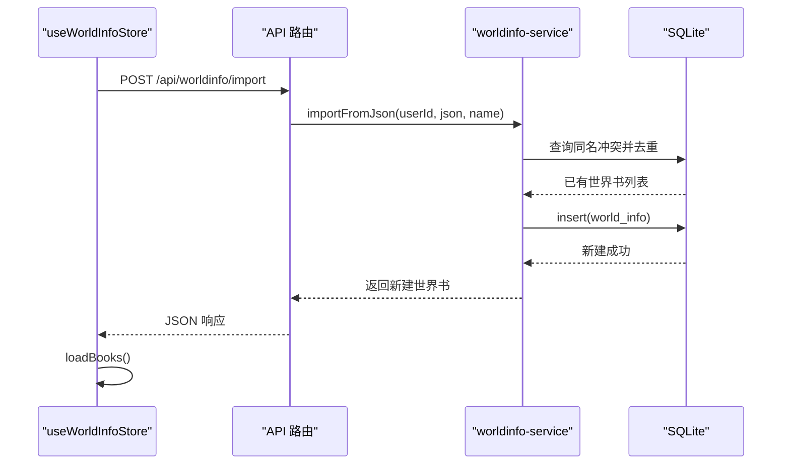
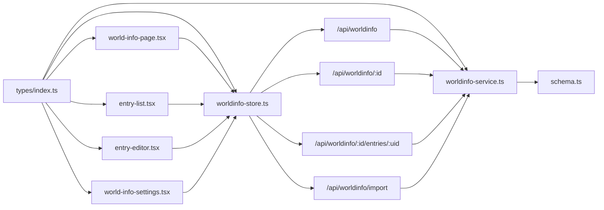

# 世界设定组件

<cite>
**本文档引用的文件**
- [src/components/world-info/world-info-page.tsx](file://src/components/world-info/world-info-page.tsx)
- [src/components/world-info/entry-list.tsx](file://src/components/world-info/entry-list.tsx)
- [src/components/world-info/entry-editor.tsx](file://src/components/world-info/entry-editor.tsx)
- [src/components/world-info/world-info-settings.tsx](file://src/components/world-info/world-info-settings.tsx)
- [src/stores/worldinfo-store.ts](file://src/stores/worldinfo-store.ts)
- [src/types/index.ts](file://src/types/index.ts)
- [src/lib/services/worldinfo-service.ts](file://src/lib/services/worldinfo-service.ts)
- [src/lib/db/schema.ts](file://src/lib/db/schema.ts)
- [src/app/api/worldinfo/route.ts](file://src/app/api/worldinfo/route.ts)
- [src/app/api/worldinfo/[id]/route.ts](file://src/app/api/worldinfo/[id]/route.ts)
- [src/app/api/worldinfo/[id]/entries/[uid]/route.ts](file://src/app/api/worldinfo/[id]/entries/[uid]/route.ts)
- [src/app/api/worldinfo/import/route.ts](file://src/app/api/worldinfo/import/route.ts)
</cite>

## 目录
1. [简介](#简介)
2. [项目结构](#项目结构)
3. [核心组件](#核心组件)
4. [架构总览](#架构总览)
5. [组件详解](#组件详解)
6. [依赖关系分析](#依赖关系分析)
7. [性能考量](#性能考量)
8. [故障排查指南](#故障排查指南)
9. [结论](#结论)
10. [附录](#附录)

## 简介
本文件系统性梳理“世界设定组件”的前端与后端实现，围绕世界书管理界面的四大核心模块：词条编辑器、词条列表、提示工具与设置面板，详细说明词条的增删改查、搜索过滤与排序、匹配算法集成与深度扫描、导入导出与批量操作、以及数据同步机制。同时给出性能优化与用户体验改进建议。

## 项目结构
世界设定组件采用“页面组件 + 存储层 + 类型定义 + 服务层 + 数据库 + API 路由”的分层设计，前端通过 Zustand 管理状态，后端通过 Drizzle ORM 访问 SQLite，API 路由负责鉴权与输入校验。

图表来源
- [src/components/world-info/world-info-page.tsx:1-202](file://src/components/world-info/world-info-page.tsx#L1-L202)
- [src/components/world-info/entry-list.tsx:1-105](file://src/components/world-info/entry-list.tsx#L1-L105)
- [src/components/world-info/entry-editor.tsx:1-323](file://src/components/world-info/entry-editor.tsx#L1-L323)
- [src/components/world-info/world-info-settings.tsx:1-208](file://src/components/world-info/world-info-settings.tsx#L1-L208)
- [src/stores/worldinfo-store.ts:1-257](file://src/stores/worldinfo-store.ts#L1-L257)
- [src/lib/services/worldinfo-service.ts:1-428](file://src/lib/services/worldinfo-service.ts#L1-L428)
- [src/lib/db/schema.ts:1-240](file://src/lib/db/schema.ts#L1-L240)
- [src/app/api/worldinfo/route.ts:1-23](file://src/app/api/worldinfo/route.ts#L1-L23)
- [src/app/api/worldinfo/[id]/route.ts:1-39](file://src/app/api/worldinfo/[id]/route.ts#L1-L39)
- [src/app/api/worldinfo/[id]/entries/[uid]/route.ts:1-27](file://src/app/api/worldinfo/[id]/entries/[uid]/route.ts#L1-L27)
- [src/app/api/worldinfo/import/route.ts:1-41](file://src/app/api/worldinfo/import/route.ts#L1-L41)

章节来源
- [src/components/world-info/world-info-page.tsx:1-202](file://src/components/world-info/world-info-page.tsx#L1-L202)
- [src/stores/worldinfo-store.ts:1-257](file://src/stores/worldinfo-store.ts#L1-L257)

## 核心组件
- 世界书管理页：左侧世界书列表与全局设置，右侧词条编辑区。
- 词条列表：支持搜索、排序、批量展开/折叠、刷新。
- 词条编辑器：单条词条的完整编辑表单，含匹配逻辑、插入位置、概率、分组、扫描深度、黏性、冷却、延迟等。
- 全局设置面板：扫描深度、最少激活、Token 预算、递归扫描、分组评分、插入策略等。

章节来源
- [src/components/world-info/world-info-page.tsx:18-202](file://src/components/world-info/world-info-page.tsx#L18-L202)
- [src/components/world-info/entry-list.tsx:11-105](file://src/components/world-info/entry-list.tsx#L11-L105)
- [src/components/world-info/entry-editor.tsx:17-323](file://src/components/world-info/entry-editor.tsx#L17-L323)
- [src/components/world-info/world-info-settings.tsx:12-208](file://src/components/world-info/world-info-settings.tsx#L12-L208)

## 架构总览
前端通过 API 路由与后端交互，Zustand 状态集中管理世界书与词条数据；服务层负责数据校验、转换与持久化；数据库层定义表结构与字段约束。

图表来源
- [src/components/world-info/world-info-page.tsx:35-75](file://src/components/world-info/world-info-page.tsx#L35-L75)
- [src/stores/worldinfo-store.ts:49-162](file://src/stores/worldinfo-store.ts#L49-L162)
- [src/app/api/worldinfo/route.ts:5-22](file://src/app/api/worldinfo/route.ts#L5-L22)
- [src/lib/services/worldinfo-service.ts:98-106](file://src/lib/services/worldinfo-service.ts#L98-L106)

## 组件详解

### 世界书管理页（WorldInfoPage）
- 负责加载世界书列表与全局设置，提供世界书的创建、重命名、复制、删除、导入、导出与切换。
- 左侧全局生效区域支持多选世界书，用于全局注入。
- 右侧为词条列表容器。

图表来源
- [src/components/world-info/world-info-page.tsx:35-75](file://src/components/world-info/world-info-page.tsx#L35-L75)
- [src/stores/worldinfo-store.ts:49-126](file://src/stores/worldinfo-store.ts#L49-L126)

章节来源
- [src/components/world-info/world-info-page.tsx:18-202](file://src/components/world-info/world-info-page.tsx#L18-L202)
- [src/stores/worldinfo-store.ts:43-126](file://src/stores/worldinfo-store.ts#L43-L126)

### 词条列表（EntryList）
- 支持搜索关键词/标题/内容，按 Order、UID 或标题排序。
- 支持全部展开/折叠、刷新当前世界书。
- 将当前世界书的所有词条渲染为 EntryEditor 卡片。

图表来源
- [src/components/world-info/entry-list.tsx:20-38](file://src/components/world-info/entry-list.tsx#L20-L38)
- [src/stores/worldinfo-store.ts:211-218](file://src/stores/worldinfo-store.ts#L211-L218)

章节来源
- [src/components/world-info/entry-list.tsx:11-105](file://src/components/world-info/entry-list.tsx#L11-L105)
- [src/stores/worldinfo-store.ts:20-41](file://src/stores/worldinfo-store.ts#L20-L41)

### 词条编辑器（EntryEditor）
- 单条词条的可视化编辑器，支持主/次关键词、内容、选择逻辑、插入位置、顺序、概率、插入深度、角色、分组、扫描深度、黏性、冷却、延迟等。
- 支持启用/禁用、删除、展开/折叠。
- 所有修改通过 upsertEntry 提交并重新加载当前世界书以保证一致性。

图表来源
- [src/components/world-info/entry-editor.tsx:17-254](file://src/components/world-info/entry-editor.tsx#L17-L254)
- [src/types/index.ts:369-416](file://src/types/index.ts#L369-L416)

章节来源
- [src/components/world-info/entry-editor.tsx:17-323](file://src/components/world-info/entry-editor.tsx#L17-L323)
- [src/stores/worldinfo-store.ts:33-35](file://src/stores/worldinfo-store.ts#L33-L35)

### 全局设置面板（WorldInfoSettingsPanel）
- 控制扫描深度、最少激活数量与最大深度、Token 预算与硬上限、递归扫描步数、大小写/全词匹配、分组评分、包含角色名、溢出告警、插入策略等。
- 支持全局生效世界书的选择集合（globalSelect）。

图表来源
- [src/components/world-info/world-info-settings.tsx:12-143](file://src/components/world-info/world-info-settings.tsx#L12-L143)
- [src/stores/worldinfo-store.ts:232-247](file://src/stores/worldinfo-store.ts#L232-L247)

章节来源
- [src/components/world-info/world-info-settings.tsx:12-208](file://src/components/world-info/world-info-settings.tsx#L12-L208)
- [src/stores/worldinfo-store.ts:37-41](file://src/stores/worldinfo-store.ts#L37-L41)

### 数据模型与枚举（types/index.ts）
- 定义世界书、词条、全局设置的数据结构与默认值。
- 定义插入位置、关键词逻辑、插入策略、角色等枚举常量。
- 提供词条默认工厂函数 createDefaultWorldInfoEntry。

图表来源
- [src/types/index.ts:419-445](file://src/types/index.ts#L419-L445)
- [src/types/index.ts:369-416](file://src/types/index.ts#L369-L416)

章节来源
- [src/types/index.ts:325-507](file://src/types/index.ts#L325-L507)

### 服务层与数据库（worldinfo-service.ts, schema.ts）
- 服务层提供 getAll/getById/create/update/delete/rename/duplicate/upsertEntry/deleteEntry/import/export 等能力，并进行字段校验与兼容转换。
- 数据库层定义 world_info 表，entries 以 JSON 文本存储，支持后续导出为 V2/V3 character_book 格式。

图表来源
- [src/stores/worldinfo-store.ts:128-144](file://src/stores/worldinfo-store.ts#L128-L144)
- [src/app/api/worldinfo/import/route.ts:34-40](file://src/app/api/worldinfo/import/route.ts#L34-L40)
- [src/lib/services/worldinfo-service.ts:231-247](file://src/lib/services/worldinfo-service.ts#L231-L247)
- [src/lib/db/schema.ts:173-180](file://src/lib/db/schema.ts#L173-L180)

章节来源
- [src/lib/services/worldinfo-service.ts:97-300](file://src/lib/services/worldinfo-service.ts#L97-L300)
- [src/lib/db/schema.ts:173-180](file://src/lib/db/schema.ts#L173-L180)

## 依赖关系分析
- 组件依赖：WorldInfoPage 依赖 EntryList 与 WorldInfoSettingsPanel；EntryList 依赖 EntryEditor；Editor 依赖 Store；Store 依赖 API 路由；API 路由依赖服务层；服务层依赖数据库。
- 类型依赖：types/index.ts 为所有组件与服务层提供强类型支撑。
- 状态依赖：useWorldInfoStore 集中式管理 books/currentBook/settings，避免跨组件重复请求。

图表来源
- [src/types/index.ts:325-507](file://src/types/index.ts#L325-L507)
- [src/components/world-info/world-info-page.tsx:15-19](file://src/components/world-info/world-info-page.tsx#L15-L19)
- [src/stores/worldinfo-store.ts:43-256](file://src/stores/worldinfo-store.ts#L43-L256)
- [src/lib/services/worldinfo-service.ts:97-300](file://src/lib/services/worldinfo-service.ts#L97-L300)
- [src/lib/db/schema.ts:173-180](file://src/lib/db/schema.ts#L173-L180)

章节来源
- [src/stores/worldinfo-store.ts:43-256](file://src/stores/worldinfo-store.ts#L43-L256)

## 性能考量
- 列表渲染优化
  - EntryList 使用 useMemo 缓存过滤与排序结果，避免不必要的重渲染。
  - 搜索过滤仅在输入变化时执行，减少字符串匹配开销。
- 状态同步
  - upsertEntry 与 deleteEntry 后统一调用 loadBook，确保前端状态与后端一致，避免脏读。
- 扫描深度与预算
  - 全局设置提供 world_info_depth、world_info_budget、world_info_budget_cap，合理配置可降低 Token 消耗与生成延迟。
  - 最少激活与最大深度上限可避免过度召回导致的性能问题。
- 递归扫描
  - world_info_max_recursion_steps 限制递归轮数，防止词条链引发无限循环。
- 导入导出
  - 导入时进行重名处理，避免重复项影响查询效率。
  - 导出兼容 V2/V3 character_book 格式，便于迁移与复用。

[本节为通用性能建议，无需特定文件引用]

## 故障排查指南
- 无法加载世界书/词条
  - 检查鉴权：API 路由要求登录态，确认会话有效。
  - 检查网络：store 中的 fetch 请求返回状态码，查看控制台错误日志。
- 词条更新无效
  - 确认当前已加载目标世界书；upsertEntry 后会重新拉取书籍数据。
- 删除失败
  - 确认世界书 ID 正确；服务层删除后会级联清理角色卡绑定与设置中的 globalSelect。
- 导入失败
  - 确认上传文件为合法 JSON；API 支持 multipart/form-data 与 JSON body 两种方式。
- 设置未生效
  - updateSettings 会合并当前设置并写回 /api/settings，确认响应状态与浏览器缓存。

章节来源
- [src/stores/worldinfo-store.ts:49-162](file://src/stores/worldinfo-store.ts#L49-L162)
- [src/lib/services/worldinfo-service.ts:161-192](file://src/lib/services/worldinfo-service.ts#L161-L192)
- [src/app/api/worldinfo/import/route.ts:15-40](file://src/app/api/worldinfo/import/route.ts#L15-L40)

## 结论
该世界设定组件通过清晰的分层设计与完善的类型系统，实现了从世界书管理到词条编辑、从全局设置到数据持久化的完整闭环。前端以轻量状态管理与高效渲染为核心，后端以严格的输入校验与兼容转换保障数据质量。结合合理的性能配置与故障排查路径，可满足复杂场景下的世界设定需求。

[本节为总结性内容，无需特定文件引用]

## 附录

### 词条增删改查与搜索过滤/排序
- 新建词条：newEntry() 生成下一个 UID 并 upsertEntry。
- 更新词条：EntryEditor 内部 update() 调用 upsertEntry。
- 删除词条：deleteEntry(uid)。
- 搜索过滤：EntryList 基于 comment/content/key 进行小写包含匹配。
- 排序：支持按 order、uid、comment 排序。

章节来源
- [src/components/world-info/entry-list.tsx:20-38](file://src/components/world-info/entry-list.tsx#L20-L38)
- [src/stores/worldinfo-store.ts:211-218](file://src/stores/worldinfo-store.ts#L211-L218)

### 词条匹配算法与深度扫描
- 匹配算法
  - 主关键词与次关键词组合，支持正则与全词匹配。
  - 选择逻辑：AND ANY、AND ALL、NOT ALL、NOT ANY。
  - 可覆盖全局设置：caseSensitive、matchWholeWords、scanDepth。
- 深度扫描
  - 全局 world_info_depth 控制最近 N 条消息扫描。
  - 词条级 scanDepth 可覆盖全局设置。
  - 递归扫描受 world_info_max_recursion_steps 限制。

章节来源
- [src/components/world-info/entry-editor.tsx:66-172](file://src/components/world-info/entry-editor.tsx#L66-L172)
- [src/components/world-info/world-info-settings.tsx:29-76](file://src/components/world-info/world-info-settings.tsx#L29-L76)

### 导入导出与批量操作
- 导入
  - 支持 lorebook JSON 与 V2 character_book entries 数组格式。
  - 自动处理重名并创建新世界书。
- 导出
  - 导出为 lorebook JSON，包含 originalData 以便回源。
  - 可导出为 character_book 格式供角色卡使用。
- 批量操作
  - 通过全局设置面板选择多个世界书进行全局生效。
  - 词条列表支持批量展开/折叠与刷新。

章节来源
- [src/lib/services/worldinfo-service.ts:231-299](file://src/lib/services/worldinfo-service.ts#L231-L299)
- [src/app/api/worldinfo/import/route.ts:15-40](file://src/app/api/worldinfo/import/route.ts#L15-L40)
- [src/components/world-info/world-info-page.tsx:87-192](file://src/components/world-info/world-info-page.tsx#L87-L192)

### 数据同步机制
- 前端：useWorldInfoStore 统一管理 books/currentBook/settings，所有变更后重新拉取数据。
- 后端：API 路由鉴权 + Zod 校验 + 服务层数据转换 + 数据库存储。
- 级联清理：删除世界书时清理角色卡绑定与设置中的 globalSelect。

章节来源
- [src/stores/worldinfo-store.ts:164-173](file://src/stores/worldinfo-store.ts#L164-L173)
- [src/lib/services/worldinfo-service.ts:161-192](file://src/lib/services/worldinfo-service.ts#L161-L192)