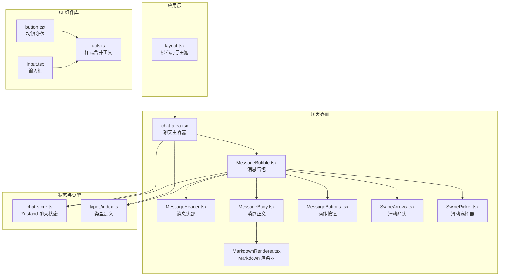
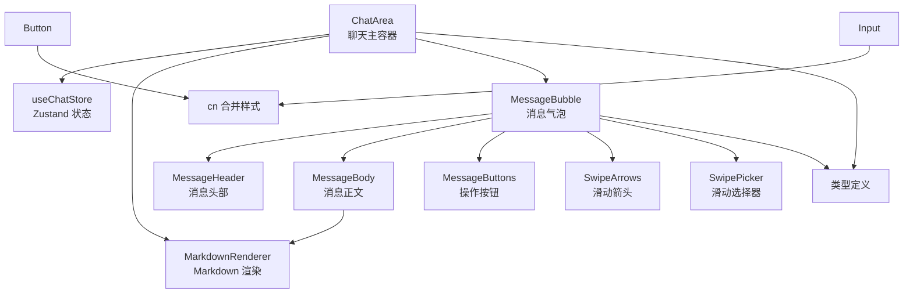
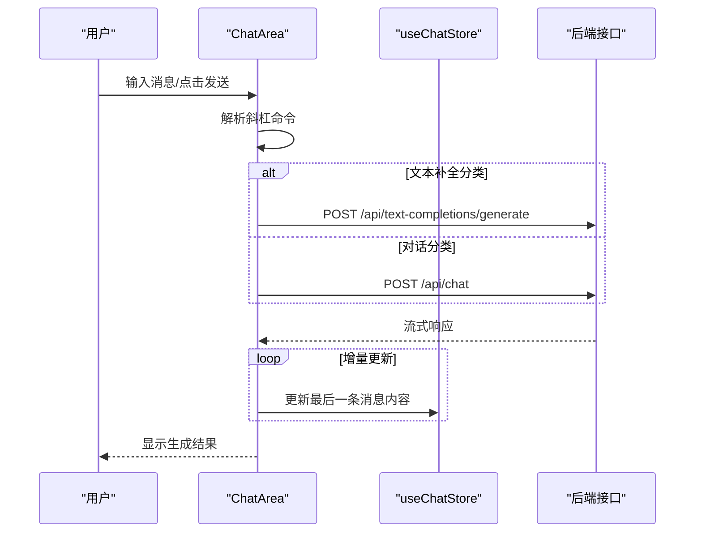
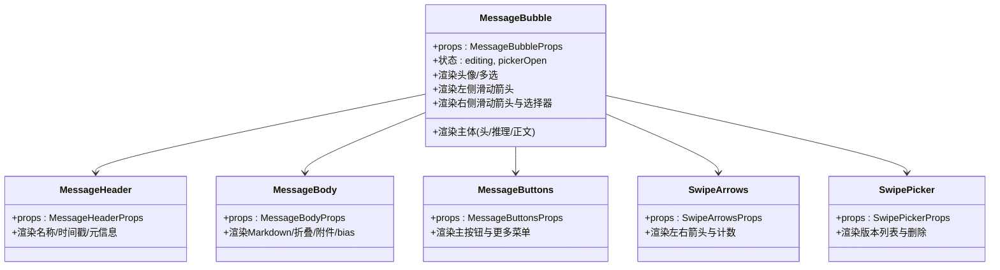
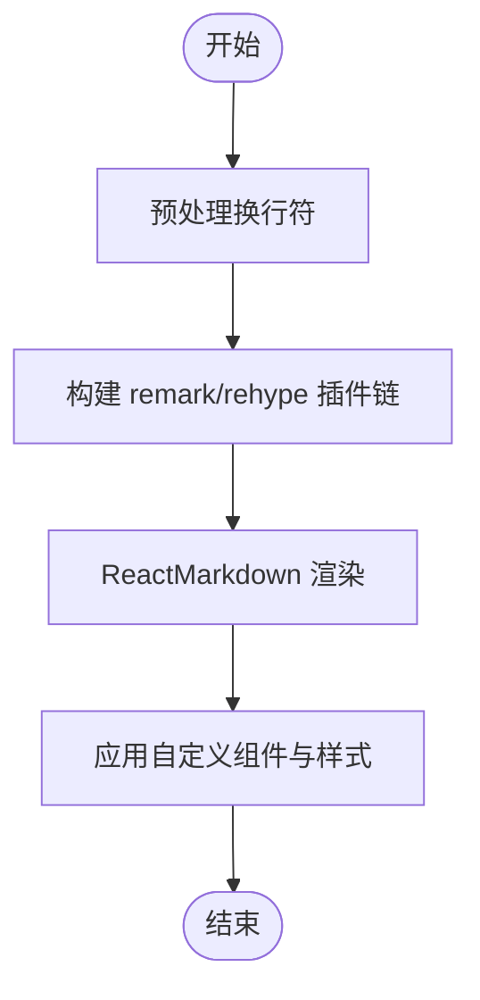
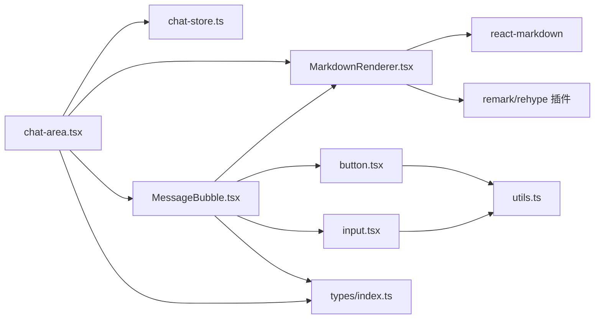

# 前端组件架构

<cite>
**本文引用的文件**
- [src/app/layout.tsx](file://src/app/layout.tsx)
- [src/components/chat/chat-area.tsx](file://src/components/chat/chat-area.tsx)
- [src/components/chat/markdown/MarkdownRenderer.tsx](file://src/components/chat/markdown/MarkdownRenderer.tsx)
- [src/components/chat/message-bubble/MessageBubble.tsx](file://src/components/chat/message-bubble/MessageBubble.tsx)
- [src/components/chat/message-bubble/MessageBody.tsx](file://src/components/chat/message-bubble/MessageBody.tsx)
- [src/components/chat/message-bubble/MessageHeader.tsx](file://src/components/chat/message-bubble/MessageHeader.tsx)
- [src/components/chat/message-bubble/MessageButtons.tsx](file://src/components/chat/message-bubble/MessageButtons.tsx)
- [src/components/chat/message-bubble/SwipeArrows.tsx](file://src/components/chat/message-bubble/SwipeArrows.tsx)
- [src/components/chat/message-bubble/SwipePicker.tsx](file://src/components/chat/message-bubble/SwipePicker.tsx)
- [src/components/ui/button.tsx](file://src/components/ui/button.tsx)
- [src/components/ui/input.tsx](file://src/components/ui/input.tsx)
- [src/lib/utils.ts](file://src/lib/utils.ts)
- [src/stores/chat-store.ts](file://src/stores/chat-store.ts)
- [src/types/index.ts](file://src/types/index.ts)
- [package.json](file://package.json)
</cite>

## 目录
1. [简介](#简介)
2. [项目结构](#项目结构)
3. [核心组件](#核心组件)
4. [架构总览](#架构总览)
5. [详细组件分析](#详细组件分析)
6. [依赖关系分析](#依赖关系分析)
7. [性能考量](#性能考量)
8. [故障排查指南](#故障排查指南)
9. [结论](#结论)
10. [附录](#附录)

## 简介
本文件系统性梳理 SillyTavern Next 的前端组件架构，聚焦 React 组件设计原则、UI 组件库与组件通信模式，深入解析聊天界面、消息气泡与 Markdown 渲染器的实现方式。同时阐述基于 shadcn/ui 风格的组件设计、样式系统与主题定制思路，总结状态管理、事件处理与性能优化策略，并提供组件开发指南、最佳实践与扩展方法。

## 项目结构
- 应用根布局负责全局样式与主题注入，采用深色主题默认值与暗黑模式支持。
- 聊天相关组件集中在 src/components/chat 下，按职责拆分为聊天区、消息气泡与 Markdown 渲染器三大模块。
- UI 基础组件位于 src/components/ui，遵循 shadcn/ui 风格的变体与尺寸体系。
- 状态管理通过 Zustand 的 chat-store 实现，统一管理当前会话、消息列表与交互动作。
- 类型定义集中于 src/types，确保组件间数据契约清晰。

图表来源
- [src/app/layout.tsx:1-24](file://src/app/layout.tsx#L1-L24)
- [src/components/chat/chat-area.tsx:1-120](file://src/components/chat/chat-area.tsx#L1-L120)
- [src/components/chat/message-bubble/MessageBubble.tsx:1-120](file://src/components/chat/message-bubble/MessageBubble.tsx#L1-L120)
- [src/components/chat/markdown/MarkdownRenderer.tsx:1-60](file://src/components/chat/markdown/MarkdownRenderer.tsx#L1-L60)
- [src/components/ui/button.tsx:1-49](file://src/components/ui/button.tsx#L1-L49)
- [src/components/ui/input.tsx:1-24](file://src/components/ui/input.tsx#L1-L24)
- [src/lib/utils.ts:1-7](file://src/lib/utils.ts#L1-L7)
- [src/stores/chat-store.ts:1-120](file://src/stores/chat-store.ts#L1-L120)
- [src/types/index.ts:58-150](file://src/types/index.ts#L58-L150)

章节来源
- [src/app/layout.tsx:1-24](file://src/app/layout.tsx#L1-L24)
- [src/components/chat/chat-area.tsx:1-120](file://src/components/chat/chat-area.tsx#L1-L120)
- [src/components/ui/button.tsx:1-49](file://src/components/ui/button.tsx#L1-L49)
- [src/components/ui/input.tsx:1-24](file://src/components/ui/input.tsx#L1-L24)
- [src/lib/utils.ts:1-7](file://src/lib/utils.ts#L1-L7)
- [src/stores/chat-store.ts:1-120](file://src/stores/chat-store.ts#L1-L120)
- [src/types/index.ts:58-150](file://src/types/index.ts#L58-L150)

## 核心组件
- 聊天主容器 ChatArea：负责输入、发送、流式生成、斜杠命令、搜索、多选、附件与提及等全链路交互；协调连接状态、世界设定、文本生成预设与高级格式化。
- 消息气泡 MessageBubble：封装单条消息的头像、标题、正文、推理、编辑、滑动版本、按钮组与多选交互。
- Markdown 渲染器 MarkdownRenderer：基于 react-markdown + remark/rehype 插件链，提供 GFM、换行、数学公式与 KaTeX 支持，兼顾安全与可读性。
- UI 基础组件：Button 与 Input 采用 class-variance-authority 的变体系统，结合 tailwind-merge 与 clsx 实现样式合并与主题适配。
- 状态管理：Zustand chat-store 提供本地状态与异步持久化动作，统一管理消息增删改、滑动版本、分支与书签等。

章节来源
- [src/components/chat/chat-area.tsx:34-120](file://src/components/chat/chat-area.tsx#L34-L120)
- [src/components/chat/message-bubble/MessageBubble.tsx:60-120](file://src/components/chat/message-bubble/MessageBubble.tsx#L60-L120)
- [src/components/chat/markdown/MarkdownRenderer.tsx:12-40](file://src/components/chat/markdown/MarkdownRenderer.tsx#L12-L40)
- [src/components/ui/button.tsx:5-29](file://src/components/ui/button.tsx#L5-L29)
- [src/stores/chat-store.ts:15-103](file://src/stores/chat-store.ts#L15-L103)

## 架构总览
整体采用“容器组件 + 功能组件 + 基础 UI 组件 + 状态存储”的分层架构。容器组件负责业务编排与副作用，功能组件专注单一职责，基础 UI 组件提供一致的视觉与交互体验，状态存储通过集中式状态管理降低耦合。

图表来源
- [src/components/chat/chat-area.tsx:1-120](file://src/components/chat/chat-area.tsx#L1-L120)
- [src/components/chat/message-bubble/MessageBubble.tsx:1-120](file://src/components/chat/message-bubble/MessageBubble.tsx#L1-L120)
- [src/components/chat/markdown/MarkdownRenderer.tsx:1-60](file://src/components/chat/markdown/MarkdownRenderer.tsx#L1-L60)
- [src/components/ui/button.tsx:1-49](file://src/components/ui/button.tsx#L1-L49)
- [src/components/ui/input.tsx:1-24](file://src/components/ui/input.tsx#L1-L24)
- [src/lib/utils.ts:1-7](file://src/lib/utils.ts#L1-L7)
- [src/stores/chat-store.ts:1-120](file://src/stores/chat-store.ts#L1-L120)
- [src/types/index.ts:58-150](file://src/types/index.ts#L58-L150)

## 详细组件分析

### 聊天界面组件 ChatArea
- 输入与提交：支持斜杠命令、@ 提及、搜索、多选、附件拖拽与粘贴；区分普通生成与 text_completion 分类下的不同调用路径。
- 流式生成：统一消费流式响应，增量更新最后一条助手消息；支持中断与错误兜底。
- 世界设定与格式化：构建世界书 payload，结合上下文、指令与系统提示模板，生成最终 prompt。
- 群聊分支：当检测到 groupId 时，走群聊生成流程，支持多角色并发或整批重生。
- 搜索与多选：提供 Ctrl+F 快捷键唤出搜索栏，支持高亮与导航；多选模式支持批量导出与文本提取。

图表来源
- [src/components/chat/chat-area.tsx:533-683](file://src/components/chat/chat-area.tsx#L533-L683)
- [src/stores/chat-store.ts:121-130](file://src/stores/chat-store.ts#L121-L130)

章节来源
- [src/components/chat/chat-area.tsx:114-180](file://src/components/chat/chat-area.tsx#L114-L180)
- [src/components/chat/chat-area.tsx:183-248](file://src/components/chat/chat-area.tsx#L183-L248)
- [src/components/chat/chat-area.tsx:250-298](file://src/components/chat/chat-area.tsx#L250-L298)
- [src/components/chat/chat-area.tsx:533-683](file://src/components/chat/chat-area.tsx#L533-L683)
- [src/stores/chat-store.ts:121-130](file://src/stores/chat-store.ts#L121-L130)

### 消息气泡组件 MessageBubble
- 结构组成：头像/多选框、左侧滑动箭头、主体（头、推理、正文）、右侧滑动箭头与滑动选择器。
- 交互能力：支持编辑、复制、删除、隐藏/显示、重生成、分支、书签、翻译、朗读、生成图片、上下移动与添加推理。
- 多选模式：支持勾选与批量操作。
- 滑动版本：通过 swipeId 与 swipes 数组管理多个生成版本，支持前后切换与溢出重新生成。

图表来源
- [src/components/chat/message-bubble/MessageBubble.tsx:60-120](file://src/components/chat/message-bubble/MessageBubble.tsx#L60-L120)
- [src/components/chat/message-bubble/MessageHeader.tsx:33-40](file://src/components/chat/message-bubble/MessageHeader.tsx#L33-L40)
- [src/components/chat/message-bubble/MessageBody.tsx:34-42](file://src/components/chat/message-bubble/MessageBody.tsx#L34-L42)
- [src/components/chat/message-bubble/MessageButtons.tsx:47-64](file://src/components/chat/message-bubble/MessageButtons.tsx#L47-L64)
- [src/components/chat/message-bubble/SwipeArrows.tsx:30-41](file://src/components/chat/message-bubble/SwipeArrows.tsx#L30-L41)
- [src/components/chat/message-bubble/SwipePicker.tsx:21-29](file://src/components/chat/message-bubble/SwipePicker.tsx#L21-L29)

章节来源
- [src/components/chat/message-bubble/MessageBubble.tsx:60-120](file://src/components/chat/message-bubble/MessageBubble.tsx#L60-L120)
- [src/components/chat/message-bubble/MessageHeader.tsx:33-40](file://src/components/chat/message-bubble/MessageHeader.tsx#L33-L40)
- [src/components/chat/message-bubble/MessageBody.tsx:34-42](file://src/components/chat/message-bubble/MessageBody.tsx#L34-L42)
- [src/components/chat/message-bubble/MessageButtons.tsx:47-64](file://src/components/chat/message-bubble/MessageButtons.tsx#L47-L64)
- [src/components/chat/message-bubble/SwipeArrows.tsx:30-41](file://src/components/chat/message-bubble/SwipeArrows.tsx#L30-L41)
- [src/components/chat/message-bubble/SwipePicker.tsx:21-29](file://src/components/chat/message-bubble/SwipePicker.tsx#L21-L29)

### Markdown 渲染器 MarkdownRenderer
- 预处理：归一化换行符，避免渲染异常。
- 插件链：remark-gfm、remark-breaks、remark-math；可选 rehype-raw 与 rehype-katex。
- 自定义组件：链接安全打开、代码块滚动、表格自适应、标题层级、引用块、分割线、列表缩进、图片懒加载等。
- 紧凑模式：针对推理等小区域提供紧凑样式。

图表来源
- [src/components/chat/markdown/MarkdownRenderer.tsx:27-31](file://src/components/chat/markdown/MarkdownRenderer.tsx#L27-L31)
- [src/components/chat/markdown/MarkdownRenderer.tsx:169-199](file://src/components/chat/markdown/MarkdownRenderer.tsx#L169-L199)

章节来源
- [src/components/chat/markdown/MarkdownRenderer.tsx:12-40](file://src/components/chat/markdown/MarkdownRenderer.tsx#L12-L40)
- [src/components/chat/markdown/MarkdownRenderer.tsx:169-199](file://src/components/chat/markdown/MarkdownRenderer.tsx#L169-L199)

### UI 组件库与样式系统
- Button：基于 class-variance-authority 定义 variant 与 size 变体，结合 cn 合并样式，实现统一风格与主题适配。
- Input：提供基础输入样式与焦点态环形高亮。
- 样式合并：cn 函数通过 clsx 与 tailwind-merge 合并类名，避免冲突并保持原子化样式的一致性。

章节来源
- [src/components/ui/button.tsx:5-29](file://src/components/ui/button.tsx#L5-L29)
- [src/components/ui/input.tsx:6-18](file://src/components/ui/input.tsx#L6-L18)
- [src/lib/utils.ts:4-6](file://src/lib/utils.ts#L4-L6)

### 状态管理与事件处理
- Zustand chat-store：集中管理当前会话、消息列表、生成状态与持久化动作；提供本地乐观更新与异步回写。
- 事件处理：容器组件负责输入、提交、中断、搜索、多选与斜杠命令；功能组件通过回调与 props 传递事件，解耦 UI 与业务。
- 数据一致性：消息 ID 回写、滑动版本同步、分支与书签维护，均通过 store 与后端接口协同保证。

章节来源
- [src/stores/chat-store.ts:15-103](file://src/stores/chat-store.ts#L15-L103)
- [src/stores/chat-store.ts:235-272](file://src/stores/chat-store.ts#L235-L272)
- [src/stores/chat-store.ts:368-388](file://src/stores/chat-store.ts#L368-L388)
- [src/stores/chat-store.ts:390-422](file://src/stores/chat-store.ts#L390-L422)

## 依赖关系分析
- 组件依赖：ChatArea 依赖 chat-store、格式化工具与 UI 组件；消息气泡依赖 MarkdownRenderer 与 UI 组件；MarkdownRenderer 依赖 react-markdown 生态。
- 外部依赖：Next.js、Lucide React、Tailwind CSS v4、Zustand、class-variance-authority、clsx、tailwind-merge、KaTeX、react-markdown 生态插件。
- 类型依赖：types/index.ts 提供消息、角色、聊天、群组与生成设置等核心类型，贯穿组件与状态层。

图表来源
- [src/components/chat/chat-area.tsx:1-30](file://src/components/chat/chat-area.tsx#L1-L30)
- [src/components/chat/markdown/MarkdownRenderer.tsx:1-11](file://src/components/chat/markdown/MarkdownRenderer.tsx#L1-L11)
- [src/components/chat/message-bubble/MessageBubble.tsx:1-13](file://src/components/chat/message-bubble/MessageBubble.tsx#L1-L13)
- [src/components/ui/button.tsx:1-4](file://src/components/ui/button.tsx#L1-L4)
- [src/components/ui/input.tsx:1-4](file://src/components/ui/input.tsx#L1-L4)
- [src/lib/utils.ts:1-7](file://src/lib/utils.ts#L1-L7)
- [src/stores/chat-store.ts:1-10](file://src/stores/chat-store.ts#L1-L10)
- [src/types/index.ts:58-150](file://src/types/index.ts#L58-L150)
- [package.json:18-46](file://package.json#L18-L46)

章节来源
- [package.json:18-46](file://package.json#L18-L46)
- [src/types/index.ts:58-150](file://src/types/index.ts#L58-L150)

## 性能考量
- 渲染优化
  - MarkdownRenderer 使用 memo 包装，避免重复渲染。
  - MessageBody 对长文本进行折叠与渐变遮罩，减少 DOM 节点数量与重绘范围。
  - 滚动监听与自动定位仅在必要时触发，避免频繁重排。
- 状态与网络
  - 流式响应增量更新，避免全量替换；中断时及时释放 AbortController。
  - 持久化采用乐观更新与异步回写，提升交互流畅度。
- 样式与资源
  - 使用 tailwind-merge 合并类名，减少无效样式；图片懒加载与链接安全打开。
  - KaTeX 与 react-markdown 插件按需启用，避免不必要的渲染开销。

章节来源
- [src/components/chat/markdown/MarkdownRenderer.tsx:201-202](file://src/components/chat/markdown/MarkdownRenderer.tsx#L201-L202)
- [src/components/chat/message-bubble/MessageBody.tsx:24-47](file://src/components/chat/message-bubble/MessageBody.tsx#L24-L47)
- [src/components/chat/chat-area.tsx:321-324](file://src/components/chat/chat-area.tsx#L321-L324)
- [src/components/chat/chat-area.tsx:617-682](file://src/components/chat/chat-area.tsx#L617-L682)

## 故障排查指南
- 生成失败
  - 检查连接状态与模型选择；确认斜杠命令未被误触发；查看流式读取错误与中断日志。
- 消息丢失或错位
  - 核对消息 ID 回写逻辑与持久化 PATCH；检查滑动版本索引与 activeId 同步。
- Markdown 渲染异常
  - 确认预处理换行符与插件链配置；若允许内嵌 HTML，检查 rehype-raw 安全性。
- UI 样式错乱
  - 检查 cn 合并顺序与 Tailwind CSS v4 的原子类冲突；确认主题类名是否正确注入。

章节来源
- [src/components/chat/chat-area.tsx:672-682](file://src/components/chat/chat-area.tsx#L672-L682)
- [src/stores/chat-store.ts:256-266](file://src/stores/chat-store.ts#L256-L266)
- [src/components/chat/markdown/MarkdownRenderer.tsx:169-199](file://src/components/chat/markdown/MarkdownRenderer.tsx#L169-L199)

## 结论
SillyTavern Next 的前端组件架构以容器组件为核心，围绕消息气泡与 Markdown 渲染器构建聊天体验，配合 shadcn/ui 风格的 UI 组件与 Zustand 状态管理，实现了高内聚、低耦合的前端体系。通过流式渲染、滑动版本与多选/搜索等特性，满足复杂对话场景的需求；通过样式合并与渲染优化，保障了良好的性能与可维护性。

## 附录
- 开发指南
  - 新增消息操作：在 MessageButtons 中新增按钮与回调，在 MessageBubble 中接收并渲染。
  - 新增 Markdown 扩展：在 MarkdownRenderer 中扩展 remark/rehype 插件链与自定义组件。
  - 新增聊天功能：在 ChatArea 中新增状态与副作用，必要时扩展 chat-store 动作。
- 最佳实践
  - 使用 memo 包装重型渲染组件；合理拆分功能组件，保持单一职责。
  - 通过 props 与回调传递事件，避免跨层级直接访问状态。
  - 采用 cn 合并样式，统一主题与尺寸变体。
- 扩展方法
  - 通过类型定义完善数据契约；在 chat-store 中增加动作以支持新的业务场景。
  - 引入更多 remark/rehype 插件以增强 Markdown 能力；按需启用 KaTeX 与安全 HTML。