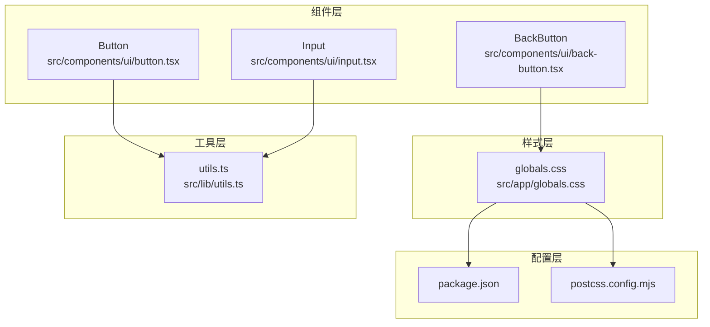
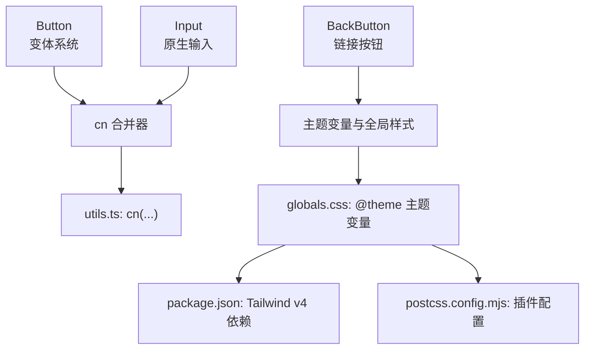
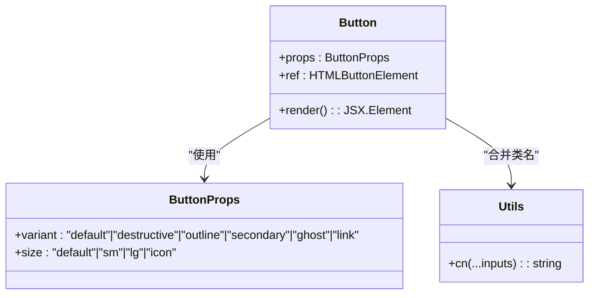
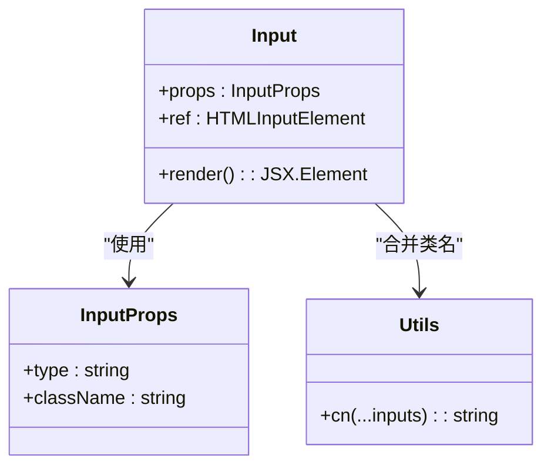
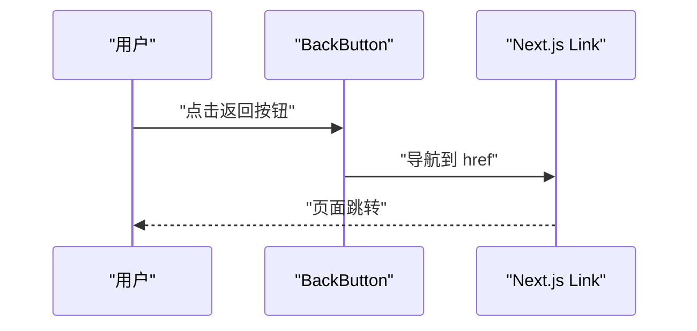
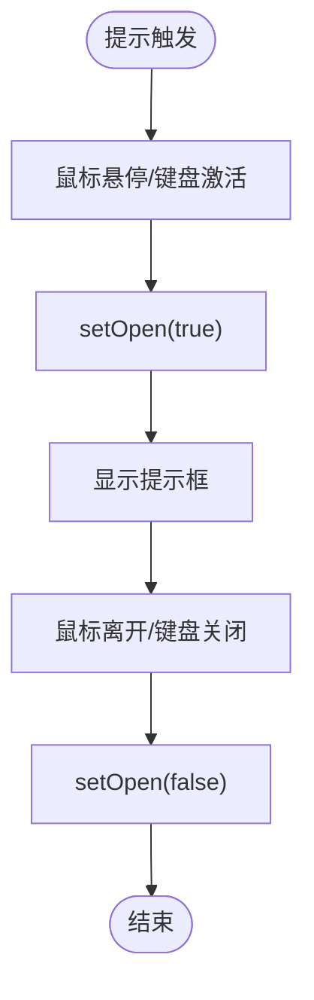
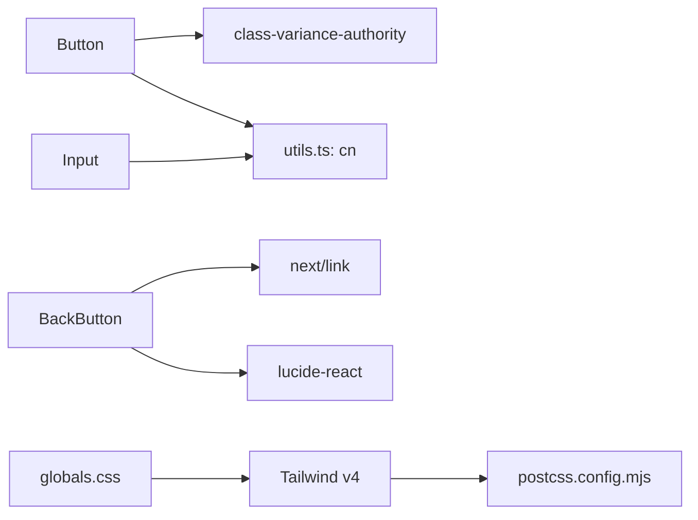

# 基础 UI 组件

<cite>
**本文引用的文件**
- [button.tsx](file://src/components/ui/button.tsx)
- [input.tsx](file://src/components/ui/input.tsx)
- [back-button.tsx](file://src/components/ui/back-button.tsx)
- [globals.css](file://src/app/globals.css)
- [utils.ts](file://src/lib/utils.ts)
- [package.json](file://package.json)
- [postcss.config.mjs](file://postcss.config.mjs)
- [sidebar.tsx](file://src/components/layout/sidebar.tsx)
- [hint-tip.tsx](file://src/components/world-info/hint-tip.tsx)
- [api-connections.tsx](file://src/components/settings/api-connections.tsx)
- [formatting-field-renderer.tsx](file://src/components/advanced-formatting/formatting-field-renderer.tsx)
- [MessageButtons.tsx](file://src/components/chat/message-bubble/MessageButtons.tsx)
</cite>

## 目录
1. [简介](#简介)
2. [项目结构](#项目结构)
3. [核心组件](#核心组件)
4. [架构总览](#架构总览)
5. [详细组件分析](#详细组件分析)
6. [依赖分析](#依赖分析)
7. [性能考量](#性能考量)
8. [故障排查指南](#故障排查指南)
9. [结论](#结论)
10. [附录](#附录)

## 简介
本文件聚焦于项目中的基础 UI 组件，重点解析 Button、Input 等通用组件的设计原则、属性接口、样式系统与主题定制方式，并结合实际使用场景说明可访问性支持、事件处理与状态管理。同时提供组件组合模式、样式覆盖方法与响应式设计建议，以及使用示例、最佳实践与自定义扩展指南。

## 项目结构
基础 UI 组件位于 src/components/ui 目录下，采用“按功能分层 + 组合复用”的组织方式：
- 组件层：button.tsx、input.tsx、back-button.tsx
- 样式层：src/app/globals.css 定义主题变量与全局样式
- 工具层：src/lib/utils.ts 提供类名合并工具 cn
- 配置层：package.json、postcss.config.mjs 指定 Tailwind v4 与插件



图表来源
- [button.tsx:1-49](file://src/components/ui/button.tsx#L1-L49)
- [input.tsx:1-24](file://src/components/ui/input.tsx#L1-L24)
- [back-button.tsx:1-19](file://src/components/ui/back-button.tsx#L1-L19)
- [globals.css:1-79](file://src/app/globals.css#L1-L79)
- [utils.ts:1-7](file://src/lib/utils.ts#L1-L7)
- [package.json:1-61](file://package.json#L1-L61)
- [postcss.config.mjs:1-8](file://postcss.config.mjs#L1-L8)

章节来源
- [button.tsx:1-49](file://src/components/ui/button.tsx#L1-L49)
- [input.tsx:1-24](file://src/components/ui/input.tsx#L1-L24)
- [back-button.tsx:1-19](file://src/components/ui/back-button.tsx#L1-L19)
- [globals.css:1-79](file://src/app/globals.css#L1-L79)
- [utils.ts:1-7](file://src/lib/utils.ts#L1-L7)
- [package.json:1-61](file://package.json#L1-L61)
- [postcss.config.mjs:1-8](file://postcss.config.mjs#L1-L8)

## 核心组件
本节对 Button、Input、BackButton 的属性接口、行为与样式进行深入说明。

- Button
  - 设计要点：基于 class-variance-authority 的变体系统，支持 variant 与 size 两种维度的样式变体；继承原生 button 属性并通过 forwardRef 暴露 DOM 引用。
  - 关键属性：className、variant（default/destructive/outline/secondary/ghost/link）、size（default/sm/lg/icon）、以及原生 button 属性。
  - 样式来源：通过 buttonVariants 计算类名，结合主题变量与过渡效果实现统一风格。
  - 可访问性：默认具备 focus-visible 轮廓与 ring 边框，便于键盘导航用户识别焦点。
  - 使用示例路径：[Sidebar 中的 Button 使用:187-200](file://src/components/layout/sidebar.tsx#L187-L200)

- Input
  - 设计要点：轻量封装原生 input，内置边框、圆角、占位符颜色、聚焦 ring 等通用样式；支持 type 与 className 扩展。
  - 关键属性：className、type 与原生 input 属性。
  - 样式来源：直接拼接 Tailwind 类，确保与主题一致。
  - 可访问性：聚焦时自动显示 ring，禁用态具备不可点击与透明度提示。
  - 使用示例路径：[设置页表单字段渲染:452-498](file://src/components/settings/api-connections.tsx#L452-L498)、[高级格式化字段渲染:17-148](file://src/components/advanced-formatting/formatting-field-renderer.tsx#L17-L148)

- BackButton
  - 设计要点：基于 Next.js Link 的返回按钮，提供圆角图标、悬停态颜色与背景变化、标题提示等。
  - 关键属性：href（默认返回根路径），title 提示文案。
  - 样式来源：内联 Tailwind 类，使用主题色与过渡动画。
  - 使用示例路径：[设置布局中使用:8-14](file://src/app/settings/layout.tsx#L8-L14)

章节来源
- [button.tsx:5-49](file://src/components/ui/button.tsx#L5-L49)
- [input.tsx:1-24](file://src/components/ui/input.tsx#L1-L24)
- [back-button.tsx:1-19](file://src/components/ui/back-button.tsx#L1-L19)
- [sidebar.tsx:187-200](file://src/components/layout/sidebar.tsx#L187-L200)
- [api-connections.tsx:452-498](file://src/components/settings/api-connections.tsx#L452-L498)
- [formatting-field-renderer.tsx:17-148](file://src/components/advanced-formatting/formatting-field-renderer.tsx#L17-L148)
- [layout.tsx:8-14](file://src/app/settings/layout.tsx#L8-L14)

## 架构总览
基础组件与样式系统的交互关系如下：



图表来源
- [button.tsx:3-39](file://src/components/ui/button.tsx#L3-L39)
- [input.tsx:7-17](file://src/components/ui/input.tsx#L7-L17)
- [back-button.tsx:8-16](file://src/components/ui/back-button.tsx#L8-L16)
- [utils.ts:4-6](file://src/lib/utils.ts#L4-L6)
- [globals.css:3-29](file://src/app/globals.css#L3-L29)
- [package.json:48-56](file://package.json#L48-L56)
- [postcss.config.mjs:1-8](file://postcss.config.mjs#L1-L8)

## 详细组件分析

### Button 组件分析
- 设计原则
  - 变体系统：通过 cva 定义 variant 与 size 两维变体，保证风格一致性与可扩展性。
  - 可访问性：内置 focus-visible 轮廓与 ring，便于键盘导航。
  - 可组合性：通过 className 透传，支持上层样式覆盖。
- 属性接口
  - 继承原生 button 属性，新增 variant、size 两个变体参数。
- 样式系统与主题
  - 使用主题变量（如 primary、secondary、destructive、accent、muted 等）控制颜色与边框。
  - 通过过渡类实现 hover、active、disabled 状态的平滑反馈。
- 事件与状态
  - 作为原生 button，支持 onClick、disabled、aria-* 等标准属性。
- 使用示例
  - 在侧边栏中作为图标按钮使用，支持 ghost 与 icon 尺寸变体。
- 最佳实践
  - 优先使用 outline/secondary 等变体表达次要操作；danger 用于高风险动作；link 仅用于纯文本跳转。
  - 图标按钮配合 title 或 aria-label 提升可访问性。
- 自定义扩展
  - 通过在调用处传入 className 覆盖默认样式；或在上层容器中使用 Tailwind 工具类微调尺寸与间距。



图表来源
- [button.tsx:31-45](file://src/components/ui/button.tsx#L31-L45)
- [utils.ts:4-6](file://src/lib/utils.ts#L4-L6)

章节来源
- [button.tsx:5-49](file://src/components/ui/button.tsx#L5-L49)
- [sidebar.tsx:187-200](file://src/components/layout/sidebar.tsx#L187-L200)

### Input 组件分析
- 设计原则
  - 轻量封装：仅注入通用样式与可访问性增强，不改变原生行为。
  - 一致性：与 Button 一样遵循主题变量与过渡类，确保视觉统一。
- 属性接口
  - 继承原生 input 属性，新增 className 以支持上层覆盖。
- 样式系统与主题
  - 使用 border-input、bg-background、placeholder:text-muted-foreground 等主题类。
  - 聚焦态自动添加 ring-ring，禁用态透明度降低且禁止交互。
- 事件与状态
  - 支持 onChange、onFocus、onBlur 等标准事件；禁用态由原生属性控制。
- 使用示例
  - 设置页与高级格式化页面广泛使用，用于字符串、数字、范围与多行文本输入。
- 最佳实践
  - 对数值输入使用 type="number" 并配合最小/最大/步进属性；对敏感信息使用 type="password"。
  - 为每个输入提供标签或占位符，必要时提供辅助提示。
- 自定义扩展
  - 通过 className 覆盖默认尺寸与边框；在容器中使用 flex/grid 控制布局与对齐。



图表来源
- [input.tsx:4-20](file://src/components/ui/input.tsx#L4-L20)
- [utils.ts:4-6](file://src/lib/utils.ts#L4-L6)

章节来源
- [input.tsx:1-24](file://src/components/ui/input.tsx#L1-L24)
- [api-connections.tsx:452-498](file://src/components/settings/api-connections.tsx#L452-L498)
- [formatting-field-renderer.tsx:17-148](file://src/components/advanced-formatting/formatting-field-renderer.tsx#L17-L148)

### BackButton 组件分析
- 设计原则
  - 语义化返回：基于 Next.js Link，提供默认返回首页的能力。
  - 视觉反馈：圆角图标、悬停态颜色与背景变化，提升交互感知。
- 属性接口
  - href：目标地址，默认为根路径。
  - title：可选提示文案。
- 样式系统与主题
  - 使用主题色与过渡类实现 hover 效果。
- 使用示例
  - 设置页布局顶部返回入口。
- 最佳实践
  - 在需要返回上级页面的场景使用；若需返回特定页面，显式传入 href。
- 自定义扩展
  - 可通过 className 调整尺寸、颜色与定位。

```mermaid
classDiagram
class BackButton {
+props : { href? : string }
+render() : JSX.Element
}
```

图表来源
- [back-button.tsx:8-18](file://src/components/ui/back-button.tsx#L8-L18)

章节来源
- [back-button.tsx:1-19](file://src/components/ui/back-button.tsx#L1-L19)
- [layout.tsx:8-14](file://src/app/settings/layout.tsx#L8-L14)

### 可访问性与事件处理
- 可访问性支持
  - Button：具备 focus-visible 轮廓与 ring，便于键盘导航识别焦点。
  - HintTip：通过 role="button"、tabIndex、键盘事件（Enter/Space）与 aria-label 实现可交互与语义化。
- 事件处理
  - Input：支持 onChange、onFocus、onBlur 等原生事件，便于表单校验与联动。
  - Button：支持 onClick、disabled 控制交互状态。
  - HintTip：通过 onClick 与键盘事件切换提示开闭，阻止默认与冒泡以避免嵌套按钮问题。
- 状态管理
  - HintTip 内部使用 useState 控制 open 状态，结合 mouse 与 keyboard 事件实现开合逻辑。



图表来源
- [back-button.tsx:8-16](file://src/components/ui/back-button.tsx#L8-L16)



图表来源
- [hint-tip.tsx:23-60](file://src/components/world-info/hint-tip.tsx#L23-L60)

章节来源
- [hint-tip.tsx:23-60](file://src/components/world-info/hint-tip.tsx#L23-L60)
- [MessageButtons.tsx:215-273](file://src/components/chat/message-bubble/MessageButtons.tsx#L215-L273)

## 依赖分析
- 组件依赖
  - Button 依赖 class-variance-authority（变体系统）与 utils.ts 的 cn 合并器。
  - Input 依赖 utils.ts 的 cn 合并器。
  - BackButton 依赖 Next.js Link 与 lucide-react 图标。
- 样式依赖
  - globals.css 定义 @theme 主题变量，Tailwind v4 通过 postcss.config.mjs 插件启用。
- 外部依赖
  - package.json 指定 Tailwind v4、class-variance-authority、clsx、tailwind-merge 等。



图表来源
- [button.tsx:1-3](file://src/components/ui/button.tsx#L1-L3)
- [input.tsx:1-2](file://src/components/ui/input.tsx#L1-L2)
- [back-button.tsx:1-2](file://src/components/ui/back-button.tsx#L1-L2)
- [globals.css:1-29](file://src/app/globals.css#L1-L29)
- [postcss.config.mjs:1-8](file://postcss.config.mjs#L1-L8)
- [package.json:48-56](file://package.json#L48-L56)

章节来源
- [button.tsx:1-49](file://src/components/ui/button.tsx#L1-L49)
- [input.tsx:1-24](file://src/components/ui/input.tsx#L1-L24)
- [back-button.tsx:1-19](file://src/components/ui/back-button.tsx#L1-L19)
- [globals.css:1-79](file://src/app/globals.css#L1-L79)
- [utils.ts:1-7](file://src/lib/utils.ts#L1-L7)
- [package.json:1-61](file://package.json#L1-L61)
- [postcss.config.mjs:1-8](file://postcss.config.mjs#L1-L8)

## 性能考量
- 类名合并优化：通过 utils.ts 的 cn 合并器减少重复类名与冲突，提高渲染效率。
- 变体计算：Button 的变体系统在运行时计算类名，建议在上层传入稳定值以避免不必要的重渲染。
- 样式体积：globals.css 中的主题变量集中管理，避免重复定义导致的样式膨胀。
- 渲染开销：Input 与 Button 为轻量组件，通常不会成为性能瓶颈；复杂表单建议拆分子组件并使用 React.memo 优化。

## 故障排查指南
- Button 无样式或样式错乱
  - 检查是否正确引入 utils.ts 的 cn；确认 Tailwind v4 已通过 postcss.config.mjs 启用。
  - 参考路径：[utils.ts:4-6](file://src/lib/utils.ts#L4-L6)、[postcss.config.mjs:1-8](file://postcss.config.mjs#L1-L8)
- Input 无法聚焦或聚焦环不显示
  - 确认未被上层样式覆盖 focus-visible 与 ring 类；检查禁用态属性。
  - 参考路径：[input.tsx:7-17](file://src/components/ui/input.tsx#L7-L17)
- BackButton 导航异常
  - 检查 href 是否为有效路径；确认 Next.js Link 配置。
  - 参考路径：[back-button.tsx:8-16](file://src/components/ui/back-button.tsx#L8-L16)
- 可访问性问题
  - HintTip 使用 role="button" 与键盘事件；确保未在嵌套按钮中出现按钮元素。
  - 参考路径：[hint-tip.tsx:23-60](file://src/components/world-info/hint-tip.tsx#L23-L60)

章节来源
- [utils.ts:4-6](file://src/lib/utils.ts#L4-L6)
- [postcss.config.mjs:1-8](file://postcss.config.mjs#L1-L8)
- [input.tsx:7-17](file://src/components/ui/input.tsx#L7-L17)
- [back-button.tsx:8-16](file://src/components/ui/back-button.tsx#L8-L16)
- [hint-tip.tsx:23-60](file://src/components/world-info/hint-tip.tsx#L23-L60)

## 结论
本项目的基础 UI 组件以简洁、可组合为核心设计思想：Button 通过变体系统实现风格统一与扩展灵活；Input 提供一致的可访问性与交互体验；BackButton 以语义化链接实现直观的返回行为。配合 globals.css 的主题变量与 utils.ts 的类名合并工具，形成清晰的样式体系与良好的开发体验。建议在实际使用中遵循可访问性与事件处理最佳实践，并通过 className 与变体系统实现样式覆盖与响应式适配。

## 附录
- 组件组合模式
  - 在复杂界面中，将 Button 与 Input 组合使用，例如设置页的表单项与操作按钮。
  - 示例路径：[设置页表单字段渲染:452-498](file://src/components/settings/api-connections.tsx#L452-L498)
- 样式覆盖方法
  - 通过 className 传入额外类名；在容器中使用 Flex/Grid 控制布局与对齐。
  - 示例路径：[高级格式化字段渲染:17-148](file://src/components/advanced-formatting/formatting-field-renderer.tsx#L17-L148)
- 响应式设计考虑
  - 使用 Tailwind 工具类在不同断点下调整尺寸与间距；Button 的 size 变体与 Input 的尺寸类共同实现响应式输入控件。
  - 示例路径：[Button size 变体:17-22](file://src/components/ui/button.tsx#L17-L22)、[Input 尺寸类:11-14](file://src/components/ui/input.tsx#L11-L14)

章节来源
- [api-connections.tsx:452-498](file://src/components/settings/api-connections.tsx#L452-L498)
- [formatting-field-renderer.tsx:17-148](file://src/components/advanced-formatting/formatting-field-renderer.tsx#L17-L148)
- [button.tsx:17-22](file://src/components/ui/button.tsx#L17-L22)
- [input.tsx:11-14](file://src/components/ui/input.tsx#L11-L14)