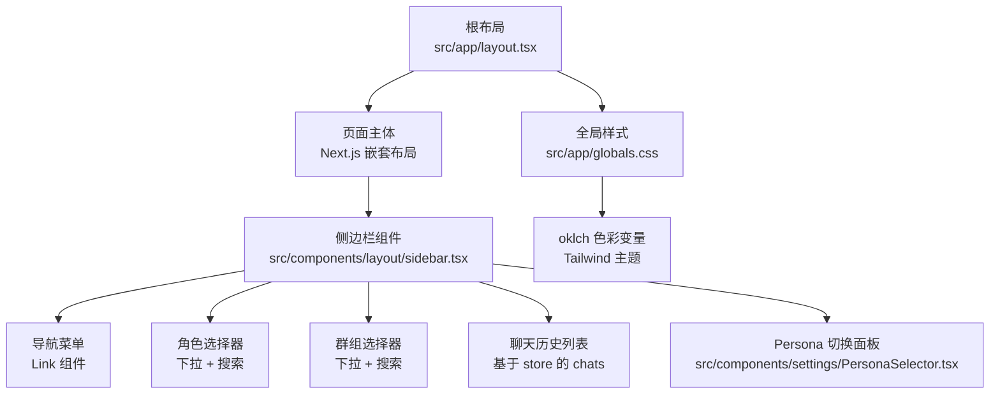
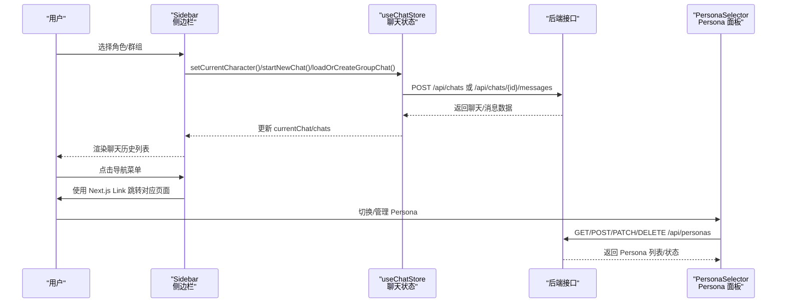
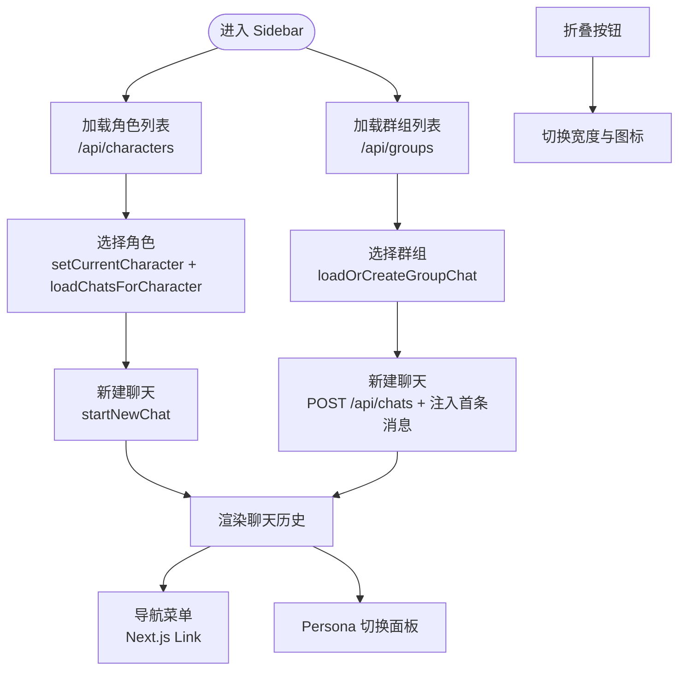
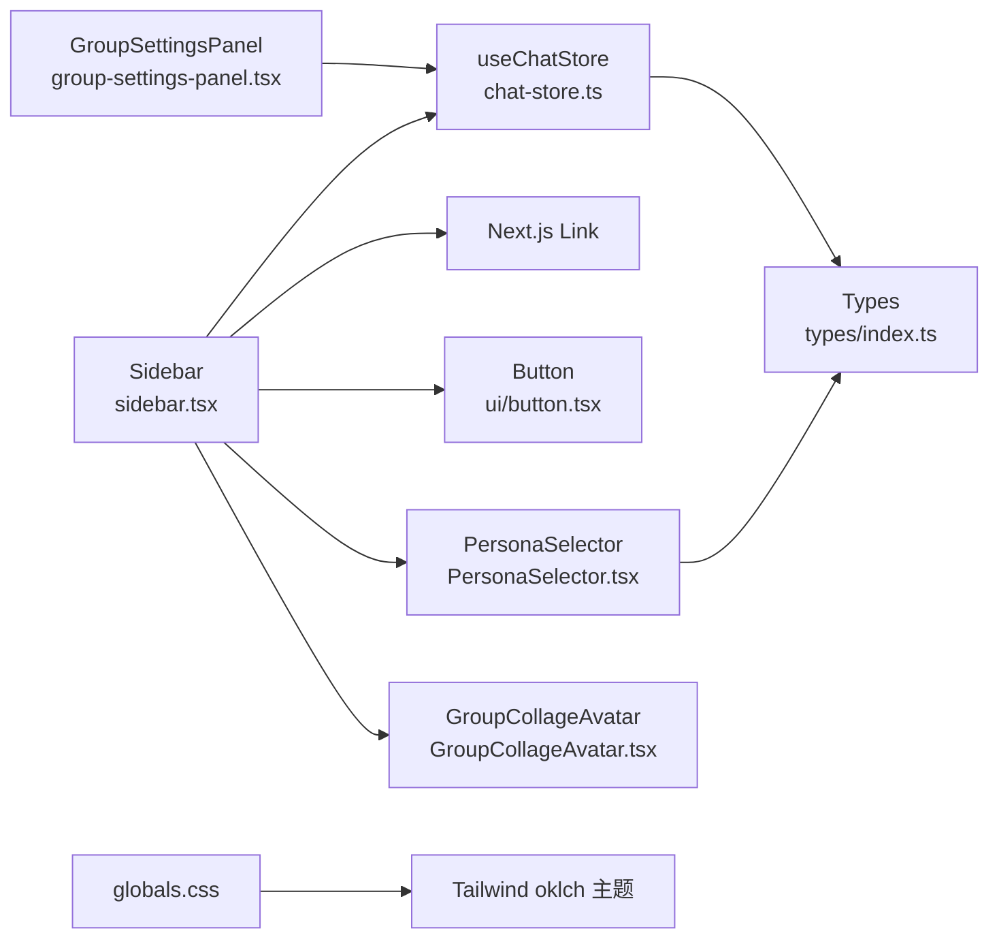

# 布局组件

<cite>
**本文引用的文件**
- [src/app/layout.tsx](file://src/app/layout.tsx)
- [src/app/globals.css](file://src/app/globals.css)
- [src/components/layout/sidebar.tsx](file://src/components/layout/sidebar.tsx)
- [src/components/settings/PersonaSelector.tsx](file://src/components/settings/PersonaSelector.tsx)
- [src/components/groups/GroupCollageAvatar.tsx](file://src/components/groups/GroupCollageAvatar.tsx)
- [src/components/groups/group-settings-panel.tsx](file://src/components/groups/group-settings-panel.tsx)
- [src/components/ui/button.tsx](file://src/components/ui/button.tsx)
- [src/stores/chat-store.ts](file://src/stores/chat-store.ts)
- [src/types/index.ts](file://src/types/index.ts)
- [postcss.config.mjs](file://postcss.config.mjs)
</cite>

## 目录
1. [简介](#简介)
2. [项目结构](#项目结构)
3. [核心组件](#核心组件)
4. [架构总览](#架构总览)
5. [详细组件分析](#详细组件分析)
6. [依赖关系分析](#依赖关系分析)
7. [性能考量](#性能考量)
8. [故障排查指南](#故障排查指南)
9. [结论](#结论)
10. [附录](#附录)

## 简介
本文件聚焦于应用的布局组件体系，特别是侧边栏组件的实现与设计。内容涵盖导航菜单、路由链接、响应式布局、与页面组件的集成方式与状态传递机制，以及自适应设计、主题切换与个性化配置。同时提供扩展与自定义导航的实践指南。

## 项目结构
- 应用根布局负责全局样式与主题注入，页面级布局通过 Next.js App Router 的嵌套布局模型组织。
- 侧边栏作为主界面左侧区域，承载角色/群组选择、聊天历史、导航菜单与 Persona 切换等核心功能。
- 全局样式采用 TailwindCSS 与自定义 oklch 色彩变量，支持暗色/亮色主题与滚动条定制。
- 状态管理通过 Zustand store 实现，侧边栏与聊天列表、角色/群组上下文紧密耦合。

图表来源
- [src/app/layout.tsx:11-23](file://src/app/layout.tsx#L11-L23)
- [src/components/layout/sidebar.tsx:38-319](file://src/components/layout/sidebar.tsx#L38-L319)
- [src/app/globals.css:3-29](file://src/app/globals.css#L3-L29)

章节来源
- [src/app/layout.tsx:1-24](file://src/app/layout.tsx#L1-L24)
- [src/app/globals.css:1-79](file://src/app/globals.css#L1-L79)

## 核心组件
- 根布局 RootLayout：设置站点元信息、根 html 的主题类名与基础样式容器。
- 侧边栏 Sidebar：负责角色/群组选择、聊天历史、导航菜单、Persona 切换与折叠交互。
- PersonaSelector：Persona 的激活/创建/编辑/删除/复制/设为默认等管理面板。
- GroupCollageAvatar：群组成员头像拼贴展示。
- GroupSettingsPanel：群组设置抽屉面板，控制激活策略、生成模式、成员管理等。
- Button：UI 按钮变体，统一风格与尺寸。
- chat-store：Zustand store，维护当前角色、当前聊天、聊天列表与消息操作。
- 类型系统：定义角色、聊天、群组、消息、Persona 等核心数据结构。

章节来源
- [src/components/layout/sidebar.tsx:38-319](file://src/components/layout/sidebar.tsx#L38-L319)
- [src/components/settings/PersonaSelector.tsx:38-301](file://src/components/settings/PersonaSelector.tsx#L38-L301)
- [src/components/groups/GroupCollageAvatar.tsx:87-109](file://src/components/groups/GroupCollageAvatar.tsx#L87-L109)
- [src/components/groups/group-settings-panel.tsx:32-103](file://src/components/groups/group-settings-panel.tsx#L32-L103)
- [src/components/ui/button.tsx:5-49](file://src/components/ui/button.tsx#L5-L49)
- [src/stores/chat-store.ts:105-583](file://src/stores/chat-store.ts#L105-L583)
- [src/types/index.ts:154-286](file://src/types/index.ts#L154-L286)

## 架构总览
侧边栏组件通过状态管理与 API 调用驱动页面行为，形成“选择角色/群组 → 加载聊天 → 展示历史”的闭环。导航菜单使用 Next.js Link 组件进行客户端路由跳转，保持 SPA 导航体验。

图表来源
- [src/components/layout/sidebar.tsx:95-162](file://src/components/layout/sidebar.tsx#L95-L162)
- [src/stores/chat-store.ts:168-321](file://src/stores/chat-store.ts#L168-L321)
- [src/components/settings/PersonaSelector.tsx:54-122](file://src/components/settings/PersonaSelector.tsx#L54-L122)

## 详细组件分析

### 侧边栏组件 Sidebar
- 功能职责
  - 角色与群组二选一模式切换，互斥状态避免冲突。
  - 角色选择器：默认显示当前角色，点击展开浮层并支持搜索过滤。
  - 群组选择器：支持多成员拼贴头像，支持搜索过滤。
  - 聊天历史：根据当前角色或群组渲染对应聊天列表，支持重命名与删除。
  - 导航菜单：固定在底部，使用 Next.js Link 实现客户端路由跳转。
  - Persona 切换：固定在底部，便于快速切换与管理。
  - 折叠交互：通过按钮切换宽度与图标，适配窄屏与节省空间。
- 数据流
  - 通过 useChatStore 管理 currentCharacter/currentChat/chats。
  - 通过 API 接口加载角色/群组/聊天数据，创建新聊天并注入首条消息。
- 响应式与自适应
  - 宽度随 collapsed 状态变化，图标与文字在折叠状态下隐藏。
  - 列表区域使用滚动条与最大高度限制，避免溢出。
- 错误处理
  - 加载失败时记录日志，避免阻塞 UI。
  - 删除确认与输入校验，防止误操作。

图表来源
- [src/components/layout/sidebar.tsx:61-162](file://src/components/layout/sidebar.tsx#L61-L162)
- [src/stores/chat-store.ts:224-321](file://src/stores/chat-store.ts#L224-L321)

章节来源
- [src/components/layout/sidebar.tsx:38-319](file://src/components/layout/sidebar.tsx#L38-L319)
- [src/stores/chat-store.ts:105-583](file://src/stores/chat-store.ts#L105-L583)

### 导航菜单与路由链接
- 导航项定义在 navItems 数组中，包含图标、标签与 href。
- 使用 Next.js Link 组件包裹，实现客户端导航，无需整页刷新。
- 折叠状态下仅显示图标，提升空间利用率。

章节来源
- [src/components/layout/sidebar.tsx:29-36](file://src/components/layout/sidebar.tsx#L29-L36)
- [src/components/layout/sidebar.tsx:302-314](file://src/components/layout/sidebar.tsx#L302-L314)

### 聊天历史与状态传递
- 聊天列表由 useChatStore.chats 提供，Sidebar 在角色或群组切换后动态更新。
- 选择聊天触发 loadChat，更新 currentChat，实现页面内容与侧边栏状态的一致性。
- 支持重命名与删除，调用 renameChat 与 deleteChat，乐观更新与回滚策略确保一致性。

章节来源
- [src/components/layout/sidebar.tsx:232-292](file://src/components/layout/sidebar.tsx#L232-L292)
- [src/stores/chat-store.ts:539-581](file://src/stores/chat-store.ts#L539-L581)

### Persona 切换与个性化配置
- PersonaSelector 提供 Persona 的激活/创建/编辑/删除/复制/设为默认等能力。
- 通过 /api/personas 系列接口与后端交互，支持描述注入位置、深度与角色绑定等个性化配置。
- 下拉面板支持外部点击关闭，表单字段与校验保证数据完整性。

章节来源
- [src/components/settings/PersonaSelector.tsx:38-301](file://src/components/settings/PersonaSelector.tsx#L38-L301)
- [src/types/index.ts:512-523](file://src/types/index.ts#L512-L523)

### 群组头像拼贴与设置面板
- GroupCollageAvatar 将多个成员头像以网格方式拼贴，支持 n=3 与 n≥4 的不同布局。
- GroupSettingsPanel 作为右侧抽屉，提供群组控制、成员管理、添加成员等功能，支持自动模式与延迟配置。

章节来源
- [src/components/groups/GroupCollageAvatar.tsx:87-109](file://src/components/groups/GroupCollageAvatar.tsx#L87-L109)
- [src/components/groups/group-settings-panel.tsx:32-103](file://src/components/groups/group-settings-panel.tsx#L32-L103)

### 主题与自适应设计
- 根布局在 html 上设置主题类名，全局样式通过 oklch 色彩变量定义背景、前景、强调色等。
- TailwindCSS 与 PostCSS 配置启用原子化样式与主题变量解析。
- 侧边栏宽度与图标在折叠状态下自适应，配合滚动条样式优化长列表体验。

章节来源
- [src/app/layout.tsx:17-18](file://src/app/layout.tsx#L17-L18)
- [src/app/globals.css:3-29](file://src/app/globals.css#L3-L29)
- [postcss.config.mjs:1-7](file://postcss.config.mjs#L1-L7)

## 依赖关系分析
- 组件间依赖
  - Sidebar 依赖 useChatStore、Link、Button、PersonaSelector、GroupCollageAvatar。
  - PersonaSelector 依赖 usePersonaStore 与 /api/personas。
  - GroupSettingsPanel 依赖 useChatStore、useGroupGeneration、useGroupAutoMode。
- 外部依赖
  - Next.js Link 用于客户端导航。
  - TailwindCSS 与 oklch 主题变量用于样式与主题。
  - Zustand 用于跨组件状态共享。

图表来源
- [src/components/layout/sidebar.tsx:38-319](file://src/components/layout/sidebar.tsx#L38-L319)
- [src/stores/chat-store.ts:105-583](file://src/stores/chat-store.ts#L105-L583)
- [src/components/settings/PersonaSelector.tsx:38-301](file://src/components/settings/PersonaSelector.tsx#L38-L301)
- [src/components/groups/GroupCollageAvatar.tsx:87-109](file://src/components/groups/GroupCollageAvatar.tsx#L87-L109)
- [src/components/groups/group-settings-panel.tsx:32-103](file://src/components/groups/group-settings-panel.tsx#L32-L103)
- [src/app/globals.css:3-29](file://src/app/globals.css#L3-L29)

## 性能考量
- 列表渲染优化
  - 使用 useMemo 缓存字符/群组映射与过滤结果，减少重复计算。
  - 聊天历史列表使用虚拟滚动或最大高度限制，避免长列表卡顿。
- 状态更新
  - 通过局部状态与 store 分离，避免不必要的重渲染。
  - 乐观更新与异步回写结合，提升交互流畅度。
- 图标与资源
  - 使用 lucide-react 图标，按需引入减少体积。
  - 群组头像拼贴采用 img 标签与对象填充，避免复杂布局计算。

## 故障排查指南
- 角色/群组加载失败
  - 检查 /api/characters 与 /api/groups 的网络请求状态与返回格式。
  - 确认返回数据为数组或包含 data 字段的对象。
- 新建聊天无首条消息
  - 确认角色/群组的 firstMessage 是否存在，以及注入接口 /api/chats/{id}/messages 的返回。
- 聊天历史为空
  - 确认 loadChatsForCharacter/loadChatsForGroup 的调用是否成功，store 中 chats 是否更新。
- Persona 切换无效
  - 检查 /api/personas 的激活/创建/更新接口返回，确认 usePersonaStore 的同步。
- 折叠状态异常
  - 检查 collapsed 状态切换逻辑与样式类名拼接。

章节来源
- [src/components/layout/sidebar.tsx:61-92](file://src/components/layout/sidebar.tsx#L61-L92)
- [src/stores/chat-store.ts:168-321](file://src/stores/chat-store.ts#L168-L321)
- [src/components/settings/PersonaSelector.tsx:54-122](file://src/components/settings/PersonaSelector.tsx#L54-L122)

## 结论
侧边栏组件通过清晰的状态分层与 API 集成，实现了角色/群组切换、聊天历史管理、导航与个性化配置的统一入口。其响应式设计与主题系统提升了可用性与可访问性。建议在扩展时遵循现有状态管理模式与类型约束，确保新增功能与既有流程无缝衔接。

## 附录
- 扩展方法与自定义导航
  - 新增导航项：在 navItems 中添加图标、标签与 href，确保 Link 路由有效。
  - 自定义角色/群组选择器：复用 CharacterPicker/GroupPicker 的搜索与下拉模式，扩展筛选条件。
  - 状态扩展：在 useChatStore 中增加新动作，保持与 API 的契约一致。
  - 主题与样式：通过 globals.css 的 oklch 变量与 Tailwind 主题扩展，统一视觉语言。