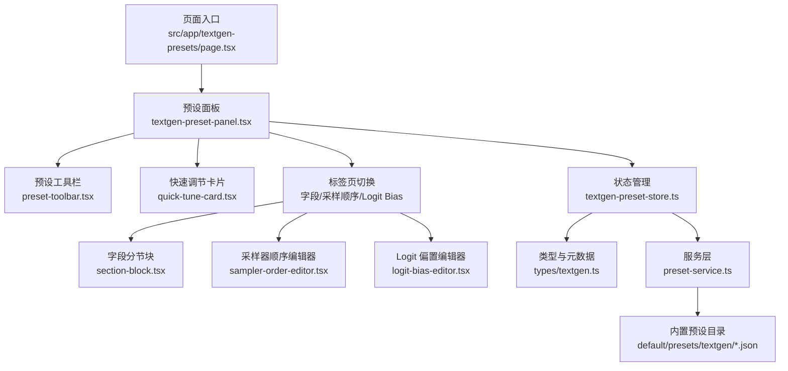
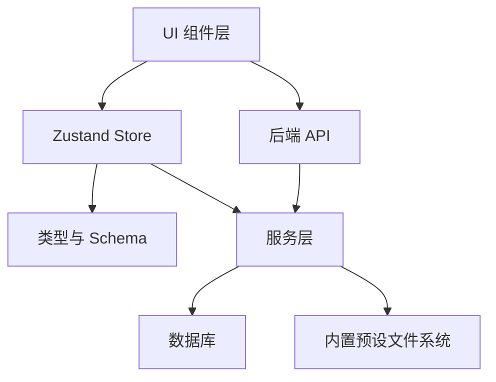
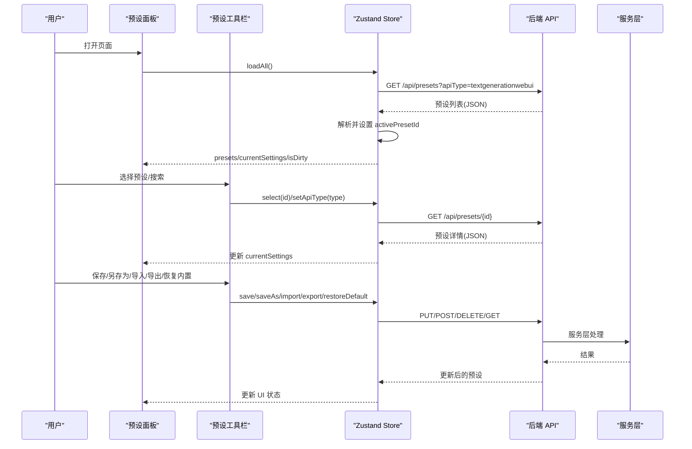
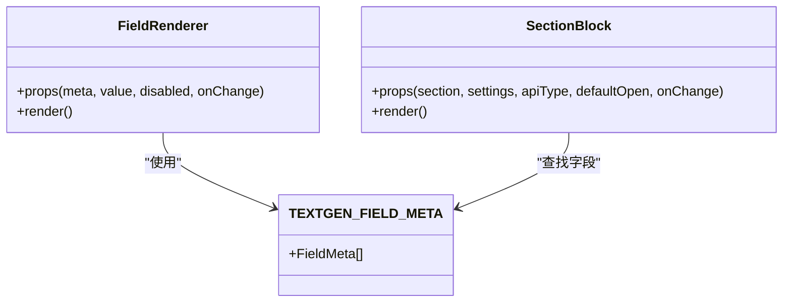
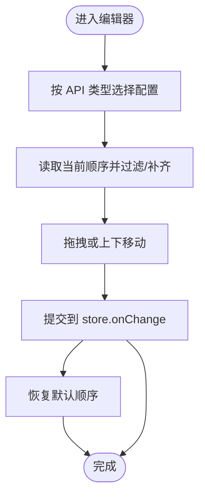
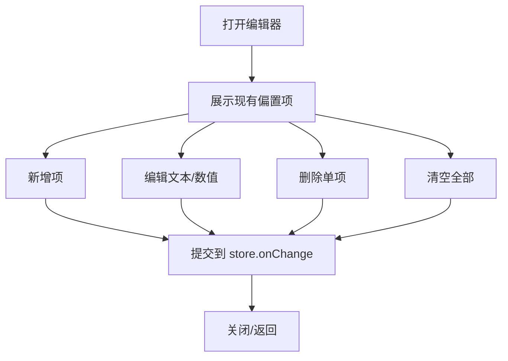
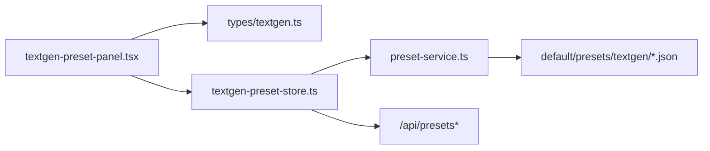

# 文本生成预设组件

<cite>
**本文引用的文件**
- [src/app/textgen-presets/page.tsx](file://src/app/textgen-presets/page.tsx)
- [src/components/textgen-preset/textgen-preset-panel.tsx](file://src/components/textgen-preset/textgen-preset-panel.tsx)
- [src/components/textgen-preset/field-renderer.tsx](file://src/components/textgen-preset/field-renderer.tsx)
- [src/components/textgen-preset/section-block.tsx](file://src/components/textgen-preset/section-block.tsx)
- [src/components/textgen-preset/sampler-order-editor.tsx](file://src/components/textgen-preset/sampler-order-editor.tsx)
- [src/components/textgen-preset/logit-bias-editor.tsx](file://src/components/textgen-preset/logit-bias-editor.tsx)
- [src/components/textgen-preset/quick-tune-card.tsx](file://src/components/textgen-preset/quick-tune-card.tsx)
- [src/components/textgen-preset/preset-toolbar.tsx](file://src/components/textgen-preset/preset-toolbar.tsx)
- [src/components/textgen-preset/master-dialog.tsx](file://src/components/textgen-preset/master-dialog.tsx)
- [src/stores/textgen-preset-store.ts](file://src/stores/textgen-preset-store.ts)
- [src/types/textgen.ts](file://src/types/textgen.ts)
- [src/lib/services/preset-service.ts](file://src/lib/services/preset-service.ts)
- [default/presets/textgen/Default.json](file://default/presets/textgen/Default.json)
- [default/presets/textgen/Universal-Creative.json](file://default/presets/textgen/Universal-Creative.json)
</cite>

## 目录
1. [简介](#简介)
2. [项目结构](#项目结构)
3. [核心组件](#核心组件)
4. [架构总览](#架构总览)
5. [详细组件分析](#详细组件分析)
6. [依赖关系分析](#依赖关系分析)
7. [性能考量](#性能考量)
8. [故障排查指南](#故障排查指南)
9. [结论](#结论)
10. [附录](#附录)

## 简介
本文件系统性梳理“文本生成预设组件”的前端架构与实现，涵盖字段渲染器、逻辑偏差编辑器、主对话框、预设工具栏、采样器顺序编辑器、快速调节卡片以及分节块组件。文档同时阐述预设面板的组织结构与参数管理机制，包含预设的导入导出、模板化配置与参数优化策略，并提供调优最佳实践与性能监控方法。

## 项目结构
- 页面入口负责挂载预设面板组件，面板组件协调工具栏、分节块、编辑器等子组件。
- 预设状态通过 Zustand store 统一管理，后端接口提供 CRUD、激活、导入导出与内置恢复能力。
- 类型系统定义了 74 个字段的完整 schema、字段元数据与分节信息，保证 UI 与数据的一致性与双向兼容。

图表来源
- [src/app/textgen-presets/page.tsx:1-10](file://src/app/textgen-presets/page.tsx#L1-L10)
- [src/components/textgen-preset/textgen-preset-panel.tsx:21-145](file://src/components/textgen-preset/textgen-preset-panel.tsx#L21-L145)
- [src/components/textgen-preset/preset-toolbar.tsx:13-290](file://src/components/textgen-preset/preset-toolbar.tsx#L13-L290)
- [src/components/textgen-preset/quick-tune-card.tsx:17-61](file://src/components/textgen-preset/quick-tune-card.tsx#L17-L61)
- [src/components/textgen-preset/section-block.tsx:22-81](file://src/components/textgen-preset/section-block.tsx#L22-L81)
- [src/components/textgen-preset/sampler-order-editor.tsx:117-264](file://src/components/textgen-preset/sampler-order-editor.tsx#L117-L264)
- [src/components/textgen-preset/logit-bias-editor.tsx:17-111](file://src/components/textgen-preset/logit-bias-editor.tsx#L17-L111)
- [src/stores/textgen-preset-store.ts:85-376](file://src/stores/textgen-preset-store.ts#L85-L376)
- [src/types/textgen.ts:240-388](file://src/types/textgen.ts#L240-L388)
- [src/lib/services/preset-service.ts:140-323](file://src/lib/services/preset-service.ts#L140-L323)
- [default/presets/textgen/Default.json:1-122](file://default/presets/textgen/Default.json#L1-L122)

章节来源
- [src/app/textgen-presets/page.tsx:1-10](file://src/app/textgen-presets/page.tsx#L1-L10)
- [src/components/textgen-preset/textgen-preset-panel.tsx:21-145](file://src/components/textgen-preset/textgen-preset-panel.tsx#L21-L145)

## 核心组件
- 预设面板：承载整体布局、标签页、高频快速调节卡片与错误/加载状态。
- 预设工具栏：API 类型切换、预设选择与搜索、主操作（保存/另存为/重命名/设为激活/重置改动）、数据操作（导出/导入/恢复内置/主预设包）。
- 字段渲染器：根据字段元数据动态渲染数值、布尔、下拉、文本域、字符串、JSON 等控件。
- 分节块：13 个字段分区的折叠容器，按布尔与非布尔两类布局。
- 采样器顺序编辑器：按 API 类型选择不同的顺序字段，支持拖拽与上下移动，提供默认顺序恢复。
- Logit 偏置编辑器：支持增删改与清空，文本支持字符串或 token id。
- 快速调节卡片：将高频核采样器字段前置展示，降低滚动成本。
- 主预设包对话框：批量导出/导入多段（文本补全、Instruct、Context、Sysprompt、Reasoning、SRW）。

章节来源
- [src/components/textgen-preset/textgen-preset-panel.tsx:21-145](file://src/components/textgen-preset/textgen-preset-panel.tsx#L21-L145)
- [src/components/textgen-preset/preset-toolbar.tsx:13-290](file://src/components/textgen-preset/preset-toolbar.tsx#L13-L290)
- [src/components/textgen-preset/field-renderer.tsx:13-185](file://src/components/textgen-preset/field-renderer.tsx#L13-L185)
- [src/components/textgen-preset/section-block.tsx:22-81](file://src/components/textgen-preset/section-block.tsx#L22-L81)
- [src/components/textgen-preset/sampler-order-editor.tsx:117-264](file://src/components/textgen-preset/sampler-order-editor.tsx#L117-L264)
- [src/components/textgen-preset/logit-bias-editor.tsx:17-111](file://src/components/textgen-preset/logit-bias-editor.tsx#L17-L111)
- [src/components/textgen-preset/quick-tune-card.tsx:17-61](file://src/components/textgen-preset/quick-tune-card.tsx#L17-L61)
- [src/components/textgen-preset/master-dialog.tsx:30-234](file://src/components/textgen-preset/master-dialog.tsx#L30-L234)

## 架构总览
- 状态层：Zustand store 提供 CRUD、激活、导入导出、内置恢复、dirty 标记与加载/保存状态。
- 类型层：Zod schema 定义 74 字段与扩展字段，字段元数据与分节信息驱动 UI。
- 服务层：Node/Drizzle 服务封装数据库访问、内置预设读取、默认预设种子与激活一致性。
- UI 层：元编程渲染字段、折叠分节、顺序编辑、偏置编辑与工具栏操作。

图表来源
- [src/stores/textgen-preset-store.ts:85-376](file://src/stores/textgen-preset-store.ts#L85-L376)
- [src/types/textgen.ts:113-234](file://src/types/textgen.ts#L113-L234)
- [src/lib/services/preset-service.ts:140-323](file://src/lib/services/preset-service.ts#L140-L323)

## 详细组件分析

### 预设面板与工具栏
- 面板负责加载预设列表、维护当前编辑设置、脏检查与错误提示；顶部工具栏提供 API 类型切换、预设搜索、主操作与数据操作。
- 工具栏内含“恢复内置”弹窗与“主预设包”对话框，后者支持多段聚合导入/导出。

图表来源
- [src/components/textgen-preset/textgen-preset-panel.tsx:32-49](file://src/components/textgen-preset/textgen-preset-panel.tsx#L32-L49)
- [src/components/textgen-preset/preset-toolbar.tsx:14-290](file://src/components/textgen-preset/preset-toolbar.tsx#L14-L290)
- [src/stores/textgen-preset-store.ts:101-137](file://src/stores/textgen-preset-store.ts#L101-L137)
- [src/stores/textgen-preset-store.ts:139-153](file://src/stores/textgen-preset-store.ts#L139-L153)
- [src/stores/textgen-preset-store.ts:179-205](file://src/stores/textgen-preset-store.ts#L179-L205)
- [src/stores/textgen-preset-store.ts:207-234](file://src/stores/textgen-preset-store.ts#L207-L234)
- [src/stores/textgen-preset-store.ts:322-350](file://src/stores/textgen-preset-store.ts#L322-L350)
- [src/stores/textgen-preset-store.ts:352-370](file://src/stores/textgen-preset-store.ts#L352-L370)
- [src/lib/services/preset-service.ts:140-178](file://src/lib/services/preset-service.ts#L140-L178)
- [src/lib/services/preset-service.ts:257-287](file://src/lib/services/preset-service.ts#L257-L287)

章节来源
- [src/components/textgen-preset/textgen-preset-panel.tsx:21-145](file://src/components/textgen-preset/textgen-preset-panel.tsx#L21-L145)
- [src/components/textgen-preset/preset-toolbar.tsx:13-290](file://src/components/textgen-preset/preset-toolbar.tsx#L13-L290)

### 字段渲染器与分节块
- 字段渲染器根据字段类型渲染滑块/输入框、复选框、下拉框、文本域、字符串输入与 JSON 编辑器，并支持禁用态与提示气泡。
- 分节块将字段按布尔与非布尔两类布局，支持折叠/展开与提示信息。

图表来源
- [src/components/textgen-preset/field-renderer.tsx:13-185](file://src/components/textgen-preset/field-renderer.tsx#L13-L185)
- [src/components/textgen-preset/section-block.tsx:22-81](file://src/components/textgen-preset/section-block.tsx#L22-L81)
- [src/types/textgen.ts:240-388](file://src/types/textgen.ts#L240-L388)

章节来源
- [src/components/textgen-preset/field-renderer.tsx:13-185](file://src/components/textgen-preset/field-renderer.tsx#L13-L185)
- [src/components/textgen-preset/section-block.tsx:22-81](file://src/components/textgen-preset/section-block.tsx#L22-L81)
- [src/types/textgen.ts:240-388](file://src/types/textgen.ts#L240-L388)

### 采样器顺序编辑器
- 根据 API 类型选择不同的顺序字段（如 sampler_priority、samplers、samplers_priorities、sampler_order），并提供拖拽排序与上下移动。
- 支持恢复默认顺序，缺失项自动补齐，多余项自动剔除。

图表来源
- [src/components/textgen-preset/sampler-order-editor.tsx:75-115](file://src/components/textgen-preset/sampler-order-editor.tsx#L75-L115)
- [src/components/textgen-preset/sampler-order-editor.tsx:117-264](file://src/components/textgen-preset/sampler-order-editor.tsx#L117-L264)
- [src/types/textgen.ts:47-104](file://src/types/textgen.ts#L47-L104)

章节来源
- [src/components/textgen-preset/sampler-order-editor.tsx:117-264](file://src/components/textgen-preset/sampler-order-editor.tsx#L117-L264)
- [src/types/textgen.ts:47-104](file://src/types/textgen.ts#L47-L104)

### Logit 偏置编辑器
- 支持新增、删除、清空与逐项编辑，文本支持普通字符串或单个 token id，数值为 bias 值。

图表来源
- [src/components/textgen-preset/logit-bias-editor.tsx:17-111](file://src/components/textgen-preset/logit-bias-editor.tsx#L17-L111)
- [src/types/textgen.ts:105-111](file://src/types/textgen.ts#L105-L111)

章节来源
- [src/components/textgen-preset/logit-bias-editor.tsx:17-111](file://src/components/textgen-preset/logit-bias-editor.tsx#L17-L111)
- [src/types/textgen.ts:105-111](file://src/types/textgen.ts#L105-L111)

### 快速调节卡片
- 将高频核采样器字段前置展示，减少滚动与定位成本，提升调优效率。

章节来源
- [src/components/textgen-preset/quick-tune-card.tsx:17-61](file://src/components/textgen-preset/quick-tune-card.tsx#L17-L61)

### 主预设包对话框
- 支持多段聚合导出/导入，按段识别并写入对应类型；导出时按当前激活预设打包，导入后重载列表并可触发额外回调。

章节来源
- [src/components/textgen-preset/master-dialog.tsx:30-234](file://src/components/textgen-preset/master-dialog.tsx#L30-L234)

## 依赖关系分析
- 组件依赖类型系统提供的字段元数据与分节信息，确保 UI 与 schema 一致。
- Store 依赖服务层进行持久化与内置预设读取，后端 API 提供 CRUD 与激活控制。
- 内置预设位于 default/presets/textgen，与服务层的目录映射一致。

图表来源
- [src/components/textgen-preset/textgen-preset-panel.tsx:5-11](file://src/components/textgen-preset/textgen-preset-panel.tsx#L5-L11)
- [src/stores/textgen-preset-store.ts:1-10](file://src/stores/textgen-preset-store.ts#L1-L10)
- [src/lib/services/preset-service.ts:95-101](file://src/lib/services/preset-service.ts#L95-L101)
- [default/presets/textgen/Default.json:1-122](file://default/presets/textgen/Default.json#L1-L122)

章节来源
- [src/types/textgen.ts:240-388](file://src/types/textgen.ts#L240-L388)
- [src/stores/textgen-preset-store.ts:85-376](file://src/stores/textgen-preset-store.ts#L85-L376)
- [src/lib/services/preset-service.ts:95-101](file://src/lib/services/preset-service.ts#L95-L101)
- [default/presets/textgen/Default.json:1-122](file://default/presets/textgen/Default.json#L1-L122)

## 性能考量
- 状态更新粒度：store 使用 setField 局部更新，避免全量替换导致的重渲染。
- 渲染优化：分节块按布尔/非布尔两类布局，减少 DOM 体积；快速调节卡片前置高频字段。
- 拖拽排序：顺序编辑器采用数组浅拷贝与索引交换，提交时一次性写入，避免频繁 re-render。
- 数据校验：schema 解析在 store 初始化与导入时进行，异常时回退默认值，保障 UI 稳定性。
- I/O 优化：主预设包导出使用服务端直链下载，减少前端内存压力。

## 故障排查指南
- 无法加载预设：检查后端响应与网络状态，store 中 error 字段会记录错误信息。
- 保存失败：确认 activePresetId 存在且 isDirty 为真；查看保存状态 saving 与错误提示。
- 导入失败：确认 JSON 格式正确，服务端返回的错误信息会显示在弹窗或控制台。
- 字段不可用：某些字段在特定 API 类型下不支持，渲染器会禁用并提示。
- 内置恢复：若同名预设已存在则覆盖 settings，否则新建；可通过列出默认名称确认可用项。

章节来源
- [src/components/textgen-preset/textgen-preset-panel.tsx:80-84](file://src/components/textgen-preset/textgen-preset-panel.tsx#L80-L84)
- [src/stores/textgen-preset-store.ts:131-134](file://src/stores/textgen-preset-store.ts#L131-L134)
- [src/stores/textgen-preset-store.ts:179-205](file://src/stores/textgen-preset-store.ts#L179-L205)
- [src/stores/textgen-preset-store.ts:322-350](file://src/stores/textgen-preset-store.ts#L322-L350)
- [src/types/textgen.ts:262-267](file://src/types/textgen.ts#L262-L267)

## 结论
该组件体系以类型驱动 UI、以 store 统一状态、以服务层对接数据库与内置预设，形成高内聚、低耦合的文本生成参数配置方案。通过分节块、快速调节卡片与顺序/偏置编辑器，用户可在统一界面下完成复杂的采样参数调优，并借助导入导出与主预设包实现跨设备与团队共享。

## 附录

### 预设面板组织结构与参数管理机制
- 组织结构：顶部工具栏 + 快速调节卡片 + 标签页（字段/采样顺序/Logit Bias）+ 分节块/编辑器。
- 参数管理：store 提供 setField/setSettings/replaceSettings/resetToActive，配合 schema 校验与默认值回退，确保参数一致性。

章节来源
- [src/components/textgen-preset/textgen-preset-panel.tsx:97-141](file://src/components/textgen-preset/textgen-preset-panel.tsx#L97-L141)
- [src/stores/textgen-preset-store.ts:155-168](file://src/stores/textgen-preset-store.ts#L155-L168)

### 预设导入导出与模板化配置
- 单预设导入/导出：通过 store 的 importFromJson/exportJson 实现，支持文件选择与 Blob 下载。
- 主预设包：支持多段聚合导入/导出，按段识别并写入对应类型，适合模板化配置与批量迁移。
- 内置恢复：按 API 类型列出内置预设名称，支持覆盖或新建。

章节来源
- [src/stores/textgen-preset-store.ts:322-350](file://src/stores/textgen-preset-store.ts#L322-L350)
- [src/stores/textgen-preset-store.ts:352-370](file://src/stores/textgen-preset-store.ts#L352-L370)
- [src/components/textgen-preset/master-dialog.tsx:48-71](file://src/components/textgen-preset/master-dialog.tsx#L48-L71)
- [src/components/textgen-preset/preset-toolbar.tsx:87-91](file://src/components/textgen-preset/preset-toolbar.tsx#L87-L91)

### 参数优化策略与最佳实践
- 基础采样优先：先调整温度与核采样（Top P/Top K/Min P），再引入重复惩罚与 DRY。
- 动态温度：在需要稳定性与多样性平衡时启用，设置合理上下界与指数。
- 采样顺序：将重复惩罚置于靠前位置，有助于抑制循环；温度/TopK/TopP 等按需求微调。
- Logit Bias：谨慎使用，建议从少量正负样本开始试验，逐步收敛。
- 生成控制：根据场景选择是否启用流式输出、EOS 策略与特殊 Token 处理。
- 性能监控：结合后端日志与前端错误提示，关注保存/导入耗时与 UI 响应延迟。

章节来源
- [src/types/textgen.ts:273-388](file://src/types/textgen.ts#L273-L388)
- [src/components/textgen-preset/sampler-order-editor.tsx:186-190](file://src/components/textgen-preset/sampler-order-editor.tsx#L186-L190)
- [src/components/textgen-preset/logit-bias-editor.tsx:44-46](file://src/components/textgen-preset/logit-bias-editor.tsx#L44-L46)

### 示例预设参考
- 默认预设与创意风格预设展示了不同采样参数组合，可作为调优起点。

章节来源
- [default/presets/textgen/Default.json:1-122](file://default/presets/textgen/Default.json#L1-L122)
- [default/presets/textgen/Universal-Creative.json:1-120](file://default/presets/textgen/Universal-Creative.json#L1-L120)