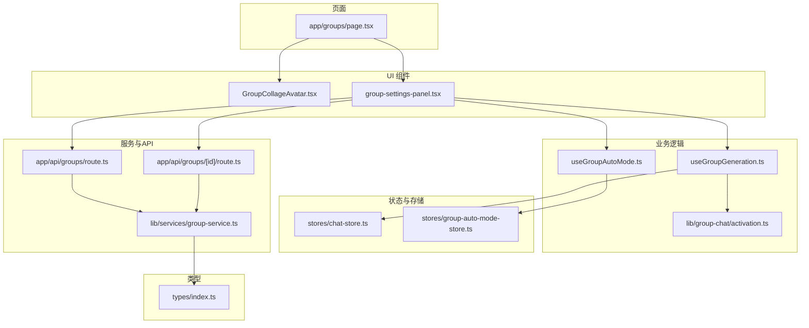
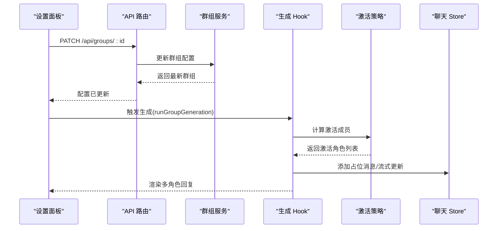
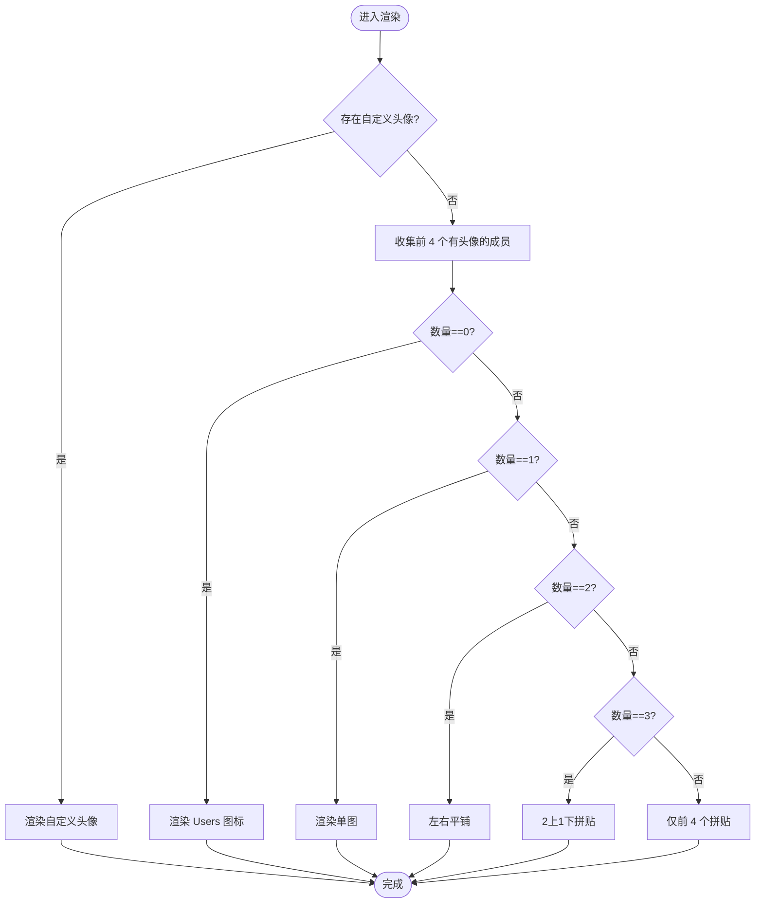
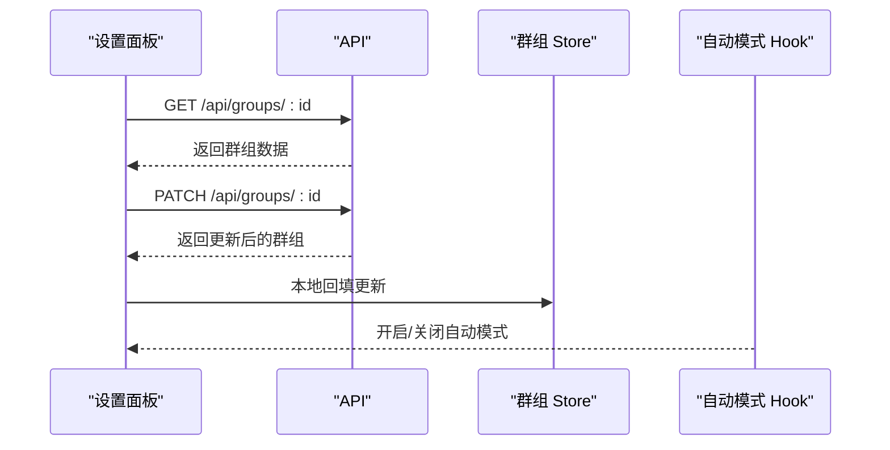
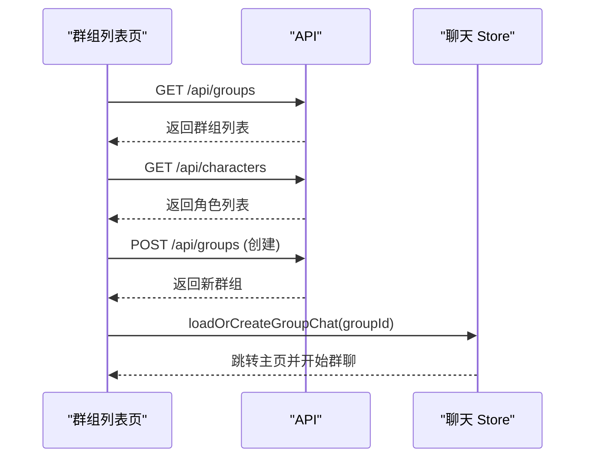
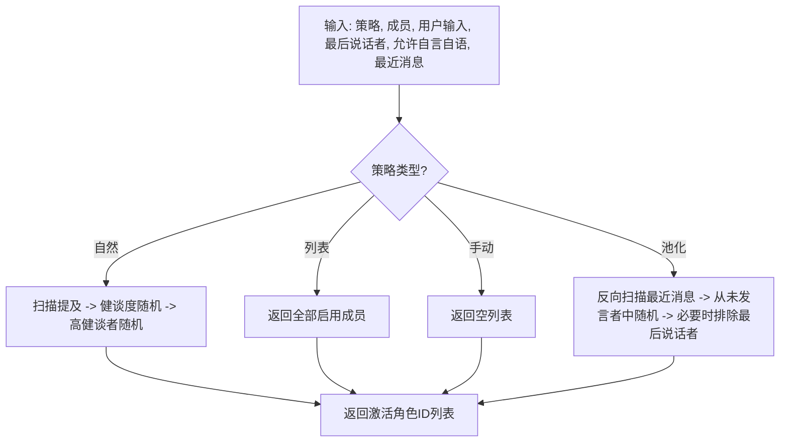
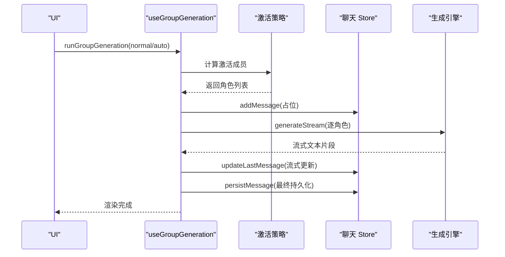
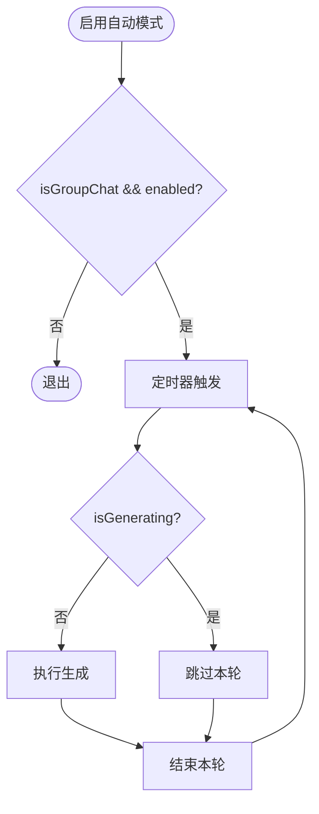
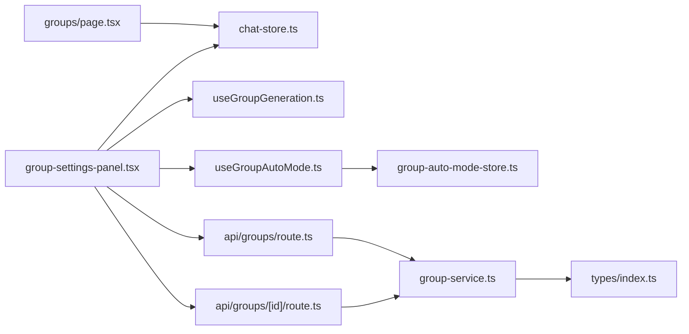

# 群组聊天组件

<cite>
**本文档引用的文件**
- [src/components/groups/GroupCollageAvatar.tsx](file://src/components/groups/GroupCollageAvatar.tsx)
- [src/components/groups/group-settings-panel.tsx](file://src/components/groups/group-settings-panel.tsx)
- [src/app/groups/page.tsx](file://src/app/groups/page.tsx)
- [src/hooks/useGroupAutoMode.ts](file://src/hooks/useGroupAutoMode.ts)
- [src/hooks/useGroupGeneration.ts](file://src/hooks/useGroupGeneration.ts)
- [src/lib/group-chat/activation.ts](file://src/lib/group-chat/activation.ts)
- [src/stores/group-auto-mode-store.ts](file://src/stores/group-auto-mode-store.ts)
- [src/types/index.ts](file://src/types/index.ts)
- [src/app/api/groups/route.ts](file://src/app/api/groups/route.ts)
- [src/app/api/groups/[id]/route.ts](file://src/app/api/groups/[id]/route.ts)
- [src/lib/services/group-service.ts](file://src/lib/services/group-service.ts)
- [src/stores/chat-store.ts](file://src/stores/chat-store.ts)
</cite>

## 目录
1. [简介](#简介)
2. [项目结构](#项目结构)
3. [核心组件](#核心组件)
4. [架构总览](#架构总览)
5. [详细组件分析](#详细组件分析)
6. [依赖关系分析](#依赖关系分析)
7. [性能考量](#性能考量)
8. [故障排查指南](#故障排查指南)
9. [结论](#结论)
10. [附录](#附录)

## 简介
本文件系统性梳理群组聊天组件的实现，覆盖以下方面：
- 群组头像拼贴组件的设计与渲染策略
- 群组设置面板的配置项、成员管理与权限控制
- 群组聊天的激活策略、生成模式与消息分发机制
- 自动模式与状态同步的实现细节
- 群组设置的配置项、模板选择与生成策略管理
- 交互设计与用户体验优化建议

## 项目结构
群组聊天相关代码主要分布在以下模块：
- UI 组件层：群组头像拼贴与设置面板
- 页面层：群组列表与创建页面
- 业务逻辑层：激活策略与生成流程
- 存储与状态：Zustand store、全局自动模式开关
- 服务与 API：群组 CRUD 与鉴权
- 类型定义：群组、聊天、消息等核心类型

**图表来源**
- [src/app/groups/page.tsx:1-261](file://src/app/groups/page.tsx#L1-L261)
- [src/components/groups/GroupCollageAvatar.tsx:1-110](file://src/components/groups/GroupCollageAvatar.tsx#L1-L110)
- [src/components/groups/group-settings-panel.tsx:1-318](file://src/components/groups/group-settings-panel.tsx#L1-L318)
- [src/hooks/useGroupAutoMode.ts:1-62](file://src/hooks/useGroupAutoMode.ts#L1-L62)
- [src/hooks/useGroupGeneration.ts:1-738](file://src/hooks/useGroupGeneration.ts#L1-L738)
- [src/lib/group-chat/activation.ts:1-191](file://src/lib/group-chat/activation.ts#L1-L191)
- [src/stores/chat-store.ts:1-200](file://src/stores/chat-store.ts#L1-L200)
- [src/stores/group-auto-mode-store.ts:1-18](file://src/stores/group-auto-mode-store.ts#L1-L18)
- [src/app/api/groups/route.ts:1-34](file://src/app/api/groups/route.ts#L1-L34)
- [src/app/api/groups/[id]/route.ts:1-55](file://src/app/api/groups/[id]/route.ts#L1-L55)
- [src/lib/services/group-service.ts:1-174](file://src/lib/services/group-service.ts#L1-L174)
- [src/types/index.ts:270-286](file://src/types/index.ts#L270-L286)

**章节来源**
- [src/app/groups/page.tsx:1-261](file://src/app/groups/page.tsx#L1-L261)
- [src/components/groups/GroupCollageAvatar.tsx:1-110](file://src/components/groups/GroupCollageAvatar.tsx#L1-L110)
- [src/components/groups/group-settings-panel.tsx:1-318](file://src/components/groups/group-settings-panel.tsx#L1-L318)
- [src/hooks/useGroupAutoMode.ts:1-62](file://src/hooks/useGroupAutoMode.ts#L1-L62)
- [src/hooks/useGroupGeneration.ts:1-738](file://src/hooks/useGroupGeneration.ts#L1-L738)
- [src/lib/group-chat/activation.ts:1-191](file://src/lib/group-chat/activation.ts#L1-L191)
- [src/stores/chat-store.ts:1-200](file://src/stores/chat-store.ts#L1-L200)
- [src/stores/group-auto-mode-store.ts:1-18](file://src/stores/group-auto-mode-store.ts#L1-L18)
- [src/app/api/groups/route.ts:1-34](file://src/app/api/groups/route.ts#L1-L34)
- [src/app/api/groups/[id]/route.ts:1-55](file://src/app/api/groups/[id]/route.ts#L1-L55)
- [src/lib/services/group-service.ts:1-174](file://src/lib/services/group-service.ts#L1-L174)
- [src/types/index.ts:270-286](file://src/types/index.ts#L270-L286)

## 核心组件
- 群组头像拼贴组件：根据成员数量与自定义头像，渲染 1/2/3/4 个头像的拼贴布局，无头像时回退为 Users 图标。
- 群组设置面板：提供名称、头像、激活策略、生成模式、Join 前缀/后缀、允许自言自语、隐藏静音、自动模式延迟与收藏/删除等配置。
- 群组列表页面：创建群组、打开群聊、删除群组、展示成员与激活/生成模式标签、最近聊天时间等。

**章节来源**
- [src/components/groups/GroupCollageAvatar.tsx:19-110](file://src/components/groups/GroupCollageAvatar.tsx#L19-L110)
- [src/components/groups/group-settings-panel.tsx:32-103](file://src/components/groups/group-settings-panel.tsx#L32-L103)
- [src/app/groups/page.tsx:36-261](file://src/app/groups/page.tsx#L36-L261)

## 架构总览
群组聊天的端到端流程如下：
- 页面层负责渲染群组列表与设置面板
- 设置面板通过 API 读取/更新群组配置
- 生成 Hook 负责计算激活成员、构建角色卡与历史、调用生成引擎并流式更新 UI
- 自动模式 Hook 周期性触发生成，避免与进行中的生成冲突
- 状态通过 Zustand store 管理，消息持久化与回写由 chat-store 协调

**图表来源**
- [src/components/groups/group-settings-panel.tsx:58-68](file://src/components/groups/group-settings-panel.tsx#L58-L68)
- [src/app/api/groups/[id]/route.ts:18-38](file://src/app/api/groups/[id]/route.ts#L18-L38)
- [src/lib/services/group-service.ts:133-159](file://src/lib/services/group-service.ts#L133-L159)
- [src/hooks/useGroupGeneration.ts:450-691](file://src/hooks/useGroupGeneration.ts#L450-L691)
- [src/lib/group-chat/activation.ts:169-191](file://src/lib/group-chat/activation.ts#L169-L191)
- [src/stores/chat-store.ts:114-150](file://src/stores/chat-store.ts#L114-L150)

## 详细组件分析

### 群组头像拼贴组件
- 设计目标：在有限空间内展示群组头像，优先使用自定义头像；否则使用前 1~4 个成员头像拼贴；全无头像时显示 Users 图标。
- 渲染策略：
  - 自定义头像存在时，直接渲染单一大头像
  - 0 个头像：Users 图标
  - 1 个头像：单图
  - 2 个头像：左右平铺
  - 3 个头像：左上、右上、下方宽图
  - ≥4 个头像：仅拼贴前 4 个
- 性能与可访问性：使用 CSS 圆角裁剪与对象填充，避免图片变形；title 属性提供可选标题。

**图表来源**
- [src/components/groups/GroupCollageAvatar.tsx:25-109](file://src/components/groups/GroupCollageAvatar.tsx#L25-L109)

**章节来源**
- [src/components/groups/GroupCollageAvatar.tsx:19-110](file://src/components/groups/GroupCollageAvatar.tsx#L19-L110)

### 群组设置面板
- 功能概览：
  - 控制区：名称、头像上传/恢复、激活策略、生成模式、Join 前缀/后缀、允许自言自语、隐藏静音、自动模式开关与延迟、收藏/删除
  - 成员区：搜索、上下移动、启用/静音、强制发言、移除成员
  - 添加区：搜索候选成员并加入
- 数据流：
  - 初始化：并发拉取群组与角色列表
  - 实时更新：PATCH 请求即时更新后本地回填
  - 成员操作：本地变更 + 后端同步
- 自动模式：独立的全局开关 store，仅在群聊且开启时启动定时器，避免与生成冲突

**图表来源**
- [src/components/groups/group-settings-panel.tsx:43-56](file://src/components/groups/group-settings-panel.tsx#L43-L56)
- [src/components/groups/group-settings-panel.tsx:58-68](file://src/components/groups/group-settings-panel.tsx#L58-L68)
- [src/hooks/useGroupAutoMode.ts:24-60](file://src/hooks/useGroupAutoMode.ts#L24-L60)

**章节来源**
- [src/components/groups/group-settings-panel.tsx:32-318](file://src/components/groups/group-settings-panel.tsx#L32-L318)
- [src/stores/group-auto-mode-store.ts:13-17](file://src/stores/group-auto-mode-store.ts#L13-L17)

### 群组列表页面
- 功能概览：
  - 创建群组：输入名称与成员集合，提交后刷新列表
  - 打开群聊：加载或创建群组聊天，必要时注入首个启用成员的首条消息
  - 删除群组：确认后删除并刷新
  - 展示：头像拼贴、成员数与成员名、激活/生成模式标签、最近聊天时间
- 交互细节：成员搜索、多选、动态头像映射、时间格式化

**图表来源**
- [src/app/groups/page.tsx:47-57](file://src/app/groups/page.tsx#L47-L57)
- [src/app/groups/page.tsx:76-95](file://src/app/groups/page.tsx#L76-L95)
- [src/stores/chat-store.ts:42-49](file://src/stores/chat-store.ts#L42-L49)

**章节来源**
- [src/app/groups/page.tsx:36-261](file://src/app/groups/page.tsx#L36-L261)

### 激活策略与生成模式
- 激活策略：
  - 自然：提及角色名优先，否则按健谈度随机，最后从高健谈者中随机
  - 列表：按成员顺序全部轮流
  - 手动：不自动激活，需强制发言
  - 池化：避免重复，从未发言者中选，必要时排除上一轮最后说话者
- 生成模式：
  - 替换：逐角色独立生成
  - 追加：合并所有成员角色卡字段生成
  - 追加（含禁用）：合并所有成员，但禁用成员仅在自身为当前说话者时保留

**图表来源**
- [src/lib/group-chat/activation.ts:59-191](file://src/lib/group-chat/activation.ts#L59-L191)

**章节来源**
- [src/lib/group-chat/activation.ts:10-34](file://src/lib/group-chat/activation.ts#L10-L34)
- [src/lib/group-chat/activation.ts:59-191](file://src/lib/group-chat/activation.ts#L59-L191)

### 生成流程与消息分发
- 流程要点：
  - normal/auto：持久化用户消息（如有）、计算激活成员、为每个激活角色添加占位消息、流式生成并更新最后一条消息、最终持久化
  - continue/swipe：续写或流式重生成，保持原内容并追加
  - impersonate：以某个启用成员视角代笔写用户回复，使用 APPEND 合并上下文
  - 截断：检测其他角色对话并截断，避免串角
- 历史构建：将用户消息、当前角色自己的回复、其他角色的回复分别映射为 user/assistant/system，避免混淆
- World Info：聚合全局与聊天级世界书 ID，构建生成请求的上下文

**图表来源**
- [src/hooks/useGroupGeneration.ts:450-691](file://src/hooks/useGroupGeneration.ts#L450-L691)
- [src/lib/group-chat/activation.ts:169-191](file://src/lib/group-chat/activation.ts#L169-L191)
- [src/stores/chat-store.ts:114-150](file://src/stores/chat-store.ts#L114-L150)

**章节来源**
- [src/hooks/useGroupGeneration.ts:276-447](file://src/hooks/useGroupGeneration.ts#L276-L447)
- [src/hooks/useGroupGeneration.ts:450-691](file://src/hooks/useGroupGeneration.ts#L450-L691)

### 自动模式与状态同步
- 自动模式：
  - 仅在 isGroupChat 且 enabled 时启动定时器
  - 每轮先检查 isGenerating，避免与正在进行的生成冲突
  - 使用 AbortController，关闭时立即中止
- 状态同步：
  - 设置面板中的自动模式开关与全局 store 同步
  - 生成 Hook 在每次生成前拉取最新群组配置，确保面板修改即时生效

**图表来源**
- [src/hooks/useGroupAutoMode.ts:24-60](file://src/hooks/useGroupAutoMode.ts#L24-L60)
- [src/stores/group-auto-mode-store.ts:13-17](file://src/stores/group-auto-mode-store.ts#L13-L17)

**章节来源**
- [src/hooks/useGroupAutoMode.ts:1-62](file://src/hooks/useGroupAutoMode.ts#L1-L62)
- [src/stores/group-auto-mode-store.ts:1-18](file://src/stores/group-auto-mode-store.ts#L1-L18)

### 群组设置的配置项、模板选择与生成策略管理
- 配置项：
  - 名称、头像（支持上传自定义头像或恢复拼贴）、激活策略、生成模式、Join 前缀/后缀、允许自言自语、隐藏静音、自动模式延迟、收藏
- 模板选择：
  - 通过角色卡字段合并策略实现模板化上下文（APPEND/APPEND_DISABLED）
- 生成策略管理：
  - 通过激活策略与生成模式组合，实现自然/列表/手动/池化的不同协作方式

**章节来源**
- [src/components/groups/group-settings-panel.tsx:114-214](file://src/components/groups/group-settings-panel.tsx#L114-L214)
- [src/hooks/useGroupGeneration.ts:170-257](file://src/hooks/useGroupGeneration.ts#L170-L257)
- [src/lib/group-chat/activation.ts:10-34](file://src/lib/group-chat/activation.ts#L10-L34)

## 依赖关系分析
- 组件耦合：
  - 群组设置面板依赖 chat-store、useGroupGeneration、useGroupAutoMode、group-auto-mode-store
  - 群组列表依赖 chat-store 的 loadOrCreateGroupChat
- 外部依赖：
  - API 路由与服务层：Next.js App Router 与 Drizzle ORM
  - 类型系统：统一的 Group/Chat/Message 类型定义

**图表来源**
- [src/components/groups/group-settings-panel.tsx:10-13](file://src/components/groups/group-settings-panel.tsx#L10-L13)
- [src/app/groups/page.tsx:38-106](file://src/app/groups/page.tsx#L38-L106)
- [src/app/api/groups/route.ts:1-34](file://src/app/api/groups/route.ts#L1-L34)
- [src/app/api/groups/[id]/route.ts:1-55](file://src/app/api/groups/[id]/route.ts#L1-L55)
- [src/lib/services/group-service.ts:1-174](file://src/lib/services/group-service.ts#L1-L174)
- [src/types/index.ts:270-286](file://src/types/index.ts#L270-L286)

**章节来源**
- [src/components/groups/group-settings-panel.tsx:10-13](file://src/components/groups/group-settings-panel.tsx#L10-L13)
- [src/app/groups/page.tsx:38-106](file://src/app/groups/page.tsx#L38-L106)
- [src/app/api/groups/route.ts:1-34](file://src/app/api/groups/route.ts#L1-L34)
- [src/app/api/groups/[id]/route.ts:1-55](file://src/app/api/groups/[id]/route.ts#L1-L55)
- [src/lib/services/group-service.ts:1-174](file://src/lib/services/group-service.ts#L1-L174)
- [src/types/index.ts:270-286](file://src/types/index.ts#L270-L286)

## 性能考量
- 渲染优化：
  - 头像拼贴组件仅在必要时渲染图片，避免多余 DOM
  - 使用 useMemo 缓存成员筛选与排序结果
- 生成优化：
  - 流式更新减少重排，截断逻辑避免无效输出
  - 自动模式轮询间隔最小化，避免频繁请求
- 存储与网络：
  - 并发拉取群组与角色列表，减少等待时间
  - PATCH 请求后本地回填，避免二次请求

[本节为通用指导，无需特定文件来源]

## 故障排查指南
- 无法打开群组聊天：
  - 检查 chat-store 的 loadOrCreateGroupChat 是否正确调用
  - 确认后端返回的群组与角色数据结构一致
- 生成异常或中断：
  - 查看 isGenerating 状态是否被正确设置
  - 确认 AbortController 是否在关闭时正确中止
- 自动模式无效：
  - 确认 isGroupChat 与 enabled 均为真
  - 检查定时器是否被清理
- 面板配置未生效：
  - 确认 PATCH 请求成功并本地回填
  - 生成前是否重新拉取了最新群组配置

**章节来源**
- [src/stores/chat-store.ts:114-150](file://src/stores/chat-store.ts#L114-L150)
- [src/hooks/useGroupAutoMode.ts:24-60](file://src/hooks/useGroupAutoMode.ts#L24-L60)
- [src/hooks/useGroupGeneration.ts:450-691](file://src/hooks/useGroupGeneration.ts#L450-L691)

## 结论
群组聊天组件通过清晰的职责划分与完善的生命周期管理，实现了：
- 直观的群组头像拼贴与设置面板
- 灵活的激活策略与生成模式组合
- 稳定的自动模式与状态同步
- 可扩展的配置项与模板化上下文

建议在后续迭代中进一步增强：
- 更丰富的头像拼贴样式与动画
- 成员权限分级与角色分配的可视化
- 生成日志与错误追踪的可视化面板
- 群组聊天的导出与分享能力

[本节为总结性内容，无需特定文件来源]

## 附录
- 类型定义：Group/Chat/Message 等核心类型定义，确保前后端一致性
- API 规范：群组 CRUD 的鉴权与校验规则
- 服务层：数据库操作与序列化逻辑

**章节来源**
- [src/types/index.ts:270-286](file://src/types/index.ts#L270-L286)
- [src/app/api/groups/route.ts:14-33](file://src/app/api/groups/route.ts#L14-L33)
- [src/app/api/groups/[id]/route.ts:18-54](file://src/app/api/groups/[id]/route.ts#L18-L54)
- [src/lib/services/group-service.ts:66-85](file://src/lib/services/group-service.ts#L66-L85)