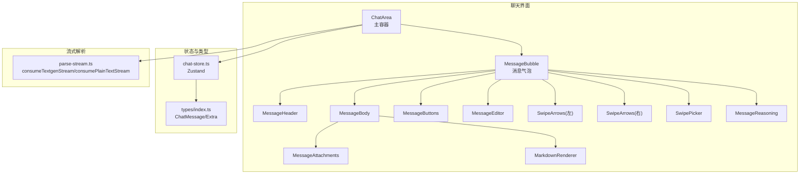
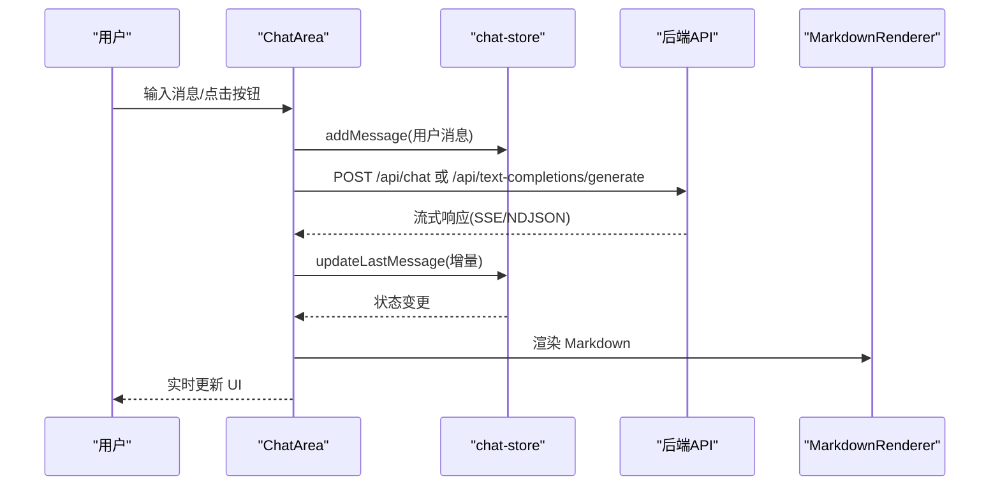
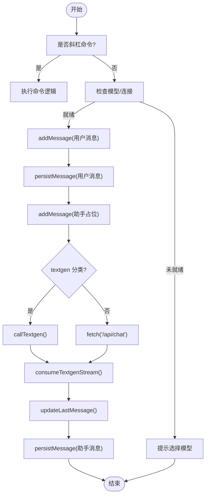
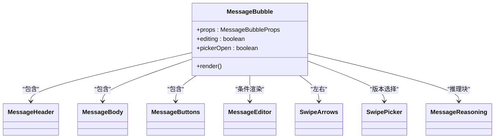
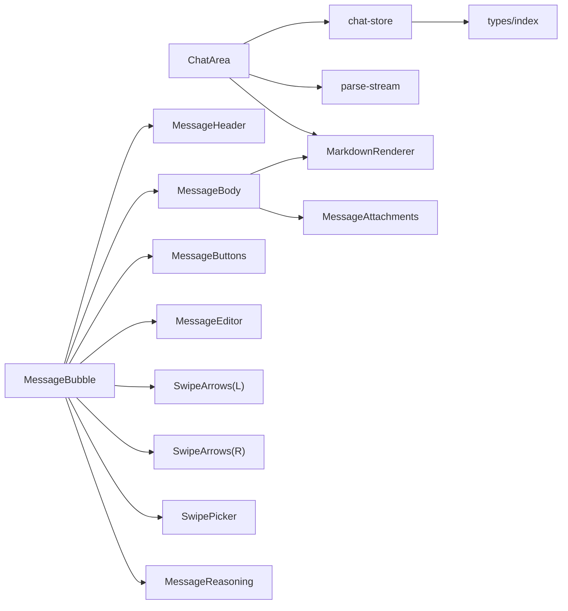

# 聊天组件模块

<cite>
**本文引用的文件**
- [chat-area.tsx](file://src/components/chat/chat-area.tsx)
- [MessageBubble.tsx](file://src/components/chat/message-bubble/MessageBubble.tsx)
- [MessageBody.tsx](file://src/components/chat/message-bubble/MessageBody.tsx)
- [MessageHeader.tsx](file://src/components/chat/message-bubble/MessageHeader.tsx)
- [MessageButtons.tsx](file://src/components/chat/message-bubble/MessageButtons.tsx)
- [MessageEditor.tsx](file://src/components/chat/message-bubble/MessageEditor.tsx)
- [MarkdownRenderer.tsx](file://src/components/chat/markdown/MarkdownRenderer.tsx)
- [SwipeArrows.tsx](file://src/components/chat/message-bubble/SwipeArrows.tsx)
- [SwipePicker.tsx](file://src/components/chat/message-bubble/SwipePicker.tsx)
- [MessageReasoning.tsx](file://src/components/chat/message-bubble/MessageReasoning.tsx)
- [MessageAttachments.tsx](file://src/components/chat/MessageAttachments.tsx)
- [chat-store.ts](file://src/stores/chat-store.ts)
- [index.ts](file://src/types/index.ts)
- [parse-stream.ts](file://src/lib/textgen/parse-stream.ts)
</cite>

## 目录
1. [简介](#简介)
2. [项目结构](#项目结构)
3. [核心组件](#核心组件)
4. [架构总览](#架构总览)
5. [详细组件分析](#详细组件分析)
6. [依赖关系分析](#依赖关系分析)
7. [性能考量](#性能考量)
8. [故障排查指南](#故障排查指南)
9. [结论](#结论)
10. [附录](#附录)

## 简介
本文件系统性梳理聊天组件模块的架构与实现，重点覆盖：
- ChatArea 主容器：消息流式生成、斜杠命令、搜索、多选、附件拖拽、群聊分支与重生成等
- MessageBubble 消息气泡组件及其子组件：MessageHeader、MessageBody、MessageButtons、MessageEditor、MessageReasoning、SwipeArrows、SwipePicker
- Markdown 渲染器：插件链、自定义组件映射与安全策略
- 消息交互：编辑、删除、回复、分支/书签、推理块、附件上传与预览
- 状态管理：Zustand chat-store 的本地/远程同步、swipe 版本管理
- 实时更新：SSE/NDJSON 流式解析与 UI 即时反馈

## 项目结构
聊天组件位于 src/components/chat 及其子目录，配合 src/stores、src/types、src/lib 等模块协同工作。

图示来源
- [chat-area.tsx:1-1800](file://src/components/chat/chat-area.tsx#L1-L1800)
- [MessageBubble.tsx:1-280](file://src/components/chat/message-bubble/MessageBubble.tsx#L1-L280)
- [MessageBody.tsx:1-109](file://src/components/chat/message-bubble/MessageBody.tsx#L1-L109)
- [MessageHeader.tsx:1-100](file://src/components/chat/message-bubble/MessageHeader.tsx#L1-L100)
- [MessageButtons.tsx:1-274](file://src/components/chat/message-bubble/MessageButtons.tsx#L1-L274)
- [MessageEditor.tsx:1-139](file://src/components/chat/message-bubble/MessageEditor.tsx#L1-L139)
- [MarkdownRenderer.tsx:1-202](file://src/components/chat/markdown/MarkdownRenderer.tsx#L1-L202)
- [SwipeArrows.tsx:1-95](file://src/components/chat/message-bubble/SwipeArrows.tsx#L1-L95)
- [SwipePicker.tsx:1-129](file://src/components/chat/message-bubble/SwipePicker.tsx#L1-L129)
- [MessageReasoning.tsx:1-65](file://src/components/chat/message-bubble/MessageReasoning.tsx#L1-L65)
- [MessageAttachments.tsx:1-151](file://src/components/chat/MessageAttachments.tsx#L1-L151)
- [chat-store.ts:1-583](file://src/stores/chat-store.ts#L1-L583)
- [index.ts:58-140](file://src/types/index.ts#L58-L140)
- [parse-stream.ts:1-116](file://src/lib/textgen/parse-stream.ts#L1-L116)

章节来源
- [chat-area.tsx:1-1800](file://src/components/chat/chat-area.tsx#L1-L1800)
- [MessageBubble.tsx:1-280](file://src/components/chat/message-bubble/MessageBubble.tsx#L1-L280)
- [chat-store.ts:1-583](file://src/stores/chat-store.ts#L1-L583)
- [index.ts:58-140](file://src/types/index.ts#L58-L140)

## 核心组件
- ChatArea：负责输入处理、斜杠命令、连接状态、构建提示词、调用后端、流式消费、滚动与搜索、附件拖拽、多选、群聊分支与重生成
- MessageBubble：消息卡片容器，协调头/体/按钮/编辑/推理/滑动版本等子组件
- MessageHeader/Body/Buttons/Editor：分别承担消息头部元信息、正文渲染与折叠、操作按钮组、编辑态交互
- MarkdownRenderer：基于 remark/rehype 的 Markdown 渲染管线，支持 GFM、换行、数学公式、可选 raw HTML
- SwipeArrows/SwipePicker：左右滑动切换与版本选择器
- MessageReasoning：推理块（details）折叠/展开
- MessageAttachments：图片内联预览、文本片段展开、通用文件信息卡、拖拽覆盖层
- chat-store：Zustand 状态，统一管理当前聊天、消息列表、swipe 版本、分支/书签、消息移动、持久化等

章节来源
- [chat-area.tsx:34-683](file://src/components/chat/chat-area.tsx#L34-L683)
- [MessageBubble.tsx:60-233](file://src/components/chat/message-bubble/MessageBubble.tsx#L60-L233)
- [MessageHeader.tsx:33-98](file://src/components/chat/message-bubble/MessageHeader.tsx#L33-L98)
- [MessageBody.tsx:34-108](file://src/components/chat/message-bubble/MessageBody.tsx#L34-L108)
- [MessageButtons.tsx:47-212](file://src/components/chat/message-bubble/MessageButtons.tsx#L47-L212)
- [MessageEditor.tsx:24-110](file://src/components/chat/message-bubble/MessageEditor.tsx#L24-L110)
- [MarkdownRenderer.tsx:34-198](file://src/components/chat/markdown/MarkdownRenderer.tsx#L34-L198)
- [SwipeArrows.tsx:30-93](file://src/components/chat/message-bubble/SwipeArrows.tsx#L30-L93)
- [SwipePicker.tsx:21-126](file://src/components/chat/message-bubble/SwipePicker.tsx#L21-L126)
- [MessageReasoning.tsx:32-62](file://src/components/chat/message-bubble/MessageReasoning.tsx#L32-L62)
- [MessageAttachments.tsx:37-150](file://src/components/chat/MessageAttachments.tsx#L37-L150)
- [chat-store.ts:105-582](file://src/stores/chat-store.ts#L105-L582)

## 架构总览
聊天组件采用“容器 + 组合子”的分层设计：
- ChatArea 作为顶层容器，聚合输入、搜索、附件、斜杠命令、流式生成、群聊分支等能力
- MessageBubble 作为消息卡片，组合 Header、Body、Buttons、Editor、Reasoning、Swipe 系列组件
- MarkdownRenderer 作为渲染引擎，承载富文本与数学公式
- chat-store 通过本地状态与后端 API 双向同步，支撑消息 CRUD、swipe 版本、分支/书签、消息移动等

图示来源
- [chat-area.tsx:533-683](file://src/components/chat/chat-area.tsx#L533-L683)
- [chat-store.ts:114-130](file://src/stores/chat-store.ts#L114-L130)
- [parse-stream.ts:38-99](file://src/lib/textgen/parse-stream.ts#L38-L99)
- [MarkdownRenderer.tsx:169-198](file://src/components/chat/markdown/MarkdownRenderer.tsx#L169-L198)

## 详细组件分析

### ChatArea 主容器
职责与特性
- 输入与提交：处理斜杠命令、连接状态校验、用户消息即时插入、助手消息占位、流式消费与持久化
- 流式生成：根据配置选择 textgen 或标准聊天 API，解析 SSE/NDJSON，增量更新最后一条助手消息
- 搜索：支持 Ctrl+F 唤出、查询匹配、索引高亮与跳转
- 多选：批量复制/导出/删除
- 附件：文件选择、拖拽覆盖层、预览与发送时写入 message.extra.files
- 群聊：根据 currentChat.groupId 自动识别，走多角色生成或整批重生
- 命令系统：/help、/clear、/sys、/name、/branch、/tts、/roll、/hide、/unhide、/continue、/impersonate、/go、/setvar、/getvar、/note、/model、/token、/export

图示来源
- [chat-area.tsx:533-683](file://src/components/chat/chat-area.tsx#L533-L683)
- [chat-area.tsx:329-518](file://src/components/chat/chat-area.tsx#L329-L518)
- [chat-area.tsx:251-298](file://src/components/chat/chat-area.tsx#L251-L298)
- [parse-stream.ts:38-99](file://src/lib/textgen/parse-stream.ts#L38-L99)

章节来源
- [chat-area.tsx:34-683](file://src/components/chat/chat-area.tsx#L34-L683)

### MessageBubble 消息气泡
职责与特性
- 统一消息卡片布局：头/体/按钮/编辑/推理/左右 swipe 控件
- 头像与多选：支持角色头像、用户头像、多选框
- Swipe 系统：左箭头（prev）、右箭头（next/overflow）、计数器（total>1 时弹出选择器）
- 编辑态：进入/退出编辑、保存/取消、复制、删除、上下移动、添加推理块
- 书签与系统消息：系统消息半透明、书签左侧边框
- 交互回调：复制、编辑、删除、隐藏、重生成、分支、书签、翻译、朗读、生成图片、上下移动、添加推理

图示来源
- [MessageBubble.tsx:60-233](file://src/components/chat/message-bubble/MessageBubble.tsx#L60-L233)
- [MessageHeader.tsx:33-98](file://src/components/chat/message-bubble/MessageHeader.tsx#L33-L98)
- [MessageBody.tsx:34-108](file://src/components/chat/message-bubble/MessageBody.tsx#L34-L108)
- [MessageButtons.tsx:47-212](file://src/components/chat/message-bubble/MessageButtons.tsx#L47-L212)
- [MessageEditor.tsx:24-110](file://src/components/chat/message-bubble/MessageEditor.tsx#L24-L110)
- [SwipeArrows.tsx:30-93](file://src/components/chat/message-bubble/SwipeArrows.tsx#L30-L93)
- [SwipePicker.tsx:21-126](file://src/components/chat/message-bubble/SwipePicker.tsx#L21-L126)
- [MessageReasoning.tsx:32-62](file://src/components/chat/message-bubble/MessageReasoning.tsx#L32-L62)

章节来源
- [MessageBubble.tsx:60-233](file://src/components/chat/message-bubble/MessageBubble.tsx#L60-L233)

### MessageHeader 消息头
职责与特性
- 名称、Ghost 图标（系统消息）、时间戳格式化
- 元信息：token 数、TTFT、推理耗时、模型/API
- 按钮区：编辑/复制/重生成（最后一条）、更多操作菜单

章节来源
- [MessageHeader.tsx:33-98](file://src/components/chat/message-bubble/MessageHeader.tsx#L33-L98)

### MessageBody 正文
职责与特性
- Markdown 渲染：基于 ReactMarkdown + remarkGfm/remarkBreaks/remarkMath + rehypeRaw/rehypeKatex
- 流式光标：生成中显示闪烁光标
- 长文本折叠：字符/行数阈值控制、展开/收起按钮、渐变遮罩
- 附件展示：message.extra.files
- Bias 区域：message.extra.bias

章节来源
- [MessageBody.tsx:34-108](file://src/components/chat/message-bubble/MessageBody.tsx#L34-L108)
- [MarkdownRenderer.tsx:34-198](file://src/components/chat/markdown/MarkdownRenderer.tsx#L34-L198)

### MessageButtons 操作按钮
职责与特性
- 主按钮：重生成（最后一条）、复制、编辑（禁用生成中）
- 更多操作：包含/排除到 Prompt、分支、书签、翻译、朗读、生成图片、删除
- 下拉菜单：鼠标离开自动关闭

章节来源
- [MessageButtons.tsx:47-212](file://src/components/chat/message-bubble/MessageButtons.tsx#L47-L212)

### MessageEditor 编辑态
职责与特性
- 可调整高度的 textarea、快捷键（Ctrl/⌘+Enter 保存、Esc 取消、F2）
- 保存/取消/复制/添加推理/上下移动/删除
- 自动聚焦与光标定位至末尾

章节来源
- [MessageEditor.tsx:24-110](file://src/components/chat/message-bubble/MessageEditor.tsx#L24-L110)

### MarkdownRenderer 渲染器
职责与特性
- 插件链：remarkGfm、remarkBreaks、remarkMath；可选 rehypeRaw（对齐原项目 messageFormatting）
- 自定义组件映射：a/code/pre/table/blockquote/hr/ul/ol/h1-3/img 等
- 安全策略：链接 target="_blank" rel="noopener noreferrer nofollow"
- 紧凑模式：reasoning 等小区域使用 compact

章节来源
- [MarkdownRenderer.tsx:34-198](file://src/components/chat/markdown/MarkdownRenderer.tsx#L34-L198)

### SwipeArrows 与 SwipePicker
职责与特性
- 左箭头：prev（首个版本隐藏）
- 右箭头：next；若为最后一个版本，点击触发 overflow（重新生成）
- 计数器：total>1 时显示 activeIndex/total，点击弹出选择器
- SwipePicker：列表展示所有版本、选择激活、删除（至少保留 1）

章节来源
- [SwipeArrows.tsx:30-93](file://src/components/chat/message-bubble/SwipeArrows.tsx#L30-L93)
- [SwipePicker.tsx:21-126](file://src/components/chat/message-bubble/SwipePicker.tsx#L21-L126)

### MessageReasoning 推理块
职责与特性
- details 折叠/展开，默认流式中展开、结束后折叠
- 格式化耗时显示：秒/分显示
- 内容使用 MarkdownRenderer（compact）

章节来源
- [MessageReasoning.tsx:32-62](file://src/components/chat/message-bubble/MessageReasoning.tsx#L32-L62)

### MessageAttachments 附件
职责与特性
- 图片内联预览：点击放大/缩小
- 文本文件：可展开预览，支持展开/收起
- 通用文件：图标分类（text/image/video/audio/archive/file）、名称/大小/类型
- 拖拽覆盖层：DragOverlay

章节来源
- [MessageAttachments.tsx:37-150](file://src/components/chat/MessageAttachments.tsx#L37-L150)

### chat-store 状态管理
职责与特性
- 本地状态：currentChat、chats、currentCharacter、isGenerating
- 本地动作：addMessage、updateLastMessage、patchMessage、removeMessageLocal、setIsGenerating、setCurrentCharacter、createNewChat
- 异步动作：startNewChat、loadChat、loadChatsForCharacter、loadOrCreateGroupChat、loadChatsForGroup、persistMessage、updateMessage、deleteMessage、setActiveSwipe、appendSwipe、deleteSwipe、setMessageHidden、moveMessage、addEmptyReasoning、createBranch、createBookmark、deleteChat、renameChat
- swipe 版本：维护 swipes/swipeId/swipeInfo，支持切换、追加、删除
- 分支/书签：createBranch/createBookmark，原消息 bookmarkLink 指向新 chat
- 消息移动：与相邻消息互换 createdAt 并并发 PATCH

章节来源
- [chat-store.ts:105-582](file://src/stores/chat-store.ts#L105-L582)

### 数据模型与类型
- ChatMessage：消息主体，含 id、name、isUser、role、content、swipes/swipeId/swipeInfo、isSystem、forceAvatar/originalAvatar、genStarted/genFinished、bookmarkLink、extra、sendDate、createdAt
- MessageExtra：扩展字段，含 gen_id/api/model/type、token_count/reasoning/reasoning_duration/time_to_first_token、bias/title、image/inline_image、files/media、其他运行时状态
- FileAttachment/MediaAttachment：附件类型

章节来源
- [index.ts:58-140](file://src/types/index.ts#L58-L140)

## 依赖关系分析

图示来源
- [chat-area.tsx:34-683](file://src/components/chat/chat-area.tsx#L34-L683)
- [MessageBubble.tsx:60-233](file://src/components/chat/message-bubble/MessageBubble.tsx#L60-L233)
- [chat-store.ts:105-582](file://src/stores/chat-store.ts#L105-L582)
- [index.ts:58-140](file://src/types/index.ts#L58-L140)
- [parse-stream.ts:1-116](file://src/lib/textgen/parse-stream.ts#L1-116)

章节来源
- [chat-area.tsx:34-683](file://src/components/chat/chat-area.tsx#L34-L683)
- [MessageBubble.tsx:60-233](file://src/components/chat/message-bubble/MessageBubble.tsx#L60-L233)
- [chat-store.ts:105-582](file://src/stores/chat-store.ts#L105-L582)

## 性能考量
- 流式渲染：consumeTextgenStream/consumePlainTextStream 逐块回调，避免大字符串拼接压力
- 渲染优化：MarkdownRenderer 使用 memo 包裹，减少重复渲染
- 长文本折叠：MessageBody 对超长内容进行折叠与渐变遮罩，降低 DOM 负担
- 滚动优化：ChatArea 监听容器滚动距离，仅在接近底部时自动滚动，避免频繁强制滚动
- 附件预览：图片懒加载、文本展开按需渲染
- 状态粒度：chat-store 将本地状态与后端同步解耦，局部更新减少重绘范围

## 故障排查指南
- 生成异常
  - 现象：助手消息显示错误提示
  - 排查：检查后端响应状态码与错误信息；确认 activeModel/activeProvider 配置；查看流式解析是否抛错
  - 参考
    - [chat-area.tsx:672-682](file://src/components/chat/chat-area.tsx#L672-L682)
    - [parse-stream.ts:38-99](file://src/lib/textgen/parse-stream.ts#L38-L99)
- 斜杠命令无效
  - 现象：/help 无响应或参数错误
  - 排查：确认输入以 "/" 开头；检查命令分支与 confirm/alert 逻辑
  - 参考
    - [chat-area.tsx:329-518](file://src/components/chat/chat-area.tsx#L329-L518)
- 附件无法上传
  - 现象：拖拽无覆盖层、文件未进入 attachments
  - 排查：检查 dragOver 状态、fileInputRef 与 setAttachments；确认 MessageAttachments 文件类型识别
  - 参考
    - [chat-area.tsx:127-130](file://src/components/chat/chat-area.tsx#L127-L130)
    - [MessageAttachments.tsx:37-150](file://src/components/chat/MessageAttachments.tsx#L37-L150)
- 消息编辑/删除失败
  - 现象：编辑态无法保存、删除后未同步
  - 排查：确认 onEdit/onDelete 回调是否传入；检查 chat-store 的 updateMessage/deleteMessage
  - 参考
    - [MessageBubble.tsx:183-206](file://src/components/chat/message-bubble/MessageBubble.tsx#L183-L206)
    - [chat-store.ts:335-366](file://src/stores/chat-store.ts#L335-L366)
- Swipe 版本异常
  - 现象：切换无效、删除后越界
  - 排查：检查 swipes 数组长度与 swipeId 边界；appendSwipe/deleteSwipe 的边界处理
  - 参考
    - [chat-store.ts:390-452](file://src/stores/chat-store.ts#L390-L452)
    - [SwipeArrows.tsx:30-93](file://src/components/chat/message-bubble/SwipeArrows.tsx#L30-L93)
    - [SwipePicker.tsx:21-126](file://src/components/chat/message-bubble/SwipePicker.tsx#L21-L126)

## 结论
聊天组件模块以 ChatArea 为核心，围绕 MessageBubble 及其子组件构建了完整的消息交互体系，结合 MarkdownRenderer 实现富文本渲染，通过 chat-store 完成本地/远程状态同步与 swipe 版本管理。整体设计具备良好的扩展性与可维护性，适合进一步增强多模态、国际化与无障碍能力。

## 附录

### 组件使用示例（路径指引）
- 在页面中引入 ChatArea 并绑定 useChatStore
  - [chat-area.tsx:34-683](file://src/components/chat/chat-area.tsx#L34-L683)
- 在消息渲染中使用 MessageBubble
  - [MessageBubble.tsx:60-233](file://src/components/chat/message-bubble/MessageBubble.tsx#L60-L233)
- 在编辑态使用 MessageEditor
  - [MessageEditor.tsx:24-110](file://src/components/chat/message-bubble/MessageEditor.tsx#L24-L110)
- 在正文渲染中使用 MarkdownRenderer
  - [MarkdownRenderer.tsx:34-198](file://src/components/chat/markdown/MarkdownRenderer.tsx#L34-L198)
- 在附件展示中使用 MessageAttachments
  - [MessageAttachments.tsx:37-150](file://src/components/chat/MessageAttachments.tsx#L37-L150)

### 扩展开发指南
- 新增消息操作按钮
  - 在 MessageButtons 中添加按钮与菜单项，确保 onXxx 回调传入
  - [MessageButtons.tsx:47-212](file://src/components/chat/message-bubble/MessageButtons.tsx#L47-L212)
- 自定义 Markdown 渲染规则
  - 在 MarkdownRenderer 的 components 映射中增加/修改节点渲染
  - [MarkdownRenderer.tsx:34-198](file://src/components/chat/markdown/MarkdownRenderer.tsx#L34-L198)
- 增强流式解析
  - 在 parse-stream.ts 中扩展 extractToken 以适配新的后端格式
  - [parse-stream.ts:17-36](file://src/lib/textgen/parse-stream.ts#L17-L36)
- 管理 swipe 版本
  - 使用 chat-store 的 appendSwipe/deleteSwipe/setActiveSwipe 管理版本
  - [chat-store.ts:390-452](file://src/stores/chat-store.ts#L390-L452)