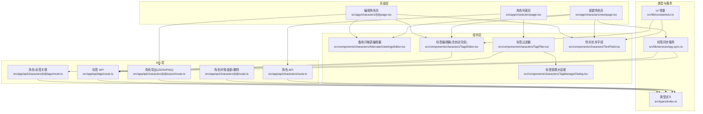
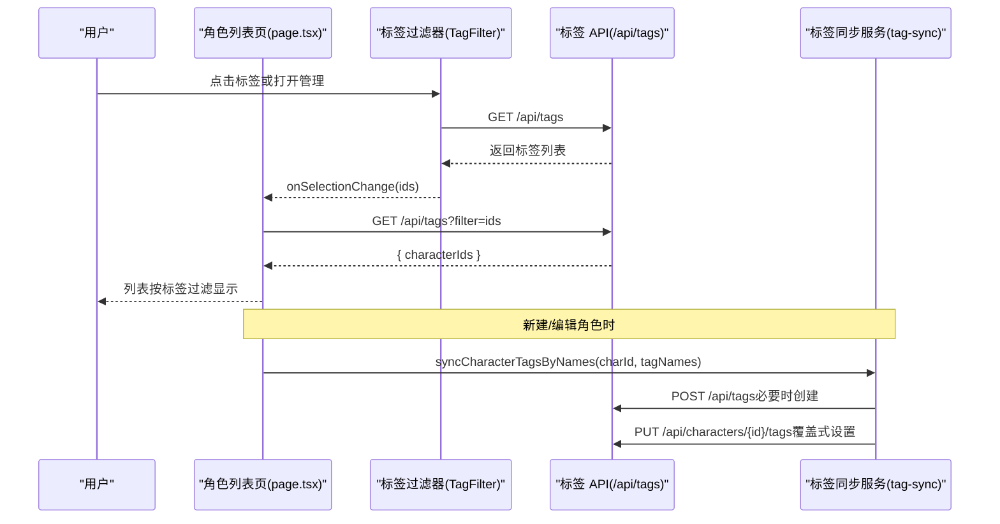
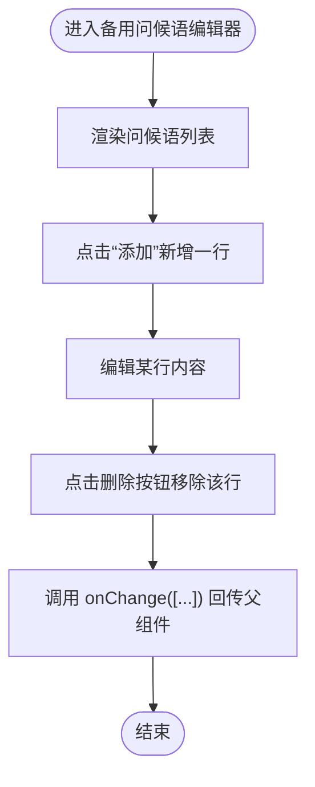
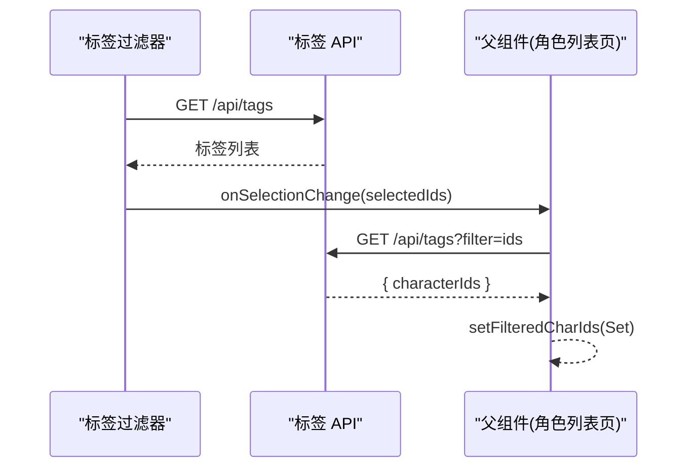
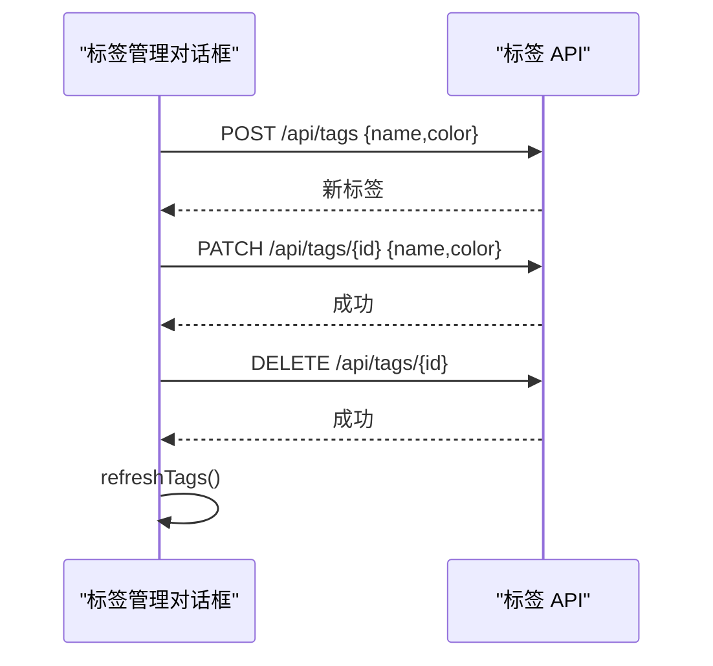
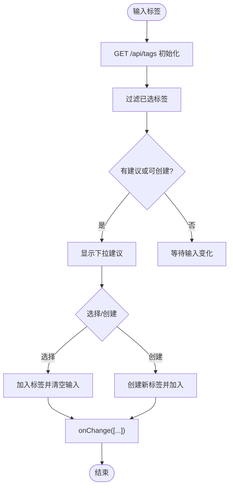
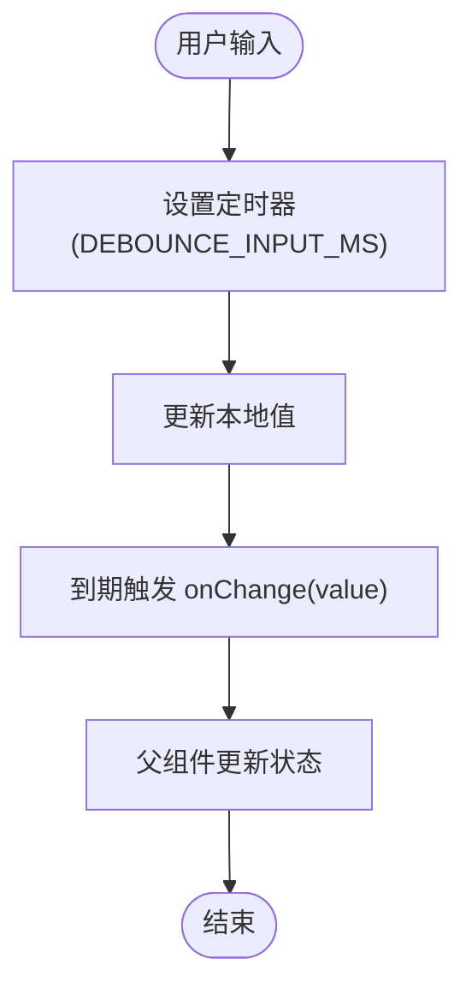
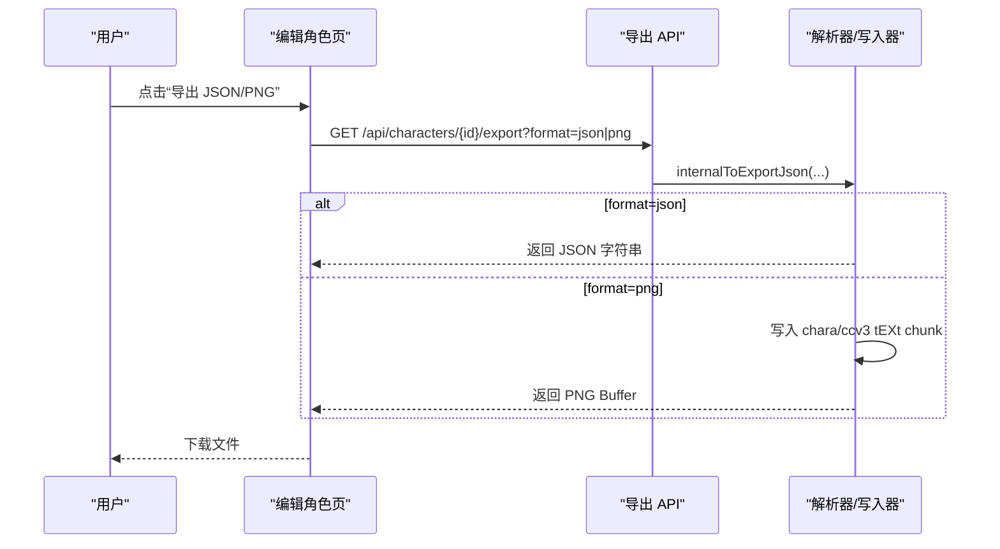
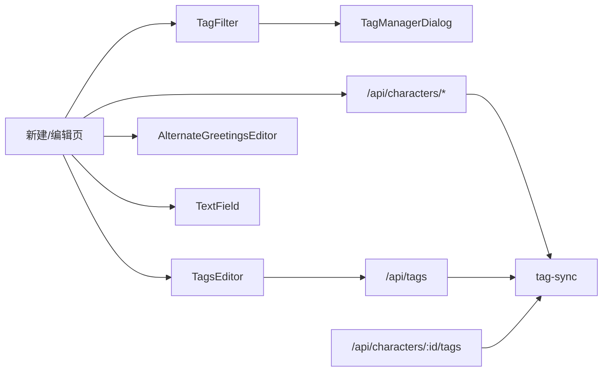

# 角色管理组件

<cite>
**本文引用的文件**
- [src/components/characters/AlternateGreetingsEditor.tsx](file://src/components/characters/AlternateGreetingsEditor.tsx)
- [src/components/characters/TagFilter.tsx](file://src/components/characters/TagFilter.tsx)
- [src/components/characters/TagManagerDialog.tsx](file://src/components/characters/TagManagerDialog.tsx)
- [src/components/characters/TagsEditor.tsx](file://src/components/characters/TagsEditor.tsx)
- [src/components/characters/TextField.tsx](file://src/components/characters/TextField.tsx)
- [src/app/characters/page.tsx](file://src/app/characters/page.tsx)
- [src/app/characters/new/page.tsx](file://src/app/characters/new/page.tsx)
- [src/app/characters/[id]/page.tsx](file://src/app/characters/[id]/page.tsx)
- [src/app/api/characters/route.ts](file://src/app/api/characters/route.ts)
- [src/app/api/characters/[id]/route.ts](file://src/app/api/characters/[id]/route.ts)
- [src/app/api/characters/[id]/export/route.ts](file://src/app/api/characters/[id]/export/route.ts)
- [src/app/api/tags/route.ts](file://src/app/api/tags/route.ts)
- [src/app/api/characters/[id]/tags/route.ts](file://src/app/api/characters/[id]/tags/route.ts)
- [src/types/index.ts](file://src/types/index.ts)
- [src/lib/constants/ui.ts](file://src/lib/constants/ui.ts)
- [src/lib/services/tag-sync.ts](file://src/lib/services/tag-sync.ts)
</cite>

## 目录
1. [简介](#简介)
2. [项目结构](#项目结构)
3. [核心组件](#核心组件)
4. [架构总览](#架构总览)
5. [详细组件分析](#详细组件分析)
6. [依赖关系分析](#依赖关系分析)
7. [性能考量](#性能考量)
8. [故障排查指南](#故障排查指南)
9. [结论](#结论)
10. [附录](#附录)

## 简介
本文件系统性梳理“角色管理组件”的实现，聚焦角色卡编辑界面的关键子组件：备用问候语编辑器、标签过滤器、标签管理对话框与文本字段组件；阐述角色数据的双向绑定、实时验证与错误处理机制；详解标签系统的管理、搜索过滤与自动完成；介绍角色导入导出组件与数据格式转换；最后给出用户体验优化与数据一致性保障方案。

## 项目结构
角色管理相关前端位于 src/components/characters，页面位于 src/app/characters 及其子路由；后端 API 路由位于 src/app/api/characters 与 src/app/api/tags；类型定义与常量位于 src/types 与 src/lib。

图表来源
- [src/app/characters/page.tsx:1-258](file://src/app/characters/page.tsx#L1-L258)
- [src/app/characters/new/page.tsx:1-155](file://src/app/characters/new/page.tsx#L1-L155)
- [src/app/characters/[id]/page.tsx:1-230](file://src/app/characters/[id]/page.tsx#L1-L230)
- [src/components/characters/AlternateGreetingsEditor.tsx:1-38](file://src/components/characters/AlternateGreetingsEditor.tsx#L1-L38)
- [src/components/characters/TagFilter.tsx:1-131](file://src/components/characters/TagFilter.tsx#L1-L131)
- [src/components/characters/TagManagerDialog.tsx:1-201](file://src/components/characters/TagManagerDialog.tsx#L1-L201)
- [src/components/characters/TagsEditor.tsx:1-88](file://src/components/characters/TagsEditor.tsx#L1-L88)
- [src/components/characters/TextField.tsx:1-51](file://src/components/characters/TextField.tsx#L1-L51)
- [src/app/api/characters/route.ts:1-42](file://src/app/api/characters/route.ts#L1-L42)
- [src/app/api/characters/[id]/route.ts:1-47](file://src/app/api/characters/[id]/route.ts#L1-L47)
- [src/app/api/characters/[id]/export/route.ts:1-162](file://src/app/api/characters/[id]/export/route.ts#L1-L162)
- [src/app/api/tags/route.ts:1-45](file://src/app/api/tags/route.ts#L1-L45)
- [src/app/api/characters/[id]/tags/route.ts:1-42](file://src/app/api/characters/[id]/tags/route.ts#L1-L42)
- [src/types/index.ts:154-209](file://src/types/index.ts#L154-L209)
- [src/lib/constants/ui.ts:1-13](file://src/lib/constants/ui.ts#L1-L13)
- [src/lib/services/tag-sync.ts:1-36](file://src/lib/services/tag-sync.ts#L1-L36)

章节来源
- [src/app/characters/page.tsx:1-258](file://src/app/characters/page.tsx#L1-L258)
- [src/app/characters/new/page.tsx:1-155](file://src/app/characters/new/page.tsx#L1-L155)
- [src/app/characters/[id]/page.tsx:1-230](file://src/app/characters/[id]/page.tsx#L1-L230)

## 核心组件
- 备用问候语编辑器：支持多行文本、动态增删行，本地即时更新并回传父组件。
- 标签过滤器：从后端拉取标签，渲染为可切换的标签按钮，支持清除与打开管理。
- 标签管理对话框：创建/编辑/删除标签，预设色盘，关闭后刷新列表。
- 标签编辑器：输入即搜索现有标签，支持“创建新标签”，带自动完成下拉。
- 防抖文本字段：统一的防抖输入组件，支持单行/多行与帮助链接。

章节来源
- [src/components/characters/AlternateGreetingsEditor.tsx:11-38](file://src/components/characters/AlternateGreetingsEditor.tsx#L11-L38)
- [src/components/characters/TagFilter.tsx:30-131](file://src/components/characters/TagFilter.tsx#L30-L131)
- [src/components/characters/TagManagerDialog.tsx:29-201](file://src/components/characters/TagManagerDialog.tsx#L29-L201)
- [src/components/characters/TagsEditor.tsx:14-88](file://src/components/characters/TagsEditor.tsx#L14-L88)
- [src/components/characters/TextField.tsx:16-51](file://src/components/characters/TextField.tsx#L16-L51)

## 架构总览
角色管理采用“页面 + 组件 + API + 类型/常量/服务”的分层设计。页面负责状态与交互，组件负责 UI 与局部状态，API 负责数据持久化与格式转换，类型与常量提供契约与体验参数，标签同步服务确保角色与标签的关联一致性。

图表来源
- [src/app/characters/page.tsx:81-91](file://src/app/characters/page.tsx#L81-L91)
- [src/components/characters/TagFilter.tsx:34-43](file://src/components/characters/TagFilter.tsx#L34-L43)
- [src/app/api/tags/route.ts:5-23](file://src/app/api/tags/route.ts#L5-L23)
- [src/lib/services/tag-sync.ts:6-35](file://src/lib/services/tag-sync.ts#L6-L35)
- [src/app/api/characters/[id]/tags/route.ts:12-41](file://src/app/api/characters/[id]/tags/route.ts#L12-L41)

## 详细组件分析

### 备用问候语编辑器
- 功能要点
  - 接收问候语数组与变更回调，渲染多行文本域。
  - 支持添加空行与删除某行，变更通过 onChange 回传父组件。
  - 适合角色首次消息与备用问候语的维护。
- 数据流
  - 子 -> 父：onChange([...greetings]) 更新父级 CharacterFormData。
- 错误处理
  - 无显式校验，保持简单易用；复杂校验可在父组件层面进行。

图表来源
- [src/components/characters/AlternateGreetingsEditor.tsx:12-38](file://src/components/characters/AlternateGreetingsEditor.tsx#L12-L38)

章节来源
- [src/components/characters/AlternateGreetingsEditor.tsx:11-38](file://src/components/characters/AlternateGreetingsEditor.tsx#L11-L38)

### 标签过滤器
- 功能要点
  - 首次无标签时显示“创建标签”入口；有标签时渲染为可切换的标签按钮。
  - 支持清除筛选与打开标签管理对话框。
  - 通过 onSelectionChange(ids) 通知父组件，父组件再调用 /api/tags?filter=ids 获取角色 ID 列表。
- 数据流
  - 组件内部：fetchTags() 拉取标签；toggleTag() 切换选中状态。
  - 父组件：handleTagSelectionChange() -> /api/tags?filter=ids -> 过滤角色列表。

图表来源
- [src/components/characters/TagFilter.tsx:30-131](file://src/components/characters/TagFilter.tsx#L30-L131)
- [src/app/characters/page.tsx:81-91](file://src/app/characters/page.tsx#L81-L91)
- [src/app/api/tags/route.ts:11-19](file://src/app/api/tags/route.ts#L11-L19)

章节来源
- [src/components/characters/TagFilter.tsx:30-131](file://src/components/characters/TagFilter.tsx#L30-L131)
- [src/app/characters/page.tsx:81-91](file://src/app/characters/page.tsx#L81-L91)

### 标签管理对话框
- 功能要点
  - 创建：输入名称与颜色，POST /api/tags。
  - 编辑：弹出表单，PATCH /api/tags/{id}。
  - 删除：DELETE /api/tags/{id}，确认提示。
  - 色盘：预设颜色与“无色”选项。
  - 关闭时刷新标签列表。
- 数据流
  - 组件内部：refreshTags() -> /api/tags。
  - 与父组件：onClose() -> 刷新父组件标签缓存。

图表来源
- [src/components/characters/TagManagerDialog.tsx:29-201](file://src/components/characters/TagManagerDialog.tsx#L29-L201)
- [src/app/api/tags/route.ts:25-44](file://src/app/api/tags/route.ts#L25-L44)

章节来源
- [src/components/characters/TagManagerDialog.tsx:29-201](file://src/components/characters/TagManagerDialog.tsx#L29-L201)

### 标签编辑器（含自动完成）
- 功能要点
  - 输入触发搜索：过滤掉已选标签，展示建议列表。
  - 支持“创建新标签”：当输入不在现有标签中时，显示创建项。
  - 自动完成下拉：支持键盘 Enter/Escape，支持鼠标点击。
  - 常量控制：下拉隐藏延迟、防抖延迟。
- 数据流
  - 组件内部：fetch("/api/tags") 初始化；addTag(name) 更新父级 tags。
  - 父组件：onChange(newTags) 更新 CharacterFormData。

图表来源
- [src/components/characters/TagsEditor.tsx:14-88](file://src/components/characters/TagsEditor.tsx#L14-L88)
- [src/lib/constants/ui.ts:5-12](file://src/lib/constants/ui.ts#L5-L12)

章节来源
- [src/components/characters/TagsEditor.tsx:14-88](file://src/components/characters/TagsEditor.tsx#L14-L88)
- [src/lib/constants/ui.ts:5-12](file://src/lib/constants/ui.ts#L5-L12)

### 防抖文本字段
- 功能要点
  - 单行/多行输入，统一防抖逻辑，避免频繁网络请求。
  - 支持帮助链接，便于用户查阅文档。
  - 常量控制防抖间隔。
- 数据流
  - 组件内部：setLocalVal + setTimeout(onChange)。
  - 父组件：接收稳定值并更新 CharacterFormData。

图表来源
- [src/components/characters/TextField.tsx:16-51](file://src/components/characters/TextField.tsx#L16-L51)
- [src/lib/constants/ui.ts:8-9](file://src/lib/constants/ui.ts#L8-L9)

章节来源
- [src/components/characters/TextField.tsx:16-51](file://src/components/characters/TextField.tsx#L16-L51)
- [src/lib/constants/ui.ts:8-9](file://src/lib/constants/ui.ts#L8-L9)

### 角色数据双向绑定、实时验证与错误处理
- 双向绑定
  - 页面与组件均使用 useState 管理本地状态，onChange 回调向上游传递，父组件统一更新 CharacterFormData。
- 实时验证
  - 新建页：保存前检查 name 是否为空；编辑页：PATCH 请求后根据响应状态更新 UI。
  - 标签同步：新建/编辑完成后调用 syncCharacterTagsByNames，自动创建不存在的标签并建立关联。
- 错误处理
  - 页面层：fetchCharacters() 捕获异常并记录日志；导入/删除/收藏等操作均有 try/catch 与用户提示。
  - API 层：鉴权失败返回 401；输入校验失败返回 400；服务器错误返回 500。

章节来源
- [src/app/characters/new/page.tsx:53-69](file://src/app/characters/new/page.tsx#L53-L69)
- [src/app/characters/[id]/page.tsx:54-70](file://src/app/characters/[id]/page.tsx#L54-L70)
- [src/lib/services/tag-sync.ts:6-35](file://src/lib/services/tag-sync.ts#L6-L35)
- [src/app/api/characters/route.ts:19-41](file://src/app/api/characters/route.ts#L19-L41)
- [src/app/api/characters/[id]/route.ts:19-34](file://src/app/api/characters/[id]/route.ts#L19-L34)

### 角色导入导出组件与数据格式转换
- 导入
  - 列表页支持多文件上传至 /api/characters/import，逐个文件提交并提示错误。
- 导出
  - 编辑页提供导出 JSON/PNG 两种格式，后端将角色数据转换为顶层 V1 兼容字段 + V3 spec + data.character_book。
  - PNG 导出时可嵌入头像或最小 PNG 底图，并写入 chara/ccv3 tEXt chunk。
- 数据格式
  - 角色数据模型与 TavernCard V2/V3 规范对齐，包含 name/description/personality/scenario/firstMessage/exampleDialogue/creatorNotes/systemPrompt/postHistoryInstructions/alternateGreetings/tags/creator/characterVersion/talkativeness/fav/avatar/extensions/worldInfoBookId/characterBook 等字段。

图表来源
- [src/app/characters/[id]/page.tsx:81-83](file://src/app/characters/[id]/page.tsx#L81-L83)
- [src/app/api/characters/[id]/export/route.ts:15-145](file://src/app/api/characters/[id]/export/route.ts#L15-L145)
- [src/types/index.ts:154-233](file://src/types/index.ts#L154-L233)

章节来源
- [src/app/characters/page.tsx:98-111](file://src/app/characters/page.tsx#L98-L111)
- [src/app/characters/[id]/page.tsx:81-91](file://src/app/characters/[id]/page.tsx#L81-L91)
- [src/app/api/characters/[id]/export/route.ts:15-145](file://src/app/api/characters/[id]/export/route.ts#L15-L145)
- [src/types/index.ts:154-233](file://src/types/index.ts#L154-L233)

### 标签系统管理、搜索过滤与自动完成
- 管理
  - TagFilter 与 TagManagerDialog 协作，支持创建/编辑/删除标签与颜色设置。
- 搜索过滤
  - TagFilter 通过 /api/tags?filter=ids 返回满足所有标签的角色 ID 集合，实现“与”关系过滤。
- 自动完成
  - TagsEditor 通过 /api/tags 获取全部标签，基于输入进行大小写无关的包含匹配，支持“创建新标签”。

章节来源
- [src/components/characters/TagFilter.tsx:30-131](file://src/components/characters/TagFilter.tsx#L30-L131)
- [src/components/characters/TagManagerDialog.tsx:29-201](file://src/components/characters/TagManagerDialog.tsx#L29-L201)
- [src/components/characters/TagsEditor.tsx:14-88](file://src/components/characters/TagsEditor.tsx#L14-L88)
- [src/app/api/tags/route.ts:11-19](file://src/app/api/tags/route.ts#L11-L19)

### 用户体验优化与数据一致性
- 体验优化
  - 防抖输入：降低频繁请求与重渲染。
  - 下拉隐藏延迟：避免 mousedown 与 blur 冲突导致的意外关闭。
  - 保存反馈：保存成功/失败状态短时提示。
  - 批量操作：列表页支持批量选择与删除。
- 数据一致性
  - 标签同步：syncCharacterTagsByNames 在新建/编辑后将标签名同步为标签 ID 并覆盖角色标签关联，确保 TagFilter 过滤可用。
  - 世界书绑定：导出时优先使用角色自带 characterBook，其次使用 worldInfoBookId 实时转换，保证导出完整性。

章节来源
- [src/lib/constants/ui.ts:5-12](file://src/lib/constants/ui.ts#L5-L12)
- [src/lib/services/tag-sync.ts:6-35](file://src/lib/services/tag-sync.ts#L6-L35)
- [src/app/characters/[id]/export/route.ts:33-56](file://src/app/characters/[id]/export/route.ts#L33-L56)

## 依赖关系分析
- 组件间依赖
  - TagFilter 依赖 TagManagerDialog 以打开管理面板。
  - TagsEditor 依赖 /api/tags 提供自动完成数据源。
  - 新建/编辑页依赖 TextField、AlternateGreetingsEditor、TagsEditor 完成表单。
- 页面与 API
  - 列表页：GET /api/characters、GET /api/tags、PATCH /api/characters/{id}、POST /api/characters/{id}、DELETE /api/characters/{id}、POST /api/characters/import。
  - 编辑页：GET /api/characters/{id}、PATCH /api/characters/{id}、DELETE /api/characters/{id}、POST /api/characters/{id}、GET /api/characters/{id}/export、GET /api/worldinfo。
  - 标签：GET/POST /api/tags、GET/PUT /api/characters/{id}/tags。
- 类型与服务
  - 类型定义 Character/CharacterFormData/TavernCardV2/V1 与 API 契约对齐。
  - tag-sync 服务封装标签创建与角色标签关联设置。

图表来源
- [src/components/characters/TagFilter.tsx:7-131](file://src/components/characters/TagFilter.tsx#L7-L131)
- [src/components/characters/TagManagerDialog.tsx:29-201](file://src/components/characters/TagManagerDialog.tsx#L29-L201)
- [src/components/characters/TagsEditor.tsx:20-25](file://src/components/characters/TagsEditor.tsx#L20-L25)
- [src/app/api/characters/route.ts:5-41](file://src/app/api/characters/route.ts#L5-L41)
- [src/app/api/characters/[id]/route.ts:7-46](file://src/app/api/characters/[id]/route.ts#L7-L46)
- [src/app/api/characters/[id]/tags/route.ts:12-41](file://src/app/api/characters/[id]/tags/route.ts#L12-L41)
- [src/lib/services/tag-sync.ts:6-35](file://src/lib/services/tag-sync.ts#L6-L35)

章节来源
- [src/app/api/characters/route.ts:5-41](file://src/app/api/characters/route.ts#L5-L41)
- [src/app/api/characters/[id]/route.ts:7-46](file://src/app/api/characters/[id]/route.ts#L7-L46)
- [src/app/api/characters/[id]/tags/route.ts:12-41](file://src/app/api/characters/[id]/tags/route.ts#L12-L41)
- [src/lib/services/tag-sync.ts:6-35](file://src/lib/services/tag-sync.ts#L6-L35)

## 性能考量
- 防抖与节流
  - 文本输入防抖（DEBOUNCE_INPUT_MS）减少网络请求与重渲染。
  - 下拉隐藏延迟（DROPDOWN_HIDE_DELAY）避免交互冲突。
- 列表渲染
  - TagFilter 渲染为可滚动区域，避免长标签列表溢出。
  - 列表页支持网格/列表视图切换，按需渲染。
- 异步加载
  - 标签与角色列表异步加载，配合 loading 状态提升感知速度。
- 导出优化
  - PNG 导出时仅在需要时创建最小底图，避免不必要的图像处理。

章节来源
- [src/lib/constants/ui.ts:5-12](file://src/lib/constants/ui.ts#L5-L12)
- [src/app/characters/page.tsx:51-72](file://src/app/characters/page.tsx#L51-L72)
- [src/app/characters/[id]/export/route.ts:117-134](file://src/app/characters/[id]/export/route.ts#L117-L134)

## 故障排查指南
- 未授权访问
  - API 路由统一鉴权，若返回 401，请检查登录状态。
- 输入校验失败
  - 角色创建/更新接口对请求体进行 Zod 校验，返回 400 并附带 details；请核对字段类型与必填项。
- 标签同步异常
  - syncCharacterTagsByNames 在创建标签或设置角色标签时可能失败；检查网络与后端日志。
- 导出失败
  - 导出 API 捕获异常并返回 500；检查角色是否存在、世界书是否可转换。
- 列表无数据
  - 检查搜索关键词与标签过滤条件；确认用户权限与角色归属。

章节来源
- [src/app/api/characters/route.ts:25-28](file://src/app/api/characters/route.ts#L25-L28)
- [src/app/api/characters/[id]/route.ts:26-29](file://src/app/api/characters/[id]/route.ts#L26-L29)
- [src/lib/services/tag-sync.ts:32-35](file://src/lib/services/tag-sync.ts#L32-L35)
- [src/app/api/characters/[id]/export/route.ts:140-144](file://src/app/api/characters/[id]/export/route.ts#L140-L144)

## 结论
角色管理组件通过清晰的分层设计与强类型契约，实现了稳定的双向绑定、实时验证与错误处理；标签系统具备完善的管理、搜索与自动完成能力；导入导出流程遵循 TavernCard V2/V3 规范，兼顾兼容性与扩展性。结合防抖、延迟隐藏与批量操作等体验优化，整体提供了高效且一致的使用体验。

## 附录
- 类型参考
  - 角色数据模型与 TavernCard 规范字段定义参见类型文件。
- 常量参考
  - UI 常量集中管理防抖、下拉隐藏与保存反馈时长。

章节来源
- [src/types/index.ts:154-233](file://src/types/index.ts#L154-L233)
- [src/lib/constants/ui.ts:5-12](file://src/lib/constants/ui.ts#L5-L12)