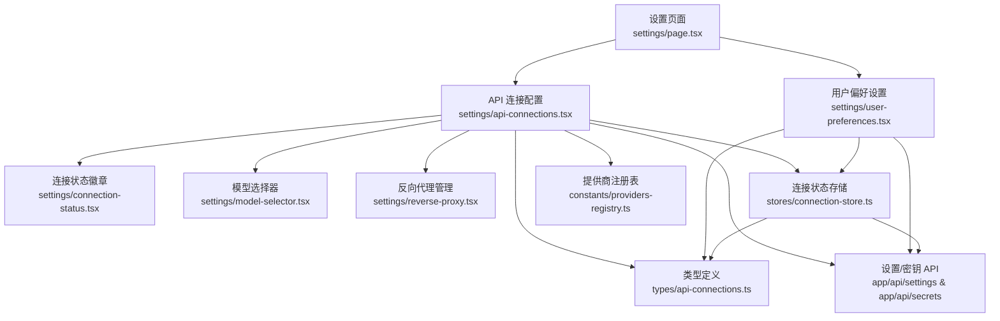
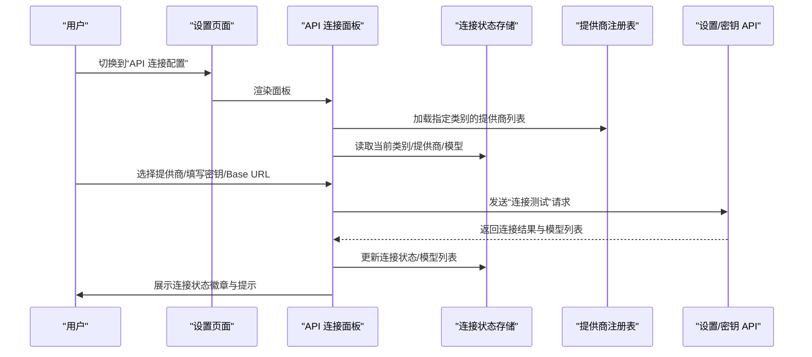
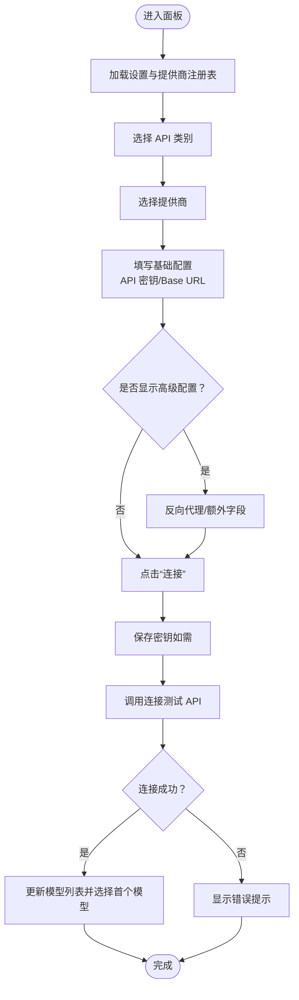
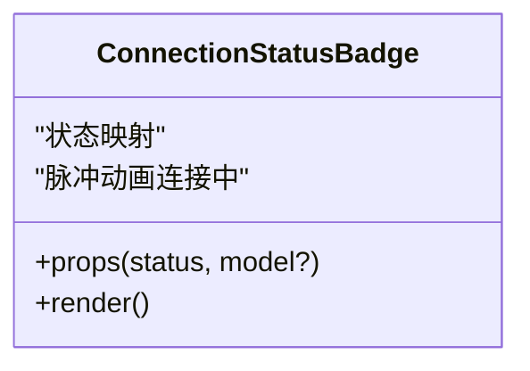
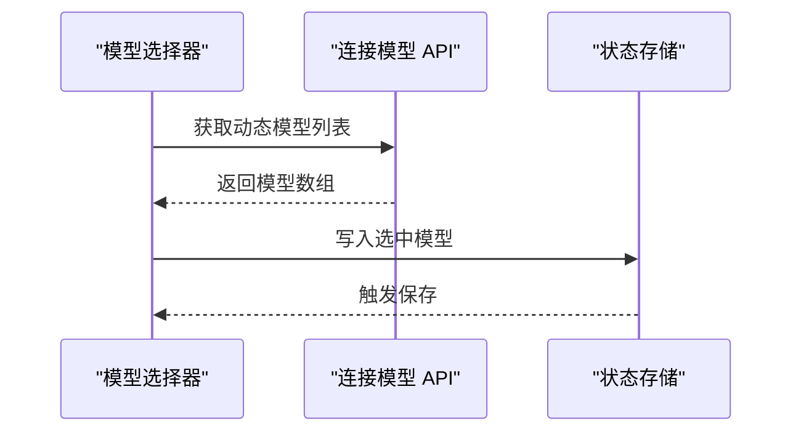
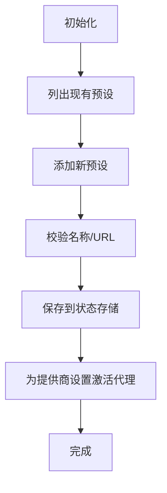
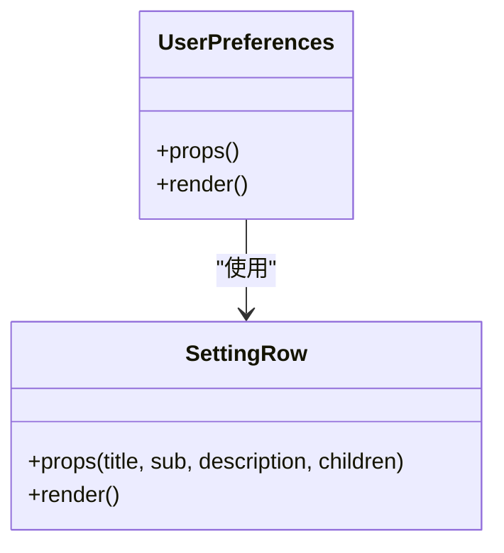
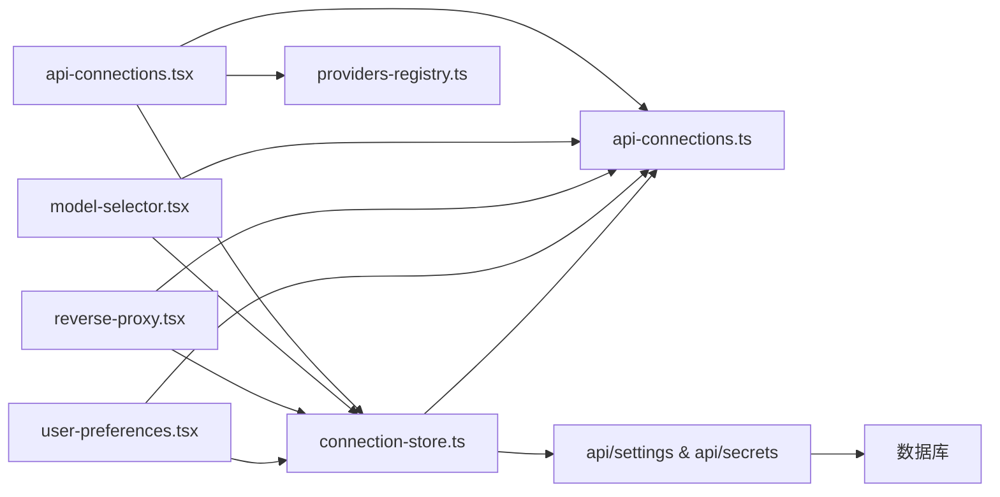

# 设置组件模块

<cite>
**本文引用的文件**
- [src/app/settings/page.tsx](file://src/app/settings/page.tsx)
- [src/components/settings/api-connections.tsx](file://src/components/settings/api-connections.tsx)
- [src/components/settings/connection-status.tsx](file://src/components/settings/connection-status.tsx)
- [src/components/settings/model-selector.tsx](file://src/components/settings/model-selector.tsx)
- [src/components/settings/reverse-proxy.tsx](file://src/components/settings/reverse-proxy.tsx)
- [src/components/settings/user-preferences.tsx](file://src/components/settings/user-preferences.tsx)
- [src/components/settings/provider-form.tsx](file://src/components/settings/provider-form.tsx)
- [src/lib/stores/connection-store.ts](file://src/lib/stores/connection-store.ts)
- [src/types/api-connections.ts](file://src/types/api-connections.ts)
- [src/lib/constants/providers-registry.ts](file://src/lib/constants/providers-registry.ts)
- [src/app/api/settings/route.ts](file://src/app/api/settings/route.ts)
- [src/app/api/secrets/route.ts](file://src/app/api/secrets/route.ts)
- [src/lib/services/secrets-service.ts](file://src/lib/services/secrets-service.ts)
</cite>

## 目录
1. [简介](#简介)
2. [项目结构](#项目结构)
3. [核心组件](#核心组件)
4. [架构总览](#架构总览)
5. [详细组件分析](#详细组件分析)
6. [依赖关系分析](#依赖关系分析)
7. [性能考量](#性能考量)
8. [故障排查指南](#故障排查指南)
9. [结论](#结论)
10. [附录](#附录)

## 简介
本文件系统性梳理“设置组件模块”的设计与实现，覆盖以下主题：
- API 连接管理：提供商选择、连接状态展示、模型选择器、反向代理配置、额外字段表单
- 认证与密钥管理：API 密钥的本地存储、存在性检测、删除与隐私策略
- 连接测试：连接测试与“测试消息”流程
- 用户偏好设置：自动连接、默认类别等
- 数据持久化：前端状态与后端设置合并、默认值处理、导入导出思路
- 组件间数据绑定、表单验证与状态同步机制
- 定制指南与用户体验优化建议

## 项目结构
设置页面采用“标签页 + 组件化”的组织方式：
- 页面入口负责 Tab 切换与子组件渲染
- 设置组件按功能拆分为独立模块，通过共享状态库进行数据绑定
- 类型定义集中于统一的类型文件，确保前后端契约一致
- API 路由负责设置与密钥的读写

图表来源
- [src/app/settings/page.tsx:15-53](file://src/app/settings/page.tsx#L15-L53)
- [src/components/settings/api-connections.tsx:18-116](file://src/components/settings/api-connections.tsx#L18-L116)
- [src/components/settings/user-preferences.tsx:11-82](file://src/components/settings/user-preferences.tsx#L11-L82)

章节来源
- [src/app/settings/page.tsx:15-53](file://src/app/settings/page.tsx#L15-L53)

## 核心组件
- API 连接配置面板：聚合提供商选择、基础/高级配置、连接测试与状态展示
- 连接状态徽章：统一的状态可视化
- 模型选择器：支持搜索、分组与动态模型加载
- 反向代理管理：预设的增删改与激活
- 用户偏好设置：自动连接、默认类别等
- 提供商表单：兼容性保留，实际逻辑内嵌至连接面板
- 状态存储：Zustand 状态与后端设置合并
- 类型定义：统一的配置结构、状态与请求/响应契约
- 提供商注册表：完整的提供商清单与能力声明
- API 路由：设置读写、密钥读写

章节来源
- [src/components/settings/api-connections.tsx:18-116](file://src/components/settings/api-connections.tsx#L18-L116)
- [src/components/settings/connection-status.tsx:10-32](file://src/components/settings/connection-status.tsx#L10-L32)
- [src/components/settings/model-selector.tsx:7-112](file://src/components/settings/model-selector.tsx#L7-L112)
- [src/components/settings/reverse-proxy.tsx:7-106](file://src/components/settings/reverse-proxy.tsx#L7-L106)
- [src/components/settings/user-preferences.tsx:11-82](file://src/components/settings/user-preferences.tsx#L11-L82)
- [src/lib/stores/connection-store.ts:32-185](file://src/lib/stores/connection-store.ts#L32-L185)
- [src/types/api-connections.ts:86-136](file://src/types/api-connections.ts#L86-L136)
- [src/lib/constants/providers-registry.ts:722-749](file://src/lib/constants/providers-registry.ts#L722-L749)

## 架构总览
设置模块遵循“页面 → 组件 → 状态存储 → 类型契约 → API 路由”的分层架构。组件通过状态存储进行双向绑定，类型定义贯穿前端与后端，API 路由负责持久化与密钥管理。

图表来源
- [src/app/settings/page.tsx:15-53](file://src/app/settings/page.tsx#L15-L53)
- [src/components/settings/api-connections.tsx:121-212](file://src/components/settings/api-connections.tsx#L121-L212)
- [src/lib/stores/connection-store.ts:159-185](file://src/lib/stores/connection-store.ts#L159-L185)
- [src/lib/constants/providers-registry.ts:740-743](file://src/lib/constants/providers-registry.ts#L740-L743)
- [src/app/api/settings/route.ts:22-50](file://src/app/api/settings/route.ts#L22-L50)

## 详细组件分析

### API 连接配置面板
职责与行为
- 类别切换：支持对话补全、文本补全、NovelAI、AI Horde、Kobold Classic 五类
- 提供商选择：根据当前类别筛选注册表中的提供商，记录活动提供商
- 基础配置：API 密钥输入（支持显示/隐藏）、密钥存在性检测、删除
- 高级配置：可折叠区域，包含反向代理与 Base URL 输入；部分提供商支持额外字段
- 连接测试：保存密钥与 Base URL，调用测试接口，更新连接状态与模型列表
- 测试消息：发送一条简短消息验证可用性（会消耗少量额度）
- 状态展示：右侧连接状态徽章，显示连接状态与当前模型

数据绑定与状态同步
- 通过状态存储维护活动类别、提供商、模型、Base URL、反向代理等
- 连接测试成功后，将远端返回的模型列表持久化到状态存储，并同步到设置中
- 状态变更触发保存动作，写入后端设置

表单验证与交互
- 密钥输入框在保存后隐藏明文，仅显示占位提示
- Base URL 在输入变化时清空测试消息提示
- 高级配置区域根据提供商能力动态显示

图表来源
- [src/components/settings/api-connections.tsx:121-212](file://src/components/settings/api-connections.tsx#L121-L212)
- [src/lib/stores/connection-store.ts:159-185](file://src/lib/stores/connection-store.ts#L159-L185)

章节来源
- [src/components/settings/api-connections.tsx:18-116](file://src/components/settings/api-connections.tsx#L18-L116)
- [src/components/settings/api-connections.tsx:121-212](file://src/components/settings/api-connections.tsx#L121-L212)
- [src/components/settings/api-connections.tsx:214-253](file://src/components/settings/api-connections.tsx#L214-L253)

### 连接状态徽章
职责与行为
- 统一展示连接状态：已连接、未连接、连接中、连接失败
- 成功时显示当前模型标识，便于快速核对

图表来源
- [src/components/settings/connection-status.tsx:10-32](file://src/components/settings/connection-status.tsx#L10-L32)

章节来源
- [src/components/settings/connection-status.tsx:10-32](file://src/components/settings/connection-status.tsx#L10-L32)

### 模型选择器
职责与行为
- 动态加载：当提供商声明模型为动态时，通过 API 拉取可用模型
- 搜索过滤：支持按模型 ID 或名称搜索
- 分组展示：按组（如“远程模型”、“可用模型”）分组显示
- 选择反馈：选中后写入状态存储，并触发保存

图表来源
- [src/components/settings/model-selector.tsx:14-27](file://src/components/settings/model-selector.tsx#L14-L27)
- [src/components/settings/model-selector.tsx:29-57](file://src/components/settings/model-selector.tsx#L29-L57)
- [src/lib/stores/connection-store.ts:63-71](file://src/lib/stores/connection-store.ts#L63-L71)

章节来源
- [src/components/settings/model-selector.tsx:7-112](file://src/components/settings/model-selector.tsx#L7-L112)

### 反向代理配置
职责与行为
- 预设管理：新增、删除反向代理预设
- 激活控制：为特定提供商选择激活的代理
- 表单校验：名称与 URL 必填

图表来源
- [src/components/settings/reverse-proxy.tsx:17-31](file://src/components/settings/reverse-proxy.tsx#L17-L31)
- [src/components/settings/reverse-proxy.tsx:40-70](file://src/components/settings/reverse-proxy.tsx#L40-L70)
- [src/lib/stores/connection-store.ts:110-138](file://src/lib/stores/connection-store.ts#L110-L138)

章节来源
- [src/components/settings/reverse-proxy.tsx:7-106](file://src/components/settings/reverse-proxy.tsx#L7-L106)

### 用户偏好设置
职责与行为
- 自动连接：启动后自动连接上次使用的提供商与模型
- 默认 API 类别：打开设置页面时默认选中的 API 类型
- 使用说明：提供关键操作提示（密钥本地存储、模型列表拉取、测试消息消耗）

图表来源
- [src/components/settings/user-preferences.tsx:11-82](file://src/components/settings/user-preferences.tsx#L11-L82)
- [src/components/settings/user-preferences.tsx:84-108](file://src/components/settings/user-preferences.tsx#L84-L108)

章节来源
- [src/components/settings/user-preferences.tsx:11-82](file://src/components/settings/user-preferences.tsx#L11-L82)

### 提供商表单（兼容性保留）
说明
- 该模块为兼容性保留，实际逻辑已内嵌到 API 连接面板中，作为内联表单呈现。

章节来源
- [src/components/settings/provider-form.tsx:7-27](file://src/components/settings/provider-form.tsx#L7-L27)

## 依赖关系分析
- 组件依赖状态存储：所有设置项均通过状态存储进行读写
- 类型契约：统一的配置结构与请求/响应类型，保证前后端一致性
- 提供商注册表：为面板提供能力声明与默认值
- API 路由：设置读写与密钥读写

图表来源
- [src/components/settings/api-connections.tsx:18-116](file://src/components/settings/api-connections.tsx#L18-L116)
- [src/lib/stores/connection-store.ts:32-185](file://src/lib/stores/connection-store.ts#L32-L185)
- [src/types/api-connections.ts:86-136](file://src/types/api-connections.ts#L86-L136)
- [src/lib/constants/providers-registry.ts:722-749](file://src/lib/constants/providers-registry.ts#L722-L749)
- [src/app/api/settings/route.ts:22-50](file://src/app/api/settings/route.ts#L22-L50)
- [src/app/api/secrets/route.ts:8-30](file://src/app/api/secrets/route.ts#L8-L30)

章节来源
- [src/lib/stores/connection-store.ts:32-185](file://src/lib/stores/connection-store.ts#L32-L185)
- [src/types/api-connections.ts:86-136](file://src/types/api-connections.ts#L86-L136)

## 性能考量
- 动态模型加载：仅在提供商声明为动态时发起请求，避免不必要的网络开销
- 状态持久化：每次状态变更即触发保存，建议在高频变更场景下增加节流或防抖
- 搜索过滤：在大量模型时启用搜索，减少 DOM 渲染压力
- 连接测试：避免重复触发，测试中禁用相关按钮，测试完成后重置状态

## 故障排查指南
常见问题与定位
- 连接失败
  - 检查 API 密钥是否正确保存且未被删除
  - 确认 Base URL 与提供商要求一致
  - 对于无需状态检查的提供商，连接成功后需点击“测试消息”进一步验证
- 模型列表为空
  - 先执行“连接”，再进行模型选择
  - 部分提供商需动态拉取模型，等待加载完成
- 密钥安全
  - 密钥保存在本地数据库，不会上传到第三方
  - 删除密钥后，输入新密钥可替换旧密钥

相关实现参考
- 连接测试与错误处理：[src/components/settings/api-connections.tsx:149-212](file://src/components/settings/api-connections.tsx#L149-L212)
- 测试消息流程：[src/components/settings/api-connections.tsx:214-253](file://src/components/settings/api-connections.tsx#L214-L253)
- 密钥存在性检测与删除：[src/components/settings/api-connections.tsx:136-145](file://src/components/settings/api-connections.tsx#L136-L145), [src/components/settings/api-connections.tsx:307-322](file://src/components/settings/api-connections.tsx#L307-L322)
- 设置保存与合并：[src/lib/stores/connection-store.ts:173-184](file://src/lib/stores/connection-store.ts#L173-L184), [src/app/api/settings/route.ts:55-108](file://src/app/api/settings/route.ts#L55-L108)

章节来源
- [src/components/settings/api-connections.tsx:136-145](file://src/components/settings/api-connections.tsx#L136-L145)
- [src/components/settings/api-connections.tsx:149-212](file://src/components/settings/api-connections.tsx#L149-L212)
- [src/components/settings/api-connections.tsx:214-253](file://src/components/settings/api-connections.tsx#L214-L253)
- [src/lib/stores/connection-store.ts:173-184](file://src/lib/stores/connection-store.ts#L173-L184)
- [src/app/api/settings/route.ts:55-108](file://src/app/api/settings/route.ts#L55-L108)

## 结论
设置组件模块通过清晰的分层设计与统一的类型契约，实现了对多提供商、多类别的灵活配置与稳定连接。组件间通过状态存储实现松耦合的数据绑定，配合后端设置与密钥 API，形成闭环的配置生命周期。建议在高频交互场景下引入节流与缓存策略，进一步提升用户体验。

## 附录

### 认证配置与 API 密钥管理
- 密钥存储：通过密钥 API 将密钥保存到用户私有数据库
- 存在性检测：在输入框旁显示密钥状态，避免重复保存
- 删除机制：确认后删除密钥，输入新密钥可替换旧密钥
- 隐私策略：密钥明文不在前端显示，仅在保存后隐藏

章节来源
- [src/app/api/secrets/route.ts:8-30](file://src/app/api/secrets/route.ts#L8-L30)
- [src/app/api/secrets/route.ts:32-54](file://src/app/api/secrets/route.ts#L32-L54)
- [src/app/api/secrets/route.ts:56-82](file://src/app/api/secrets/route.ts#L56-L82)
- [src/lib/services/secrets-service.ts:10-65](file://src/lib/services/secrets-service.ts#L10-L65)

### 连接测试与“测试消息”
- 连接测试：保存密钥与 Base URL，调用测试接口，成功后拉取模型列表
- 测试消息：发送一条短文本验证可用性，成功后更新连接状态

章节来源
- [src/components/settings/api-connections.tsx:149-212](file://src/components/settings/api-connections.tsx#L149-L212)
- [src/components/settings/api-connections.tsx:214-253](file://src/components/settings/api-connections.tsx#L214-L253)

### 持久化存储、默认值与导入导出
- 默认值：后端返回设置时与默认配置合并，确保字段完整性
- 持久化：每次状态变更触发保存，写入用户设置
- 导入导出：可通过设置 API 获取与更新完整配置，实现导入导出

章节来源
- [src/app/api/settings/route.ts:9-17](file://src/app/api/settings/route.ts#L9-L17)
- [src/app/api/settings/route.ts:40-46](file://src/app/api/settings/route.ts#L40-L46)
- [src/lib/stores/connection-store.ts:159-185](file://src/lib/stores/connection-store.ts#L159-L185)

### 组件定制指南与用户体验优化
- 定制指南
  - 新增提供商：在提供商注册表中扩展条目，声明能力与默认值
  - 新增额外字段：在提供商条目中定义额外字段，面板将自动生成相应输入控件
  - 自定义 Base URL：为需要的提供商开启 Base URL 字段
- 用户体验优化
  - 在连接测试期间禁用相关按钮，避免重复提交
  - 对动态模型加载增加加载指示与错误提示
  - 为长列表提供搜索框，提升选择效率
  - 对于无需状态检查的提供商，明确提示下一步操作

章节来源
- [src/lib/constants/providers-registry.ts:740-749](file://src/lib/constants/providers-registry.ts#L740-L749)
- [src/components/settings/api-connections.tsx:255-256](file://src/components/settings/api-connections.tsx#L255-L256)