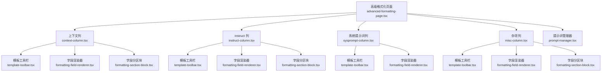
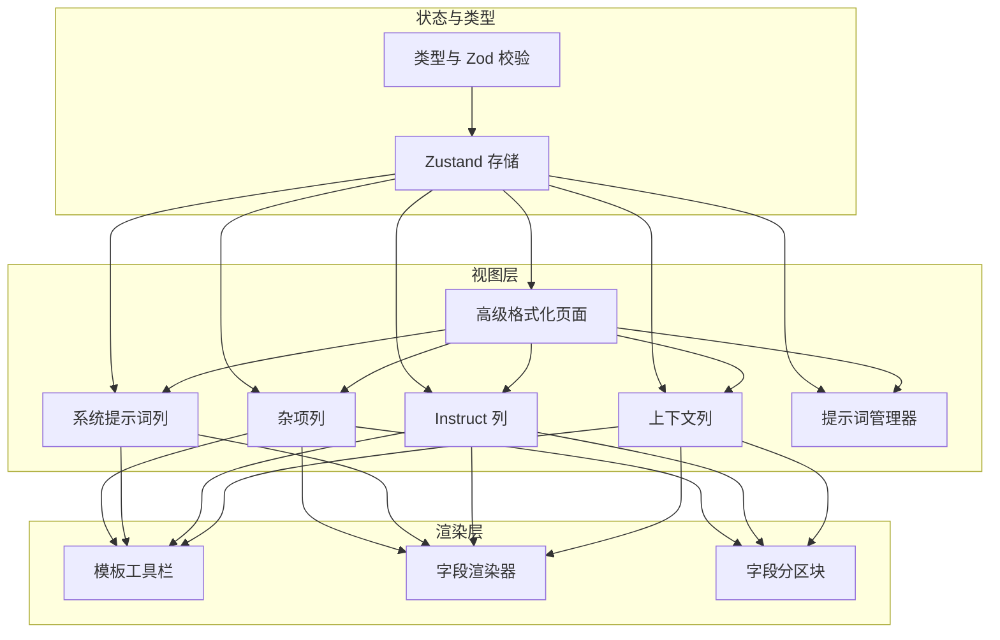
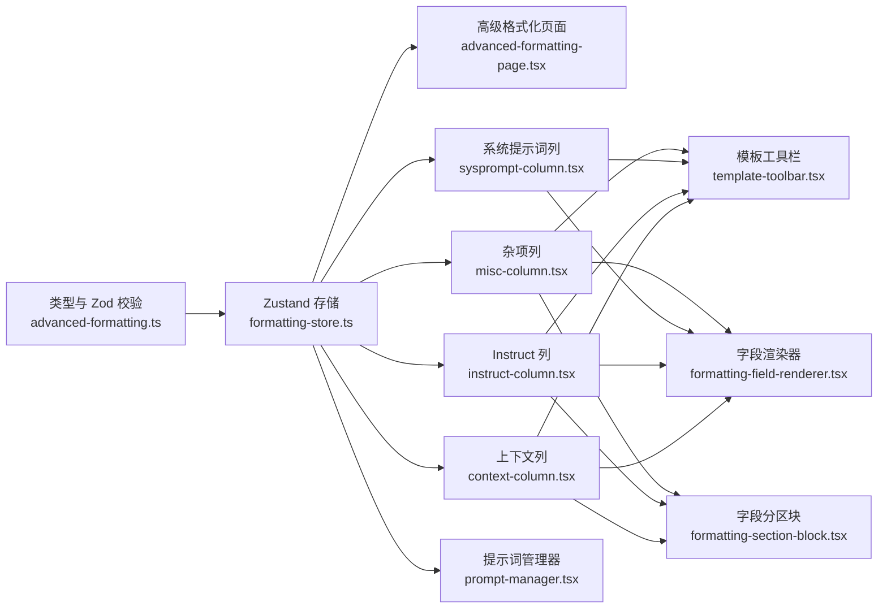
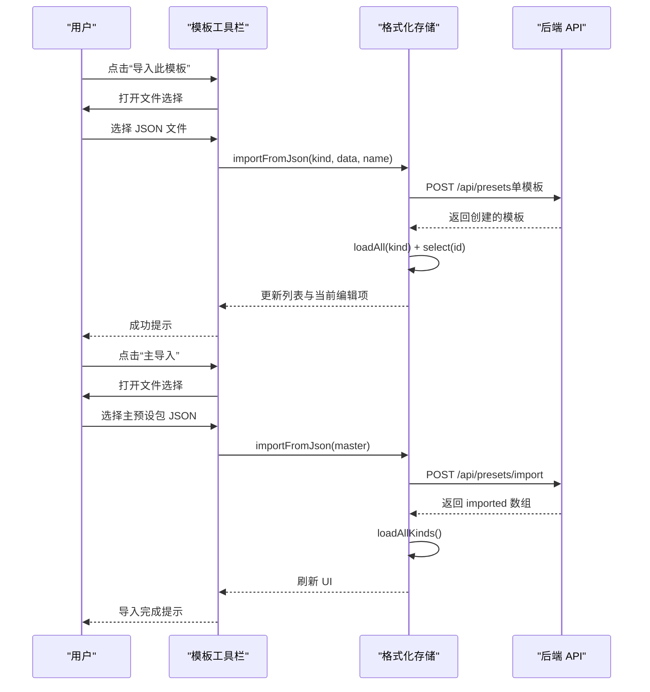
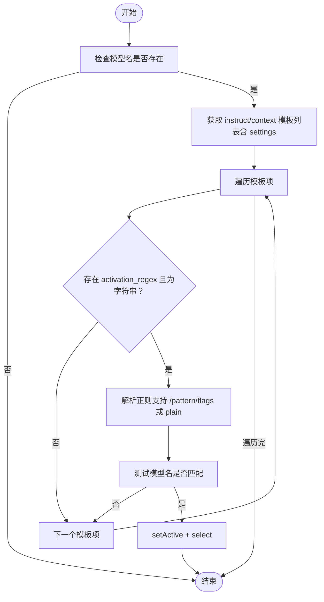

# 高级格式化组件

<cite>
**本文引用的文件**
- [src/components/advanced-formatting/advanced-formatting-page.tsx](file://src/components/advanced-formatting/advanced-formatting-page.tsx)
- [src/components/advanced-formatting/context-column.tsx](file://src/components/advanced-formatting/context-column.tsx)
- [src/components/advanced-formatting/instruct-column.tsx](file://src/components/advanced-formatting/instruct-column.tsx)
- [src/components/advanced-formatting/sysprompt-column.tsx](file://src/components/advanced-formatting/sysprompt-column.tsx)
- [src/components/advanced-formatting/misc-column.tsx](file://src/components/advanced-formatting/misc-column.tsx)
- [src/components/advanced-formatting/formatting-field-renderer.tsx](file://src/components/advanced-formatting/formatting-field-renderer.tsx)
- [src/components/advanced-formatting/formatting-section-block.tsx](file://src/components/advanced-formatting/formatting-section-block.tsx)
- [src/components/advanced-formatting/template-toolbar.tsx](file://src/components/advanced-formatting/template-toolbar.tsx)
- [src/components/advanced-formatting/prompt-manager.tsx](file://src/components/advanced-formatting/prompt-manager.tsx)
- [src/stores/formatting-store.ts](file://src/stores/formatting-store.ts)
- [src/types/advanced-formatting.ts](file://src/types/advanced-formatting.ts)
</cite>

## 目录
1. [简介](#简介)
2. [项目结构](#项目结构)
3. [核心组件](#核心组件)
4. [架构总览](#架构总览)
5. [组件详解](#组件详解)
6. [依赖关系分析](#依赖关系分析)
7. [性能考量](#性能考量)
8. [故障排查指南](#故障排查指南)
9. [结论](#结论)
10. [附录](#附录)

## 简介
本文件面向高级格式化组件的使用者与维护者，系统性阐述复杂提示词格式化系统的架构与实现细节。该系统通过“上下文模板、Instruct 模板、系统提示词模板、推理模板”四大布局列与“全局格式化设置”“提示词管理器”两大功能模块，提供对提示词组装顺序、宏替换、停用词、分词器、推理块处理等能力的可视化配置与运行时联动。

系统目标：
- 提供与原项目双向兼容的主预设包（Master）导入/导出能力
- 支持按模型名自动激活模板（基于正则）
- 通过元数据驱动的字段渲染器与分区块，实现高可扩展的配置界面
- 通过提示词管理器可视化控制各段落的启用/排序/预览

## 项目结构
高级格式化页面采用四列布局，分别承载上下文、Instruct、系统提示词、杂项（推理+全局格式化），并辅以顶部的主导入/导出入口与底部的提示词管理器。

图表来源
- [src/components/advanced-formatting/advanced-formatting-page.tsx:126-131](file://src/components/advanced-formatting/advanced-formatting-page.tsx#L126-L131)
- [src/components/advanced-formatting/context-column.tsx:32-86](file://src/components/advanced-formatting/context-column.tsx#L32-L86)
- [src/components/advanced-formatting/instruct-column.tsx:37-71](file://src/components/advanced-formatting/instruct-column.tsx#L37-L71)
- [src/components/advanced-formatting/sysprompt-column.tsx:31-51](file://src/components/advanced-formatting/sysprompt-column.tsx#L31-L51)
- [src/components/advanced-formatting/misc-column.tsx:23-61](file://src/components/advanced-formatting/misc-column.tsx#L23-L61)

章节来源
- [src/components/advanced-formatting/advanced-formatting-page.tsx:126-131](file://src/components/advanced-formatting/advanced-formatting-page.tsx#L126-L131)

## 核心组件
- 高级格式化页面：负责加载四大模板集合、展示错误信息、提供主导入/导出入口，并挂载提示词管理器。
- 四列布局组件：分别承载上下文、Instruct、系统提示词、杂项配置，均通过模板工具栏统一管理 CRUD 与激活。
- 元数据驱动渲染层：字段渲染器与字段分区块，将类型、范围、选项等元数据映射为 UI 控件。
- 存储层：Zustand 状态管理，封装模板列表、当前编辑项、脏状态、保存/导入/导出/恢复默认等动作。
- 类型与校验：Zod Schema 定义模板结构与默认值，确保前后端一致与数据安全。
- 提示词管理器：可视化控制提示词段落的启用/排序/预览，估算 token 数量。

章节来源
- [src/components/advanced-formatting/advanced-formatting-page.tsx:21-79](file://src/components/advanced-formatting/advanced-formatting-page.tsx#L21-L79)
- [src/stores/formatting-store.ts:131-505](file://src/stores/formatting-store.ts#L131-L505)
- [src/types/advanced-formatting.ts:33-146](file://src/types/advanced-formatting.ts#L33-L146)

## 架构总览
系统采用“页面容器 + 列组件 + 渲染层 + 存储 + 类型校验”的分层设计。页面容器负责布局与主导入/导出；列组件负责各自模板的编辑与联动；渲染层负责将元数据映射为 UI；存储负责 CRUD、激活、自动匹配与导入导出；类型校验保障数据一致性。

图表来源
- [src/components/advanced-formatting/advanced-formatting-page.tsx:126-131](file://src/components/advanced-formatting/advanced-formatting-page.tsx#L126-L131)
- [src/components/advanced-formatting/context-column.tsx:32-86](file://src/components/advanced-formatting/context-column.tsx#L32-L86)
- [src/components/advanced-formatting/instruct-column.tsx:37-71](file://src/components/advanced-formatting/instruct-column.tsx#L37-L71)
- [src/components/advanced-formatting/sysprompt-column.tsx:31-51](file://src/components/advanced-formatting/sysprompt-column.tsx#L31-L51)
- [src/components/advanced-formatting/misc-column.tsx:23-61](file://src/components/advanced-formatting/misc-column.tsx#L23-L61)
- [src/components/advanced-formatting/template-toolbar.tsx:18-208](file://src/components/advanced-formatting/template-toolbar.tsx#L18-L208)
- [src/components/advanced-formatting/formatting-field-renderer.tsx:13-148](file://src/components/advanced-formatting/formatting-field-renderer.tsx#L13-L148)
- [src/components/advanced-formatting/formatting-section-block.tsx:16-71](file://src/components/advanced-formatting/formatting-section-block.tsx#L16-L71)
- [src/stores/formatting-store.ts:131-505](file://src/stores/formatting-store.ts#L131-L505)
- [src/types/advanced-formatting.ts:33-146](file://src/types/advanced-formatting.ts#L33-L146)

## 组件详解

### 上下文列（Context Column）
- 职责：编辑上下文模板字段，包含故事字符串、分隔符、聊天起始标记、自动匹配正则、上下文格式化开关等。
- 联动：在“上下文格式化”分区后展示全局格式化开关（合并换行、修剪空格），与“杂项列”的全局格式化保持同步。
- 关键点：字段元数据与分区元数据来自类型定义，渲染层按元数据生成控件。

章节来源
- [src/components/advanced-formatting/context-column.tsx:20-89](file://src/components/advanced-formatting/context-column.tsx#L20-L89)
- [src/types/advanced-formatting.ts:168-189](file://src/types/advanced-formatting.ts#L168-L189)

### Instruct 列（Instruct Column）
- 职责：编辑 Instruct 模板字段，包含控制选项、序列前缀/后缀、系统消息序列、停用序列、首/末条消息序列等。
- 联动：顶部启用开关与全局配置联动；绑定到上下文模板开关用于在切换 Instruct 时同步激活同名上下文模板。
- 关键点：字段分区按“控制”“Story 序列”“用户/助手/系统消息序列”“其他序列”组织。

章节来源
- [src/components/advanced-formatting/instruct-column.tsx:13-73](file://src/components/advanced-formatting/instruct-column.tsx#L13-L73)
- [src/types/advanced-formatting.ts:191-229](file://src/types/advanced-formatting.ts#L191-L229)

### 系统提示词列（Sysprompt Column）
- 职责：编辑系统提示词正文与历史后指令。
- 联动：顶部启用开关与全局配置联动，禁用时整列置灰且交互失效。
- 关键点：字段较少，直接使用字段渲染器展示文本域。

章节来源
- [src/components/advanced-formatting/sysprompt-column.tsx:10-53](file://src/components/advanced-formatting/sysprompt-column.tsx#L10-L53)
- [src/types/advanced-formatting.ts:231-235](file://src/types/advanced-formatting.ts#L231-L235)

### 杂项列（Misc Column）
- 职责：编辑推理模板字段与全局格式化设置。
- 联动：推理模板独立管理；全局格式化设置通过字段分区块组织，与上下文列的全局开关形成跨列联动。
- 关键点：全局格式化包含停用词、分词器、推理行为、模型绑定等。

章节来源
- [src/components/advanced-formatting/misc-column.tsx:15-63](file://src/components/advanced-formatting/misc-column.tsx#L15-L63)
- [src/types/advanced-formatting.ts:237-269](file://src/types/advanced-formatting.ts#L237-L269)

### 模板工具栏（Template Toolbar）
- 职责：统一管理模板的“选择/保存/另存/重命名/删除/设为生效/重置/导入/导出/恢复内置”等操作。
- 特性：支持当前编辑项与“生效中”模板的区分；禁用态下仅顶部启用开关可用；内置恢复弹窗按类别列出默认模板名称。
- 关键点：导入支持单模板 JSON 与主预设包 JSON 的自动识别与批量导入。

章节来源
- [src/components/advanced-formatting/template-toolbar.tsx:18-208](file://src/components/advanced-formatting/template-toolbar.tsx#L18-L208)
- [src/stores/formatting-store.ts:384-445](file://src/stores/formatting-store.ts#L384-L445)

### 字段渲染器（FormattingFieldRenderer）
- 职责：根据字段元数据类型渲染控件：数字（含范围与步长）、布尔、选择、多行文本、单行文本。
- 特性：统一的提示气泡、禁用态样式、受控变更回调。
- 关键点：与字段分区块配合，实现“非布尔控件优先展示 + 布尔控件网格展示”的布局。

章节来源
- [src/components/advanced-formatting/formatting-field-renderer.tsx:13-148](file://src/components/advanced-formatting/formatting-field-renderer.tsx#L13-L148)

### 字段分区块（FormattingSectionBlock）
- 职责：折叠式分区容器，按元数据组织字段，支持默认展开与提示气泡。
- 特性：将字段分为“非布尔控件”和“布尔控件”，分别采用不同网格布局。
- 关键点：与模板工具栏共同构成“列组件”的基础 UI 模块。

章节来源
- [src/components/advanced-formatting/formatting-section-block.tsx:16-71](file://src/components/advanced-formatting/formatting-section-block.tsx#L16-L71)

### 提示词管理器（Prompt Manager）
- 职责：可视化控制提示词段落的启用/禁用、拖拽排序、展开预览、估算 token 数。
- 段落：系统提示词、Persona、角色描述/性格/场景、世界书（前后）、对话示例、聊天历史、后置指令。
- 特性：支持预览面板与段落详情展开；拖拽排序更新内部顺序；统计启用段落数与估算 token 总量。
- 关键点：为复杂提示词构建提供直观的“拼装顺序”与“内容体量”把控。

章节来源
- [src/components/advanced-formatting/prompt-manager.tsx:55-223](file://src/components/advanced-formatting/prompt-manager.tsx#L55-L223)

### 高级格式化页面（AdvancedFormattingPage）
- 职责：加载四大模板集合、展示错误信息、提供主导入/导出入口、挂载提示词管理器。
- 主导入/导出：支持主预设包（Master）与单模板 JSON；导出文件名与原项目一致；导入后自动重载并提示结果。
- 关键点：初始化时并发加载所有种类模板；错误统一展示在页面顶部。

章节来源
- [src/components/advanced-formatting/advanced-formatting-page.tsx:21-79](file://src/components/advanced-formatting/advanced-formatting-page.tsx#L21-L79)

## 依赖关系分析

图表来源
- [src/types/advanced-formatting.ts:33-146](file://src/types/advanced-formatting.ts#L33-L146)
- [src/stores/formatting-store.ts:131-505](file://src/stores/formatting-store.ts#L131-L505)
- [src/components/advanced-formatting/advanced-formatting-page.tsx:126-131](file://src/components/advanced-formatting/advanced-formatting-page.tsx#L126-L131)
- [src/components/advanced-formatting/context-column.tsx:32-86](file://src/components/advanced-formatting/context-column.tsx#L32-L86)
- [src/components/advanced-formatting/instruct-column.tsx:37-71](file://src/components/advanced-formatting/instruct-column.tsx#L37-L71)
- [src/components/advanced-formatting/sysprompt-column.tsx:31-51](file://src/components/advanced-formatting/sysprompt-column.tsx#L31-L51)
- [src/components/advanced-formatting/misc-column.tsx:23-61](file://src/components/advanced-formatting/misc-column.tsx#L23-L61)
- [src/components/advanced-formatting/template-toolbar.tsx:18-208](file://src/components/advanced-formatting/template-toolbar.tsx#L18-L208)
- [src/components/advanced-formatting/formatting-field-renderer.tsx:13-148](file://src/components/advanced-formatting/formatting-field-renderer.tsx#L13-L148)
- [src/components/advanced-formatting/formatting-section-block.tsx:16-71](file://src/components/advanced-formatting/formatting-section-block.tsx#L16-L71)
- [src/components/advanced-formatting/prompt-manager.tsx:55-223](file://src/components/advanced-formatting/prompt-manager.tsx#L55-L223)

## 性能考量
- 渲染性能
  - 字段渲染器与字段分区块采用受控组件与最小化重渲染策略，避免不必要的子树更新。
  - 大字段（如 textarea）在非活跃列时可置灰并拦截交互，减少无效渲染与事件处理。
- 状态管理
  - 使用 Zustand 将模板列表、当前编辑项、脏状态、保存状态等切片化管理，降低全局订阅成本。
  - 并发加载四大模板集合，缩短首屏等待时间。
- 数据校验
  - Zod Schema 在导入/保存时进行严格校验，避免异常数据进入渲染层，提升稳定性。
- 提示词管理器
  - 估算 token 采用字符粗估，避免昂贵的分词计算；仅在预览开启时进行展开渲染。

## 故障排查指南
- 页面加载错误
  - 现象：页面顶部出现错误提示。
  - 排查：检查网络请求是否返回 2xx；查看控制台错误堆栈；确认后端接口路径正确。
- 主导入失败
  - 现象：导入主预设包后提示失败或部分段导入失败。
  - 排查：确认 JSON 结构符合预期；检查后端返回的 imported 数组中 ok=false 的段落；重新尝试导入。
- 模板保存失败
  - 现象：点击保存后无响应或报错。
  - 排查：确认当前模板已激活；检查网络状态；查看后端返回的错误信息。
- 自动匹配失效
  - 现象：切换模型后未自动激活对应模板。
  - 排查：确认模板的激活正则格式正确；检查模型名是否匹配；查看控制台警告日志。

章节来源
- [src/components/advanced-formatting/advanced-formatting-page.tsx:120-124](file://src/components/advanced-formatting/advanced-formatting-page.tsx#L120-L124)
- [src/stores/formatting-store.ts:167-170](file://src/stores/formatting-store.ts#L167-L170)
- [src/stores/formatting-store.ts:384-445](file://src/stores/formatting-store.ts#L384-L445)
- [src/stores/formatting-store.ts:467-504](file://src/stores/formatting-store.ts#L467-L504)

## 结论
高级格式化组件通过清晰的分层设计与元数据驱动的渲染体系，实现了对复杂提示词格式化的可视化配置与运行时联动。四大列组件覆盖了上下文、Instruct、系统提示词与推理/全局格式化的主要场景；模板工具栏提供了完善的 CRUD 与导入导出能力；提示词管理器则为复杂提示词的拼装与体量控制提供了直观手段。结合自动匹配与主预设包兼容，系统在易用性与可维护性上达到良好平衡。

## 附录

### 模板工具栏操作流程（导入/导出）

图表来源
- [src/components/advanced-formatting/template-toolbar.tsx:42-55](file://src/components/advanced-formatting/template-toolbar.tsx#L42-L55)
- [src/stores/formatting-store.ts:384-445](file://src/stores/formatting-store.ts#L384-L445)
- [src/components/advanced-formatting/advanced-formatting-page.tsx:41-79](file://src/components/advanced-formatting/advanced-formatting-page.tsx#L41-L79)

### 自动匹配模型模板流程

图表来源
- [src/stores/formatting-store.ts:467-504](file://src/stores/formatting-store.ts#L467-L504)

### 最佳实践与性能优化建议
- 最佳实践
  - 使用“主预设包”进行批量导入/导出，确保上下文、Instruct、系统提示词、推理等多段一致性。
  - 在“上下文格式化”与“全局格式化”中谨慎启用“合并换行/修剪空格”，避免破坏模板结构。
  - 对 Instruct 模板启用“绑定到上下文模板”，在切换 Instruct 时自动激活同名上下文，减少配置遗漏。
  - 使用提示词管理器控制段落启用与顺序，优先保留必要段落，减少 token 消耗。
- 性能优化
  - 避免在非活跃列频繁修改大量字段，减少渲染压力。
  - 合理使用“预览”功能，仅在需要时展开详情，避免大段文本的重复渲染。
  - 对长文本字段（如 textarea）采用分段保存策略，减少一次性提交的数据量。
  - 在导入主预设包时，尽量一次性导入，减少多次 loadAllKinds 的调用。