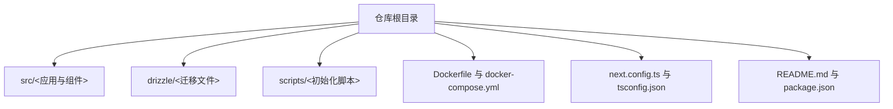
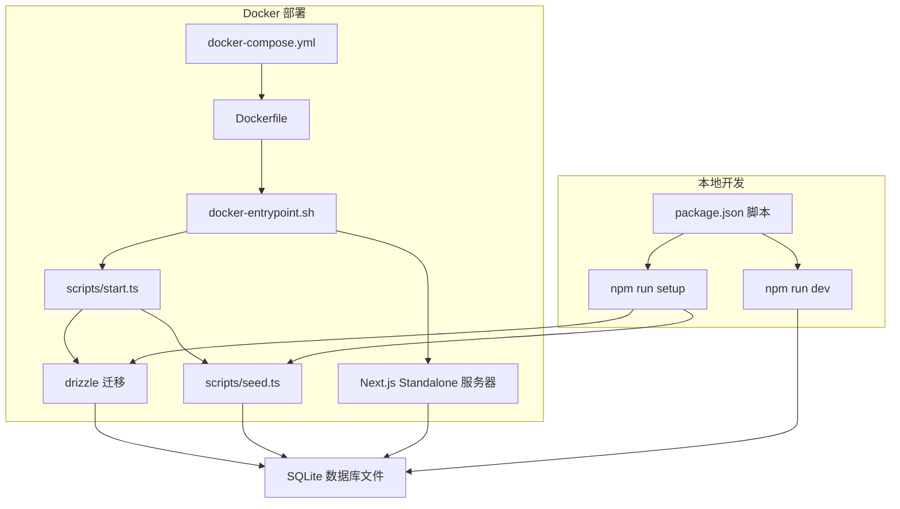
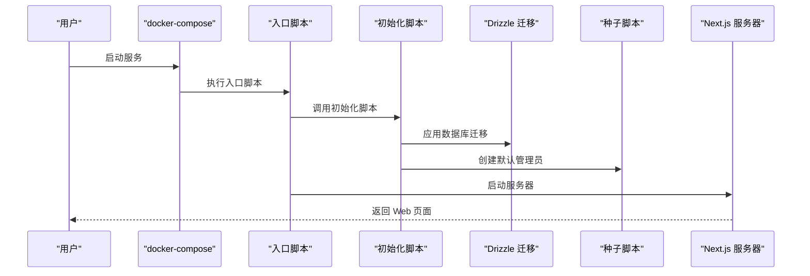
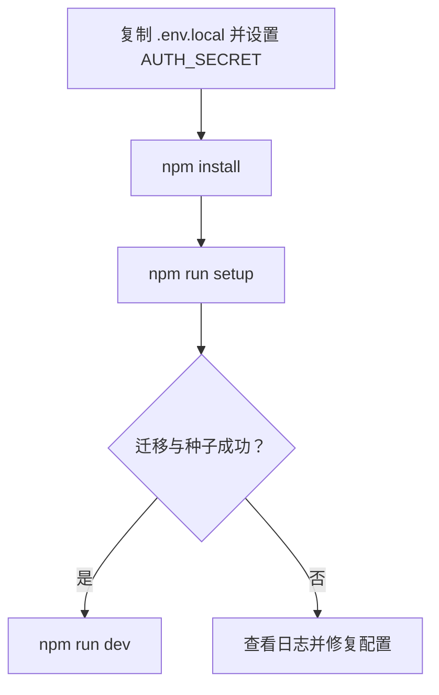
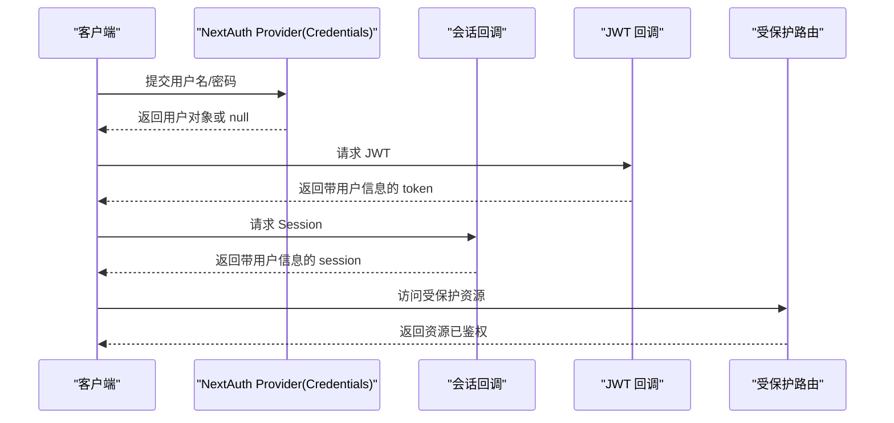
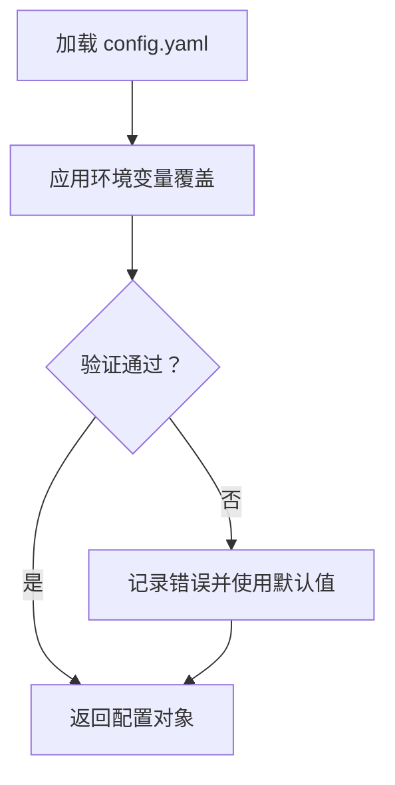
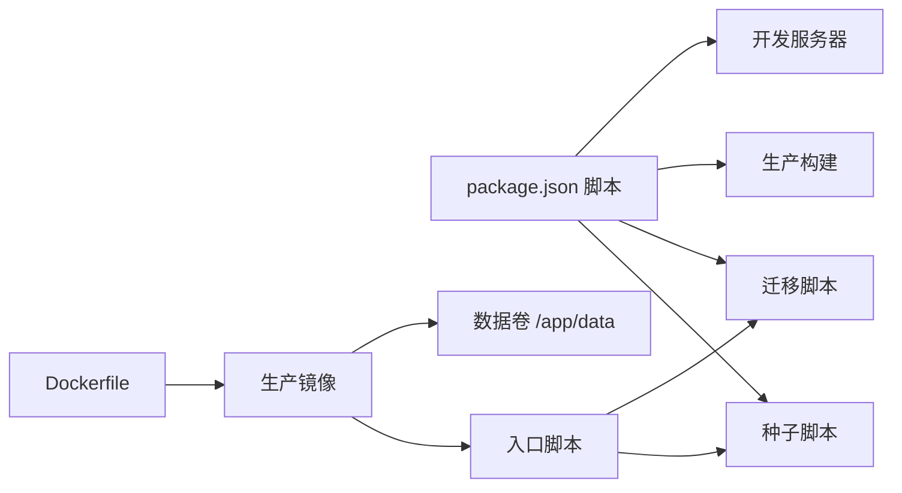

# 快速开始

<cite>
**本文引用的文件**
- [README.md](file://README.md)
- [package.json](file://package.json)
- [Dockerfile](file://Dockerfile)
- [docker-compose.yml](file://docker-compose.yml)
- [docker-entrypoint.sh](file://docker-entrypoint.sh)
- [drizzle.config.ts](file://drizzle.config.ts)
- [scripts/start.ts](file://scripts/start.ts)
- [scripts/seed.ts](file://scripts/seed.ts)
- [src/lib/config.ts](file://src/lib/config.ts)
- [src/lib/auth.config.ts](file://src/lib/auth.config.ts)
- [src/lib/db/schema.ts](file://src/lib/db/schema.ts)
- [next.config.ts](file://next.config.ts)
- [tsconfig.json](file://tsconfig.json)
</cite>

## 目录
1. [简介](#简介)
2. [项目结构](#项目结构)
3. [核心组件](#核心组件)
4. [架构总览](#架构总览)
5. [详细组件分析](#详细组件分析)
6. [依赖关系分析](#依赖关系分析)
7. [性能考虑](#性能考虑)
8. [故障排查指南](#故障排查指南)
9. [结论](#结论)
10. [附录](#附录)

## 简介
本指南面向首次接触 SillyTavern Next 的用户，帮助你在最短时间内完成安装与首次运行。项目基于 Next.js 16 + TypeScript + SQLite，提供两种部署方式：Docker 一键部署（推荐）与本地开发环境。你将学到如何准备环境变量、安装依赖、初始化数据库、创建管理员账户，并理解默认凭据与安全注意事项。

## 项目结构
- 应用主体位于 src/，采用 Next.js App Router 结构，包含页面、API 路由、组件、服务层、数据库 schema 与类型定义。
- 数据库迁移与种子脚本位于 drizzle/ 与 scripts/，分别负责数据库迁移与默认管理员创建。
- 配置与运行时相关文件包括 Dockerfile、docker-compose.yml、入口脚本、Next 配置与 TypeScript 配置。



章节来源
- [README.md:20-136](file://README.md#L20-L136)

## 核心组件
- Docker 一键部署：通过 docker-compose 启动，自动执行数据库迁移与默认管理员创建，暴露 3000 端口并持久化 SQLite 数据。
- 本地开发：复制示例环境变量文件，安装依赖，执行一键初始化脚本，启动开发服务器。
- 数据库与迁移：使用 Drizzle ORM + better-sqlite3，迁移文件位于 drizzle/，schema 定义在 src/lib/db/schema.ts。
- 认证与会话：基于 NextAuth v5 的 Credentials Provider，JWT 会话策略。
- 配置加载：支持 config.yaml 与环境变量覆盖，兼容原 SillyTavern 配置键。

章节来源
- [README.md:20-75](file://README.md#L20-L75)
- [package.json:6-16](file://package.json#L6-L16)
- [drizzle.config.ts:1-11](file://drizzle.config.ts#L1-L11)
- [src/lib/db/schema.ts:1-240](file://src/lib/db/schema.ts#L1-L240)
- [src/lib/auth.config.ts:1-53](file://src/lib/auth.config.ts#L1-L53)
- [src/lib/config.ts:1-184](file://src/lib/config.ts#L1-L184)

## 架构总览
下图展示了 Docker 与本地两种部署方式的启动流程与关键交互。



图表来源
- [docker-compose.yml:10-37](file://docker-compose.yml#L10-L37)
- [Dockerfile:1-63](file://Dockerfile#L1-L63)
- [docker-entrypoint.sh:1-33](file://docker-entrypoint.sh#L1-L33)
- [scripts/start.ts:1-43](file://scripts/start.ts#L1-L43)
- [scripts/seed.ts:1-28](file://scripts/seed.ts#L1-L28)
- [drizzle.config.ts:1-11](file://drizzle.config.ts#L1-L11)
- [package.json:6-16](file://package.json#L6-L16)

## 详细组件分析

### Docker 一键部署（推荐）
- 步骤
  1) 准备环境变量：复制示例文件并生成强随机 AUTH_SECRET。
  2) 一键启动：使用 docker compose 启动服务，自动执行迁移与种子脚本。
  3) 访问：浏览器打开 http://localhost:3000，默认管理员账号为 admin/admin（首次登录后请立即修改密码）。
- 关键点
  - 环境变量：AUTH_SECRET（必填）、AUTH_URL（可选，默认 http://localhost:3000）、DATABASE_URL（可选，默认 /app/data/sillytavern.db）、OPENAI_API_KEY 等（可选）。
  - 数据持久化：必须挂载 ./data 到 /app/data，避免容器重启丢失数据。
  - 健康检查：内置健康检查接口 /api/health，便于容器编排监控。
- 安全
  - AUTH_SECRET 必须使用强随机串（如 openssl rand -hex 32）生成。
  - 生产环境建议前置 Nginx/Caddy 提供 HTTPS。



图表来源
- [docker-compose.yml:10-37](file://docker-compose.yml#L10-L37)
- [docker-entrypoint.sh:14-32](file://docker-entrypoint.sh#L14-L32)
- [scripts/start.ts:23-42](file://scripts/start.ts#L23-L42)
- [scripts/seed.ts:14-27](file://scripts/seed.ts#L14-L27)

章节来源
- [README.md:22-38](file://README.md#L22-L38)
- [docker-compose.yml:10-37](file://docker-compose.yml#L10-L37)
- [Dockerfile:20-63](file://Dockerfile#L20-L63)
- [docker-entrypoint.sh:14-32](file://docker-entrypoint.sh#L14-L32)
- [README.md:150-156](file://README.md#L150-L156)

### 本地开发
- 步骤
  1) 准备环境变量：复制 .env.example 为 .env.local，至少设置 AUTH_SECRET。
  2) 安装依赖：npm install。
  3) 一键初始化：npm run setup（执行迁移 + 种子数据）。
  4) 启动开发服务器：npm run dev。
- 常用命令
  - npm run setup：一键初始化（迁移 + 种子数据）
  - npm run db:migrate：应用迁移
  - npm run db:seed：仅创建默认管理员
  - npm run start:fresh：清空数据库后重新初始化



图表来源
- [README.md:40-58](file://README.md#L40-L58)
- [package.json:6-16](file://package.json#L6-L16)
- [scripts/start.ts:23-42](file://scripts/start.ts#L23-L42)

章节来源
- [README.md:40-58](file://README.md#L40-L58)
- [package.json:6-16](file://package.json#L6-L16)

### 数据库初始化与迁移
- 迁移配置：drizzle.config.ts 指定 schema 与输出目录，并读取 DATABASE_URL。
- 迁移文件：drizzle/ 下存放 SQL 迁移文件，由 Drizzle Kit 管理。
- 初始化脚本：scripts/start.ts 会在启动前确保 data 目录存在并执行迁移；scripts/seed.ts 创建默认管理员。
- 数据库 schema：src/lib/db/schema.ts 定义了用户、角色卡、标签、Persona、群组、聊天、消息、世界书、预设、密钥、设置、模板等表。

```mermaid
erDiagram
USERS {
text id PK
text name
text handle UK
text password
text salt
text avatar
boolean admin
boolean enabled
int created_at
}
CHARACTERS {
text id PK
text user_id FK
text name
text description
text personality
text scenario
text first_message
text example_dialogue
text creator_notes
text system_prompt
text post_history_instructions
text alternate_greetings
text tags
text creator
text character_version
number talkativeness
boolean fav
text avatar
text extensions
text character_book
text world_info_book_id
text create_date
int created_at
int updated_at
}
TAGS {
text id PK
text user_id FK
text name
text color
text color2
int created_at
}
PERSONAS {
text id PK
text user_id FK
text name
text description
text avatar
boolean is_active
boolean is_default
int description_position
int depth
int depth_role
text lorebook_id
text connections
int created_at
int updated_at
}
GROUPS {
text id PK
text user_id FK
text name
text members
text disabled_members
text avatar
boolean fav
int activation_strategy
int generation_mode
boolean allow_self_responses
text generation_mode_join_prefix
text generation_mode_join_suffix
int auto_mode_delay
boolean hide_muted_sprites
int date_last_chat
text chat_metadata
int created_at
int updated_at
}
CHATS {
text id PK
text user_id FK
text character_id
text group_id
text title
text metadata
int created_at
int updated_at
}
MESSAGES {
text id PK
text chat_id FK
text name
boolean is_user
text content
text role
text swipes
int swipe_id
text swipe_info
boolean is_system
text force_avatar
text original_avatar
text gen_started
text gen_finished
text bookmark_link
text extra
text send_date
int created_at
}
WORLD_INFO {
text id PK
text user_id FK
text name
text entries
int created_at
int updated_at
}
PRESETS {
text id PK
text user_id FK
text name
text provider
text api_type
text settings
boolean is_default
boolean is_active
int created_at
int updated_at
}
SECRETS {
text id PK
text user_id FK
text key
text value
int created_at
}
SETTINGS {
text id PK
text user_id FK UK
text data
int updated_at
}
INSTRUCT_TEMPLATES {
text id PK
text user_id FK
text name
text content
int created_at
}
CONTEXT_TEMPLATES {
text id PK
text user_id FK
text name
text content
int created_at
}
USERS ||--o{ CHARACTERS : "拥有"
USERS ||--o{ TAGS : "拥有"
USERS ||--o{ PERSONAS : "拥有"
USERS ||--o{ GROUPS : "拥有"
USERS ||--o{ CHATS : "拥有"
USERS ||--o{ SECRETS : "拥有"
USERS ||--o{ SETTINGS : "拥有"
USERS ||--o{ INSTRUCT_TEMPLATES : "拥有"
USERS ||--o{ CONTEXT_TEMPLATES : "拥有"
CHARACTERS ||--o{ CHARACTER_TAGS : "被标记"
TAGS ||--o{ CHARACTER_TAGS : "被标记"
CHATS ||--o{ MESSAGES : "包含"
```

图表来源
- [src/lib/db/schema.ts:1-240](file://src/lib/db/schema.ts#L1-L240)

章节来源
- [drizzle.config.ts:1-11](file://drizzle.config.ts#L1-L11)
- [scripts/start.ts:17-42](file://scripts/start.ts#L17-L42)
- [scripts/seed.ts:14-27](file://scripts/seed.ts#L14-L27)
- [src/lib/db/schema.ts:1-240](file://src/lib/db/schema.ts#L1-L240)

### 认证与会话（NextAuth v5）
- 提供商：Credentials Provider（用户名/密码）。
- 会话策略：JWT，maxAge 为 30 天。
- 回调：在 JWT 与 Session 中注入用户 id、handle、admin 字段；登录页、认证 API 与健康检查接口为公开端点。
- 登录页：/login。



图表来源
- [src/lib/auth.config.ts:1-53](file://src/lib/auth.config.ts#L1-L53)

章节来源
- [src/lib/auth.config.ts:1-53](file://src/lib/auth.config.ts#L1-L53)

### 配置加载（config.yaml 与环境变量）
- 支持 config.yaml 与环境变量覆盖，兼容原 SillyTavern 配置键。
- 环境变量键命名规则：SILLYTAVERN_<大写键名，点号替换为下划线>。
- 内置默认值与类型校验，Zod 验证失败时使用默认值。



图表来源
- [src/lib/config.ts:88-117](file://src/lib/config.ts#L88-L117)

章节来源
- [src/lib/config.ts:1-184](file://src/lib/config.ts#L1-L184)

## 依赖关系分析
- 构建与运行
  - Dockerfile 使用多阶段构建，生产镜像基于 node:20-alpine，启用 tini 作为 init，暴露 3000 端口，挂载 /app/data 为数据卷。
  - next.config.ts 设置 output 为 standalone，并声明 serverExternalPackages 包含 better-sqlite3。
- 依赖与脚本
  - package.json 定义了开发、构建、迁移、种子与类型检查等常用脚本。
  - Dockerfile 在运行时安装 tsx、drizzle-kit、better-sqlite3，确保迁移与种子脚本可用。



图表来源
- [package.json:6-16](file://package.json#L6-L16)
- [Dockerfile:20-63](file://Dockerfile#L20-L63)
- [next.config.ts:3-11](file://next.config.ts#L3-L11)

章节来源
- [Dockerfile:1-63](file://Dockerfile#L1-L63)
- [next.config.ts:1-14](file://next.config.ts#L1-L14)
- [package.json:1-61](file://package.json#L1-L61)

## 性能考虑
- SQLite 单文件存储，适合单机部署与轻量场景；若需要高并发或分布式部署，建议评估替代方案。
- Next.js Standalone 输出减少运行时依赖体积，提升启动速度。
- 适当调整 AI Provider 的默认模型与上下文长度，平衡生成质量与响应时间。

## 故障排查指南
- AUTH_SECRET 未设置
  - 症状：容器启动时报错提示未设置 AUTH_SECRET。
  - 处理：在 .env 或 docker-compose.yml 中设置 AUTH_SECRET，使用强随机串生成。
- 数据库迁移失败
  - 症状：迁移命令异常或提示已是最新但仍需继续。
  - 处理：确认 DATABASE_URL 指向正确路径，检查权限与磁盘空间；必要时清理旧迁移痕迹后重试。
- 默认管理员未创建
  - 症状：登录后发现不存在 admin 账号。
  - 处理：确认种子脚本执行成功；若已存在则跳过；如失败请检查日志并重试。
- 端口占用或无法访问
  - 症状：浏览器无法访问 http://localhost:3000。
  - 处理：检查宿主机端口占用情况；确认 docker-compose 映射的端口与容器内端口一致。
- 生产环境 HTTPS
  - 建议：前置 Nginx/Caddy 提供 HTTPS 与证书管理，避免明文传输。

章节来源
- [docker-entrypoint.sh:14-19](file://docker-entrypoint.sh#L14-L19)
- [scripts/start.ts:25-30](file://scripts/start.ts#L25-L30)
- [scripts/seed.ts:14-18](file://scripts/seed.ts#L14-L18)
- [README.md:150-156](file://README.md#L150-L156)

## 结论
通过本指南，你可以在几分钟内完成 SillyTavern Next 的安装与首次运行。Docker 一键部署适合大多数用户，本地开发适合需要调试与二次开发的场景。请务必设置强随机 AUTH_SECRET、修改默认管理员密码，并在生产环境中启用 HTTPS 与数据持久化。

## 附录
- 常用命令速查
  - docker compose up -d：启动服务
  - npm run setup：一键初始化（迁移 + 种子数据）
  - npm run db:migrate：应用迁移
  - npm run db:seed：仅创建默认管理员
  - npm run start:fresh：清空数据库后重新初始化
  - npm run dev：启动开发服务器
- 环境变量清单
  - AUTH_SECRET（必填）
  - AUTH_URL（可选，默认 http://localhost:3000）
  - DATABASE_URL（可选，默认 ./data/sillytavern.db）
  - OPENAI_API_KEY、ANTHROPIC_API_KEY、GOOGLE_GENERATIVE_AI_API_KEY（可选）

章节来源
- [README.md:20-75](file://README.md#L20-L75)
- [package.json:6-16](file://package.json#L6-L16)
- [docker-compose.yml:20-30](file://docker-compose.yml#L20-L30)