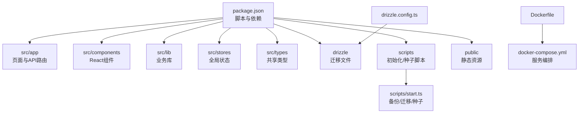
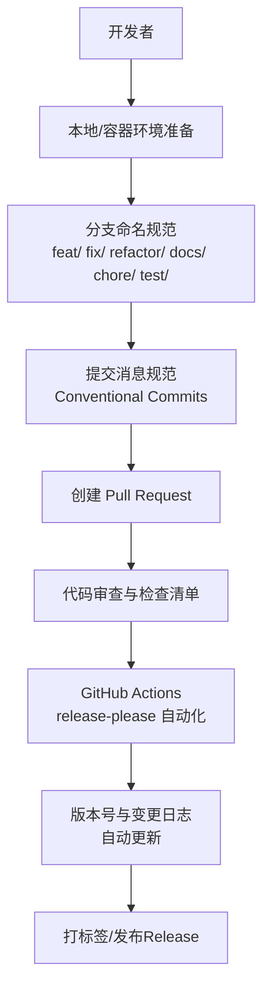
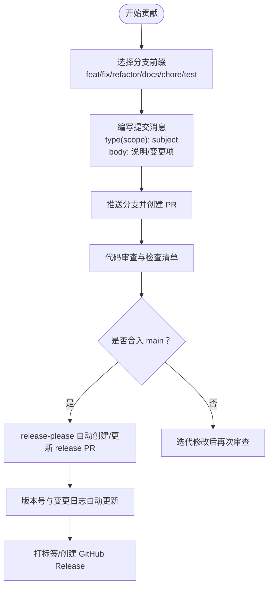
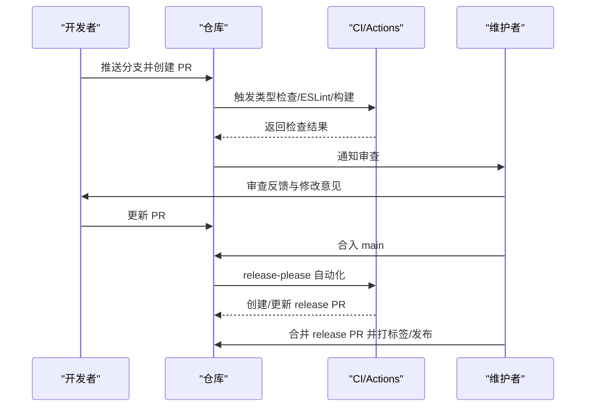
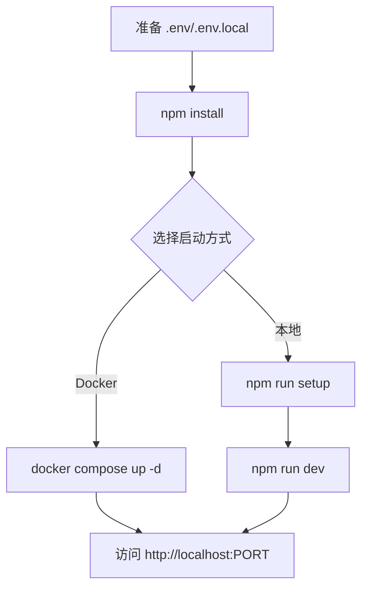
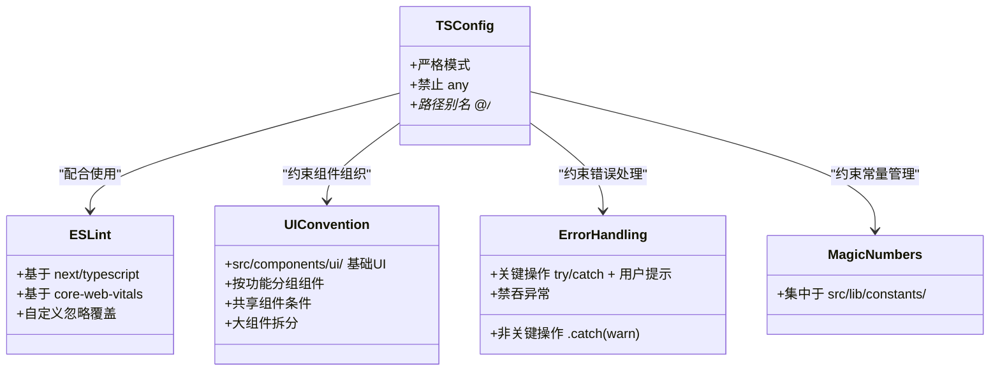
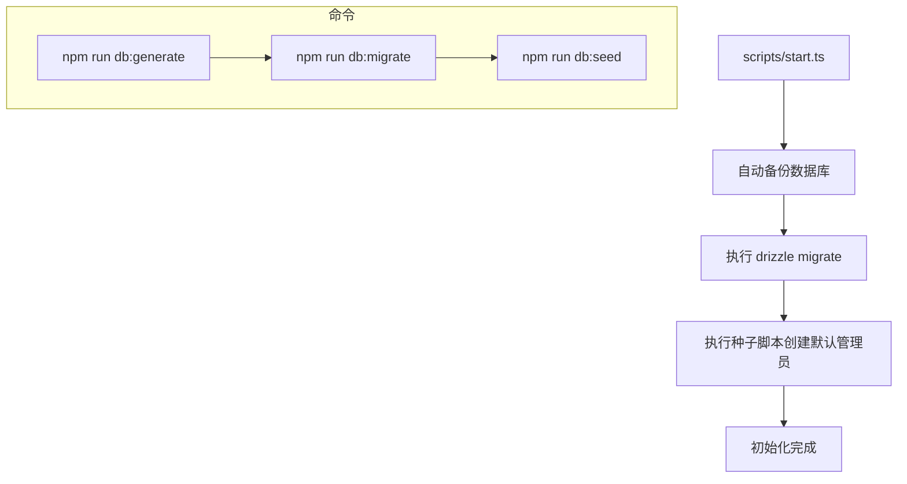
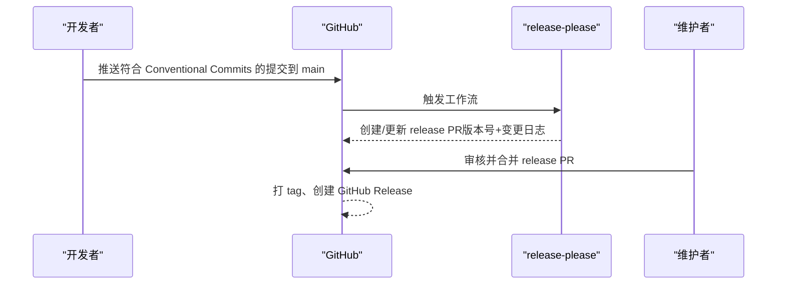
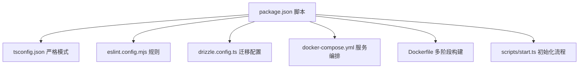

# 代码贡献流程

<cite>
**本文引用的文件**   
- [CONTRIBUTING.md](file://CONTRIBUTING.md)
- [README.md](file://README.md)
- [package.json](file://package.json)
- [eslint.config.mjs](file://eslint.config.mjs)
- [tsconfig.json](file://tsconfig.json)
- [docker-compose.yml](file://docker-compose.yml)
- [Dockerfile](file://Dockerfile)
- [scripts/start.ts](file://scripts/start.ts)
- [drizzle.config.ts](file://drizzle.config.ts)
- [.release-please-manifest.json](file://.release-please-manifest.json)
- [release-please-config.json](file://release-please-config.json)
- [.github/workflows/release-please.yml](file://.github/workflows/release-please.yml)
</cite>

## 目录
1. [简介](#简介)
2. [项目结构](#项目结构)
3. [核心组件](#核心组件)
4. [架构总览](#架构总览)
5. [详细组件分析](#详细组件分析)
6. [依赖分析](#依赖分析)
7. [性能考虑](#性能考虑)
8. [故障排查指南](#故障排查指南)
9. [结论](#结论)
10. [附录](#附录)

## 简介
本指南面向希望参与 SillyTavern Next 项目的贡献者，覆盖从开发环境搭建、代码规范、分支与提交消息规范、Pull Request 流程、代码审查标准、测试与文档更新、到持续集成与发布流程的完整贡献流程。项目采用 Next.js 16 + TypeScript + SQLite 技术栈，提供 Docker 一键部署与本地开发两种方式，并通过 release-please 自动化版本与变更日志维护。

## 项目结构
- 顶层脚本与配置：通过 package.json 提供开发、构建、数据库迁移与种子初始化等常用命令；tsconfig.json 与 eslint.config.mjs 定义 TypeScript 严格模式与 ESLint 规则；drizzle.config.ts 配置数据库迁移路径。
- 应用与组件：src/app 为 Next.js App Router 页面与 API 路由；src/components 为 React 组件；src/lib 为业务库（认证、常量、数据库、格式化、服务等）；src/stores 为全局状态；src/types 为共享类型定义。
- 数据与脚本：drizzle 目录存放数据库迁移文件；scripts 目录包含一键初始化与种子脚本；public 目录存放静态资源。
- 部署：Dockerfile 与 docker-compose.yml 提供多阶段构建与生产运行时配置；scripts/start.ts 在容器入口与本地首次启动时执行自动备份、迁移与种子初始化。

**图表来源**
- [package.json:1-61](file://package.json#L1-L61)
- [Dockerfile:1-63](file://Dockerfile#L1-L63)
- [docker-compose.yml:1-37](file://docker-compose.yml#L1-L37)
- [scripts/start.ts:1-96](file://scripts/start.ts#L1-L96)
- [drizzle.config.ts:1-11](file://drizzle.config.ts#L1-L11)

**章节来源**
- [README.md:76-136](file://README.md#L76-L136)
- [package.json:1-61](file://package.json#L1-L61)

## 核心组件
- 贡献规则与流程：包括 Issue 提交、PR 工作流、分支命名、提交消息规范、版本与变更日志自动化、PR 检查清单与代码风格规范。
- 开发环境与本地配置：提供 Docker 与本地两种启动方式；环境变量说明；常用命令与初始化流程。
- 代码规范：TypeScript 严格模式、ESLint 规则、UI 组件目录约定、错误处理与魔法数规范。
- 数据库与迁移：Drizzle ORM 配置、迁移生成与应用、种子数据与自动备份策略。
- 持续集成与发布：GitHub Actions release-please 自动化版本与变更日志维护。

**章节来源**
- [CONTRIBUTING.md:1-156](file://CONTRIBUTING.md#L1-L156)
- [README.md:20-136](file://README.md#L20-L136)
- [eslint.config.mjs:1-19](file://eslint.config.mjs#L1-L19)
- [tsconfig.json:1-35](file://tsconfig.json#L1-L35)
- [drizzle.config.ts:1-11](file://drizzle.config.ts#L1-L11)
- [.release-please-manifest.json:1-3](file://.release-please-manifest.json#L1-L3)
- [release-please-config.json](file://release-please-config.json)

## 架构总览
下图展示贡献流程中的关键环节：从本地开发环境准备，到分支与提交消息规范，再到 PR 审查、自动化版本与发布。

**图表来源**
- [CONTRIBUTING.md:17-116](file://CONTRIBUTING.md#L17-L116)
- [.github/workflows/release-please.yml:1-26](file://.github/workflows/release-please.yml#L1-L26)
- [release-please-config.json](file://release-please-config.json)

## 详细组件分析

### 分支策略与提交消息规范
- 分支命名前缀：
  - feat/：新增功能
  - fix/：Bug 修复
  - refactor/：重构（不改变外部行为）
  - docs/：文档变更
  - chore/：构建/工具
  - test/：测试相关
- 提交消息遵循 Conventional Commits，包含 type、scope 与 subject，并可在 body 中补充说明与 Breaking Change。
- 版本号与变更日志自动化：项目使用 release-please，依据 Conventional Commits 自动生成版本号与变更日志；贡献者无需手动修改版本号与变更日志。

**图表来源**
- [CONTRIBUTING.md:41-116](file://CONTRIBUTING.md#L41-L116)
- [.github/workflows/release-please.yml:1-26](file://.github/workflows/release-please.yml#L1-L26)
- [.release-please-manifest.json:1-3](file://.release-please-manifest.json#L1-L3)

**章节来源**
- [CONTRIBUTING.md:41-116](file://CONTRIBUTING.md#L41-L116)

### Pull Request 流程与审查标准
- PR 合入前需满足：
  - TypeScript 类型检查通过
  - ESLint 无错误
  - 构建成功
  - 新功能具备简要说明（Why + How）
  - 涉及 schema 变更时附带迁移文件（生成与应用）
  - 涉及 UI 时附截图或录屏
  - 不提交敏感本地文件（.env*、data/*.db*）
- 审查重点：代码风格一致性、错误处理、魔法数集中管理、组件拆分与复用、安全与性能。

**图表来源**
- [CONTRIBUTING.md:105-116](file://CONTRIBUTING.md#L105-L116)
- [.github/workflows/release-please.yml:1-26](file://.github/workflows/release-please.yml#L1-L26)

**章节来源**
- [CONTRIBUTING.md:105-116](file://CONTRIBUTING.md#L105-L116)

### 开发环境搭建与本地配置
- Docker 一键启动（推荐）：
  - 准备 .env，设置 AUTH_SECRET（强随机）
  - docker compose up -d
  - 访问 http://localhost:3000，默认账号 admin/admin
- 本地开发：
  - 准备 .env.local，至少设置 AUTH_SECRET
  - npm install
  - npm run setup（自动备份 → 迁移 → 种子）
  - npm run dev
- 常用命令：
  - 开发：npm run dev
  - 构建：npm run build
  - 启动：npm run start
  - 初始化：npm run setup
  - 数据库迁移：npm run db:migrate
  - 数据库生成迁移：npm run db:generate
  - 数据库种子：npm run db:seed
  - ESLint：npm run lint
  - 类型检查：npm run typecheck

**图表来源**
- [README.md:20-75](file://README.md#L20-L75)
- [README.md:123-136](file://README.md#L123-L136)
- [docker-compose.yml:1-37](file://docker-compose.yml#L1-L37)
- [Dockerfile:1-63](file://Dockerfile#L1-L63)

**章节来源**
- [README.md:20-75](file://README.md#L20-L75)
- [README.md:123-136](file://README.md#L123-L136)
- [docker-compose.yml:1-37](file://docker-compose.yml#L1-L37)
- [Dockerfile:1-63](file://Dockerfile#L1-L63)

### 代码规范与质量保障
- TypeScript 规范：
  - 严格模式开启，禁止 any 与滥用断言
  - 优先使用 interface 描述对象类型，type 用于联合/工具类型
  - 共享类型放置于 src/types/index.ts
  - 异步函数必须 await 或显式处理错误
- ESLint 规则：
  - 基于 eslint-config-next/typescript 与 core-web-vitals
  - 自定义忽略规则覆盖默认忽略列表
- UI 组件目录约定：
  - 通用基础 UI 放置于 src/components/ui/
  - 功能模块组件按功能分组（如 characters/、chat/）
  - 仅在两个或多个页面引用时才提取为共享组件
  - 大组件（>200 行）拆分为独立文件
- 错误处理规范：
  - 关键操作（保存、同步）：try/catch + 用户可见错误提示
  - 非关键操作：.catch(console.warn) 至少记录日志
  - 禁止吞掉异常（如必须忽略，需注释说明原因）
- 魔法数规范：
  - 定时器、阈值、限制值等数字常量集中放置于 src/lib/constants/

**图表来源**
- [tsconfig.json:1-35](file://tsconfig.json#L1-L35)
- [eslint.config.mjs:1-19](file://eslint.config.mjs#L1-L19)
- [CONTRIBUTING.md:117-142](file://CONTRIBUTING.md#L117-L142)

**章节来源**
- [tsconfig.json:1-35](file://tsconfig.json#L1-L35)
- [eslint.config.mjs:1-19](file://eslint.config.mjs#L1-L19)
- [CONTRIBUTING.md:117-142](file://CONTRIBUTING.md#L117-L142)

### 数据库与迁移流程
- Drizzle 配置：schema 路径、输出目录、方言与数据库连接。
- 迁移生成与应用：通过 npm run db:generate 生成迁移文件，npm run db:migrate 应用迁移。
- 种子数据：npm run db:seed 创建默认管理员账号。
- 初始化脚本：scripts/start.ts 在启动前自动备份数据库、执行迁移、创建默认管理员；支持本地与容器两种场景。

**图表来源**
- [drizzle.config.ts:1-11](file://drizzle.config.ts#L1-L11)
- [scripts/start.ts:1-96](file://scripts/start.ts#L1-L96)
- [package.json:10-13](file://package.json#L10-L13)

**章节来源**
- [drizzle.config.ts:1-11](file://drizzle.config.ts#L1-L11)
- [scripts/start.ts:1-96](file://scripts/start.ts#L1-L96)
- [package.json:10-13](file://package.json#L10-L13)

### 持续集成与发布流程
- release-please 自动化：
  - 监听 main 分支推送，累积自上次 tag 的 conventional commits
  - 自动创建/更新 release PR（自动 bump 版本 + 写入变更日志）
  - release PR 合并后自动打 tag、创建 GitHub Release
- 版本号与变更日志规则：
  - fix/perf/refactor → patch
  - feat → minor
  - feat! 或包含 BREAKING CHANGE → minor（v0.x 不跳 major）并生成 ⚠️ BREAKING CHANGES 小节
  - docs/chore/test/style/ci → 不触发 release

**图表来源**
- [.github/workflows/release-please.yml:1-26](file://.github/workflows/release-please.yml#L1-L26)
- [CONTRIBUTING.md:79-116](file://CONTRIBUTING.md#L79-L116)
- [.release-please-manifest.json:1-3](file://.release-please-manifest.json#L1-L3)

**章节来源**
- [.github/workflows/release-please.yml:1-26](file://.github/workflows/release-please.yml#L1-L26)
- [CONTRIBUTING.md:79-116](file://CONTRIBUTING.md#L79-L116)
- [.release-please-manifest.json:1-3](file://.release-please-manifest.json#L1-L3)

### 常见贡献场景操作指南
- 修复 Bug（fix/ 前缀）：
  - 创建分支：git checkout -b fix/xxx
  - 编写最小可复现步骤与预期/实际行为
  - 提交消息遵循 Conventional Commits
  - 通过类型检查与 ESLint
- 添加新功能（feat/ 前缀）：
  - 设计 UI/交互与后端接口（如有）
  - 编写测试用例（如适用）
  - 更新相关文档与变更日志（由 release-please 自动维护）
- 改进文档（docs/ 前缀）：
  - 保持简洁清晰，提供示例与截图
  - 遵循现有文档风格
- 重构（refactor/ 前缀）：
  - 保持外部行为不变
  - 拆分大组件、提取共享组件、集中魔法数
- 测试（test/ 前缀）：
  - 补充单元/集成测试，覆盖关键路径
  - 通过类型检查与 ESLint

**章节来源**
- [CONTRIBUTING.md:15-116](file://CONTRIBUTING.md#L15-L116)

## 依赖分析
- 开发脚本与命令：
  - package.json 定义了 dev、build、start、setup、db:generate、db:migrate、db:seed、lint、typecheck 等脚本。
- TypeScript 与 ESLint：
  - tsconfig.json 启用严格模式、路径别名与增量编译
  - eslint.config.mjs 基于 next/typescript 与 core-web-vitals，并自定义忽略规则
- 数据库与迁移：
  - drizzle.config.ts 指定 schema 与输出目录，结合 scripts/start.ts 实现自动备份、迁移与种子
- 容器化与运行时：
  - Dockerfile 多阶段构建，Docker Compose 提供服务编排与健康检查

**图表来源**
- [package.json:1-61](file://package.json#L1-L61)
- [tsconfig.json:1-35](file://tsconfig.json#L1-L35)
- [eslint.config.mjs:1-19](file://eslint.config.mjs#L1-L19)
- [drizzle.config.ts:1-11](file://drizzle.config.ts#L1-L11)
- [docker-compose.yml:1-37](file://docker-compose.yml#L1-L37)
- [Dockerfile:1-63](file://Dockerfile#L1-L63)
- [scripts/start.ts:1-96](file://scripts/start.ts#L1-L96)

**章节来源**
- [package.json:1-61](file://package.json#L1-L61)
- [tsconfig.json:1-35](file://tsconfig.json#L1-L35)
- [eslint.config.mjs:1-19](file://eslint.config.mjs#L1-L19)
- [drizzle.config.ts:1-11](file://drizzle.config.ts#L1-L11)
- [docker-compose.yml:1-37](file://docker-compose.yml#L1-L37)
- [Dockerfile:1-63](file://Dockerfile#L1-L63)
- [scripts/start.ts:1-96](file://scripts/start.ts#L1-L96)

## 性能考虑
- 严格类型与增量编译：启用 strict 与 incremental，提升类型检查效率与开发体验。
- ESLint 规则：基于 next/typescript 与 core-web-vitals，减少潜在性能隐患。
- 数据库 WAL 模式：备份时同时复制 -wal/-shm 文件，保证一致性与回滚可靠性。
- 容器运行时：使用 tini 作为 init 进程，非 root 用户运行，提升安全性与稳定性。

**章节来源**
- [tsconfig.json:1-35](file://tsconfig.json#L1-L35)
- [eslint.config.mjs:1-19](file://eslint.config.mjs#L1-L19)
- [scripts/start.ts:40-62](file://scripts/start.ts#L40-L62)
- [Dockerfile:20-63](file://Dockerfile#L20-L63)

## 故障排查指南
- 初始化失败（数据库迁移）：
  - 查看 scripts/start.ts 的错误日志与回滚提示
  - 使用提供的回滚命令恢复数据库与 WAL/SHM 文件
- 环境变量问题：
  - Docker：确认 .env 中 AUTH_SECRET 已设置且为强随机
  - 本地：确认 .env.local 中至少设置 AUTH_SECRET
- 健康检查失败：
  - docker-compose.yml 中配置了健康检查，若失败可检查服务日志与端口映射
- 版本与变更日志异常：
  - release-please 工作流会在 main 分支推送后自动创建/更新 release PR，若未出现请检查工作流权限与配置文件

**章节来源**
- [scripts/start.ts:67-92](file://scripts/start.ts#L67-L92)
- [docker-compose.yml:20-37](file://docker-compose.yml#L20-L37)
- [.github/workflows/release-please.yml:14-26](file://.github/workflows/release-please.yml#L14-L26)

## 结论
本指南提供了从环境搭建、分支与提交规范、PR 审查、质量保障到自动化发布的完整贡献流程。建议贡献者在提交前先阅读贡献指南与 README，确保本地与容器环境一致，遵循代码规范并通过所有自动化检查，以提高审查效率与发布质量。

## 附录
- 环境变量参考（Docker 与本地均适用）：
  - AUTH_SECRET：必填，强随机密钥
  - AUTH_URL：可选，默认 http://localhost:3000
  - DATABASE_URL：可选，默认 ./data/sillytavern.db
  - OPENAI_API_KEY、ANTHROPIC_API_KEY、GOOGLE_GENERATIVE_AI_API_KEY：可选，作为默认值
  - PORT：可选，Docker 端口映射，默认 3000
- 常用命令速查：
  - npm run dev、npm run build、npm run start、npm run setup、npm run start:fresh、npm run db:generate、npm run db:migrate、npm run db:seed、npm run lint、npm run typecheck

**章节来源**
- [README.md:62-75](file://README.md#L62-L75)
- [README.md:123-136](file://README.md#L123-L136)
- [docker-compose.yml:20-30](file://docker-compose.yml#L20-L30)