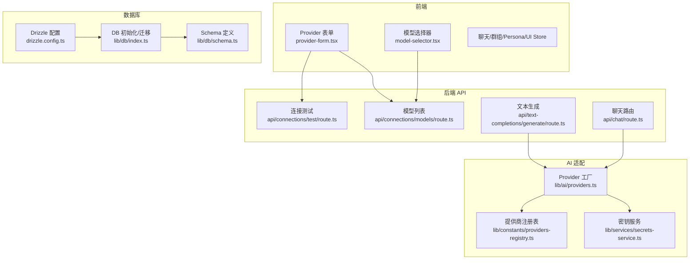
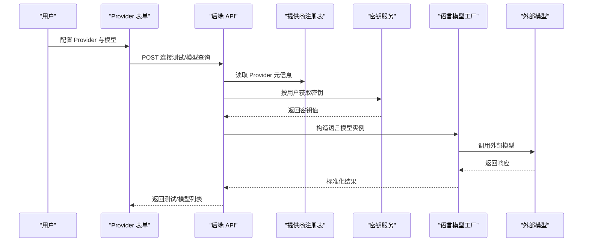
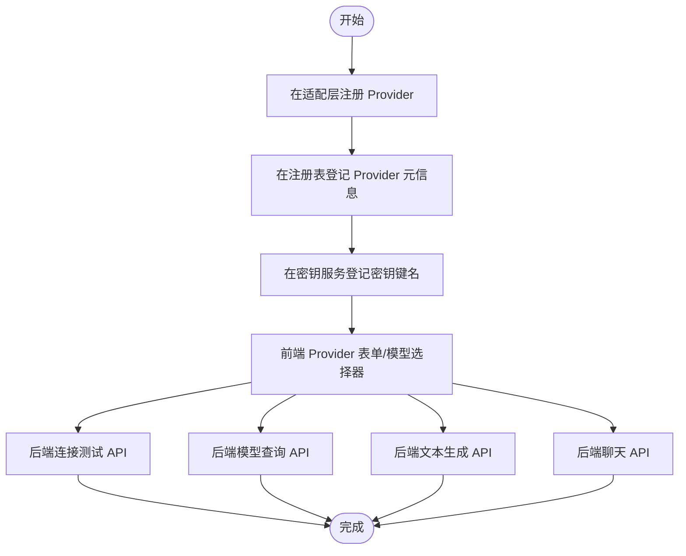
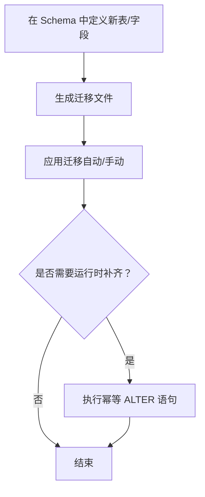
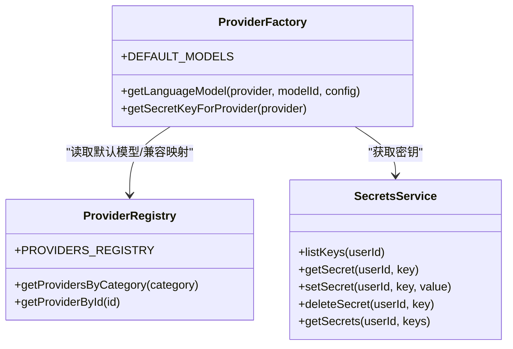
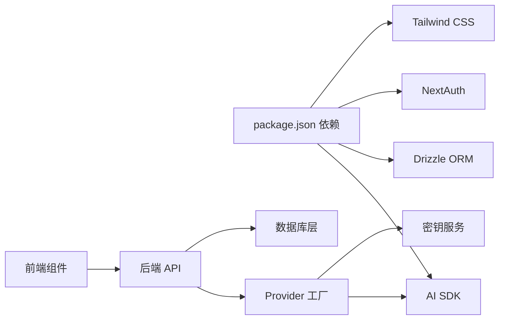

# 扩展开发

<cite>
**本文引用的文件**   
- [README.md](file://README.md)
- [CONTRIBUTING.md](file://CONTRIBUTING.md)
- [package.json](file://package.json)
- [drizzle.config.ts](file://drizzle.config.ts)
- [src/lib/ai/providers.ts](file://src/lib/ai/providers.ts)
- [src/lib/constants/providers-registry.ts](file://src/lib/constants/providers-registry.ts)
- [src/lib/services/secrets-service.ts](file://src/lib/services/secrets-service.ts)
- [src/lib/db/schema.ts](file://src/lib/db/schema.ts)
- [src/lib/db/index.ts](file://src/lib/db/index.ts)
- [src/app/api/connections/test/route.ts](file://src/app/api/connections/test/route.ts)
- [src/app/api/connections/models/route.ts](file://src/app/api/connections/models/route.ts)
- [src/app/api/text-completions/generate/route.ts](file://src/app/api/text-completions/generate/route.ts)
- [src/app/api/chat/route.ts](file://src/app/api/chat/route.ts)
- [src/components/settings/provider-form.tsx](file://src/components/settings/provider-form.tsx)
- [src/components/settings/model-selector.tsx](file://src/components/settings/model-selector.tsx)
- [src/hooks/useGroupGeneration.ts](file://src/hooks/useGroupGeneration.ts)
- [src/hooks/useGroupAutoMode.ts](file://src/hooks/useGroupAutoMode.ts)
- [src/stores/chat-store.ts](file://src/stores/chat-store.ts)
- [src/stores/worldinfo-store.ts](file://src/stores/worldinfo-store.ts)
- [src/stores/persona-store.ts](file://src/stores/persona-store.ts)
- [src/stores/textgen-preset-store.ts](file://src/stores/textgen-preset-store.ts)
- [src/types/api-connections.ts](file://src/types/api-connections.ts)
- [src/types/index.ts](file://src/types/index.ts)
</cite>

## 目录
1. [简介](#简介)
2. [项目结构](#项目结构)
3. [核心组件](#核心组件)
4. [架构总览](#架构总览)
5. [详细组件分析](#详细组件分析)
6. [依赖分析](#依赖分析)
7. [性能考量](#性能考量)
8. [故障排查指南](#故障排查指南)
9. [结论](#结论)
10. [附录](#附录)

## 简介
本指南面向希望为 SillyTavern Next 开发扩展的工程师与贡献者，涵盖以下主题：
- 新 AI Provider 的开发流程与对接要点
- 数据库表扩展方法与迁移策略
- 插件/配置系统的使用与最佳实践
- 代码贡献流程、开发环境搭建与测试策略
- 扩展点设计原理、API 接口规范与兼容性考虑
- 性能优化与安全注意事项
- 完整教程与示例代码路径指引

## 项目结构
SillyTavern Next 采用 Next.js App Router + TypeScript + SQLite + Drizzle ORM 的技术栈，核心扩展点分布在以下区域：
- AI Provider 适配层：统一语言模型工厂与提供商注册表
- 数据库层：Drizzle ORM Schema + 迁移 + 运行时字段补齐
- API 层：连接测试、模型查询、文本生成、聊天等后端接口
- 前端设置与选择器：Provider 表单、模型选择器
- 状态与 Hooks：聊天、群组、Persona、预设等状态管理
- 类型系统：统一的扩展类型定义

图表来源
- [src/components/settings/provider-form.tsx](file://src/components/settings/provider-form.tsx)
- [src/components/settings/model-selector.tsx](file://src/components/settings/model-selector.tsx)
- [src/app/api/connections/test/route.ts](file://src/app/api/connections/test/route.ts)
- [src/app/api/connections/models/route.ts](file://src/app/api/connections/models/route.ts)
- [src/app/api/text-completions/generate/route.ts](file://src/app/api/text-completions/generate/route.ts)
- [src/app/api/chat/route.ts](file://src/app/api/chat/route.ts)
- [src/lib/ai/providers.ts](file://src/lib/ai/providers.ts)
- [src/lib/constants/providers-registry.ts](file://src/lib/constants/providers-registry.ts)
- [src/lib/services/secrets-service.ts](file://src/lib/services/secrets-service.ts)
- [src/lib/db/index.ts](file://src/lib/db/index.ts)
- [src/lib/db/schema.ts](file://src/lib/db/schema.ts)
- [drizzle.config.ts](file://drizzle.config.ts)

章节来源
- [README.md:76-136](file://README.md#L76-L136)

## 核心组件
- AI Provider 适配器系统：统一语言模型工厂，支持 OpenAI 兼容与多家厂商；提供默认模型映射与密钥名称映射。
- 提供商注册表：集中维护各 Provider 的元信息、模型列表、文档链接、额外表单项等。
- 密钥服务：基于用户隔离的加密存储与检索，支持批量获取与 upsert。
- 数据库层：Drizzle ORM + SQLite，提供 Schema 定义、迁移与运行时字段补齐。
- API 接口：连接测试、模型查询、文本生成、聊天等后端路由。
- 前端设置与选择器：Provider 表单与模型选择器，驱动后端 API 完成配置与验证。
- 状态与 Hooks：聊天、群组、Persona、预设等状态管理，支撑扩展交互。

章节来源
- [src/lib/ai/providers.ts:1-174](file://src/lib/ai/providers.ts#L1-L174)
- [src/lib/constants/providers-registry.ts:1-749](file://src/lib/constants/providers-registry.ts#L1-L749)
- [src/lib/services/secrets-service.ts:1-116](file://src/lib/services/secrets-service.ts#L1-L116)
- [src/lib/db/schema.ts:1-240](file://src/lib/db/schema.ts#L1-L240)
- [src/lib/db/index.ts:1-134](file://src/lib/db/index.ts#L1-L134)

## 架构总览
SillyTavern Next 的扩展架构围绕“统一适配 + 注册表 + 安全密钥 + ORM 数据层”展开，前端通过设置面板与 API 交互，后端通过 Provider 工厂与第三方模型对接，数据库负责持久化与迁移。

图表来源
- [src/components/settings/provider-form.tsx](file://src/components/settings/provider-form.tsx)
- [src/app/api/connections/test/route.ts](file://src/app/api/connections/test/route.ts)
- [src/app/api/connections/models/route.ts](file://src/app/api/connections/models/route.ts)
- [src/lib/constants/providers-registry.ts](file://src/lib/constants/providers-registry.ts)
- [src/lib/services/secrets-service.ts](file://src/lib/services/secrets-service.ts)
- [src/lib/ai/providers.ts](file://src/lib/ai/providers.ts)

## 详细组件分析

### 新 AI Provider 开发流程
- 步骤概览
  1) 在适配层注册 Provider：完善语言模型工厂与默认模型映射。
  2) 在注册表中登记 Provider：补充元信息、模型列表、额外表单项与文档链接。
  3) 在密钥服务中登记密钥键名：确保按用户隔离存储与检索。
  4) 前端 Provider 表单与模型选择器联动后端 API。
  5) 编写后端 API 路由：连接测试、模型查询、文本生成、聊天等。
  6) 迁移与数据库扩展：如需持久化配置，按 ORM Schema 扩展并生成迁移。
- 关键实现路径
  - 适配层注册：[src/lib/ai/providers.ts](file://src/lib/ai/providers.ts)
  - 注册表登记：[src/lib/constants/providers-registry.ts](file://src/lib/constants/providers-registry.ts)
  - 密钥服务登记：[src/lib/services/secrets-service.ts](file://src/lib/services/secrets-service.ts)
  - 前端表单与选择器：[src/components/settings/provider-form.tsx](file://src/components/settings/provider-form.tsx)、[src/components/settings/model-selector.tsx](file://src/components/settings/model-selector.tsx)
  - 后端 API（连接测试/模型查询/文本生成/聊天）：[src/app/api/connections/test/route.ts](file://src/app/api/connections/test/route.ts)、[src/app/api/connections/models/route.ts](file://src/app/api/connections/models/route.ts)、[src/app/api/text-completions/generate/route.ts](file://src/app/api/text-completions/generate/route.ts)、[src/app/api/chat/route.ts](file://src/app/api/chat/route.ts)
  - 类型定义：[src/types/api-connections.ts](file://src/types/api-connections.ts)、[src/types/index.ts](file://src/types/index.ts)

图表来源
- [src/lib/ai/providers.ts](file://src/lib/ai/providers.ts)
- [src/lib/constants/providers-registry.ts](file://src/lib/constants/providers-registry.ts)
- [src/lib/services/secrets-service.ts](file://src/lib/services/secrets-service.ts)
- [src/components/settings/provider-form.tsx](file://src/components/settings/provider-form.tsx)
- [src/components/settings/model-selector.tsx](file://src/components/settings/model-selector.tsx)
- [src/app/api/connections/test/route.ts](file://src/app/api/connections/test/route.ts)
- [src/app/api/connections/models/route.ts](file://src/app/api/connections/models/route.ts)
- [src/app/api/text-completions/generate/route.ts](file://src/app/api/text-completions/generate/route.ts)
- [src/app/api/chat/route.ts](file://src/app/api/chat/route.ts)

章节来源
- [README.md:138-149](file://README.md#L138-L149)
- [src/lib/ai/providers.ts:55-97](file://src/lib/ai/providers.ts#L55-L97)
- [src/lib/constants/providers-registry.ts:11-81](file://src/lib/constants/providers-registry.ts#L11-L81)
- [src/lib/services/secrets-service.ts:67-115](file://src/lib/services/secrets-service.ts#L67-L115)

### 数据库表扩展方法
- 设计原则
  - 使用 Drizzle ORM Schema 定义表结构，保持类型安全与迁移一致性。
  - 通过迁移工具生成 SQL 迁移文件，并在应用启动时自动迁移。
  - 对于运行时字段补齐，采用幂等 ALTER 语句，避免迁移遗漏导致的 500。
- 扩展步骤
  1) 在 Schema 中定义新表与字段。
  2) 生成迁移：使用脚本生成迁移文件。
  3) 应用迁移：启动时自动迁移，或手动执行迁移。
  4) 如需运行时补齐，参考现有幂等逻辑进行字段补齐。
- 关键实现路径
  - Schema 定义：[src/lib/db/schema.ts](file://src/lib/db/schema.ts)
  - 迁移配置：[drizzle.config.ts](file://drizzle.config.ts)
  - 迁移与补齐逻辑：[src/lib/db/index.ts](file://src/lib/db/index.ts)
  - 包脚本：[package.json](file://package.json)

图表来源
- [src/lib/db/schema.ts](file://src/lib/db/schema.ts)
- [drizzle.config.ts](file://drizzle.config.ts)
- [src/lib/db/index.ts](file://src/lib/db/index.ts)
- [package.json](file://package.json)

章节来源
- [README.md:144-148](file://README.md#L144-L148)
- [src/lib/db/schema.ts:1-240](file://src/lib/db/schema.ts#L1-L240)
- [src/lib/db/index.ts:16-134](file://src/lib/db/index.ts#L16-L134)
- [drizzle.config.ts:1-11](file://drizzle.config.ts#L1-L11)
- [package.json:6-16](file://package.json#L6-L16)

### 插件系统与扩展点使用
- 扩展点设计
  - Provider 工厂：统一语言模型构造，屏蔽不同 SDK 的差异。
  - 注册表：集中管理 Provider 元信息与模型列表，支持动态/静态模型。
  - 密钥服务：按用户隔离存储与检索密钥，支持批量获取。
  - 前端设置与选择器：通过 API 与后端交互，驱动 Provider 配置。
- 使用建议
  - 尽量复用现有类型与接口，减少耦合。
  - 新 Provider 的额外配置项应通过注册表的 extraFields 扩展。
  - 对外暴露的 API 应遵循统一的鉴权与错误处理规范。

章节来源
- [src/lib/ai/providers.ts:1-174](file://src/lib/ai/providers.ts#L1-L174)
- [src/lib/constants/providers-registry.ts:1-749](file://src/lib/constants/providers-registry.ts#L1-L749)
- [src/lib/services/secrets-service.ts:1-116](file://src/lib/services/secrets-service.ts#L1-L116)
- [src/components/settings/provider-form.tsx](file://src/components/settings/provider-form.tsx)
- [src/components/settings/model-selector.tsx](file://src/components/settings/model-selector.tsx)

### API 接口规范与兼容性
- 兼容性考虑
  - OpenAI 兼容：通过统一工厂与 base URL 映射，兼容多家 OpenAI 兼容提供商。
  - 头部与鉴权：部分提供商需要特定头部或鉴权方式，注册表与工厂共同处理。
  - 动态模型：部分 Provider 的模型列表为动态，前端通过 API 查询。
- 接口规范
  - 连接测试：验证 Provider 配置与鉴权。
  - 模型查询：返回可用模型列表或动态模型。
  - 文本生成/聊天：标准化输入输出，支持流式与非流式。
- 关键实现路径
  - 工厂与兼容映射：[src/lib/ai/providers.ts](file://src/lib/ai/providers.ts)
  - 注册表与动态模型：[src/lib/constants/providers-registry.ts](file://src/lib/constants/providers-registry.ts)
  - 后端 API：[src/app/api/connections/test/route.ts](file://src/app/api/connections/test/route.ts)、[src/app/api/connections/models/route.ts](file://src/app/api/connections/models/route.ts)、[src/app/api/text-completions/generate/route.ts](file://src/app/api/text-completions/generate/route.ts)、[src/app/api/chat/route.ts](file://src/app/api/chat/route.ts)

图表来源
- [src/lib/ai/providers.ts](file://src/lib/ai/providers.ts)
- [src/lib/constants/providers-registry.ts](file://src/lib/constants/providers-registry.ts)
- [src/lib/services/secrets-service.ts](file://src/lib/services/secrets-service.ts)

章节来源
- [src/lib/ai/providers.ts:18-97](file://src/lib/ai/providers.ts#L18-L97)
- [src/lib/constants/providers-registry.ts:1-749](file://src/lib/constants/providers-registry.ts#L1-L749)
- [src/lib/services/secrets-service.ts:1-116](file://src/lib/services/secrets-service.ts#L1-L116)

### 状态与 Hooks 扩展
- 扩展建议
  - 使用现有 Store 作为参考，新增状态时遵循单一职责与不可变更新。
  - Hooks 应封装副作用与异步逻辑，保持组件简洁。
  - 对于群组与自动模式等复杂场景，参考现有 Hooks 的组织方式。
- 关键实现路径
  - 聊天状态：[src/stores/chat-store.ts](file://src/stores/chat-store.ts)
  - 群组生成与自动模式：[src/hooks/useGroupGeneration.ts](file://src/hooks/useGroupGeneration.ts)、[src/hooks/useGroupAutoMode.ts](file://src/hooks/useGroupAutoMode.ts)
  - Persona/世界书/预设状态：[src/stores/persona-store.ts](file://src/stores/persona-store.ts)、[src/stores/worldinfo-store.ts](file://src/stores/worldinfo-store.ts)、[src/stores/textgen-preset-store.ts](file://src/stores/textgen-preset-store.ts)

章节来源
- [src/stores/chat-store.ts](file://src/stores/chat-store.ts)
- [src/hooks/useGroupGeneration.ts](file://src/hooks/useGroupGeneration.ts)
- [src/hooks/useGroupAutoMode.ts](file://src/hooks/useGroupAutoMode.ts)
- [src/stores/persona-store.ts](file://src/stores/persona-store.ts)
- [src/stores/worldinfo-store.ts](file://src/stores/worldinfo-store.ts)
- [src/stores/textgen-preset-store.ts](file://src/stores/textgen-preset-store.ts)

## 依赖分析
- 外部依赖
  - AI SDK：Vercel AI SDK 与多家厂商 SDK（OpenAI、Anthropic、Google 等）。
  - ORM：Drizzle ORM + better-sqlite3。
  - 认证：NextAuth v5。
  - UI：Tailwind CSS 4。
- 内部依赖
  - Provider 工厂依赖注册表与密钥服务。
  - API 路由依赖 Provider 工厂与数据库层。
  - 前端设置依赖 API 路由与类型系统。

图表来源
- [package.json](file://package.json)
- [src/lib/ai/providers.ts](file://src/lib/ai/providers.ts)
- [src/lib/services/secrets-service.ts](file://src/lib/services/secrets-service.ts)
- [src/lib/db/index.ts](file://src/lib/db/index.ts)

章节来源
- [package.json:18-46](file://package.json#L18-L46)

## 性能考量
- 数据库
  - 使用 WAL 模式与外键约束提升并发与一致性。
  - 迁移与运行时补齐采用幂等策略，避免重复开销。
- API
  - 连接测试与模型查询应尽量短路失败，减少外部调用时间。
  - 文本生成与聊天接口应支持流式响应，降低首字节延迟。
- 前端
  - Provider 表单与模型选择器应缓存查询结果，避免重复请求。
  - 状态管理应避免不必要的重渲染，合理拆分组件与 Hooks。

## 故障排查指南
- 常见问题
  - Provider 配置无效：检查注册表中的元信息与工厂映射，确认密钥服务返回值。
  - 连接测试失败：核对 base URL、鉴权头与密钥是否正确。
  - 模型列表为空：确认 Provider 是否支持动态模型，或是否正确返回模型列表。
  - 数据库迁移失败：查看迁移日志与幂等补齐逻辑，确保字段存在。
- 关键实现路径
  - 连接测试 API：[src/app/api/connections/test/route.ts](file://src/app/api/connections/test/route.ts)
  - 模型查询 API：[src/app/api/connections/models/route.ts](file://src/app/api/connections/models/route.ts)
  - 密钥服务：[src/lib/services/secrets-service.ts](file://src/lib/services/secrets-service.ts)
  - 数据库初始化与迁移：[src/lib/db/index.ts](file://src/lib/db/index.ts)

章节来源
- [src/app/api/connections/test/route.ts](file://src/app/api/connections/test/route.ts)
- [src/app/api/connections/models/route.ts](file://src/app/api/connections/models/route.ts)
- [src/lib/services/secrets-service.ts:1-116](file://src/lib/services/secrets-service.ts#L1-L116)
- [src/lib/db/index.ts:16-134](file://src/lib/db/index.ts#L16-L134)

## 结论
通过 Provider 工厂、注册表与密钥服务的协同，SillyTavern Next 为扩展新的 AI Provider 提供了清晰且可复用的路径。配合 Drizzle ORM 的 Schema 与迁移机制，开发者可以安全地扩展数据库表并保证向前兼容。建议在扩展过程中遵循统一的 API 规范、类型定义与错误处理策略，确保扩展的质量与稳定性。

## 附录
- 开发环境搭建与贡献流程
  - 环境准备与脚本：[README.md:20-60](file://README.md#L20-L60)、[package.json:6-16](file://package.json#L6-L16)
  - 贡献工作流与检查清单：[CONTRIBUTING.md:15-89](file://CONTRIBUTING.md#L15-L89)
- API 接口示例路径
  - 连接测试：[src/app/api/connections/test/route.ts](file://src/app/api/connections/test/route.ts)
  - 模型查询：[src/app/api/connections/models/route.ts](file://src/app/api/connections/models/route.ts)
  - 文本生成：[src/app/api/text-completions/generate/route.ts](file://src/app/api/text-completions/generate/route.ts)
  - 聊天：[src/app/api/chat/route.ts](file://src/app/api/chat/route.ts)
- 类型与扩展点
  - Provider 类型与连接配置：[src/types/api-connections.ts](file://src/types/api-connections.ts)
  - 共享类型入口：[src/types/index.ts](file://src/types/index.ts)