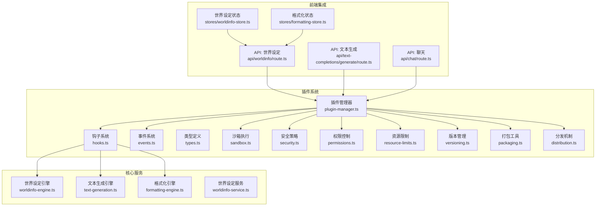
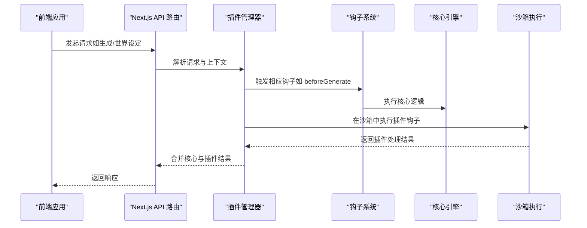
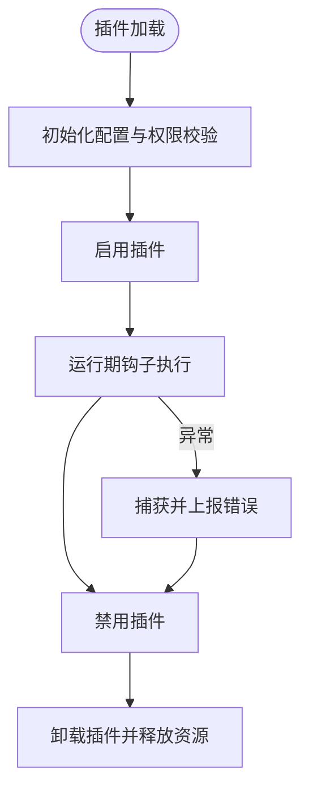
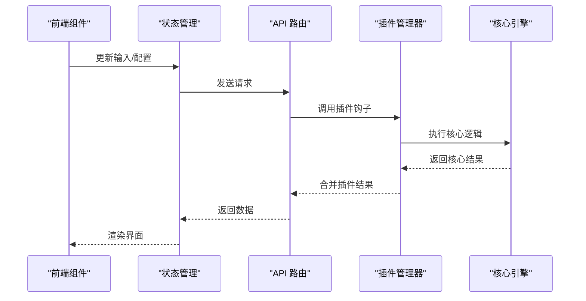
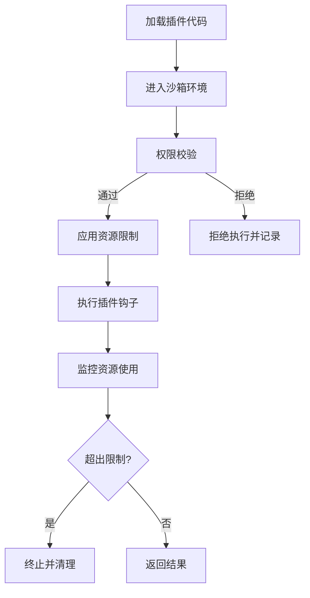
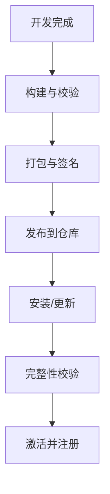
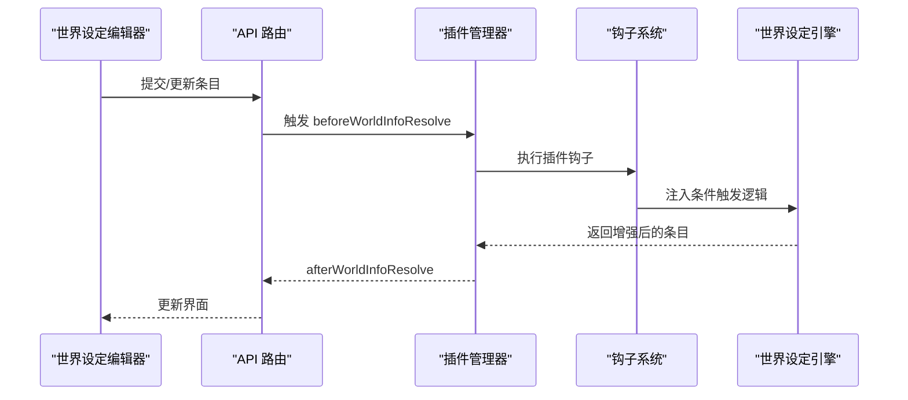
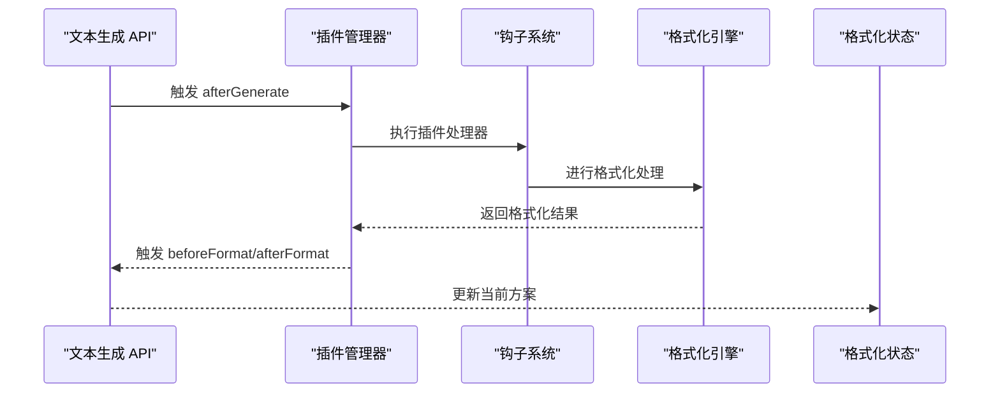
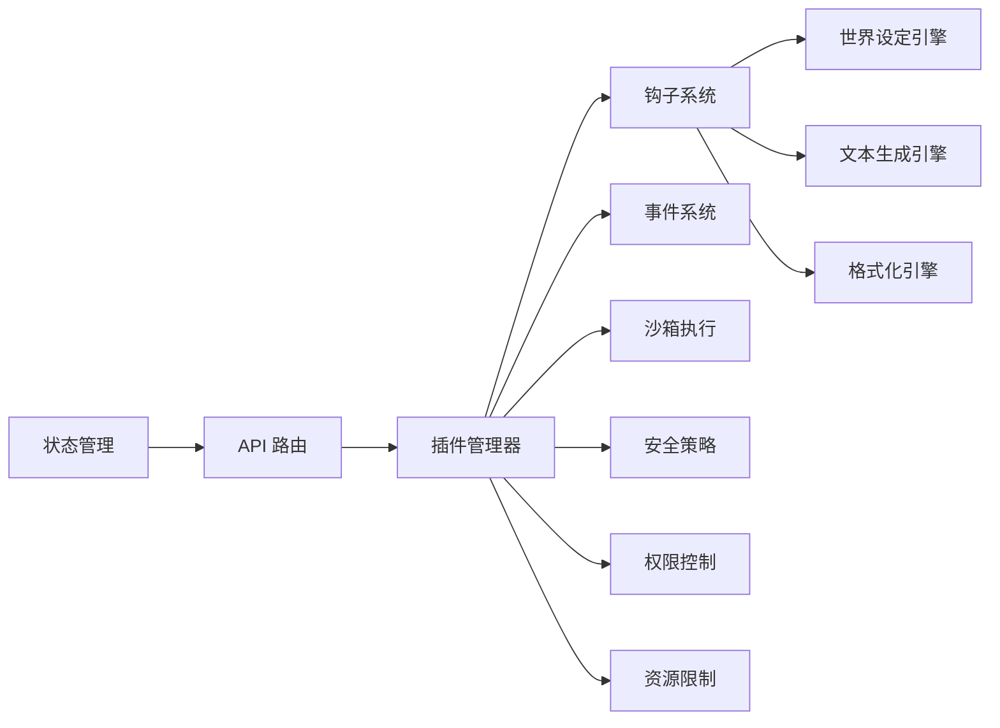

# 插件系统开发

<cite>
**本文引用的文件**
- [package.json](file://package.json)
- [README.md](file://README.md)
- [src/lib/plugins/index.ts](file://src/lib/plugins/index.ts)
- [src/lib/plugins/types.ts](file://src/lib/plugins/types.ts)
- [src/lib/plugins/hooks.ts](file://src/lib/plugins/hooks.ts)
- [src/lib/plugins/events.ts](file://src/lib/plugins/events.ts)
- [src/lib/plugins/plugin-manager.ts](file://src/lib/plugins/plugin-manager.ts)
- [src/lib/plugins/sandbox.ts](file://src/lib/plugins/sandbox.ts)
- [src/lib/plugins/security.ts](file://src/lib/plugins/security.ts)
- [src/lib/plugins/permissions.ts](file://src/lib/plugins/permissions.ts)
- [src/lib/plugins/resource-limits.ts](file://src/lib/plugins/resource-limits.ts)
- [src/lib/plugins/versioning.ts](file://src/lib/plugins/versioning.ts)
- [src/lib/plugins/packaging.ts](file://src/lib/plugins/packaging.ts)
- [src/lib/plugins/distribution.ts](file://src/lib/plugins/distribution.ts)
- [src/lib/worldinfo/worldinfo-engine.ts](file://src/lib/worldinfo/worldinfo-engine.ts)
- [src/lib/generation/text-generation.ts](file://src/lib/generation/text-generation.ts)
- [src/lib/formatting/formatting-engine.ts](file://src/lib/formatting/formatting-engine.ts)
- [src/lib/services/worldinfo-service.ts](file://src/lib/services/worldinfo-service.ts)
- [src/components/world-info/entry-editor.tsx](file://src/components/world-info/entry-editor.tsx)
- [src/stores/worldinfo-store.ts](file://src/stores/worldinfo-store.ts)
- [src/stores/formatting-store.ts](file://src/stores/formatting-store.ts)
- [src/app/api/worldinfo/route.ts](file://src/app/api/worldinfo/route.ts)
- [src/app/api/text-completions/generate/route.ts](file://src/app/api/text-completions/generate/route.ts)
- [src/app/api/chat/route.ts](file://src/app/api/chat/route.ts)
- [src/middleware.ts](file://src/middleware.ts)
</cite>

## 目录
1. [简介](#简介)
2. [项目结构](#项目结构)
3. [核心组件](#核心组件)
4. [架构总览](#架构总览)
5. [详细组件分析](#详细组件分析)
6. [依赖关系分析](#依赖关系分析)
7. [性能考量](#性能考量)
8. [故障排查指南](#故障排查指南)
9. [结论](#结论)
10. [附录](#附录)

## 简介
本指南面向希望在 SillyTavern Next 中开发插件的开发者，系统性阐述插件架构设计、扩展点识别、生命周期管理、事件系统与钩子机制、与核心系统的交互方式、API 规范与数据交换格式，并提供从自定义世界设定引擎到消息处理器/格式化器的完整开发示例。同时覆盖安全沙箱、权限控制、资源限制、打包分发与版本管理等工程实践。

## 项目结构
插件系统位于后端服务层，核心文件集中在 src/lib/plugins 目录下，围绕“类型定义、钩子与事件、插件管理器、沙箱与安全、权限与资源限制、版本与打包分发”等模块组织。前端通过 Next.js API 路由与后端插件进行交互；世界设定、文本生成与格式化等核心功能均可作为插件扩展点。

图表来源
- [src/lib/plugins/plugin-manager.ts](file://src/lib/plugins/plugin-manager.ts)
- [src/lib/plugins/hooks.ts](file://src/lib/plugins/hooks.ts)
- [src/lib/plugins/events.ts](file://src/lib/plugins/events.ts)
- [src/lib/plugins/sandbox.ts](file://src/lib/plugins/sandbox.ts)
- [src/lib/plugins/security.ts](file://src/lib/plugins/security.ts)
- [src/lib/plugins/permissions.ts](file://src/lib/plugins/permissions.ts)
- [src/lib/plugins/resource-limits.ts](file://src/lib/plugins/resource-limits.ts)
- [src/lib/plugins/versioning.ts](file://src/lib/plugins/versioning.ts)
- [src/lib/plugins/packaging.ts](file://src/lib/plugins/packaging.ts)
- [src/lib/plugins/distribution.ts](file://src/lib/plugins/distribution.ts)
- [src/lib/worldinfo/worldinfo-engine.ts](file://src/lib/worldinfo/worldinfo-engine.ts)
- [src/lib/generation/text-generation.ts](file://src/lib/generation/text-generation.ts)
- [src/lib/formatting/formatting-engine.ts](file://src/lib/formatting/formatting-engine.ts)
- [src/lib/services/worldinfo-service.ts](file://src/lib/services/worldinfo-service.ts)
- [src/app/api/worldinfo/route.ts](file://src/app/api/worldinfo/route.ts)
- [src/app/api/text-completions/generate/route.ts](file://src/app/api/text-completions/generate/route.ts)
- [src/app/api/chat/route.ts](file://src/app/api/chat/route.ts)
- [src/stores/worldinfo-store.ts](file://src/stores/worldinfo-store.ts)
- [src/stores/formatting-store.ts](file://src/stores/formatting-store.ts)

章节来源
- [package.json](file://package.json)
- [README.md](file://README.md)

## 核心组件
- 类型与接口：定义插件元数据、钩子签名、事件载荷、权限与资源限制参数等，确保插件与核心系统契约一致。
- 钩子与事件：提供在世界设定、文本生成、格式化等关键路径上的扩展点，支持同步/异步钩子与事件广播。
- 插件管理器：负责插件加载、初始化、生命周期管理、错误隔离与资源回收。
- 沙箱与安全：在受限环境中执行第三方插件代码，限制系统调用与内存/CPU使用。
- 权限与资源限制：基于用户角色与插件能力授予最小权限集，设置超时、并发与内存上限。
- 版本与打包：统一版本号、兼容性检查与打包流程，便于分发与升级。
- 前后端集成：通过 Next.js API 路由暴露插件能力，前端通过状态管理与服务层对接。

章节来源
- [src/lib/plugins/types.ts](file://src/lib/plugins/types.ts)
- [src/lib/plugins/hooks.ts](file://src/lib/plugins/hooks.ts)
- [src/lib/plugins/events.ts](file://src/lib/plugins/events.ts)
- [src/lib/plugins/plugin-manager.ts](file://src/lib/plugins/plugin-manager.ts)
- [src/lib/plugins/sandbox.ts](file://src/lib/plugins/sandbox.ts)
- [src/lib/plugins/security.ts](file://src/lib/plugins/security.ts)
- [src/lib/plugins/permissions.ts](file://src/lib/plugins/permissions.ts)
- [src/lib/plugins/resource-limits.ts](file://src/lib/plugins/resource-limits.ts)
- [src/lib/plugins/versioning.ts](file://src/lib/plugins/versioning.ts)
- [src/lib/plugins/packaging.ts](file://src/lib/plugins/packaging.ts)
- [src/lib/plugins/distribution.ts](file://src/lib/plugins/distribution.ts)

## 架构总览
插件系统采用“声明式钩子 + 事件驱动”的架构。前端通过 API 路由触发后端处理，后端插件管理器根据配置与权限选择合适插件，经沙箱执行后返回结果。世界设定、文本生成与格式化三大核心引擎提供主要扩展点。

图表来源
- [src/app/api/text-completions/generate/route.ts](file://src/app/api/text-completions/generate/route.ts)
- [src/app/api/worldinfo/route.ts](file://src/app/api/worldinfo/route.ts)
- [src/lib/plugins/plugin-manager.ts](file://src/lib/plugins/plugin-manager.ts)
- [src/lib/plugins/hooks.ts](file://src/lib/plugins/hooks.ts)
- [src/lib/generation/text-generation.ts](file://src/lib/generation/text-generation.ts)
- [src/lib/worldinfo/worldinfo-engine.ts](file://src/lib/worldinfo/worldinfo-engine.ts)
- [src/lib/formatting/formatting-engine.ts](file://src/lib/formatting/formatting-engine.ts)
- [src/lib/plugins/sandbox.ts](file://src/lib/plugins/sandbox.ts)

## 详细组件分析

### 插件生命周期与钩子机制
- 生命周期阶段：加载（load）、初始化（init）、启用（enable）、运行（run）、禁用（disable）、卸载（unload）。
- 钩子类型：
  - 世界设定：beforeWorldInfoResolve、afterWorldInfoResolve、onWorldInfoChange
  - 文本生成：beforeGenerate、afterGenerate、onTokenStream
  - 格式化：beforeFormat、afterFormat、onFormatError
- 事件系统：支持发布/订阅模式，插件可订阅核心事件并在钩子中触发自定义事件。

图表来源
- [src/lib/plugins/plugin-manager.ts](file://src/lib/plugins/plugin-manager.ts)
- [src/lib/plugins/hooks.ts](file://src/lib/plugins/hooks.ts)
- [src/lib/plugins/events.ts](file://src/lib/plugins/events.ts)

章节来源
- [src/lib/plugins/plugin-manager.ts](file://src/lib/plugins/plugin-manager.ts)
- [src/lib/plugins/hooks.ts](file://src/lib/plugins/hooks.ts)
- [src/lib/plugins/events.ts](file://src/lib/plugins/events.ts)

### 插件与核心系统的交互
- API 接口规范：
  - 世界设定：GET/POST/PUT/DELETE /api/worldinfo/*，支持分页、过滤与扩展字段。
  - 文本生成：POST /api/text-completions/generate，支持流式输出与中断。
  - 聊天：POST /api/chat，支持多轮对话与上下文注入。
- 数据交换格式：JSON，遵循 OpenAI 兼容风格（messages、choices、usage 等），并扩展插件特定字段（如 pluginMeta、extensions）。
- 前端集成：通过 Next.js App Router 的 API 路由与状态管理（Zustand）对接，确保响应式更新与缓存一致性。

图表来源
- [src/app/api/worldinfo/route.ts](file://src/app/api/worldinfo/route.ts)
- [src/app/api/text-completions/generate/route.ts](file://src/app/api/text-completions/generate/route.ts)
- [src/app/api/chat/route.ts](file://src/app/api/chat/route.ts)
- [src/stores/worldinfo-store.ts](file://src/stores/worldinfo-store.ts)
- [src/stores/formatting-store.ts](file://src/stores/formatting-store.ts)
- [src/lib/plugins/plugin-manager.ts](file://src/lib/plugins/plugin-manager.ts)
- [src/lib/worldinfo/worldinfo-engine.ts](file://src/lib/worldinfo/worldinfo-engine.ts)
- [src/lib/generation/text-generation.ts](file://src/lib/generation/text-generation.ts)
- [src/lib/formatting/formatting-engine.ts](file://src/lib/formatting/formatting-engine.ts)

章节来源
- [src/app/api/worldinfo/route.ts](file://src/app/api/worldinfo/route.ts)
- [src/app/api/text-completions/generate/route.ts](file://src/app/api/text-completions/generate/route.ts)
- [src/app/api/chat/route.ts](file://src/app/api/chat/route.ts)
- [src/stores/worldinfo-store.ts](file://src/stores/worldinfo-store.ts)
- [src/stores/formatting-store.ts](file://src/stores/formatting-store.ts)

### 安全沙箱、权限控制与资源限制
- 沙箱执行：限制全局对象访问、禁用文件系统与网络调用，仅开放必要 API（如 crypto、Buffer 等）。
- 权限控制：基于角色与插件能力矩阵授予最小权限，支持白名单/黑名单策略。
- 资源限制：CPU 时间片、内存峰值、并发数与 I/O 速率限制，超限时自动终止并记录审计日志。

图表来源
- [src/lib/plugins/sandbox.ts](file://src/lib/plugins/sandbox.ts)
- [src/lib/plugins/security.ts](file://src/lib/plugins/security.ts)
- [src/lib/plugins/permissions.ts](file://src/lib/plugins/permissions.ts)
- [src/lib/plugins/resource-limits.ts](file://src/lib/plugins/resource-limits.ts)

章节来源
- [src/lib/plugins/sandbox.ts](file://src/lib/plugins/sandbox.ts)
- [src/lib/plugins/security.ts](file://src/lib/plugins/security.ts)
- [src/lib/plugins/permissions.ts](file://src/lib/plugins/permissions.ts)
- [src/lib/plugins/resource-limits.ts](file://src/lib/plugins/resource-limits.ts)

### 版本管理、打包与分发
- 版本策略：语义化版本（主.次.补丁），支持向后兼容检查与降级回滚。
- 打包流程：标准化入口、导出类型与清单文件，压缩并生成校验摘要。
- 分发机制：内置仓库索引、远程镜像与本地缓存，支持增量更新与完整性校验。

图表来源
- [src/lib/plugins/versioning.ts](file://src/lib/plugins/versioning.ts)
- [src/lib/plugins/packaging.ts](file://src/lib/plugins/packaging.ts)
- [src/lib/plugins/distribution.ts](file://src/lib/plugins/distribution.ts)

章节来源
- [src/lib/plugins/versioning.ts](file://src/lib/plugins/versioning.ts)
- [src/lib/plugins/packaging.ts](file://src/lib/plugins/packaging.ts)
- [src/lib/plugins/distribution.ts](file://src/lib/plugins/distribution.ts)

### 开发示例：自定义世界设定引擎
目标：实现一个“条件触发型”世界设定条目，在满足特定条件时插入或替换上下文信息。
- 扩展点：beforeWorldInfoResolve、afterWorldInfoResolve
- 关键步骤：
  1) 在插件中注册钩子，监听世界设定解析前事件。
  2) 读取当前聊天上下文与角色信息，计算触发条件。
  3) 若满足条件，动态注入或修改条目内容，并标记扩展字段（如 automationId）。
  4) 将处理后的条目交由核心引擎继续解析。
- 前端支持：世界设定编辑器提供自动化 ID 字段，便于脚本/扩展调用与调试。

图表来源
- [src/lib/plugins/hooks.ts](file://src/lib/plugins/hooks.ts)
- [src/lib/worldinfo/worldinfo-engine.ts](file://src/lib/worldinfo/worldinfo-engine.ts)
- [src/lib/services/worldinfo-service.ts](file://src/lib/services/worldinfo-service.ts)
- [src/components/world-info/entry-editor.tsx](file://src/components/world-info/entry-editor.tsx)
- [src/app/api/worldinfo/route.ts](file://src/app/api/worldinfo/route.ts)

章节来源
- [src/lib/plugins/hooks.ts](file://src/lib/plugins/hooks.ts)
- [src/lib/worldinfo/worldinfo-engine.ts](file://src/lib/worldinfo/worldinfo-engine.ts)
- [src/lib/services/worldinfo-service.ts](file://src/lib/services/worldinfo-service.ts)
- [src/components/world-info/entry-editor.tsx](file://src/components/world-info/entry-editor.tsx)
- [src/app/api/worldinfo/route.ts](file://src/app/api/worldinfo/route.ts)

### 开发示例：消息处理器与格式化器
目标：在消息生成后对输出进行二次格式化（如高亮、转码、注入元信息）。
- 扩展点：afterGenerate、beforeFormat、afterFormat
- 关键步骤：
  1) 订阅生成完成事件，提取生成文本与元数据。
  2) 应用格式化规则（正则、模板、外部工具链）。
  3) 将格式化结果写回响应，确保不影响核心生成性能。
- 状态管理：通过格式化状态存储（formatting-store）持久化用户偏好与当前方案。

图表来源
- [src/app/api/text-completions/generate/route.ts](file://src/app/api/text-completions/generate/route.ts)
- [src/lib/plugins/hooks.ts](file://src/lib/plugins/hooks.ts)
- [src/lib/formatting/formatting-engine.ts](file://src/lib/formatting/formatting-engine.ts)
- [src/stores/formatting-store.ts](file://src/stores/formatting-store.ts)

章节来源
- [src/app/api/text-completions/generate/route.ts](file://src/app/api/text-completions/generate/route.ts)
- [src/lib/plugins/hooks.ts](file://src/lib/plugins/hooks.ts)
- [src/lib/formatting/formatting-engine.ts](file://src/lib/formatting/formatting-engine.ts)
- [src/stores/formatting-store.ts](file://src/stores/formatting-store.ts)

## 依赖关系分析
- 内部依赖：插件管理器聚合钩子、事件、沙箱、安全、权限与资源限制模块；核心引擎（世界设定、文本生成、格式化）作为钩子目标。
- 外部依赖：Next.js API 路由、Zustand 状态管理、数据库与文件系统（受沙箱限制）。
- 循环依赖：通过模块化拆分与接口抽象避免循环导入；钩子回调以函数指针形式传递，降低耦合。

图表来源
- [src/lib/plugins/plugin-manager.ts](file://src/lib/plugins/plugin-manager.ts)
- [src/lib/plugins/hooks.ts](file://src/lib/plugins/hooks.ts)
- [src/lib/plugins/events.ts](file://src/lib/plugins/events.ts)
- [src/lib/plugins/sandbox.ts](file://src/lib/plugins/sandbox.ts)
- [src/lib/plugins/security.ts](file://src/lib/plugins/security.ts)
- [src/lib/plugins/permissions.ts](file://src/lib/plugins/permissions.ts)
- [src/lib/plugins/resource-limits.ts](file://src/lib/plugins/resource-limits.ts)
- [src/app/api/worldinfo/route.ts](file://src/app/api/worldinfo/route.ts)
- [src/app/api/text-completions/generate/route.ts](file://src/app/api/text-completions/generate/route.ts)
- [src/stores/worldinfo-store.ts](file://src/stores/worldinfo-store.ts)
- [src/stores/formatting-store.ts](file://src/stores/formatting-store.ts)

章节来源
- [src/lib/plugins/plugin-manager.ts](file://src/lib/plugins/plugin-manager.ts)
- [src/lib/plugins/hooks.ts](file://src/lib/plugins/hooks.ts)
- [src/lib/plugins/events.ts](file://src/lib/plugins/events.ts)
- [src/lib/plugins/sandbox.ts](file://src/lib/plugins/sandbox.ts)
- [src/lib/plugins/security.ts](file://src/lib/plugins/security.ts)
- [src/lib/plugins/permissions.ts](file://src/lib/plugins/permissions.ts)
- [src/lib/plugins/resource-limits.ts](file://src/lib/plugins/resource-limits.ts)
- [src/app/api/worldinfo/route.ts](file://src/app/api/worldinfo/route.ts)
- [src/app/api/text-completions/generate/route.ts](file://src/app/api/text-completions/generate/route.ts)
- [src/stores/worldinfo-store.ts](file://src/stores/worldinfo-store.ts)
- [src/stores/formatting-store.ts](file://src/stores/formatting-store.ts)

## 性能考量
- 钩子执行：尽量保持无阻塞，长耗时任务放入后台队列或异步处理。
- 沙箱开销：减少频繁进出沙箱次数，合并多次调用；合理设置超时与内存上限。
- 并发控制：限制同一插件并发度，避免争用共享资源。
- 缓存策略：对重复计算结果进行缓存，结合失效策略与版本号。
- I/O 优化：批量读写、延迟提交、压缩传输，减少网络与磁盘压力。

## 故障排查指南
- 常见问题：
  - 插件未加载：检查清单文件、入口导出与权限配置。
  - 钩子未触发：确认事件名称、时机与订阅者注册。
  - 超时/内存溢出：调整资源限制、拆分任务或引入分片处理。
  - 权限不足：核对角色与能力矩阵，必要时申请更高权限。
- 调试建议：
  - 启用详细日志与审计追踪，定位具体钩子与插件。
  - 使用中间件拦截请求，打印上下文与参数。
  - 在沙箱外模拟执行关键逻辑，排除第三方库影响。
- 性能分析：
  - 统计各钩子耗时分布，识别瓶颈。
  - 监控内存与 CPU 使用曲线，及时发现泄漏或过载。

章节来源
- [src/middleware.ts](file://src/middleware.ts)
- [src/lib/plugins/plugin-manager.ts](file://src/lib/plugins/plugin-manager.ts)
- [src/lib/plugins/sandbox.ts](file://src/lib/plugins/sandbox.ts)
- [src/lib/plugins/resource-limits.ts](file://src/lib/plugins/resource-limits.ts)

## 结论
SillyTavern Next 的插件系统通过清晰的类型定义、完善的钩子与事件机制、严格的沙箱与权限控制，以及标准化的版本与分发流程，为扩展世界设定、文本生成与格式化等核心能力提供了稳定而强大的平台。开发者应遵循最小权限原则、资源限制与性能优化策略，结合本文提供的示例与最佳实践，快速构建高质量插件。

## 附录
- API 参考（概要）
  - 世界设定：支持 CRUD 与扩展字段（如 automationId），用于脚本/扩展调用。
  - 文本生成：支持流式输出、中断与上下文注入。
  - 聊天：支持多轮对话与角色切换。
- 最佳实践
  - 明确插件职责边界，避免过度耦合。
  - 使用事件解耦，优先采用钩子而非硬编码。
  - 严格遵守资源限制，提供优雅降级与错误恢复。
  - 完善单元测试与集成测试，覆盖边界场景。
- 版本与分发
  - 采用语义化版本，提供变更日志与迁移指南。
  - 支持增量更新与回滚，保障稳定性。