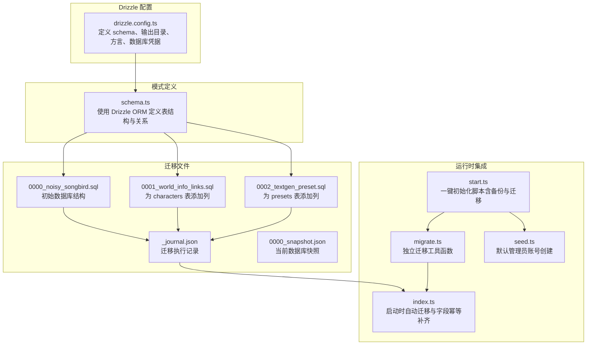
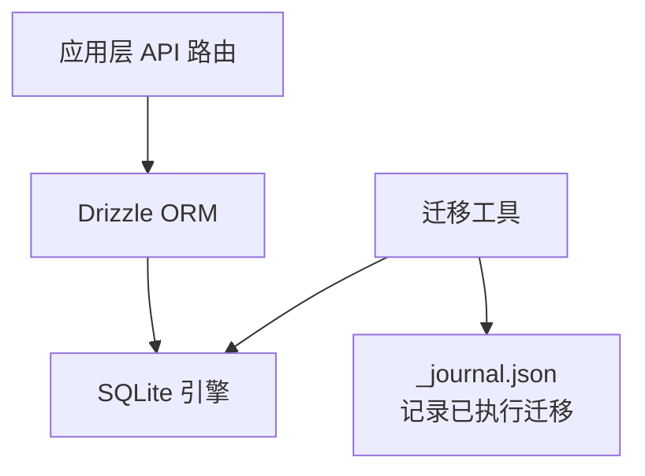
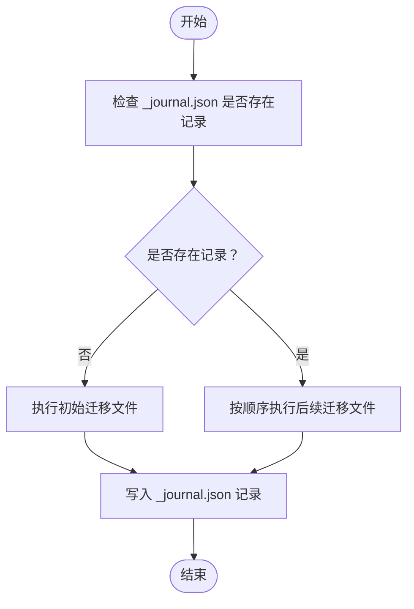
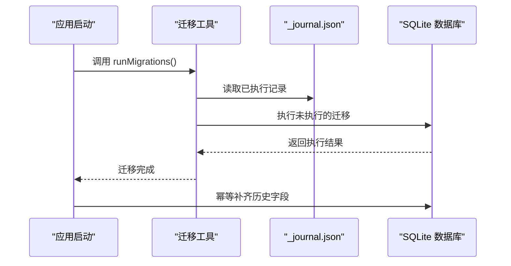
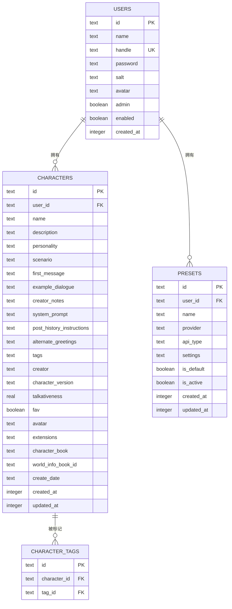
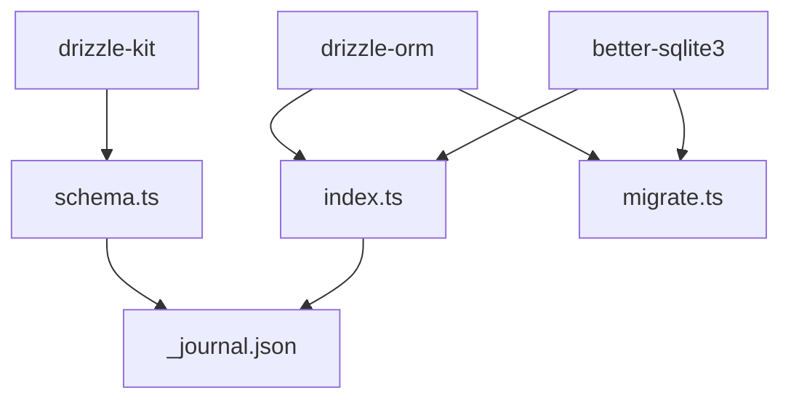

# 数据库模式扩展

<cite>
**本文档引用的文件**
- [drizzle.config.ts](file://drizzle.config.ts)
- [schema.ts](file://src/lib/db/schema.ts)
- [index.ts](file://src/lib/db/index.ts)
- [migrate.ts](file://src/lib/db/migrate.ts)
- [0000_noisy_songbird.sql](file://drizzle/0000_noisy_songbird.sql)
- [0001_world_info_links.sql](file://drizzle/0001_world_info_links.sql)
- [0002_textgen_preset.sql](file://drizzle/0002_textgen_preset.sql)
- [0000_snapshot.json](file://drizzle/meta/0000_snapshot.json)
- [_journal.json](file://drizzle/meta/_journal.json)
- [start.ts](file://scripts/start.ts)
- [seed.ts](file://scripts/seed.ts)
- [route.ts](file://src/app/api/settings/route.ts)
- [route.ts](file://src/app/api/users/route.ts)
</cite>

## 目录
1. [简介](#简介)
2. [项目结构](#项目结构)
3. [核心组件](#核心组件)
4. [架构概览](#架构概览)
5. [详细组件分析](#详细组件分析)
6. [依赖分析](#依赖分析)
7. [性能考虑](#性能考虑)
8. [故障排除指南](#故障排除指南)
9. [结论](#结论)
10. [附录](#附录)

## 简介
本指南面向需要在现有数据库架构基础上进行扩展的开发者，系统性地阐述如何使用 Drizzle ORM 添加新的表结构与字段、编写 SQL 迁移文件、建立数据模型间的关系与约束、以及确保数据完整性与性能优化。文档结合项目实际的数据库迁移机制与 Drizzle 配置，提供从设计到部署的完整流程，并包含回滚策略与测试建议。

## 项目结构
该项目采用 Drizzle Kit + Drizzle ORM + better-sqlite3 的组合，数据库迁移文件位于 drizzle 目录，模式定义位于 src/lib/db/schema.ts，运行时迁移与回退逻辑在 src/lib/db/index.ts 中实现。



**图表来源**
- [drizzle.config.ts:1-11](file://drizzle.config.ts#L1-L11)
- [schema.ts:1-240](file://src/lib/db/schema.ts#L1-L240)
- [index.ts:1-134](file://src/lib/db/index.ts#L1-L134)
- [migrate.ts:1-33](file://src/lib/db/migrate.ts#L1-L33)
- [0000_noisy_songbird.sql:1-161](file://drizzle/0000_noisy_songbird.sql#L1-L161)
- [0001_world_info_links.sql:1-3](file://drizzle/0001_world_info_links.sql#L1-L3)
- [0002_textgen_preset.sql:1-5](file://drizzle/0002_textgen_preset.sql#L1-L5)
- [_journal.json:1-27](file://drizzle/meta/_journal.json#L1-L27)
- [0000_snapshot.json:1-800](file://drizzle/meta/0000_snapshot.json#L1-L800)
- [start.ts:1-96](file://scripts/start.ts#L1-L96)
- [seed.ts:1-28](file://scripts/seed.ts#L1-L28)

**章节来源**
- [drizzle.config.ts:1-11](file://drizzle.config.ts#L1-L11)
- [schema.ts:1-240](file://src/lib/db/schema.ts#L1-L240)
- [index.ts:1-134](file://src/lib/db/index.ts#L1-L134)
- [migrate.ts:1-33](file://src/lib/db/migrate.ts#L1-L33)
- [0000_noisy_songbird.sql:1-161](file://drizzle/0000_noisy_songbird.sql#L1-L161)
- [0001_world_info_links.sql:1-3](file://drizzle/0001_world_info_links.sql#L1-L3)
- [0002_textgen_preset.sql:1-5](file://drizzle/0002_textgen_preset.sql#L1-L5)
- [_journal.json:1-27](file://drizzle/meta/_journal.json#L1-L27)
- [0000_snapshot.json:1-800](file://drizzle/meta/0000_snapshot.json#L1-L800)
- [start.ts:1-96](file://scripts/start.ts#L1-L96)
- [seed.ts:1-28](file://scripts/seed.ts#L1-L28)

## 核心组件
- Drizzle 配置：定义 schema 文件路径、迁移输出目录、SQLite 方言与数据库 URL。
- 模式定义：通过 Drizzle ORM 的 sqliteTable API 声明表结构、主键、外键、索引与枚举。
- 运行时迁移：应用启动时自动执行迁移，同时对历史缺失字段进行幂等补齐。
- 迁移工具：提供独立的迁移函数与关闭数据库连接的方法。
- 初始化脚本：一键备份、迁移、创建默认管理员账号。
- API 使用示例：settings 与 users API 展示了如何在业务层使用 Drizzle ORM 查询与更新数据。

**章节来源**
- [drizzle.config.ts:1-11](file://drizzle.config.ts#L1-L11)
- [schema.ts:1-240](file://src/lib/db/schema.ts#L1-L240)
- [index.ts:1-134](file://src/lib/db/index.ts#L1-L134)
- [migrate.ts:1-33](file://src/lib/db/migrate.ts#L1-L33)
- [start.ts:1-96](file://scripts/start.ts#L1-L96)
- [route.ts:1-109](file://src/app/api/settings/route.ts#L1-L109)
- [route.ts:1-37](file://src/app/api/users/route.ts#L1-L37)

## 架构概览
数据库层由 Drizzle ORM 抽象与 SQLite 实现组成，迁移文件与模式定义保持同步，运行时通过 WAL 模式与外键约束保障一致性。



**图表来源**
- [index.ts:1-134](file://src/lib/db/index.ts#L1-L134)
- [migrate.ts:1-33](file://src/lib/db/migrate.ts#L1-L33)
- [_journal.json:1-27](file://drizzle/meta/_journal.json#L1-L27)

## 详细组件分析

### Drizzle 配置与模式定义
- 配置文件指定了 schema 路径、输出目录、SQLite 方言与数据库 URL，确保迁移工具与运行时连接一致。
- 模式文件使用 sqliteTable 定义表结构，包含主键、外键、默认值、枚举类型与 JSON 字段，体现业务需求与数据完整性要求。

```mermaid
classDiagram
class Users {
+id : text
+name : text
+handle : text
+password : text
+salt : text
+avatar : text
+admin : boolean
+enabled : boolean
+createdAt : timestamp
}
class Characters {
+id : text
+userId : text
+name : text
+description : text
+personality : text
+scenario : text
+firstMessage : text
+exampleDialogue : text
+creatorNotes : text
+systemPrompt : text
+postHistoryInstructions : text
+alternateGreetings : text
+tags : text
+creator : text
+characterVersion : text
+talkativeness : real
+fav : boolean
+avatar : text
+extensions : text
+characterBook : text
+worldInfoBookId : text
+createDate : text
+createdAt : timestamp
+updatedAt : timestamp
}
class Presets {
+id : text
+userId : text
+name : text
+provider : text
+apiType : text
+settings : text
+isDefault : boolean
+isActive : boolean
+createdAt : timestamp
+updatedAt : timestamp
}
Users <.. Characters : "外键 : user_id -> users.id"
Users <.. Presets : "外键 : user_id -> users.id"
```

**图表来源**
- [drizzle.config.ts:1-11](file://drizzle.config.ts#L1-L11)
- [schema.ts:1-240](file://src/lib/db/schema.ts#L1-L240)

**章节来源**
- [drizzle.config.ts:1-11](file://drizzle.config.ts#L1-L11)
- [schema.ts:1-240](file://src/lib/db/schema.ts#L1-L240)

### 迁移文件与版本控制
- 初始迁移文件定义了完整的数据库结构，包括表、列、外键与唯一索引。
- 后续迁移文件通过 ALTER TABLE 语句为现有表添加新列，遵循幂等原则。
- 迁移执行记录存储在 _journal.json 中，确保重复执行不会产生副作用。



**图表来源**
- [0000_noisy_songbird.sql:1-161](file://drizzle/0000_noisy_songbird.sql#L1-L161)
- [0001_world_info_links.sql:1-3](file://drizzle/0001_world_info_links.sql#L1-L3)
- [0002_textgen_preset.sql:1-5](file://drizzle/0002_textgen_preset.sql#L1-L5)
- [_journal.json:1-27](file://drizzle/meta/_journal.json#L1-L27)

**章节来源**
- [0000_noisy_songbird.sql:1-161](file://drizzle/0000_noisy_songbird.sql#L1-L161)
- [0001_world_info_links.sql:1-3](file://drizzle/0001_world_info_links.sql#L1-L3)
- [0002_textgen_preset.sql:1-5](file://drizzle/0002_textgen_preset.sql#L1-L5)
- [_journal.json:1-27](file://drizzle/meta/_journal.json#L1-L27)

### 运行时迁移与回退策略
- 应用启动时自动调用迁移，确保数据库结构与模式定义一致。
- 对历史缺失字段进行幂等补齐，避免因迁移文件滞后导致的 500 错误。
- 提供独立迁移函数与数据库连接关闭方法，便于在其他场景中使用。
- 初始化脚本在迁移前自动备份数据库，失败时提供回滚指令。



**图表来源**
- [index.ts:1-134](file://src/lib/db/index.ts#L1-L134)
- [migrate.ts:1-33](file://src/lib/db/migrate.ts#L1-L33)
- [_journal.json:1-27](file://drizzle/meta/_journal.json#L1-L27)

**章节来源**
- [index.ts:1-134](file://src/lib/db/index.ts#L1-L134)
- [migrate.ts:1-33](file://src/lib/db/migrate.ts#L1-L33)
- [start.ts:1-96](file://scripts/start.ts#L1-L96)

### 数据模型关系设计与外键约束
- users 与 characters：一对多关系，characters.user_id 引用 users.id。
- characters 与 character_tags：多对多关系，通过中间表维护。
- chats 与 characters/groups：一对多关系，支持一对一映射。
- messages 与 chats：一对多关系，删除会话时级联删除消息。
- presets 与 users：一对多关系，支持默认与激活状态字段。



**图表来源**
- [schema.ts:1-240](file://src/lib/db/schema.ts#L1-L240)
- [0000_snapshot.json:1-800](file://drizzle/meta/0000_snapshot.json#L1-L800)

**章节来源**
- [schema.ts:1-240](file://src/lib/db/schema.ts#L1-L240)
- [0000_snapshot.json:1-800](file://drizzle/meta/0000_snapshot.json#L1-L800)

### 索引优化与查询建议
- 唯一索引：users.handle（唯一性约束）、settings.user_id（唯一性约束）。
- 外键索引：Drizzle ORM 自动生成外键索引，确保关联查询性能。
- 建议：对高频过滤字段（如 users.id、characters.user_id、messages.chat_id）保持现有外键索引；对复杂查询可考虑复合索引（例如 messages(chat_id, created_at)）。

**章节来源**
- [0000_noisy_songbird.sql:1-161](file://drizzle/0000_noisy_songbird.sql#L1-L161)
- [0000_snapshot.json:1-800](file://drizzle/meta/0000_snapshot.json#L1-L800)

### 数据迁移最佳实践
- 幂等性：所有迁移必须可重复执行且不产生副作用。
- 版本控制：每次变更提交独立迁移文件，清晰命名并记录变更内容。
- 回滚策略：初始化脚本在迁移前自动备份数据库，失败时提供回滚命令。
- 数据完整性：通过外键约束与默认值确保数据一致性；对 JSON 字段进行校验与清理。

**章节来源**
- [start.ts:1-96](file://scripts/start.ts#L1-L96)
- [index.ts:1-134](file://src/lib/db/index.ts#L1-L134)

### 测试方法与安全考虑
- 测试方法：在测试环境中创建临时数据库副本，执行迁移后验证表结构与数据；使用 API 路由测试 CRUD 操作。
- 安全考虑：对敏感字段（如 users.password、users.salt）进行加密存储；限制管理员权限访问；对输入参数进行严格校验。

**章节来源**
- [route.ts:1-109](file://src/app/api/settings/route.ts#L1-L109)
- [route.ts:1-37](file://src/app/api/users/route.ts#L1-L37)

## 依赖分析
- 外部依赖：drizzle-kit（迁移工具）、drizzle-orm（ORM 抽象）、better-sqlite3（SQLite 实现）。
- 内部依赖：schema.ts 作为模式定义中心，index.ts 与 migrate.ts 提供运行时迁移能力，_journal.json 记录迁移状态。



**图表来源**
- [drizzle.config.ts:1-11](file://drizzle.config.ts#L1-L11)
- [schema.ts:1-240](file://src/lib/db/schema.ts#L1-L240)
- [index.ts:1-134](file://src/lib/db/index.ts#L1-L134)
- [migrate.ts:1-33](file://src/lib/db/migrate.ts#L1-L33)
- [_journal.json:1-27](file://drizzle/meta/_journal.json#L1-L27)

**章节来源**
- [drizzle.config.ts:1-11](file://drizzle.config.ts#L1-L11)
- [schema.ts:1-240](file://src/lib/db/schema.ts#L1-L240)
- [index.ts:1-134](file://src/lib/db/index.ts#L1-L134)
- [migrate.ts:1-33](file://src/lib/db/migrate.ts#L1-L33)
- [_journal.json:1-27](file://drizzle/meta/_journal.json#L1-L27)

## 性能考虑
- WAL 模式：启用 WAL 以提升并发读写性能。
- 外键约束：合理使用外键确保一致性，但注意对频繁写入场景的性能影响。
- 索引策略：为高频查询字段建立索引，避免全表扫描。
- JSON 字段：对大体量 JSON 字段进行分表或压缩存储，减少锁竞争。

[本节为通用指导，无需列出具体文件来源]

## 故障排除指南
- 迁移失败：检查 _journal.json 与迁移文件是否匹配；查看日志中的错误信息；必要时回滚至备份。
- 字段缺失：确认 index.ts 中的幂等补齐逻辑是否覆盖目标字段；手动执行 ALTER 语句后重新迁移。
- 权限问题：确保数据库文件具有正确的读写权限；检查 DATABASE_URL 环境变量。

**章节来源**
- [index.ts:1-134](file://src/lib/db/index.ts#L1-L134)
- [start.ts:1-96](file://scripts/start.ts#L1-L96)

## 结论
通过 Drizzle ORM 与 SQLite 的组合，项目实现了可维护、可扩展的数据库架构。遵循幂等性、版本控制与回滚策略，能够在不影响生产环境的前提下安全地进行模式扩展。建议在每次变更前制定迁移计划，充分测试后再上线。

[本节为总结性内容，无需列出具体文件来源]

## 附录

### 扩展示例：添加新的配置表
- 步骤 1：在 schema.ts 中定义新表结构，包含主键、外键、默认值与索引。
- 步骤 2：生成迁移文件，使用 ALTER TABLE 或 CREATE TABLE 语句。
- 步骤 3：在 index.ts 中补充幂等补齐逻辑，确保历史数据库兼容。
- 步骤 4：编写 API 路由进行数据读写，确保输入校验与错误处理。
- 步骤 5：执行迁移并进行端到端测试，验证数据完整性与性能。

**章节来源**
- [schema.ts:1-240](file://src/lib/db/schema.ts#L1-L240)
- [index.ts:1-134](file://src/lib/db/index.ts#L1-L134)
- [route.ts:1-109](file://src/app/api/settings/route.ts#L1-L109)