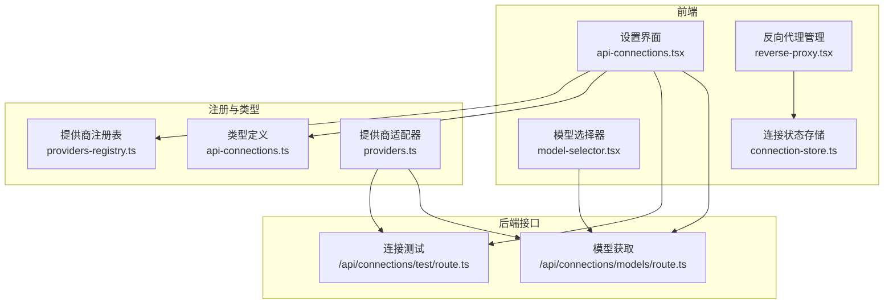
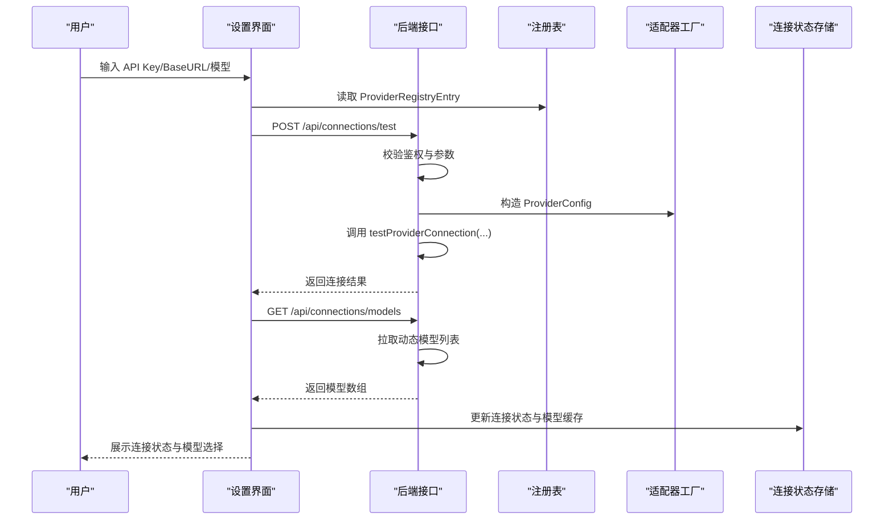

# 新 AI Provider 开发

<cite>
**本文引用的文件**
- [providers-registry.ts](file://src/lib/constants/providers-registry.ts)
- [api-connections.ts](file://src/types/api-connections.ts)
- [providers.ts](file://src/lib/ai/providers.ts)
- [api-connections.tsx](file://src/components/settings/api-connections.tsx)
- [model-selector.tsx](file://src/components/settings/model-selector.tsx)
- [reverse-proxy.tsx](file://src/components/settings/reverse-proxy.tsx)
- [connection-store.ts](file://src/lib/stores/connection-store.ts)
- [test/route.ts](file://src/app/api/connections/test/route.ts)
- [models/route.ts](file://src/app/api/connections/models/route.ts)
- [page.tsx](file://src/app/page.tsx)
</cite>

## 目录
1. [简介](#简介)
2. [项目结构](#项目结构)
3. [核心组件](#核心组件)
4. [架构总览](#架构总览)
5. [详细组件分析](#详细组件分析)
6. [依赖关系分析](#依赖关系分析)
7. [性能考量](#性能考量)
8. [故障排查指南](#故障排查指南)
9. [结论](#结论)
10. [附录](#附录)

## 简介
本指南面向希望为系统新增 AI 服务提供商的开发者，围绕 providers-registry.ts 的 ProviderRegistryEntry 注册表，系统讲解：
- ProviderRegistryEntry 字段定义与必填/可选参数
- 提供商分类（chat_completion、text_completion、novelai 等）差异与用途
- API 密钥管理、BaseURL 配置、模型列表定义与额外字段配置
- 动态模型加载机制与静态模型列表的区别
- 完整示例：如何添加 OpenAI、Claude、Google AI Studio 等提供商
- 最佳实践、错误处理与调试技巧

## 项目结构
与 AI Provider 注册与运行相关的核心文件分布如下：
- 注册表与分类定义：src/lib/constants/providers-registry.ts、src/types/api-connections.ts
- 提供商适配与模型工厂：src/lib/ai/providers.ts
- 设置界面与交互：src/components/settings/api-connections.tsx、src/components/settings/model-selector.tsx、src/components/settings/reverse-proxy.tsx
- 运行时状态与持久化：src/lib/stores/connection-store.ts
- 后端接口：src/app/api/connections/test/route.ts、src/app/api/connections/models/route.ts
- 页面入口与模型刷新流程：src/app/page.tsx



图表来源
- [providers-registry.ts:722-748](file://src/lib/constants/providers-registry.ts#L722-L748)
- [api-connections.ts:9-22](file://src/types/api-connections.ts#L9-L22)
- [providers.ts:58-97](file://src/lib/ai/providers.ts#L58-L97)
- [api-connections.tsx:255-352](file://src/components/settings/api-connections.tsx#L255-L352)
- [model-selector.tsx:1-68](file://src/components/settings/model-selector.tsx#L1-L68)
- [reverse-proxy.tsx:1-70](file://src/components/settings/reverse-proxy.tsx#L1-L70)
- [connection-store.ts:96-157](file://src/lib/stores/connection-store.ts#L96-L157)
- [test/route.ts:10-52](file://src/app/api/connections/test/route.ts#L10-L52)
- [models/route.ts:34-63](file://src/app/api/connections/models/route.ts#L34-L63)

章节来源
- [providers-registry.ts:722-748](file://src/lib/constants/providers-registry.ts#L722-L748)
- [api-connections.ts:9-22](file://src/types/api-connections.ts#L9-L22)

## 核心组件
- ProviderRegistryEntry：定义单个提供商的注册信息，包括标识、名称、分类、密钥、BaseURL、模型列表、文档链接、是否支持反向代理、额外字段等。
- ApiCategory：统一的提供商分类枚举，涵盖对话补全、文本补全、NovelAI、AI Horde、KoboldAI Classic。
- ProviderConfig：运行时提供商配置对象，包含 apiKey、baseURL、headers。
- 模型选择器：根据 ProviderRegistryEntry 的 models 字段决定是静态分组还是动态拉取。
- 反向代理管理：为支持反向代理的提供商提供预设与切换。
- 连接测试与模型获取：后端接口负责验证连接与拉取模型列表。

章节来源
- [api-connections.ts:41-58](file://src/types/api-connections.ts#L41-L58)
- [api-connections.ts:9-22](file://src/types/api-connections.ts#L9-L22)
- [providers.ts:12-16](file://src/lib/ai/providers.ts#L12-L16)
- [model-selector.tsx:7-40](file://src/components/settings/model-selector.tsx#L7-L40)
- [reverse-proxy.tsx:7-31](file://src/components/settings/reverse-proxy.tsx#L7-L31)
- [test/route.ts:10-52](file://src/app/api/connections/test/route.ts#L10-L52)
- [models/route.ts:34-63](file://src/app/api/connections/models/route.ts#L34-L63)

## 架构总览
新增提供商的完整流程如下：
- 在注册表中添加 ProviderRegistryEntry
- 在设置界面渲染基础与高级配置
- 通过后端接口进行连接测试与模型拉取
- 使用适配器工厂生成语言模型实例
- 在页面中触发模型刷新并持久化结果



图表来源
- [api-connections.tsx:255-352](file://src/components/settings/api-connections.tsx#L255-L352)
- [test/route.ts:10-52](file://src/app/api/connections/test/route.ts#L10-L52)
- [models/route.ts:34-63](file://src/app/api/connections/models/route.ts#L34-L63)
- [providers.ts:58-97](file://src/lib/ai/providers.ts#L58-L97)
- [connection-store.ts:96-108](file://src/lib/stores/connection-store.ts#L96-L108)

## 详细组件分析

### ProviderRegistryEntry 字段详解
- id：提供商唯一标识，用于路由与存储键名
- name：显示名称
- category：提供商分类（chat_completion、text_completion、novelai、ai_horde、kobold_classic）
- requiresApiKey：是否必须提供 API Key
- optionalApiKey：API Key 可选（不填也能连接）
- requiresBaseUrl：是否必须提供 BaseURL
- defaultBaseUrl：默认 BaseURL（用于动态模型拉取）
- baseUrlPlaceholder：BaseURL 输入占位符
- secretKey：密钥在本地存储中的键名映射
- models：静态模型分组数组或 "dynamic"
- description/docsUrl：描述与文档链接
- supportsReverseProxy：是否支持反向代理
- extraFields：额外配置字段数组（text/select/checkbox/multiselect）

章节来源
- [api-connections.ts:41-58](file://src/types/api-connections.ts#L41-L58)
- [api-connections.ts:60-68](file://src/types/api-connections.ts#L60-L68)

### 分类与用途
- chat_completion：对话补全类提供商（如 OpenAI、Anthropic、Google AI Studio 等）
- text_completion：文本补全类提供商（如 Ollama、Llama.cpp、vLLM 等）
- novelai：专用于 NovelAI 的模型与流程
- ai_horde：去中心化的分布式算力网络
- kobold_classic：经典 KoboldAI 兼容接口

章节来源
- [api-connections.ts:9-22](file://src/types/api-connections.ts#L9-L22)
- [providers-registry.ts:722-748](file://src/lib/constants/providers-registry.ts#L722-L748)

### API 密钥管理
- secretKey：映射到本地存储的密钥键名
- optionalApiKey：允许空密钥连接（如部分本地推理）
- 后端测试接口优先使用请求体中的 apiKey，否则从本地存储读取

章节来源
- [api-connections.ts:41-58](file://src/types/api-connections.ts#L41-L58)
- [test/route.ts:30-38](file://src/app/api/connections/test/route.ts#L30-L38)

### BaseURL 配置
- requiresBaseUrl：是否强制要求 BaseURL
- defaultBaseUrl：用于动态模型拉取的默认地址
- baseUrlPlaceholder：输入框占位符
- 反向代理：支持预设与切换，便于绕过跨域与网络限制

章节来源
- [api-connections.ts:41-58](file://src/types/api-connections.ts#L41-L58)
- [reverse-proxy.tsx:7-31](file://src/components/settings/reverse-proxy.tsx#L7-L31)
- [connection-store.ts:110-138](file://src/lib/stores/connection-store.ts#L110-L138)

### 模型列表定义与动态加载
- 静态模型：models 为分组数组，适合官方已知模型清单
- 动态模型："dynamic" 表示需通过后端接口拉取
- 模型选择器：当 models 为 "dynamic" 时，自动发起 /api/connections/models 拉取；若已缓存则直接使用

章节来源
- [providers-registry.ts:52](file://src/lib/constants/providers-registry.ts#L52)
- [model-selector.tsx:14-27](file://src/components/settings/model-selector.tsx#L14-L27)
- [models/route.ts:34-63](file://src/app/api/connections/models/route.ts#L34-L63)

### 额外字段配置
- extraFields：支持 text、select、checkbox、multiselect
- 用于 Azure OpenAI 等需要额外部署名、版本号等参数的场景
- 渲染在设置界面的“高级配置”区域

章节来源
- [api-connections.ts:60-68](file://src/types/api-connections.ts#L60-L68)
- [providers-registry.ts:175-178](file://src/lib/constants/providers-registry.ts#L175-L178)
- [api-connections.tsx:445-450](file://src/components/settings/api-connections.tsx#L445-L450)

### 完整示例：添加 OpenAI、Claude、Google AI Studio
- OpenAI：静态模型列表，requiresApiKey=true，supportsReverseProxy=true
- Claude：静态模型列表，Anthropic SDK 适配
- Google AI Studio：静态模型列表，Google SDK 适配
- Azure OpenAI：动态模型，requiresBaseUrl=true，extraFields 包含部署名与版本号

章节来源
- [providers-registry.ts:11-81](file://src/lib/constants/providers-registry.ts#L11-L81)
- [providers-registry.ts:83-118](file://src/lib/constants/providers-registry.ts#L83-L118)
- [providers-registry.ts:120-151](file://src/lib/constants/providers-registry.ts#L120-L151)
- [providers-registry.ts:397-413](file://src/lib/constants/providers-registry.ts#L397-L413)
- [providers.ts:64-74](file://src/lib/ai/providers.ts#L64-L74)
- [providers.ts:76-80](file://src/lib/ai/providers.ts#L76-L80)

### 动态模型加载机制与静态模型区别
- 静态：models 为数组，直接渲染；适合官方已知模型
- 动态：models 为 "dynamic"，后端按 defaultBaseUrl 与可选 apiKey 拉取；适合多模型聚合平台
- 缓存：首次拉取后写入连接状态存储，刷新不丢失

章节来源
- [providers-registry.ts:52](file://src/lib/constants/providers-registry.ts#L52)
- [models/route.ts:34-63](file://src/app/api/connections/models/route.ts#L34-L63)
- [connection-store.ts:96-108](file://src/lib/stores/connection-store.ts#L96-L108)
- [page.tsx:57-81](file://src/app/page.tsx#L57-L81)

## 依赖关系分析
- 注册表 PROVIDERS_REGISTRY：集中管理所有提供商定义
- 类型定义 API_CATEGORY_LABELS：用于 UI 分类标签与默认类别选择
- 适配器工厂 getLanguageModel：根据提供商类型与 BaseURL 创建语言模型实例
- 设置界面 api-connections.tsx：渲染基础与高级配置、测试连接、模型选择
- 模型选择器 model-selector.tsx：根据 models 类型决定静态/动态渲染
- 反向代理 reverse-proxy.tsx：管理预设与激活的代理
- 后端接口：test/route.ts 与 models/route.ts 分别负责连接测试与模型拉取

```mermaid
classDiagram
class ProviderRegistryEntry {
+string id
+string name
+ApiCategory category
+boolean requiresApiKey
+boolean optionalApiKey
+boolean requiresBaseUrl
+string defaultBaseUrl
+string baseUrlPlaceholder
+string secretKey
+ModelGroup[]|"dynamic"| models
+string description
+string docsUrl
+boolean supportsReverseProxy
+ExtraField[] extraFields
}
class ApiCategory {
<<enumeration>>
"chat_completion"
"text_completion"
"novelai"
"ai_horde"
"kobold_classic"
}
class ProviderConfig {
+string apiKey
+string baseURL
+Record~string,string~ headers
}
class ProvidersRegistry {
+ProviderRegistryEntry[] PROVIDERS_REGISTRY
+getProvidersByCategory(category) ProviderRegistryEntry[]
+getProviderById(id) ProviderRegistryEntry
}
ProviderRegistryEntry --> ApiCategory : "使用"
ProvidersRegistry --> ProviderRegistryEntry : "管理"
```

图表来源
- [api-connections.ts:41-58](file://src/types/api-connections.ts#L41-L58)
- [api-connections.ts:9-22](file://src/types/api-connections.ts#L9-L22)
- [providers.ts:12-16](file://src/lib/ai/providers.ts#L12-L16)
- [providers-registry.ts:722-748](file://src/lib/constants/providers-registry.ts#L722-L748)

章节来源
- [providers-registry.ts:722-748](file://src/lib/constants/providers-registry.ts#L722-L748)
- [api-connections.ts:9-22](file://src/types/api-connections.ts#L9-L22)
- [providers.ts:12-16](file://src/lib/ai/providers.ts#L12-L16)

## 性能考量
- 动态模型拉取仅在首次或手动触发时进行，避免频繁请求
- 模型列表缓存至连接状态存储，刷新后不丢失
- 反向代理可减少跨域与网络延迟
- 对于大型模型聚合平台（如 OpenRouter），建议使用默认 BaseURL 并启用反向代理以提升稳定性

## 故障排查指南
常见问题与定位方法：
- API Key 未配置或无效
  - 后端测试接口会返回相应错误，检查 requiresApiKey 与 optionalApiKey
  - 确认 secretKey 映射正确
- BaseURL 未配置或错误
  - 检查 requiresBaseUrl 与 defaultBaseUrl
  - 若为动态模型，确保 defaultBaseUrl 正确
- 动态模型无法拉取
  - 检查后端 models/route.ts 的错误返回与日志
  - 确认网络可达与代理设置
- 连接测试失败
  - 查看 /api/connections/test 的返回信息，区分 401/403 与通用 HTTP 错误
  - 对 Google 与 Anthropic 使用专用路径与头部
- 模型选择为空
  - 确认已成功拉取模型并写入连接状态存储
  - 首次拉取可能需要数秒

章节来源
- [test/route.ts:36-38](file://src/app/api/connections/test/route.ts#L36-L38)
- [test/route.ts:82-85](file://src/app/api/connections/test/route.ts#L82-L85)
- [test/route.ts:133-139](file://src/app/api/connections/test/route.ts#L133-L139)
- [models/route.ts:34-63](file://src/app/api/connections/models/route.ts#L34-L63)
- [connection-store.ts:96-108](file://src/lib/stores/connection-store.ts#L96-L108)

## 结论
通过 ProviderRegistryEntry 的标准化定义与注册表集中管理，系统实现了对多家 AI 提供商的一致接入。开发者只需按照规范补充注册表条目、必要时扩展后端接口与适配器，即可快速完成新提供商集成，并获得一致的用户体验与完善的错误处理能力。

## 附录

### 新增提供商最佳实践
- 优先使用静态模型列表，除非平台模型众多且变化频繁
- 为动态模型提供 defaultBaseUrl 与必要的文档链接
- 对需要额外参数的提供商（如 Azure OpenAI）定义 extraFields
- 为本地推理类提供商考虑 optionalApiKey
- 在设置界面提供清晰的占位符与文档链接
- 为支持反向代理的提供商开启 supportsReverseProxy

章节来源
- [providers-registry.ts:41-58](file://src/lib/constants/providers-registry.ts#L41-L58)
- [providers-registry.ts:175-178](file://src/lib/constants/providers-registry.ts#L175-L178)
- [api-connections.tsx:255-352](file://src/components/settings/api-connections.tsx#L255-L352)