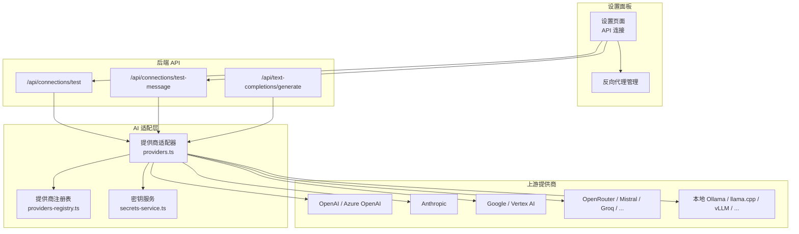
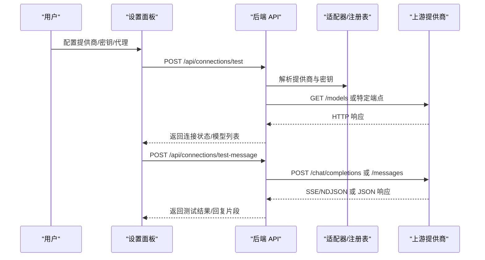
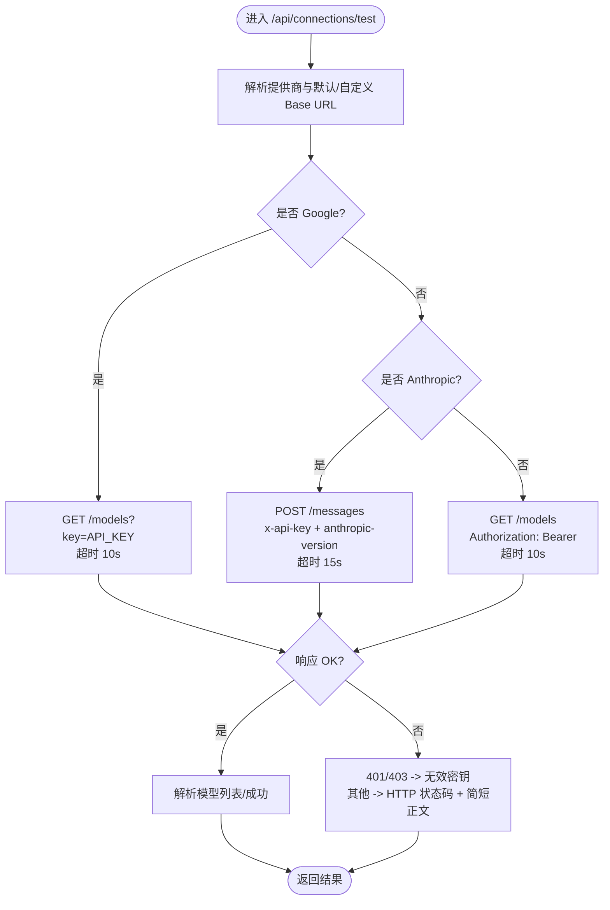
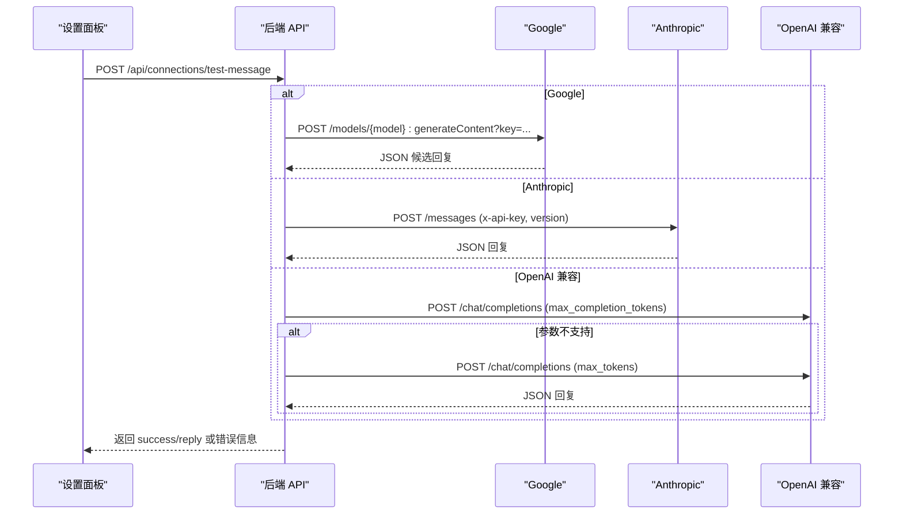
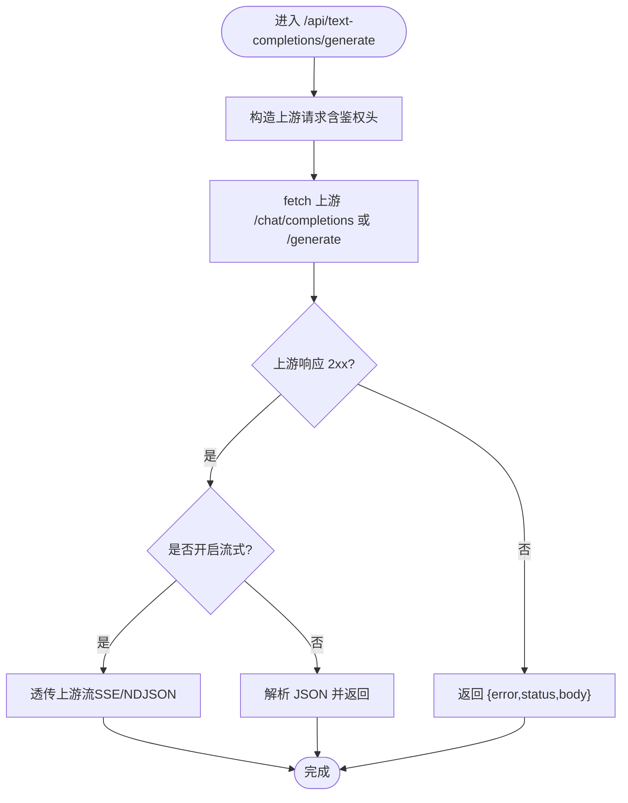
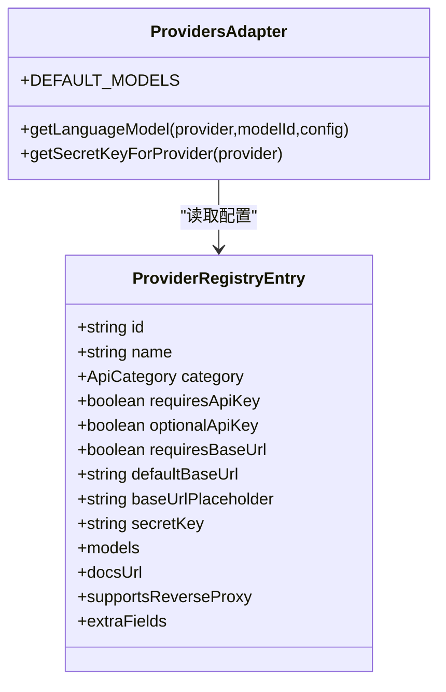
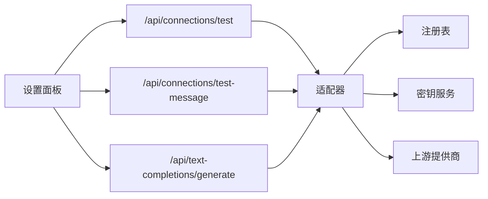

# AI 提供商错误

<cite>
**本文引用的文件**
- [README.md](file://README.md)
- [providers.ts](file://src/lib/ai/providers.ts)
- [providers-registry.ts](file://src/lib/constants/providers-registry.ts)
- [secrets-service.ts](file://src/lib/services/secrets-service.ts)
- [api-connections.ts](file://src/types/api-connections.ts)
- [test/route.ts](file://src/app/api/connections/test/route.ts)
- [test-message/route.ts](file://src/app/api/connections/test-message/route.ts)
- [text-completions/generate/route.ts](file://src/app/api/text-completions/generate/route.ts)
- [parse-stream.ts](file://src/lib/textgen/parse-stream.ts)
- [reverse-proxy.tsx](file://src/components/settings/reverse-proxy.tsx)
- [api-connections.tsx](file://src/components/settings/api-connections.tsx)
</cite>

## 目录
1. [简介](#简介)
2. [项目结构](#项目结构)
3. [核心组件](#核心组件)
4. [架构总览](#架构总览)
5. [详细组件分析](#详细组件分析)
6. [依赖关系分析](#依赖关系分析)
7. [性能考量](#性能考量)
8. [故障排除指南](#故障排除指南)
9. [结论](#结论)
10. [附录](#附录)

## 简介
本指南面向使用 SillyTavern Next 的用户与运维人员，聚焦“AI 提供商集成错误”的诊断与修复。内容覆盖：
- API 密钥验证失败
- 连接超时
- 响应格式错误
- 流式传输中断
- 不同提供商的特定错误码与行为差异
- 网络连接、代理设置、SSL 证书、防火墙配置
- 备用提供商切换与降级策略

## 项目结构
SillyTavern Next 通过统一的 AI 适配层对接多家提供商，并提供连接测试与流式解析能力。关键模块包括：
- 提供商注册与适配：提供者定义、默认模型、Base URL 映射、头部注入
- 连接测试：/api/connections/test 与 /api/connections/test-message
- 文本生成与流式解析：/api/text-completions/generate 与 parse-stream
- 密钥管理：用户密钥存储与检索
- 反向代理：按提供商维度的代理配置与切换

图表来源
- [providers-registry.ts:722-738](file://src/lib/constants/providers-registry.ts#L722-L738)
- [providers.ts:58-97](file://src/lib/ai/providers.ts#L58-L97)
- [test/route.ts:54-148](file://src/app/api/connections/test/route.ts#L54-L148)
- [test-message/route.ts:81-216](file://src/app/api/connections/test-message/route.ts#L81-L216)
- [text-completions/generate/route.ts:85-120](file://src/app/api/text-completions/generate/route.ts#L85-L120)

章节来源
- [README.md:10-122](file://README.md#L10-L122)

## 核心组件
- 提供商注册与适配
  - 提供商注册表定义了每个提供商的特性（是否需要 API Key、是否需要 Base URL、默认模型、文档链接、额外字段等）
  - 适配器根据提供商类型选择合适的 SDK（OpenAI、Anthropic、Google），并支持自定义 Base URL 与附加头
- 连接测试
  - /api/connections/test：调用各提供商 /models 或特定端点，检测可用性与模型列表
  - /api/connections/test-message：发送真实消息（如“Hi”），验证额度消耗与响应格式
- 文本生成与流式解析
  - /api/text-completions/generate：转发上游请求，支持直通 SSE/NDJSON 流
  - parse-stream：解析多种上游流格式（SSE/NDJSON/纯文本），提取 token 并回调
- 密钥管理
  - secrets-service：按用户隔离存储与检索密钥，支持批量获取
- 反向代理
  - 设置面板支持为每个提供商配置独立的反向代理，便于跨网络/合规场景

章节来源
- [providers-registry.ts:41-58](file://src/lib/constants/providers-registry.ts#L41-L58)
- [providers.ts:58-97](file://src/lib/ai/providers.ts#L58-L97)
- [test/route.ts:54-148](file://src/app/api/connections/test/route.ts#L54-L148)
- [test-message/route.ts:81-216](file://src/app/api/connections/test-message/route.ts#L81-L216)
- [parse-stream.ts:38-99](file://src/lib/textgen/parse-stream.ts#L38-L99)
- [secrets-service.ts:10-65](file://src/lib/services/secrets-service.ts#L10-L65)
- [reverse-proxy.tsx:1-106](file://src/components/settings/reverse-proxy.tsx#L1-L106)

## 架构总览
下图展示从设置面板到上游提供商的整体调用链与错误处理要点。

图表来源
- [test/route.ts:54-148](file://src/app/api/connections/test/route.ts#L54-L148)
- [test-message/route.ts:81-216](file://src/app/api/connections/test-message/route.ts#L81-L216)
- [providers.ts:58-97](file://src/lib/ai/providers.ts#L58-L97)
- [providers-registry.ts:722-738](file://src/lib/constants/providers-registry.ts#L722-L738)

## 详细组件分析

### 组件 A：连接测试（/api/connections/test）
- 目标：快速验证提供商可用性与模型列表
- 关键逻辑
  - Google：调用 /models?key=...，超时 10 秒
  - Anthropic：直连 https://api.anthropic.com/v1/messages，使用 x-api-key 与 anthropic-version，超时 15 秒
  - OpenAI 兼容：调用 /models，带 Authorization: Bearer，超时 10 秒
  - 错误处理：401/403 明确提示无效密钥；其他 HTTP 错误返回状态码与简短正文
- 适用场景：首次配置、密钥变更后快速验证

图表来源
- [test/route.ts:87-148](file://src/app/api/connections/test/route.ts#L87-L148)

章节来源
- [test/route.ts:54-148](file://src/app/api/connections/test/route.ts#L54-L148)

### 组件 B：消息测试（/api/connections/test-message）
- 目标：发送真实消息（如“Hi”）验证额度与响应格式
- 关键逻辑
  - Google：/models/{model}:generateContent?key=...
  - Anthropic：/messages，使用 x-api-key 与 anthropic-version
  - OpenAI 兼容：/chat/completions，优先使用 max_completion_tokens，若报“参数不受支持”，回退到 max_tokens
  - 错误处理：401/403 明确提示认证失败；若未提供密钥但需要密钥，则提示先输入密钥再连接
- 适用场景：确认密钥有效且能产生可解析的回复

图表来源
- [test-message/route.ts:92-216](file://src/app/api/connections/test-message/route.ts#L92-L216)

章节来源
- [test-message/route.ts:81-216](file://src/app/api/connections/test-message/route.ts#L81-L216)

### 组件 C：文本生成与流式解析（/api/text-completions/generate + parse-stream）
- 目标：转发上游请求并支持流式输出
- 关键逻辑
  - 直接透传上游响应（含 Content-Type），用于 SSE/NDJSON
  - 若上游返回非 2xx，将原始响应体返回给客户端，便于定位上游错误
  - 流式解析：consumeTextgenStream 支持 SSE/NDJSON/纯文本，按行解析并回调增量内容
- 适用场景：本地/第三方文本生成服务（如 Ollama、llama.cpp、vLLM、OpenRouter 等）

图表来源
- [text-completions/generate/route.ts:85-120](file://src/app/api/text-completions/generate/route.ts#L85-L120)
- [parse-stream.ts:38-99](file://src/lib/textgen/parse-stream.ts#L38-L99)

章节来源
- [text-completions/generate/route.ts:85-120](file://src/app/api/text-completions/generate/route.ts#L85-L120)
- [parse-stream.ts:1-116](file://src/lib/textgen/parse-stream.ts#L1-L116)

### 组件 D：提供商注册与适配（providers.ts + providers-registry.ts）
- 目标：统一接入多家提供商，支持自定义 Base URL 与附加头
- 关键逻辑
  - providers.ts：根据提供商类型选择 SDK；OpenAI 兼容提供 Base URL 映射与额外头（如 OpenRouter 的 HTTP-Referer/X-Title）
  - providers-registry.ts：定义每个提供商的特性（是否需要密钥、是否需要 Base URL、默认模型、文档链接、额外字段等）
- 适用场景：新增/切换提供商、统一模型选择与文档链接

图表来源
- [providers-registry.ts:41-58](file://src/lib/constants/providers-registry.ts#L41-L58)
- [providers.ts:58-174](file://src/lib/ai/providers.ts#L58-L174)

章节来源
- [providers-registry.ts:722-738](file://src/lib/constants/providers-registry.ts#L722-L738)
- [providers.ts:18-97](file://src/lib/ai/providers.ts#L18-L97)

### 组件 E：密钥管理（secrets-service.ts）
- 目标：按用户隔离存储与检索密钥，支持批量获取
- 关键逻辑
  - listKeys/getSecret/setSecret/deleteSecret/getSecrets
  - SECRET_KEYS 常量定义标准密钥名称，便于统一管理
- 适用场景：设置面板保存/读取用户密钥，避免明文泄露

章节来源
- [secrets-service.ts:10-116](file://src/lib/services/secrets-service.ts#L10-L116)
- [api-connections.ts:117-136](file://src/types/api-connections.ts#L117-L136)

### 组件 F：反向代理（reverse-proxy.tsx + 设置面板）
- 目标：为每个提供商配置独立的反向代理，便于跨网络/合规场景
- 关键逻辑
  - 设置面板支持添加/删除/切换代理，保存到连接配置中
  - 适配器在构造请求时可使用自定义 Base URL（来自代理配置）
- 适用场景：内网/受限网络、合规要求、多区域部署

章节来源
- [reverse-proxy.tsx:1-106](file://src/components/settings/reverse-proxy.tsx#L1-L106)
- [api-connections.tsx:167-188](file://src/components/settings/api-connections.tsx#L167-L188)

## 依赖关系分析
- 组件耦合
  - 设置面板依赖后端 API 与连接状态存储
  - 后端 API 依赖适配器与提供商注册表
  - 适配器依赖注册表与密钥服务
  - 流式解析独立于上游格式，仅依赖读取器与回调
- 外部依赖
  - 各家提供商的 API 端点与鉴权方式不同，需在注册表与适配器中分别处理
  - 反向代理作为可选中间层，降低网络与合规风险

图表来源
- [providers.ts:58-97](file://src/lib/ai/providers.ts#L58-L97)
- [providers-registry.ts:722-738](file://src/lib/constants/providers-registry.ts#L722-L738)
- [secrets-service.ts:10-65](file://src/lib/services/secrets-service.ts#L10-L65)

章节来源
- [providers.ts:58-97](file://src/lib/ai/providers.ts#L58-L97)
- [providers-registry.ts:722-738](file://src/lib/constants/providers-registry.ts#L722-L738)
- [secrets-service.ts:10-65](file://src/lib/services/secrets-service.ts#L10-L65)

## 性能考量
- 超时控制：各测试端点设置了合理的超时（10–15 秒），避免阻塞 UI
- 流式直通：文本生成 API 直接透传上游流，减少额外解析开销
- 模型列表缓存：连接测试成功后可缓存模型列表，减少重复请求
- 代理优化：合理配置反向代理可改善跨网络延迟与稳定性

## 故障排除指南

### 1. API 密钥验证失败
- 现象
  - 连接测试返回“无效密钥”或“认证失败”
  - 消息测试返回 401/403
- 诊断步骤
  - 确认提供商是否需要密钥（注册表中 requiresApiKey/optionalApiKey）
  - 在设置面板中保存密钥并点击“连接”，随后进行“测试消息”
  - 对于 Anthropic，确保使用 x-api-key 与正确的 anthropic-version
  - 对于 Google/Vertex AI，确认密钥有效且项目/区域配置正确
- 处理建议
  - 重新生成密钥并更新到设置面板
  - 若提供商支持反向代理，检查代理是否正确转发密钥头

章节来源
- [test/route.ts:114-118](file://src/app/api/connections/test/route.ts#L114-L118)
- [test-message/route.ts:133-136](file://src/app/api/connections/test-message/route.ts#L133-L136)
- [providers-registry.ts:45-57](file://src/lib/constants/providers-registry.ts#L45-L57)

### 2. 连接超时
- 现象
  - 连接测试或消息测试长时间无响应
- 诊断步骤
  - 检查网络连通性与 DNS 解析
  - 若使用反向代理，确认代理可达且未限流
  - 对于 Google/Anthropic 等公共 API，确认未被防火墙拦截
- 处理建议
  - 适当延长超时时间（代码中已针对不同提供商设置不同超时）
  - 使用代理或更换网络环境测试
  - 在设置面板中启用/切换反向代理

章节来源
- [test/route.ts:89-90](file://src/app/api/connections/test/route.ts#L89-L90)
- [test/route.ts:100-112](file://src/app/api/connections/test/route.ts#L100-L112)
- [test-message/route.ts:103-104](file://src/app/api/connections/test-message/route.ts#L103-L104)
- [reverse-proxy.tsx:1-106](file://src/components/settings/reverse-proxy.tsx#L1-L106)

### 3. 响应格式错误
- 现象
  - 文本生成无法显示或显示乱码
  - 流式解析异常中断
- 诊断步骤
  - 确认上游返回的 Content-Type 是否为 SSE/NDJSON
  - 检查 parse-stream 是否能正确解析行与 JSON
  - 对于 OpenAI 兼容，确认 max_completion_tokens 与 max_tokens 的差异
- 处理建议
  - 若上游返回非标准格式，考虑在上游侧调整或使用代理转换
  - 对于不支持 max_completion_tokens 的上游，使用回退逻辑（max_tokens）

章节来源
- [text-completions/generate/route.ts:100-110](file://src/app/api/text-completions/generate/route.ts#L100-L110)
- [parse-stream.ts:38-99](file://src/lib/textgen/parse-stream.ts#L38-L99)
- [test-message/route.ts:177-200](file://src/app/api/connections/test-message/route.ts#L177-L200)

### 4. 流式传输中断
- 现象
  - 文本生成过程中断，无法接收完整回复
- 诊断步骤
  - 检查上游是否稳定，是否存在网络抖动
  - 确认浏览器/客户端未提前关闭连接
  - 查看 parse-stream 的 onChunk 回调是否正常触发
- 处理建议
  - 保持长连接，避免代理层过早断开
  - 在设置面板中切换/调整反向代理
  - 对于本地服务（Ollama/llama.cpp/vLLM），确认其日志与资源限制

章节来源
- [parse-stream.ts:10-15](file://src/lib/textgen/parse-stream.ts#L10-L15)
- [parse-stream.ts:101-115](file://src/lib/textgen/parse-stream.ts#L101-L115)

### 5. 不同提供商的特定错误码与行为
- OpenAI/Azure OpenAI/OpenRouter/Mistral/Groq 等
  - /models 成功表示可用；401/403 表示密钥无效
  - /chat/completions 返回 choices[].message.content
- Anthropic
  - /messages 需要 x-api-key 与 anthropic-version
  - 401/403 表示密钥无效；400 等通常表示参数问题而非密钥问题
- Google/Vertex AI
  - /models?key=... 或 /models/{model}:generateContent?key=...
  - 需要有效项目与区域配置
- 本地/自托管
  - Ollama/llama.cpp/vLLM 等需确保端口开放与模型加载完成

章节来源
- [test/route.ts:87-148](file://src/app/api/connections/test/route.ts#L87-L148)
- [test-message/route.ts:92-141](file://src/app/api/connections/test-message/route.ts#L92-L141)
- [providers-registry.ts:11-81](file://src/lib/constants/providers-registry.ts#L11-L81)
- [providers-registry.ts:120-151](file://src/lib/constants/providers-registry.ts#L120-L151)

### 6. 网络连接问题、代理设置、SSL 证书、防火墙配置
- 代理设置
  - 在设置面板为提供商配置反向代理，保存后生效
  - 可添加/删除/切换代理，便于跨网络与合规
- SSL 证书
  - 若使用自签名证书，确保代理或上游服务端配置正确
- 防火墙
  - 确保对外出站端口（如 443）未被阻断
  - 对于受限网络，优先使用反向代理

章节来源
- [reverse-proxy.tsx:1-106](file://src/components/settings/reverse-proxy.tsx#L1-L106)
- [api-connections.tsx:167-188](file://src/components/settings/api-connections.tsx#L167-L188)

### 7. 备用提供商切换与降级策略
- 切换策略
  - 在设置面板中切换到另一个提供商（如从 OpenAI 切换到 OpenRouter 或 Mistral）
  - 若某提供商不可用，优先使用“自定义（OpenAI 兼容）”并填写 Base URL
- 降级策略
  - 优先使用较小模型（如 gpt-4o-mini、claude-3-haiku、gemini-2.5-flash）以提升稳定性
  - 若上游不支持 max_completion_tokens，自动回退到 max_tokens
  - 对于本地服务，优先使用轻量模型与较低并发

章节来源
- [providers-registry.ts:153-173](file://src/lib/constants/providers-registry.ts#L153-L173)
- [test-message/route.ts:177-200](file://src/app/api/connections/test-message/route.ts#L177-L200)

## 结论
通过统一的提供商注册与适配层、完善的连接测试与流式解析机制，以及可配置的反向代理，SillyTavern Next 能够在多变的网络与提供商环境中保持较高可用性。遇到错误时，建议按“密钥—连接—格式—流式—代理—降级”的顺序逐步排查，并结合注册表与适配器的差异化行为进行针对性处理。

## 附录
- 常用命令与环境变量参考
  - 环境变量：AUTH_SECRET、AUTH_URL、DATABASE_URL、OPENAI_API_KEY、ANTHROPIC_API_KEY、GOOGLE_GENERATIVE_AI_API_KEY、PORT
  - 建议在设置面板中为每个用户提供独立密钥，避免使用环境变量作为唯一来源

章节来源
- [README.md:62-74](file://README.md#L62-L74)