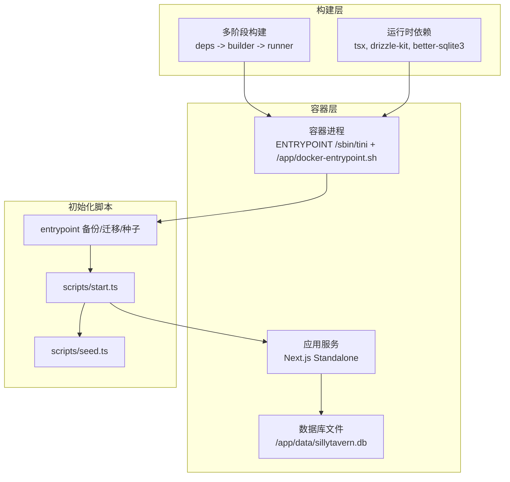
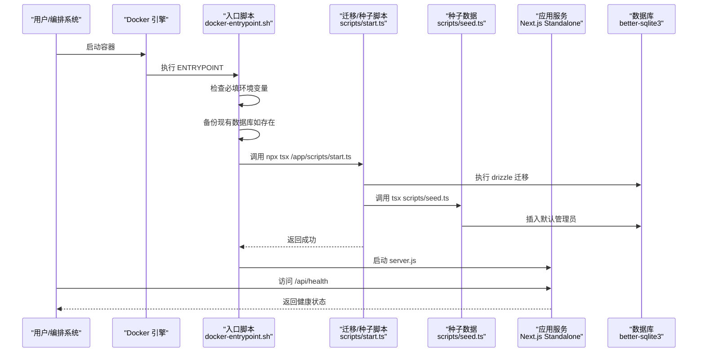
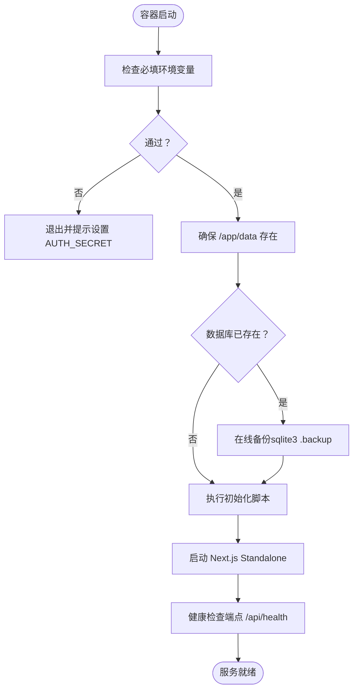
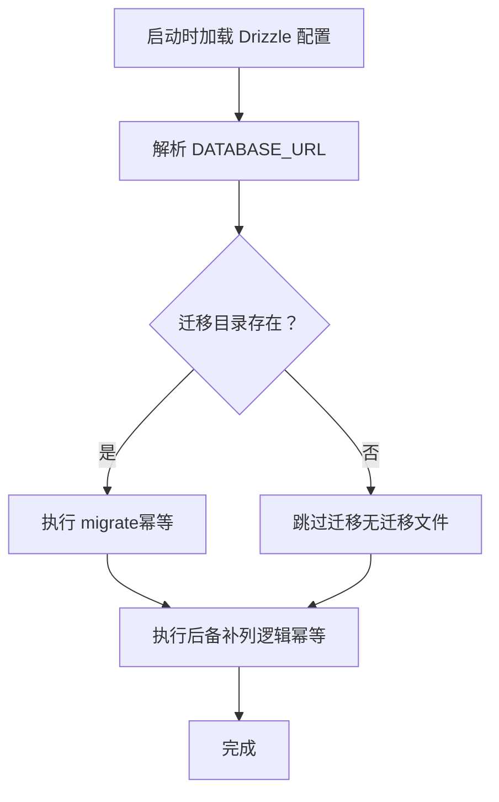
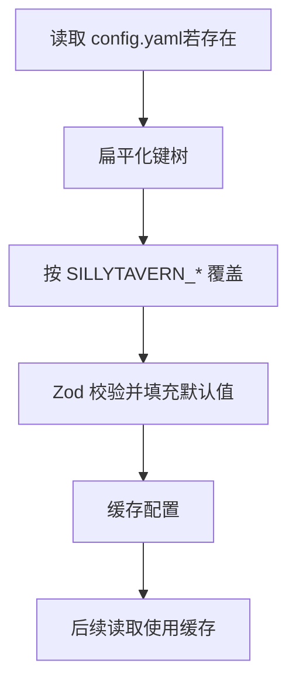
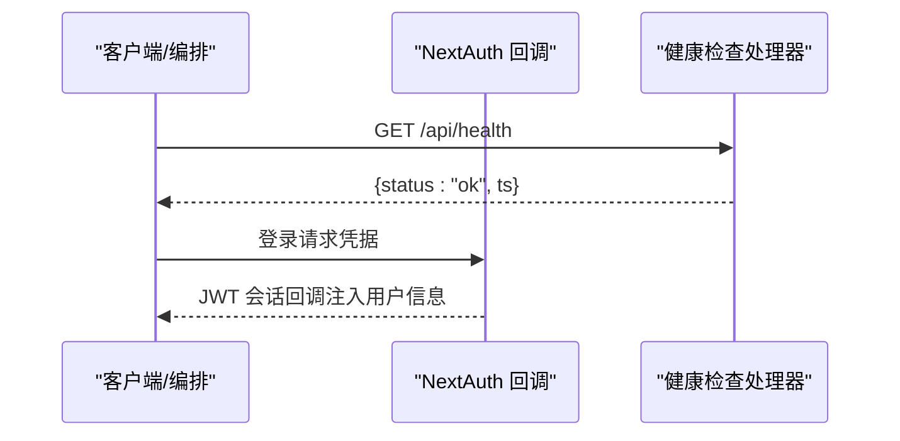
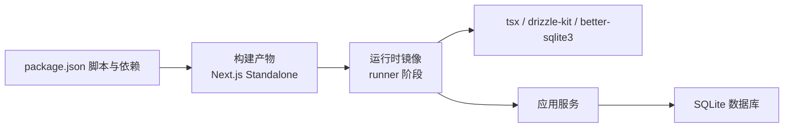

# 安装部署问题

<cite>
**本文引用的文件**
- [package.json](file://package.json)
- [Dockerfile](file://Dockerfile)
- [docker-compose.yml](file://docker-compose.yml)
- [docker-entrypoint.sh](file://docker-entrypoint.sh)
- [drizzle.config.ts](file://drizzle.config.ts)
- [scripts/start.ts](file://scripts/start.ts)
- [scripts/seed.ts](file://scripts/seed.ts)
- [src/lib/db/index.ts](file://src/lib/db/index.ts)
- [src/lib/config.ts](file://src/lib/config.ts)
- [src/lib/auth.config.ts](file://src/lib/auth.config.ts)
- [src/app/api/health/route.ts](file://src/app/api/health/route.ts)
- [next.config.ts](file://next.config.ts)
- [tsconfig.json](file://tsconfig.json)
</cite>

## 目录
1. [简介](#简介)
2. [项目结构](#项目结构)
3. [核心组件](#核心组件)
4. [架构总览](#架构总览)
5. [详细组件分析](#详细组件分析)
6. [依赖关系分析](#依赖关系分析)
7. [性能考虑](#性能考虑)
8. [故障排查指南](#故障排查指南)
9. [结论](#结论)
10. [附录](#附录)

## 简介
本指南面向首次安装与持续部署 SillyTavern Next 的运维与开发者，聚焦以下常见问题与排障流程：
- Node.js 版本与构建链路兼容性
- 依赖安装失败与二进制依赖问题
- Docker 容器启动异常与入口脚本行为
- 数据库初始化与迁移失败
- 环境变量配置、端口冲突、权限问题
- 日志分析技巧与自动化部署脚本使用
- 完整安装检查清单与回滚策略

## 项目结构
SillyTavern Next 采用多阶段 Docker 构建，生产镜像基于 Node.js 20 Alpine，使用 Standalone 输出与 better-sqlite3 本地 SQLite 数据库存储。关键目录与文件职责概览：
- 构建与运行：Dockerfile、docker-compose.yml、docker-entrypoint.sh
- 数据库：drizzle 配置、迁移脚本、种子脚本、SQLite 数据目录
- 应用配置：Next.js 配置、Zod 配置加载与环境变量覆盖
- 认证与健康检查：NextAuth 配置、健康检查端点

图表来源
- [Dockerfile:1-63](file://Dockerfile#L1-L63)
- [docker-compose.yml:1-37](file://docker-compose.yml#L1-L37)
- [docker-entrypoint.sh:1-70](file://docker-entrypoint.sh#L1-L70)
- [scripts/start.ts:1-96](file://scripts/start.ts#L1-L96)
- [scripts/seed.ts:1-28](file://scripts/seed.ts#L1-L28)
- [src/lib/db/index.ts:1-134](file://src/lib/db/index.ts#L1-L134)

章节来源
- [Dockerfile:1-63](file://Dockerfile#L1-L63)
- [docker-compose.yml:1-37](file://docker-compose.yml#L1-L37)
- [next.config.ts:1-14](file://next.config.ts#L1-L14)

## 核心组件
- 多阶段 Docker 构建：分离依赖安装、构建与运行时，确保最小镜像体积与可重复性。
- Standalone 输出：Next.js 以独立可执行形式运行，配合 serverExternalPackages 优化打包。
- 数据库初始化：容器启动前自动备份、迁移与种子数据，保证幂等与可回滚。
- 配置系统：支持 YAML 配置文件与环境变量覆盖，Zod 校验与默认值填充。
- 认证与健康检查：NextAuth JWT 回调与公共健康检查端点，便于容器编排与监控。

章节来源
- [Dockerfile:1-63](file://Dockerfile#L1-L63)
- [next.config.ts:1-14](file://next.config.ts#L1-L14)
- [src/lib/db/index.ts:1-134](file://src/lib/db/index.ts#L1-L134)
- [src/lib/config.ts:1-184](file://src/lib/config.ts#L1-L184)
- [src/lib/auth.config.ts:1-53](file://src/lib/auth.config.ts#L1-L53)
- [src/app/api/health/route.ts:1-10](file://src/app/api/health/route.ts#L1-L10)

## 架构总览
下图展示容器启动到服务可用的关键路径：入口脚本负责备份、迁移与种子，随后启动 Next.js 服务；Drizzle ORM 通过 better-sqlite3 访问 SQLite；NextAuth 管理认证；健康检查端点暴露给编排系统。

图表来源
- [docker-entrypoint.sh:1-70](file://docker-entrypoint.sh#L1-L70)
- [scripts/start.ts:1-96](file://scripts/start.ts#L1-L96)
- [scripts/seed.ts:1-28](file://scripts/seed.ts#L1-L28)
- [src/app/api/health/route.ts:1-10](file://src/app/api/health/route.ts#L1-L10)
- [src/lib/db/index.ts:1-134](file://src/lib/db/index.ts#L1-L134)

## 详细组件分析

### 组件一：Docker 容器与启动流程
- 入口脚本负责：
  - 必填环境变量校验（如 AUTH_SECRET）
  - 数据库存在性判断与在线备份（优先 sqlite3 .backup，否则回退 cp）
  - 调用初始化脚本执行迁移与种子
  - 启动 Next.js Standalone 服务器
- 多阶段构建：
  - deps 阶段安装依赖
  - builder 阶段构建 Next.js
  - runner 阶段复制静态与 Standalone 输出，并安装运行时所需工具与依赖
- 权限与目录：
  - 使用非 root 用户运行
  - 数据目录挂载为 /app/data，便于持久化与备份

图表来源
- [docker-entrypoint.sh:1-70](file://docker-entrypoint.sh#L1-L70)
- [docker-compose.yml:1-37](file://docker-compose.yml#L1-L37)
- [Dockerfile:1-63](file://Dockerfile#L1-L63)

章节来源
- [docker-entrypoint.sh:1-70](file://docker-entrypoint.sh#L1-L70)
- [docker-compose.yml:1-37](file://docker-compose.yml#L1-L37)
- [Dockerfile:1-63](file://Dockerfile#L1-L63)

### 组件二：数据库初始化与迁移
- Drizzle 配置：
  - schema 指向应用内 schema 定义
  - 输出目录与 SQLite URL 来自环境变量或默认路径
- 初始化脚本：
  - 自动备份（含 WAL/SHM）
  - 执行 drizzle-kit migrate（幂等）
  - 执行种子脚本创建默认管理员
- 运行时迁移：
  - 应用启动时再次确保迁移与“后备补列”逻辑，提升健壮性

图表来源
- [drizzle.config.ts:1-11](file://drizzle.config.ts#L1-L11)
- [src/lib/db/index.ts:1-134](file://src/lib/db/index.ts#L1-L134)
- [scripts/start.ts:1-96](file://scripts/start.ts#L1-L96)

章节来源
- [drizzle.config.ts:1-11](file://drizzle.config.ts#L1-L11)
- [src/lib/db/index.ts:1-134](file://src/lib/db/index.ts#L1-L134)
- [scripts/start.ts:1-96](file://scripts/start.ts#L1-L96)

### 组件三：配置系统与环境变量覆盖
- 支持 YAML 配置文件与环境变量覆盖
- 环境变量键名转换规则：keyToEnv 将点分路径转为大写并替换点为下划线，前缀为 SILLYTAVERN_
- Zod 校验与默认值填充，保证配置一致性

图表来源
- [src/lib/config.ts:1-184](file://src/lib/config.ts#L1-L184)

章节来源
- [src/lib/config.ts:1-184](file://src/lib/config.ts#L1-L184)

### 组件四：认证与健康检查
- NextAuth 配置：
  - 基于凭据提供者
  - JWT 回调注入用户信息
  - 授权回调区分公开端点（如 /api/health）
- 健康检查端点：
  - 动态禁用缓存，返回服务状态

图表来源
- [src/lib/auth.config.ts:1-53](file://src/lib/auth.config.ts#L1-L53)
- [src/app/api/health/route.ts:1-10](file://src/app/api/health/route.ts#L1-L10)

章节来源
- [src/lib/auth.config.ts:1-53](file://src/lib/auth.config.ts#L1-L53)
- [src/app/api/health/route.ts:1-10](file://src/app/api/health/route.ts#L1-L10)

## 依赖关系分析
- 构建与运行依赖：
  - Node.js 20（Alpine）
  - better-sqlite3（二进制依赖）
  - drizzle-kit、tsx（运行时工具）
- Next.js 依赖：
  - Standalone 输出与 serverExternalPackages 配置
- Docker 依赖：
  - tini 作为 init 进程
  - sqlite3（可选，用于在线备份）

图表来源
- [package.json:1-61](file://package.json#L1-L61)
- [Dockerfile:1-63](file://Dockerfile#L1-L63)
- [next.config.ts:1-14](file://next.config.ts#L1-L14)

章节来源
- [package.json:1-61](file://package.json#L1-L61)
- [Dockerfile:1-63](file://Dockerfile#L1-L63)
- [next.config.ts:1-14](file://next.config.ts#L1-L14)

## 性能考虑
- SQLite WAL 模式与外键启用提升并发与一致性
- 迁移幂等与后备补列减少运行期 500 风险
- Standalone 输出减少冷启动开销
- 健康检查端点动态禁用缓存，便于编排探测

章节来源
- [src/lib/db/index.ts:1-134](file://src/lib/db/index.ts#L1-L134)
- [next.config.ts:1-14](file://next.config.ts#L1-L14)
- [src/app/api/health/route.ts:1-10](file://src/app/api/health/route.ts#L1-L10)

## 故障排查指南

### 1. Node.js 版本与构建链路兼容性
- 症状
  - 构建阶段报错（如二进制依赖安装失败）
  - 运行时报错（如 better-sqlite3 无法加载）
- 诊断要点
  - Dockerfile 明确使用 node:20-alpine
  - runner 阶段安装 libc6-compat 与 tini
  - 二进制依赖 better-sqlite3 在 runner 阶段显式安装
- 解决方案
  - 使用官方 Node.js 20 Alpine 基础镜像
  - 确保构建与运行阶段均安装必要系统依赖
  - 若自定义镜像，请保持二进制 ABI 兼容

章节来源
- [Dockerfile:1-63](file://Dockerfile#L1-L63)

### 2. 依赖安装失败（尤其是二进制依赖）
- 症状
  - npm ci/npm install 失败，报错与 better-sqlite3/canvas/sqlite3 相关
- 诊断要点
  - runner 阶段显式安装 better-sqlite3
  - 构建阶段安装 python3、make、g++ 以满足二进制编译需求
- 解决方案
  - 使用官方构建链路，避免在本地交叉编译二进制
  - 如需离线部署，确保宿主机与容器镜像系统库一致

章节来源
- [Dockerfile:1-63](file://Dockerfile#L1-L63)

### 3. Docker 容器启动异常
- 症状
  - 容器启动即退出或健康检查失败
- 诊断要点
  - 入口脚本强制检查 AUTH_SECRET
  - 备份/迁移/种子任一步骤失败都会导致退出
  - 健康检查端点需可达
- 解决方案
  - 设置 AUTH_SECRET（建议使用 openssl rand -hex 32 生成）
  - 查看容器日志定位失败步骤
  - 确认端口映射与防火墙放行

章节来源
- [docker-entrypoint.sh:1-70](file://docker-entrypoint.sh#L1-L70)
- [docker-compose.yml:1-37](file://docker-compose.yml#L1-L37)
- [src/app/api/health/route.ts:1-10](file://src/app/api/health/route.ts#L1-L10)

### 4. 数据库初始化错误
- 症状
  - 迁移失败、表结构缺失、种子数据未创建
- 诊断要点
  - 初始化脚本会自动备份（含 WAL/SHM）、执行迁移与种子
  - 运行时也会进行后备补列逻辑
- 解决方案
  - 查看初始化脚本输出与错误堆栈
  - 使用回滚命令将数据库恢复到最近备份
  - 确认数据目录权限与挂载卷正确

章节来源
- [scripts/start.ts:1-96](file://scripts/start.ts#L1-L96)
- [scripts/seed.ts:1-28](file://scripts/seed.ts#L1-L28)
- [src/lib/db/index.ts:1-134](file://src/lib/db/index.ts#L1-L134)

### 5. 环境变量配置
- 必填项
  - AUTH_SECRET：登录密钥，必须设置
  - AUTH_URL：认证服务地址（默认 http://localhost:3000）
  - DATABASE_URL：数据库文件路径（默认 /app/data/sillytavern.db）
- 可选项
  - OPENAI_API_KEY、ANTHROPIC_API_KEY、GOOGLE_GENERATIVE_AI_API_KEY：各提供商默认 Key
- 覆盖规则
  - YAML 配置文件与环境变量均可生效，后者优先（SILLYTAVERN_ 前缀 + 点号转下划线）

章节来源
- [docker-compose.yml:1-37](file://docker-compose.yml#L1-L37)
- [src/lib/config.ts:1-184](file://src/lib/config.ts#L1-L184)

### 6. 端口冲突
- 症状
  - 容器启动但无法访问服务
- 诊断要点
  - docker-compose 将宿主端口映射到容器 3000
  - 确认宿主端口未被占用
- 解决方案
  - 修改 .env 中的 PORT 变量或 docker-compose 端口映射

章节来源
- [docker-compose.yml:1-37](file://docker-compose.yml#L1-L37)

### 7. 权限问题
- 症状
  - 容器内无法写入 /app/data 或启动失败
- 诊断要点
  - runner 阶段创建非 root 用户并 chown 目录
  - 入口脚本确保 /app/data 存在
- 解决方案
  - 确保宿主卷正确挂载到 /app/data
  - 检查宿主卷权限与 SELinux/AppArmor 策略

章节来源
- [Dockerfile:1-63](file://Dockerfile#L1-L63)
- [docker-entrypoint.sh:1-70](file://docker-entrypoint.sh#L1-L70)

### 8. 日志分析技巧
- 容器日志
  - 关注入口脚本输出（备份、迁移、种子、启动）
  - 关注初始化脚本错误与回滚提示
- 应用日志
  - 数据库迁移与后备补列错误
  - 配置加载与校验错误
- 健康检查
  - 通过 /api/health 判断服务可用性

章节来源
- [docker-entrypoint.sh:1-70](file://docker-entrypoint.sh#L1-L70)
- [scripts/start.ts:1-96](file://scripts/start.ts#L1-L96)
- [src/lib/db/index.ts:1-134](file://src/lib/db/index.ts#L1-L134)
- [src/lib/config.ts:1-184](file://src/lib/config.ts#L1-L184)
- [src/app/api/health/route.ts:1-10](file://src/app/api/health/route.ts#L1-L10)

### 9. 自动化部署脚本使用
- 一键初始化脚本
  - 本地开发：npm run setup
  - 容器入口：tsx scripts/start.ts
- 脚本行为
  - 自动备份、迁移、种子、幂等处理
  - 失败时打印回滚指令

章节来源
- [package.json:1-61](file://package.json#L1-L61)
- [scripts/start.ts:1-96](file://scripts/start.ts#L1-L96)
- [docker-entrypoint.sh:1-70](file://docker-entrypoint.sh#L1-L70)

### 10. 完整安装检查清单
- 环境准备
  - 安装 Docker 与 docker-compose
  - 准备 .env 文件（至少设置 AUTH_SECRET）
- 配置核对
  - 确认 AUTH_SECRET、AUTH_URL、DATABASE_URL
  - 端口映射与防火墙放行
- 启动与验证
  - docker compose up -d
  - docker compose logs -f
  - 访问 http://localhost:3000/api/health
- 回滚策略
  - 初始化失败时根据入口脚本提示执行回滚命令

章节来源
- [docker-compose.yml:1-37](file://docker-compose.yml#L1-L37)
- [docker-entrypoint.sh:1-70](file://docker-entrypoint.sh#L1-L70)
- [src/app/api/health/route.ts:1-10](file://src/app/api/health/route.ts#L1-L10)

## 结论
SillyTavern Next 的安装部署以多阶段 Docker 构建为核心，结合入口脚本的自动备份、迁移与种子机制，提供了高可靠性的启动体验。遵循本文档的排障流程与检查清单，可快速定位并解决版本兼容、依赖安装、容器启动、数据库初始化、环境变量与权限等问题。

## 附录

### A. 常见错误与对应处理
- AUTH_SECRET 未设置
  - 现象：容器启动即退出
  - 处理：设置 AUTH_SECRET 并重启
- 数据库迁移失败
  - 现象：初始化脚本报错并提示回滚
  - 处理：查看日志，按提示回滚后重试
- 端口占用
  - 现象：服务不可达
  - 处理：修改 PORT 或释放宿主端口
- 权限不足
  - 现象：无法写入 /app/data
  - 处理：修正卷权限或宿主目录权限

章节来源
- [docker-entrypoint.sh:1-70](file://docker-entrypoint.sh#L1-L70)
- [docker-compose.yml:1-37](file://docker-compose.yml#L1-L37)

### B. 关键配置与默认值速览
- 端口与监听
  - 默认端口：3000（容器内）
  - 监听地址：0.0.0.0（容器内）
- 数据库
  - 默认路径：/app/data/sillytavern.db
  - WAL 模式与外键开启
- 认证
  - JWT 会话策略，最大有效期约 30 天
  - 公共端点：/api/health

章节来源
- [Dockerfile:1-63](file://Dockerfile#L1-L63)
- [src/lib/db/index.ts:1-134](file://src/lib/db/index.ts#L1-L134)
- [src/lib/auth.config.ts:1-53](file://src/lib/auth.config.ts#L1-L53)
- [src/app/api/health/route.ts:1-10](file://src/app/api/health/route.ts#L1-L10)