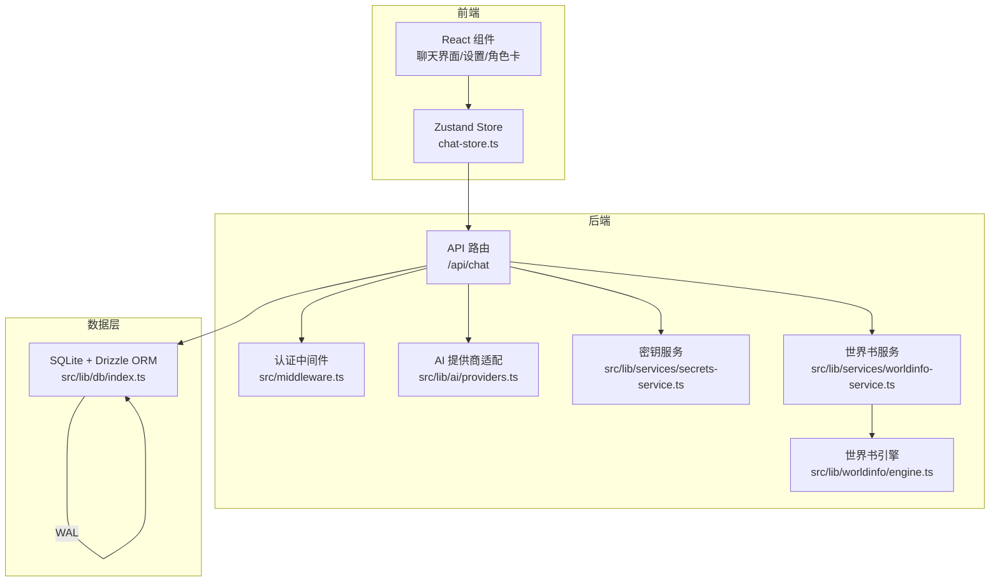
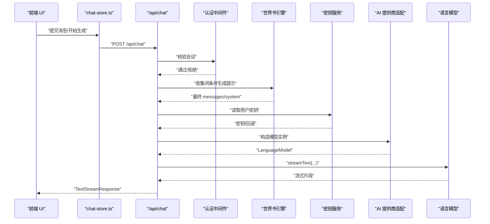
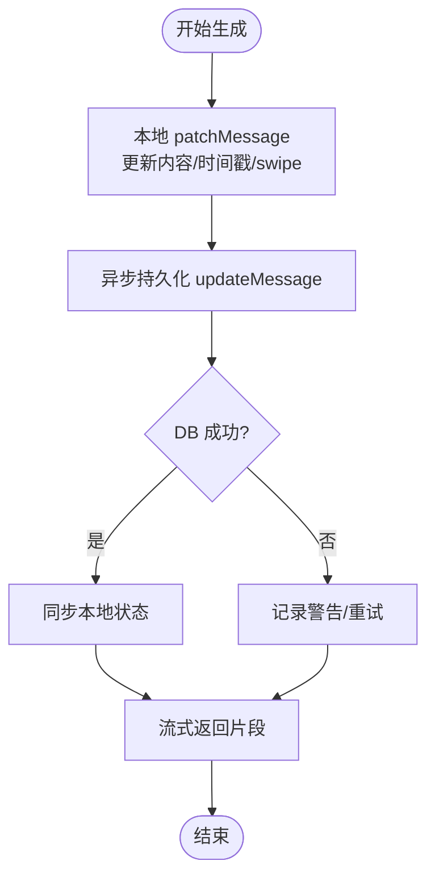
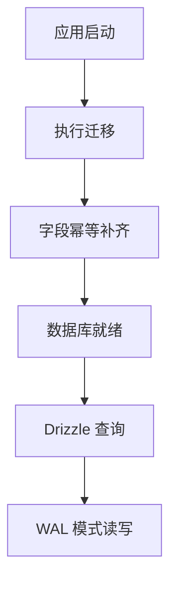
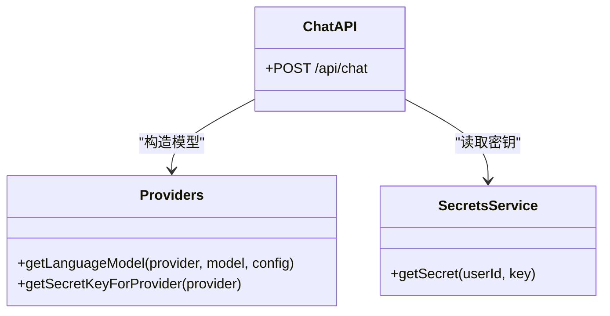
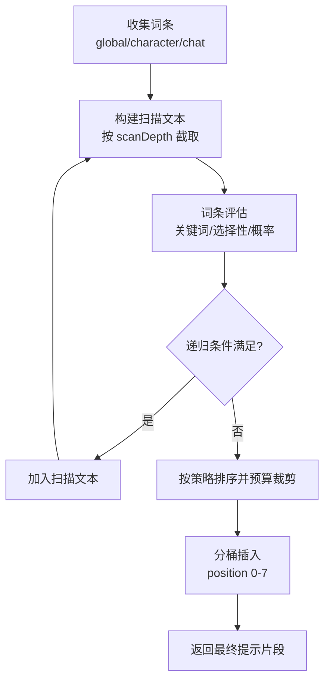
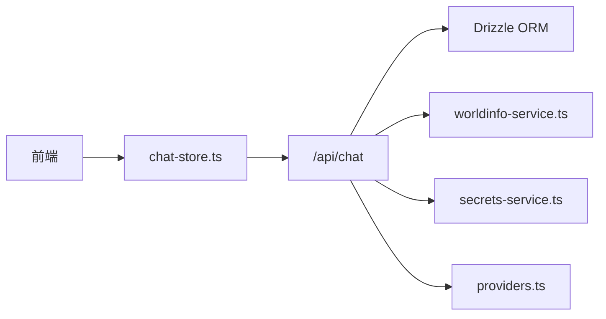

# 性能问题诊断

<cite>
**本文档引用的文件**
- [package.json](file://package.json)
- [README.md](file://README.md)
- [next.config.ts](file://next.config.ts)
- [src/middleware.ts](file://src/middleware.ts)
- [src/lib/config.ts](file://src/lib/config.ts)
- [src/lib/db/index.ts](file://src/lib/db/index.ts)
- [src/lib/services/worldinfo-service.ts](file://src/lib/services/worldinfo-service.ts)
- [src/lib/worldinfo/engine.ts](file://src/lib/worldinfo/engine.ts)
- [src/lib/ai/providers.ts](file://src/lib/ai/providers.ts)
- [src/lib/services/secrets-service.ts](file://src/lib/services/secrets-service.ts)
- [src/app/api/chat/route.ts](file://src/app/api/chat/route.ts)
- [src/stores/chat-store.ts](file://src/stores/chat-store.ts)
- [drizzle.config.ts](file://drizzle.config.ts)
</cite>

## 目录
1. [简介](#简介)
2. [项目结构](#项目结构)
3. [核心组件](#核心组件)
4. [架构总览](#架构总览)
5. [详细组件分析](#详细组件分析)
6. [依赖关系分析](#依赖关系分析)
7. [性能考量](#性能考量)
8. [故障排查指南](#故障排查指南)
9. [结论](#结论)
10. [附录](#附录)

## 简介
本指南面向 SillyTavern Next 的性能问题诊断与优化，聚焦以下关键场景：
- 聊天响应缓慢：前端渲染、状态管理、后端流式生成、数据库交互
- 内存泄漏：前端状态、后端连接、定时任务与事件监听
- CPU 使用率过高：AI 生成、世界书匹配、正则匹配与预算裁剪
- 并发请求处理异常：限流、竞态、事务一致性
- 状态管理优化：Zustand Store 的局部更新与批量操作
- 数据库查询优化：WAL 模式、索引与幂等迁移
- AI 生成延迟优化：模型选择、流式传输、密钥与代理配置
- 性能监控指标：响应时间、吞吐、错误率、内存与 CPU
- 基准测试方法：压力测试、冷启动与热缓存对比
- 容量规划建议：并发、数据库连接、模型参数与硬件资源
- 前端渲染优化：虚拟滚动、消息分片、懒加载
- 后端 API 响应优化：流式输出、压缩、超时与重试
- 缓存策略：内存缓存、CDN、浏览器缓存与 API 结果缓存

## 项目结构
SillyTavern Next 采用 Next.js 16 App Router + TypeScript + SQLite + Drizzle ORM + Zustand 的技术栈。核心目录与职责：
- src/app/api/*：后端 API 路由（如聊天流式生成）
- src/stores/*：Zustand 全局状态（聊天、格式化、群组等）
- src/lib/db/*：Drizzle ORM 初始化与迁移
- src/lib/services/*：业务服务（世界书、密钥、世界书引擎）
- src/lib/ai/*：AI 提供商适配与模型工厂
- next.config.ts：Next.js 构建与运行配置
- src/middleware.ts：NextAuth 认证中间件
- src/lib/config.ts：配置加载与环境变量覆盖

图表来源
- [src/stores/chat-store.ts:105-583](file://src/stores/chat-store.ts#L105-L583)
- [src/app/api/chat/route.ts:50-177](file://src/app/api/chat/route.ts#L50-L177)
- [src/lib/ai/providers.ts:58-97](file://src/lib/ai/providers.ts#L58-L97)
- [src/lib/services/secrets-service.ts:10-65](file://src/lib/services/secrets-service.ts#L10-L65)
- [src/lib/services/worldinfo-service.ts:97-300](file://src/lib/services/worldinfo-service.ts#L97-L300)
- [src/lib/worldinfo/engine.ts:174-290](file://src/lib/worldinfo/engine.ts#L174-L290)
- [src/lib/db/index.ts:1-134](file://src/lib/db/index.ts#L1-L134)

章节来源
- [README.md:78-136](file://README.md#L78-L136)
- [next.config.ts:1-14](file://next.config.ts#L1-L14)
- [src/middleware.ts:1-35](file://src/middleware.ts#L1-L35)

## 核心组件
- 状态管理（Zustand）
  - chat-store：负责聊天上下文、消息增删改、分支/书签、Swipe 切换、乐观更新与持久化
- 数据库（SQLite + Drizzle ORM）
  - 初始化 WAL 模式、外键约束、幂等迁移与字段补齐
- AI 生成（流式）
  - /api/chat：接收消息、拼接世界书、选择提供商与模型、流式返回
- 世界书（匹配与预算）
  - worldinfo-service：CRUD 与导入导出
  - worldinfo-engine：递归匹配、概率抽样、预算裁剪、分桶插入
- 认证与安全
  - NextAuth 中间件保护路由，公开路径白名单
- 配置与运行
  - next.config：standalone 输出、serverExternalPackages、serverActions 体限制
  - config.ts：YAML 配置加载、环境变量覆盖、缓存

章节来源
- [src/stores/chat-store.ts:105-583](file://src/stores/chat-store.ts#L105-L583)
- [src/lib/db/index.ts:1-134](file://src/lib/db/index.ts#L1-L134)
- [src/app/api/chat/route.ts:50-177](file://src/app/api/chat/route.ts#L50-L177)
- [src/lib/services/worldinfo-service.ts:97-300](file://src/lib/services/worldinfo-service.ts#L97-L300)
- [src/lib/worldinfo/engine.ts:174-290](file://src/lib/worldinfo/engine.ts#L174-L290)
- [src/middleware.ts:8-30](file://src/middleware.ts#L8-L30)
- [next.config.ts:3-11](file://next.config.ts#L3-L11)
- [src/lib/config.ts:88-143](file://src/lib/config.ts#L88-L143)

## 架构总览
聊天生成的关键链路：前端触发 → Zustand Store → Next.js API 路由 → 认证 → 世界书引擎 → 密钥服务 → AI 提供商 → 流式返回。

图表来源
- [src/stores/chat-store.ts:168-209](file://src/stores/chat-store.ts#L168-L209)
- [src/app/api/chat/route.ts:50-177](file://src/app/api/chat/route.ts#L50-L177)
- [src/lib/worldinfo/engine.ts:174-290](file://src/lib/worldinfo/engine.ts#L174-L290)
- [src/lib/services/secrets-service.ts:19-25](file://src/lib/services/secrets-service.ts#L19-L25)
- [src/lib/ai/providers.ts:58-97](file://src/lib/ai/providers.ts#L58-L97)

## 详细组件分析

### 状态管理优化（Zustand）
- 乐观更新与回写
  - 本地先更新 currentChat/messages，再异步持久化，减少 UI 阻塞
  - 消息 ID 回写：分支/检查点后回填服务端真实 ID，避免后续查找失败
- 批量与并发
  - moveMessage 使用 Promise.all 并发 PATCH 两条消息的时间戳，降低往返次数
  - appendSwipe/删除 Swipe：先本地变更，再异步写 DB，失败不回滚，保证用户体验
- 本地重写与增量更新
  - patchMessage/updateMessage 支持局部字段更新，避免整条消息重渲染
- 建议
  - 对大消息列表采用分页/虚拟滚动
  - 将非关键字段延迟加载（如推理块 details）
  - 使用 selector 选择器减少无关订阅

图表来源
- [src/stores/chat-store.ts:335-351](file://src/stores/chat-store.ts#L335-L351)
- [src/stores/chat-store.ts:390-422](file://src/stores/chat-store.ts#L390-L422)
- [src/stores/chat-store.ts:460-494](file://src/stores/chat-store.ts#L460-L494)

章节来源
- [src/stores/chat-store.ts:105-583](file://src/stores/chat-store.ts#L105-L583)

### 数据库查询优化（SQLite + Drizzle ORM）
- WAL 模式与外键
  - WAL 提升并发读写性能，减少锁竞争
  - 外键开启确保参照完整性
- 幂等迁移与字段补齐
  - 启动时自动迁移，随后进行字段幂等补齐，避免 schema 变更导致 500
- 建议
  - 为高频查询字段建立索引（如 messages(chat_id, created_at)）
  - 批量写入使用事务包裹
  - 定期分析统计信息（SQLite PRAGMA optimize）

图表来源
- [src/lib/db/index.ts:16-134](file://src/lib/db/index.ts#L16-L134)

章节来源
- [src/lib/db/index.ts:1-134](file://src/lib/db/index.ts#L1-L134)
- [drizzle.config.ts:1-11](file://drizzle.config.ts#L1-L11)

### AI 生成延迟优化（流式 + 模型选择）
- 流式传输
  - 使用 Vercel AI SDK 的 streamText，后端以流式返回，前端即时渲染
- 模型与提供商
  - 统一模型工厂，支持 OpenAI 兼容与多家提供商
  - 本地提供商（Ollama/KoboldCPP 等）无需密钥
- 密钥与回退
  - 用户密钥优先（数据库 secrets 表），其次环境变量
- 建议
  - 选择合适模型与参数（maxTokens、temperature），避免超长上下文
  - 对高延迟提供商启用超时与重试策略
  - 使用代理/边缘缓存减少网络抖动

图表来源
- [src/lib/ai/providers.ts:58-97](file://src/lib/ai/providers.ts#L58-L97)
- [src/lib/services/secrets-service.ts:19-25](file://src/lib/services/secrets-service.ts#L19-L25)
- [src/app/api/chat/route.ts:50-177](file://src/app/api/chat/route.ts#L50-L177)

章节来源
- [src/app/api/chat/route.ts:50-177](file://src/app/api/chat/route.ts#L50-L177)
- [src/lib/ai/providers.ts:58-97](file://src/lib/ai/providers.ts#L58-L97)
- [src/lib/services/secrets-service.ts:19-25](file://src/lib/services/secrets-service.ts#L19-L25)

### 世界书匹配与预算裁剪（CPU 密集）
- 匹配逻辑
  - 正则关键词匹配、选择性逻辑（AND/ANY/NOT_ALL 等）、概率抽样
  - 递归扫描（preventRecursion/excludeRecursion/delayUntilRecursion）
- 预算控制
  - 估算 token（中英文不同权重），按策略（角色优先/全局优先/均匀）排序裁剪
- 建议
  - 控制 scanDepth 与 maxSteps，避免深层递归
  - 合理设置 budget 与 cap，防止系统过载
  - 对高频词条建立索引或预过滤

图表来源
- [src/lib/worldinfo/engine.ts:174-290](file://src/lib/worldinfo/engine.ts#L174-L290)
- [src/lib/worldinfo/engine.ts:292-342](file://src/lib/worldinfo/engine.ts#L292-L342)
- [src/lib/worldinfo/engine.ts:344-423](file://src/lib/worldinfo/engine.ts#L344-L423)

章节来源
- [src/lib/services/worldinfo-service.ts:97-300](file://src/lib/services/worldinfo-service.ts#L97-L300)
- [src/lib/worldinfo/engine.ts:174-290](file://src/lib/worldinfo/engine.ts#L174-L290)

### 并发请求处理与异常
- 中间件保护
  - 未登录用户重定向至登录页，避免无效请求进入后端
- API 限流与超时
  - 建议在网关/反向代理层配置限流与超时
- 事务一致性
  - 批量更新使用事务，失败回滚
- 建议
  - 对高频接口增加缓存（如角色列表、预设）
  - 对世界书词条结果进行短期缓存

章节来源
- [src/middleware.ts:8-30](file://src/middleware.ts#L8-L30)

## 依赖关系分析
- 前端依赖
  - React 19、Next.js 16、Zustand 5、Tailwind CSS 4
- 后端依赖
  - better-sqlite3、drizzle-orm、next-auth、Vercel AI SDK
- 关键耦合点
  - chat-store 与 /api/chat 的紧密耦合（HTTP 请求）
  - API 路由对世界书引擎与密钥服务的依赖
  - Drizzle ORM 与 SQLite 文件的耦合

图表来源
- [src/stores/chat-store.ts:105-583](file://src/stores/chat-store.ts#L105-L583)
- [src/app/api/chat/route.ts:50-177](file://src/app/api/chat/route.ts#L50-L177)
- [src/lib/db/index.ts:1-134](file://src/lib/db/index.ts#L1-L134)
- [src/lib/services/worldinfo-service.ts:97-300](file://src/lib/services/worldinfo-service.ts#L97-L300)
- [src/lib/services/secrets-service.ts:10-65](file://src/lib/services/secrets-service.ts#L10-L65)
- [src/lib/ai/providers.ts:58-97](file://src/lib/ai/providers.ts#L58-L97)

章节来源
- [package.json:18-46](file://package.json#L18-L46)

## 性能考量
- 前端渲染
  - 大消息列表采用虚拟滚动与分片渲染
  - 图片/附件懒加载，Markdown 渲染按需执行
- 后端 API
  - 流式响应减少首字节延迟
  - 压缩开启（gzip/br），合理设置超时
- 数据库
  - WAL 模式提升并发，外键保障一致性
  - 幂等迁移避免 schema 变更风险
- AI 生成
  - 选择合适模型与参数，避免超长上下文
  - 本地模型减少网络抖动
- 缓存
  - 浏览器缓存静态资源
  - API 结果短期缓存（角色列表、预设）
  - 世界书词条结果缓存

## 故障排查指南
- 聊天响应缓慢
  - 检查 /api/chat 的流式响应是否正常
  - 观察世界书匹配耗时，调整 scanDepth 与 budget
  - 确认数据库写入是否阻塞（事务大小）
- 内存泄漏
  - 检查前端组件卸载时是否清理定时器/事件监听
  - 确认 Zustand store 是否存在未释放的订阅
- CPU 使用率过高
  - 世界书引擎的正则与递归深度是否过大
  - 模型参数是否过大（maxTokens/temperature）
- 并发异常
  - 确认中间件是否正确拦截未登录请求
  - 检查数据库事务是否正确回滚

章节来源
- [src/app/api/chat/route.ts:50-177](file://src/app/api/chat/route.ts#L50-L177)
- [src/lib/worldinfo/engine.ts:174-290](file://src/lib/worldinfo/engine.ts#L174-L290)
- [src/lib/db/index.ts:16-134](file://src/lib/db/index.ts#L16-L134)
- [src/middleware.ts:8-30](file://src/middleware.ts#L8-L30)

## 结论
通过优化状态管理、数据库访问、AI 生成链路与世界书匹配算法，结合合理的缓存与并发控制，可显著改善 SillyTavern Next 的整体性能。建议在生产环境中配合监控与压测工具持续迭代。

## 附录
- 性能监控指标
  - 响应时间（P50/P90/P99）、吞吐、错误率
  - 内存占用、CPU 使用率、GC 次数
  - 数据库连接数、慢查询、锁等待
- 基准测试方法
  - 使用 wrk/Artillery 进行并发压测
  - 对比冷启动与热缓存下的响应时间
- 容量规划建议
  - 根据并发与响应目标估算 CPU/内存/磁盘
  - 为数据库预留 WAL 缓冲空间
  - 为 AI 生成预留网络带宽与超时时间