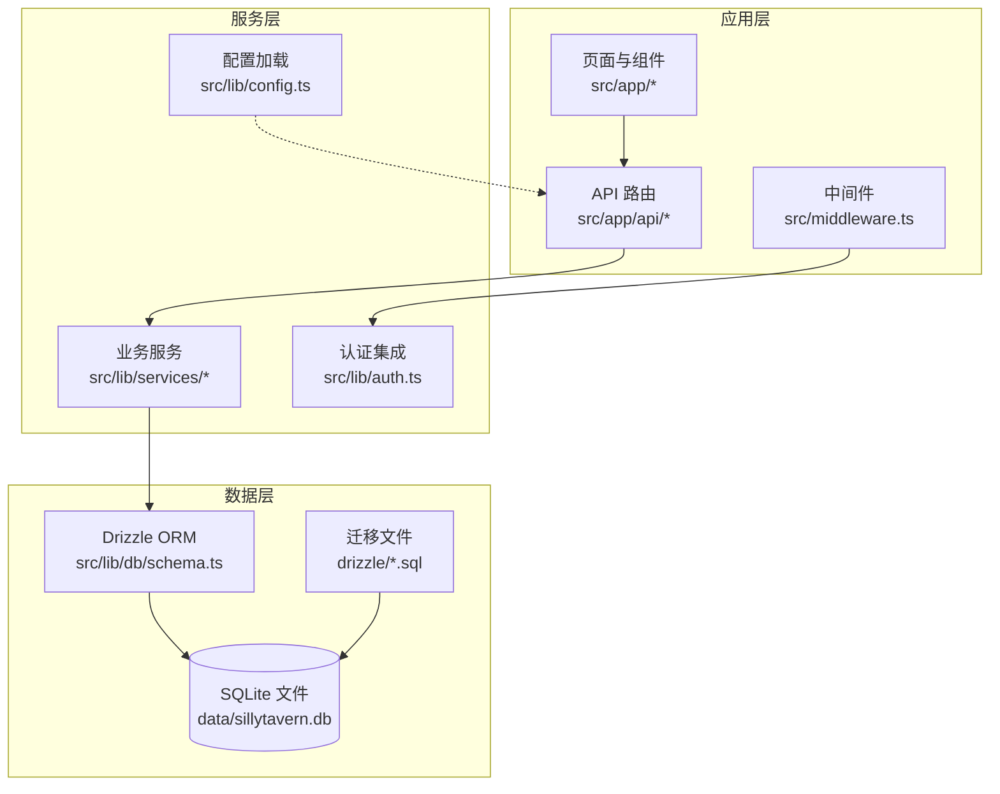
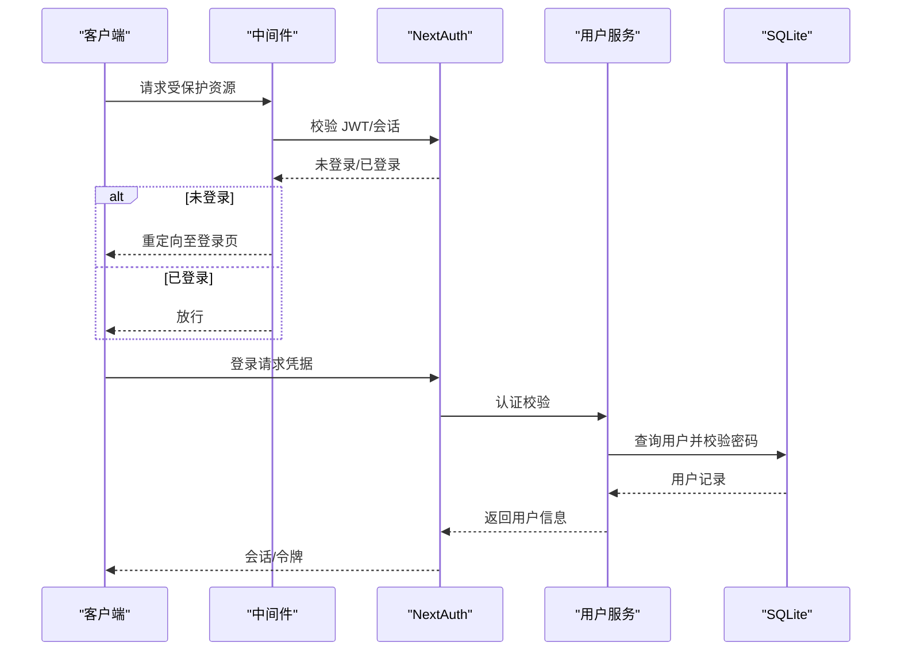
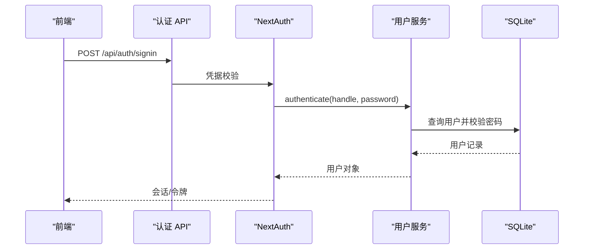
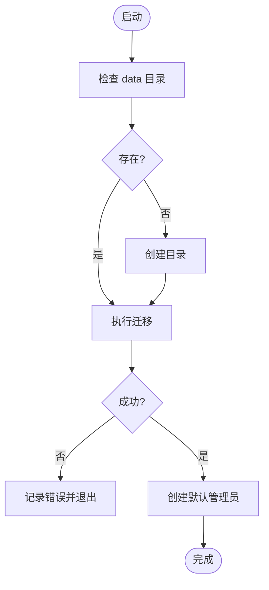
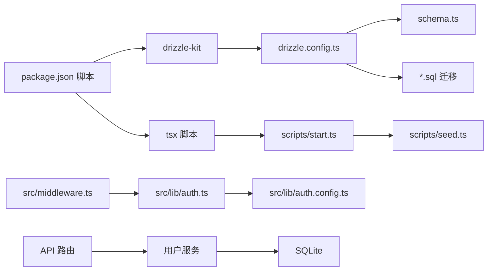

# 故障排除指南

<cite>
**本文引用的文件**
- [README.md](file://README.md)
- [package.json](file://package.json)
- [drizzle.config.ts](file://drizzle.config.ts)
- [src/lib/config.ts](file://src/lib/config.ts)
- [src/lib/auth.config.ts](file://src/lib/auth.config.ts)
- [src/lib/auth.ts](file://src/lib/auth.ts)
- [src/middleware.ts](file://src/middleware.ts)
- [src/lib/db/schema.ts](file://src/lib/db/schema.ts)
- [drizzle/0000_noisy_songbird.sql](file://drizzle/0000_noisy_songbird.sql)
- [drizzle/0001_world_info_links.sql](file://drizzle/0001_world_info_links.sql)
- [src/app/api/health/route.ts](file://src/app/api/health/route.ts)
- [src/lib/services/user-service.ts](file://src/lib/services/user-service.ts)
- [scripts/start.ts](file://scripts/start.ts)
- [scripts/seed.ts](file://scripts/seed.ts)
- [docker-compose.yml](file://docker-compose.yml)
- [Dockerfile](file://Dockerfile)
- [docker-entrypoint.sh](file://docker-entrypoint.sh)
</cite>

## 目录
1. [简介](#简介)
2. [项目结构](#项目结构)
3. [核心组件](#核心组件)
4. [架构总览](#架构总览)
5. [详细组件分析](#详细组件分析)
6. [依赖关系分析](#依赖关系分析)
7. [性能考虑](#性能考虑)
8. [故障排除指南](#故障排除指南)
9. [结论](#结论)
10. [附录](#附录)

## 简介
本指南面向 SillyTavern Next 的运维与开发者，聚焦安装部署、数据库连接、认证失败、性能问题等常见故障的诊断与解决。内容涵盖日志分析方法、错误码含义、调试技巧、系统监控与容量规划、故障恢复与数据修复流程，以及紧急处理预案。

## 项目结构
- 前端与后端统一由 Next.js App Router 管理，API 路由位于 src/app/api 下，业务逻辑与服务层位于 src/lib/services。
- 数据持久化采用 SQLite（better-sqlite3）+ Drizzle ORM，迁移文件位于 drizzle/。
- 认证采用 NextAuth v5（凭据提供者），中间件负责统一鉴权拦截。
- 配置支持 config.yaml 与环境变量覆盖，兼容原 SillyTavern 配置键。

**图表来源**
- [src/app/api/health/route.ts:1-10](file://src/app/api/health/route.ts#L1-L10)
- [src/lib/db/schema.ts:1-240](file://src/lib/db/schema.ts#L1-L240)
- [drizzle/0000_noisy_songbird.sql:1-161](file://drizzle/0000_noisy_songbird.sql#L1-L161)
- [src/lib/config.ts:1-184](file://src/lib/config.ts#L1-L184)
- [src/lib/auth.ts:1-59](file://src/lib/auth.ts#L1-L59)
- [src/middleware.ts:1-35](file://src/middleware.ts#L1-L35)

**章节来源**
- [README.md: 78-136:78-136](file://README.md#L78-L136)
- [package.json: 1-L61:1-61](file://package.json#L1-L61)
- [drizzle.config.ts: 1-L11:1-11](file://drizzle.config.ts#L1-L11)

## 核心组件
- 认证与会话
  - NextAuth v5 凭据提供者，JWT 会话策略；登录页与回调由中间件控制。
- 数据库与迁移
  - Drizzle ORM + SQLite；迁移文件与 schema 对应；默认数据库路径可由环境变量覆盖。
- 配置系统
  - 支持 config.yaml 与环境变量覆盖，键名映射规则与类型校验。
- 初始化流程
  - 脚本自动创建数据目录、执行迁移、创建默认管理员。

**章节来源**
- [src/lib/auth.config.ts: 1-L53:1-53](file://src/lib/auth.config.ts#L1-L53)
- [src/lib/auth.ts: 1-L59:1-59](file://src/lib/auth.ts#L1-L59)
- [src/middleware.ts: 1-L35:1-35](file://src/middleware.ts#L1-L35)
- [src/lib/db/schema.ts: 1-L240:1-240](file://src/lib/db/schema.ts#L1-L240)
- [drizzle.config.ts: 1-L11:1-11](file://drizzle.config.ts#L1-L11)
- [src/lib/config.ts: 1-L184:1-184](file://src/lib/config.ts#L1-L184)
- [scripts/start.ts: 1-L43:1-43](file://scripts/start.ts#L1-L43)

## 架构总览

**图表来源**
- [src/middleware.ts: 1-L35:1-35](file://src/middleware.ts#L1-L35)
- [src/lib/auth.ts: 1-L59:1-59](file://src/lib/auth.ts#L1-L59)
- [src/lib/services/user-service.ts: 1-L170:1-170](file://src/lib/services/user-service.ts#L1-L170)

## 详细组件分析

### 认证与会话（NextAuth）
- 登录流程
  - 前端提交凭据，NextAuth 调用 authorize，内部委托用户服务进行用户名/密码校验。
  - 成功后写入 JWT，回调注入用户信息到 session。
- 中间件拦截
  - 除登录页、认证 API、公开健康检查外，其余请求均需登录。
- 常见问题定位
  - 会话过期：检查 session.maxAge 与浏览器 Cookie。
  - 登录失败：确认凭据、用户是否启用、密码哈希是否正确。
  - 回调异常：检查 JWT/session 回调中字段映射。

**图表来源**
- [src/lib/auth.ts: 1-L59:1-59](file://src/lib/auth.ts#L1-L59)
- [src/lib/services/user-service.ts: 1-L170:1-170](file://src/lib/services/user-service.ts#L1-L170)
- [src/lib/auth.config.ts: 1-L53:1-53](file://src/lib/auth.config.ts#L1-L53)

**章节来源**
- [src/lib/auth.ts: 1-L59:1-59](file://src/lib/auth.ts#L1-L59)
- [src/lib/auth.config.ts: 1-L53:1-53](file://src/lib/auth.config.ts#L1-L53)
- [src/middleware.ts: 1-L35:1-35](file://src/middleware.ts#L1-L35)

### 数据库与迁移（Drizzle + SQLite）
- schema 定义
  - 包含用户、角色、群组、聊天、消息、世界书、预设、密钥、设置、模板等表。
- 迁移文件
  - 初始建表与后续扩展（如角色表新增字段）。
- 默认路径与覆盖
  - 默认 DATABASE_URL=./data/sillytavern.db，可通过环境变量覆盖。
- 常见问题定位
  - 迁移失败：检查 Drizzle CLI 权限、SQLite 文件权限、路径是否存在。
  - 连接异常：确认 data 目录存在且可写，容器挂载卷正确。

**图表来源**
- [scripts/start.ts: 1-L43:1-43](file://scripts/start.ts#L1-L43)
- [scripts/seed.ts: 1-L28:1-28](file://scripts/seed.ts#L1-L28)
- [drizzle.config.ts: 1-L11:1-11](file://drizzle.config.ts#L1-L11)
- [drizzle/0000_noisy_songbird.sql: 1-L161:1-161](file://drizzle/0000_noisy_songbird.sql#L1-L161)
- [drizzle/0001_world_info_links.sql: 1-L3:1-3](file://drizzle/0001_world_info_links.sql#L1-L3)

**章节来源**
- [src/lib/db/schema.ts: 1-L240:1-240](file://src/lib/db/schema.ts#L1-L240)
- [drizzle/0000_noisy_songbird.sql: 1-L161:1-161](file://drizzle/0000_noisy_songbird.sql#L1-L161)
- [drizzle/0001_world_info_links.sql: 1-L3:1-3](file://drizzle/0001_world_info_links.sql#L1-L3)
- [drizzle.config.ts: 1-L11:1-11](file://drizzle.config.ts#L1-L11)
- [scripts/start.ts: 1-L43:1-43](file://scripts/start.ts#L1-L43)
- [scripts/seed.ts: 1-L28:1-28](file://scripts/seed.ts#L1-L28)

### 配置系统（config.yaml 与环境变量）
- 键名映射
  - 将点分路径键转换为大写并加前缀的环境变量名。
- 覆盖顺序
  - 读取 config.yaml -> 应用环境变量覆盖 -> Zod 校验与默认值填充。
- 常见问题定位
  - 配置未生效：检查 CONFIG_PATH、环境变量名是否正确、值类型是否匹配。
  - 解析错误：查看控制台输出的验证错误。

**章节来源**
- [src/lib/config.ts: 1-L184:1-184](file://src/lib/config.ts#L1-L184)

### 健康检查端点
- 无需鉴权，返回服务状态与时间戳，便于容器编排与监控系统探测。
- 常见问题定位
  - 401/403：确认中间件未拦截该路径（公开端点）。
  - 5xx：检查应用启动日志与数据库连接。

**章节来源**
- [src/app/api/health/route.ts: 1-L10:1-10](file://src/app/api/health/route.ts#L1-L10)
- [src/middleware.ts: 1-L35:1-35](file://src/middleware.ts#L1-L35)

## 依赖关系分析

**图表来源**
- [package.json: 1-L61:1-61](file://package.json#L1-L61)
- [drizzle.config.ts: 1-L11:1-11](file://drizzle.config.ts#L1-L11)
- [src/lib/db/schema.ts:1-240](file://src/lib/db/schema.ts#L1-L240)
- [scripts/start.ts: 1-L43:1-43](file://scripts/start.ts#L1-L43)
- [scripts/seed.ts: 1-L28:1-28](file://scripts/seed.ts#L1-L28)
- [src/lib/auth.ts: 1-L59:1-59](file://src/lib/auth.ts#L1-L59)
- [src/lib/auth.config.ts: 1-L53:1-53](file://src/lib/auth.config.ts#L1-L53)
- [src/middleware.ts: 1-L35:1-35](file://src/middleware.ts#L1-L35)

**章节来源**
- [package.json: 1-L61:1-61](file://package.json#L1-L61)
- [drizzle.config.ts: 1-L11:1-11](file://drizzle.config.ts#L1-L11)

## 性能考虑
- 数据库
  - SQLite 适合单机与中小规模数据；高并发写入场景建议评估 WAL 模式与锁竞争。
  - 合理索引与查询条件，避免全表扫描。
- 认证
  - JWT 会话减少数据库查询；注意会话有效期与刷新策略。
- 部署
  - Docker 部署需持久化 data 目录，避免频繁重建容器导致数据丢失。
  - 反向代理提供 HTTPS 与连接复用，提升用户体验。

[本节为通用指导，无需特定文件引用]

## 故障排除指南

### 一、安装部署问题
- 症状
  - 启动后无法访问、白屏或 500。
- 排查步骤
  - 确认环境变量（尤其是 AUTH_SECRET、DATABASE_URL）已正确设置。
  - 检查 data 目录是否存在且可写；容器需挂载 ./data:/app/data。
  - 执行一键初始化：npm run setup 或容器入口脚本。
  - 查看容器日志与应用启动日志，定位迁移或种子脚本错误。
- 解决方案
  - 重新生成强随机 AUTH_SECRET 并写入 .env。
  - 手动创建 data 目录并赋予写权限。
  - 使用 npm run start:fresh 清空数据库后重新初始化。
- 预防措施
  - 生产环境使用反向代理提供 HTTPS。
  - 首次登录后立即修改默认管理员密码。

**章节来源**
- [README.md: 20-74:20-74](file://README.md#L20-L74)
- [scripts/start.ts: 1-L43:1-43](file://scripts/start.ts#L1-L43)
- [scripts/seed.ts: 1-L28:1-28](file://scripts/seed.ts#L1-L28)
- [docker-compose.yml](file://docker-compose.yml)
- [Dockerfile](file://Dockerfile)
- [docker-entrypoint.sh](file://docker-entrypoint.sh)

### 二、数据库连接问题
- 症状
  - 迁移失败、启动时报错、无法读写数据。
- 排查步骤
  - 检查 DATABASE_URL 是否指向正确的 SQLite 文件路径。
  - 确认 data 目录存在且进程有读写权限。
  - 使用 npx drizzle-kit migrate 手动执行迁移，观察错误信息。
  - 核对 schema 与迁移文件是否一致。
- 解决方案
  - 修正 DATABASE_URL 或移动数据库文件到可访问路径。
  - 修复文件权限或容器挂载卷映射。
  - 如需重置，使用 npm run start:fresh 清空数据库后重新初始化。
- 预防措施
  - 定期备份 data/sillytavern.db。
  - 在 CI/CD 中加入健康检查与迁移验证。

**章节来源**
- [drizzle.config.ts: 1-L11:1-11](file://drizzle.config.ts#L1-L11)
- [drizzle/0000_noisy_songbird.sql: 1-L161:1-161](file://drizzle/0000_noisy_songbird.sql#L1-L161)
- [drizzle/0001_world_info_links.sql: 1-L3:1-3](file://drizzle/0001_world_info_links.sql#L1-L3)
- [src/lib/db/schema.ts: 1-L240:1-240](file://src/lib/db/schema.ts#L1-L240)

### 三、认证失败
- 症状
  - 登录 401、会话无效、重定向循环。
- 排查步骤
  - 检查登录凭据是否正确，用户是否启用。
  - 查看 NextAuth 日志与回调映射（JWT/session）。
  - 确认中间件未拦截 /api/auth 与 /login。
  - 验证 AUTH_SECRET 是否强随机且与部署环境一致。
- 解决方案
  - 重置密码或联系管理员。
  - 修复 AUTH_SECRET 并重启服务。
  - 检查浏览器 Cookie 与跨域设置。
- 预防措施
  - 强制修改默认管理员密码。
  - 生产环境开启 HTTPS 并正确配置 AUTH_URL。

**章节来源**
- [src/lib/auth.ts: 1-L59:1-59](file://src/lib/auth.ts#L1-L59)
- [src/lib/auth.config.ts: 1-L53:1-53](file://src/lib/auth.config.ts#L1-L53)
- [src/middleware.ts: 1-L35:1-35](file://src/middleware.ts#L1-L35)
- [README.md: 62-74:62-74](file://README.md#L62-L74)

### 四、性能问题
- 症状
  - 页面加载慢、生成响应慢、数据库锁等待。
- 排查步骤
  - 使用健康检查端点 /api/health 确认服务可用。
  - 分析生成耗时字段（消息表中的生成时间戳）。
  - 检查并发与数据库事务数量。
- 解决方案
  - 优化查询与索引，减少不必要的 JOIN。
  - 限制并发写入，使用批量操作。
  - 考虑升级硬件或拆分数据库。
- 预防措施
  - 建立容量规划与监控告警。

**章节来源**
- [src/app/api/health/route.ts: 1-L10:1-10](file://src/app/api/health/route.ts#L1-L10)
- [src/lib/db/schema.ts: 145-L168:145-168](file://src/lib/db/schema.ts#L145-L168)

### 五、日志分析与错误码
- 日志来源
  - 应用启动日志、容器日志、迁移与种子脚本输出。
- 常见错误与含义
  - 迁移失败：通常为权限不足或路径错误。
  - 认证失败：凭据错误、用户禁用、AUTH_SECRET 不一致。
  - 数据库不可写：data 目录权限或挂载卷问题。
- 调试技巧
  - 临时开启更详细的日志级别（如开发模式）。
  - 使用健康检查端点快速判断服务状态。
  - 逐步回滚最近变更（配置、迁移、镜像版本）。

**章节来源**
- [scripts/start.ts: 1-L43:1-43](file://scripts/start.ts#L1-L43)
- [scripts/seed.ts: 1-L28:1-28](file://scripts/seed.ts#L1-L28)
- [src/app/api/health/route.ts: 1-L10:1-10](file://src/app/api/health/route.ts#L1-L10)

### 六、系统监控与容量规划
- 监控指标
  - 健康检查状态、响应时间、数据库连接数、磁盘空间。
- 告警阈值
  - 健康检查连续失败、响应时间超阈、磁盘使用率过高。
- 容量规划
  - 估算用户数、消息量、数据库大小增长趋势，预留 20%-30% 空余。

**章节来源**
- [src/app/api/health/route.ts: 1-L10:1-10](file://src/app/api/health/route.ts#L1-L10)
- [README.md: 150-156:150-156](file://README.md#L150-L156)

### 七、故障恢复与数据修复
- 故障恢复流程
  - 快速定位：查看健康检查与应用日志。
  - 降级：停止写入高峰，启用只读模式。
  - 修复：修正配置/权限/迁移，重启服务。
  - 验证：确认登录、读写、迁移正常。
- 数据修复
  - 备份优先：定期导出数据库文件。
  - 恢复：停止服务，替换数据库文件，启动服务。
  - 验证：检查用户、聊天、消息完整性。
- 紧急预案
  - 切换备用节点、回滚镜像版本、通知用户维护窗口。

**章节来源**
- [scripts/start.ts: 1-L43:1-43](file://scripts/start.ts#L1-L43)
- [scripts/seed.ts: 1-L28:1-28](file://scripts/seed.ts#L1-L28)
- [README.md: 150-156:150-156](file://README.md#L150-L156)

## 结论
通过规范的环境变量配置、完善的数据库迁移与初始化流程、严格的认证与会话策略，以及持续的日志与监控，SillyTavern Next 可稳定运行于单机或容器环境中。遇到问题时，遵循本指南的诊断步骤与恢复流程，可快速定位并解决问题，保障服务可用性与数据安全。

## 附录
- 常用命令
  - 开发：npm run dev
  - 构建：npm run build
  - 启动：npm run start
  - 初始化：npm run setup
  - 清空后初始化：npm run start:fresh
  - 迁移：npm run db:migrate
  - 生成迁移：npm run db:generate
  - 种子数据：npm run db:seed
- 环境变量
  - AUTH_SECRET、AUTH_URL、DATABASE_URL、PORT 等。

**章节来源**
- [README.md: 123-136:123-136](file://README.md#L123-L136)
- [README.md: 62-74:62-74](file://README.md#L62-L74)