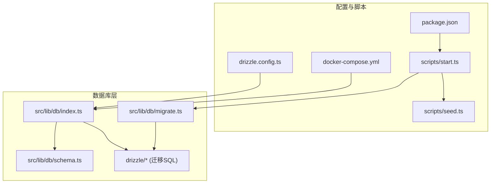
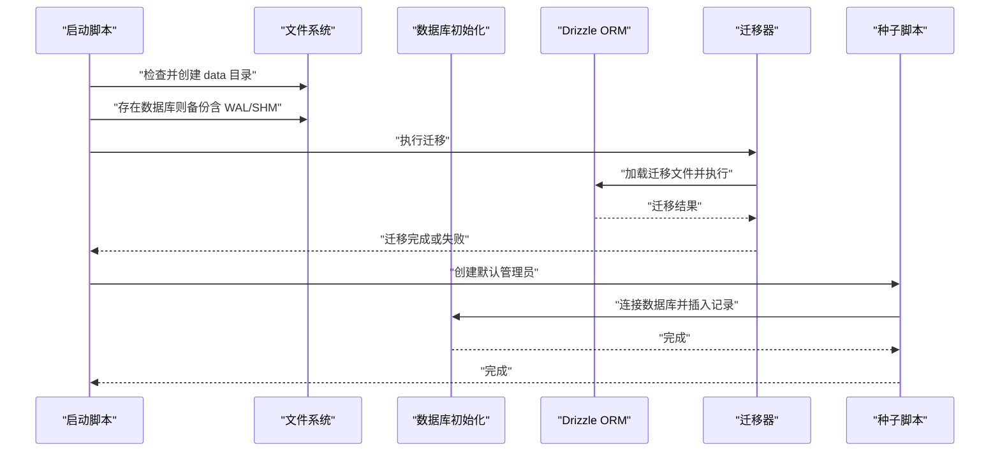
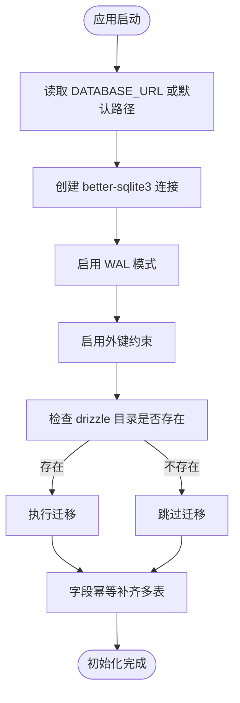
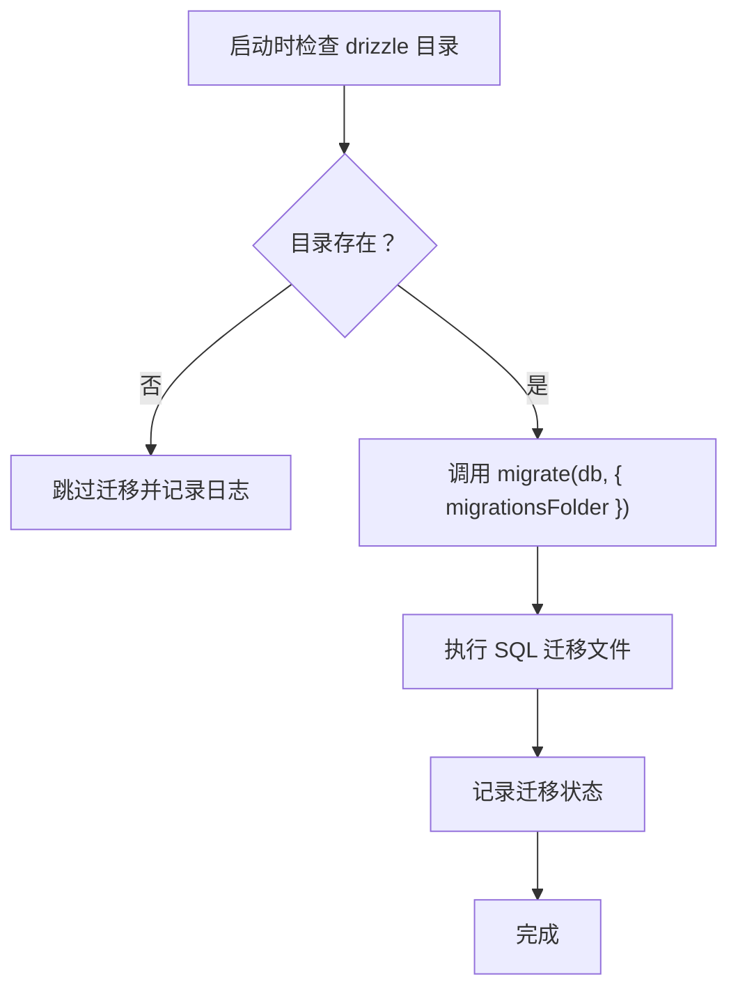
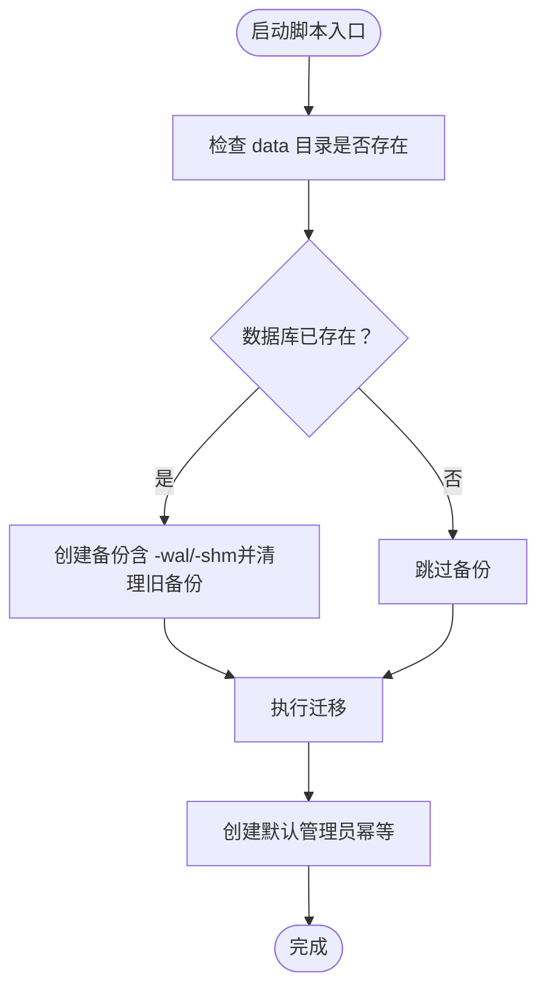
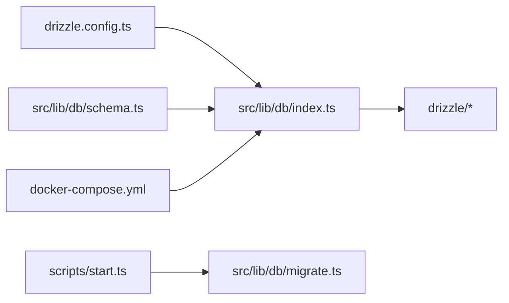

# 数据库连接问题

<cite>
**本文引用的文件**
- [drizzle.config.ts](file://drizzle.config.ts)
- [src/lib/db/index.ts](file://src/lib/db/index.ts)
- [src/lib/db/schema.ts](file://src/lib/db/schema.ts)
- [src/lib/db/migrate.ts](file://src/lib/db/migrate.ts)
- [drizzle/0000_noisy_songbird.sql](file://drizzle/0000_noisy_songbird.sql)
- [drizzle/0001_world_info_links.sql](file://drizzle/0001_world_info_links.sql)
- [drizzle/0002_textgen_preset.sql](file://drizzle/0002_textgen_preset.sql)
- [scripts/start.ts](file://scripts/start.ts)
- [scripts/seed.ts](file://scripts/seed.ts)
- [package.json](file://package.json)
- [docker-compose.yml](file://docker-compose.yml)
</cite>

## 目录
1. [简介](#简介)
2. [项目结构](#项目结构)
3. [核心组件](#核心组件)
4. [架构总览](#架构总览)
5. [详细组件分析](#详细组件分析)
6. [依赖关系分析](#依赖关系分析)
7. [性能考虑](#性能考虑)
8. [故障排查指南](#故障排查指南)
9. [结论](#结论)
10. [附录](#附录)

## 简介
本指南聚焦于 SillyTavern Next 的数据库连接问题排查与修复，涵盖 SQLite 连接失败、迁移脚本执行错误、表结构不匹配、数据损坏等常见问题，并提供数据库权限配置、连接池设置、事务处理异常的解决方案。同时给出数据库备份恢复、数据迁移与性能优化的最佳实践，帮助运维与开发者快速定位并解决问题。

## 项目结构
SillyTavern Next 使用 Drizzle ORM + better-sqlite3 实现 SQLite 数据库访问，采用“代码优先”的 Schema 定义与迁移机制。关键文件与职责如下：
- 配置层：drizzle.config.ts 定义迁移输出目录、方言与数据库路径来源（环境变量 DATABASE_URL 或默认 data/sillytavern.db）
- 初始化层：src/lib/db/index.ts 负责创建 SQLite 连接、启用 WAL 与外键约束、执行自动迁移与字段幂等补齐
- Schema 层：src/lib/db/schema.ts 定义所有表结构与字段类型
- 迁移层：drizzle 目录下的 SQL 迁移文件，描述版本演进
- 启动脚本：scripts/start.ts 负责自动备份、执行迁移、创建默认管理员
- 种子脚本：scripts/seed.ts 创建默认管理员账户
- 构建与脚本：package.json 提供数据库相关命令
- 容器编排：docker-compose.yml 将 data 目录挂载到容器内，确保 SQLite 文件持久化

图表来源
- [drizzle.config.ts:1-11](file://drizzle.config.ts#L1-L11)
- [src/lib/db/index.ts:1-134](file://src/lib/db/index.ts#L1-L134)
- [src/lib/db/schema.ts:1-240](file://src/lib/db/schema.ts#L1-L240)
- [src/lib/db/migrate.ts:1-34](file://src/lib/db/migrate.ts#L1-L34)
- [drizzle/0000_noisy_songbird.sql:1-161](file://drizzle/0000_noisy_songbird.sql#L1-L161)
- [scripts/start.ts:1-96](file://scripts/start.ts#L1-L96)
- [scripts/seed.ts:1-28](file://scripts/seed.ts#L1-L28)
- [package.json:1-61](file://package.json#L1-L61)
- [docker-compose.yml:1-37](file://docker-compose.yml#L1-L37)

章节来源
- [drizzle.config.ts:1-11](file://drizzle.config.ts#L1-L11)
- [src/lib/db/index.ts:1-134](file://src/lib/db/index.ts#L1-L134)
- [src/lib/db/schema.ts:1-240](file://src/lib/db/schema.ts#L1-L240)
- [src/lib/db/migrate.ts:1-34](file://src/lib/db/migrate.ts#L1-L34)
- [drizzle/0000_noisy_songbird.sql:1-161](file://drizzle/0000_noisy_songbird.sql#L1-L161)
- [drizzle/0001_world_info_links.sql:1-3](file://drizzle/0001_world_info_links.sql#L1-L3)
- [drizzle/0002_textgen_preset.sql:1-5](file://drizzle/0002_textgen_preset.sql#L1-L5)
- [scripts/start.ts:1-96](file://scripts/start.ts#L1-L96)
- [scripts/seed.ts:1-28](file://scripts/seed.ts#L1-L28)
- [package.json:1-61](file://package.json#L1-L61)
- [docker-compose.yml:1-37](file://docker-compose.yml#L1-L37)

## 核心组件
- 数据库连接与初始化
  - 通过 better-sqlite3 创建连接，设置 WAL 模式与外键约束，导出 drizzle 实例
  - 自动迁移：读取 drizzle 目录下的迁移文件并执行
  - 字段幂等补齐：对核心表进行列缺失检测与补充，避免迁移文件滞后导致的 500 错误
- Schema 定义
  - 使用 drizzle-orm 的 sqliteTable 定义各表字段、主键、外键与默认值
- 迁移管理
  - 提供独立的 runMigrations 与关闭连接函数，便于在应用生命周期中控制
- 启动流程
  - 自动备份现有数据库（含 WAL/SHM），执行迁移，创建默认管理员

章节来源
- [src/lib/db/index.ts:1-134](file://src/lib/db/index.ts#L1-L134)
- [src/lib/db/schema.ts:1-240](file://src/lib/db/schema.ts#L1-L240)
- [src/lib/db/migrate.ts:1-34](file://src/lib/db/migrate.ts#L1-L34)
- [scripts/start.ts:1-96](file://scripts/start.ts#L1-L96)

## 架构总览
下图展示从应用启动到数据库连接、迁移与初始化的整体流程：

图表来源
- [scripts/start.ts:1-96](file://scripts/start.ts#L1-L96)
- [src/lib/db/index.ts:1-134](file://src/lib/db/index.ts#L1-L134)
- [src/lib/db/migrate.ts:1-34](file://src/lib/db/migrate.ts#L1-L34)
- [scripts/seed.ts:1-28](file://scripts/seed.ts#L1-L28)

## 详细组件分析

### 数据库连接与初始化
- 连接建立
  - 依据环境变量 DATABASE_URL 决定数据库路径；若未设置，则默认在项目根目录 data/sillytavern.db
  - 使用 better-sqlite3 打开连接，启用 WAL 模式与外键约束，提升并发写入与数据一致性
- 自动迁移
  - 若 drizzle 目录存在，调用 migrate(db, { migrationsFolder }) 执行迁移
  - 迁移失败会记录错误并抛出异常，便于上层捕获与处理
- 字段幂等补齐
  - 启动时对 characters、presets、messages、personas、groups 等核心表进行列缺失检测与补充
  - 该机制可缓解迁移文件未及时更新导致的列缺失问题，降低 500 错误概率

图表来源
- [src/lib/db/index.ts:1-134](file://src/lib/db/index.ts#L1-L134)

章节来源
- [src/lib/db/index.ts:1-134](file://src/lib/db/index.ts#L1-L134)
- [drizzle.config.ts:1-11](file://drizzle.config.ts#L1-L11)

### 迁移脚本与版本演进
- 迁移文件组织
  - drizzle 目录包含按顺序命名的 SQL 文件，描述数据库结构演进
  - 示例：0000_noisy_songbird.sql 定义初始表结构；0001_world_info_links.sql 与 0002_textgen_preset.sql 为后续增量变更
- 迁移执行
  - runMigrations 读取 drizzle 目录并调用 migrate(db, { migrationsFolder })
  - 若迁移目录不存在，记录日志并跳过
- 版本控制
  - Drizzle 会在数据库中维护迁移状态，重复执行不会重复迁移

图表来源
- [src/lib/db/migrate.ts:1-34](file://src/lib/db/migrate.ts#L1-L34)
- [drizzle/0000_noisy_songbird.sql:1-161](file://drizzle/0000_noisy_songbird.sql#L1-L161)
- [drizzle/0001_world_info_links.sql:1-3](file://drizzle/0001_world_info_links.sql#L1-L3)
- [drizzle/0002_textgen_preset.sql:1-5](file://drizzle/0002_textgen_preset.sql#L1-L5)

章节来源
- [src/lib/db/migrate.ts:1-34](file://src/lib/db/migrate.ts#L1-L34)
- [drizzle/0000_noisy_songbird.sql:1-161](file://drizzle/0000_noisy_songbird.sql#L1-L161)
- [drizzle/0001_world_info_links.sql:1-3](file://drizzle/0001_world_info_links.sql#L1-L3)
- [drizzle/0002_textgen_preset.sql:1-5](file://drizzle/0002_textgen_preset.sql#L1-L5)

### 启动脚本与备份恢复
- 自动备份策略
  - 若数据库已存在，启动前自动创建备份文件（含 -wal 与 -shm）
  - 仅保留最近 N 份备份，其余自动清理
- 迁移与种子
  - 成功执行迁移后，创建默认管理员账户（幂等）
- 回滚指引
  - 当迁移失败时，脚本会打印回滚命令示例，提示复制备份文件与 WAL/SHM 文件回滚

图表来源
- [scripts/start.ts:1-96](file://scripts/start.ts#L1-L96)

章节来源
- [scripts/start.ts:1-96](file://scripts/start.ts#L1-L96)

### 种子脚本与默认管理员
- 功能
  - 若管理员不存在，生成随机盐与派生密码，插入默认管理员记录
- 幂等性
  - 已存在则直接退出，避免重复创建

章节来源
- [scripts/seed.ts:1-28](file://scripts/seed.ts#L1-L28)

## 依赖关系分析
- 外部依赖
  - better-sqlite3：SQLite 引擎
  - drizzle-orm + drizzle-kit：ORM 与迁移工具
- 内部依赖
  - drizzle.config.ts -> src/lib/db/index.ts：配置决定数据库路径
  - src/lib/db/index.ts -> src/lib/db/schema.ts：Schema 定义驱动 ORM
  - src/lib/db/index.ts -> drizzle 目录：迁移文件驱动数据库演进
  - scripts/start.ts -> src/lib/db/migrate.ts：启动时触发迁移
  - docker-compose.yml -> src/lib/db/index.ts：容器挂载 data 目录，保证 SQLite 文件持久化

图表来源
- [drizzle.config.ts:1-11](file://drizzle.config.ts#L1-L11)
- [src/lib/db/index.ts:1-134](file://src/lib/db/index.ts#L1-L134)
- [src/lib/db/schema.ts:1-240](file://src/lib/db/schema.ts#L1-L240)
- [src/lib/db/migrate.ts:1-34](file://src/lib/db/migrate.ts#L1-L34)
- [scripts/start.ts:1-96](file://scripts/start.ts#L1-L96)
- [docker-compose.yml:1-37](file://docker-compose.yml#L1-L37)

章节来源
- [drizzle.config.ts:1-11](file://drizzle.config.ts#L1-L11)
- [src/lib/db/index.ts:1-134](file://src/lib/db/index.ts#L1-L134)
- [src/lib/db/schema.ts:1-240](file://src/lib/db/schema.ts#L1-L240)
- [src/lib/db/migrate.ts:1-34](file://src/lib/db/migrate.ts#L1-L34)
- [scripts/start.ts:1-96](file://scripts/start.ts#L1-L96)
- [docker-compose.yml:1-37](file://docker-compose.yml#L1-L37)

## 性能考虑
- WAL 模式
  - 启用 WAL 模式可显著提升并发写入性能与读写分离能力，减少锁竞争
- 外键约束
  - 开启外键约束有助于保持数据一致性，但可能影响部分写入性能；可根据业务权衡
- 迁移与幂等补齐
  - 启动时的字段补齐可避免因迁移滞后导致的查询失败，减少运行期异常
- 连接管理
  - better-sqlite3 为单进程同步接口，适合单实例部署；如需高并发，建议评估分片或外部数据库方案

## 故障排查指南

### 1. SQLite 数据库连接失败
- 症状
  - 应用启动时报错，无法打开数据库或迁移失败
- 排查步骤
  - 检查 DATABASE_URL 是否正确指向数据库文件路径
  - 确认 data 目录存在且具备读写权限
  - 在容器环境中确认 /app/data 已正确挂载
- 解决方案
  - 设置正确的 DATABASE_URL（例如 /app/data/sillytavern.db）
  - 确保 data 目录权限允许 Node.js 进程读写
  - 容器部署时检查 docker-compose.yml 的卷映射

章节来源
- [drizzle.config.ts:1-11](file://drizzle.config.ts#L1-L11)
- [src/lib/db/index.ts:1-134](file://src/lib/db/index.ts#L1-L134)
- [docker-compose.yml:1-37](file://docker-compose.yml#L1-L37)

### 2. 迁移脚本执行错误
- 症状
  - 迁移报错，应用无法启动或功能异常
- 排查步骤
  - 查看迁移目录 drizzle 是否存在且包含合法 SQL 文件
  - 检查迁移文件是否与当前 Schema 存在冲突
  - 查看启动脚本输出，确认是否执行了自动备份
- 解决方案
  - 使用启动脚本提供的回滚命令将数据库与 WAL/SHM 文件回滚到备份
  - 修正迁移文件或调整 Schema，确保与迁移文件一致
  - 重新执行迁移并验证

章节来源
- [src/lib/db/migrate.ts:1-34](file://src/lib/db/migrate.ts#L1-L34)
- [scripts/start.ts:1-96](file://scripts/start.ts#L1-L96)

### 3. 表结构不匹配
- 症状
  - 查询时报列不存在或类型不匹配
- 排查步骤
  - 启动时会自动进行字段幂等补齐，检查日志中是否有相关补列记录
  - 对比 schema.ts 与实际表结构（PRAGMA table_info）
- 解决方案
  - 确保迁移文件覆盖所有新增列
  - 如迁移滞后，依赖启动时的幂等补齐逻辑

章节来源
- [src/lib/db/index.ts:1-134](file://src/lib/db/index.ts#L1-L134)
- [src/lib/db/schema.ts:1-240](file://src/lib/db/schema.ts#L1-L240)

### 4. 数据损坏
- 症状
  - 数据库文件损坏、WAL/SHM 不一致
- 排查步骤
  - 检查 data/backups 目录中的备份文件
  - 确认 -wal 与 -shm 文件是否完整
- 解决方案
  - 使用启动脚本输出的回滚命令恢复数据库与 WAL/SHM
  - 恢复后重新执行迁移

章节来源
- [scripts/start.ts:1-96](file://scripts/start.ts#L1-L96)

### 5. 数据库权限配置
- 建议
  - 确保运行用户对 data 目录具有读写权限
  - 容器部署时，确认卷映射的宿主机目录权限正确
  - 避免使用 root 权限运行应用，降低安全风险

章节来源
- [docker-compose.yml:1-37](file://docker-compose.yml#L1-L37)

### 6. 连接池设置
- 说明
  - better-sqlite3 为单连接同步接口，不支持传统意义上的连接池
  - 建议通过应用层面的并发控制与 WAL 模式来提升并发性能

章节来源
- [src/lib/db/index.ts:1-134](file://src/lib/db/index.ts#L1-L134)

### 7. 事务处理异常
- 建议
  - 使用 Drizzle 的事务 API 包裹复杂写入操作
  - 在容器或高并发场景下，结合 WAL 模式与合理的写入策略

章节来源
- [src/lib/db/index.ts:1-134](file://src/lib/db/index.ts#L1-L134)

### 8. 备份恢复最佳实践
- 建议
  - 启动前自动备份（含 -wal/-shm），仅保留最近 N 份
  - 迁移失败时按脚本提示执行回滚
  - 生产环境定期手动备份重要数据

章节来源
- [scripts/start.ts:1-96](file://scripts/start.ts#L1-L96)

### 9. 数据迁移最佳实践
- 建议
  - 迁移文件应与 schema.ts 保持同步
  - 新增列时先在迁移文件中添加，再在 schema.ts 中定义
  - 使用幂等补齐作为兜底，避免线上 500

章节来源
- [src/lib/db/schema.ts:1-240](file://src/lib/db/schema.ts#L1-L240)
- [src/lib/db/index.ts:1-134](file://src/lib/db/index.ts#L1-L134)

### 10. 性能优化最佳实践
- 建议
  - 启用 WAL 模式与外键约束
  - 控制单实例并发写入，必要时考虑外部数据库或分片
  - 定期清理旧备份，避免磁盘空间不足

章节来源
- [src/lib/db/index.ts:1-134](file://src/lib/db/index.ts#L1-L134)
- [scripts/start.ts:1-96](file://scripts/start.ts#L1-L96)

## 结论
SillyTavern Next 的数据库层以 better-sqlite3 与 Drizzle ORM 为核心，配合自动迁移与幂等补齐机制，提供了较为稳健的数据访问与演进能力。针对连接失败、迁移错误、表结构不匹配与数据损坏等问题，建议从环境变量、权限、备份恢复与迁移文件一致性等方面入手排查，并遵循 WAL 模式、外键约束与幂等补齐等最佳实践，确保系统稳定运行。

## 附录
- 常用命令
  - 数据库生成迁移：npm run db:generate
  - 执行迁移：npm run db:migrate
  - 初始化/升级：npm run setup
  - 重置并全新初始化：npm run start:fresh

章节来源
- [package.json:1-61](file://package.json#L1-L61)