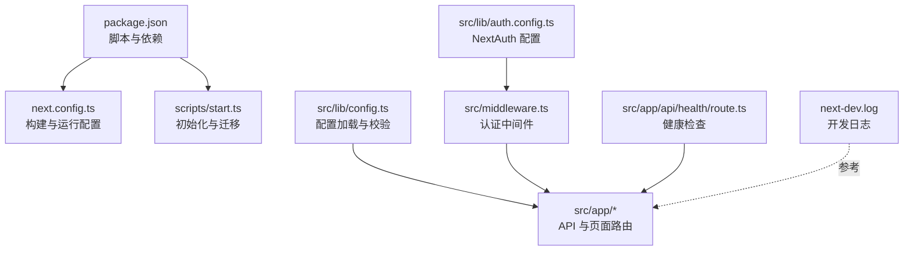
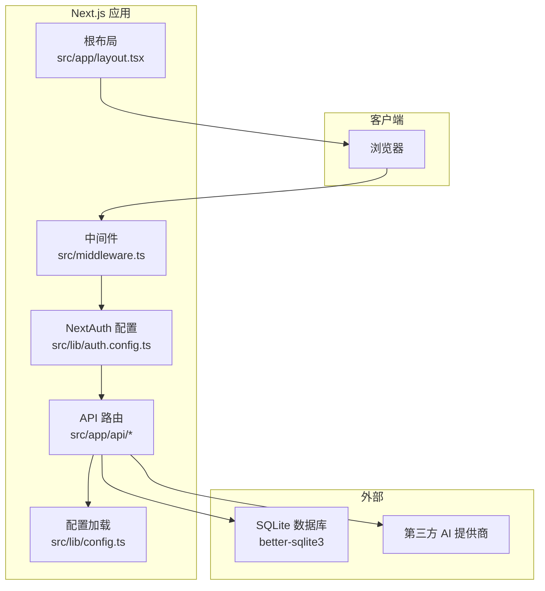
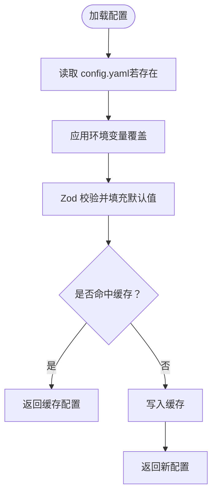
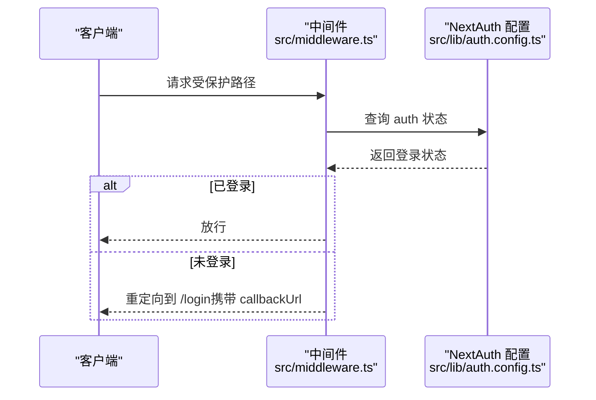
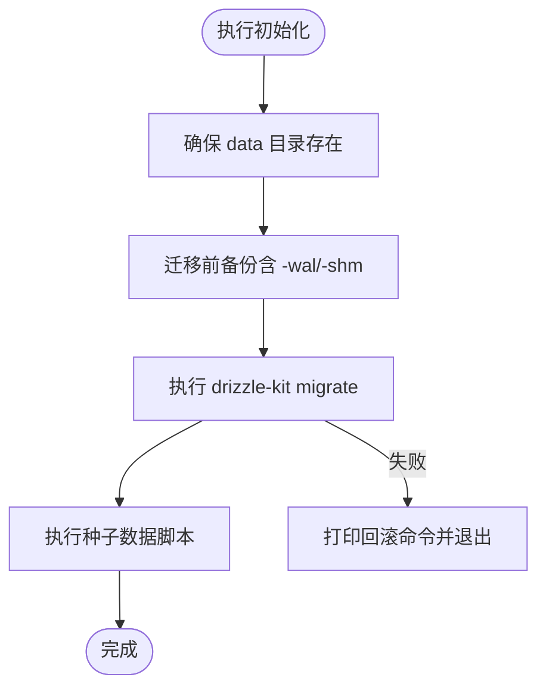
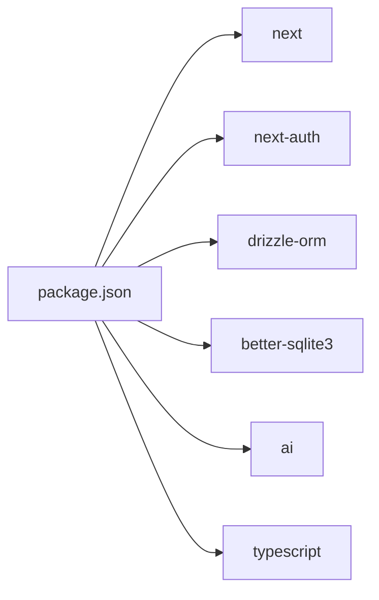

# 日志分析与调试

<cite>
**本文引用的文件**
- [package.json](file://package.json)
- [next.config.ts](file://next.config.ts)
- [scripts/start.ts](file://scripts/start.ts)
- [src/lib/config.ts](file://src/lib/config.ts)
- [src/middleware.ts](file://src/middleware.ts)
- [src/lib/auth.config.ts](file://src/lib/auth.config.ts)
- [src/app/api/health/route.ts](file://src/app/api/health/route.ts)
- [src/app/layout.tsx](file://src/app/layout.tsx)
- [next-dev.log](file://next-dev.log)
- [CONTRIBUTING.md](file://CONTRIBUTING.md)
</cite>

## 目录
1. [简介](#简介)
2. [项目结构](#项目结构)
3. [核心组件](#核心组件)
4. [架构总览](#架构总览)
5. [详细组件分析](#详细组件分析)
6. [依赖分析](#依赖分析)
7. [性能考虑](#性能考虑)
8. [故障排查指南](#故障排查指南)
9. [结论](#结论)
10. [附录](#附录)

## 简介
本指南面向 SillyTavern Next 的开发者与运维人员，提供系统化的日志分析与调试方法，覆盖以下主题：
- 启用调试模式与配置日志级别
- 分析错误堆栈与常见错误模式识别
- 浏览器开发者工具与 Node.js 调试器使用
- Docker 容器日志查看与生产环境调试策略
- 性能瓶颈定位与内存泄漏检测技巧
- 开发与生产环境调试差异与最佳实践

## 项目结构
SillyTavern Next 是基于 Next.js 的应用，采用 App Router 结构，核心目录与职责概览如下：
- scripts：启动与初始化脚本，负责数据库迁移、备份与种子数据创建
- src/lib：服务层与配置加载、认证配置等
- src/app：路由与 API 端点，包含健康检查、认证、聊天、预设、世界设定等
- src/components：按功能模块划分的 UI 组件
- next.config.ts：Next.js 构建与运行配置
- package.json：脚本与依赖管理
- next-dev.log：开发服务器日志示例

图表来源
- [package.json:1-61](file://package.json#L1-L61)
- [next.config.ts:1-14](file://next.config.ts#L1-L14)
- [scripts/start.ts:1-96](file://scripts/start.ts#L1-L96)
- [src/lib/config.ts:1-184](file://src/lib/config.ts#L1-L184)
- [src/middleware.ts:1-35](file://src/middleware.ts#L1-L35)
- [src/lib/auth.config.ts:1-53](file://src/lib/auth.config.ts#L1-L53)
- [src/app/api/health/route.ts:1-9](file://src/app/api/health/route.ts#L1-L9)
- [next-dev.log:1-18](file://next-dev.log#L1-L18)

章节来源
- [package.json:1-61](file://package.json#L1-L61)
- [next.config.ts:1-14](file://next.config.ts#L1-L14)
- [scripts/start.ts:1-96](file://scripts/start.ts#L1-L96)
- [src/lib/config.ts:1-184](file://src/lib/config.ts#L1-L184)
- [src/middleware.ts:1-35](file://src/middleware.ts#L1-L35)
- [src/lib/auth.config.ts:1-53](file://src/lib/auth.config.ts#L1-L53)
- [src/app/api/health/route.ts:1-9](file://src/app/api/health/route.ts#L1-L9)
- [next-dev.log:1-18](file://next-dev.log#L1-L18)

## 核心组件
- 配置系统：通过 YAML 文件与环境变量加载配置，Zod 校验并提供默认值，支持点分路径读取与缓存重置
- 认证与中间件：基于 NextAuth 的 JWT 回调与授权控制，全局中间件拦截非公开路径
- 初始化脚本：自动备份、数据库迁移、种子数据创建，失败时输出可回滚指令
- 健康检查：无鉴权的 /api/health，便于容器编排与监控
- 开发日志：Next.js 开发服务器输出，包含根目录推断与实验特性提示

章节来源
- [src/lib/config.ts:88-136](file://src/lib/config.ts#L88-L136)
- [src/lib/auth.config.ts:38-46](file://src/lib/auth.config.ts#L38-L46)
- [src/middleware.ts:8-30](file://src/middleware.ts#L8-L30)
- [scripts/start.ts:24-96](file://scripts/start.ts#L24-L96)
- [src/app/api/health/route.ts:7-9](file://src/app/api/health/route.ts#L7-L9)
- [next-dev.log:1-18](file://next-dev.log#L1-L18)

## 架构总览
应用采用前后端一体化的 Next.js 架构，前端页面与 API 路由在同一进程内运行。认证通过 NextAuth 管理，中间件统一拦截访问；配置通过集中式加载模块提供。

图表来源
- [src/middleware.ts:1-35](file://src/middleware.ts#L1-L35)
- [src/lib/auth.config.ts:1-53](file://src/lib/auth.config.ts#L1-L53)
- [src/app/api/health/route.ts:1-9](file://src/app/api/health/route.ts#L1-L9)
- [src/lib/config.ts:1-184](file://src/lib/config.ts#L1-L184)
- [src/app/layout.tsx:1-24](file://src/app/layout.tsx#L1-L24)
- [next.config.ts:5-5](file://next.config.ts#L5-L5)

## 详细组件分析

### 配置系统与调试要点
- 配置来源与覆盖顺序：文件 → 环境变量 → 默认值
- 点分路径读取与缓存：支持深层嵌套字段读取，提供重置缓存接口
- 环境变量命名规则：SILLYTAVERN_<KEY_UPPERCASE_WITH_UNDERSCORE>
- 建议在开发中通过环境变量快速切换网络、安全与 AI 默认参数，便于对比不同配置下的行为

图表来源
- [src/lib/config.ts:88-117](file://src/lib/config.ts#L88-L117)
- [src/lib/config.ts:123-136](file://src/lib/config.ts#L123-L136)
- [src/lib/config.ts:141-143](file://src/lib/config.ts#L141-L143)

章节来源
- [src/lib/config.ts:66-83](file://src/lib/config.ts#L66-L83)
- [src/lib/config.ts:107-116](file://src/lib/config.ts#L107-L116)
- [src/lib/config.ts:123-136](file://src/lib/config.ts#L123-L136)

### 认证与中间件调试
- 中间件匹配规则：排除静态资源与图标，其余路径强制登录
- 授权回调：允许登录页、认证 API 与健康检查无须登录
- 建议在调试登录问题时，先确认请求路径是否命中中间件匹配，再检查会话与 JWT 回调

图表来源
- [src/middleware.ts:8-30](file://src/middleware.ts#L8-L30)
- [src/lib/auth.config.ts:38-46](file://src/lib/auth.config.ts#L38-L46)

章节来源
- [src/middleware.ts:12-29](file://src/middleware.ts#L12-L29)
- [src/lib/auth.config.ts:17-46](file://src/lib/auth.config.ts#L17-L46)

### 初始化脚本与数据库迁移调试
- 自动备份：迁移前对主库与 WAL/SHM 文件进行打包备份，保留最近 N 份
- 迁移与种子：使用 drizzle-kit 执行迁移，失败时打印回滚命令
- 建议在生产环境首次部署或升级时，结合备份与回滚命令进行风险控制

图表来源
- [scripts/start.ts:18-96](file://scripts/start.ts#L18-L96)

章节来源
- [scripts/start.ts:24-62](file://scripts/start.ts#L24-L62)
- [scripts/start.ts:66-83](file://scripts/start.ts#L66-L83)
- [scripts/start.ts:85-96](file://scripts/start.ts#L85-L96)

### 健康检查端点
- 无鉴权，返回时间戳与状态，适合容器编排与监控系统探测
- 建议在 Docker/K8s 中将其作为 readiness/liveness 探针目标

章节来源
- [src/app/api/health/route.ts:7-9](file://src/app/api/health/route.ts#L7-L9)

### 开发日志与 Next.js 配置
- 开发日志包含根目录推断警告与实验特性提示，有助于定位工作区与版本问题
- 构建配置启用独立输出与外部包声明，减少打包体积与运行时依赖

章节来源
- [next-dev.log:1-18](file://next-dev.log#L1-L18)
- [next.config.ts:4-11](file://next.config.ts#L4-L11)

## 依赖分析
- Next.js 与 NextAuth：提供页面路由、中间件与认证能力
- Drizzle ORM 与 better-sqlite3：数据库访问与迁移
- AI SDK：与多家模型提供商对接
- Tailwind CSS：样式框架

图表来源
- [package.json:18-46](file://package.json#L18-L46)

章节来源
- [package.json:18-46](file://package.json#L18-L46)

## 性能考虑
- 服务器动作体大小限制：通过 Next.js 实验配置提升上传负载上限，避免大体积请求被拒
- SQLite WAL/SHM：迁移前后注意备份这些文件，避免事务丢失导致数据不一致
- 前端渲染与流式响应：在聊天生成场景中，合理处理流式数据与中断逻辑，避免内存累积

章节来源
- [next.config.ts:6-10](file://next.config.ts#L6-L10)
- [scripts/start.ts:40-44](file://scripts/start.ts#L40-L44)

## 故障排查指南

### 启用调试模式与配置日志级别
- 开发模式：使用脚本启动，观察 next-dev.log 输出，留意根目录推断与实验特性提示
- 配置覆盖：通过环境变量覆盖配置项，验证点分路径读取是否生效
- 健康检查：通过 /api/health 快速判断服务可用性

章节来源
- [next-dev.log:1-18](file://next-dev.log#L1-L18)
- [src/lib/config.ts:66-83](file://src/lib/config.ts#L66-L83)
- [src/app/api/health/route.ts:7-9](file://src/app/api/health/route.ts#L7-L9)

### 分析错误堆栈与常见错误模式
- 初始化失败：迁移或种子脚本抛错时，脚本会打印回滚命令，优先执行回滚并检查数据库权限与磁盘空间
- 配置校验失败：Zod 报错会输出字段与期望类型，修正 config.yaml 或对应环境变量
- 认证失败：检查中间件是否正确拦截、NextAuth 回调是否注入用户信息、会话是否过期

章节来源
- [scripts/start.ts:70-82](file://scripts/start.ts#L70-L82)
- [src/lib/config.ts:108-111](file://src/lib/config.ts#L108-L111)
- [src/middleware.ts:22-27](file://src/middleware.ts#L22-L27)

### 浏览器开发者工具使用
- 网络面板：观察 API 请求与响应，尤其是聊天生成与预设加载
- 控制台：查看前端错误与警告，定位组件渲染与状态更新问题
- 应用面板：检查本地存储、会话与 Cookie 是否正确写入
- 性能面板：记录交互耗时，识别长任务与重绘热点

### Node.js 调试器配置
- 启动参数：在开发脚本中添加调试参数，附加外部调试器
- 断点策略：在关键流程（配置加载、认证回调、API 路由入口）设置断点
- 环境变量：通过环境变量临时开启更详细的日志或调试开关

### Docker 容器日志查看
- 查看日志：使用容器日志查看服务启动与运行时输出
- 健康检查：结合 /api/health 判断容器状态
- 备份与迁移：在容器内执行初始化脚本，确保备份策略与回滚命令可用

章节来源
- [src/app/api/health/route.ts:7-9](file://src/app/api/health/route.ts#L7-L9)
- [scripts/start.ts:24-62](file://scripts/start.ts#L24-L62)

### 生产环境调试与开发环境调试差异
- 开发环境：侧重快速迭代与本地可观测性，利用 Next.js 开发日志与浏览器工具
- 生产环境：强调稳定性与可回溯性，使用健康检查、备份与回滚命令，最小化变更面

章节来源
- [next-dev.log:1-18](file://next-dev.log#L1-L18)
- [scripts/start.ts:70-82](file://scripts/start.ts#L70-L82)

### 常见错误模式识别
- 配置不一致：环境变量与配置文件冲突导致的行为异常
- 权限不足：数据库迁移或写入失败，检查文件系统权限
- 认证绕过：中间件未正确拦截或回调未注入用户信息
- 超时与中断：聊天生成超时或中断，检查上游模型提供商与网络状况

章节来源
- [src/lib/config.ts:108-111](file://src/lib/config.ts#L108-L111)
- [scripts/start.ts:70-82](file://scripts/start.ts#L70-L82)
- [src/middleware.ts:22-27](file://src/middleware.ts#L22-L27)

### 性能瓶颈定位与内存泄漏检测
- 前端：使用性能面板识别长任务与频繁重渲染，优化状态粒度与渲染范围
- 服务端：关注 API 响应时间与并发数，检查数据库查询与模型调用链
- 内存：避免在事件循环中累积大量闭包或监听器，定期释放资源

章节来源
- [CONTRIBUTING.md:133-137](file://CONTRIBUTING.md#L133-L137)

## 结论
通过系统化的配置加载、中间件与认证控制、初始化脚本与健康检查，SillyTavern Next 在开发与生产环境中均具备良好的可观测性与可调试性。建议在日常维护中：
- 明确区分开发与生产调试策略
- 借助健康检查与日志快速定位问题
- 严格遵循错误处理规范，避免吞掉异常
- 在生产环境坚持“备份先行、回滚可控”的原则

## 附录
- 常用命令参考
  - 启动开发：使用脚本启动，观察开发日志
  - 构建与启动：生成静态产物并启动
  - 数据库迁移：执行迁移脚本，失败时按提示回滚
  - 初始化：一键执行备份、迁移与种子数据

章节来源
- [package.json:6-16](file://package.json#L6-L16)
- [scripts/start.ts:66-83](file://scripts/start.ts#L66-L83)