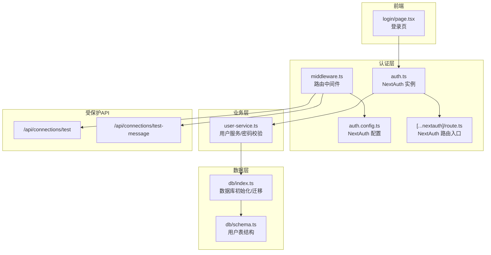
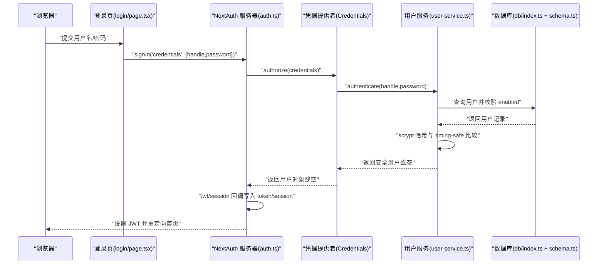
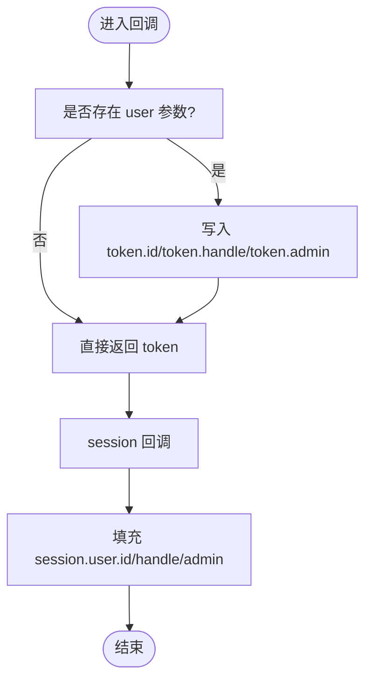
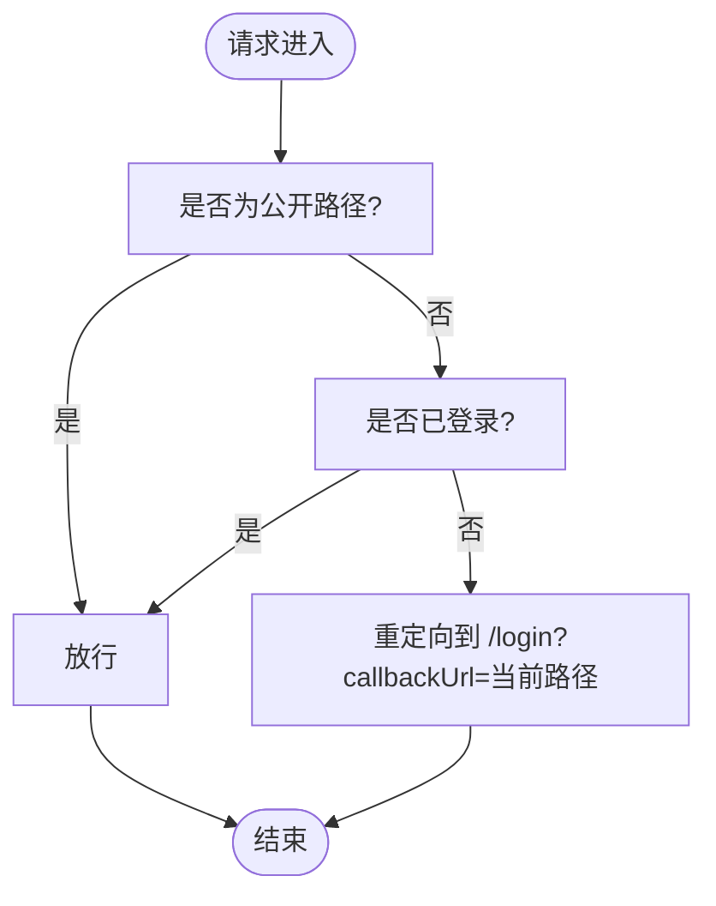
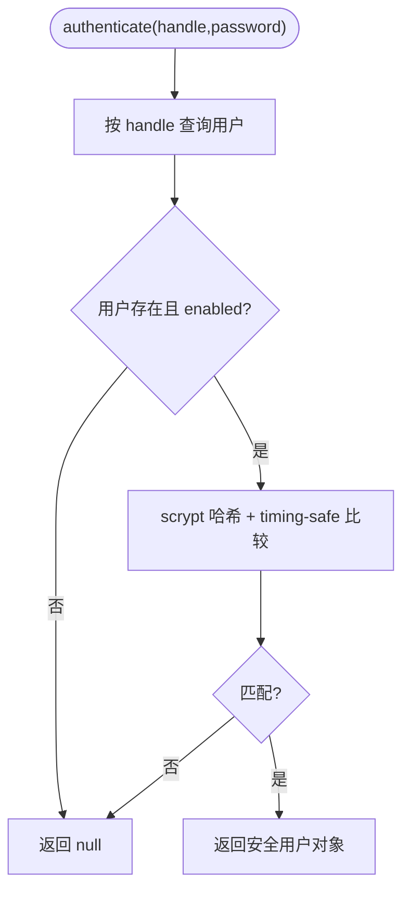
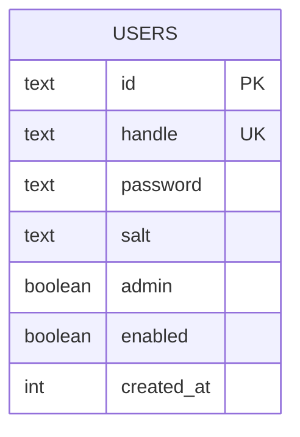
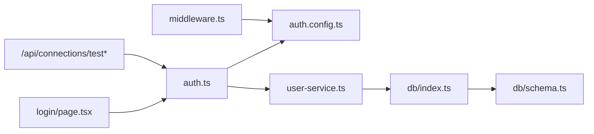

# 认证系统故障

<cite>
**本文引用的文件**
- [src/lib/auth.ts](file://src/lib/auth.ts)
- [src/lib/auth.config.ts](file://src/lib/auth.config.ts)
- [src/app/api/auth/[...nextauth]/route.ts](file://src/app/api/auth/[...nextauth]/route.ts)
- [src/middleware.ts](file://src/middleware.ts)
- [src/app/login/page.tsx](file://src/app/login/page.tsx)
- [src/lib/services/user-service.ts](file://src/lib/services/user-service.ts)
- [src/lib/db/schema.ts](file://src/lib/db/schema.ts)
- [src/lib/db/index.ts](file://src/lib/db/index.ts)
- [src/app/api/health/route.ts](file://src/app/api/health/route.ts)
- [src/app/api/connections/test/route.ts](file://src/app/api/connections/test/route.ts)
- [src/app/api/connections/test-message/route.ts](file://src/app/api/connections/test-message/route.ts)
</cite>

## 目录
1. [简介](#简介)
2. [项目结构](#项目结构)
3. [核心组件](#核心组件)
4. [架构总览](#架构总览)
5. [详细组件分析](#详细组件分析)
6. [依赖关系分析](#依赖关系分析)
7. [性能考量](#性能考量)
8. [故障排除指南](#故障排除指南)
9. [结论](#结论)
10. [附录](#附录)

## 简介
本指南面向 SillyTavern Next 的认证系统故障排查，覆盖登录失败、会话过期、权限验证错误、NextAuth 配置问题、JWT 令牌处理、回调函数异常、中间件拦截问题、用户服务异常、密码验证失败、管理员权限缺失等场景。文档提供可视化流程图、定位步骤、日志分析要点与安全配置检查清单，帮助快速恢复服务。

## 项目结构
认证相关的关键文件分布如下：
- NextAuth 配置与入口：src/lib/auth.config.ts、src/lib/auth.ts、src/app/api/auth/[...nextauth]/route.ts
- 中间件与路由保护：src/middleware.ts
- 登录页面与客户端调用：src/app/login/page.tsx
- 用户服务与密码校验：src/lib/services/user-service.ts
- 数据库与表结构：src/lib/db/index.ts、src/lib/db/schema.ts
- 公开端点示例：src/app/api/health/route.ts
- 权限受保护的 API 示例：src/app/api/connections/test*.route.ts

图表来源
- [src/lib/auth.config.ts:1-53](file://src/lib/auth.config.ts#L1-L53)
- [src/lib/auth.ts:1-59](file://src/lib/auth.ts#L1-L59)
- [src/app/api/auth/[...nextauth]/route.ts:1-3](file://src/app/api/auth/[...nextauth]/route.ts#L1-L3)
- [src/middleware.ts:1-35](file://src/middleware.ts#L1-L35)
- [src/app/login/page.tsx:1-85](file://src/app/login/page.tsx#L1-L85)
- [src/lib/services/user-service.ts:1-170](file://src/lib/services/user-service.ts#L1-L170)
- [src/lib/db/index.ts:1-134](file://src/lib/db/index.ts#L1-L134)
- [src/lib/db/schema.ts:1-240](file://src/lib/db/schema.ts#L1-L240)
- [src/app/api/connections/test/route.ts:1-41](file://src/app/api/connections/test/route.ts#L1-L41)
- [src/app/api/connections/test-message/route.ts:1-35](file://src/app/api/connections/test-message/route.ts#L1-L35)

章节来源
- [src/lib/auth.config.ts:1-53](file://src/lib/auth.config.ts#L1-L53)
- [src/lib/auth.ts:1-59](file://src/lib/auth.ts#L1-L59)
- [src/app/api/auth/[...nextauth]/route.ts:1-3](file://src/app/api/auth/[...nextauth]/route.ts#L1-L3)
- [src/middleware.ts:1-35](file://src/middleware.ts#L1-L35)
- [src/app/login/page.tsx:1-85](file://src/app/login/page.tsx#L1-L85)
- [src/lib/services/user-service.ts:1-170](file://src/lib/services/user-service.ts#L1-L170)
- [src/lib/db/index.ts:1-134](file://src/lib/db/index.ts#L1-L134)
- [src/lib/db/schema.ts:1-240](file://src/lib/db/schema.ts#L1-L240)
- [src/app/api/health/route.ts:1-10](file://src/app/api/health/route.ts#L1-L10)
- [src/app/api/connections/test/route.ts:1-41](file://src/app/api/connections/test/route.ts#L1-L41)
- [src/app/api/connections/test-message/route.ts:1-35](file://src/app/api/connections/test-message/route.ts#L1-L35)

## 核心组件
- NextAuth 配置与实例
  - 统一配置在 auth.config.ts，定义提供者、会话策略、回调与公共页面映射。
  - 在 auth.ts 中组合配置并导出 handlers、signIn、signOut、auth，实现凭据登录与 JWT 回调。
- 中间件与路由保护
  - middleware.ts 使用 NextAuth 的 auth 包裹，对非公开路径进行登录态校验，并重定向至登录页。
- 用户服务与密码校验
  - user-service.ts 提供 authenticate、create、update、changePassword 等，采用 scrypt 哈希与 timing-safe 比较。
- 数据库与表结构
  - db/index.ts 初始化 better-sqlite3 并执行迁移；schema.ts 定义 users 表及关键字段（id、handle、password、salt、admin、enabled）。
- 登录页面与客户端调用
  - login/page.tsx 使用 next-auth/react 的 signIn 方法触发凭据登录。

章节来源
- [src/lib/auth.config.ts:1-53](file://src/lib/auth.config.ts#L1-L53)
- [src/lib/auth.ts:1-59](file://src/lib/auth.ts#L1-L59)
- [src/middleware.ts:1-35](file://src/middleware.ts#L1-L35)
- [src/lib/services/user-service.ts:1-170](file://src/lib/services/user-service.ts#L1-L170)
- [src/lib/db/index.ts:1-134](file://src/lib/db/index.ts#L1-L134)
- [src/lib/db/schema.ts:1-240](file://src/lib/db/schema.ts#L1-L240)
- [src/app/login/page.tsx:1-85](file://src/app/login/page.tsx#L1-L85)

## 架构总览
认证流程概览（客户端到服务端）：

图表来源
- [src/app/login/page.tsx:13-30](file://src/app/login/page.tsx#L13-L30)
- [src/lib/auth.ts:21-35](file://src/lib/auth.ts#L21-L35)
- [src/lib/services/user-service.ts:64-69](file://src/lib/services/user-service.ts#L64-L69)
- [src/lib/db/index.ts:13](file://src/lib/db/index.ts#L13)
- [src/lib/db/schema.ts:6-16](file://src/lib/db/schema.ts#L6-L16)

## 详细组件分析

### NextAuth 配置与回调
- 配置要点
  - 提供者：Credentials，字段包含 handle 与 password。
  - 页面映射：登录页为 /login。
  - 会话策略：JWT，maxAge 为 30 天。
  - 回调：jwt 与 session 回调将用户信息写入 token 与 session。
  - 授权回调：authorized 控制公开端点（/api/auth、/login、/api/health）与登录态。
- 令牌与会话
  - jwt 回调在首次登录时写入 id、handle、admin。
  - session 回调将 token 中信息回填到 session.user。

图表来源
- [src/lib/auth.config.ts:20-47](file://src/lib/auth.config.ts#L20-L47)
- [src/lib/auth.ts:37-57](file://src/lib/auth.ts#L37-L57)

章节来源
- [src/lib/auth.config.ts:1-53](file://src/lib/auth.config.ts#L1-L53)
- [src/lib/auth.ts:1-59](file://src/lib/auth.ts#L1-L59)

### 中间件拦截与权限控制
- 行为
  - 对非公开路径（/login、/api/auth、/_next、favicon.ico）放行。
  - 未登录访问受保护资源时，重定向到 /login 并携带 callbackUrl。
  - 支持 authorized 回调的更细粒度授权判断。
- 常见问题
  - matcher 正则误拦截静态资源或 API。
  - 未正确设置 callbackUrl 导致登录后无法回到原页面。

图表来源
- [src/middleware.ts:8-30](file://src/middleware.ts#L8-L30)
- [src/lib/auth.config.ts:38-46](file://src/lib/auth.config.ts#L38-L46)

章节来源
- [src/middleware.ts:1-35](file://src/middleware.ts#L1-L35)
- [src/lib/auth.config.ts:1-53](file://src/lib/auth.config.ts#L1-L53)

### 用户服务与密码校验
- authenticate
  - 查询用户并检查 enabled。
  - 使用 scrypt 哈希与 timing-safe 比较验证密码。
- create/update/changePassword
  - 新建用户时生成随机 salt 并计算哈希。
  - 更新密码时重新生成 salt 与哈希。
- 错误点
  - 用户不存在或未启用。
  - 密码哈希不匹配。
  - 数据库字段缺失或迁移未完成导致 500。

图表来源
- [src/lib/services/user-service.ts:64-69](file://src/lib/services/user-service.ts#L64-L69)
- [src/lib/services/user-service.ts:40-50](file://src/lib/services/user-service.ts#L40-L50)

章节来源
- [src/lib/services/user-service.ts:1-170](file://src/lib/services/user-service.ts#L1-L170)

### 数据库与表结构
- users 表关键字段
  - id、handle（唯一）、password、salt、admin、enabled。
- 初始化与迁移
  - db/index.ts 初始化 better-sqlite3，执行 drizzle 迁移，并做字段幂等补齐。
- 故障点
  - 迁移失败或缺失字段导致查询异常。
  - handle 冲突导致创建用户失败。

图表来源
- [src/lib/db/schema.ts:6-16](file://src/lib/db/schema.ts#L6-L16)
- [src/lib/db/index.ts:16-134](file://src/lib/db/index.ts#L16-L134)

章节来源
- [src/lib/db/schema.ts:1-240](file://src/lib/db/schema.ts#L1-L240)
- [src/lib/db/index.ts:1-134](file://src/lib/db/index.ts#L1-L134)

### 登录页面与客户端调用
- 登录页通过 next-auth/react 的 signIn('credentials') 触发认证。
- 常见问题
  - 前端导入时机不当导致运行时错误。
  - callbackUrl 未设置导致登录后跳转异常。

章节来源
- [src/app/login/page.tsx:13-30](file://src/app/login/page.tsx#L13-L30)

### 受保护 API 示例
- /api/connections/test 与 /api/connections/test-message
  - 通过 auth() 获取 session，校验 session.user 存在后执行业务逻辑。
  - 未登录返回 401。

章节来源
- [src/app/api/connections/test/route.ts:10-16](file://src/app/api/connections/test/route.ts#L10-L16)
- [src/app/api/connections/test-message/route.ts:11-16](file://src/app/api/connections/test-message/route.ts#L11-L16)

## 依赖关系分析
- 组件耦合
  - auth.ts 依赖 auth.config.ts、user-service.ts。
  - middleware.ts 依赖 auth.config.ts。
  - user-service.ts 依赖 db/index.ts 与 schema.ts。
  - 登录页依赖 next-auth/react。
- 外部依赖
  - @auth/core 版本与 Next.js Edge 兼容性。
  - better-sqlite3 与 drizzle-orm。

图表来源
- [src/app/login/page.tsx:19-24](file://src/app/login/page.tsx#L19-L24)
- [src/lib/auth.ts:4-5](file://src/lib/auth.ts#L4-L5)
- [src/lib/auth.config.ts:1-53](file://src/lib/auth.config.ts#L1-L53)
- [src/lib/services/user-service.ts:1-5](file://src/lib/services/user-service.ts#L1-L5)
- [src/lib/db/index.ts:1-14](file://src/lib/db/index.ts#L1-L14)
- [src/lib/db/schema.ts:1-240](file://src/lib/db/schema.ts#L1-L240)
- [src/middleware.ts:6](file://src/middleware.ts#L6)
- [src/app/api/connections/test/route.ts:2-3](file://src/app/api/connections/test/route.ts#L2-L3)
- [src/app/api/connections/test-message/route.ts:2-3](file://src/app/api/connections/test-message/route.ts#L2-L3)

章节来源
- [src/lib/auth.ts:1-59](file://src/lib/auth.ts#L1-L59)
- [src/lib/auth.config.ts:1-53](file://src/lib/auth.config.ts#L1-L53)
- [src/middleware.ts:1-35](file://src/middleware.ts#L1-L35)
- [src/lib/services/user-service.ts:1-170](file://src/lib/services/user-service.ts#L1-L170)
- [src/lib/db/index.ts:1-134](file://src/lib/db/index.ts#L1-L134)
- [src/lib/db/schema.ts:1-240](file://src/lib/db/schema.ts#L1-L240)
- [src/app/api/connections/test/route.ts:1-41](file://src/app/api/connections/test/route.ts#L1-L41)
- [src/app/api/connections/test-message/route.ts:1-35](file://src/app/api/connections/test-message/route.ts#L1-L35)

## 性能考量
- JWT 会话策略
  - 优点：无服务端状态，适合边缘部署。
  - 注意：令牌体积与网络传输开销；maxAge 需平衡安全与体验。
- 密码哈希
  - scrypt 计算成本较高，建议在用户注册/修改密码时异步处理，避免阻塞请求。
- 数据库
  - better-sqlite3 本地文件 IO，注意磁盘性能与 WAL 模式配置。

## 故障排除指南

### 1. 用户登录失败
- 现象
  - 输入正确凭据仍提示失败；前端无错误提示或报错。
- 诊断步骤
  - 检查登录页是否正确调用 signIn('credentials')。
  - 查看 NextAuth 日志（浏览器 Network 面板 / 服务器控制台）。
  - 确认用户存在且 enabled=true。
  - 确认密码哈希匹配。
- 关键定位
  - 登录页调用：[src/app/login/page.tsx:19-24](file://src/app/login/page.tsx#L19-L24)
  - 凭据授权流程：[src/lib/auth.ts:21-35](file://src/lib/auth.ts#L21-L35)
  - 用户认证逻辑：[src/lib/services/user-service.ts:64-69](file://src/lib/services/user-service.ts#L64-L69)
  - 用户表结构：[src/lib/db/schema.ts:6-16](file://src/lib/db/schema.ts#L6-L16)

章节来源
- [src/app/login/page.tsx:13-30](file://src/app/login/page.tsx#L13-L30)
- [src/lib/auth.ts:21-35](file://src/lib/auth.ts#L21-L35)
- [src/lib/services/user-service.ts:64-69](file://src/lib/services/user-service.ts#L64-L69)
- [src/lib/db/schema.ts:6-16](file://src/lib/db/schema.ts#L6-L16)

### 2. 会话过期或频繁登出
- 现象
  - 登录后一段时间内自动登出；刷新页面后被重定向到登录页。
- 诊断步骤
  - 检查 session.maxAge 是否过短或被覆盖。
  - 检查浏览器 Cookie/JWT 是否被清理或跨域限制。
  - 检查 NextAuth 回调是否正确写入/读取 token。
- 关键定位
  - 会话配置：[src/lib/auth.config.ts:48-52](file://src/lib/auth.config.ts#L48-L52)
  - JWT 回调：[src/lib/auth.config.ts:20-28](file://src/lib/auth.config.ts#L20-L28)
  - Session 回调：[src/lib/auth.config.ts:29-37](file://src/lib/auth.config.ts#L29-L37)

章节来源
- [src/lib/auth.config.ts:48-52](file://src/lib/auth.config.ts#L48-L52)
- [src/lib/auth.config.ts:20-37](file://src/lib/auth.config.ts#L20-L37)

### 3. 权限验证错误（401/403）
- 现象
  - 访问受保护 API 返回 401 Unauthorized。
- 诊断步骤
  - 确认调用 auth() 获取 session。
  - 确认 session.user 存在。
  - 检查中间件 authorized 回调是否允许该路径。
- 关键定位
  - 受保护 API 示例：[src/app/api/connections/test/route.ts:12-16](file://src/app/api/connections/test/route.ts#L12-L16)
  - 中间件授权：[src/middleware.ts:8-30](file://src/middleware.ts#L8-L30)
  - 授权回调：[src/lib/auth.config.ts:38-46](file://src/lib/auth.config.ts#L38-L46)

章节来源
- [src/app/api/connections/test/route.ts:10-16](file://src/app/api/connections/test/route.ts#L10-L16)
- [src/middleware.ts:8-30](file://src/middleware.ts#L8-L30)
- [src/lib/auth.config.ts:38-46](file://src/lib/auth.config.ts#L38-L46)

### 4. NextAuth 配置问题
- 现象
  - 登录接口 404 或回调异常；Edge 环境报错。
- 诊断步骤
  - 确认 NextAuth 路由入口存在且导出 GET/POST。
  - 确认 auth.config.ts 使用 Edge 兼容配置。
  - 确认 pages.signIn 指向正确路径。
- 关键定位
  - 路由入口：[src/app/api/auth/[...nextauth]/route.ts:1-3](file://src/app/api/auth/[...nextauth]/route.ts#L1-L3)
  - 配置文件：[src/lib/auth.config.ts:1-53](file://src/lib/auth.config.ts#L1-L53)

章节来源
- [src/app/api/auth/[...nextauth]/route.ts:1-3](file://src/app/api/auth/[...nextauth]/route.ts#L1-L3)
- [src/lib/auth.config.ts:1-53](file://src/lib/auth.config.ts#L1-L53)

### 5. JWT 令牌处理异常
- 现象
  - 登录成功但后续请求仍 401；session 中缺少用户信息。
- 诊断步骤
  - 检查 jwt 回调是否写入 id/handle/admin。
  - 检查 session 回调是否将 token 注入 session.user。
  - 检查浏览器存储的 JWT 是否完整。
- 关键定位
  - JWT 回调：[src/lib/auth.ts:37-46](file://src/lib/auth.ts#L37-L46)
  - Session 回调：[src/lib/auth.ts:47-56](file://src/lib/auth.ts#L47-L56)

章节来源
- [src/lib/auth.ts:37-56](file://src/lib/auth.ts#L37-L56)

### 6. 回调函数异常
- 现象
  - 登录后无法进入受保护页面；中间件重定向。
- 诊断步骤
  - 检查 authorized 回调逻辑与路径前缀匹配。
  - 检查是否遗漏公开端点（/api/auth、/login、/api/health）。
- 关键定位
  - 授权回调：[src/lib/auth.config.ts:38-46](file://src/lib/auth.config.ts#L38-L46)
  - 中间件公开路径：[src/middleware.ts:13-20](file://src/middleware.ts#L13-L20)

章节来源
- [src/lib/auth.config.ts:38-46](file://src/lib/auth.config.ts#L38-L46)
- [src/middleware.ts:13-20](file://src/middleware.ts#L13-L20)

### 7. 中间件拦截问题
- 现象
  - 静态资源 404；API 被错误拦截。
- 诊断步骤
  - 检查 matcher 正则是否覆盖到 /_next 与 favicon.ico。
  - 检查 callbackUrl 是否正确传递。
- 关键定位
  - 中间件配置：[src/middleware.ts:32-35](file://src/middleware.ts#L32-L35)
  - 重定向逻辑：[src/middleware.ts:23-27](file://src/middleware.ts#L23-L27)

章节来源
- [src/middleware.ts:32-35](file://src/middleware.ts#L32-L35)
- [src/middleware.ts:23-27](file://src/middleware.ts#L23-L27)

### 8. 用户服务异常
- 现象
  - 创建用户时报“handle 已存在”；更新/删除用户失败。
- 诊断步骤
  - 检查 handle 唯一约束与正则规则。
  - 检查数据库迁移是否完成。
- 关键定位
  - 用户创建：[src/lib/services/user-service.ts:98-119](file://src/lib/services/user-service.ts#L98-L119)
  - 用户表结构：[src/lib/db/schema.ts:9](file://src/lib/db/schema.ts#L9)
  - 迁移与补齐：[src/lib/db/index.ts:16-134](file://src/lib/db/index.ts#L16-L134)

章节来源
- [src/lib/services/user-service.ts:98-119](file://src/lib/services/user-service.ts#L98-L119)
- [src/lib/db/schema.ts:9](file://src/lib/db/schema.ts#L9)
- [src/lib/db/index.ts:16-134](file://src/lib/db/index.ts#L16-L134)

### 9. 密码验证失败
- 现象
  - 用户存在但登录失败；修改密码后仍无法登录。
- 诊断步骤
  - 检查 scrypt 哈希与 salt 生成。
  - 检查 timing-safe 比较是否正确。
  - 检查更新密码流程是否重新生成 salt 与哈希。
- 关键定位
  - 密码哈希与比较：[src/lib/services/user-service.ts:40-50](file://src/lib/services/user-service.ts#L40-L50)
  - 更新密码：[src/lib/services/user-service.ts:159-168](file://src/lib/services/user-service.ts#L159-L168)

章节来源
- [src/lib/services/user-service.ts:40-50](file://src/lib/services/user-service.ts#L40-L50)
- [src/lib/services/user-service.ts:159-168](file://src/lib/services/user-service.ts#L159-L168)

### 10. 管理员权限缺失
- 现象
  - 登录后无管理功能；受保护 API 返回 401。
- 诊断步骤
  - 检查用户 admin 字段是否为 true。
  - 检查 session 中是否包含 admin 字段。
- 关键定位
  - 用户表 admin 字段：[src/lib/db/schema.ts:13](file://src/lib/db/schema.ts#L13)
  - Session 回调写入 admin：[src/lib/auth.ts:47-56](file://src/lib/auth.ts#L47-L56)

章节来源
- [src/lib/db/schema.ts:13](file://src/lib/db/schema.ts#L13)
- [src/lib/auth.ts:47-56](file://src/lib/auth.ts#L47-L56)

### 11. 认证日志分析
- 建议关注点
  - NextAuth 路由请求与响应头中的 Authorization/JWT。
  - 中间件重定向次数与 callbackUrl。
  - 用户服务 authenticate 的返回路径（null vs 用户对象）。
  - 受保护 API 的 auth() 结果与 401 响应。
- 公开端点
  - /api/health 无需鉴权，可用于健康检查与外部探测。

章节来源
- [src/app/api/health/route.ts:1-10](file://src/app/api/health/route.ts#L1-L10)

### 12. 安全配置检查清单
- NextAuth
  - 使用 Edge 兼容配置。
  - 会话策略选择 JWT 并设置合理 maxAge。
  - 回调函数仅写入必要字段。
- 数据库
  - users 表包含 id、handle、password、salt、admin、enabled。
  - handle 唯一索引存在。
- 密码
  - 使用 scrypt 哈希与随机 salt。
  - timing-safe 比较防止时序攻击。
- 中间件
  - 明确公开端点列表（/api/auth、/login、/api/health、/_next、favicon.ico）。
  - matcher 正则避免误拦截。

章节来源
- [src/lib/auth.config.ts:1-53](file://src/lib/auth.config.ts#L1-L53)
- [src/lib/db/schema.ts:6-16](file://src/lib/db/schema.ts#L6-L16)
- [src/lib/services/user-service.ts:40-50](file://src/lib/services/user-service.ts#L40-L50)
- [src/middleware.ts:13-20](file://src/middleware.ts#L13-L20)

## 结论
本指南提供了从登录流程、JWT 回调、中间件拦截到数据库与密码校验的全链路故障排查方法。建议优先核对 NextAuth 配置、公开端点与会话策略，再深入用户服务与数据库一致性问题。结合日志与检查清单可快速定位并修复认证异常。

## 附录
- 快速参考
  - 登录页调用：[src/app/login/page.tsx:19-24](file://src/app/login/page.tsx#L19-L24)
  - NextAuth 路由入口：[src/app/api/auth/[...nextauth]/route.ts:1-3](file://src/app/api/auth/[...nextauth]/route.ts#L1-L3)
  - 中间件授权：[src/middleware.ts:8-30](file://src/middleware.ts#L8-L30)
  - 用户认证：[src/lib/services/user-service.ts:64-69](file://src/lib/services/user-service.ts#L64-L69)
  - 公开端点：[src/app/api/health/route.ts:1-10](file://src/app/api/health/route.ts#L1-L10)