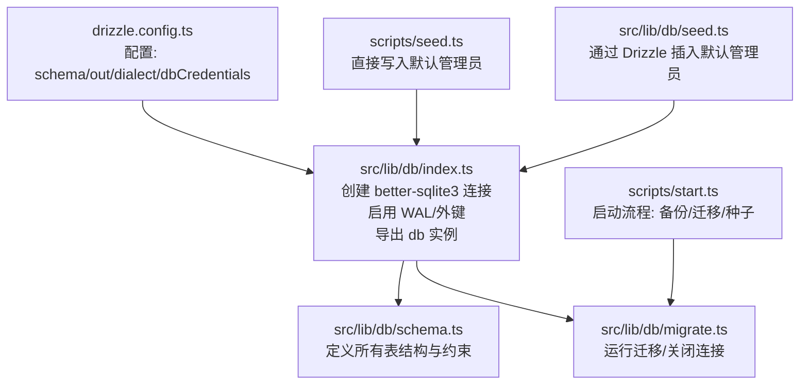
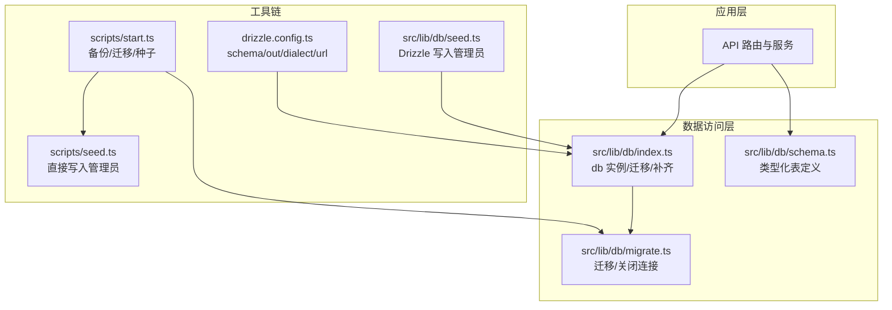
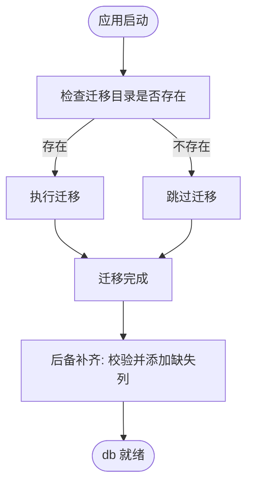
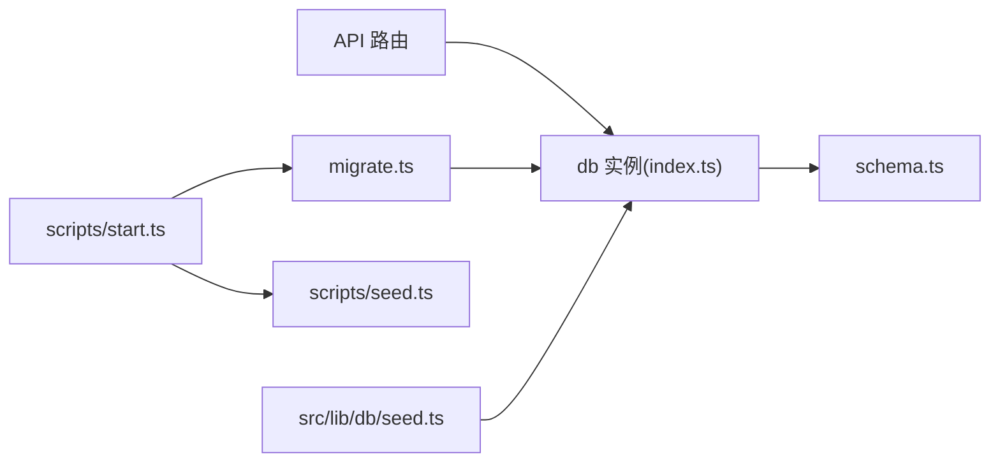
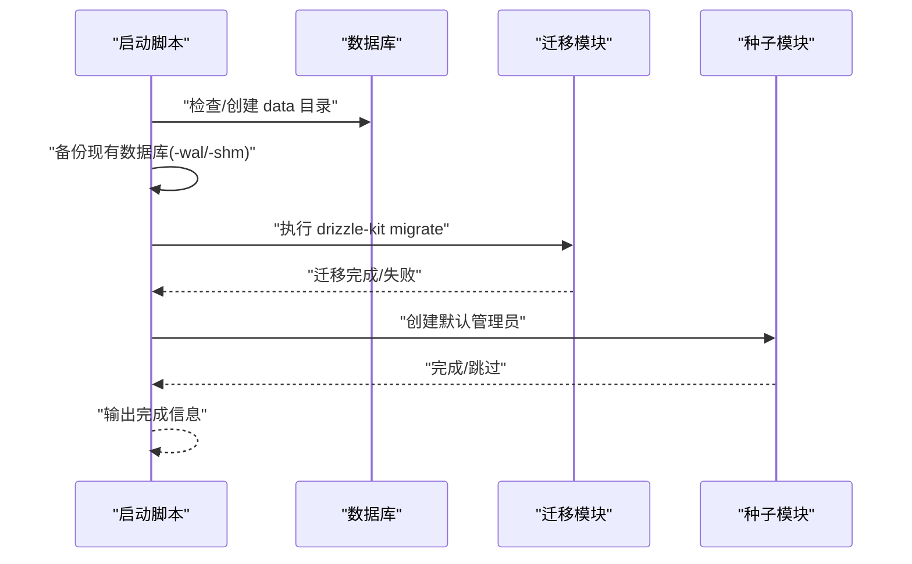

# Drizzle ORM 集成

<cite>
**本文引用的文件**
- [drizzle.config.ts](file://drizzle.config.ts)
- [src/lib/db/index.ts](file://src/lib/db/index.ts)
- [src/lib/db/schema.ts](file://src/lib/db/schema.ts)
- [src/lib/db/migrate.ts](file://src/lib/db/migrate.ts)
- [src/lib/db/seed.ts](file://src/lib/db/seed.ts)
- [scripts/start.ts](file://scripts/start.ts)
- [scripts/seed.ts](file://scripts/seed.ts)
</cite>

## 目录
1. [简介](#简介)
2. [项目结构](#项目结构)
3. [核心组件](#核心组件)
4. [架构总览](#架构总览)
5. [详细组件分析](#详细组件分析)
6. [依赖关系分析](#依赖关系分析)
7. [性能考量](#性能考量)
8. [故障排查指南](#故障排查指南)
9. [结论](#结论)
10. [附录](#附录)

## 简介
本文件系统性梳理 SillyTavern Next 中基于 Drizzle ORM 的 SQLite 集成方案，覆盖 ORM 配置、连接管理、迁移与种子数据、类型安全查询接口、事务与错误处理、连接池与并发控制、性能优化与常见查询模式，并提供最佳实践与常见陷阱。

## 项目结构
- Drizzle 配置位于根目录，定义 schema 文件路径、输出目录、方言与数据库凭据。
- 数据库连接与迁移在 lib/db 下集中管理，包含连接初始化、自动迁移、幂等字段补齐与关闭连接。
- 数据模型定义于 schema.ts，涵盖用户、角色卡、标签、群组、聊天、消息、世界设定、预设、密钥、设置、模板等。
- 启动脚本负责数据库备份、迁移与默认管理员创建；独立种子脚本提供幂等初始化。



图表来源
- [drizzle.config.ts:1-11](file://drizzle.config.ts#L1-L11)
- [src/lib/db/index.ts:1-134](file://src/lib/db/index.ts#L1-L134)
- [src/lib/db/schema.ts:1-240](file://src/lib/db/schema.ts#L1-L240)
- [src/lib/db/migrate.ts:1-34](file://src/lib/db/migrate.ts#L1-L34)
- [scripts/start.ts:1-96](file://scripts/start.ts#L1-L96)
- [scripts/seed.ts:1-28](file://scripts/seed.ts#L1-L28)
- [src/lib/db/seed.ts:1-40](file://src/lib/db/seed.ts#L1-L40)

章节来源
- [drizzle.config.ts:1-11](file://drizzle.config.ts#L1-L11)
- [src/lib/db/index.ts:1-134](file://src/lib/db/index.ts#L1-L134)
- [src/lib/db/schema.ts:1-240](file://src/lib/db/schema.ts#L1-L240)
- [src/lib/db/migrate.ts:1-34](file://src/lib/db/migrate.ts#L1-L34)
- [scripts/start.ts:1-96](file://scripts/start.ts#L1-L96)
- [scripts/seed.ts:1-28](file://scripts/seed.ts#L1-L28)
- [src/lib/db/seed.ts:1-40](file://src/lib/db/seed.ts#L1-L40)

## 核心组件
- Drizzle 配置与凭据
  - 配置文件指定 schema 路径、迁移输出目录、SQLite 方言与数据库 URL（优先环境变量 DATABASE_URL，否则默认 data 目录下的 sillytavern.db）。
- 连接与初始化
  - 使用 better-sqlite3 创建连接，启用 WAL 模式与外键约束，导出 drizzle 实例与底层 sqlite 句柄。
  - 启动时自动执行迁移与“后备补齐”逻辑，确保表结构与字段的向后兼容。
- 迁移与种子
  - 提供独立迁移入口与关闭连接方法；启动脚本集成备份、迁移与默认管理员创建；另有直接使用 better-sqlite3 写入管理员的脚本。
- 类型安全模型
  - schema.ts 使用 drizzle-orm 的 sqliteTable 定义各表字段、主键、外键、枚举与默认值，保证查询编译期类型安全。

章节来源
- [drizzle.config.ts:1-11](file://drizzle.config.ts#L1-L11)
- [src/lib/db/index.ts:1-134](file://src/lib/db/index.ts#L1-L134)
- [src/lib/db/migrate.ts:1-34](file://src/lib/db/migrate.ts#L1-L34)
- [src/lib/db/schema.ts:1-240](file://src/lib/db/schema.ts#L1-L240)
- [scripts/start.ts:1-96](file://scripts/start.ts#L1-L96)
- [scripts/seed.ts:1-28](file://scripts/seed.ts#L1-L28)
- [src/lib/db/seed.ts:1-40](file://src/lib/db/seed.ts#L1-L40)

## 架构总览
Drizzle 在本项目中采用“单实例连接 + WAL 模式”的轻量架构，适合本地开发与小规模生产部署。迁移与种子通过脚本化流程统一管理，确保环境一致性。



图表来源
- [src/lib/db/index.ts:1-134](file://src/lib/db/index.ts#L1-L134)
- [src/lib/db/schema.ts:1-240](file://src/lib/db/schema.ts#L1-L240)
- [src/lib/db/migrate.ts:1-34](file://src/lib/db/migrate.ts#L1-L34)
- [drizzle.config.ts:1-11](file://drizzle.config.ts#L1-L11)
- [scripts/start.ts:1-96](file://scripts/start.ts#L1-L96)
- [scripts/seed.ts:1-28](file://scripts/seed.ts#L1-L28)
- [src/lib/db/seed.ts:1-40](file://src/lib/db/seed.ts#L1-L40)

## 详细组件分析

### Drizzle 配置与工具链
- 配置项
  - schema: 指向 schema.ts
  - out: 迁移输出目录
  - dialect: sqlite
  - dbCredentials.url: 优先 DATABASE_URL，否则 data/sillytavern.db
- 工具链职责
  - drizzle-kit migrate: 生成/应用迁移
  - 应用启动时自动迁移与字段补齐
  - 启动脚本提供备份、迁移与默认管理员创建的完整流程

章节来源
- [drizzle.config.ts:1-11](file://drizzle.config.ts#L1-L11)
- [scripts/start.ts:1-96](file://scripts/start.ts#L1-L96)

### 连接管理与生命周期
- 连接建立
  - 使用 better-sqlite3 打开数据库文件，设置 journal_mode=WAL 与 foreign_keys=ON。
  - 导出 drizzle 实例与 sqlite 句柄，便于直接执行 SQL 或通过 ORM 查询。
- 自动迁移与幂等补齐
  - 启动时检查并执行迁移；若迁移目录不存在则跳过。
  - 迁移完成后执行“后备补齐”，对关键表进行列存在性检查并增量添加缺失列，避免因迁移文件未及时更新导致的 500 错误。
- 关闭连接
  - 提供关闭方法，便于优雅退出或测试清理。



图表来源
- [src/lib/db/index.ts:16-134](file://src/lib/db/index.ts#L16-L134)
- [src/lib/db/migrate.ts:10-26](file://src/lib/db/migrate.ts#L10-L26)

章节来源
- [src/lib/db/index.ts:1-134](file://src/lib/db/index.ts#L1-L134)
- [src/lib/db/migrate.ts:1-34](file://src/lib/db/migrate.ts#L1-L34)

### 类型安全的数据模型
- 用户表、角色卡、标签、角色-标签关联、Persona、群组、聊天、消息、世界设定、预设、密钥、设置、Instruct/Context 模板等均在 schema.ts 中定义。
- 字段类型覆盖 text、integer、real、枚举与 JSON 文本存储；外键约束明确父子关系；默认值与时间戳字段统一管理。
- 该设计使 Drizzle 查询具备编译期类型安全，减少运行期错误。

```mermaid
erDiagram
USERS {
text id PK
text name
text handle UK
text password
text salt
text avatar
boolean admin
boolean enabled
timestamp created_at
}
CHARACTERS {
text id PK
text user_id FK
text name
text description
text personality
text scenario
text first_message
text example_dialogue
text creator_notes
text system_prompt
text post_history_instructions
text alternate_greetings
text tags
text creator
text character_version
real talkativeness
boolean fav
text avatar
text extensions
text character_book
text world_info_book_id
text create_date
timestamp created_at
timestamp updated_at
}
TAGS {
text id PK
text user_id FK
text name
text color
text color2
timestamp created_at
}
CHARACTER_TAGS {
text id PK
text character_id FK
text tag_id FK
}
PERSONAS {
text id PK
text user_id FK
text name
text description
text avatar
boolean is_active
boolean is_default
int description_position
int depth
int depth_role
text lorebook_id
text connections
timestamp created_at
}
GROUPS {
text id PK
text user_id FK
text name
text members
text disabled_members
text avatar
boolean fav
int activation_strategy
int generation_mode
boolean allow_self_responses
text generation_mode_join_prefix
text generation_mode_join_suffix
int auto_mode_delay
boolean hide_muted_sprites
int date_last_chat
text chat_metadata
timestamp created_at
timestamp updated_at
}
CHATS {
text id PK
text user_id FK
text character_id
text group_id
text title
text metadata
timestamp created_at
timestamp updated_at
}
MESSAGES {
text id PK
text chat_id FK
text name
boolean is_user
text content
enum role
text swipes
int swipe_id
text swipe_info
boolean is_system
text force_avatar
text original_avatar
text gen_started
text gen_finished
text bookmark_link
text extra
text send_date
timestamp created_at
}
WORLD_INFO {
text id PK
text user_id FK
text name
text entries
timestamp created_at
timestamp updated_at
}
PRESETS {
text id PK
text user_id FK
text name
text provider
text api_type
text settings
boolean is_default
boolean is_active
timestamp created_at
timestamp updated_at
}
SECRETS {
text id PK
text user_id FK
text key
text value
timestamp created_at
}
SETTINGS {
text id PK
text user_id FK UK
text data
timestamp updated_at
}
INSTRUCT_TEMPLATES {
text id PK
text user_id FK
text name
text content
timestamp created_at
}
CONTEXT_TEMPLATES {
text id PK
text user_id FK
text name
text content
timestamp created_at
}
USERS ||--o{ CHARACTERS : "拥有"
USERS ||--o{ TAGS : "拥有"
USERS ||--o{ PERSONAS : "拥有"
USERS ||--o{ GROUPS : "拥有"
USERS ||--o{ CHATS : "拥有"
USERS ||--o{ PRESETS : "拥有"
USERS ||--o{ SECRETS : "拥有"
USERS ||--o{ SETTINGS : "拥有"
CHARACTERS ||--o{ CHARACTER_TAGS : "被标记"
TAGS ||--o{ CHARACTER_TAGS : "用于标记"
PERSONAS ||--o{ MESSAGES : "影响对话"
GROUPS ||--o{ CHATS : "包含"
CHATS ||--o{ MESSAGES : "包含"
```

图表来源
- [src/lib/db/schema.ts:1-240](file://src/lib/db/schema.ts#L1-L240)

章节来源
- [src/lib/db/schema.ts:1-240](file://src/lib/db/schema.ts#L1-L240)

### 查询构建与事务处理
- 类型安全查询
  - 通过 schema.ts 定义的表结构，Drizzle 提供编译期类型安全的 select、insert、update、delete 接口，避免手写 SQL 的拼写与类型错误。
- 事务处理
  - 当前代码未显式使用事务 API；如需跨多表原子操作，可在业务层封装事务块，确保一致性。
- 错误处理
  - 迁移与补齐阶段捕获异常并记录错误日志；启动脚本在迁移失败时提示回滚命令，便于快速恢复。

章节来源
- [src/lib/db/schema.ts:1-240](file://src/lib/db/schema.ts#L1-L240)
- [src/lib/db/index.ts:16-134](file://src/lib/db/index.ts#L16-L134)
- [scripts/start.ts:65-83](file://scripts/start.ts#L65-L83)

### 连接池与并发控制
- 连接池
  - 本项目使用 better-sqlite3，其为单进程同步驱动，无内置连接池；每个应用进程维护一个连接实例。
- 并发控制
  - 通过 WAL 模式提升读写并发能力；外键约束保证参照完整性；建议在业务层避免长时间持有锁的操作，必要时拆分事务。
- 并发建议
  - 对高并发场景，可考虑引入连接池中间件或切换到支持连接池的方言（如 PostgreSQL/MySQL），但需评估迁移成本与运维复杂度。

章节来源
- [src/lib/db/index.ts:1-134](file://src/lib/db/index.ts#L1-L134)

### 常用查询模式与复杂查询示例
- 常用模式
  - 条件查询：基于 eq/like/gt/lt 等条件组合筛选。
  - 聚合与排序：结合 count/groupBy/orderBy 实现统计与排序。
  - 连接查询：通过 relations 或 join 语义实现多表关联。
  - 分页：limit/offset 实现分页加载。
- 复杂查询示例
  - 多表关联统计：统计用户角色卡数量、按标签聚合角色卡数等。
  - 时间范围与状态过滤：按 created_at 范围与 is_active/is_system 等布尔字段过滤消息。
  - JSON 字段解析：对 settings、entries、metadata 等 JSON 字段进行条件匹配或提取。
- 注意事项
  - JSON 字段查询需注意索引与性能；必要时在 schema 层增加派生列或物化视图（SQLite 限制较多，可考虑外部索引策略）。

章节来源
- [src/lib/db/schema.ts:1-240](file://src/lib/db/schema.ts#L1-L240)

### 性能调优技巧
- WAL 模式与外键
  - 已启用 WAL 与外键，有助于提升并发与一致性。
- 索引策略
  - 对高频过滤字段（如 handle、user_id、chat_id、role、is_system、created_at）建立索引，减少全表扫描。
- 查询优化
  - 避免 SELECT *，只取需要字段；合理使用 LIMIT；对大结果集分页。
  - 将复杂 JSON 解析放在应用层或物化列，减少数据库侧计算。
- 迁移与补齐
  - 保持迁移文件与 schema 同步，减少运行时补齐带来的额外开销。

章节来源
- [src/lib/db/index.ts:1-134](file://src/lib/db/index.ts#L1-L134)
- [src/lib/db/schema.ts:1-240](file://src/lib/db/schema.ts#L1-L240)

### 最佳实践与常见陷阱
- 最佳实践
  - 统一使用 Drizzle 类型安全接口，避免原生 SQL 混用。
  - 将迁移与种子脚本化，确保环境一致。
  - 对敏感字段（密码、密钥）使用哈希与加密存储。
  - 对 JSON 字段进行结构化校验与版本兼容处理。
- 常见陷阱
  - 忽略外键约束导致的数据不一致。
  - 在 WAL 模式下直接拷贝数据库文件，应同时拷贝 -wal/-shm 以避免数据丢失。
  - 迁移文件未及时更新导致字段缺失引发 500 错误，需依赖后备补齐逻辑兜底。

章节来源
- [src/lib/db/index.ts:1-134](file://src/lib/db/index.ts#L1-L134)
- [scripts/start.ts:24-62](file://scripts/start.ts#L24-L62)

## 依赖关系分析
- 组件耦合
  - API 层仅依赖 db 实例与 schema 定义，耦合度低，便于扩展。
  - 迁移与种子脚本独立于应用运行时，降低启动时延。
- 外部依赖
  - better-sqlite3 提供高性能 SQLite 访问；drizzle-orm 提供类型安全与迁移能力。
- 潜在风险
  - SQLite 无连接池，高并发写入可能成为瓶颈；建议评估切换到支持连接池的数据库。



图表来源
- [src/lib/db/index.ts:1-134](file://src/lib/db/index.ts#L1-L134)
- [src/lib/db/schema.ts:1-240](file://src/lib/db/schema.ts#L1-L240)
- [src/lib/db/migrate.ts:1-34](file://src/lib/db/migrate.ts#L1-L34)
- [scripts/start.ts:1-96](file://scripts/start.ts#L1-L96)
- [scripts/seed.ts:1-28](file://scripts/seed.ts#L1-L28)
- [src/lib/db/seed.ts:1-40](file://src/lib/db/seed.ts#L1-L40)

章节来源
- [src/lib/db/index.ts:1-134](file://src/lib/db/index.ts#L1-L134)
- [src/lib/db/migrate.ts:1-34](file://src/lib/db/migrate.ts#L1-L34)
- [scripts/start.ts:1-96](file://scripts/start.ts#L1-L96)
- [scripts/seed.ts:1-28](file://scripts/seed.ts#L1-L28)
- [src/lib/db/seed.ts:1-40](file://src/lib/db/seed.ts#L1-L40)

## 性能考量
- 存储与并发
  - WAL 模式显著提升并发读写能力；外键约束保障一致性。
- 查询与索引
  - 针对高频字段建立索引；避免全表扫描；合理分页。
- 迁移与补齐
  - 保持迁移文件与 schema 同步，减少运行时补齐带来的额外开销。
- 扩展性
  - SQLite 适合作为开发与小规模生产环境；高并发场景建议评估 PostgreSQL/MySQL 的连接池与分片能力。

## 故障排查指南
- 迁移失败
  - 查看错误日志，确认迁移目录是否存在；根据启动脚本提示执行回滚命令，恢复数据库与 WAL/SHM 文件。
- 启动后字段缺失
  - 确认后备补齐逻辑是否执行；检查 schema 与迁移文件是否一致。
- 连接问题
  - 确认 DATABASE_URL 环境变量与文件权限；检查 data 目录是否存在且可写。
- 数据库损坏
  - 使用启动脚本的备份功能进行恢复；WAL 模式下需同时复制 -wal/-shm 文件。

章节来源
- [scripts/start.ts:65-83](file://scripts/start.ts#L65-L83)
- [src/lib/db/index.ts:16-134](file://src/lib/db/index.ts#L16-L134)

## 结论
本项目采用 Drizzle + better-sqlite3 的轻量一体化方案，具备良好的类型安全与迁移能力。通过 WAL 模式与幂等补齐策略，兼顾了性能与稳定性。建议在高并发场景评估替换为支持连接池的数据库，并持续完善索引与查询优化策略。

## 附录
- 启动流程时序


图表来源
- [scripts/start.ts:1-96](file://scripts/start.ts#L1-L96)
- [src/lib/db/migrate.ts:10-26](file://src/lib/db/migrate.ts#L10-L26)
- [src/lib/db/seed.ts:16-39](file://src/lib/db/seed.ts#L16-L39)