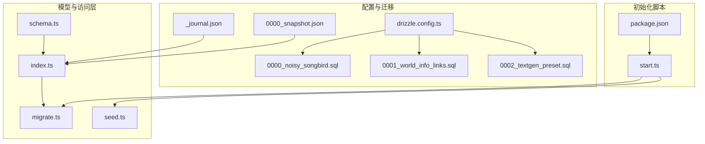
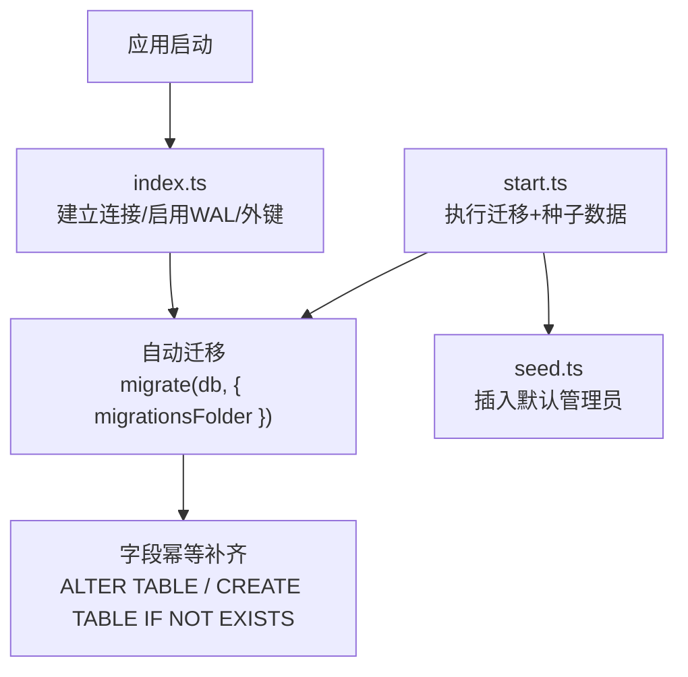
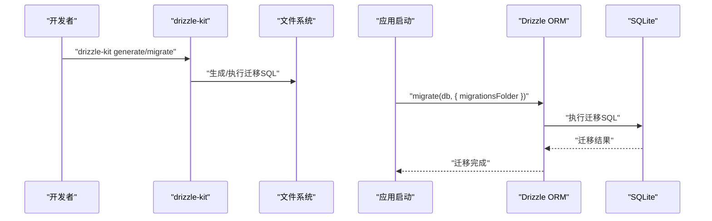
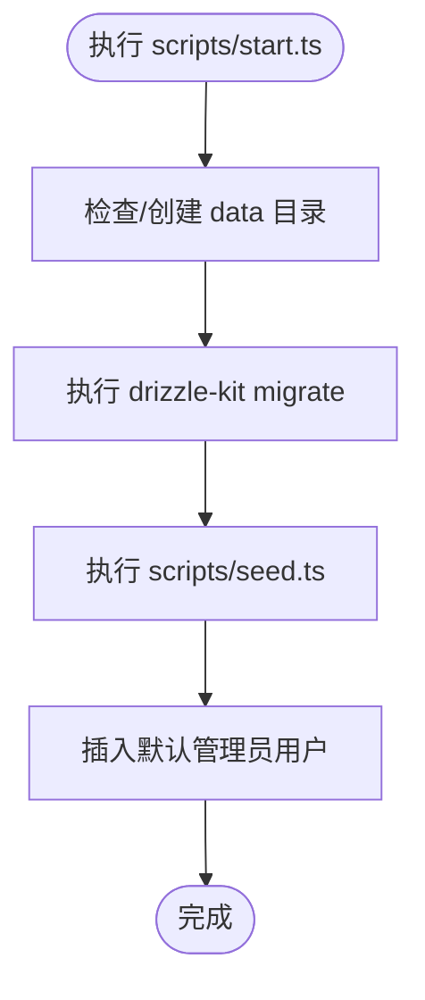
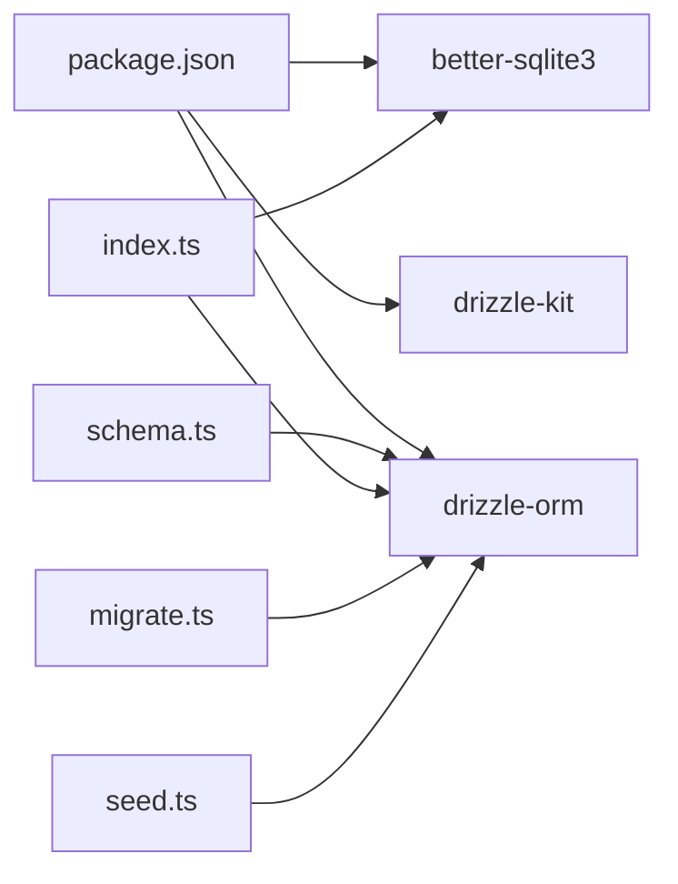

# 数据库设计

<cite>
**本文引用的文件**
- [drizzle.config.ts](file://drizzle.config.ts)
- [0000_noisy_songbird.sql](file://drizzle/0000_noisy_songbird.sql)
- [0001_world_info_links.sql](file://drizzle/0001_world_info_links.sql)
- [0002_textgen_preset.sql](file://drizzle/0002_textgen_preset.sql)
- [_journal.json](file://drizzle/meta/_journal.json)
- [0000_snapshot.json](file://drizzle/meta/0000_snapshot.json)
- [schema.ts](file://src/lib/db/schema.ts)
- [index.ts](file://src/lib/db/index.ts)
- [migrate.ts](file://src/lib/db/migrate.ts)
- [seed.ts](file://src/lib/db/seed.ts)
- [start.ts](file://scripts/start.ts)
- [package.json](file://package.json)
</cite>

## 目录
1. [简介](#简介)
2. [项目结构](#项目结构)
3. [核心组件](#核心组件)
4. [架构总览](#架构总览)
5. [详细组件分析](#详细组件分析)
6. [依赖分析](#依赖分析)
7. [性能考虑](#性能考虑)
8. [故障排查指南](#故障排查指南)
9. [结论](#结论)
10. [附录](#附录)

## 简介
本文件面向 SillyTavern Next 的数据库设计与实现，系统性梳理基于 SQLite 的数据模型、Drizzle ORM 使用方式、迁移与版本控制策略，并提供实体关系图、字段定义、索引与约束规则、数据访问模式、缓存策略与性能优化建议，以及初始化、迁移与备份恢复流程，帮助数据库管理员与开发者建立完整的数据架构参考。

## 项目结构
数据库相关代码主要分布在以下位置：
- Drizzle 配置与迁移：drizzle.config.ts、drizzle 目录下的 SQL 迁移文件与元信息
- 数据模型定义：src/lib/db/schema.ts
- 数据库连接与迁移执行：src/lib/db/index.ts、src/lib/db/migrate.ts
- 初始化与种子数据：scripts/start.ts、scripts/seed.ts
- 包脚本与环境变量：package.json、DATABASE_URL



**图表来源**
- [drizzle.config.ts:1-11](file://drizzle.config.ts#L1-L11)
- [0000_noisy_songbird.sql:1-161](file://drizzle/0000_noisy_songbird.sql#L1-L161)
- [0001_world_info_links.sql:1-3](file://drizzle/0001_world_info_links.sql#L1-L3)
- [0002_textgen_preset.sql:1-5](file://drizzle/0002_textgen_preset.sql#L1-L5)
- [_journal.json:1-27](file://drizzle/meta/_journal.json#L1-L27)
- [0000_snapshot.json:1-1128](file://drizzle/meta/0000_snapshot.json#L1-L1128)
- [schema.ts:1-240](file://src/lib/db/schema.ts#L1-L240)
- [index.ts:1-134](file://src/lib/db/index.ts#L1-L134)
- [migrate.ts:1-34](file://src/lib/db/migrate.ts#L1-L34)
- [seed.ts:1-40](file://src/lib/db/seed.ts#L1-L40)
- [start.ts:1-43](file://scripts/start.ts#L1-L43)
- [package.json:1-61](file://package.json#L1-L61)

**章节来源**
- [drizzle.config.ts:1-11](file://drizzle.config.ts#L1-L11)
- [schema.ts:1-240](file://src/lib/db/schema.ts#L1-L240)
- [index.ts:1-134](file://src/lib/db/index.ts#L1-L134)
- [migrate.ts:1-34](file://src/lib/db/migrate.ts#L1-L34)
- [seed.ts:1-40](file://src/lib/db/seed.ts#L1-L40)
- [start.ts:1-43](file://scripts/start.ts#L1-L43)
- [package.json:1-61](file://package.json#L1-L61)

## 核心组件
- Drizzle 配置与迁移
  - drizzle.config.ts 指定 schema 文件路径、输出目录、SQLite 方言与数据库文件路径（支持 DATABASE_URL 环境变量）
  - drizzle 目录包含迁移 SQL 文件与元信息（_journal.json、0000_snapshot.json）
- 数据模型定义
  - schema.ts 使用 drizzle-orm/sqlite-core 定义所有表结构、主键、外键、默认值与枚举
- 数据库连接与迁移执行
  - index.ts 建立 SQLite 连接、启用 WAL 与外键校验；自动执行迁移并进行字段幂等补齐
  - migrate.ts 提供显式迁移接口
- 初始化与种子数据
  - start.ts 一键初始化：确保 data 目录、执行迁移、创建默认管理员
  - seed.ts 通过 Drizzle ORM 写入默认管理员用户

**章节来源**
- [drizzle.config.ts:1-11](file://drizzle.config.ts#L1-L11)
- [0000_noisy_songbird.sql:1-161](file://drizzle/0000_noisy_songbird.sql#L1-L161)
- [schema.ts:1-240](file://src/lib/db/schema.ts#L1-L240)
- [index.ts:1-134](file://src/lib/db/index.ts#L1-L134)
- [migrate.ts:1-34](file://src/lib/db/migrate.ts#L1-L34)
- [seed.ts:1-40](file://src/lib/db/seed.ts#L1-L40)
- [start.ts:1-43](file://scripts/start.ts#L1-L43)

## 架构总览
数据库采用 SQLite 本地文件存储，通过 Drizzle ORM 进行类型安全的查询与迁移管理。应用启动时自动执行迁移并进行字段补齐，保证数据库结构与代码一致。



**图表来源**
- [index.ts:16-134](file://src/lib/db/index.ts#L16-L134)
- [migrate.ts:10-26](file://src/lib/db/migrate.ts#L10-L26)
- [start.ts:23-39](file://scripts/start.ts#L23-L39)
- [seed.ts:16-39](file://src/lib/db/seed.ts#L16-L39)

## 详细组件分析

### 数据模型与实体关系
- 用户表 users
  - 主键：id
  - 唯一索引：handle
  - 字段：name、handle、password、salt、avatar、admin、enabled、created_at
- 角色卡表 characters
  - 主键：id；外键：user_id → users(id)
  - 扩展字段：character_book、world_info_book_id
  - 时间戳：created_at、updated_at
- 标签表 tags
  - 主键：id；外键：user_id → users(id)
  - 字段：name、color、color2、created_at
- 角色-标签关联表 character_tags
  - 主键：id；外键：character_id → characters(id)、tag_id → tags(id)，删除级联
- 群组表 groups
  - 主键：id；外键：user_id → users(id)
  - 字段：members、disabled_members、generation_mode_join_prefix、generation_mode_join_suffix、auto_mode_delay、hide_muted_sprites、date_last_chat、chat_metadata 等
- 聊天会话表 chats
  - 主键：id；外键：user_id → users(id)、character_id → characters(id)、group_id → groups(id)
  - 删除策略：character_id、group_id 设置为空
- 聊天消息表 messages
  - 主键：id；外键：chat_id → chats(id)，删除级联
  - 新增字段：swipe_info、is_system、force_avatar、original_avatar、gen_started、gen_finished、bookmark_link
- 世界设定表 world_info
  - 主键：id；外键：user_id → users(id)
- 预设表 presets
  - 主键：id；外键：user_id → users(id)
  - 新增字段：api_type、is_active
- API 密钥表 secrets
  - 主键：id；外键：user_id → users(id)
- 用户设置表 settings
  - 主键：id；唯一索引：user_id；外键：user_id → users(id)
- Persona 表 personas
  - 主键：id；外键：user_id → users(id)
  - 新增字段：description_position、depth、depth_role、lorebook_id、connections、is_default

```mermaid
erDiagram
USERS {
text id PK
text name
text handle UK
text password
text salt
text avatar
boolean admin
boolean enabled
integer created_at
}
CHARACTERS {
text id PK
text user_id FK
text name
text description
text personality
text scenario
text first_message
text example_dialogue
text creator_notes
text system_prompt
text post_history_instructions
text alternate_greetings
text tags
text creator
text character_version
real talkativeness
boolean fav
text avatar
text extensions
text character_book
text world_info_book_id
text create_date
integer created_at
integer updated_at
}
TAGS {
text id PK
text user_id FK
text name
text color
text color2
integer created_at
}
CHARACTER_TAGS {
text id PK
text character_id FK
text tag_id FK
}
GROUPS {
text id PK
text user_id FK
text name
text members
text disabled_members
text avatar
boolean fav
integer activation_strategy
integer generation_mode
boolean allow_self_responses
text generation_mode_join_prefix
text generation_mode_join_suffix
integer auto_mode_delay
boolean hide_muted_sprites
integer date_last_chat
text chat_metadata
integer created_at
integer updated_at
}
CHATS {
text id PK
text user_id FK
text character_id FK
text group_id FK
text title
text metadata
integer created_at
integer updated_at
}
MESSAGES {
text id PK
text chat_id FK
text name
boolean is_user
text content
text role
text swipes
integer swipe_id
text extra
text send_date
integer created_at
text swipe_info
boolean is_system
text force_avatar
text original_avatar
text gen_started
text gen_finished
text bookmark_link
}
WORLD_INFO {
text id PK
text user_id FK
text name
text entries
integer created_at
integer updated_at
}
PRESETS {
text id PK
text user_id FK
text name
text provider
text api_type
text settings
boolean is_default
boolean is_active
integer created_at
integer updated_at
}
SECRETS {
text id PK
text user_id FK
text key
text value
integer created_at
}
SETTINGS {
text id PK
text user_id UK FK
text data
integer updated_at
}
PERSONAS {
text id PK
text user_id FK
text name
text description
text avatar
boolean is_active
boolean is_default
integer description_position
integer depth
integer depth_role
text lorebook_id
text connections
integer created_at
}
USERS ||--o{ CHARACTERS : "拥有"
USERS ||--o{ TAGS : "拥有"
USERS ||--o{ GROUPS : "拥有"
USERS ||--o{ CHATS : "拥有"
USERS ||--o{ PRESETS : "拥有"
USERS ||--o{ SECRETS : "拥有"
USERS ||--o{ SETTINGS : "拥有"
USERS ||--o{ PERSONAS : "拥有"
CHARACTERS ||--o{ CHARACTER_TAGS : "被标记"
TAGS ||--o{ CHARACTER_TAGS : "标记"
CHARACTERS ||--o{ CHATS : "关联"
GROUPS ||--o{ CHATS : "关联"
CHATS ||--o{ MESSAGES : "包含"
```

**图表来源**
- [0000_noisy_songbird.sql:1-161](file://drizzle/0000_noisy_songbird.sql#L1-L161)
- [0001_world_info_links.sql:1-3](file://drizzle/0001_world_info_links.sql#L1-L3)
- [0002_textgen_preset.sql:1-5](file://drizzle/0002_textgen_preset.sql#L1-L5)
- [schema.ts:1-240](file://src/lib/db/schema.ts#L1-L240)
- [index.ts:32-128](file://src/lib/db/index.ts#L32-L128)

**章节来源**
- [schema.ts:1-240](file://src/lib/db/schema.ts#L1-L240)
- [0000_noisy_songbird.sql:1-161](file://drizzle/0000_noisy_songbird.sql#L1-L161)
- [0001_world_info_links.sql:1-3](file://drizzle/0001_world_info_links.sql#L1-L3)
- [0002_textgen_preset.sql:1-5](file://drizzle/0002_textgen_preset.sql#L1-L5)
- [index.ts:32-128](file://src/lib/db/index.ts#L32-L128)

### 字段定义与约束
- 主键与唯一性
  - users.handle 唯一
  - settings.user_id 唯一
- 外键与级联
  - characters.user_id → users(id)
  - character_tags.character_id → characters(id)、tag_id → tags(id)（删除级联）
  - chats.user_id → users(id)、character_id → characters(id)、group_id → groups(id)（删除置空）
  - messages.chat_id → chats(id)（删除级联）
  - presets.user_id → users(id)
  - secrets.user_id → users(id)
  - settings.user_id → users(id)
  - world_info.user_id → users(id)
  - personas.user_id → users(id)
- 默认值与类型
  - boolean 使用 integer 存储（mode: "boolean"）
  - 时间戳使用 integer 存储（mode: "timestamp"）
  - JSON 字段使用 text 存储（如 alternate_greetings、tags、extensions、entries、metadata 等）

**章节来源**
- [schema.ts:6-240](file://src/lib/db/schema.ts#L6-L240)
- [0000_noisy_songbird.sql:32-161](file://drizzle/0000_noisy_songbird.sql#L32-L161)

### 索引设计
- 唯一索引
  - settings.user_id 唯一
  - users.handle 唯一
- 无显式普通索引：当前迁移文件未定义额外索引，可通过后续迁移按需添加

**章节来源**
- [0000_noisy_songbird.sql:128-128](file://drizzle/0000_noisy_songbird.sql#L128-L128)
- [0000_snapshot.json:874-882](file://drizzle/meta/0000_snapshot.json#L874-L882)

### Drizzle ORM 使用与迁移管理
- 配置
  - drizzle.config.ts 指定 schema 路径、输出目录、方言与数据库文件路径
- 迁移生成与执行
  - 通过 drizzle-kit generate/migrate 执行
  - 应用启动时 index.ts 自动调用 migrate(db, { migrationsFolder }) 幂等执行
- 版本控制
  - _journal.json 记录迁移版本顺序与时间戳
  - 0000_snapshot.json 记录当前快照结构，便于对比差异



**图表来源**
- [drizzle.config.ts:1-11](file://drizzle.config.ts#L1-L11)
- [migrate.ts:10-26](file://src/lib/db/migrate.ts#L10-L26)
- [index.ts:22-25](file://src/lib/db/index.ts#L22-L25)

**章节来源**
- [drizzle.config.ts:1-11](file://drizzle.config.ts#L1-L11)
- [_journal.json:1-27](file://drizzle/meta/_journal.json#L1-L27)
- [0000_snapshot.json:1-1128](file://drizzle/meta/0000_snapshot.json#L1-L1128)
- [migrate.ts:10-26](file://src/lib/db/migrate.ts#L10-L26)
- [index.ts:22-25](file://src/lib/db/index.ts#L22-L25)

### 数据访问模式与缓存策略
- 数据访问
  - 通过 Drizzle ORM 的 select/insert/update/delete 接口进行类型安全操作
  - index.ts 中的 ensureMigrated 会在首次访问时执行迁移与字段补齐
- 缓存策略
  - 当前未实现应用层缓存；可结合业务热点数据（如用户设置、常用预设）在应用层引入内存缓存或 Redis 缓存
  - SQLite 层面可利用 WAL 模式提升并发读写性能

**章节来源**
- [index.ts:16-134](file://src/lib/db/index.ts#L16-L134)
- [schema.ts:1-240](file://src/lib/db/schema.ts#L1-L240)

### 初始化流程与种子数据
- 一键初始化
  - start.ts 确保 data 目录存在，执行 drizzle-kit migrate，然后执行 seed.ts
- 种子数据
  - seed.ts 通过 Drizzle ORM 插入默认管理员用户（handle: admin，password: admin），使用 scrypt 哈希



**图表来源**
- [start.ts:17-42](file://scripts/start.ts#L17-L42)
- [seed.ts:16-39](file://src/lib/db/seed.ts#L16-L39)

**章节来源**
- [start.ts:1-43](file://scripts/start.ts#L1-43)
- [seed.ts:1-40](file://src/lib/db/seed.ts#L1-L40)

### 数据迁移指南
- 生成迁移
  - 修改 schema.ts 后，运行 drizzle-kit generate 生成迁移 SQL
- 应用迁移
  - 开发环境：npm run db:migrate 或直接调用 migrate(db, { migrationsFolder })
  - 生产环境：容器入口可复用 scripts/start.ts
- 幂等性
  - index.ts 已内置字段补齐逻辑，避免遗漏列导致 500 错误

**章节来源**
- [drizzle.config.ts:1-11](file://drizzle.config.ts#L1-L11)
- [migrate.ts:10-26](file://src/lib/db/migrate.ts#L10-L26)
- [index.ts:29-131](file://src/lib/db/index.ts#L29-L131)

### 备份与恢复策略
- 备份
  - 复制 SQLite 数据库文件（默认 data/sillytavern.db 及其 WAL/SHM 文件）
- 恢复
  - 停止服务，替换数据库文件，启动服务
- 注意事项
  - 生产环境建议在停机窗口内进行备份
  - 使用 WAL 模式时，确保备份一致性（可先切换到关闭 WAL 的模式再备份）

**章节来源**
- [drizzle.config.ts:7-9](file://drizzle.config.ts#L7-L9)
- [index.ts:10-11](file://src/lib/db/index.ts#L10-L11)

## 依赖分析
- 外部依赖
  - better-sqlite3：SQLite 驱动
  - drizzle-orm：ORM 与迁移工具
  - drizzle-kit：迁移生成与执行
- 内部依赖
  - schema.ts 定义的表结构被 index.ts 引用，migrate.ts 与 seed.ts 也依赖 schema.ts



**图表来源**
- [package.json:18-61](file://package.json#L18-L61)
- [schema.ts:1-240](file://src/lib/db/schema.ts#L1-L240)
- [index.ts:1-14](file://src/lib/db/index.ts#L1-L14)
- [migrate.ts:1-34](file://src/lib/db/migrate.ts#L1-L34)
- [seed.ts:1-40](file://src/lib/db/seed.ts#L1-L40)

**章节来源**
- [package.json:18-61](file://package.json#L18-L61)

## 性能考虑
- WAL 模式
  - 启用 WAL（journal_mode=WAL）提升并发读性能
- 外键校验
  - 启用 foreign_keys=ON 保证参照完整性
- 查询优化
  - 对高频查询字段（如 users.handle、settings.user_id）保持现有唯一索引
  - 如需进一步优化，可在 schema.ts 中增加必要索引并通过迁移应用
- I/O 与备份
  - 生产环境建议使用 SSD 与合适的备份策略，确保数据安全与可用性

**章节来源**
- [index.ts:10-11](file://src/lib/db/index.ts#L10-L11)
- [0000_noisy_songbird.sql:128-128](file://drizzle/0000_noisy_songbird.sql#L128-L128)

## 故障排查指南
- 迁移失败
  - 检查 drizzle 目录是否存在与权限
  - 查看 migrate.ts 输出日志定位错误
- 字段缺失导致 500
  - index.ts 内置字段补齐逻辑，若仍失败，检查数据库文件权限与 WAL/SHM 文件状态
- 初始化失败
  - 确认 data 目录可写，DATABASE_URL 环境变量正确
  - 使用 npm run setup 或 tsx scripts/start.ts 重新初始化

**章节来源**
- [migrate.ts:10-26](file://src/lib/db/migrate.ts#L10-L26)
- [index.ts:29-131](file://src/lib/db/index.ts#L29-L131)
- [start.ts:17-42](file://scripts/start.ts#L17-L42)

## 结论
SillyTavern Next 的数据库设计以 SQLite 为基础，借助 Drizzle ORM 实现类型安全与迁移管理。通过自动迁移与字段幂等补齐机制，系统在启动时即可保证数据库结构与代码一致。建议在生产环境中完善索引、监控 WAL/备份策略，并根据业务增长逐步引入应用层缓存与读写分离方案。

## 附录
- 常用脚本
  - 生成迁移：npm run db:generate
  - 执行迁移：npm run db:migrate
  - 初始化：npm run setup 或 tsx scripts/start.ts
  - 种子数据：npm run db:seed
  - 重置并初始化：npm run start:fresh

**章节来源**
- [package.json:6-16](file://package.json#L6-L16)
- [start.ts:13-14](file://scripts/start.ts#L13-L14)