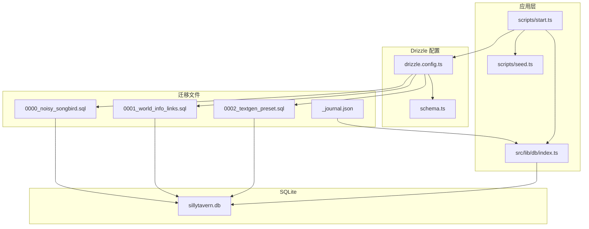
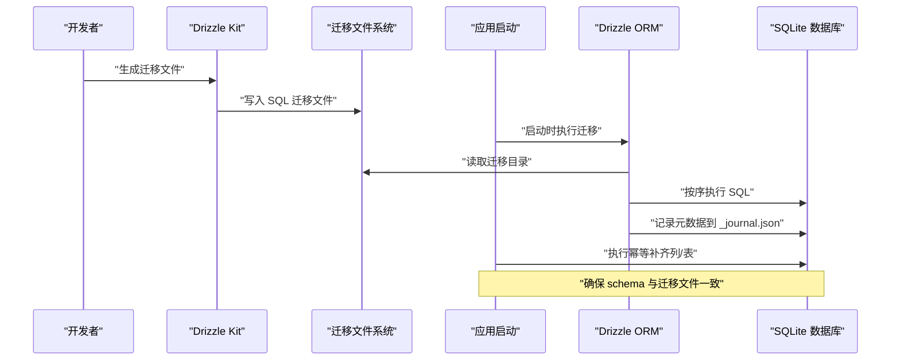
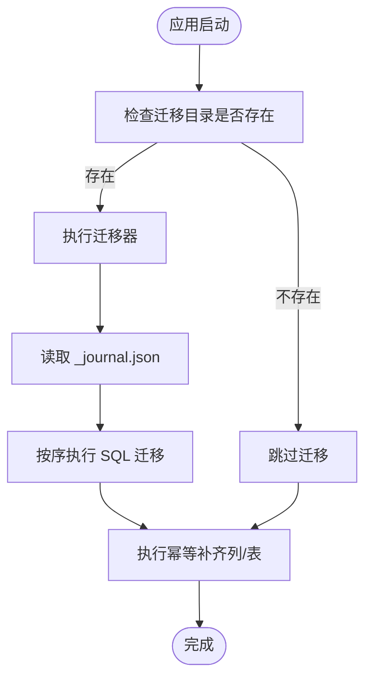
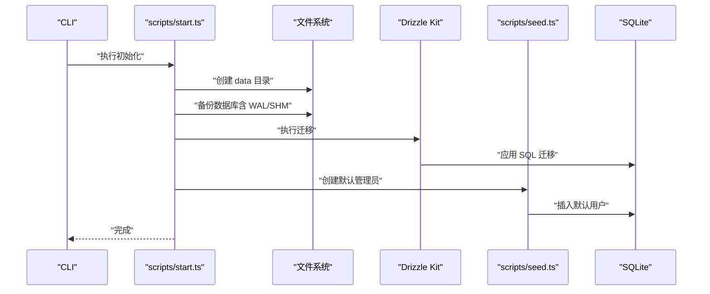
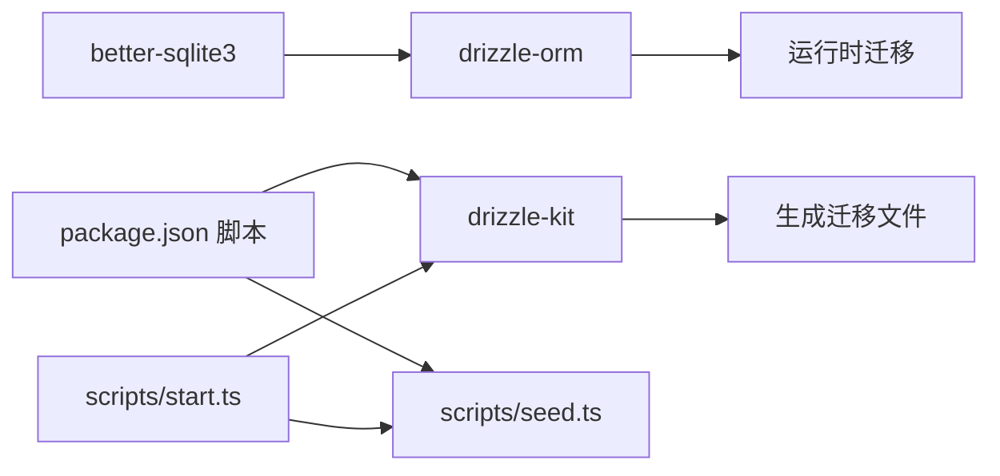

# 数据库迁移管理

<cite>
**本文引用的文件**
- [drizzle.config.ts](file://drizzle.config.ts)
- [schema.ts](file://src/lib/db/schema.ts)
- [_journal.json](file://drizzle/meta/_journal.json)
- [0000_noisy_songbird.sql](file://drizzle/0000_noisy_songbird.sql)
- [0001_world_info_links.sql](file://drizzle/0001_world_info_links.sql)
- [0002_textgen_preset.sql](file://drizzle/0002_textgen_preset.sql)
- [index.ts](file://src/lib/db/index.ts)
- [start.ts](file://scripts/start.ts)
- [seed.ts](file://scripts/seed.ts)
- [package.json](file://package.json)
</cite>

## 目录
1. [简介](#简介)
2. [项目结构](#项目结构)
3. [核心组件](#核心组件)
4. [架构总览](#架构总览)
5. [详细组件分析](#详细组件分析)
6. [依赖关系分析](#依赖关系分析)
7. [性能考量](#性能考量)
8. [故障排除指南](#故障排除指南)
9. [结论](#结论)
10. [附录](#附录)

## 简介
本文件系统性梳理 SillyTavern Next 的数据库迁移管理，围绕 Drizzle ORM 的迁移机制、版本控制策略、迁移文件管理、命名规范、执行顺序与回滚策略进行深入解析，并结合项目实际实现，给出迁移脚本编写指南、最佳实践与生产部署注意事项，以及完整的命令使用说明与故障排除清单。

## 项目结构
本项目采用 Drizzle Kit + Drizzle ORM + better-sqlite3 的组合方案：
- 使用 Drizzle Kit 生成与管理迁移文件
- 使用 Drizzle ORM 在应用启动时执行迁移
- SQLite 作为持久化存储，WAL 模式提升并发写入性能
- 提供一键初始化脚本，包含迁移、备份与默认管理员创建

图表来源
- [drizzle.config.ts:1-11](file://drizzle.config.ts#L1-L11)
- [schema.ts:1-240](file://src/lib/db/schema.ts#L1-L240)
- [_journal.json:1-27](file://drizzle/meta/_journal.json#L1-L27)
- [0000_noisy_songbird.sql:1-161](file://drizzle/0000_noisy_songbird.sql#L1-L161)
- [0001_world_info_links.sql:1-3](file://drizzle/0001_world_info_links.sql#L1-L3)
- [0002_textgen_preset.sql:1-5](file://drizzle/0002_textgen_preset.sql#L1-L5)
- [index.ts:1-134](file://src/lib/db/index.ts#L1-L134)
- [start.ts:1-96](file://scripts/start.ts#L1-L96)
- [seed.ts:1-28](file://scripts/seed.ts#L1-L28)

章节来源
- [drizzle.config.ts:1-11](file://drizzle.config.ts#L1-L11)
- [schema.ts:1-240](file://src/lib/db/schema.ts#L1-L240)
- [index.ts:1-134](file://src/lib/db/index.ts#L1-L134)
- [start.ts:1-96](file://scripts/start.ts#L1-L96)
- [package.json:6-17](file://package.json#L6-L17)

## 核心组件
- Drizzle 配置与 Schema
  - 配置文件定义 schema 文件路径、输出目录、方言与数据库连接信息
  - Schema 定义了用户、角色卡、标签、群组、聊天、消息、世界设定、预设、密钥、设置、模板等核心表及外键关系
- 迁移文件与元数据
  - 迁移文件按序号命名，记录建表、索引、列变更等 SQL
  - 元数据文件记录已执行迁移的版本与时间戳
- 应用内迁移执行
  - 启动时自动调用迁移器，确保数据库结构与迁移文件一致
  - 提供“幂等补齐”逻辑，对遗漏的列进行补充，增强兼容性
- 初始化与种子脚本
  - 一键初始化脚本负责备份、迁移与默认管理员创建
  - 种子脚本幂等创建默认管理员账号

章节来源
- [drizzle.config.ts:1-11](file://drizzle.config.ts#L1-L11)
- [schema.ts:1-240](file://src/lib/db/schema.ts#L1-L240)
- [_journal.json:1-27](file://drizzle/meta/_journal.json#L1-L27)
- [0000_noisy_songbird.sql:1-161](file://drizzle/0000_noisy_songbird.sql#L1-L161)
- [0001_world_info_links.sql:1-3](file://drizzle/0001_world_info_links.sql#L1-L3)
- [0002_textgen_preset.sql:1-5](file://drizzle/0002_textgen_preset.sql#L1-L5)
- [index.ts:16-134](file://src/lib/db/index.ts#L16-L134)
- [start.ts:24-96](file://scripts/start.ts#L24-L96)
- [seed.ts:14-27](file://scripts/seed.ts#L14-L27)

## 架构总览
Drizzle 迁移在本项目中的工作流如下：
- 开发阶段：通过 Drizzle Kit 生成迁移文件，更新 schema 后自动生成 SQL
- 运行阶段：应用启动时自动执行迁移；同时执行“幂等补齐”，保证列一致性
- 生产阶段：通过一键初始化脚本执行迁移、备份与默认管理员创建

图表来源
- [drizzle.config.ts:1-11](file://drizzle.config.ts#L1-L11)
- [schema.ts:1-240](file://src/lib/db/schema.ts#L1-L240)
- [index.ts:16-134](file://src/lib/db/index.ts#L16-L134)
- [_journal.json:1-27](file://drizzle/meta/_journal.json#L1-L27)

## 详细组件分析

### Drizzle 配置与 Schema
- 配置要点
  - schema 指向应用侧的类型化 schema 文件，便于生成迁移与类型安全
  - 输出目录为 drizzle，存放 SQL 迁移与元数据
  - 方言为 sqlite，数据库连接地址优先使用环境变量，否则指向 data 目录下的默认数据库文件
- Schema 设计
  - 采用 sqliteTable 定义各表，包含主键、唯一约束、外键、默认值与时间戳字段
  - 多处使用 JSON 字段存储复杂结构，便于扩展
  - 外键关系覆盖用户、角色卡、群组、聊天、消息、世界设定、预设、密钥、设置、模板等

章节来源
- [drizzle.config.ts:1-11](file://drizzle.config.ts#L1-L11)
- [schema.ts:1-240](file://src/lib/db/schema.ts#L1-L240)

### 迁移文件与元数据
- 命名规范
  - 采用四位零填充序号 + 下划线 + 功能描述的命名方式，如 0000、0001、0002
  - 文件内容为标准 SQL，包含建表、索引、列变更等语句
- 执行顺序
  - Drizzle 按文件名排序依次执行，确保依赖关系正确
  - 元数据文件记录已执行的迁移版本与时间戳，避免重复执行
- 回滚策略
  - 本项目未提供自动回滚脚本；回滚建议通过手动复制备份文件恢复数据库文件及其 WAL/SHM 文件

章节来源
- [0000_noisy_songbird.sql:1-161](file://drizzle/0000_noisy_songbird.sql#L1-L161)
- [0001_world_info_links.sql:1-3](file://drizzle/0001_world_info_links.sql#L1-L3)
- [0002_textgen_preset.sql:1-5](file://drizzle/0002_textgen_preset.sql#L1-L5)
- [_journal.json:1-27](file://drizzle/meta/_journal.json#L1-L27)

### 应用内迁移执行与幂等补齐
- 自动迁移
  - 应用启动时检查迁移目录是否存在，若存在则调用迁移器执行
  - 迁移器会根据元数据判断是否已执行，避免重复执行
- 幂等补齐
  - 对缺失的关键列进行补充，涵盖角色卡、预设、消息、Persona、群组等表
  - 通过 PRAGMA 查询表结构，基于列名集合判断是否需要 ALTER TABLE
  - 若迁移文件未及时更新，仍能保证运行时一致性

图表来源
- [index.ts:16-134](file://src/lib/db/index.ts#L16-L134)
- [_journal.json:1-27](file://drizzle/meta/_journal.json#L1-L27)

章节来源
- [index.ts:16-134](file://src/lib/db/index.ts#L16-L134)

### 一键初始化脚本与种子数据
- 初始化流程
  - 确保 data 目录存在
  - 数据库存在时进行备份（含 WAL/SHM），并清理历史备份
  - 执行 Drizzle 迁移
  - 创建默认管理员账号（幂等）
- 回滚提示
  - 迁移失败时打印回滚命令示例，提示复制备份文件恢复数据库文件与其 WAL/SHM

图表来源
- [start.ts:24-96](file://scripts/start.ts#L24-L96)
- [seed.ts:14-27](file://scripts/seed.ts#L14-L27)

章节来源
- [start.ts:24-96](file://scripts/start.ts#L24-L96)
- [seed.ts:14-27](file://scripts/seed.ts#L14-L27)

## 依赖关系分析
- Drizzle Kit 与 Drizzle ORM
  - Drizzle Kit 用于生成迁移文件，Drizzle ORM 用于运行时迁移与查询
- better-sqlite3
  - 提供 SQLite 连接与 PRAGMA 支持，用于幂等补齐与 WAL/foreign_keys 配置
- 应用脚本
  - 通过 npm scripts 调用 Drizzle Kit 与种子脚本，形成完整的初始化流程

图表来源
- [package.json:6-17](file://package.json#L6-L17)
- [start.ts:65-83](file://scripts/start.ts#L65-L83)
- [seed.ts:14-27](file://scripts/seed.ts#L14-L27)

章节来源
- [package.json:6-17](file://package.json#L6-L17)
- [start.ts:65-83](file://scripts/start.ts#L65-L83)
- [seed.ts:14-27](file://scripts/seed.ts#L14-L27)

## 性能考量
- WAL 模式
  - 启动时启用 WAL 模式，提升并发写入性能，减少锁竞争
- 外键约束
  - 启用外键约束，保证数据一致性，但可能影响部分写入性能
- 幂等补齐
  - 通过 PRAGMA 查询表结构，避免重复 ALTER TABLE，降低运行时开销
- 备份策略
  - 初始化前自动备份数据库及其 WAL/SHM 文件，确保回滚时数据完整性

章节来源
- [index.ts:10-11](file://src/lib/db/index.ts#L10-L11)
- [start.ts:40-62](file://scripts/start.ts#L40-L62)

## 故障排除指南
- 迁移失败
  - 现象：初始化或启动时报错
  - 排查：查看错误日志，确认迁移文件语法与目标数据库兼容性
  - 回滚：根据失败提示复制备份文件恢复数据库文件与其 WAL/SHM
- 数据库文件损坏
  - 现象：无法打开数据库或迁移中断
  - 排查：检查 data 目录权限与磁盘空间
  - 处理：从最近备份恢复，并重新执行迁移
- 列缺失导致查询异常
  - 现象：运行时报错或字段为空
  - 处理：确认幂等补齐逻辑是否执行，必要时手动执行 ALTER TABLE 或等待下次启动补齐
- 权限问题
  - 现象：无法创建 data 目录或写入数据库
  - 处理：确保进程对 data 目录具有读写权限

章节来源
- [start.ts:70-83](file://scripts/start.ts#L70-L83)
- [index.ts:26-28](file://src/lib/db/index.ts#L26-L28)
- [index.ts:129-131](file://src/lib/db/index.ts#L129-L131)

## 结论
本项目通过 Drizzle Kit 与 Drizzle ORM 实现了完善的数据库迁移管理：以类型化 schema 为源，生成有序的 SQL 迁移文件，并在应用启动时自动执行；配合元数据记录与幂等补齐逻辑，确保运行时一致性与稳定性。一键初始化脚本进一步简化了开发与生产部署流程，提供了备份与回滚保障。建议在团队协作中严格遵循迁移命名规范与提交流程，确保迁移文件的可追溯性与可维护性。

## 附录

### 迁移命令使用说明
- 生成迁移文件
  - 使用 Drizzle Kit 生成迁移文件，更新 schema 后自动生成 SQL
- 执行迁移
  - 应用启动时自动执行迁移
  - 也可通过脚本显式执行迁移
- 初始化与种子
  - 一键初始化脚本会自动备份、迁移并创建默认管理员
  - 种子脚本幂等创建默认管理员账号

章节来源
- [package.json:10-13](file://package.json#L10-L13)
- [start.ts:65-83](file://scripts/start.ts#L65-L83)
- [seed.ts:14-27](file://scripts/seed.ts#L14-L27)

### 迁移文件编写指南与最佳实践
- 命名规范
  - 使用四位零填充序号 + 下划线 + 功能描述，保持顺序稳定
- 变更策略
  - 优先使用 ALTER TABLE 添加列，避免重建表
  - 对于复杂变更，先在测试环境验证后再合并
- 兼容性
  - 保持幂等性，避免重复执行导致错误
  - 与应用内的幂等补齐逻辑协同，确保运行时一致性
- 测试方法
  - 在隔离环境中执行迁移，验证表结构与索引
  - 对关键查询路径进行回归测试
- 生产部署注意事项
  - 部署前进行备份，包含数据库文件及其 WAL/SHM
  - 使用一键初始化脚本，确保迁移与默认数据的一致性
  - 监控迁移日志，出现异常及时回滚

章节来源
- [0000_noisy_songbird.sql:1-161](file://drizzle/0000_noisy_songbird.sql#L1-L161)
- [0001_world_info_links.sql:1-3](file://drizzle/0001_world_info_links.sql#L1-L3)
- [0002_textgen_preset.sql:1-5](file://drizzle/0002_textgen_preset.sql#L1-L5)
- [index.ts:16-134](file://src/lib/db/index.ts#L16-L134)
- [start.ts:24-96](file://scripts/start.ts#L24-L96)