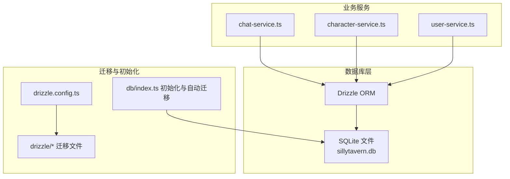
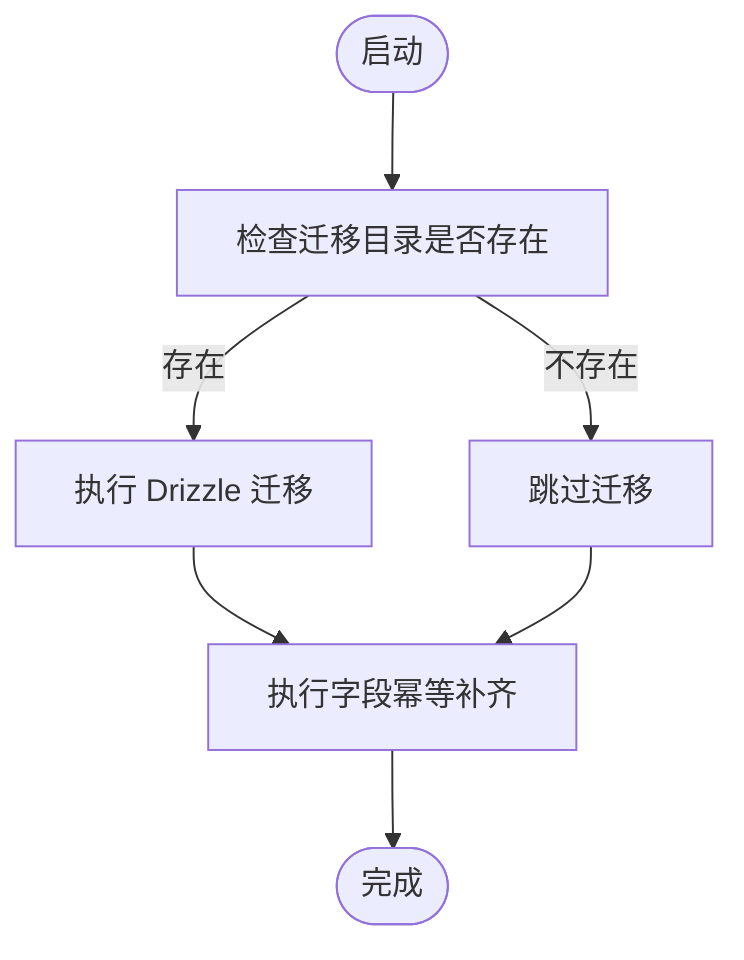

# 数据模型与表结构

<cite>
**本文引用的文件**   
- [drizzle.config.ts](file://drizzle.config.ts)
- [schema.ts](file://src/lib/db/schema.ts)
- [0000_noisy_songbird.sql](file://drizzle/0000_noisy_songbird.sql)
- [0001_world_info_links.sql](file://drizzle/0001_world_info_links.sql)
- [0002_textgen_preset.sql](file://drizzle/0002_textgen_preset.sql)
- [index.ts](file://src/lib/db/index.ts)
- [migrate.ts](file://src/lib/db/migrate.ts)
- [chat-service.ts](file://src/lib/services/chat-service.ts)
- [character-service.ts](file://src/lib/services/character-service.ts)
- [user-service.ts](file://src/lib/services/user-service.ts)
- [index.ts](file://src/types/index.ts)
</cite>

## 目录
1. [简介](#简介)
2. [项目结构](#项目结构)
3. [核心组件](#核心组件)
4. [架构总览](#架构总览)
5. [详细组件分析](#详细组件分析)
6. [依赖分析](#依赖分析)
7. [性能考虑](#性能考虑)
8. [故障排查指南](#故障排查指南)
9. [结论](#结论)
10. [附录](#附录)

## 简介
本文件系统性梳理 SillyTavern Next 的数据库数据模型，聚焦核心表结构、字段语义、数据类型选择、外键关系、索引与约束，并结合迁移脚本与服务层实现，解释 JSON 字段的使用场景与数据格式规范。目标读者包括开发者、运维与产品同学，帮助快速理解与使用数据库层。

## 项目结构
- 数据库方言与存储：采用 SQLite（better-sqlite3），通过 Drizzle ORM 映射。
- 迁移与版本管理：使用 Drizzle Kit 生成迁移文件，配合运行时“幂等补齐”确保字段一致性。
- 类型体系：在 TypeScript 层提供强类型接口，驱动数据库字段与业务对象的双向映射。



图表来源
- [drizzle.config.ts:1-11](file://drizzle.config.ts#L1-L11)
- [index.ts:1-134](file://src/lib/db/index.ts#L1-L134)
- [migrate.ts:1-33](file://src/lib/db/migrate.ts#L1-L33)

章节来源
- [drizzle.config.ts:1-11](file://drizzle.config.ts#L1-L11)
- [index.ts:1-134](file://src/lib/db/index.ts#L1-L134)

## 核心组件
本节按“用户-角色-群组-聊天-消息-世界设定-预设-密钥-设置-模板”顺序，逐表说明结构设计、字段语义与约束。

- 用户表 users
  - 主键：id（文本）
  - 唯一：handle（文本）
  - 字段要点：name、password、salt、avatar、admin（布尔）、enabled（布尔）、createdAt（时间戳）
  - 业务含义：用户身份凭证与基础资料；admin/enabled 控制权限与启用状态；createdAt 自动生成

- 角色表 characters
  - 主键：id；外键：userId → users.id
  - V1 基础字段：name、description、personality、scenario、firstMessage、exampleDialogue
  - V2 扩展字段：creatorNotes、systemPrompt、postHistoryInstructions、alternateGreetings（JSON 字符串数组）、tags（JSON 字符串数组）
  - ST 扩展字段：talkativeness（实数）、fav（布尔）、avatar
  - JSON 扩展：extensions（Record<string, unknown>）、characterBook（V2 character_book）
  - 关联：worldInfoBookId（可选，指向 world_info.id）
  - 时间：createDate（ISO 字符串）、createdAt/updatedAt（时间戳）

- 标签表 tags
  - 主键：id；外键：userId → users.id
  - 字段：name、color、color2、createdAt

- 角色-标签关联表 character_tags
  - 主键：id；外键：characterId → characters.id（级联删除）、tagId → tags.id（级联删除）

- Persona 表 personas
  - 主键：id；外键：userId → users.id
  - 字段：name、description、avatar、isActive/isDefault（布尔）、descriptionPosition（枚举整数）、depth、depthRole（枚举整数）、lorebookId、connections（JSON）

- 群组表 groups
  - 主键：id；外键：userId → users.id
  - 成员：members/disabledMembers（JSON 字符串数组）
  - 行为：fav、activationStrategy、generationMode、allowSelfResponses（布尔）、generationModeJoinPrefix/Suffix（字符串）、autoModeDelay（整数）、hideMutedSprites（布尔）、dateLastChat（整数）、chatMetadata（JSON）
  - 时间：createdAt/updatedAt

- 聊天表 chats
  - 主键：id；外键：userId → users.id；characterId → characters.id（删除时置空）、groupId → groups.id（删除时置空）
  - 字段：title、metadata（JSON：包含 note_prompt、note_interval、note_position、chat_scenario 等）
  - 时间：createdAt/updatedAt

- 消息表 messages
  - 主键：id；外键：chatId → chats.id（级联删除）
  - 字段：name、isUser（布尔）、content、role（枚举："user"/"assistant"/"system"）、swipes（JSON 字符串数组）、swipeId（整数）、swipeInfo（JSON SwipeInfo[]）、isSystem（布尔）、forceAvatar/originalAvatar（字符串）、genStarted/genFinished（字符串）、bookmarkLink（字符串）、extra（JSON MessageExtra）、sendDate（字符串）、createdAt（时间戳）

- 世界设定表 world_info
  - 主键：id；外键：userId → users.id
  - 字段：name、entries（JSON：Record<string, WIEntry>）、createdAt/updatedAt

- 预设表 presets
  - 主键：id；外键：userId → users.id
  - 字段：name、provider（AI 提供商枚举）、api_type（文本）、settings（JSON：TextGenSettings 或其他形状）、isDefault/isActive（布尔）、createdAt/updatedAt
  - 迁移补充：api_type、is_active

- API 密钥表 secrets
  - 主键：id；外键：userId → users.id
  - 字段：key、value、createdAt

- 用户设置表 settings
  - 主键：id；外键：userId → users.id（唯一约束）
  - 字段：data（JSON）、updatedAt

- Instruct 模板表 instruct_templates
  - 主键：id；外键：userId → users.id
  - 字段：name、content（JSON：InstructTemplate）、createdAt

- 上下文模板表 context_templates
  - 主键：id；外键：userId → users.id
  - 字段：name、content（story_string 模板）、createdAt

章节来源
- [schema.ts:6-53](file://src/lib/db/schema.ts#L6-L53)
- [schema.ts:58-65](file://src/lib/db/schema.ts#L58-L65)
- [schema.ts:70-74](file://src/lib/db/schema.ts#L70-L74)
- [schema.ts:79-98](file://src/lib/db/schema.ts#L79-L98)
- [schema.ts:103-126](file://src/lib/db/schema.ts#L103-L126)
- [schema.ts:131-140](file://src/lib/db/schema.ts#L131-L140)
- [schema.ts:145-168](file://src/lib/db/schema.ts#L145-L168)
- [schema.ts:173-180](file://src/lib/db/schema.ts#L173-L180)
- [schema.ts:185-196](file://src/lib/db/schema.ts#L185-L196)
- [schema.ts:201-207](file://src/lib/db/schema.ts#L201-L207)
- [schema.ts:212-217](file://src/lib/db/schema.ts#L212-L217)
- [schema.ts:222-228](file://src/lib/db/schema.ts#L222-L228)
- [schema.ts:233-239](file://src/lib/db/schema.ts#L233-L239)

## 架构总览
下图展示核心实体与外键关系，以及 JSON 字段的分布与用途。

```mermaid
erDiagram
USERS {
text id PK
text name
text handle UK
text password
text salt
text avatar
boolean admin
boolean enabled
integer created_at
}
CHARACTERS {
text id PK
text user_id FK
text name
text description
text personality
text scenario
text first_message
text example_dialogue
text creator_notes
text system_prompt
text post_history_instructions
text alternate_greetings
text tags
text creator
text character_version
real talkativeness
boolean fav
text avatar
text extensions
text character_book
text world_info_book_id
text create_date
integer created_at
integer updated_at
}
TAGS {
text id PK
text user_id FK
text name
text color
text color2
integer created_at
}
CHARACTER_TAGS {
text id PK
text character_id FK
text tag_id FK
}
PERSONAS {
text id PK
text user_id FK
text name
text description
text avatar
boolean is_active
boolean is_default
integer description_position
integer depth
integer depth_role
text lorebook_id
text connections
integer created_at
}
GROUPS {
text id PK
text user_id FK
text name
text members
text disabled_members
text avatar
boolean fav
integer activation_strategy
integer generation_mode
boolean allow_self_responses
text generation_mode_join_prefix
text generation_mode_join_suffix
integer auto_mode_delay
boolean hide_muted_sprites
integer date_last_chat
text chat_metadata
integer created_at
integer updated_at
}
CHATS {
text id PK
text user_id FK
text character_id FK
text group_id FK
text title
text metadata
integer created_at
integer updated_at
}
MESSAGES {
text id PK
text chat_id FK
text name
boolean is_user
text content
text role
text swipes
integer swipe_id
text swipe_info
boolean is_system
text force_avatar
text original_avatar
text gen_started
text gen_finished
text bookmark_link
text extra
text send_date
integer created_at
}
WORLD_INFO {
text id PK
text user_id FK
text name
text entries
integer created_at
integer updated_at
}
PRESETS {
text id PK
text user_id FK
text name
text provider
text api_type
text settings
boolean is_default
boolean is_active
integer created_at
integer updated_at
}
SECRETS {
text id PK
text user_id FK
text key
text value
integer created_at
}
SETTINGS {
text id PK
text user_id FK UK
text data
integer updated_at
}
INSTRUCT_TEMPLATES {
text id PK
text user_id FK
text name
text content
integer created_at
}
CONTEXT_TEMPLATES {
text id PK
text user_id FK
text name
text content
integer created_at
}
USERS ||--o{ CHARACTERS : "拥有"
USERS ||--o{ TAGS : "拥有"
USERS ||--o{ PERSONAS : "拥有"
USERS ||--o{ GROUPS : "拥有"
USERS ||--o{ CHATS : "拥有"
USERS ||--o{ PRESETS : "拥有"
USERS ||--o{ SECRETS : "拥有"
USERS ||--o{ SETTINGS : "拥有"
USERS ||--o{ INSTRUCT_TEMPLATES : "拥有"
USERS ||--o{ CONTEXT_TEMPLATES : "拥有"
CHARACTERS ||--o{ CHATS : "关联(可为空)"
GROUPS ||--o{ CHATS : "关联(可为空)"
CHARACTERS ||--o{ CHARACTER_TAGS : "多对多"
TAGS ||--o{ CHARACTER_TAGS : "多对多"
CHATS ||--o{ MESSAGES : "一对多(级联删除)"
```

图表来源
- [schema.ts:6-53](file://src/lib/db/schema.ts#L6-L53)
- [schema.ts:58-65](file://src/lib/db/schema.ts#L58-L65)
- [schema.ts:70-74](file://src/lib/db/schema.ts#L70-L74)
- [schema.ts:79-98](file://src/lib/db/schema.ts#L79-L98)
- [schema.ts:103-126](file://src/lib/db/schema.ts#L103-L126)
- [schema.ts:131-140](file://src/lib/db/schema.ts#L131-L140)
- [schema.ts:145-168](file://src/lib/db/schema.ts#L145-L168)
- [schema.ts:173-180](file://src/lib/db/schema.ts#L173-L180)
- [schema.ts:185-196](file://src/lib/db/schema.ts#L185-L196)
- [schema.ts:201-207](file://src/lib/db/schema.ts#L201-L207)
- [schema.ts:212-217](file://src/lib/db/schema.ts#L212-L217)
- [schema.ts:222-228](file://src/lib/db/schema.ts#L222-L228)
- [schema.ts:233-239](file://src/lib/db/schema.ts#L233-L239)

## 详细组件分析

### 用户表 users
- 设计要点
  - 主键 id 采用文本 UUID；handle 唯一，作为登录凭据
  - 密码与盐分离存储，布尔 admin/enabled 控制管理员与启用状态
  - createdAt 使用默认函数生成时间戳
- JSON 字段
  - 无 JSON 字段
- 约束与索引
  - handle 唯一索引（迁移脚本可见）
- 业务含义
  - 用户身份、认证与权限入口；与所有资源表通过 userId 关联

章节来源
- [schema.ts:6-16](file://src/lib/db/schema.ts#L6-L16)
- [0000_noisy_songbird.sql:139-149](file://drizzle/0000_noisy_songbird.sql#L139-L149)

### 角色表 characters
- 设计要点
  - 外键 userId → users.id
  - V1/V2/TavernCard 兼容字段齐全；ST 扩展 talkativeness/fav/avatar
  - JSON 字段：alternateGreetings/tags（字符串数组）、extensions（Record<string, unknown>）、characterBook（V2 character_book）
  - 关联字段：worldInfoBookId（可选）
  - 时间字段：createDate（ISO 字符串）、createdAt/updatedAt
- JSON 字段规范
  - alternateGreetings/tags：字符串数组
  - extensions：键值对，运行时可扩展
  - characterBook：V2 character_book 结构
- 约束与索引
  - 无显式索引；通过 userId 与 JSON 查询建议在应用层控制
- 业务含义
  - 角色卡载体，兼容 TavernCard V2 规范；支持 ST 扩展与世界书绑定

章节来源
- [schema.ts:21-53](file://src/lib/db/schema.ts#L21-L53)
- [character-service.ts:86-113](file://src/lib/services/character-service.ts#L86-L113)

### 标签表 tags 与角色-标签关联表 character_tags
- 设计要点
  - tags：name/color/color2，用户维度
  - character_tags：多对多关联，外键均设置级联删除，保证数据整洁
- 业务含义
  - 为角色打标，便于筛选与管理

章节来源
- [schema.ts:58-74](file://src/lib/db/schema.ts#L58-L74)
- [0000_noisy_songbird.sql:1-7](file://drizzle/0000_noisy_songbird.sql#L1-L7)

### Persona 表 personas
- 设计要点
  - 外键 userId → users.id
  - 描述注入位置、深度与角色、世界书绑定、连接关系（JSON）
  - isDefault/isActive 控制默认与激活状态
- JSON 字段规范
  - connections：数组元素包含 type（character/group）与 id
- 业务含义
  - 角色描述注入策略与上下文绑定

章节来源
- [schema.ts:79-98](file://src/lib/db/schema.ts#L79-L98)
- [index.ts:512-532](file://src/types/index.ts#L512-L532)

### 群组表 groups
- 设计要点
  - 外键 userId → users.id
  - 成员列表 members/disabledMembers（JSON 字符串数组）
  - 生成策略：activationStrategy/generationMode、自连接策略（joinPrefix/Suffix）、自动模式延迟、隐藏静音成员头像
  - 会话元数据：chatMetadata（JSON）
  - 时间：createdAt/updatedAt
- JSON 字段规范
  - members/disabledMembers：字符串数组（角色 id）
  - chatMetadata：Record<string, unknown>
- 业务含义
  - 多角色协同生成与会话管理

章节来源
- [schema.ts:103-126](file://src/lib/db/schema.ts#L103-L126)
- [index.ts:272-286](file://src/types/index.ts#L272-L286)

### 聊天表 chats
- 设计要点
  - 外键 userId → users.id；characterId/groupId → characters/groups（删除时置空）
  - metadata（JSON）承载聊天级世界书 ID 列表、提示与间隔等
  - createdAt/updatedAt
- JSON 字段规范
  - metadata：包含 note_prompt、note_interval、note_position、chat_scenario、world_info_book_ids 等
- 业务含义
  - 会话容器，承载消息与上下文元信息

章节来源
- [schema.ts:131-140](file://src/lib/db/schema.ts#L131-L140)
- [index.ts:248-267](file://src/types/index.ts#L248-L267)

### 消息表 messages
- 设计要点
  - 外键 chatId → chats.id（级联删除）
  - 角色枚举 role ∈ {"user","assistant","system"}
  - Swipe 系统：swipes（JSON 字符串数组）、swipeId、swipeInfo（JSON SwipeInfo[]）
  - 状态与头像：isSystem、forceAvatar、originalAvatar
  - 生成时间：genStarted/genFinished
  - 书签：bookmarkLink
  - 扩展：extra（JSON MessageExtra）
  - createdAt
- JSON 字段规范
  - swipes：字符串数组
  - swipeInfo：SwipeInfo[]（与 swipes 一一对应）
  - extra：MessageExtra（包含模型、Token、推理、媒体、标题等）
- 业务含义
  - 对话内容与元数据载体，支持多轮编辑与推理追踪

章节来源
- [schema.ts:145-168](file://src/lib/db/schema.ts#L145-L168)
- [index.ts:58-131](file://src/types/index.ts#L58-L131)
- [chat-service.ts:34-54](file://src/lib/services/chat-service.ts#L34-L54)

### 世界设定表 world_info
- 设计要点
  - 外键 userId → users.id
  - entries（JSON）：Record<string, WIEntry>
  - createdAt/updatedAt
- JSON 字段规范
  - entries：键为词条标识，值为 WIEntry 结构
- 业务含义
  - 角色/聊天级世界书，支持关键词匹配与插入策略

章节来源
- [schema.ts:173-180](file://src/lib/db/schema.ts#L173-L180)
- [index.ts:368-426](file://src/types/index.ts#L368-L426)

### 预设表 presets
- 设计要点
  - 外键 userId → users.id
  - provider（AI 提供商枚举）、api_type、settings（JSON）
  - isDefault/isActive 控制默认与激活
  - createdAt/updatedAt
- 迁移补充
  - api_type、is_active 由迁移脚本补齐
- JSON 字段规范
  - settings：TextGenSettings 或其他预设形状
- 业务含义
  - 文本补全与对话生成参数模板

章节来源
- [schema.ts:185-196](file://src/lib/db/schema.ts#L185-L196)
- [0002_textgen_preset.sql:1-5](file://drizzle/0002_textgen_preset.sql#L1-L5)
- [index.ts:289-318](file://src/types/index.ts#L289-L318)

### API 密钥表 secrets
- 设计要点
  - 外键 userId → users.id
  - key/value 存储密钥与值
  - createdAt
- 业务含义
  - 用户级 API 凭证管理

章节来源
- [schema.ts:201-207](file://src/lib/db/schema.ts#L201-L207)

### 用户设置表 settings
- 设计要点
  - 外键 userId → users.id（唯一约束）
  - data（JSON）：用户偏好与配置
  - updatedAt
- 业务含义
  - 用户个性化设置持久化

章节来源
- [schema.ts:212-217](file://src/lib/db/schema.ts#L212-L217)
- [0000_noisy_songbird.sql:128](file://drizzle/0000_noisy_songbird.sql#L128)

### Instruct 模板表 instruct_templates
- 设计要点
  - 外键 userId → users.id
  - content（JSON）：InstructTemplate
  - createdAt
- 业务含义
  - 指令模板集合

章节来源
- [schema.ts:222-228](file://src/lib/db/schema.ts#L222-L228)

### 上下文模板表 context_templates
- 设计要点
  - 外键 userId → users.id
  - content（文本）：story_string 模板
  - createdAt
- 业务含义
  - 上下文注入模板

章节来源
- [schema.ts:233-239](file://src/lib/db/schema.ts#L233-L239)

## 依赖分析
- 外键关系
  - users → characters、tags、personas、groups、chats、presets、secrets、settings、instruct_templates、context_templates
  - characters → chats（删除置空）、character_tags（级联删除）
  - tags → character_tags（级联删除）
  - chats → messages（级联删除）
- 约束与索引
  - users.handle 唯一
  - settings.user_id 唯一
- 运行时补齐
  - db/index.ts 在启动时对 characters/presets/messages/personas/groups 等表进行“幂等补齐”，确保字段存在性与默认值



图表来源
- [index.ts:16-134](file://src/lib/db/index.ts#L16-L134)
- [migrate.ts:10-26](file://src/lib/db/migrate.ts#L10-L26)

章节来源
- [index.ts:16-134](file://src/lib/db/index.ts#L16-L134)
- [migrate.ts:10-26](file://src/lib/db/migrate.ts#L10-L26)

## 性能考虑
- 索引现状
  - 当前迁移脚本未显式创建二级索引；建议在高频查询字段（如 users.handle、characters.userId/name、chats.userId/characterId/groupId、messages.chatId）上评估添加索引
- JSON 查询
  - JSON 字段（如 tags、alternateGreetings、settings、metadata、entries、connections、extra）在 SQLite 中查询效率较低，建议在应用层做缓存或物化字段
- 外键与级联
  - character_tags 与 messages 的级联删除保证数据一致性，但批量删除时需关注性能与事务边界
- WAL 与外键
  - 启用 WAL 与外键，提升并发写入与参照完整性

## 故障排查指南
- 认证失败
  - 检查 users.enabled 是否为真；确认密码与盐匹配
- 角色/聊天/消息缺失
  - 确认外键 userId 是否正确；角色删除时 chats.characterId 会被置空，需重新关联
- JSON 解析异常
  - 检查 JSON 字段是否为合法结构；服务层提供安全解析函数，避免异常传播
- 迁移失败
  - 查看 db/index.ts 的自动迁移与幂等补齐逻辑；确认 drizzle 目录存在且权限正确

章节来源
- [user-service.ts:64-69](file://src/lib/services/user-service.ts#L64-L69)
- [chat-service.ts:25-32](file://src/lib/services/chat-service.ts#L25-L32)
- [index.ts:16-134](file://src/lib/db/index.ts#L16-L134)

## 结论
本数据模型围绕“用户-角色-群组-聊天-消息-世界设定-预设-密钥-设置-模板”的完整链路构建，兼顾 TavernCard V2 兼容性与 SillyTavern 扩展能力。通过 JSON 字段承载灵活配置与运行时扩展，配合 Drizzle ORM 与 SQLite 的轻量部署，满足中小规模到中等规模的使用需求。建议后续根据实际查询热点补充索引，并对 JSON 查询进行应用层优化与缓存。

## 附录
- 迁移历史摘要
  - 0000：初始表结构（users、characters、chats、messages、tags、settings、presets、secrets、world_info、instruct_templates、context_templates）
  - 0001：为 characters 增加 character_book 与 world_info_book_id
  - 0002：为 presets 增加 api_type 与 is_active
- 类型与枚举参考
  - AIProvider：涵盖主流与自定义提供商
  - MessageRole：user/assistant/system
  - Persona 描述注入位置与深度角色枚举
  - WorldInfo 词条位置、逻辑与插入策略枚举

章节来源
- [0000_noisy_songbird.sql:1-161](file://drizzle/0000_noisy_songbird.sql#L1-L161)
- [0001_world_info_links.sql:1-3](file://drizzle/0001_world_info_links.sql#L1-L3)
- [0002_textgen_preset.sql:1-5](file://drizzle/0002_textgen_preset.sql#L1-L5)
- [index.ts:4-50](file://src/types/index.ts#L4-L50)
- [index.ts:53-55](file://src/types/index.ts#L53-L55)
- [index.ts:325-362](file://src/types/index.ts#L325-L362)