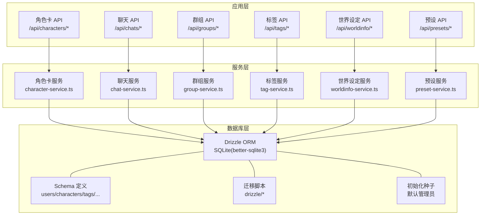
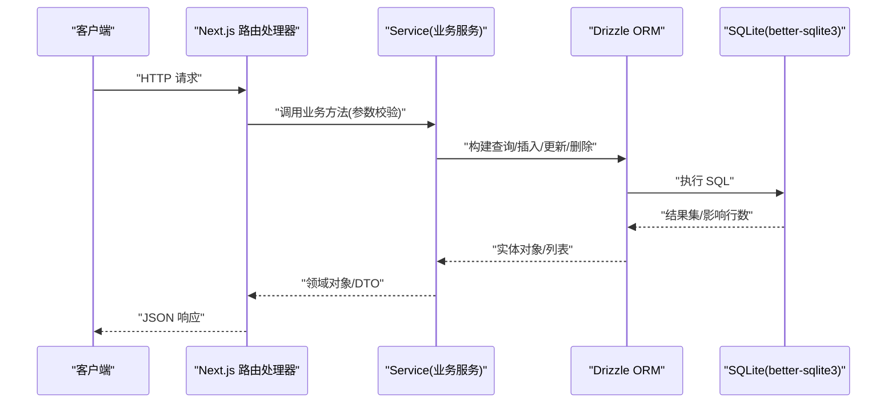
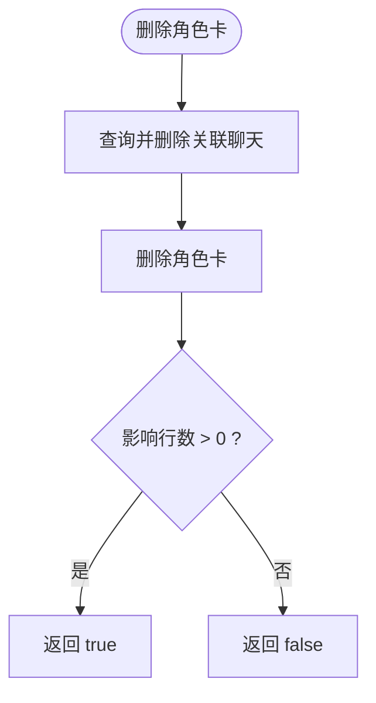
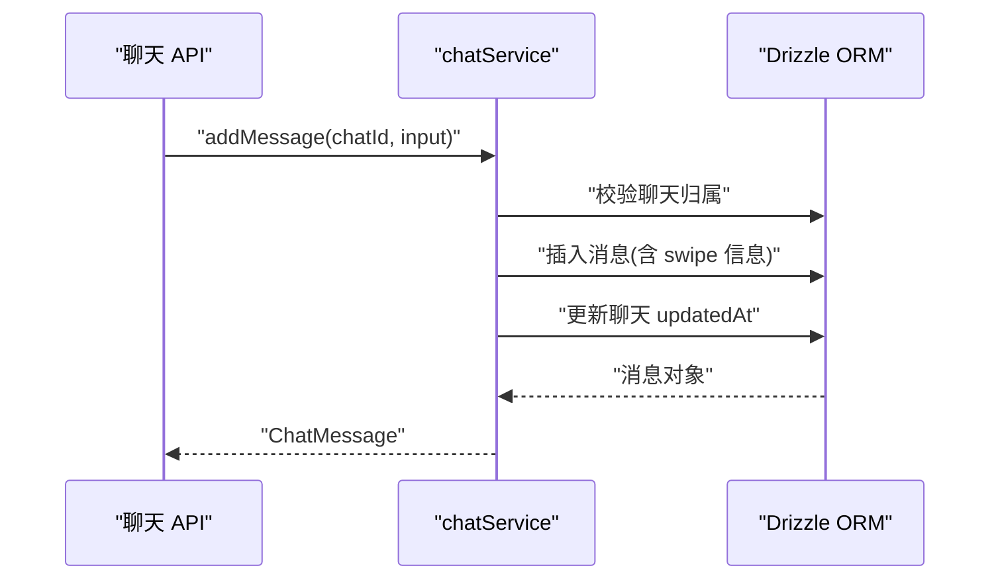
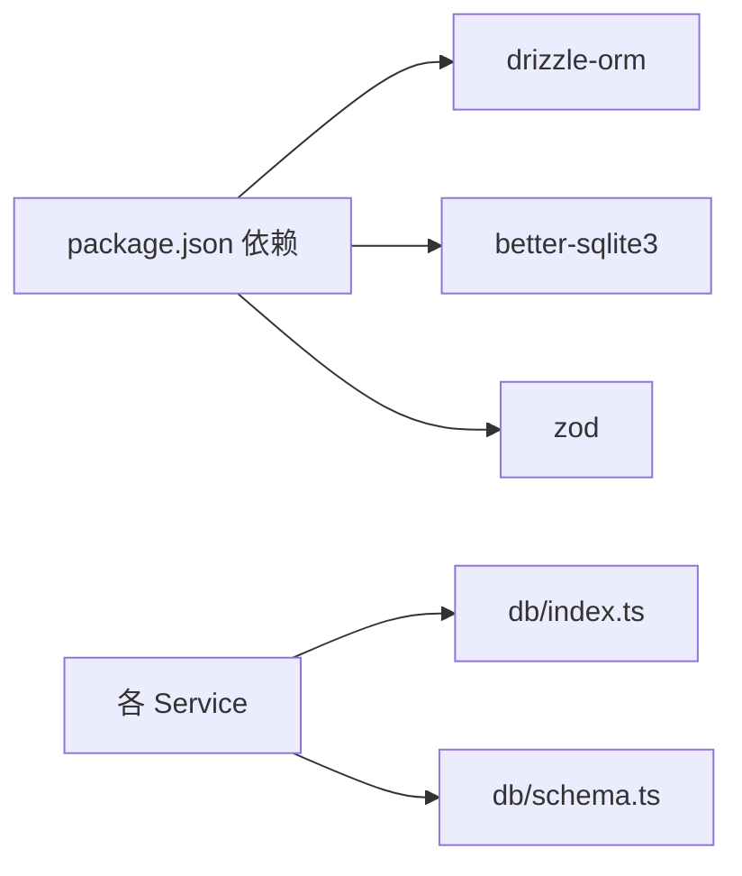

# 数据访问模式

<cite>
**本文档引用的文件**
- [drizzle.config.ts](file://drizzle.config.ts)
- [package.json](file://package.json)
- [schema.ts](file://src/lib/db/schema.ts)
- [index.ts](file://src/lib/db/index.ts)
- [migrate.ts](file://src/lib/db/migrate.ts)
- [seed.ts](file://src/lib/db/seed.ts)
- [character-service.ts](file://src/lib/services/character-service.ts)
- [chat-service.ts](file://src/lib/services/chat-service.ts)
- [group-service.ts](file://src/lib/services/group-service.ts)
- [tag-service.ts](file://src/lib/services/tag-service.ts)
- [worldinfo-service.ts](file://src/lib/services/worldinfo-service.ts)
- [preset-service.ts](file://src/lib/services/preset-service.ts)
</cite>

## 目录
1. [引言](#引言)
2. [项目结构](#项目结构)
3. [核心组件](#核心组件)
4. [架构总览](#架构总览)
5. [详细组件分析](#详细组件分析)
6. [依赖关系分析](#依赖关系分析)
7. [性能考量](#性能考量)
8. [故障排查指南](#故障排查指南)
9. [结论](#结论)
10. [附录](#附录)

## 引言
本设计文档聚焦 SillyTavern Next 的数据访问模式，系统性阐述基于 Drizzle ORM + better-sqlite3 的 Repository 风格封装、Service 层职责划分、数据访问抽象与边界、CRUD 实现、批量与复杂查询处理、数据验证、事务管理与并发控制策略，并给出接口设计、依赖注入思路、单元测试策略以及性能优化与缓存建议。目标是帮助开发者在保持业务清晰的同时，获得稳定、可维护且高性能的数据层。

## 项目结构
- 数据库配置与迁移
  - Drizzle 配置指向 schema 文件与 SQLite 数据库路径
  - 迁移脚本与自动迁移在应用启动时执行
  - 初始化种子数据（默认管理员）
- 数据模型
  - 采用 Drizzle SQLite 表定义，涵盖用户、角色卡、标签、群组、聊天、消息、世界设定、预设、密钥、设置、模板等
- 服务层
  - 每个领域实体对应独立 Service，负责业务规则、输入校验、序列化/反序列化、跨表级联与约束处理
- API 层
  - Next.js App Router 路由处理器通过 Service 完成数据访问与业务编排

图表来源
- [drizzle.config.ts:1-11](file://drizzle.config.ts#L1-L11)
- [schema.ts:1-240](file://src/lib/db/schema.ts#L1-L240)
- [index.ts:1-134](file://src/lib/db/index.ts#L1-L134)
- [migrate.ts:1-34](file://src/lib/db/migrate.ts#L1-L34)
- [seed.ts:1-40](file://src/lib/db/seed.ts#L1-L40)
- [character-service.ts:1-252](file://src/lib/services/character-service.ts#L1-L252)
- [chat-service.ts:1-301](file://src/lib/services/chat-service.ts#L1-L301)
- [group-service.ts:1-174](file://src/lib/services/group-service.ts#L1-L174)
- [tag-service.ts:1-209](file://src/lib/services/tag-service.ts#L1-L209)
- [worldinfo-service.ts:1-428](file://src/lib/services/worldinfo-service.ts#L1-L428)
- [preset-service.ts:1-323](file://src/lib/services/preset-service.ts#L1-L323)

章节来源
- [drizzle.config.ts:1-11](file://drizzle.config.ts#L1-L11)
- [schema.ts:1-240](file://src/lib/db/schema.ts#L1-L240)
- [index.ts:1-134](file://src/lib/db/index.ts#L1-L134)
- [migrate.ts:1-34](file://src/lib/db/migrate.ts#L1-L34)
- [seed.ts:1-40](file://src/lib/db/seed.ts#L1-L40)

## 核心组件
- 数据库连接与迁移
  - 使用 better-sqlite3 初始化连接，启用 WAL 模式与外键检查
  - 启动时自动执行迁移，确保数据库结构与迁移脚本一致
  - 提供幂等字段补齐逻辑，兼容历史版本字段缺失
- 数据模型与关系
  - 采用 Drizzle SQLite 表定义，明确主键、外键、索引与默认值
  - 复杂实体（如角色卡、消息、世界设定）采用 JSON 字段存储扩展信息，便于向前兼容
- 服务层抽象
  - 每个实体一个 Service，统一提供 CRUD、搜索、过滤、批量操作与复杂查询
  - 输入使用 Zod Schema 校验，输出进行安全 JSON 解析与序列化
  - 跨表约束与级联删除在 Service 中显式处理，避免孤儿数据

章节来源
- [index.ts:1-134](file://src/lib/db/index.ts#L1-L134)
- [schema.ts:1-240](file://src/lib/db/schema.ts#L1-L240)
- [character-service.ts:1-252](file://src/lib/services/character-service.ts#L1-L252)
- [chat-service.ts:1-301](file://src/lib/services/chat-service.ts#L1-L301)
- [group-service.ts:1-174](file://src/lib/services/group-service.ts#L1-L174)
- [tag-service.ts:1-209](file://src/lib/services/tag-service.ts#L1-L209)
- [worldinfo-service.ts:1-428](file://src/lib/services/worldinfo-service.ts#L1-L428)
- [preset-service.ts:1-323](file://src/lib/services/preset-service.ts#L1-L323)

## 架构总览
数据访问采用“Repository 风格 + Service 层”的分层设计：
- Repository 风格：Service 内部封装数据库操作，暴露领域方法（如 create、update、delete、getAll、getById 等），屏蔽底层 ORM 细节
- Service 层：承载业务规则、输入校验、序列化/反序列化、跨表约束与级联处理
- API 层：Next.js 路由处理器仅做参数解析与响应包装，调用对应 Service

图表来源
- [character-service.ts:115-252](file://src/lib/services/character-service.ts#L115-L252)
- [chat-service.ts:60-301](file://src/lib/services/chat-service.ts#L60-L301)
- [group-service.ts:91-174](file://src/lib/services/group-service.ts#L91-L174)
- [tag-service.ts:57-209](file://src/lib/services/tag-service.ts#L57-L209)
- [worldinfo-service.ts:97-428](file://src/lib/services/worldinfo-service.ts#L97-L428)
- [preset-service.ts:140-323](file://src/lib/services/preset-service.ts#L140-L323)
- [index.ts:1-134](file://src/lib/db/index.ts#L1-L134)

## 详细组件分析

### 角色卡服务（Character Service）
- 职责
  - 提供角色卡的完整 CRUD、搜索、复制等能力
  - 输入使用 Zod Schema 校验，支持扩展字段 passthrough
  - 输出统一序列化，JSON 字段安全解析
- 关键实现
  - 查询：按用户过滤、按名称模糊搜索、按更新时间倒序
  - 创建：生成 UUID、填充时间戳、JSON 字段序列化
  - 更新：按需字段更新，避免覆盖未提供的字段
  - 删除：先删除关联聊天，再删除角色卡，避免孤儿
  - 复制：基于现有角色卡创建副本，保留大部分字段
- 并发与一致性
  - 单条事务内完成删除与级联删除，保证一致性
  - 无显式事务块，使用 SQLite 串行化执行，避免竞态

图表来源
- [character-service.ts:214-225](file://src/lib/services/character-service.ts#L214-L225)

章节来源
- [character-service.ts:1-252](file://src/lib/services/character-service.ts#L1-L252)

### 聊天服务（Chat Service）
- 职责
  - 聊天会话与消息的完整生命周期管理
  - 支持分支（从某消息开始复制）、消息编辑/删除、元数据更新
- 关键实现
  - 聊天：按用户过滤、支持按角色或群组筛选、更新时间倒序
  - 消息：插入时生成 swipe 信息与发送时间，更新时原子性修改多个字段
  - 分支：复制到新聊天，保留分支点前的消息
- 并发与一致性
  - 消息插入后立即更新所属聊天的 updatedAt，确保时间线一致
  - 删除消息后不破坏聊天完整性，依赖外键级联删除消息

图表来源
- [chat-service.ts:147-203](file://src/lib/services/chat-service.ts#L147-L203)

章节来源
- [chat-service.ts:1-301](file://src/lib/services/chat-service.ts#L1-L301)

### 群组服务（Group Service）
- 职责
  - 群组的 CRUD、成员管理、生成模式与自动模式配置
- 关键实现
  - 成员列表与禁用成员列表以 JSON 存储，支持动态增删
  - 删除群组前清理关联聊天，避免孤儿
- 并发与一致性
  - 单条事务内完成清理与删除，保证引用完整性

章节来源
- [group-service.ts:1-174](file://src/lib/services/group-service.ts#L1-L174)

### 标签服务（Tag Service）
- 职责
  - 标签 CRUD、角色-标签关联、按标签过滤角色
- 关键实现
  - 关联：采用覆盖式更新（先删后插），确保一致性
  - 过滤：计算每个角色的标签集合，筛选满足条件的角色 ID 列表
- 并发与一致性
  - 关联更新为多步操作，建议在更高层加锁或使用事务包裹

章节来源
- [tag-service.ts:1-209](file://src/lib/services/tag-service.ts#L1-L209)

### 世界设定服务（WorldInfo Service）
- 职责
  - 世界设定（Lorebook）的 CRUD、词条增删改、导入/导出兼容
- 关键实现
  - 词条 UID 自增、合并更新、删除后清理引用
  - 导入兼容：支持 lorebook 与 V2 character_book 两种格式
  - 导出：生成与原项目兼容的 JSON 结构
- 并发与一致性
  - 删除时清理角色卡引用与全局设置中的选择项，避免悬挂引用

章节来源
- [worldinfo-service.ts:1-428](file://src/lib/services/worldinfo-service.ts#L1-L428)

### 预设服务（Preset Service）
- 职责
  - 预设 CRUD、激活唯一有效预设、从内置模板恢复
- 关键实现
  - settings 字段为通用 JSON，保留多种 API 类型的自定义字段
  - 激活策略：同一 apiType 下仅允许一个 active 预设
  - 内置模板：按 apiType 映射到 default/presets 目录
- 并发与一致性
  - 激活切换涉及多行更新，建议在事务中执行

章节来源
- [preset-service.ts:1-323](file://src/lib/services/preset-service.ts#L1-L323)

## 依赖关系分析
- 外部依赖
  - Drizzle ORM + better-sqlite3：提供类型安全的 SQL 构建与执行
  - Zod：输入校验与类型推断
  - better-sqlite3：本地 SQLite 驱动
- 内部依赖
  - Service 依赖 db 连接与 schema 定义
  - API 路由依赖对应 Service
  - 迁移与种子脚本依赖 db 连接与 schema

图表来源
- [package.json:18-46](file://package.json#L18-L46)
- [index.ts:1-134](file://src/lib/db/index.ts#L1-L134)
- [schema.ts:1-240](file://src/lib/db/schema.ts#L1-L240)

章节来源
- [package.json:1-61](file://package.json#L1-L61)
- [index.ts:1-134](file://src/lib/db/index.ts#L1-L134)
- [schema.ts:1-240](file://src/lib/db/schema.ts#L1-L240)

## 性能考量
- 连接与模式
  - WAL 模式提升并发读写性能，适合高并发场景
  - 外键检查开启，保证数据一致性
- 查询优化
  - 为高频过滤字段（如 userId、id、name）建立索引（Drizzle schema 已定义主键与外键，必要时可补充复合索引）
  - 使用 select() 精准投影，避免不必要的字段加载
- 批量与复杂查询
  - 批量插入/更新：使用循环或事务批处理，减少往返次数
  - 复杂过滤：优先使用 inArray、and、or 等组合，配合索引
- 缓存策略
  - 读多写少的静态数据（如内置预设、模板）可缓存于内存，结合文件系统热更新
  - 会话与聊天列表可短期缓存，结合 ETag 或 Last-Modified
- 序列化成本
  - JSON 字段解析与 stringify 成本较高，建议在 Service 层集中处理，避免重复解析
- I/O 与磁盘
  - 将数据库文件置于 SSD，避免频繁小写入
  - 控制日志级别，减少磁盘写入

## 故障排查指南
- 迁移失败
  - 检查 migrations 目录是否存在，确认数据库路径正确
  - 查看控制台错误日志，定位具体迁移步骤
- 字段缺失
  - 启动时的幂等补齐逻辑会尝试添加缺失列，若失败请检查权限与数据库状态
- 删除异常
  - 确认删除前是否已清理关联记录（角色卡、群组、聊天等）
  - 检查外键约束与级联行为
- 数据不一致
  - 对于需要强一致性的多步更新（如激活预设切换），建议引入事务包裹
- 性能问题
  - 使用 EXPLAIN QUERY PLAN 分析慢查询
  - 检查索引使用情况与查询计划

章节来源
- [migrate.ts:10-26](file://src/lib/db/migrate.ts#L10-L26)
- [index.ts:16-134](file://src/lib/db/index.ts#L16-L134)
- [character-service.ts:214-225](file://src/lib/services/character-service.ts#L214-L225)
- [group-service.ts:162-172](file://src/lib/services/group-service.ts#L162-L172)
- [preset-service.ts:234-250](file://src/lib/services/preset-service.ts#L234-L250)

## 结论
SillyTavern Next 的数据访问模式以 Drizzle ORM 为核心，采用 Repository 风格封装与 Service 层职责分离，实现了清晰的业务边界与良好的可维护性。通过 Zod 校验、JSON 字段序列化与幂等迁移，兼顾了灵活性与一致性。建议在高并发与复杂事务场景下引入显式事务与缓存策略，持续优化查询与索引，以进一步提升性能与稳定性。

## 附录
- 依赖注入建议
  - 将 db 连接与 schema 抽象为模块级单例，Service 通过构造函数或工厂注入
  - 测试时可用内存数据库替换真实连接，隔离外部依赖
- 单元测试策略
  - 针对每个 Service 的 CRUD 与复杂查询编写单元测试
  - 使用 mock 或内存数据库模拟数据库行为，覆盖边界与异常路径
  - 对 JSON 字段解析与序列化进行专项测试，确保兼容性