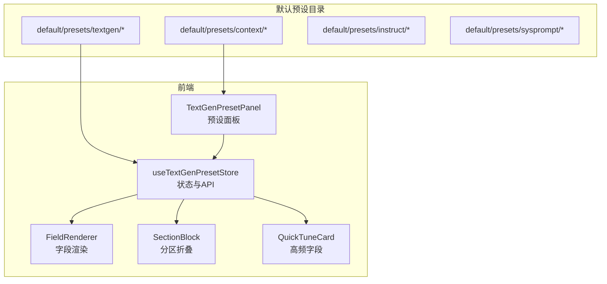
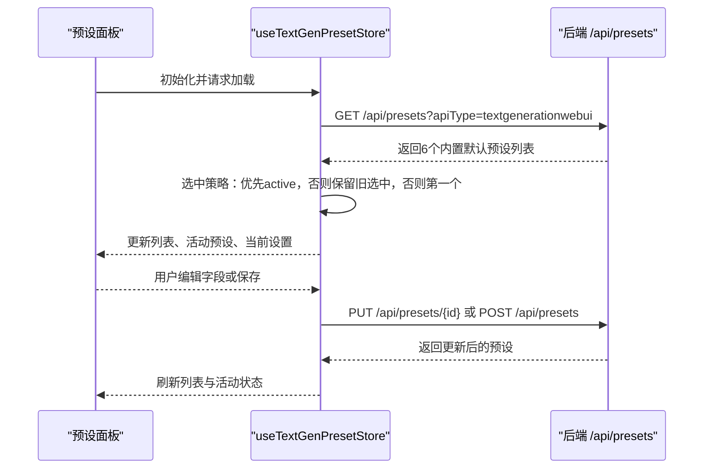
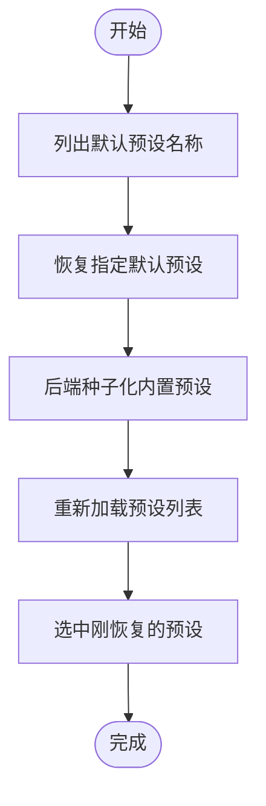
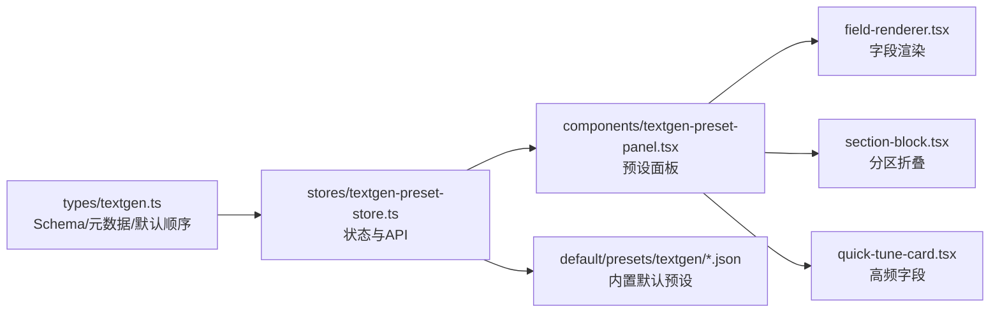

# 内置默认预设

<cite>
**本文引用的文件**
- [default/presets/textgen/Default.json](file://default/presets/textgen/Default.json)
- [default/presets/textgen/Deterministic.json](file://default/presets/textgen/Deterministic.json)
- [default/presets/textgen/Universal-Creative.json](file://default/presets/textgen/Universal-Creative.json)
- [default/presets/textgen/Universal-Light.json](file://default/presets/textgen/Universal-Light.json)
- [default/presets/textgen/Universal-Super-Creative.json](file://default/presets/textgen/Universal-Super-Creative.json)
- [src/stores/textgen-preset-store.ts](file://src/stores/textgen-preset-store.ts)
- [src/components/textgen-preset/textgen-preset-panel.tsx](file://src/components/textgen-preset/textgen-preset-panel.tsx)
- [src/types/textgen.ts](file://src/types/textgen.ts)
- [src/components/textgen-preset/quick-tune-card.tsx](file://src/components/textgen-preset/quick-tune-card.tsx)
- [src/components/textgen-preset/field-renderer.tsx](file://src/components/textgen-preset/field-renderer.tsx)
- [src/components/textgen-preset/section-block.tsx](file://src/components/textgen-preset/section-block.tsx)
- [default/presets/context/Default.json](file://default/presets/context/Default.json)
</cite>

## 目录
1. [简介](#简介)
2. [项目结构](#项目结构)
3. [核心组件](#核心组件)
4. [架构总览](#架构总览)
5. [详细组件分析](#详细组件分析)
6. [依赖关系分析](#依赖关系分析)
7. [性能考量](#性能考量)
8. [故障排查指南](#故障排查指南)
9. [结论](#结论)
10. [附录](#附录)

## 简介
本文件系统性梳理并解读“内置默认预设”体系，聚焦文本生成（Text Generation）领域的默认预设设计与应用。内容涵盖：
- 设计理念与适用场景：解释默认预设如何平衡创造性与稳定性，以及在不同任务中的取舍。
- 参数配置特点与使用建议：逐项解析温度、Top-P/K、重复惩罚、DRY、Mirostat、CFG、XTC/N-Sigma/Adaptive、束搜索、截断、语法/JSON Schema、禁用 Token、生成控制等关键参数。
- 分类体系：给出“创意型”“确定性/稳定型”“通用型”的分类与代表预设，便于快速选择。
- 版本管理与更新机制：说明内置预设的恢复流程、导入导出与跨设备同步能力。
- 自定义扩展方法：指导如何在现有框架下扩展与优化预设。
- 服务提供商适配：结合不同后端（如 Text Generation WebUI、llama.cpp、Aphrodite、TabbyAPI 等）给出推荐与配置要点。

## 项目结构
内置默认预设主要位于 default/presets 目录，按用途分为三类：
- textgen：文本生成的采样与控制参数集合，包含多个默认预设（如 Default、Deterministic、Universal-*）。
- context：上下文拼接模板，用于角色/世界信息与对话历史的组织（例如 Default.json）。
- instruct/sysprompt：指令与系统提示模板（不在本文重点范围内，但与预设协同工作）。

前端通过 Store 与 UI 组件管理预设的加载、切换、编辑、保存、恢复与导入导出。

图表来源
- [src/components/textgen-preset/textgen-preset-panel.tsx:22-144](file://src/components/textgen-preset/textgen-preset-panel.tsx#L22-L144)
- [src/stores/textgen-preset-store.ts:85-370](file://src/stores/textgen-preset-store.ts#L85-L370)
- [src/components/textgen-preset/field-renderer.tsx:14-184](file://src/components/textgen-preset/field-renderer.tsx#L14-L184)
- [src/components/textgen-preset/section-block.tsx:23-79](file://src/components/textgen-preset/section-block.tsx#L23-L79)
- [src/components/textgen-preset/quick-tune-card.tsx:27-60](file://src/components/textgen-preset/quick-tune-card.tsx#L27-L60)

章节来源
- [src/components/textgen-preset/textgen-preset-panel.tsx:22-144](file://src/components/textgen-preset/textgen-preset-panel.tsx#L22-L144)
- [src/stores/textgen-preset-store.ts:85-370](file://src/stores/textgen-preset-store.ts#L85-L370)

## 核心组件
- 预设存储与状态管理：负责加载、选择、保存、激活、恢复默认、导入导出等操作，并以 Schema 校验与补齐字段。
- 预设面板：提供字段编辑、采样顺序、Logit Bias 三个 Tab，内置高频字段快速调整卡片。
- 字段元数据与渲染：统一的字段元数据（含中文标签、英文原名、取值范围、提示、是否支持某后端）驱动 UI 渲染与校验。
- 默认预设文件：以 JSON 形式提供一组完整的采样参数，覆盖主流采样策略与控制开关。

章节来源
- [src/stores/textgen-preset-store.ts:25-65](file://src/stores/textgen-preset-store.ts#L25-L65)
- [src/components/textgen-preset/textgen-preset-panel.tsx:15-19](file://src/components/textgen-preset/textgen-preset-panel.tsx#L15-L19)
- [src/types/textgen.ts:240-387](file://src/types/textgen.ts#L240-L387)

## 架构总览
以下序列图展示“加载内置默认预设”的端到端流程，体现前端 Store 如何与后端 API 协作完成种子化与选中策略。

图表来源
- [src/stores/textgen-preset-store.ts:101-137](file://src/stores/textgen-preset-store.ts#L101-L137)
- [src/stores/textgen-preset-store.ts:179-205](file://src/stores/textgen-preset-store.ts#L179-L205)
- [src/stores/textgen-preset-store.ts:207-234](file://src/stores/textgen-preset-store.ts#L207-L234)

章节来源
- [src/stores/textgen-preset-store.ts:101-137](file://src/stores/textgen-preset-store.ts#L101-L137)
- [src/stores/textgen-preset-store.ts:179-234](file://src/stores/textgen-preset-store.ts#L179-L234)

## 详细组件分析

### 默认预设文件概览与设计理念
- Default.json：通用默认，强调“温和的创造性”，适合大多数日常对话与创作任务。
- Deterministic.json：确定性优先，关闭采样、启用 Top-K 贪心策略，适合需要稳定、可复现的场景。
- Universal-Creative.json / Universal-Light.json / Universal-Super-Creative.json：面向创意写作与内容生产的系列预设，温度与核采样策略逐步增强，满足从轻度到极致创意的需求。

章节来源
- [default/presets/textgen/Default.json:1-122](file://default/presets/textgen/Default.json#L1-L122)
- [default/presets/textgen/Deterministic.json:1-120](file://default/presets/textgen/Deterministic.json#L1-L120)
- [default/presets/textgen/Universal-Creative.json:1-120](file://default/presets/textgen/Universal-Creative.json#L1-L120)
- [default/presets/textgen/Universal-Light.json:1-120](file://default/presets/textgen/Universal-Light.json#L1-L120)
- [default/presets/textgen/Universal-Super-Creative.json:1-120](file://default/presets/textgen/Universal-Super-Creative.json#L1-L120)

### 参数配置特点与使用建议
以下依据字段元数据与默认预设文件进行归纳，帮助快速定位参数影响与调优方向：

- 基础采样
  - 温度（temp）：控制输出随机性。较低值更稳定、逻辑性强；较高值更具创造性。建议新手从温和值开始，逐步上调。
  - Top-P（top_p）、Top-K（top_k）、Top-A（top_a）、Min-P（min_p）、典型 P（typical_p）、尾部自由采样（tfs）：核采样与变体组合，用于裁剪候选空间，避免极端 token。
  - 建议：先调温，再配合 Top-P/Top-K；若出现啰嗦，优先收紧 Top-P；若出现重复，考虑引入 DRY 或重复惩罚。

- 重复惩罚
  - 重复惩罚（rep_pen）、重复惩罚范围（rep_pen_range）、衰减（rep_pen_decay）、斜率（rep_pen_slope）、N-gram 禁止（no_repeat_ngram_size）、频率/存在惩罚（freq_pen、presence_pen）、编码器重复惩罚（encoder_rep_pen）。
  - 建议：适度提升重复惩罚可显著降低循环；过大可能破坏连贯性；N-gram 禁止适合严格场景。

- 动态温度
  - 动态温度（dynatemp）及上下界、指数。适用于长文本或情绪波动较大的内容。
  - 建议：开启后配合上下界，避免极端波动。

- 平滑与 DRY
  - 平滑因子/曲线（smoothing_factor、smoothing_curve）：实验性，改善候选分布。
  - DRY（dry_multiplier、dry_base、dry_allowed_length、dry_penalty_last_n、序列分隔符）：新一代防重复策略，效果优于传统惩罚。
  - 建议：DRY 通常比重复惩罚更自然；可与重复惩罚叠加使用。

- Mirostat
  - 模式（mirostat_mode）、τ（mirostat_tau）、η（mirostat_eta）。维持目标困惑度，适合稳定风格输出。
  - 建议：模式 2 在多数场景表现稳定；τ 与 η 需结合具体模型微调。

- CFG（无分类引导）
  - 引导强度（guidance_scale）与负面提示词（negative_prompt）。对模型进行反向引导。
  - 建议：强度不宜过高，避免过度“刻意”。

- XTC / N-Sigma / Adaptive
  - XTC 阈值/概率（xtc_threshold、xtc_probability）、N-Sigma（nsigma）、最少保留（min_keep）、Adaptive 目标/衰减（adaptive_target、adaptive_decay）。
  - 建议：实验性功能，谨慎开启；XTC 适合抑制极端高概率 token。

- 束搜索
  - α（penalty_alpha）、束宽（num_beams）、长度惩罚（length_penalty）、最小长度（min_length）、提前停止（early_stopping）。
  - 建议：束宽越大越慢；适合需要结构化、稳定的长文本。

- 截断
  - Epsilon 截断（epsilon_cutoff）、Eta 截断（eta_cutoff）。过滤低概率候选。
  - 建议：与核采样配合使用，避免极端 token。

- 语法与结构化输出
  - 语法约束（grammar_string，GBNF）、JSON Schema（json_schema）、允许空输出（json_schema_allow_empty）。
  - 建议：仅在后端支持时启用；JSON Schema 对齐模型能力。

- 禁用 Token 与生成控制
  - 禁用列表（banned_tokens、global_banned_tokens）、发送禁用列表（send_banned_tokens）、禁用/忽略 EOS（ban_eos_token、ignore_eos_token）、跳过特殊 Token（skip_special_tokens）、采样开关（do_sample）、种子（seed）、偏斜（skew）、BOS、空格策略、包含思考过程（include_reasoning）、推测解码（speculative_ngram）、流式输出（streaming）、速率限制（max_tokens_second）。
  - 建议：合理设置 EOS 行为与特殊 Token 处理；流式输出适合交互体验；种子用于复现实验。

章节来源
- [src/types/textgen.ts:273-387](file://src/types/textgen.ts#L273-L387)
- [default/presets/textgen/Default.json:1-122](file://default/presets/textgen/Default.json#L1-L122)
- [default/presets/textgen/Deterministic.json:1-120](file://default/presets/textgen/Deterministic.json#L1-L120)
- [default/presets/textgen/Universal-Creative.json:1-120](file://default/presets/textgen/Universal-Creative.json#L1-L120)
- [default/presets/textgen/Universal-Light.json:1-120](file://default/presets/textgen/Universal-Light.json#L1-L120)
- [default/presets/textgen/Universal-Super-Creative.json:1-120](file://default/presets/textgen/Universal-Super-Creative.json#L1-L120)

### 分类体系与适用场景
- 创意型
  - 代表：Universal-Creative.json、Universal-Super-Creative.json
  - 特点：温度较高、核采样宽松、倾向探索多样输出；适合故事创作、头脑风暴、诗歌生成等。
  - 使用建议：搭配 DRY 与适度重复惩罚，避免过度啰嗦；必要时启用 JSON Schema 保证结构。

- 确定性/稳定型
  - 代表：Deterministic.json
  - 特点：关闭随机采样、采用 Top-K 贪心策略；追求稳定与可复现。
  - 使用建议：适合问答、摘要、规则检查、测试用例生成等。

- 通用型
  - 代表：Default.json、Universal-Light.json
  - 特点：在创造性和稳定性之间取得平衡；适合大多数日常对话与内容生产。
  - 使用建议：以温度与 Top-P 为主调，辅以重复惩罚与 DRY；根据模型特性微调。

章节来源
- [default/presets/textgen/Default.json:1-122](file://default/presets/textgen/Default.json#L1-L122)
- [default/presets/textgen/Deterministic.json:1-120](file://default/presets/textgen/Deterministic.json#L1-L120)
- [default/presets/textgen/Universal-Creative.json:1-120](file://default/presets/textgen/Universal-Creative.json#L1-L120)
- [default/presets/textgen/Universal-Light.json:1-120](file://default/presets/textgen/Universal-Light.json#L1-L120)
- [default/presets/textgen/Universal-Super-Creative.json:1-120](file://default/presets/textgen/Universal-Super-Creative.json#L1-L120)

### 版本管理、更新机制与自定义扩展
- 内置默认预设的恢复：前端通过“恢复默认”接口将后端种子化的默认预设写回数据库并选中。
- 列表与命名：前端可列出可用的默认预设名称，便于批量恢复。
- 导入导出：支持 JSON 导入与导出，便于跨设备同步与团队共享。
- 自定义扩展：可在现有 Schema 与 UI 元数据基础上新增字段或调整默认值；注意与后端能力匹配。

图表来源
- [src/stores/textgen-preset-store.ts:291-320](file://src/stores/textgen-preset-store.ts#L291-L320)
- [src/stores/textgen-preset-store.ts:101-137](file://src/stores/textgen-preset-store.ts#L101-L137)
- [src/stores/textgen-preset-store.ts:139-153](file://src/stores/textgen-preset-store.ts#L139-L153)

章节来源
- [src/stores/textgen-preset-store.ts:291-320](file://src/stores/textgen-preset-store.ts#L291-L320)
- [src/stores/textgen-preset-store.ts:101-153](file://src/stores/textgen-preset-store.ts#L101-L153)

### 服务提供商适配与推荐
- Text Generation WebUI（ooba）：默认顺序与字段支持完备，适合大多数场景。
- llama.cpp：采样器顺序与字段略有差异，注意核采样与 DRY 的组合。
- Aphrodite：采样器优先级与顺序不同于 ooba，需按其默认顺序调整。
- TabbyAPI：支持 JSON Schema 结构化输出，适合需要强约束的任务。
- 其他后端（如 vLLM、Mancer、OpenRouter、Ollama 等）：通过字段支持检测与 UI 禁用提示，避免不兼容配置。

章节来源
- [src/types/textgen.ts:47-103](file://src/types/textgen.ts#L47-L103)
- [src/types/textgen.ts:263-267](file://src/types/textgen.ts#L263-L267)

## 依赖关系分析
- Store 依赖类型定义与默认顺序常量，确保字段校验与 UI 渲染一致。
- 面板组件依赖 Store 的状态与回调，实现字段编辑、采样顺序与 Logit Bias 编辑。
- 字段渲染器根据元数据动态生成控件，统一行为与提示。

图表来源
- [src/types/textgen.ts:117-233](file://src/types/textgen.ts#L117-L233)
- [src/stores/textgen-preset-store.ts:85-370](file://src/stores/textgen-preset-store.ts#L85-L370)
- [src/components/textgen-preset/textgen-preset-panel.tsx:22-144](file://src/components/textgen-preset/textgen-preset-panel.tsx#L22-L144)
- [src/components/textgen-preset/field-renderer.tsx:14-184](file://src/components/textgen-preset/field-renderer.tsx#L14-L184)
- [src/components/textgen-preset/section-block.tsx:23-79](file://src/components/textgen-preset/section-block.tsx#L23-L79)
- [src/components/textgen-preset/quick-tune-card.tsx:27-60](file://src/components/textgen-preset/quick-tune-card.tsx#L27-L60)

章节来源
- [src/types/textgen.ts:117-233](file://src/types/textgen.ts#L117-L233)
- [src/stores/textgen-preset-store.ts:85-370](file://src/stores/textgen-preset-store.ts#L85-L370)

## 性能考量
- 采样器顺序与优先级：合理的顺序可减少无效计算，提升生成效率与质量。
- 采样策略选择：核采样与 Top-K/Top-P 组合通常比单一策略更高效；束搜索与流式输出互斥，需按场景取舍。
- DRY 与重复惩罚：DRY 更高效且更自然，适合大多数创意场景；重复惩罚范围与衰减需权衡连贯性与稳定性。
- 结构化输出：启用 JSON Schema 与语法约束会增加推理成本，建议在后端支持的前提下按需开启。

## 故障排查指南
- 预设加载失败：检查后端 /api/presets 接口响应与网络状态；查看 Store 错误字段。
- 字段不可用：某些字段在特定后端不支持，UI 会禁用；请参考字段支持检测函数。
- 保存失败：确认当前存在活动预设 ID；检查后端返回错误信息。
- 导入异常：JSON 格式错误或字段不兼容会导致导入失败；建议先导出示例进行对照。

章节来源
- [src/stores/textgen-preset-store.ts:131-136](file://src/stores/textgen-preset-store.ts#L131-L136)
- [src/stores/textgen-preset-store.ts:198-204](file://src/stores/textgen-preset-store.ts#L198-L204)
- [src/stores/textgen-preset-store.ts:227-233](file://src/stores/textgen-preset-store.ts#L227-L233)
- [src/stores/textgen-preset-store.ts:345-349](file://src/stores/textgen-preset-store.ts#L345-L349)

## 结论
内置默认预设体系以“可解释、可迁移、可扩展”为目标，通过统一的字段元数据与 Schema 校验，确保不同后端与不同任务下的稳定一致性。建议用户从通用型预设起步，结合任务特性逐步微调关键参数；在团队协作中，优先使用导入导出与恢复默认机制，保障一致性与可追溯性。

## 附录
- 上下文模板 Default.json：展示了故事串接、示例分隔、角色名处理等上下文拼装策略，与文本生成预设协同工作，形成完整的对话/创作环境。

章节来源
- [default/presets/context/Default.json:1-15](file://default/presets/context/Default.json#L1-L15)